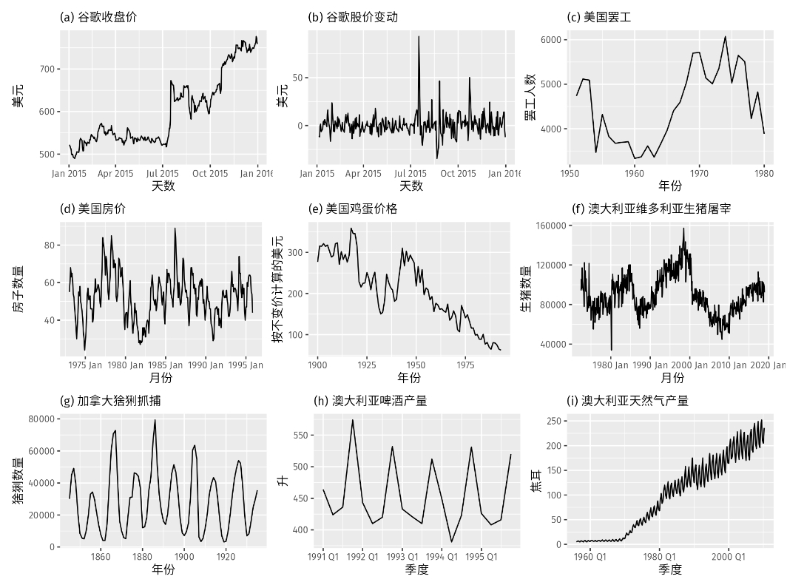

目录

- [平稳性和差分](#平稳性和差分)
  - [平稳性](#平稳性)
  - [差分](#差分)
  - [随机游走](#随机游走)
    - [随机游走模型](#随机游走模型)
    - [带漂移的随机游走模型](#带漂移的随机游走模型)
- [二阶差分](#二阶差分)
- [季节性差分](#季节性差分)

ARIMA 模型提供了另一种时间序列预测的方法。
指数平滑模型(exponential smoothing)和 ARIMA 模型是应用最为广泛的两种时间序列预测方法，
基于对这两种预测方法的拓展，很多其他的预测方法得以诞生。
与指数平滑模型针对于数据中的趋势(trend)和季节性(seasonality)不同，
ARIMA 模型旨在描绘数据的自回归性(autocorrelations)。

在引入 ARIMA 模型之前，我们需要先讨论平稳性(stationarity)和差分时间序列(differencing time series)的相关知识。

# 平稳性和差分

## 平稳性

平稳的时间序列的性质不随观测时间的变化而变化。 
因此具有趋势或季节性的时间序列不是平稳时间序列——趋势和季节性使得时间序列在不同时段呈现不同性质。
与它们相反，白噪声序列(white noise series)则是平稳的——不管观测的时间如何变化，
它看起来都应该是一样的。

在判断平稳性上，下面这个例子容易让人混淆：如果一个循环变化的时间序列没有趋势和季节性，
那么它仍然是平稳的。这是因为这些循环变化并没有一个固定的周期，
因此在进行观测之前我们无法知道循环变化的峰值和谷值会出现在哪个位置。

一般而言，一个平稳的时间序列从长期来看不存在可预测的特征。
它的时间曲线图(time plots)反映出这个序列大致保持水平(尽管可能存在一些周期性的变化)并保持固定的方差。

一个分辨平稳时间序列示例：

* 显然序列 (d)，(h) 和 (i)因存在季节性因素而被排除
* 序列 (a)，(c)，(e)，(f) 和 (i) 因为存在趋势和变化水平而被排除
* 序列 (i) 由于存在增长的方差被排除
* 只有 (b) 和 (g) 是平稳时间序列

序列 (g) 的循环变化让它第一眼看上去不太平稳，但是这种变化其实是非周期性的——当猞猁的数量超过食物承载的上限时，
它们会停止繁殖从而使得数量回落到非常低的水平，之后食物来源的再生使得猞猁数量重新增长，以此周而复始。
从长期来看，这种循环的时间点是不能预测的，因此序列 (g) 是平稳的。

## 差分

在下图中，我们注意到 (a) 中谷歌股价数并不平稳，但 (b) 中谷歌股价每天的变化量则是平稳的。
这向我们展示了一种让非平稳时间序列变平稳的方法——计算相邻观测值之间的差值，这种方法被称为 差分。

诸如 对数变换 的变换方法可用于平稳化时间序列的方差。差分则可以通过去除时间序列中的一些变化特征来平稳化它的均值，
并因此消除（或减小）时间序列的趋势和季节性。

和时间曲线图一样，自相关图（ACF图）也能帮助我们识别非平稳时间序列。对于一个平稳时间序列，
自相关系数（ACF）会快速的下降到接近 0 的水平，然而非平稳时间序列的自相关系数会下降的比较缓慢。
同样的，非平稳时间序列的 `$r_{1}$` 通常非常大且为正值。

差分后的谷歌股价的自相关图看起来像白噪声序列。只有一个自相关系数超出了 95% 的限制。

## 随机游走

> * TODO：[随机漫步 Demo](https://wangzhefeng.com/note/2020/05/06/random-walk/)
> * TODO: [随机游走解释](https://wangzhefeng.com/note/2023/03/03/timeseries-stationarity-stochasticity/#%E9%9A%8F%E6%9C%BA%E6%B8%B8%E8%B5%B0)

### 随机游走模型

差分序列是指原序列的连续观测值之间的变化值组成的时间序列，它可以被表示为：

`$$y'_{t}=y_{t} - y_{t-1}$$`

差分序列的长度只有 `$T-1$` 个，因为第一个观测值 `$y'_{1}$` 的差值无法计算。

当差分序列是白噪声时，原序列的模型可以表示为：

`$$y_{t}-y_{t-1} = \varepsilon_{t}$$`

这里 `$\varepsilon_{t}$` 是白噪声。

调整上式，即可得到”随机游走”模型：

`$$y_{t}=y_{t-1}+\varepsilon_{t}$$`

随机游走模型在非平稳时间序列数据中应用广泛，特别是金融和经济数据。典型的随机游走通常具有以下特征：

* 长期的明显上升或下降趋势
* 游走方向上突然的、不能预测的变化
* 由于未来变化是不可预测的，随机游走模型的预测值为上一次观测值，
  并且其上升和下降的可能性相同。因此，随机游走模型是朴素(naive)预测的基础

### 带漂移的随机游走模型

通过稍许改进，我们可以让差值均值不为零，从而：

`$$y_{t}-y_{t-1}=c+\varepsilon_{t}$$`

或者

`$$y_{t} = c+ y_{t-1}+\varepsilon_{t}$$`

其中：

* `$c$` 值是连续观测值变化的平均值，如果 `$c$` 值为正，则之前的平均变化情况是增长的，
  因此 `$y_{t}$` 将倾向于继续向上漂移(drift)。反之如果 `$c$` 值为负，`$y_{t}$` 将倾向于向下漂移。

# 二阶差分

有时差分后的数据仍然不平稳，所以可能需要再一次对数据进行差分来得到一个平稳的序列：

`$$\begin{align*}
y^{\prime\prime}_{t}  &=  y^{\prime}_{t} - y^{\prime}_{t - 1} \\
           &= (y_t - y_{t-1}) - (y_{t-1}-y_{t-2})\\
           &= y_t - 2y_{t-1} +y_{t-2}.
\end{align*}$$`

在这种情况下，序列 `$y_{t}$` 的长度为 `$T-2$`。之后我们可以对原数据的”变化的变化”进行建模。
在现实应用中，通常没有必要进行二阶以上的差分。

# 季节性差分