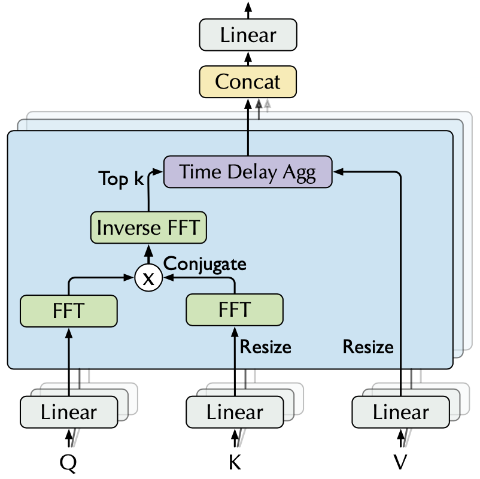
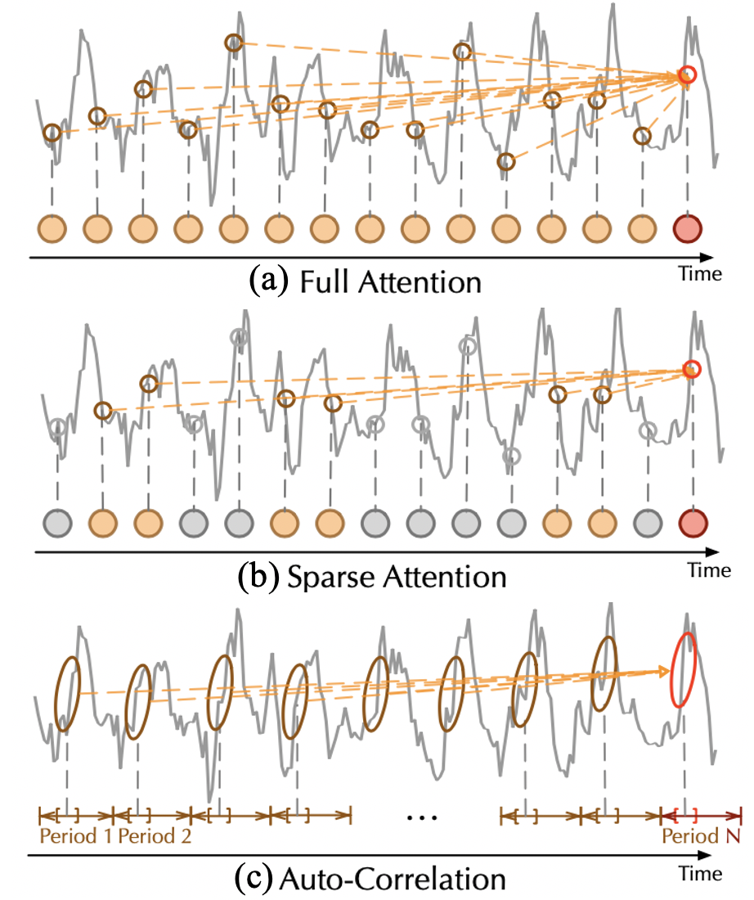

目录

- [论文信息](#论文信息)
- [背景介绍](#背景介绍)
- [历史研究和瓶颈](#历史研究和瓶颈)
- [论文贡献](#论文贡献)
- [模型定义](#模型定义)
  - [深度分解架构](#深度分解架构)
    - [序列分解单元](#序列分解单元)
    - [编码器](#编码器)
    - [解码器](#解码器)
  - [自相关机制](#自相关机制)
    - [基于周期的依赖发现](#基于周期的依赖发现)
    - [时延信息聚合](#时延信息聚合)
    - [高效计算](#高效计算)
    - [对比分析](#对比分析)
- [总结](#总结)
- [参考](#参考)

# 论文信息

* 论文名称：Autoformer: **Decomposition** Transformers with **Auto-Correlation** for Long-Term Series Forecasting.
* 论文地址：[https://arxiv.org/abs/2106.13008](https://arxiv.org/abs/2106.13008)
* 论文代码：
    - [https://github.com/thuml/Time-Series-Library](https://github.com/thuml/Time-Series-Library)
    - [https://github.com/thuml/Autoformer](https://github.com/thuml/Autoformer)

# 背景介绍

本文探索了**长期时间序列预测**问题：待预测的序列长度远远大于输入长度，即基于有限的信息预测更长远的未来。
上述需求使得此预测问题极具挑战性，对于模型的预测能力及计算效率有着很强的要求。

# 历史研究和瓶颈

之前基于 Transformer 的时间序列预测模型，通过自注意力机制(self-attention)来捕捉时刻间的依赖，
在时序预测上取得了一些进展。但是在长期序列预测中，仍存在不足：

* 长序列中的复杂时间模式使得注意力机制难以发现可靠的时间依赖
* 基于 Transformer 的模型不得不使用稀疏形式的注意力机制来应对二次复杂的问题，
  但造成了信息利用的瓶颈 

|                | 基于 Transformer 的预测模型 | Autoformer |
|----------------|---------------------------|------------|
| 应对复杂时间模式 | 难以直接发现可靠的时间依赖 | 深度分解架构，得到可预测的组分 |
| 长序列高效处理   | 稀疏注意力机制带来信息利用瓶颈 | 自相关机制，高效、序列级连接 |

# 论文贡献

Autoformer 模型的创新：

* 突破将序列分解作为预处理的传统方法，提出**深度分解架构(Decomposition Architecture)**，
  能够从复杂时间模式中分解出可预测性更强的组分。
* 基于随机过程理论，提出**自相关机制(Auto-Correlation Mechanism)**，
  代替点向连接的注意力机制，实现序列级(series-wise)连接和复杂度，打破信息利用瓶颈。

在长期预测问题中，Autoformer 在能源、交通、经济、气象、疾病五大时序领域大幅超越之前 SOTA，
实现 38% 的相对效果提升。

# 模型定义

Autoformer 全面革新 Transformer 为深度分解架构，
包括**内部的序列分解单元**、**自相关机制**以及对应的**编-解码器**。

## 深度分解架构

时间序列分解是指将时间序列分解为几个组分，每个组分表示一类潜在的时间模式，
如周期项(seasonal)，趋势项(trend-cyclical)。由于预测问题中未来的不可知性，
通常先对过去序列进行分解，再分别预测。但这会造成预测结果受限于分解效果，
并且忽视了未来各个组分之间的相互作用。

Autoformer 提出深度分解架构，将序列分解作为 Autoformer 的一个内部单元，嵌入到编-解码器中。
在预测过程中，模型交替进行预测结果优化和序列分解，即从隐变量中逐步分离趋势项与周期项，实现渐进式分解。

### 序列分解单元

序列分解单元(series decomposition block)基于**滑动平均**思想，平滑周期项、突出趋势项：

`$$\mathbf{X}_{T} = \text{AvgPool}(\text{Padding}(\mathbf{X}))$$`
`$$\mathbf{X}_{S} = \mathbf{X} - \mathbf{X}_{T}$$`

其中，`$\mathbf{X}$` 为待分解的隐变量，`$\mathbf{X}_{T}$`、`$\mathbf{X}_{S}$` 分别为趋势项和周期项，
将上述公式记为：

`$$\mathbf{X}_{S}, \mathbf{X}_{T} = SeriesDecomp(\mathbf{X})$$`

将上述序列分解单元嵌入 Autoformer 层间（上图中蓝色模块）。

### 编码器

在 Encoder 部分，逐步消除趋势项（这部分会在 Deocder 中通过累积得到），
得到周期项 `$\mathbf{S}_{encoder}^{l,1}$`，`$\mathbf{S}_{encoder}^{l,2}$`。
而基于这种周期性，设计**自相关机制**，聚合不同周期的相似子过程，实现信息聚合：

`$$\mathbf{S}_{encoder}^{l, 1}, \text{_} = SeriesDecomp\Big(AutoCorrelation(\mathbf{X}_{encoder}^{l-1}) + \mathbf{X}_{encoder}^{l-1}\Big)$$`
`$$\mathbf{S}_{encoder}^{l, 2}, \text{_} = SeriesDecomp\Big(FeedForward(\mathbf{S}_{encoder}^{l, 1}) + \mathbf{S}_{encoder}^{l,1}\Big)$$`

### 解码器

在 Decoder 部分，对趋势项与周期项分别建模。其中，

* 对于周期项，自相关机制利用序列的周期性质，聚合不同周期中具有相似过程的子序列；
* 对于趋势项，使用累积的方式，逐步从预测的隐变量中提取出趋势信息（最后一行）。

`$$\mathbf{S}_{decoder}^{l,1}, \mathbf{T}_{decoder}^{l,1} = \text{SeriesDecomp}\Big(\text{AutoCorrelation}(\mathbf{X}_{decoder}^{l-1})+\mathbf{X}_{decoder}^{l-1}\Big)$$`
`$$\mathbf{S}_{decoder}^{l,2}, \mathbf{T}_{decoder}^{l,2} = \text{SeriesDecomp}\Big(\text{AutoCorrelation}(\mathbf{S}_{decoder}^{l,1}, \mathbf{X}_{decoder}^{N})+\mathbf{S}_{decoder}^{l,1}\Big)$$`
`$$\mathbf{S}_{decoder}^{l,3}, \mathbf{T}_{decoder}^{l,3} = \text{SeriesDecomp}\Big(\text{FeedForward}(\mathbf{S}_{decoder}^{l,2})+\mathbf{S}_{decoder}^{l,2}\Big)$$`

`$$\mathbf{T}_{decoder}^{l} = \mathbf{T}_{decoder}^{l-1} + \mathbf{W}_{l,1} \mathbf{T}_{decoder}^{l, 1} +\mathbf{W}_{l,2}\mathbf{T}_{decoder}^{l,2}+\mathbf{W}_{l,3}\mathbf{T}_{decoder}^{l,3}$$`

基于上述渐进式分解架构，模型可以在预测过程中逐步分解隐变量，
并通过自相关机制、累积的方式分别得到周期、趋势组分的预测结果，
实现分解、预测结果优化的交替进行、相互促进。

## 自相关机制

提出自相关机制来实现高效的序列级连接，从而扩展信息效用。
观察到，不同周期的相似相位之间通常表现出相似的子过程，
利用这种序列固有的周期性来设计自相关机制，其中，
包含基于周期的依赖发现(Period-based dependencies)和时延信息聚合(Time delay aggregation)。

### 基于周期的依赖发现

基于随机过程理论，对于实离散时间过程 `$\{\mathbf{X}_{t}\}$`，可以如下计算其自相关系数：

`$$\mathbf{R}_{\mathbf{X}\mathbf{X}}(\tau) = \underset{L \rightarrow \infty}{\text{lim}}\frac{1}{L}\sum_{t=0}^{L-1}\mathbf{X}_{t}\mathbf{X}_{t-\tau}$$`

其中，自相关系数 `$\mathbf{R}_{\mathbf{X}\mathbf{X}}(\tau)$` 表示序列 `$\mathbf{X}_{t}$` 与它的 `$\tau$` 延迟 `$\mathbf{X}_{t-\tau}$` 之间的相似性。

将这种时延相似性看作未归一化的周期估计的置信度，即周期长度为 `$\tau$` 的置信度为 `$\mathbf{R}(\tau)$`。

### 时延信息聚合

为了实现序列级连接，需要将相似的子序列信息进行聚合。
这里依据估计出的周期长度，首先使用 `$Roll()$` 操作进行信息对齐，
再进行信息聚合，我们这里依然使用 query、key、value 的形式，从而可以无缝替代自注意力机制。

`$$\tau_{1}, \cdots, \tau_{k} = \underset{\tau \in \{1, \cdots, L\}}{\text{arg}}\text{Topk}(\mathbf{R}_{\mathbf{Q}, \mathbf{K}}(\tau))$$`

`$$\hat{\mathbf{R}}_{\mathbf{Q}, \mathbf{K}}(\tau_{1}), \cdots, \hat{\mathbf{R}}_{\mathbf{Q}, \mathbf{K}}(\tau_{k}) = \text{SoftMax}(\mathbf{R}_{\mathbf{Q}, \mathbf{K}}(\tau_{1}), \cdots, \mathbf{R}_{\mathbf{Q}, \mathbf{K}}(\tau_{k}))$$`

`$$\text{AutoCorrelation}(\mathbf{Q}, \mathbf{K}, \mathbf{V}) = \sum_{i=1}^{k}\text{Roll}(\mathbf{V}, \tau_{k})\hat{\mathbf{R}}_{\mathbf{Q},\mathbf{K}}(\tau_{k})$$`

这里挑选最有可能的 `$k=[c \times \text{log}L]$` 个周期长度，用于避免挑选到无关、甚至相反的相位。
在 Autoformer 中，使用多头(multi-head) 版本。

### 高效计算

基于 Wiener-Khinchin 理论，自相关系数 `$\mathbf{R}_{\mathbf{X}, \mathbf{X}}(\tau)$` 可以使用快速傅立叶变换（FFT）得到，计算过程如下：

`$$\mathbf{S}_{\mathbf{X}, \mathbf{X}}(f)=\mathbf{F}(\mathbf{X}_{t})\mathbf{F}^{*}(\mathbf{X}_{t})=\int_{-\infty}^{\infty}\text{X}_{t}e^{-i2\pi t f}\text{d}t \overline{\int_{-\infty}^{\infty}\text{X}_{t}e^{-i2\pi t f}dt}$$`
`$$\mathbf{R}_{\mathbf{X}, \mathbf{X}}(\tau)=\mathbf{F}^{-1}(\mathbf{S}_{\mathbf{X}, \mathbf{X}}(f))=\int_{-\infty}^{\infty}\mathbf{S}_{\mathbf{X}, \mathbf{X}}(f)e^{i2\pi f \tau}\text{d}f$$`

### 对比分析

相比于之前的注意力机制或者稀疏注意力机制，
自注意力机制（Auto-Correlation Mechanism）实现了序列级的高效连接，
从而可以更好的进行信息聚合，打破了信息利用瓶颈。

# 总结

针对长时序列预测中的复杂时间模式难以处理与运算效率高的问题，
提出了基于深度分解架构和自相关机制的 Autoformer 模型。
通过渐进式分解和序列级连接，大幅提高了长时预测效率。

同时，Autoformer 在能源、交通、经济、气象、疾病五大主流领域均表现出了优秀的长时预测结果，
模型具有良好的效果鲁棒性，具有很强的应用落地价值。

# 参考

* [Autoformer: 基于深度分解架构和自相关机制的长期序列预测模型](https://zhuanlan.zhihu.com/p/385066440)
