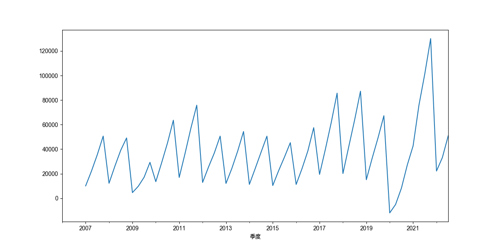
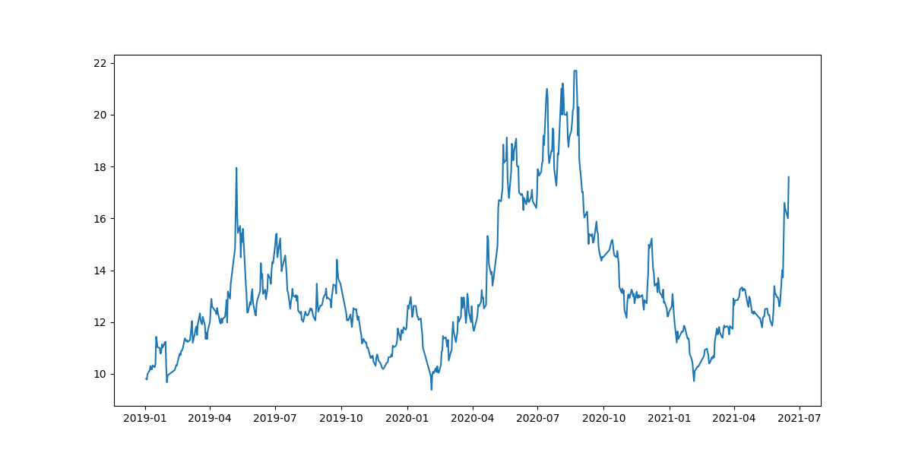
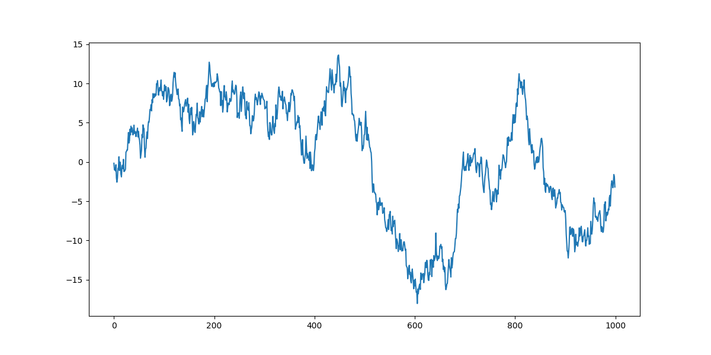
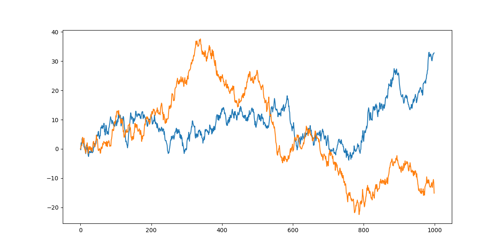

<style>
details {
    border: 1px solid #aaa;
    border-radius: 4px;
    padding: .5em .5em 0;
}
summary {
    font-weight: bold;
    margin: -.5em -.5em 0;
    padding: .5em;
}
details[open] {
    padding: .5em;
}
details[open] summary {
    border-bottom: 1px solid #aaa;
    margin-bottom: .5em;
}
</style>

<details><summary>目录</summary><p>

- [时间序列介绍](#时间序列介绍)
  - [时间序列发展历程](#时间序列发展历程)
  - [时间序列的定义](#时间序列的定义)
  - [时间序列的研究领域](#时间序列的研究领域)
  - [时间序列的类型](#时间序列的类型)
- [时间序列平稳性](#时间序列平稳性)
  - [时间序列平稳性](#时间序列平稳性-1)
    - [严平稳](#严平稳)
    - [宽平稳](#宽平稳)
    - [严平稳与宽平稳的关系](#严平稳与宽平稳的关系)
  - [平稳时间序列](#平稳时间序列)
    - [白噪声](#白噪声)
    - [非白噪声](#非白噪声)
  - [非平稳时间序列](#非平稳时间序列)
    - [股票收盘价](#股票收盘价)
    - [随机游走](#随机游走)
    - [带漂移项的随机游走](#带漂移项的随机游走)
  - [时间序列平稳性理解](#时间序列平稳性理解)
    - [时间序列随机变量的分布](#时间序列随机变量的分布)
    - [严平稳](#严平稳-1)
    - [宽平稳](#宽平稳-1)
  - [时间序列平稳性检验](#时间序列平稳性检验)
    - [图形分析方法](#图形分析方法)
    - [简单统计方法](#简单统计方法)
    - [假设检验方法](#假设检验方法)
  - [时间序列平稳性转换](#时间序列平稳性转换)
- [时间序列数据观察](#时间序列数据观察)
  - [X 轴和 Y 轴](#x-轴和-y-轴)
  - [起点和终点](#起点和终点)
  - [极值](#极值)
  - [转折点](#转折点)
  - [周期性](#周期性)
  - [波动性](#波动性)
  - [数据与参考线对比](#数据与参考线对比)
- [时间序列分析-baseline](#时间序列分析-baseline)
  - [baseline 特点](#baseline-特点)
  - [baseline 数据](#baseline-数据)
    - [数据读取](#数据读取)
    - [数据查看](#数据查看)
  - [baseline 模型](#baseline-模型)
    - [数据转换](#数据转换)
    - [建立训练集和测试集](#建立训练集和测试集)
    - [算法](#算法)
    - [预测并评估预测结果](#预测并评估预测结果)
    - [预测结果可视化](#预测结果可视化)
- [参考资料](#参考资料)
</p></details><p></p>

# 时间序列介绍

## 时间序列发展历程

最早的时间序列分析可以追溯到 7000 年前的古埃及。古埃及人把尼罗河涨落的情况逐天记录下来，
从而构成一个时间序列。对这个时间序列长期的观察使他们发现尼罗河的涨落非常有规律，
由于掌握了涨落的规律，古埃及的农业迅速发展

一般认为现代时间序列分析起源于英国统计学家 G.u.Yule 在 1927 年提出的 AR（自回归）模型。
该模型与后来的 MA（移动平均）模型，构成了时间序列分析的基础，至今仍被大量应用。
这三个模型主要应用于单变量、同方差场合的平稳序列

随着时间序列分析理论的发展，人们越来越关心方差、多变量、非线性的时间序列。
Engle 首先提出 ARCH（自回归条件异方差）模型用于处理异方差的情形；
Engle 和 Granger提出了协整理论及其方法，为多维非平稳序列的建模提供了一种途径；
Tong 和 Lim提出了 TAR（门限自回归）模型处理非线性时序等等。
这些方法都在往后的发展中不断革新，应用广泛，
例如很多方法被广泛地用于验证金融理论中的规律性描述以及金融市场的预测和决策

时间序列分析方法的另一个突破是在谱分析方面。给定一个时间序列样本，通过傅里叶变化可以把时域上的数据变换到频域，
即为经典谱分析方法。Burg在他从事的地震信号的分析与处理中提出最大熵谱，
其把信息熵的概念融入信号处理中，有时又称为时序谱分析方法，是现代谱分析的开始

随着时间序列分析的理论与应用这两方面的深入研究，时序分析应用的范围日益扩大。
目前，深度神经网络兴起，越来越多的方法采用 LSTM 进行长时序列建模与分析。
这种无参数化的方法更自动的抽取时序特征以更好的适应下游的任务。
跨时间跨维度关联分析促使矩阵方法的繁荣，寻求多源时序关联分析，
以及更结构化的时序信息表示成为现在新的研究方向


## 时间序列的定义

时间序列(Time Series) 是一组按照时间发生先后顺序进行排列的数据点序列. 
通常一组时间序列的时间间隔为一恒定值(如 1s, 5s, 1min, 1h, 1d 等). 
因此时间序列亦可作为离散时间数据进行分析处理

按照时间的顺序把随机事件变化发展的过程记录下来就构成了一个时间序列。
在统计研究中，常用按时间顺序排列的一组随机变量 `$\{\ldots, X_{1}, X_{2}, \ldots, X_{t}, \ldots\}$` 来表示一个随机事件的序列，
间记为 `$\{X_{t}, t \in T\}$`。
用 `$\{x_{1}, x_{2}, \ldots, x_{N}\}$` 或 `$\{x_{t}, t = 1, 2, \ldots, N\}$` 表示该随机序列的 `$N$` 个有序观测值。
经常认为这些观测值序列是来自一个时间序列随机过程的有限样本，这个过程从无限远的过去开始并将持续到不确定的未来：


时间序列的每个元素都被认为是一个具有概率分布的随机变量，
这里 `$x_{1}$` 可以认为是一个随机变量的一个取值，
`$x_{2}$` 等也均是具有某种分布的随机变量的一个取值(每个变量的分布可能相同也可能不同)

比如这里有一个时间序列数据 `$\{1, 3, 5, 7, 2, 6, 9\}$`，更准确的叫法应该是一个观测值序列。
虽说这里 `$t_{t}$` 时刻只有一个取值 `$1$`，`$t_{2}$` 时刻也只有一个取值 `$3$`，
但不防认为 `$t_{1}$` 时刻对应的是一个变量 `$X_{1}$`，`$t_{2}$` 时刻对应的也是一个变量 `$X_{2}$`，
变量 `$X_{1}, X_{2}$` 可能有多个取值的同时也有它们自己的概率分布，
只是在这一次的观测中分别取值 `$1$` 和 `$3$` 而已


假如序列中每个元素的分布具有共同的参数，比如每个 `$x_{t}$` 的方差 `$Var(x_{t})$` 相同，
并且每对相邻元素之间的协方差 `$Cov(x_{t}, x_{t-1})$` 也相同。
如果对于任意 `$t \in [1, N]$`，`$x_{t}$` 的分布都相同，
则认为序列是平稳的


## 时间序列的研究领域

学术界对时间序列的研究，主体分为时序表示、时序预测、模式识别、异常检测、关联分析等几大类：

* 时间序列表示
    - 该类问题旨在抽取时序数据的特征，以某些特定的形式进行表达，是时间序列研究的基础问题。
      常见的有统计特征（最大最小值、均值、分位数，方差等指标），熵特征等。
      近年来的针对序列数据的深度学习神经网络，也是通过记忆参数对时序进行表示学习的一种方法
* 时间序列预测(timeseries forcasting)
    - 这类问题是时序领域的经典问题，旨在利用过去一段时间内时序特征来预测未来一段时间内该时序的走势，
      或者会发生的事件。这里时间序列可以分为平稳序列，即存在某种周期，
      季节性及趋势的方差和均值不随时间变化的序列，和非平稳序列  
* 时间序列模式识别
    - 该类问题旨在对时间序列各种形式的信息进行处理和分析，
      以对事物或现象进行描述、辨认、分类和解释的过程。经典问题有时序聚类，检索等
        - 时间序列聚类(timeseries clustering)
* 时间序列异常检测(timeseries anomaly detection)
    - 该类问题在工业界很常见，旨在对比发现时序变化中的离群点，
      对无监督或者弱监督下的非平衡数据进行分类或者多分类。该领域常常有较高的可解释性要求
        - 时间序列分类(timeseries classification)
* 时间序列关联分析
    - 该类问题多出现在多维时间序列中，旨在发现不同时序之间的相似点或关联点，
      或同时序不同时间位置的关联点。常见的有周期分析，季节分析，波形联动分析，时间关联性等问题

## 时间序列的类型

在实际场景中, 不同的业务通常会对应不同类型的时间序列模式, 
一般可以划分为几种类型: 趋势性、周期性、随机性、综合性

下图中展示了几种常见的时间序列的类型: 


# 时间序列平稳性

> 时间序列分析中的许多方法，如 ARMA、ARIMA、Granger 因果检验等时序预测和分析方法，
> 都需要时间序列具备平稳性。那么什么是时间序列的平稳性呢？
> 什么序列是平稳时间序列，什么序列又是非平稳时间序列？

## 时间序列平稳性

时间序列的平稳性是指在一组时间数据看起来平坦，
各阶统计特性，如：均值、方差、协方差等不随时间时间的变化而变化。
其数学定义又分为严平稳和宽平稳

### 严平稳

给定随机过程 `$X(t), t \in T$`，如果对任意 `$n \geq 1$`，
`$t_{1}, t_{2}, \ldots, t_{n} \in T$` 和实数 `$\tau$`，
当 `$t_{1+\tau}, t_{2+\tau}, \ldots, t_{n+\tau}$` 时，
随机变量 `$(X(t_{1}), X(t_{2}), \ldots, X(t_{n}))$` 与 
`$(X(t_{1+\tau}), X(t_{2+\tau}), \ldots, X(t_{n+\tau}))$` 有相同的联合分布函数。
即 

`$$F_{t_{1}, t_{2}, \ldots, t_{n}}(x_{1}, x_{2}, \ldots, x_{m})=F_{t_{1+\tau}, t_{2+\tau}, \ldots, t_{n+\tau}}(x_{1}, x_{2}, \ldots, x_{m})$$`

则称随机过程 `$X_{t}, t \in T$` 是严平稳过程

简单点来说严平稳是一种条件比较苛刻的平稳性定义，
它认为只有当序列所有的统计性质都不会随着时间的推移而发生变化时，该序列才能被认为平稳

### 宽平稳

假定某个时间序列是由某一随机过程生成的，如果满足下列条件：

1. 均值 `$E(X_{t}) = \mu$` 是与时间 `$t$` 无关的常数
2. 方差 `$Var(X_{t}) = \sigma^{2}$` 是与时间无关的常数
3. 协方差 `$Cov(X_{t}, X_{t+k}) = \gamma_{k}$` 是只与时间间隔 `$k$` 有关，与时间 `$t$` 无关的常数

则该时间序列是宽平稳的，该随机过程是平稳随机过程

平稳性的定义在不同文章中描述略有不同，但它们的意思都是一样的。
比如一些定义中会强调二阶矩存在，而当前的这个定义中没有强调，
原因在于均值、方差为常数既已表示一阶矩、二阶矩存在

宽平稳序列具有均值、方差和自相关结构不随时间变化的特性。
简单理解就是一个看起来平坦的序列，没有趋势，随时间变化的方差不变，
随时间变化的自相关结构不变，也没有定期波动（季节性）


### 严平稳与宽平稳的关系

严平稳比宽平稳的要求更严格，但两者并没有包含关系

* 通常情况下，低阶矩存在的严平稳能推出宽平稳成立，而宽平稳序列不能反推严平稳成立
* 即便严平稳也不一定宽平稳。不存在低阶矩的严平稳序列不满足宽平稳条件，
  例如服从柯西分布的严平稳序列就不是宽平稳序列（柯西分布的一阶矩、二阶矩都不存在）
* 当序列服从多元正态分布时，宽平稳可以推出严平稳。
  因为正态过程的概率密度是由均值函数和自相关函数完全确定的，
  宽平稳则均值函数和自相关函数不随时间的推移而变化，
  那么正态过程的概率密度函数也就不会随时间的推移而变化，
  所以说一个宽平稳的正态过程必定是严平稳的


> * 宽平稳，因其定义，又叫二阶平稳，或者协方差平稳
> * 平稳序列，一般是指宽平稳序列，也称弱平稳序列
> * 严平稳序列，也可以叫做强平稳序列

## 平稳时间序列

### 白噪声

一种最简单的平稳时间序列就是白噪声，白噪声时间序列是具有零均值、同方差的独立同分布序列，
记作 `$\{\varepsilon_{t}\}$`。当 `$\varepsilon_{t}$` 服从均值为 0 的正态分布时，
称 `$\{\varepsilon_{t}\}$` 为高斯白噪声或正态白噪声

对于任意 `$t \in T$`，`$X_{t}$` 均值相同、方差相同，独立则协方差为 0，所以白噪声序列是平稳的

```python
import numpy as np
import matplotlib.pyplot as plt

# 白噪声序列
white_noise = np.random.standard_normal(size = 1000)

# plot
plt.figure(figsize = (12, 6))
plt.plot(white_noise)
plt.show()
```


当一个序列为白噪声时，表示序列前后没有任何相关关系。过去的行为对将来的发展没有丝毫影响，
从统计分析的角度而言，已没有任何分析建模的价值。未来的趋势亦无法预测，
因为白噪声的取值是完全随机的。此时未来预测为均值就是残差最小的选择。
**只有当序列平稳且非白噪声时，应用 ARMA 等分析方法才有意义**

通常在对时间序列建模之后，还会对残差序列进行白噪声检验，
如果残差序列是白噪声，那么就说明原序列中所有有价值的信息已经被模型所提取，
如果非白噪声就要检查模型的合理性了


### 非白噪声

平稳时间序列可不止白噪声，生活中也会有平稳的时间序列，但却是很少。
很多序列是可以经过简单处理后变为平稳的非白噪声序列

```python
# 我国06年以来的季度GDP数据季节差分后，就可以认为是一个平稳的时间序列
import numpy as np
import pandas as pd
import akshare as ak
import matplotlib.pyplot as plt
import matplotlib as mpl

font_name = ["Arial Unicode MS"]
mpl.rcParams["font.sans-serif"] = font_name
mpl.rcParams["axes.unicode_minus"] = False


# data
df = ak.macro_china_gdp()
df = df.set_index("季度")
df.index = pd.to_datetime(df.index)
print(df.head())
print(df.shape)

# 原始数据
gdp = df["国内生产总值-绝对值"][::-1].astype("float")
print(gdp)
# 差分
gdp_diff = gdp.diff(4)
print(gdp_diff)

plt.figure(figsize = (12, 6))
gdp_diff.plot()
plt.show()

```



## 非平稳时间序列

大多数时间序列都是非平稳的，一般可以通过差分、取对数等方法转化成平稳时间序列，
若不成就不能使用平稳时间序列分析方法了。虽说还有各种非平稳时间序列的分析方法，
预测好坏看各家本领，但终归不如平稳时间序列分析来的省心

### 股票收盘价

比如一些股票的收盘价数据就是非平稳的。下图是 2019～2021 年来伊份的每日收盘价数据，
整体看上去走势无明显规律，且不同时段波动不一，就可以认为是一个非平稳的时间序列。
若平稳且不是白噪声多好啊

```python
import pandas as pd
import akshare as ak
from matplotlib.pyplot as plt

# data
df = ak.stock_zh_a_hist(
    symbol = "603777",
    start_date = "20190101",
    end_date = "20210616",
)
df = df.set_index("日期")
df.index = pd.to_datetime(df.index)
close = df["收盘"].astype(float)
close = close[::-1]

# plot
plt.figure(figszie = (12, 6))
plt.plot(close)
plt.show()
```



### 随机游走

有一类特殊的非平稳时间序列叫随机游走，很简单，也很有意思。
一个简单随机游走过程定义为：

`$$y_{t} = y_{t-1} + \epsilon_{t}$$`

其中:

* `$\epsilon_{t}$` 是均值为 0 的白噪声

```python
import numpy as np
import matplotlib.pyplot as plt

y = np.random.standard_normal(size = 1000)
y = np.cumsum(y)

plt.figure(figsize = (12, 6))
plt.plot(y)
plt.show()
```



```python
import numpy as np
import matplotlib.pyplot as plt

np.random.seed(5)

def random_walk():
    steps = np.random.standard_normal(size = 1000)
    steps[0] = 0
    walk = np.cumsum(steps)

    return walk

plt.figure(figsize = (12, 6))
plt.plot(random_walk())
plt.plot(random_walk())
plt.show()
```



金融领域中有个概念叫有效市场假说，就认为股票的价格是随机游走的，
也就是说我们刚刚举的那个上证指数的例子就是随机游走的。
以上随机游走的示例图和之前的股价数据走势图比较一下，是不是有点那么个意思

一个随机游走过程对过去发生的信息具有完美的记忆，如醉汉走路，
每一步都是在上一步的位置上胡乱的走，故而能够积累起点以来的每一步信息。
初起离家，偶有归时，不知所终。均值为零，方差无限大

生活中还有一个现象和随机游走有关，叫“久赌必输”。每次赌博时输赢总是不确定的（假设胜率50%，胜负五五开），
每次赌博的输赢作为一个随机变量，可以认为是步长，手里的钱数会随着每次输赢而变化，
故而赌博时手中的钱服从随机游走模型。手中累积的钱数走势就像上图中的曲线，但却不会一直延展下去。
当曲线触碰到下届时（手中的钱输光时），游戏也就结束了；
或当曲线触碰到上界时（庄家的钱没有了，贪心到赢钱停不下来要一直赢下去），
游戏同样也会结束。庄家的钱无限多，则必然是赌徒输光。庄家的钱再少，也比赌徒的本金多的多。
所以上界不知在哪，下界却很清晰，曲线游走到上界的概率几乎为零，输光的终归是赌徒，更别提胜率往往不足 50%

### 带漂移项的随机游走

带漂移的随机游走，就是随机游走中加入一个常数，如此而已：

`$$y_{t} = c + y_{t-1} + \epsilon_{t}$$`

其中：

* `$c$` 是常数，称作位移项或漂移项

漂移项使得随机游走序列产生了长期趋势，长期趋势的斜率对应漂移项，
漂移项为正，则有增长趋势，漂移项为负，则有下降趋势

```python
import numpy as np
import matploblib.pyplot as plt

np.random.seed(123)

y = np.random.standard_normal(size = 1000)
y1 = np.cumsum(0.2 + y)
y2 = np.cumsum(-0.2 + y)
l1 = np.cumsum(0.2 * np.ones(len(y1)))
l2 = np.cumsum(-0.2 * np.ones(len(y2)))

plt.figure(figsize = (12, 6))
plt.plot(y1)
plt.plot(y2)
plt.plot(l1)
plt.plot(l2)
plt.show()
```


无论是简单随机游走，还是带漂移项的随机游走，都可以通过差分的方式转换为纯随机的平稳时间序列--白噪声

随机游走的一阶差分即为白噪声：

`$$y_{t} - y_{t-1} = \epsilon_{t}$$`

带漂移项的随机游走一阶差分为白噪声加上常数：

`$$y_{t} - y_{t-1} = c + \epsilon_{t}$$`

所以说随机游走过程和白噪声一样也是无法预测的，既然无法根据历史走势预测未来趋势，
那是否能够从其他维度信息中解释历史时序中的取值，从而能够用同样的逻辑预测未来的值，
只有实践才能知道

## 时间序列平稳性理解

为什么这么多方法都要强调时间序列的平稳性？要求平稳性的最终目标无非就是希望能够更好更准确的预测未来。
非平稳时间序列太过杂乱无章，有的甚至完全无规律可循，而平稳时间序列本身存在某种分布规律，
前后具有一定自相关性且能够延续下去，进而可以利用这些信息帮助预测未来。
那时间序列的平稳性具体又是如何帮助预测未来的，平稳性又如何怎么理解呢？

### 时间序列随机变量的分布

时间序列 `$\{\ldots, X_{1}, X_{2}, \ldots, X_{t}, \ldots\}$` 中每个时刻 `$t$` 都可以认为是一个随机变量，
它们都有自己的分布。时间不能倒流，时刻 `$t$` 的取值也不能进行反复观测，
因而每个随机变量 `$X_{t}$` 就只有一个观测值。这样一来，每个分布也就只有一个观测值，
数目太少，无法研究分布的性质。但是通过平稳性，从不同时刻的分布之间发现内在关联，
可以缓解由于样本容量少导致的估计精度低的问题

先做一个无理假设，假设时间序列中的每个随机变量的分布相同(随机变量的分布不随时间 `$t$` 的变化而变化)，
那么对于这个分布我也可以说得到了 `$N$` 个观测值。有了多个观测值之后，就可以统计这个分布的特性了。
如此一来 `$X_{N+1}$` 的具体分布也就知道了

### 严平稳

其实强平稳定义更甚，要求任意连续 `$k, k \in [1, N]$` 个随机变量的联合分布不变，
即联合分布只与随机变量的个数有关，不随时间的推移而变化。序列中每个随机变量的分布相同不一定是严平稳。
但若序列中每个随机变量独立同分布的话，则这个序列一定是严平稳序列，而且还是白噪声

虽然根据历史数据知道了 `$X_{N+1}$` 数据分布情况，其实也就只能知道均值、方差这些个统计特征，
但是具体 `$t_{N+1}$` 时刻的取值还是无法确定

现实中的时间序列数据，我们无法知道这些随机变量的分布到底长什么样子。我们观测得到的数据，
只是服从某种未知分布的随机变量的一种取值。既然连单个随机变量的分布都难以求出，
就更不用说求由一堆随机变量组成的多维随机向量的联合分布有多困难了。
所以说严平稳终归太过于理想化，实际上很难检验一个时间序列的严平稳性

### 宽平稳

那我们就放宽些条件，不在局限于严平稳，着眼于宽平稳：

1. 均值 `$E(X_{t}) = \mu$` 是与时间 `$t$` 无关的常数
2. 方差 `$Var(X_{t}) = \sigma^{2}$` 是与时间无关的常数
3. 协方差 `$Cov(X_{t}, X_{t+k}) = \gamma_{k}$` 是只与时间间隔 `$k$` 有关，与时间 `$t$` 无关的常数


第1)、2)条，均值恒定、方差恒定，还是 `$X_{t}$` 限制变量的分布，围绕某一均值上下波动，且波动幅度前后一致。
到这里，还是可以用均值来预测。第3)条约束协方差，是希望不仅 `$X_{t}$` 的整体分布不随着时间变化，
而且的条件概率分布也不随着时间变化，这样才能用以前的值来预测未来的值

比如：`$X_{t}$` 受前一时刻 `$X_{t-1}$` 的影响，且前后影响程度不随时间变化：

`$$\begin{cases}
Cov(X_{t}, X_{t-1}) = \gamma \\
Cov(X_{t+1}, X_{t}) = \gamma, (\gamma \neq 0)
\end{cases}$$`

对 `$Cov(X_{t+1}, X_{t}) = \gamma, (\gamma \neq 0)$` 变换得到：

`$$\frac{1}{n-1}\sum_{i=1}^{n}(X_{t+1}^{i} - \bar{X}_{t})(X_{t}^{i} - \bar{X_{t}}) = \gamma$$`

`$$\sum_{i=1}^{n}(X_{t+1}^{i} - \bar{X}_{t+1})(X_{t}^{i} - \bar{X}_{t}) = (n-1)\gamma$$`

`$$\sum_{i=1}^{n}(X_{t+1}^{i} - \mu)(X_{t}^{i} - \mu) = (n-1)\gamma$$`

`$$(x_{t+1} - \mu)(x_{t} - \mu) = \gamma$$`

则：

`$$x_{t+1} = \frac{\gamma}{x_{t} - \mu} + \mu$$`

那么将 `$t+1$` 时刻的取值预测为 `$\frac{\gamma}{x_{t} - \mu} + \mu$`，
而非均值 `$\mu$`，就显得更准确一些。但是当协方差为 0 的时候，`$x_{t+1} = \mu$` 就变为了一个白噪声过程。
白噪声过程也是平稳的，但是却不可预测，其均值虽恒定，但具体取值却是完全随机

综上，当时间序列具备了平稳性后（且非白噪声），预测序列相对容易，预测结果也会相对更可靠一些

## 时间序列平稳性检验

时间序列平稳性检验方法，可分为三类：

* 图形分析方法
* 简单统计方法
* 假设检验方法

### 图形分析方法

图形分析方法是一种最基本、最简单直接的方法，即绘制图形，肉眼判断。
可直接可视化时间序列数据，也可以可视化时间序列的统计特征

可视化数据即绘制时间序列的折线图，看曲线是否围绕某一数值上下波动（判断均值是否稳定），
看曲线上下波动幅度变化大不大（判断方差是否稳定），
看曲线不同时间段波动的频率(~紧凑程度)变化大不大（判断协方差是否稳定），
以此来判断时间序列是否是平稳的

```python
import numpy as np
import pandas as pd
import akshare as ak
from matplotlib import pyplot as plt

np.random.seed(123)

# -------------- 准备数据 --------------
# 白噪声
white_noise = np.random.standard_normal(size=1000)

# 随机游走
x = np.random.standard_normal(size=1000)
random_walk = np.cumsum(x)

# GDP
df = ak.macro_china_gdp()
df = df.set_index('季度')
df.index = pd.to_datetime(df.index)
gdp = df['国内生产总值-绝对值'][::-1].astype('float')

# GDP DIFF
gdp_diff = gdp.diff(4).dropna()

# -------------- 绘制图形 --------------
fig, ax = plt.subplots(2, 2)

ax[0][0].plot(white_noise)
ax[0][0].set_title('white_noise')

ax[0][1].plot(random_walk)
ax[0][1].set_title('random_walk')

ax[1][0].plot(gdp)
ax[1][0].set_title('gdp')

ax[1][1].plot(gdp_diff)
ax[1][1].set_title('gdp_diff')

plt.show()
```


1. 白噪声，曲线围绕0值上下波动，波动幅度前后、上下一致，为平稳序列
2. 随机游走，曲线无确定趋势，均值、方差波动较大，非平稳序列
3. GDP 数据趋势上升，均值随时间增加，非平稳序列
4. GDP 季节差分后数据，曲线大致在一条水平线上上下波动，波动幅度前后变化较小，可认为是平稳的


### 简单统计方法


### 假设检验方法

* Augmented DIckey Fuller Test(ADF test)
    - `$p>0$`, 过程不是平稳的
    - `$p=0$`, 过程是平稳的
* Kwiatkowski-Phillips-Schmidt-Shin Test(KPSS test)


## 时间序列平稳性转换

理想情况下,需要一个用于建模的固定时间序列. 当然, 不是所有的时间序列都是平稳的, 
但是可以通过做不同的变换使它们保持平稳

对于非平稳的时间序列, 可以通过 **差分**、**log 变换**、**平方根变换** 转化为平稳序列


# 时间序列数据观察

## X 轴和 Y 轴

任何图表观察都要从图表元素开始，时间序列图也不会例外

通过观察两个坐标轴，能知道

* 数据的时间范围有多长
* 数据颗粒度有多细(小时、天、周、月等)
* 指标的大小如何(最大值、最小值、单位等)

但也别忘了其他图表元素

## 起点和终点

观察时间序列的起点和终点，在不观察细节的情况下，就能大体知道总体趋势是怎么走的

比如：如果起点与终点数值差不多，那么知道，不管中间指标变化多么波澜壮阔，
至少一头一尾说明忙活了很长时间后指标是在原地踏步

## 极值

极值就是序列中比较大的值和比较小的值，当然包括最大值和最小值。
极值的观察是确定数据阶段的重要依据

## 转折点

转折点往往有两类:

* 一类是绝对数值的转折点，一般就是指最大值和最小值
* 另一类是波动信息的转折点。例如:
    - 在该点前后的波动幅度差别显著
    - 在该点前后波动周期有差别
    - 在该点前后数据的正负值出现变化等

## 周期性

需要观察数据的涨跌是不是有规律可循。在实际业务中，很多数据是会有周期性的，尤其是周末和周中，会有明显的不同。
这种不同有时出现在数值的高低上(打车数一般周一早上和周五晚较高，周末较低)，
有时出现在数据的结构上(外卖订单数量在工作日和周末差别不大，但在送达地点和送达时间上差别巨大)

## 波动性

在某些阶段，数值波动剧烈；某些阶段则平稳。这也是在观察中需要注意的信息。
从统计学的角度分析，方差大的阶段，往往涵盖的信息较多，需要更加关注

## 数据与参考线对比

参考线有许多，例如均值线、均值加减标准差线、KPI目标线、移动平均线等。
每种参考线都有分析意义，但需要注意顺序，建议先对比均值线，然后是移动平均线，
之后才是各种自定义的参考线

# 时间序列分析-baseline

## baseline 特点

* Simple: A method that requires little or no training or intelligence.
* Fast: A method that is fast to implement and computationally trivial to make a prediction.
* Repeatable: A method that is deterministic, 
  meaning that it produces an expected output given the same input.

## baseline 数据

```python
import pandas as pd 
import matplotlib.pyplot as plt
```

### 数据读取

```python
series = pd.read_csv(
    "https://raw.githubusercontent.com/jbrownlee/Datasets/master/shampoo.csv",
    header = 0,
    parse_dates = [0],
    index_col = 0,
    squeeze = True,
    date_parser = lambda dates: pd.datetime.strptime("190" + dates, "%Y-%m")
)
```

### 数据查看

```python
print(series.head())
```

```
Month
1901-01-01    266.0
1901-02-01    145.9
1901-03-01    183.1
1901-04-01    119.3
1901-05-01    180.3
Name: Sales, dtype: float64
```

```python
series.plot()
plt.show()
```


## baseline 模型

* 将单变量时间序列数据转换为监督学习问题
* 建立训练集和测试集
* 定义持久化模型
* 进行预测并建立 baseline 性能
* 查看完整的示例并绘制输出

### 数据转换

```python
# Create lagged dataset
values = pd.DataFrame(series.values)
df = pd.concat([values.shift(1), values], axis = 1)
df.columns = ["t-1", "t+1"]
print(df.head())
```

### 建立训练集和测试集

```python
# split into train and test sets
X = df.values
train_size = int(len(X) * 0.66)
train, test = X[1:train_size], X[train_size:]
train_X, train_y = train[:, 0], train[:, 1]
test_X, test_y = test[:, 0], test[:, 1]
```

### 算法

```python
# persistence model
def model_persistence(x):
    return x
```

### 预测并评估预测结果

```python
from sklearn.metrics import mean_squared_error

# walk-forward validation
predictions = list()
for x in test_X:
    yhat = model_persistence(x)
    predictions.append(yhat)
test_score = mean_squared_error(test_y, predictions)
print("Test MSE: %.3f" % test_score)
```

### 预测结果可视化

```python
# plot predictions and expected results
plt.plot(train_y)
plt.plot([None for i in train_y] + [x for x in test_y])
plt.plot([None for i in train_y] + [x for x in predictions])
plt.show()
```


# 参考资料

- [R package forecast](https://cran.r-project.org/web/packages/forecast/)
- [从数据中提取季节性和趋势](https://anomaly.io/seasonal-trend-decomposition-in-r/index.html)
- [正态分布异常值检测](https://anomaly.io/anomaly-detection-normal-distribution/index.html)
- [季节性地调整时间序列](https://anomaly.io/seasonally-adjustement-in-r/index.html)
- [检测相关时间序列中的异常](https://anomaly.io/detect-anomalies-in-correlated-time-series/index.html)
- [用移动中位数分解检测异常](https://anomaly.io/anomaly-detection-moving-median-decomposition/index.html)

