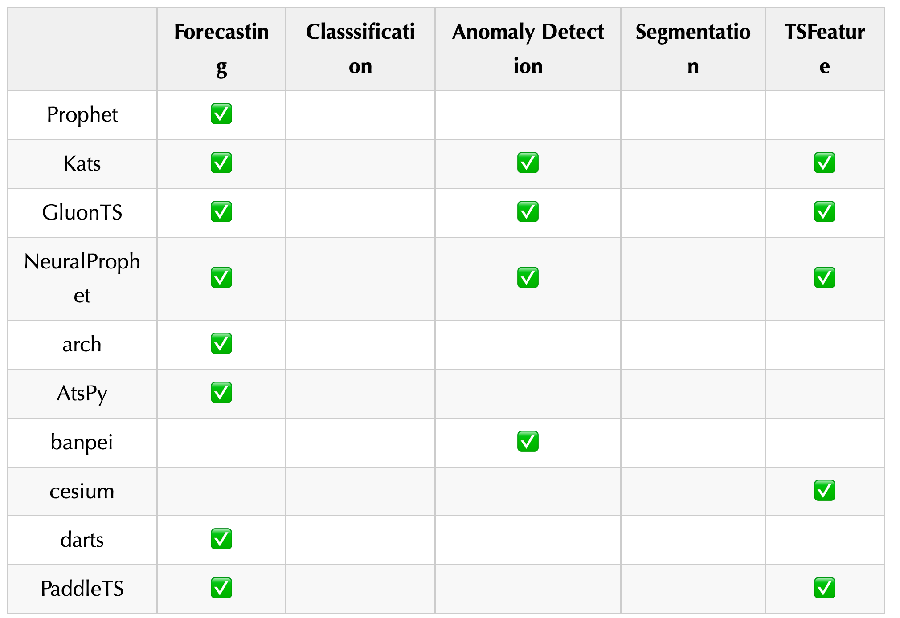
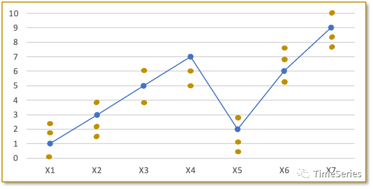
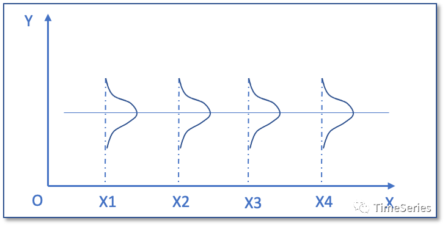
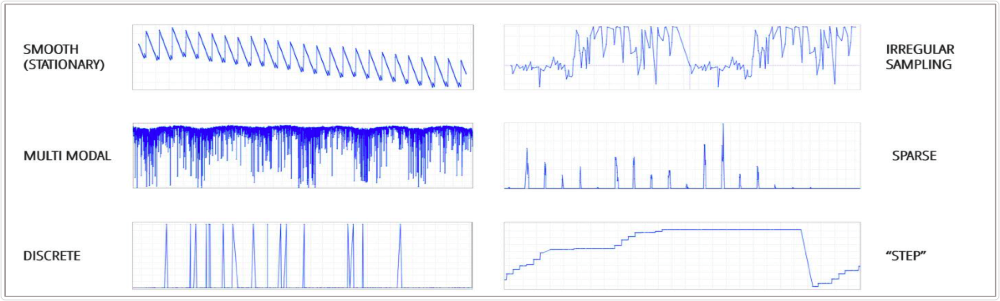

<style>
details {
    border: 1px solid #aaa;
    border-radius: 4px;
    padding: .5em .5em 0;
}
summary {
    font-weight: bold;
    margin: -.5em -.5em 0;
    padding: .5em;
}
details[open] {
    padding: .5em;
}
details[open] summary {
    border-bottom: 1px solid #aaa;
    margin-bottom: .5em;
}
</style>

<details><summary>目录</summary><p>

- [时间序列分析介绍](#时间序列分析介绍)
  - [时间序列模型](#时间序列模型)
    - [预测](#预测)
    - [分类](#分类)
    - [异常检测](#异常检测)
    - [表示](#表示)
    - [数据增强](#数据增强)
  - [时间序列数据集](#时间序列数据集)
  - [时间序列 Python 库](#时间序列-python-库)
- [时间序列介绍](#时间序列介绍)
  - [时间序列发展](#时间序列发展)
  - [时间序列的定义](#时间序列的定义)
    - [定义](#定义)
    - [类型](#类型)
- [时间序列的研究领域](#时间序列的研究领域)
  - [时间序列预测](#时间序列预测)
  - [时间序列异常检测](#时间序列异常检测)
  - [时间序列分类](#时间序列分类)
  - [时间序列检索](#时间序列检索)
  - [时间序列聚类](#时间序列聚类)
  - [时间序列分割](#时间序列分割)
  - [因果分析](#因果分析)
  - [生存分析](#生存分析)
  - [时间序列模式识别](#时间序列模式识别)
- [时间序列分析-baseline](#时间序列分析-baseline)
  - [baseline 特点](#baseline-特点)
  - [baseline 数据](#baseline-数据)
    - [数据读取](#数据读取)
    - [数据查看](#数据查看)
  - [baseline 模型](#baseline-模型)
    - [数据转换](#数据转换)
    - [建立训练集和测试集](#建立训练集和测试集)
    - [算法](#算法)
    - [预测并评估预测结果](#预测并评估预测结果)
    - [预测结果可视化](#预测结果可视化)
- [一些经验与思考](#一些经验与思考)
- [参考资料](#参考资料)
</p></details><p></p>


# 时间序列分析介绍

时间序列分析方法有两种：

* 描述性时序分析：通过直观数据绘图比较，寻找序列中的规律。由于数据存在随机性，想通过总结表面现象去预测未来走势是很难的
* 统计性时序分析：研究重心在分析序列值内在的相关关系上，更注重统计分析

描述性时序分析包含以下内容：

* 时间序列数据包含的信息
* 时间序列数据可视化

统计性时序分析又分为两种：

* 频域（Frequency Domain）分析方法：也称频谱分析或谱分析，
  它假设任何一种无趋势的时间序列都可以分解成若干不同频率的周期波动，
  可以借助傅里叶变换、正弦、余弦之和去逼近某个函数。但一般比较复杂，
  属于纵向数据分析，分析结果抽象，不易于解释，对数学要求高
* 时域（Time Domain）分析方法：它假设序列之间存在一定的相关关系，且具有统计规律，
  可以通过拟合出适当的数学模型来描述规律，从而预测未来走势。属于横向数据分析


## 时间序列模型

### 预测


### 分类

* LSTM FCN，LSTM Fully Convolutional Networks for Time Series Classification

### 异常检测

* [AAAI 2022] Towards a Rigorous Evaluation of Time-series Anomaly Detection

### 表示

* [AAAI 2022] TS2Vec: Towards Universal Representation of Time Series

### 数据增强

* [IJCAI 2021] Time Series Data Augmentation for Deep Learning: A Survey
* [arxiv 2020] An empirical survey of data augmentation for time series classification with neural networks

## 时间序列数据集

* UCR Time Series Classification Archive
* UEA & UCR Time Series Classification Repository 

## 时间序列 Python 库



* Kats，推荐指数：⭐⭐
    - 主页：https://facebookresearch.github.io/Kats/
    - Github：https://github.com/facebookresearch/Kats
* darts，推荐指数：⭐⭐
    - 介绍：a Python library for easy manipulation and forecasting of time series. 
      It contains a variety of models, from classics such as ARIMA to deep neural networks.
    - 主页：https://unit8co.github.io/darts/
    - Github：https://github.com/unit8co/darts
* GluonTS，推荐指数：⭐⭐⭐⭐
    - 主页：https://ts.gluon.ai/index.html
    - Github：https://github.com/awslabs/gluon-ts/
* NeuralProphet，推荐指数：⭐⭐⭐⭐
    - 主页：https://neuralprophet.com/
    - Github：https://github.com/ourownstory/neural_prophet
* arch
    - 介绍：Autoregressive Conditional Heteroskedasticity (ARCH) and other tools for financial econometrics, written in Python.
    - 主页：https://arch.readthedocs.io/en/latest/
    - Github：https://github.com/bashtage/arch
* AtsPy
    - 介绍：Automated Time Series Models in Python
    - Github：https://github.com/firmai/atspy
* banpei
    - 介绍：Anomaly detection library based on singular spectrum transformation
    - Github：https://github.com/tsurubee/banpei
* cesium
    - 介绍：end-to-end machine learning platform for time-series, from calculation of features to model-building to predictions.
    - 主页：https://cesium-ml.org/
    - Github：https://github.com/cesium-ml/cesium
* pyfbad
    - Github：https://github.com/Teknasyon-Teknoloji/pyfbad

更多的模型介绍可以查阅论文 [arxiv 2021]A systematic review of Python packages for time series analysis.

# 时间序列介绍

## 时间序列发展

最早的时间序列分析可以追溯到 7000 年前的古埃及。古埃及人把尼罗河涨落的情况逐天记录下来，
从而构成一个时间序列。对这个时间序列长期的观察使他们发现尼罗河的涨落非常有规律，
由于掌握了涨落的规律，古埃及的农业迅速发展

一般认为现代时间序列分析起源于英国统计学家 G.u.Yule 在 1927 年提出的 AR(自回归)模型。
G.T.Walker 在 1931 年提出了 MA(移动平均)模型，
AR 模型、MA 模型与后来的 ARMA 模型，构成了时间序列分析的基础，至今仍被大量应用。
这些模型主要应用于单变量、同方差场合的平稳序列

随着时间序列分析理论的发展，人们越来越关心多变量、异方差、非线性的时间序列。
Engle 和 Granger 提出了协整理论及其方法，为多维非平稳序列的建模提供了一种途径；
Engle 首先提出 ARCH(自回归条件异方差)模型用于处理异方差的情形；
Tong 和 Lim 提出了 TAR(门限自回归)模型处理非线性时序等等。
这些方法都在往后的发展中不断革新，应用广泛，
例如很多方法被广泛地用于验证金融理论中的规律性描述以及金融市场的预测和决策

时间序列分析方法的另一个突破是在谱分析方面。给定一个时间序列样本，
通过傅里叶变换可以把时域上的数据变换到频域，即为经典谱分析方法。
Burg 在他从事的地震信号的分析与处理中提出最大熵谱，其把信息熵的概念融入信号处理中，
有时又称为时序谱分析方法，是现代谱分析的开始

随着时间序列分析的理论与应用这两方面的深入研究，时序分析应用的范围日益扩大。
目前，深度神经网络兴起，越来越多的方法采用 LSTM 进行长时序列建模与分析。
这种无参数化的方法更自动的抽取时序特征以更好的适应下游的任务。
跨时间跨维度关联分析促使矩阵方法的繁荣，寻求多源时序关联分析，
以及更结构化的时序信息表示成为现在新的研究方向


## 时间序列的定义

### 定义

时间序列(Time Series) 是一组按照时间发生先后顺序进行排列的数据点序列. 
通常一组时间序列的时间间隔为一恒定值(如 1s, 5s, 1min, 1h, 1d 等). 
因此时间序列亦可作为离散时间数据进行分析处理

按照时间的顺序把随机事件变化发展的过程记录下来就构成了一个时间序列。
在统计研究中，常用按时间顺序排列的一组随机变量 `$\{\ldots, X_{1}, X_{2}, \ldots, X_{t}, \ldots\}$` 来表示一个随机事件的序列，
间记为 `$\{X_{t}, t \in T\}$`。
用 `$\{x_{1}, x_{2}, \ldots, x_{N}\}$` 或 `$\{x_{t}, t = 1, 2, \ldots, N\}$` 表示该随机序列的 `$N$` 个有序观测值。
经常认为这些观测值序列是来自一个时间序列随机过程的有限样本，这个过程从无限远的过去开始并将持续到不确定的未来：


时间序列的每个元素都被认为是一个具有概率分布的随机变量，
这里 `$x_{1}$` 可以认为是一个随机变量的一个取值，
`$x_{2}$` 等也均是具有某种分布的随机变量的一个取值(每个变量的分布可能相同也可能不同)

比如这里有一个时间序列数据 `$\{1, 3, 5, 7, 2, 6, 9\}$`，更准确的叫法应该是一个观测值序列。
虽说这里 `$t_{t}$` 时刻只有一个取值 `$1$`，`$t_{2}$` 时刻也只有一个取值 `$3$`，
但不防认为 `$t_{1}$` 时刻对应的是一个变量 `$X_{1}$`，`$t_{2}$` 时刻对应的也是一个变量 `$X_{2}$`，
变量 `$X_{1}, X_{2}$` 可能有多个取值的同时也有它们自己的概率分布，
只是在这一次的观测中分别取值 `$1$` 和 `$3$` 而已



假如序列中每个元素的分布具有共同的参数，比如每个 `$x_{t}$` 的方差 `$Var(x_{t})$` 相同，
并且每对相邻元素之间的协方差 `$Cov(x_{t}, x_{t-1})$` 也相同。
如果对于任意 `$t \in [1, N]$`，`$x_{t}$` 的分布都相同，
则认为序列是平稳的



### 类型

在实际场景中, 不同的业务通常会对应不同类型的时间序列模式, 
一般可以划分为几种类型: 趋势性、周期性、随机性、综合性

下图中展示了几种常见的时间序列的类型: 



# 时间序列的研究领域

学术界对时间序列的研究，主体分为时序表示、时序预测、模式识别、异常检测、关联分析等几大类

时间序列分析具体包括的任务：

* 检索 (Indexing, query by content): given a time series and some similarity measure, 
  find the nearest matching time series.
* 聚类 (Clustering): find groups (clusters) of similar time series.
* 分类 (Classification): assign a time series to a predefined class.
* 分割 (Segmentation, Summarization): create an accurate approximation of a time series by reducing 
  its dimensionality while retaining its essential features.
* 预测 (Forecasting, Prediction): given a time series dataset up to a given time tn, forecast the next values.
* 异常检测 (Anomaly Detection): find abnormal data points or subsequences.
* 因果分析 (Rules Discovery): find the rules that may govern associations between sets of time series or subsequences

## 时间序列预测

时间序列预测 Time Series Forecasting:

> 预测表示预测时间序列即将发生的观测值的数值的过程。这是一个具有挑战性的问题，
  因为它是一个外推过程，并且在估计中存在很大的不确定性。
  模型依赖于从过去的数据中得出的假设，而这些假设通常不成立

* 确定性预测
    - 提前预测许多值
* 不确定性预测(概率预测)
    - 预测特定值(点估计)有助于减少未来的不确定性。但是，提供合理值的区间更利于做出最佳决策。
      或者，在二元事件的情况下，事件发生的概率。例如，“明天有 80% 的机会下雨”这句话比简单地说“明天会下雨”更有信息量
* 极值预测
    - 能源负载峰值对于高效管理电网非常重要

时空预测 Spatio-temporal Forecasting:

> 类似于时间序列预测，但针对多个位置或轨迹

* 可以使用支持 GPS 的传感器沿多个位置捕获时间序列。例如，几个浮标站被放置在沿海岸测量海洋状况的不同固定位置。
  使用时空数据，目标是预测每个位置的未来值
* 时空数据背后的主要挑战之一与其带来的额外依赖性有关。给定位置的观测值不仅与该位置的先前观测值相关，
  而且与其邻居的观测值相关。时空依赖性的适当建模对于获得准确可靠的预测至关重要
* 有时传感器并不固定在某些位置，例如出租车车队中的 GPS 设备。
  有了这些数据，目标可以是使用历史轨迹来预测正在进行或即将到来的旅行的持续时间

超出概率预测 Exceedance Probability Forecasting:

> 预测即将到来的值是否会超过预定义的阈值


* 超出概率是一个预测问题，其目标是估计时间序列在预定义的未来时期内超过预定义阈值的概率。
  此任务在极值(分布的尾部)高度相关的领域中很重要
* 实际应用是通货膨胀率预测。如果通货膨胀率很可能超过给定百分比，
  则可能会促使中央银行提高利率。另一个例子是自然灾害，例如洪水或地震
* 通常，超出预测是二元分类问题，旨在预测超过阈值的概率。然而，非二元问题也可以根据不同的阈值来定义。
  例如，股票市场交易员可能对根据价格变动预测买入、卖出或持有信号感兴趣。
  就预测价格回报而言超过正阈值可用作买入信号；相反(预测价格回报低于负阈值)可以代表卖出触发器。
  如果未达到任何阈值，则交易者应保持当前的持有

## 时间序列异常检测

> 时间序列异常检测，Time Series Anomaly Detection，
  或 Activity Monitoring 用来及时检测需要采取行动的罕见但具有破坏性的事件

有时我们对预测感兴趣，而不是时间序列的一般行为(例如，在下一次观察中它是上升还是下降，以及各自的幅度)，
而是感兴趣的特定和罕见事件。针对此类场景的预测任务是时间序列异常检测，也称为活动监控

时间序列异常检测背后的主要目标是及时检测有趣但罕见的事件，
这些事件可能在特定应用领域具有破坏性. 这对于决策至关重要，
因为它使专业人员能够采取适当的行动来防止这些事件或减轻其后果。
因此，从机器学习的角度来看，预测模型的输出是二进制的，表示感兴趣的事件是否发生

关于活动监控有两个主要挑战。第一个隐含在及时这个词中。
该表达式意味着在发出有关即将发生的感兴趣事件的警报点与事件发生或开始的点之间存在适当的警告期。
这个时间间隔对专业人员来说至关重要，因此他们可以评估情况并决定行动方案。
第二个挑战是感兴趣的事件很少见。因此，学习这些事件背后的概念代表了一个不平衡的学习问题

这个任务有点类似于上面描述的超越预测(超越概率预测)。但是，两者之间存在重要差异。
超出预测通常(但不一定)与个别时间序列有关。另一方面，时间序列异常检测通常涉及随着时间的推移监视多个实体，
这些实体可能会或可能不会经历感兴趣的事件。此外，在时间序列异常检测中，
事件是任意定义的，并不特定于超过特定阈值，尽管可能是这种情况

## 时间序列分类

> 时间序列分类 Time Series Classification 用来将时间序列分类为预定义的类

时间序列分类是将类别分配给时间序列的过程。这个问题类似于传统的分类，但属性是按时间排序的

时间序列分类与上述经典时间序列预测任务有两个重要区别: 

* 首先，它代表分类任务，而预测通常是回归问题
* 其次，在时间序列分类中，每个观察值都是独立于其他时间序列的独立时间序列(通常是单变量和数字)。
  在预测的情况下，每个观察值都是更大时间序列的子序列，并且观察值之间存在一定程度的依赖性

有时目标是在不牺牲性能的情况下尽早对时间序列进行分类，这代表了早期的时间序列分类任务。
每次测量可能代价高昂，或者尽快采取行动可能很重要。这导致了权衡，因为更少的观察通常会导致更差的性能

## 时间序列检索

## 时间序列聚类

## 时间序列分割

## 因果分析

## 生存分析

> 生存分析 Survival Analysis 用来预测感兴趣事件发生的时间

关于生存分析的文章如下：

* [生存分析（一）生存分析方法，你听说过几种？](https://mp.weixin.qq.com/s/XhJu7gf7culpg_Jm3SyL8A)
* [生存分析（二）中位生存时间和中位随访时间](https://mp.weixin.qq.com/s/XotdvhLa0-nA3T01MdA-ww)
* [生存分析（三）log-rank检验在什么情况下失效？](https://mp.weixin.qq.com/s/Y1kiLLMxC2m8rznPuE1lIQ)
* [生存分析（四）我们的生命，能否如指数分布般平稳？](https://mp.weixin.qq.com/s/MVACRInTAbiHlpE8y5XmBg)
* [生存分析（五）实用的（却又被忽略的）Weibull回归](https://mp.weixin.qq.com/s/7J_bEYpRsmLN8tS8G4h4BQ)
* [生存分析（六）如何判断你的生存数据能否用cox回归——等比例风险假定判断](https://mp.weixin.qq.com/s/aYE9KC5-0RSW1mmMuQrCxA)
* [生存分析（七）什么是时依协变量（兼谈分层Cox回归）](https://mp.weixin.qq.com/s/NaAtnAQ9x3-fVCKrsYc69g)

生存分析背后的目标是预测感兴趣事件发生的时间。
这个问题通常与随着时间的推移观察到一组实体(例如人、设备)的领域有关。
示例应用程序包括犯罪学(预测再犯的时间)、
工程可靠性(预测设备故障的时间)或客户管理(预测客户流失的时间)。

生存分析问题的主要挑战是观察经常被审查——关于某些实体的信息仅部分可用。
这可能是因为实体可能在事件发生之前停止被观察

## 时间序列模式识别

还有其他时间序列任务，其主要目标是知识发现。这些本质上不是预测性的，但仍然非常相关。
它们提供有关时间序列的重要信息，并可用作预测任务的子任务。该类问题旨在对时间序列各种形式的信息进行处理和分析，
以对事物或现象进行描述、辨认、分类和解释的过程

时间序列聚类(Time Series Clustering):

* 在时间序列中，聚类表示找到彼此相似但不同于其他时间序列组的时间序列组的过程。
  聚类可用于查找完整时间序列的组(全序列聚类)或查找较大时间序列中的子序列组(子序列聚类)

摘要(Summarisation)：

* 有时时间序列非常长，难以处理。因此，通常会进行摘要以降低其维度，同时仍保留基本结构

主题发现(Motif Discovery)：

* 在时间序列中，主题代表重复出现的模式——时间序列的子序列，随着时间的推移大致重复

时间序列表示：

* 该类问题旨在抽取时序数据的特征，以某些特定的形式进行表达，是时间序列研究的基础问题。
  常见的有统计特征(最大最小值、均值、分位数，方差等指标)，熵特征等。
  近年来的针对序列数据的深度学习神经网络，也是通过记忆参数对时序进行表示学习的一种方法
* [时序转化为图用于可解释可推理的异常检测](https://mp.weixin.qq.com/s?__biz=Mzg3NDUwNTM3MA==&mid=2247483863&idx=1&sn=db7a9e15385c8f34bba86b442c5f5f67&chksm=cecef422f9b97d34b9968291a332157524cb9a789452a06673e703b6891971206f0ca58f2178&scene=21#wechat_redirect)

时间序列关联分析：

* 该类问题多出现在多维时间序列中，旨在发现不同时序之间的相似点或关联点，
  或同时序不同时间位置的关联点。常见的有周期分析，季节分析，波形联动分析，时间关联性等问题

# 时间序列分析-baseline

## baseline 特点

* Simple: A method that requires little or no training or intelligence.
* Fast: A method that is fast to implement and computationally trivial to make a prediction.
* Repeatable: A method that is deterministic, 
  meaning that it produces an expected output given the same input.

## baseline 数据

```python
import pandas as pd 
import matplotlib.pyplot as plt
```

### 数据读取

```python
series = pd.read_csv(
    "https://raw.githubusercontent.com/jbrownlee/Datasets/master/shampoo.csv",
    header = 0,
    parse_dates = [0],
    index_col = 0,
    squeeze = True,
    date_parser = lambda dates: pd.datetime.strptime("190" + dates, "%Y-%m")
)
```

### 数据查看

```python
print(series.head())
```

```
Month
1901-01-01    266.0
1901-02-01    145.9
1901-03-01    183.1
1901-04-01    119.3
1901-05-01    180.3
Name: Sales, dtype: float64
```

```python
series.plot()
plt.show()
```


## baseline 模型

* 将单变量时间序列数据转换为监督学习问题
* 建立训练集和测试集
* 定义持久化模型
* 进行预测并建立 baseline 性能
* 查看完整的示例并绘制输出

### 数据转换

```python
# Create lagged dataset
values = pd.DataFrame(series.values)
df = pd.concat([values.shift(1), values], axis = 1)
df.columns = ["t-1", "t+1"]
print(df.head())
```

### 建立训练集和测试集

```python
# split into train and test sets
X = df.values
train_size = int(len(X) * 0.66)
train, test = X[1:train_size], X[train_size:]
train_X, train_y = train[:, 0], train[:, 1]
test_X, test_y = test[:, 0], test[:, 1]
```

### 算法

```python
# persistence model
def model_persistence(x):
    return x
```

### 预测并评估预测结果

```python
from sklearn.metrics import mean_squared_error

# walk-forward validation
predictions = list()
for x in test_X:
    yhat = model_persistence(x)
    predictions.append(yhat)
test_score = mean_squared_error(test_y, predictions)
print("Test MSE: %.3f" % test_score)
```

### 预测结果可视化

```python
# plot predictions and expected results
plt.plot(train_y)
plt.plot([None for i in train_y] + [x for x in test_y])
plt.plot([None for i in train_y] + [x for x in predictions])
plt.show()
```

# 一些经验与思考

1. 训练测试数据的划分
    - 和其他机器学习场景不同, 时间序列预测的数据是带有前后顺序的序列数据, 因此在做训练测试数据的划分时, 
      要注意不能泄露测试数据给模型, 因此在做训练测试数据划分时, 需要让测试数据全都在训练数据的时间戳之后
2. 一线业务人员经验的使用
    - 在做一些时间序列预测场景时, 我们发现一线业务人员经验是极其宝贵的, 比如说一些抚平/剔除业务异常数据的经验, 
      他们会知道在历史数据里哪些时间段的数据是异常的原因是什么, 比如各种事件会对不同的业务线产生什么样的影响、
      一些预测偏差较大的原因可能是什么. 这些宝贵的经验可以转化成时间序列历史数据清洗的规则,
      或者是一些时间序列数据校准的 Knowledge Base
3. 利用能反映未来的信息
    - 当我们在做时间序列预测时, 本质我们是在利用历史数据来预测未来, 那么如果我们能够拿到更多关于未来的信息, 
      则可以帮助我们预测的更准. 什么是关于未来的信息呢？比如说: 用户的预订信息, 用户的浏览数据, 
      这些数据能够侧面反映用户对于未来某天的兴趣值, 从而帮助我们窥探未来
4. 如何保证输出结果的稳定性
    - 在使用黑盒模型时, 我们会发现有时模型输出会存在一些异常点, 这可能是由于历史数据中存在一些没有被剔除的噪音, 
      因此我们需要构建多种可解释性强的预测尺度范围, 来校准最后的输出结果, 从而提高模型输出的稳定性, 
      生产中这样的校准有时也可以提高一定的准确率
5. 重新训练模型的频率
    - 通常, 当有新数据获得时, 重新训练模型来进行预测, 整体来说在每个时间戳能给出更好的预测结果. 
      如果生产上准备采取这种思路的话, 在训练的时候也要用相同的重新训练的方法, 来评估哪种模型效果最好, 
      即采用sliding window / expanding window 的方法去在每个时间戳重新训练预测和记录误差来进行模型评估. 
      当然这样计算量会比较大, 比较适合单一产线并且对准确率较为看中的场景
6. 如何评估模型的好坏
    - 对于不同的项目, 评判时序预测模型好坏的标准是不同的, 整体来说, 要针对不同的项目场景, 
      综合模型准确率、可维护性、可解释性、稳定性等多方面去评估一个预测模型或者一个预测框架的合理性和实用性
7. 历史数据该相信多少
    - 事物是不断发展变化的, 比如随着智能客服智能化程度的提高, 需要人工客服处理的订单会逐渐变少, 
      因此人工客服相关的时间序列数据的性质会处于不断变化之中, 那么我们对于越久远的历史数据的信任度应该是要逐渐下降的. 
      处理的方法是一方面我们可以通过分析来判断训练应该取多久内的时间序列数据, 
      另一方面我们在训练时可以赋予越近的数据更高的权重

# 参考资料

* [时间序列的平稳性检验方法汇总](https://mp.weixin.qq.com/s?__biz=MzkxNDE1NjM5MA==&mid=2247484151&idx=1&sn=32b42c2c03f168e0ffa53b1a10f9fe3f&chksm=c173fcfef60475e84cacd5303ce60ae652b029a2475bde6dbfbd89ff175acf6c788e710868ac&cur_album_id=2111235593522200577&scene=189#wechat_redirect)
* [时间序列白噪声检验](https://mp.weixin.qq.com/s?__biz=MzkxNDE1NjM5MA==&mid=2247484287&idx=1&sn=be786628cc58bbbbd5a267497eac246d&chksm=c173fd76f6047460cf693916bc9ceda10ebb325378a496a4067ad0a1ba66f71e66f267639a46&cur_album_id=2111235593522200577&scene=189#wechat_redirect)
* [R package forecast](https://cran.r-project.org/web/packages/forecast/)
* [应该了解的 6 个时间序列预测任务](https://towardsdatascience.com/6-time-series-predictive-tasks-you-should-know-about-b899fb83b6bf)
* [关于时间序列你应该知道的 12 件事](https://towardsdatascience.com/12-things-you-should-know-about-time-series-975a185f4eb2)
* [时序资料汇总：模型和常见库对比](https://mp.weixin.qq.com/s/KYSFvlS9iLMX2zBiU5CGZg)

