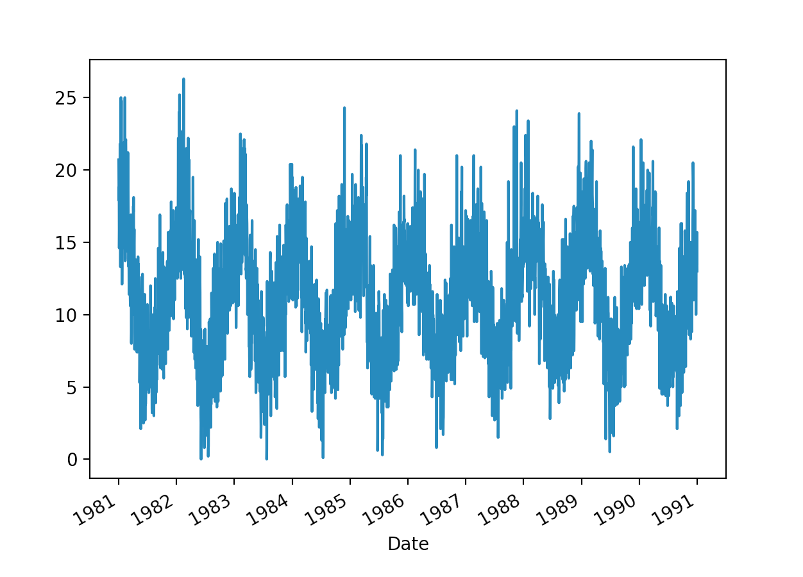
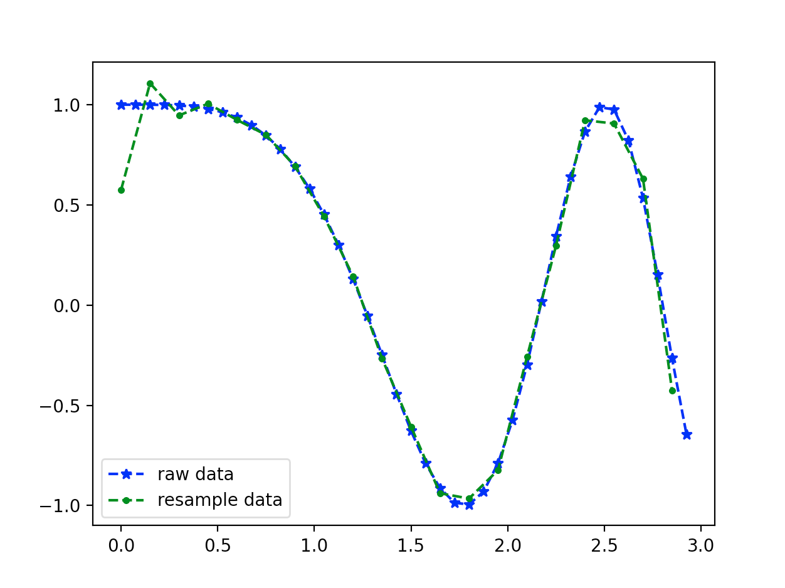

<style>
details {
    border: 1px solid #aaa;
    border-radius: 4px;
    padding: .5em .5em 0;
}
summary {
    font-weight: bold;
    margin: -.5em -.5em 0;
    padding: .5em;
}
details[open] {
    padding: .5em;
}
details[open] summary {
    border-bottom: 1px solid #aaa;
    margin-bottom: .5em;
}
img {
    pointer-events: none;
}
</style>

<details><summary>目录</summary><p>

- [时间序列预处理简介](#时间序列预处理简介)
- [标准化和中心化](#标准化和中心化)
    - [标准化](#标准化)
    - [中心化](#中心化)
- [归一化](#归一化)
    - [归一化](#归一化-1)
    - [平均归一化](#平均归一化)
    - [什么时候用归一化？什么时候用标准化？](#什么时候用归一化什么时候用标准化)
- [定量特征二值化](#定量特征二值化)
- [时间序列聚合](#时间序列聚合)
    - [Pandas 重采样](#pandas-重采样)
        - [API](#api)
        - [升采样](#升采样)
        - [降采样](#降采样)
        - [Function application](#function-application)
        - [Indexing 和 iteration](#indexing-和-iteration)
        - [稀疏采用](#稀疏采用)
    - [SciPy 重采样](#scipy-重采样)
        - [API](#api-1)
        - [升采样](#升采样-1)
        - [降采样](#降采样-1)
        - [等间隔采样](#等间隔采样)
        - [不等间隔采样](#不等间隔采样)
- [时间序列缺失处理](#时间序列缺失处理)
    - [时间序列插值](#时间序列插值)
    - [Pandas 插值算法](#pandas-插值算法)
        - [Pandas 中缺失值的处理](#pandas-中缺失值的处理)
        - [缺失值插值算法 API](#缺失值插值算法-api)
            - [pandas.DataFrame.interpolate](#pandasdataframeinterpolate)
    - [Scipy 插值算法](#scipy-插值算法)
        - [1-D interpolation](#1-d-interpolation)
        - [Multivariate data interpolation](#multivariate-data-interpolation)
        - [Spline interpolation](#spline-interpolation)
        - [Using radial basis functions for smoothing/interpolate](#using-radial-basis-functions-for-smoothinginterpolate)
- [时间序列降噪](#时间序列降噪)
    - [移动平均](#移动平均)
    - [傅里叶变换](#傅里叶变换)
    - [小波分析](#小波分析)
- [时间序列处理技巧](#时间序列处理技巧)
    - [时区](#时区)
        - [API](#api-2)
        - [原理](#原理)
        - [示例](#示例)
    - [重采样](#重采样)
    - [缺失值填充](#缺失值填充)
- [参考](#参考)
</p></details><p></p>

# 时间序列预处理简介

一般来说，真实世界的时间序列常常取值范围多样，长短不一，形态各异。
如果要做统一的分析，需要我们进行初步的处理，将时间序列整合到统一的范畴下，进行分析。
这里基本的方法有：标准化、归一化、定量特征二值化

时间序列示例数据：

[澳大利亚墨尔本市10年(1981-1990年)内的最低每日温度](https://raw.githubusercontent.com/jbrownlee/Datasets/master/daily-min-temperatures.csv)

```python
import pandas as pd 
from pandas import Grouper
import matplotlib.pyplot as plt 

series = pd.read_csv(
    "https://raw.githubusercontent.com/jbrownlee/Datasets/master/daily-min-temperatures.csv",
    header = 0,
    index_col = 0, 
    parse_dates = True,
    date_parser = lambda dates: pd.to_datetime(dates, format = '%Y-%m-%d'),
    squeeze = True
)
print(series.head())
```

```
Date
1981-01-01    20.7
1981-01-02    17.9
1981-01-03    18.8
1981-01-04    14.6
1981-01-05    15.8
Name: Temp, dtype: float64
```

```python
series.plot()
plt.show()
```



```python
series.hist()
plt.show()
```


# 标准化和中心化

## 标准化

标准化是使时间序列中的数值符合平均值为 0，标准差为 1。具体来说，
对于给定的时间序列 `$\{x_{1}, x_{2}, \ldots, x_{t}, \ldots, x_{T}\}$`，
有如下公式：

`$$\hat{x}_{t} = \frac{x_{t} - mean(\{x_{t}\}_{t}^{T})}{std(\{x_{t}\}_{t}^{T})}$$`

```python
from pandas import read_csv
from sklearn.preprocessing import StandarScaler
from math import sqrt

# Data
series = pd.read_csv(
    "daily-minimum-temperatures-in-me.csv", 
    header = 0,
    index_col = 0
)
print(series.head())
values = series.values
values = values.reshape((len(values), 1))

# Standardization
scaler = StandardScaler()
scaler = scaler.fit(values)
print("Mean: %f, StandardDeviation: %f" % (scaler.mean_, sqrt(scaler.var_)))

# 标准化
normalized = scaler.transform(values)
for i in range(5):
    print(normalized[i])

# 逆变换
inversed = scaler.inverse_transform(normalized)
for i in range(5):
    print(inversed[i])
```

```python
normalized.plot()
```


```python
inversed.plot()
```


## 中心化

标准化的目标是将原始数据分布转换为标准正态分布，它和整体样本分布有关，
每个样本点都能对标准化产生影响。这里，如果只考虑将均值缩放到 0，
不考虑标准差的话，为数据中心化处理：

`$$\hat{x}_{t} = x_{t} - mean(\{x_{t}\}_{t}^{T})$$`

# 归一化

归一化是将样本的特征值转换到同一范围（量纲）下，把数据映射到 `$[0, 1]$` 或 `$[-1, 1]$` 区间内，
它仅由变量的极值所决定，其主要是为了数据处理方便而提出来的

```python
import pandas as pd 
from sklearn.preprocessing import MinMaxScaler

# Data
series = pd.read_csv(
    "daily-minimum-temperautures-in-me.csv", 
    header = 0, 
    index_col = 0
)
print(series.head())
values = series.values
values = values.reshape((len(values), 1))

# Normalization
scaler = MinMaxScaler(feature_range = (0, 1))
scaler = scaler.fit(values)
print("Min: %f, Max: %f" % (scaler.data_min_, scaler.data_max_))

# 正规化
normalized = scaler.transform(values)
for i in range(5):
    print(normalized[i])

# 逆变换
inversed = scaler.inverse_transform(normalized)
for i in range(5):
    print(inversed[i])
```

``` 
            Temp
Date            
1981-01-02  17.9
1981-01-03  18.8
1981-01-04  14.6
1981-01-05  15.8
1981-01-06  15.8
Min: 0.000000, Max: 26.300000

[0.68060837]
[0.7148289]
[0.55513308]
[0.60076046]
[0.60076046]
[17.9]
[18.8]
[14.6]
[15.8]
[15.8]
```

```python
normalized.plot()
```


```python
inversed.plot()
```


## 归一化

把数据映射到 `$[0, 1]$` 范围之内进行处理，可以更加便捷快速。具体公式如下：

`$$\hat{x}_{t} = \frac{x_{t} - min(\{x_{t}\}_{t}^{T})}{max(\{x_{t}\}_{t}^{T}) - min(\{x_{t}\}_{t}^{T})}$$`

## 平均归一化

`$$\hat{x}_{t} = \frac{x_{t} - mean(\{x_{t}\}_{t}^{T})}{max(\{x_{t}\}_{t}^{T}) - min(\{x_{t}\}_{t}^{T})}$$`

## 什么时候用归一化？什么时候用标准化？

* 如果对输出结果范围有要求，用归一化
* 如果数据较为稳定，不存在极端的最大最小值，用归一化
* 如果数据存在异常值和较多噪音，用标准化，可以间接通过中心化避免异常值和极端值的影响

# 定量特征二值化

如果不需要数据的连续信息，只需要对定量的特征进行“好与坏”的划分，
可以使用定量特征二值化来剔除冗余信息

举个例子，银行对 5 名客户的征信进行打分，分别为 50，60，70，80，90。
现在，不在乎一个人的征信多少分，只在乎他的征信好与坏（如大于 90 为好，低于 90 就不好）；
再比如学生成绩，大于 60 及格，小于 60 就不及格。这种“好与坏”、
“及格与不及格”的关系可以转化为 0-1 变量，这就是二值化。变化方式如下所示：

`$$\begin{cases}
\hat{x}_{t} = 1, x_{t} > threshold \\
\hat{x}_{t} = 0, x_{t} \leq threshold
\end{cases}$$`

也可以设计更多的规则，进行多值化的处理

# 时间序列聚合

通常来自不同数据源的时间轴常常无法一一对应, 此时就要用到改变时间频率的方法进行数据处理. 
由于无法改变实际测量数据的频率, 我们能做的是改变数据收集的频率

- 上采样(up sampling): 在某种程度上是凭空获得更高频率数据的方式, 不增加额外的信息
- 下采样(down sampling): 减少数据收集的频率, 也就是从原始数据中抽取子集的方式

重采样(resampling)指的是将时间序列从一个频率转换到另一个频率的处理过程。
是对原样本重新处理的一个方法，是一个对常规时间序列数据重采样和频率转换的便捷的方法

将高频率的数据聚合到低频率称为降采样(downsampling)，
而将低频率数据转换到高频率则称为升采样(upsampling)

## Pandas 重采样

### API

```python
pd.DataFrame.resample(
    rule, 
    how = None, 
    axis = 0, 
    fill_method = None, 
    closed = None, 
    label = None, 
    convention = 'start', 
    kind = None, 
    loffset = None, 
    limit = None, 
    base = 0, 
    on = None, 
    level = None
)
```

主要参数说明:

* `rule`: DateOffset, Timedelta or str
    - 表示重采样频率，例如 ‘M’、‘5min’，Second(15)
* `how`: str
    - 用于产生聚合值的函数名或数组函数，例如'mean'、'ohlc'、'np.max'等，默认是'mean'，
      其他常用的值有：'first'、'last'、'median'、'max'、'min'
* `axis`: {0 or 'index', 1 or 'columns'}, default 0
    - 默认是纵轴，横轴设置 axis=1
* `fill_method`: str, default None
    - 升采样时如何插值，比如 ffill、bfill 等
* `closed`: {'right', 'left'}, default None
    - 在降采样时，各时间段的哪一段是闭合的，'right' 或 'left'，默认 'right'
* `label`: {'right', 'left'}, default None
    - 在降采样时，如何设置聚合值的标签，例如，9:30-9:35 会被标记成 9:30 还是 9:35, 默认9:35
* `convention`: {'start', 'end', 's', 'e'}, default 'start'
    - 当重采样时期时，将低频率转换到高频率所采用的约定（'start'或'end'）。默认'end'
* `kind`: {'timestamp', 'period'}, optional, default None
    - 聚合到时期（'period'）或时间戳（'timestamp'），默认聚合到时间序列的索引类型
* `loffset`: timedelta, default None
    - 面元标签的时间校正值，比如'-1s'或Second(-1)用于将聚合标签调早1秒
* `limit`: int, default None
    - 在向前或向后填充时，允许填充的最大时期数


* `pd.DataFrame.resample()` 和 `pd.Series.resample()`
    - 上采样
        - `.resample().ffill()`
        - `.resample().bfill()`
        - `.resample().pad()`
        - `.resample().nearest()`
        - `.resample().fillna()`
        - `.resample().asfreq()`
        - `.resample().interpolate()`
    - 下采样(计算聚合、统计函数)
        - `.resample().<func>()`
        - `.resample.count()`
        - `.resample.nunique()`
        - `.resample.first()`
        - `.resample.last()`
        - `.resample.ohlc()`
        - `.resample.prod()`
        - `.resample.size()`
        - `.resample.sem()`
        - `.resample.std()`
        - `.resample.var()`
        - `.resample.quantile()`
        - `.resample.mean()`
        - `.resample.median()`
        - `.resample.min()`
        - `.resample.max()`
        - `.resample.sum()`
    - Function application
        - `.resample().apply(custom_resampler)`: 自定义函数
        - `.resample().aggregate()`
        - `.resample().transfrom()`
        - `.resample().pipe()`
    - Indexing, iteration
        - `.__iter__`
        - `.groups`
        - `.indices`
        - `get_group()`
    - 稀疏采样

```python
import pandas as pd

rng = pd.data_range("2000-01-01", periods = 100, freq = "D")
ts = pd.Series(np.random.randn(len(rng)), index = rng)
ts
```

```
2000-01-01   -0.184415
2000-01-02   -0.078049
2000-01-03    1.550158
2000-01-04    0.206498
2000-01-05    0.184059
                ...   
2000-04-05   -0.574207
2000-04-06   -1.719587
2000-04-07    0.140673
2000-04-08   -1.234146
2000-04-09   -0.835341
Freq: D, Length: 100, dtype: float64
```

### 升采样

### 降采样

在用 `resample` 对数据进行降采样时，需要考虑两个参数:

* 各区间哪边是闭合的
* 如何标记各个聚合面元，用区间的开头还是末尾


```python
df = pd.DataFrame({
    'A': [1, 1, 2, 1, 2],
    'B': [np.nan, 2, 3, 4, 5],
    'C': [1, 2, 1, 1, 2]
}, columns = ['A', 'B', 'C'])

df.groupby("A").mean()
df.groupby(["A", "B"]).mean()
df.groupby("A")["B"].mean()
```

### Function application


### Indexing 和 iteration


### 稀疏采用


## SciPy 重采样

### API

```python
import scipy

scipy.signal.resample(
    x, 
    num, 
    t = None, 
    axis = 0, 
    window = None, 
    domain = 'time'
)
```

参数解释:

* `x`: 待重采样的数据
* `num`: 重采样的点数，int 型
* `t`: 如果给定 t，则假定它是与 x 中的信号数据相关联的等距采样位置
* `axis`: 对哪个轴重采样，默认是 0

### 升采样

```python
import numpy as np
import matplotlib.pyplot as plt
from scipy import signal


# 原始数据
t = np.linspace(0, 3, 20, endpoint = False)
y  = np.cos(t ** 2)

# 升采样, 20 个点采 40 个点
re_y = singal.resample(y, 40)
t_new = np.linspace(0, 3, len(re_y), endpoint = False)

# plot
plt.plot(t, y, "b*--", label = "raw")
plt.plot(t_new, re_y, "r.--", lable = "resample data")
plt.legend()
plt.show()
```


### 降采样

```python
import numpy as np
import matplotlib.pyplot as plt
from scipy import signal

# 原始数据
t = np.linspace(0, 3, 40, endpoint = False)
y = np.cos(t ** 2)

# 降采样, 40 个点采 20 个点
re_y = signal_resample(y, 20)
t_new = np.linspace(0, 3, len(re_y), endpoint = False)

# plot
plt.plot(t, y, "b*--", label = "raw data")
plt.plot(t_new, re_y, "r.--", label = "resample data")
plt.legend()
plt.show()
```


### 等间隔采样

```python
import numpy as np
import matplotlib.pyplot as plt
from scipy import signal

# 原始数据
t = np.linspace(0, 3, 40, endpoint = False)
y = np.cos(t ** 2)

# 等间隔降采样，40 个点采 20 个点
re_y, re_t = signal.resample(y, 20, t = t)

# plot
plt.plot(t, y, "b*--", label = "raw data")
plt.plot(re_t, re_y, "g.--", label = "resample data")
plt.legend()
plt.show()
```



### 不等间隔采样

原始数据不等间隔，采样成等间隔的点(点数不变)

```python
import numpy as np
import matplotlib.pyplot as plt
from scipy import signal

# 原始数据
t = np.array([
    0, 2, 3, 3.5, 4.5, 
    5.2, 6, 6.3, 8, 9, 
    10, 11.2, 12.3, 12.9, 14.5,
    16, 17, 18, 19, 20]) / 10
x = np.sin(3 * t)

# 重采样为等间隔
t1 = np.linspace(0, 2, 20, endpoint = True)
re_x, re_t = signal.resample(x, 20, t = t1)

# plot
plt.plot(t, x, 'b*--', label = 'raw data')
plt.plot(re_t, re_x, 'g.--', label = 'resample data')
plt.legend()
plt.show()
```


```python
import numpy as np
import matplotlib.pyplot
from scipy import signal

# 原始数据
t = np.array([
    0, 2, 3, 3.5, 4.5, 
    5.2, 6, 6.3, 8, 9, 
    10, 11.2, 12.3, 12.9, 14.5, 
    16, 17, 18, 19, 20])/10
x = np.sin(3 * t)

# 重采样
t1 = np.linspace(0, 2, 20, endpoint = True)
re_x = signal.resample(x, 20)

plt.plot(t, x, 'b*--', label = 'raw data')
plt.plot(t1, re_x, 'r.--', label = 'resample data')
plt.legend()
plt.show()
```


# 时间序列缺失处理

最常用的处理缺失值的方法包括填补(imputation) 和删除(deletion)两种

常见的数据填补(imputation)方法:

* forward fill 和 backward fill
    - 根据缺失值前/后的最近时间点数据填补当前缺失值
* moving average
* interpolation
    - 插值方法要求数据和邻近点之间满足某种拟合关系, 
      因此插值法是一种先验方法且需要代入一些业务经验

## 时间序列插值

## Pandas 插值算法

### Pandas 中缺失值的处理

1. Python 缺失值类型
   - `None`
   - `numpy.nan`
   - `NaN`
   - `NaT`
2. 缺失值配置选项
   - 将 `inf` 和 `-inf` 当作 `NA`
      - `pandas.options.mod.use_inf_as_na = True`
3. 缺失值检测
   - `pd.isna()`
   - `.isna()`
   - `pd.notna()`
   - `.notna()`
4. 缺失值填充
   - `.fillna()`
      - `.where(pd.notna(df), dict(), axis = "columns")`
      - `.ffill()`
         - `.fillna(method = "ffill", limit = None)`
      - `.bfill()`
         - `.fillna(method = "bfill", limit = None)`
   - `.interpolate(method)`
   - `.replace(, method)`
5. 缺失值删除
   - `.dropna(axis)`

### 缺失值插值算法 API

#### pandas.DataFrame.interpolate

```python

pandas.DataFrame.interpolate(
   method = 'linear', 
   axis = 0, 
   limit = None, 
   inplace = False, 
   limit_direction = 'forward', 
   limit_area = None, 
   downcast = None, 
   **kwargs
)
```

- `method`
   - `linear`: 等间距插值, 支持多多索引
   - `time`: 对索引为不同分辨率时间序列数据插值
   - `index`, `value`: 使用索引的实际数值插值
   - `pad`: 使用其他不为 `NaN` 的值插值
   - `nearest`: 参考 `scipy.iterpolate.interp1d` 中的插值算法
   - `zero`: 参考 `scipy.iterpolate.interp1d` 中的插值算法
   - `slinear`: 参考 `scipy.iterpolate.interp1d` 中的插值算法
   - `quadratic`: 参考 `scipy.iterpolate.interp1d` 中的插值算法
   - `cubic`: 参考 `scipy.iterpolate.interp1d` 中的插值算法
   - `spline`: 参考 `scipy.iterpolate.interp1d` 中的插值算法
   - `barycentric`: 参考 `scipy.iterpolate.interp1d` 中的插值算法
   - `polynomial`: 参考 `scipy.iterpolate.interp1d` 中的插值算法
   - `krogh`:
      - `scipy.interpolate.KroghInterpolator`
   - `piecewise_polynomial`
   - `spline`
      - `scipy.interpolate.CubicSpline`
   - `pchip`
      - `scipy.interpolate.PchipInterpolator`
   - `akima`
      - `scipy.interpolate.Akima1DInterpolator`
   - `from_derivatives`
      - `scipy.interpolate.BPoly.from_derivatives`
- `axis`:
   - 1
   - 0
- `limit`: 要填充的最大连续 `NaN` 数量,  :math:`>0`
- `inplace`: 是否在原处更新数据
- `limit_direction`: 缺失值填充的方向
   - forward
   - backward
   - both
- `limit_area`: 缺失值填充的限制区域
   - None
   - inside
   - outside
- `downcast`: 强制向下转换数据类型
   - infer
   - None
- `**kwargs`
   - 传递给插值函数的参数

```python
s = pd.Series([])
df = pd.DataFrame({})

s.interpolate(args)
df.interpolate(args)
df[""].interpolate(args)
```

## Scipy 插值算法

- scipy.interpolate.Akima1DInterpolator
   - 三次多项式插值
- scipy.interpolate.BPoly.from_derivatives
   - 多项式插值
- scipy.interpolate.interp1d
   - 1-D 函数插值
- scipy.interpolate.KroghInterpolator
   - 多项式插值
- scipy.interpolate.PchipInterpolator
   - PCHIP 1-d 单调三次插值
- scipy.interpolate.CubicSpline
   - 三次样条插值

### 1-D interpolation

```python
class scipy.interpolate.interp1d(x, y, 
                           kind = "linear", 
                           axis = -1, 
                           copy = True, 
                           bounds_error = None, 
                           fill_value = nan, 
                           assume_sorted = False)
```

- `kind`
   - linear
   - nearest
   - 样条插值(spline interpolator):
      - zero
         - zeroth order spline
      - slinear
         - first order spline
      - quadratic
         - second order spline
      - cubic
         - third order spline
   - previous
      - previous value
   - next
      - next value

```python
import numpy
from scipy.interpolate import interp1d

# 原数据
x = np.linspace(0, 10, num = 11, endpoint = True)
y = np.cos(-x ** 2 / 9.0)

# interpolation
f1 = interp1d(x, y, kind = "linear")
f2 = interp1d(x, y, kind = "cubic")
f3 = interp1d(x, y, kind = "nearst")
f4 = interp1d(x, y, kind = "previous")
f5 = interp1d(x, y, kind = "next")

xnew = np.linspace(0, 10, num = 1004, endpoint = True)
ynew1 = f1(xnew)
ynew2 = f2(xnew)
ynew3 = f3(xnew)
ynew4 = f4(xnew)
ynew5 = f5(xnew)
```

### Multivariate data interpolation

### Spline interpolation

### Using radial basis functions for smoothing/interpolate

# 时间序列降噪

## 移动平均

滚动平均值是先前观察窗口的平均值，其中窗口是来自时间序列数据的一系列值。
为每个有序窗口计算平均值。这可以极大地帮助最小化时间序列数据中的噪声

## 傅里叶变换

傅里叶变换可以通过将时间序列数据转换到频域去除噪声，可以过滤掉噪声频率，
然后应用傅里叶变换得到滤波后的时间序列

## 小波分析


# 时间序列处理技巧

## 时区

### API

* pandas.to_datetime(df.index)

### 原理

本地化是什么意思？

* 本地化意味着将给定的时区更改为目标或所需的时区。这样做不会改变数据集中的任何内容，
  只是日期和时间将显示在所选择的时区中

为什么需要它？

* 如果你拿到的时间序列数据集是 UTC 格式的，而你的客户要求你根据例如美洲时区来处理气候数据。
  你就需要在将其提供给模型之前对其进行更改，因为如果您不这样做模型将生成的结果将全部基于 UTC

如何修改？

* 只需要更改数据集的索引部分

### 示例

```python
import numpy as np
import pandas as pd
import matplotlib.pyplot as plt

# data
df = pd.DataFrame({
    "ts": pd.datetime_range(),
    "value": range(10),
})

# 制作日期时间类型的索引
df.index = pd.to_datetime(df.index)

# 数据集的索引部分发生变化。日期和时间和以前一样，但现在它在最后显示 +00:00
# 这意味着 pandas 现在将索引识别为 UTC 时区的时间实例
df.index = df.index.tz_localize("UTC")

# 现在可以专注于将 UTC 时区转换为我们想要的时区
df.index = df.index.tz_convert("Asia/Qatar")
```

## 重采样

```python
resampled_df = df["value"].resample("1D")  # object
resampled_df.mean()  # agg
resampled_df = resampled_df.mean().to_frame()  # 转换成 DateFrame
```

## 缺失值填充


# 参考

* [用于时间序列数据整理的Pandas函数](https://mp.weixin.qq.com/s/uy8jduqnA0tQM7qC476XSQ)

