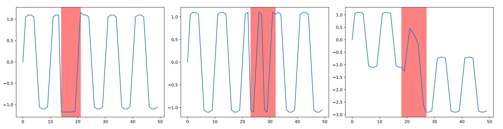
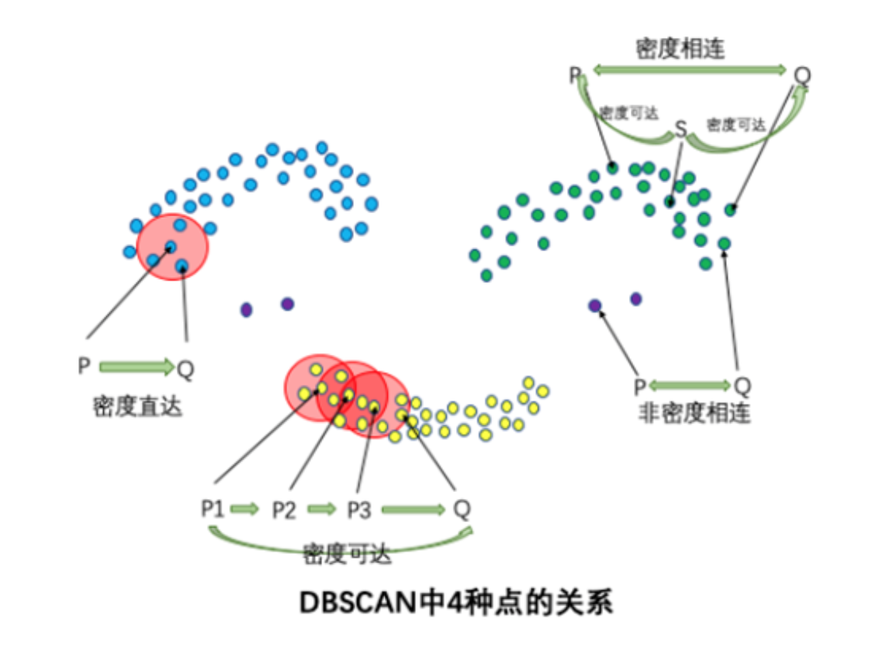
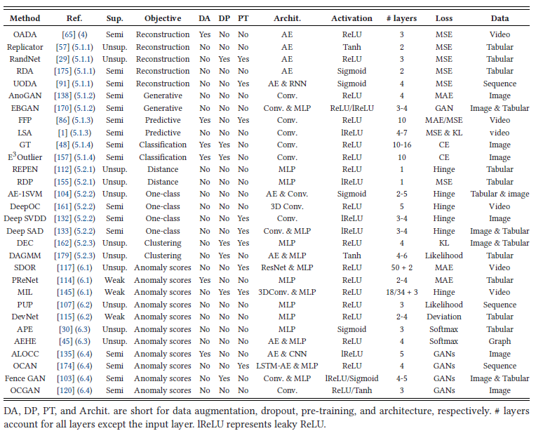

<style>
details {
    border: 1px solid #aaa;
    border-radius: 4px;
    padding: .5em .5em 0;
}
summary {
    font-weight: bold;
    margin: -.5em -.5em 0;
    padding: .5em;
}
details[open] {
    padding: .5em;
}
details[open] summary {
    border-bottom: 1px solid #aaa;
    margin-bottom: .5em;
}
</style>

<details><summary>目录</summary><p>

- [时间序列异常检测介绍](#时间序列异常检测介绍)
- [时间序列异常检测挑战](#时间序列异常检测挑战)
- [时间序列异常值分类](#时间序列异常值分类)
  - [传统分类](#传统分类)
    - [点异常值](#点异常值)
    - [上下文异常值](#上下文异常值)
    - [集体异常值](#集体异常值)
  - [深度方法分类](#深度方法分类)
    - [点(Point)异常值](#点point异常值)
    - [模式(Pattern)异常值](#模式pattern异常值)
- [时间序列异常检测方法](#时间序列异常检测方法)
  - [基于统计分布的方法](#基于统计分布的方法)
    - [3-sigma](#3-sigma)
    - [Z-score](#z-score)
    - [boxplot](#boxplot)
    - [Grubbs 检验](#grubbs-检验)
  - [基于距离的方法](#基于距离的方法)
    - [KNN](#knn)
  - [基于密度的方法](#基于密度的方法)
    - [Local Outlier Factor(LOF)](#local-outlier-factorlof)
    - [Connectivity-Based Outlier Factor(COF)](#connectivity-based-outlier-factorcof)
    - [Stochastic Outlier Selection(SOS)](#stochastic-outlier-selectionsos)
  - [基于聚类的方法](#基于聚类的方法)
    - [K-means 聚类](#k-means-聚类)
    - [DBSCAN](#dbscan)
    - [GMM](#gmm)
  - [基于树的方法](#基于树的方法)
    - [Isolation Forest 孤立森林](#isolation-forest-孤立森林)
    - [RRCF](#rrcf)
  - [基于降维的方法](#基于降维的方法)
    - [PCA](#pca)
    - [AutoEncoder](#autoencoder)
  - [基于分类的方法](#基于分类的方法)
    - [One-Class SVM](#one-class-svm)
  - [基于预测的方法](#基于预测的方法)
    - [ARIMA](#arima)
  - [基于神经网络方法](#基于神经网络方法)
    - [特征提取](#特征提取)
      - [预训练模型](#预训练模型)
    - [学习常态特征表征](#学习常态特征表征)
      - [通用常态特征表征学习](#通用常态特征表征学习)
      - [依赖异常度量的特征表征学习](#依赖异常度量的特征表征学习)
    - [端对端异常分数学习](#端对端异常分数学习)
    - [深度相关的代表性模型](#深度相关的代表性模型)
- [异常检测数据集](#异常检测数据集)
  - [SEQ](#seq)
  - [其他](#其他)
- [异常检测工具](#异常检测工具)
  - [PyOD](#pyod)
- [结论和方向](#结论和方向)
- [参考](#参考)
</p></details><p></p>

# 时间序列异常检测介绍

异常检测需要解决两个主要问题: 

* 在给定的数据集合中定义什么样的数据是异常的
* 找到一个有效的方法来检测这样的异常数据

按异常在时间序列中的不同表现形式, 时间序列异常一般可以分为 3 种，但也有其他角度的分类方法: 

* 点异常值
    - 相对于全局其他数据的异常实例
* 上下文异常值
    - 上下文异常通常在它们自己的上下文中具有相对较大/较小的值，但不是全局的
* 集体异常值
    - 相对于整个数据集异常的相关异常数据实例的集合

时间序列异常检测方法主要包括: 

1. 基于统计分布的方法
2. 基于距离的方法
3. 基于密度的方法
4. 基于聚类的方法
5. 基于树的方法
6. 基于降维的方法
7. 基于分类的方法
8. 基于预测的方法
9. 基于神经网络方法

# 时间序列异常检测挑战

* 异常检测召回率低
    - 由于异常非常罕见且异质，因此很难识别所有异常
* 异常通常在低维空间中表现出明显的异常特征，而在高维空间中变得隐藏且不明显
* 正常/异常的数据高效学习
    - 利用标记数据来学习正常/异常的表征，对于准确的异常检测至关重要
* 抗噪异常检测
    - 许多弱/半监督异常检测方法假设标记的训练数据是干净的，
      这可能容易受到被错误标记为相反类别标签的噪声实例的影响
* 复杂异常的检测
    - 现有的大多数方法都是针对点异常的，不能用于条件异常和组异常，
      因为它们表现出与点异常完全不同的行为
* 异常解释
    - 在许多安全关键领域中，如果将异常检测模型直接用作黑盒模型，则可能存在一些重大风险

# 时间序列异常值分类

## 传统分类

传统分类方法因为异常值与正常值的上下文定义边界模糊，
导致集体异常值和上下文异常值的定义边界也模糊。
上下文异常值的上下文在不同的文献中通常非常不同，它们可以是一个小窗口，
包含相邻点或在季节性方法具有相似相对位置的点


### 点异常值

* 相对于全局其他数据的异常实例。某些点与全局大多数都不一样

### 上下文异常值

* 上下文异常通常在它们自己的上下文中具有相对较大/较小的值，但不是全局的。
  即某个时间点的表现与前后时间段内存在较大差异

### 集体异常值

* 相对于整个数据集异常的相关异常数据实例的集合。
  即个体不存在异常, 但是个体同时出现表现出异常状态

## 深度方法分类




### 点(Point)异常值

* Global：全局异常
* Contextual：上下文异常

### 模式(Pattern)异常值

* Shapelet：形状异常
* Seasonal：季节性/周期性异常
* Trend：趋势异常

关于三类 Pattern 异常，可以基于 shapelet 函数来定义:

`$$X_{i,j} = \rho(2 \pi T_{i,j}, \omega) + \tau(T_{i,j})$$`

其中:

* `$X_{i,j}$` 是由多个不同频率的波的值相加得到的
* `$\rho(2 \pi T,\omega) = \sum_{n}[A \sin(2 \pi \omega_{n} T) + B \cos(2 \pi \omega_{n} T)]$`
* `$\tau(\cdot)$` 为趋势项，例如：线性函数 `$\tau(T) = T$`

如果 `$s$` 为相似相度量函数，那么以上三种异常类型可以分别定义为：

* Shapelet outliers(异常的局部子序列)
    - `$s(\rho(\cdot), \hat{\rho}(\cdot)) > \delta$`，其中，`$\delta$` 为异常判定的阈值
* Seasonal outliers(异常周期性的局部子序列)
    - `$s(\omega, \hat{\omega}) > \delta$`，其中，`$\delta$` 为异常判定的阈值
* Trend outliers(异常趋势的局部子序列)
    - `$s(\tau(\cdot), \hat{\tau}(\cdot)) > \delta$`，其中，`$\delta$` 为异常判定的阈值

# 时间序列异常检测方法


## 基于统计分布的方法

基于统计的方法最直观，适用于几乎所有类型的时间序列。
在这种方法中，异常值的上限和下限是根据特定的统计量创建的，
例如：均值、标准差、Z 统计量、T 统计量、分布的百分位数

### 3-sigma

基于正态分布，3sigma 准则认为值在 `$(\mu - 3\sigma, \mu + 3\sigma)$` 区间的概率为 99.74%, 
当数据分布超过这个区间时即认为是异常数据, 为提升准确率可采用同环比策略

取整个序列的均值和标准差是不可取的，因为在这种情况下，边界将是静态的。
边界应该在滚动窗口的基础上创建，就像考虑一组连续的观察来创建边界，
然后转移到另一个窗口。该方法是一种高效、简单的离群点检测方法


Python 实现异常检测的边界阈值:

```python
def three_sigma(s):
    mu, std = np.means(s), np.std(s)
    lower, upper = mu - 3 * std, mu + 3 * std

    return lower, upper
```

### Z-score

Z-score 为标准分数，测量数据点和平均值的距离，若测量值与平均值相差 2 个标准差，Z-score 为 2。
当把 Z-score = 3 作为阈值去提出异常点时，便相当于 3sigma

Python 实现 Z-score 计算:

```python
def z_score(s):
    z_score = (s - np.mean(s)) / np.std(s)

    return z_score
```

### boxplot

箱线图是基于四分位距(IQR)检测异常点的


Python 实现异常检测的边界阈值:

```python
def boxplot(s):
    q1, q3 = s.quantile(0.25), s.quantile(0.75)
    iqr = q3 - q1
    lower, upper = q1 - 1.5 * iqr, q3 + 1.5 * iqr

    return lower, upper
```

### Grubbs 检验

Grubbs 检验常被用来检验服从正态分布的单变量数据集(univariate dataset) 中的单个异常值。
若有异常值，则其必为数据集中的最大值或最小值

Grubbs 检验的原假设与备择假设如下：

* H0: 数据集中没有异常值
* H1: 数据集中有一个异常值

Grubbs 检验需要总体是正态分布。算法流程如下：

1. 序列样本从小到大排序
2. 求序列样本的均值 mean 和标准差 std
3. 计算 min 和 max 与 mean 的差距，更大的那个为可疑值
4. 求可疑值的 Z-score(standard score)，如果大于 Grubbs 临界值，那么就是异常值
5. 排除序列中的异常值，对剩余序列循环做 1-4 步骤

Grubbs 临界值可以查表得到，它由两个值决定：

* 检出水平 `$\alpha$`(越严格越小)
* 样本数量 `$n$`

Grubbs 检验方法的局限：

* 只能检测单维度数据
* 无法精确的输出正常区间
* 它的判断机制是“逐一剔除”，所以每个异常值都要单独计算整个步骤，数据量大吃不消
* 需假定数据服从正态分布或近正态分布

Python 实现 Grubbs 异常检测示例:

```python
from outliers import smirnov_grubbs as grubbs

print(grubbs.test([8, 9, 10, 1, 9], alpha = 0.05))
print(grubbs.min_test_outliers([8, 9, 10, 1, 9], alpha = 0.05))
print(grubbs.max_test_outliers([8, 9, 10, 1, 9], alpha = 0.05))
print(grubbs.max_test_indices([8, 9, 10, 50, 9], alpha = 0.05))
```

## 基于距离的方法

### KNN

KNN 依次计算每个样本与它最近的 `$K$` 个样本的平均距离，
再利用计算的距离与阈值进行比较，如果大于阈值，则认为是异常值

* 优点是不需要假设数据的分布
* 缺点是仅可以找出全局异常点，无法找到局部异常点

Python 实现 KNN 异常检测示例:

```python
from pyod.models.knn import KNN

# 初始化检测器 clf
clf = KNN(method = "mean", n_neighbors = 3)
clf.fit(X_train)

# 返回训练数据上的分类标签(0: 正常值, 1:异常值)
y_train_pred = clf.labels_

# 返回训练数据上的异常值(分数越大越异常)
y_train_scores = clf.decision_scores_
```

## 基于密度的方法

### Local Outlier Factor(LOF)

LOF 是基于密度的经典算法，通过给每个数据点都分配一个依赖于邻域密度的离群因子 LOF，
进而判断该数据点是否为离群点。它的好处在于可以量化每个数据点的异常程度(outlierness)


**数据点 P 的局部相对密度(局部异常因子, LOF)：** 

`$$LOF_{k}(P) = \frac{\sum_{N_{k}(P) \in O}\frac{lrd_{k}(O)}{lrd_{k}(P)}}{|N_{k}(P)|} \\
              = \frac{\frac{\sum_{N_{k}(P) \in O}lrd_{k}(O)}{|N_{k}(P)|}}{lrd_{k}(P)}$$`

**数据点 P 在 `$k$` 邻域内点的平均局部可达密度：**

`$$\frac{\sum_{N_{k}(P) \in O}lrd_{k}(O)}{|N_{k}(P)|}$$`

**数据点 P 的局部可达密度(数据点 P 最近邻的平均可达距离的倒数。距离越大，密度越小)：**

`$$lrd_{k}(P) = \frac{1}{\frac{\sum_{N_{k}(P) \in O} reach\_dist_{k}(O, P)}{|N_{k}(P)|}}$$`

**点 P 到点 O 的第 `$k$` 可达距离：**


`$$reach\_dist_{k}(O, P) = max\{d_{k}(O), d(O, P)\}$$`

其中:

* `$d_{k}(O)$`: 点 O 的 `$k$` 近邻距离，即第 `$k$` 个最近的点跟点 O 之间的距离
* `$d(O, P)$`: 点 P 到点 O 的距离

整体来说，LOF 算法流程如下：

* 对于每个数据点，计算它与其他所有点的距离，并按从近到远排序
* 对于每个数据点，找到它的 K-Nearest-Neighbor，计算 LOF 得分

Python 实现 LOF 算法示例：

```python
from sklearn.neighbors import LocalOutlierFactor as LOF

X = [[-1.1],
     [0.2],
     [100.1],
     [0.3]]

clf = LOF(n_neighbors = 2)

res = clf.fit_predict(X)
print(res)

print(clf.negative_outlier_factor_)
```

### Connectivity-Based Outlier Factor(COF)

COF 是 LOF 的变种，相比于 LOF，COF 可以处理低密度下的异常值，
COF 的局部密度是基于平均链式距离计算得到。
在一开始的时候一样会先计算出每个点的 k-nearest neighbor。
而接下来会计算每个点的 Set Based Nearest Path，如下图


假使 `$k=5$`，所以 F 的 neighbor 为 B、C、D、E、G。而对于 F 离他最近的点为 E，
所以 SBN Path 的第一个元素是 F、第二个是 E。离 E 最近的点为 D 所以第三个元素为 D，
接下来离 D 最近的点为 C 和 G，所以第四和五个元素为 C 和 G，最后离 C 最近的点为 B，
第六个元素为 B。所以整个流程下来，F 的 SBN Path 为 `$\{F, E, D, C, G, C, B\}$`。
而对于 SBN Path 所对应的距离 `$e=\{e_1, e_2, e_3,\ldots,e_k\}$`，依照上面的例子 `$e=\{3,2,1,1,1\}$`

所以可以说假使想计算 p 点的 SBN Path，
只要直接计算 p 点和其 neighbor 所有点所构成的 graph 的 minimum spanning tree，
之后再以 p 点为起点执行 shortest path 算法，就可以得到 SBN Path。
有了 SBN Path 后，接下来就会计算 p 点的链式距离

`$$ac\_distance(p) = \sum_{i=1}^{k}\frac{2(k+1-i)}{k(k+1)}dist(e_{i})$$`

有了 `$ac\_distance$` 后，就可以计算 COF：

`$$COF(p) = \frac{ac\_distance(p)}{\frac{1}{k} \sum_{o \in N_{k}(p)} ac\_distance(o)}$$`

Python 实现 COF 异常检测示例：

```python
from pyod.models.cof import COF

cof = COF(
    contamination = 0.06,  # 异常值所占的比例
    n_neighbors = 20,  # 近邻数量
)

cof_label = cof.fit_predict(iris.values)
print(f"检测出的异常值数量为：{np.sum(cof_label == 1)}")
```

### Stochastic Outlier Selection(SOS)

SOS 的思想是：当一个点和其它所有点的关联度(affinity)都很小的时候，它就是一个异常点。
将特征矩阵(feature martrix)或者相异度矩阵(dissimilarity matrix)输入给 SOS 算法，
会返回一个异常概率值向量(每个点对应一个)


SOS 算法的流程：

1. 计算相异度矩阵 `$D$`
    - 相异度矩阵(dissimilarity matrix)是各样本两两之间的度量距离，比如欧式距离或汉明距离等
2. 计算关联度矩阵 `$A$`
    - 关联度矩阵(affinity matrix)反映的是度量距离方差，如图：点 `$x_{5}$` 的密度最大，方差最小； 
      `$x_{6}$` 的密度最小，方差最大


3. 计算关联概率矩阵 `$B$`
    - 关联概率矩阵(binding probability matrix)就是把关联矩阵(affinity matrix)按行归一化得到的


4. 算出异常概率向量
    - 得到了关联概率矩阵，每个点的异常概率值就用如下的公式计算，
      当一个点和其它所有点的关联度(affinity)都很小的时候，它就是一个异常点

    `$$p(x_{i} \in C_{0}) = \prod_{j \neq i}(1 - b_{ji})$$`


Python 实现 SOS 异常检测算法示例：

```python
import pandas as pd
from sksos import SOS

# data
iris = pd.read_csv("http://bit.ly/iris-csv")
X = iris.drop("Name", axis = 1).values

# model
detector = SOS()
iris["score"] = detector.predict(X)
iris.sort_values("score", ascending = False).head(10)
```

## 基于聚类的方法

### K-means 聚类

K-means 聚类是一种无监督机器学习算法，经常用于检测时间序列数据中的异常值。
该算法查看数据集中的数据点，并将相似的数据点分组为 K 个聚类。
通过测量数据点到其最近质心的距离来区分异常。
如果距离大于某个阈值，则将该数据点标记为异常。
K-Means 算法使用欧几里得距离进行比

### DBSCAN

DBSCAN 算法(Density-Based Spatial Clustering of Applications with Noise)的输入和输出如下，
对于无法形成聚类簇的孤立点，即为异常点(噪声点)

DBSCAN 输入：

* 数据集，邻域半径 Eps，邻域中数据对象数目阈值 MinPts

DBSCAN 输出：

* 密度联通簇

DBSCAN 中的三种点的类别:


DBSCAN 中的四种点的关系:



DBSCAN 的算法实现步骤:


DBSCAN 算法具体处理流程如下:

1. 从数据集中任意选取一个数据对象点 p
2. 如果对于参数 Eps 和 MinPts，所选取的数据对象点 p 为核心点，则找出所有从 p 密度可达的数据对象点，形成一个簇
3. 如果选取的数据对象点 p 是边缘点，选取另一个数据对象点
4. 重复以上 2、3 步，直到所有点被处理

Python 实现 DBSCAN 异常检测示例:

```python
from sklearn.cluster import DBSCAN
import numpy as np

# 数据
X = np.array(
    [[1, 2],
     [2, 2],
     [2, 3],
     [8, 7],
     [8, 8],
     [25, 80]]
)

# 聚类
clustering = DBSCAN(eps = 3, min_samples = 2).fit(X)
clustering.lables_
```

```
array([ 0,  0,  0,  1,  1, -1])
# 0，,0，,0：表示前三个样本被分为了一个群
# 1, 1：中间两个被分为一个群
# -1：最后一个为异常点，不属于任何一个群
```

### GMM


## 基于树的方法

### Isolation Forest 孤立森林

孤立森林(Isolation Forest, iForest)中的 “孤立” (isolation) 指的是 “把异常点从所有样本中孤立出来”，
论文中的原文是 “separating an instance from the rest of the instances”。

孤立森林是一种基于决策树的异常检测机器学习算法。它通过使用决策树的分区隔离给定特征集上的数据点来工作。
换句话说，它从数据集中取出一个样本，并在该样本上构建树，直到每个点都被隔离。
为了隔离数据点，随机选择 m 个特征，通过在所选特征的最大值和最小值之间随机选择一个值来分割数据点。
观察值的划分递归地重复，直到所有的观察值被孤立。
特征的随机分区将为异常数据点在树中创建更短的路径，从而将它们与其余数据区分开来

用一个随机超平面对一个数据空间进行切割，切一次可以生成两个子空间。
接下来，再继续随机选取超平面，来切割第一步得到的两个子空间，以此循环下去，
直到每子空间里面只包含一个数据点为止。可以发现，那些密度很高的簇要被切很多次才会停止切割，
即每个点都单独存在于一个子空间内，但那些分布稀疏的点，大都很早就停到一个子空间内了。
所以，整个孤立森林的算法思想：异常样本更容易快速落入叶子结点或者说，异常样本在决策树上，距离根节点更近


获得 `$t$` 个孤立树后，单棵树的训练就结束了。接下来就可以用生成的孤立树来评估测试数据了，
即计算异常分数 `$s$`。对于每个样本 `$x$`，需要对其综合计算每棵树的结果，
通过下面的公式计算异常得分： 

`$$s(x, n) = 2^{-\frac{E(h(x))}{c(n)}}$$`

其中:

* `$h(x)$`：样本在 iTree 上的 PathLength
* `$E(h(x))$`：样本在 `$t$` 棵 iTree 的 PathLength 的均值
* `$c(n)$` `$n$` 个样本构建一个二叉搜索数 BST 中的未成功搜索平均路径长度(均值 `$h(x)$` 对外部节点终端的估计等同于 BST 的未成功搜索)，
  `$E(h(x))/c(n)$` 是对样本 `$x$` 的路径长度 `$h(x)$` 进行标准化处理。
  `$H(n-1)$` 是调和数，可使用 `$\ln(n-1) + 0.5772156649$`(欧拉常数)估算

  `$$c(n) = 2H(n-1) - \frac{2(n-1)}{n} = 2[ln(n-1) + 0.5772156649] - \frac{2(n-1)}{n}$$`

异常分数 `$s$` 指数部分值域为 `$(-\infty, 0)$`，因此 `$s$` 值域为 `$(0, 1)$`。
当 PathLength 越小，`$s$` 越接近 1，此时样本为异常值的概率越大

Python 实现 iForest 异常检测示例：

```python
from sklearn.datasets import load_iris
from sklearn.ensemble import IsolationForest

data = load_iris(as_frame = True)
X, y = data.data, data.target
df = data.frame

# 模型初始化
iforest = IsolationForest(
    n_estimators = 100,
    max_samples = "auto",
    contamination = 0.05,
    max_features = 4,
    bootstrap = False,
    n_jobs = -1,
    random_state = 1,
)

# 模型训练、预测
df["label"] = iforest.fit_predict(X)

# 模型预测
df["scores"] = iforest.decision_function(X)
```

### RRCF

## 基于降维的方法

### PCA

PCA 在异常检测方面的做法，大体有两种思路：

* 将数据映射到低维特征空间，然后在特征空间不同维度上查看每个数据点跟其它数据的偏差
* 将数据映射到低维特征空间，然后由低维特征空间重新映射回原空间，
  尝试用低维特征重构原始数据，看重构误差的大小

PCA 在做特征值分解，会得到：

* 特征向量：反应了原始数据方差变化程度的不同方向
* 特征值：数据在对应方向上的方差大小

所以，最大特征值对应的特征向量为数据方差最大的方向，最小特征值对应的特征向量为数据方差最小的方向。
原始数据在不同方向上的方差变化反应了其内在特点。如果单个数据样本跟整体数据样本表现出的特点不太一致，
比如在某些方向上跟其它数据样本偏离较大，可能就表示该数据样本是一个异常点

在前面提到第一种做法中，样本 `$x_i$` 的异常分数为该样本在所有方向上的偏离程度： 

`$$Score(x_{i}) = \sum_{j=1}^{n}d_{ij} = \sum_{j=1}^{n}\frac{(x_{i}^{T}) \cdot e_{j}}{}$$`

其中，  为样本在重构空间里离特征向量的距离。若存在样本点偏离各主成分越远，  会越大，意味偏移程度大，异常分数高。  是特征值，用于归一化，使不同方向上的偏离程度具有可比性。


在计算异常分数时，关于特征向量（即度量异常用的标杆）选择又有两种方式：

* 考虑在前 k 个特征向量方向上的偏差：前 k 个特征向量往往直接对应原始数据里的某几个特征，
  在前几个特征向量方向上偏差比较大的数据样本，往往就是在原始数据中那几个特征上的极值点
* 考虑后 r 个特征向量方向上的偏差：后 r 个特征向量通常表示某几个原始特征的线性组合，
  线性组合之后的方差比较小反应了这几个特征之间的某种关系。在后几个特征方向上偏差比较大的数据样本，
  表示它在原始数据里对应的那几个特征上出现了与预计不太一致的情况得分大于阈值 C 则判断为异常

第二种做法，PCA 提取了数据的主要特征，如果一个数据样本不容易被重构出来，
表示这个数据样本的特征跟整体数据样本的特征不一致，那么它显然就是一个异常的样本： 


其中，是基于k维特征向量重构的样本。

基于低维特征进行数据样本的重构时，舍弃了较小的特征值对应的特征向量方向上的信息。
换一句话说，重构误差其实主要来自较小的特征值对应的特征向量方向上的信息。
基于这个直观的理解，PCA 在异常检测上的两种不同思路都会特别关注较小的特征值对应的特征向量。
所以，我们说 PCA 在做异常检测时候的两种思路本质上是相似的，
当然第一种方法还可以关注较大特征值对应的特征向量


```python
from sklearn.decomposition import PCA
pca = PCA()
pca.fit(centered_training_data)
transformed_data = pca.transform(training_data)
y = transformed_data

# 计算异常分数
lambdas = pca.singular_values_
M = ((y*y)/lambdas)

# 前k个特征向量和后r个特征向量
q = 5
print "Explained variance by first q terms: ", sum(pca.explained_variance_ratio_[:q])
q_values = list(pca.singular_values_ < .2)
r = q_values.index(True)

# 对每个样本点进行距离求和的计算
major_components = M[:,range(q)]
minor_components = M[:,range(r, len(features))]
major_components = np.sum(major_components, axis=1)
minor_components = np.sum(minor_components, axis=1)

# 人为设定c1、c2阈值
components = pd.DataFrame({'major_components': major_components, 
                               'minor_components': minor_components})
c1 = components.quantile(0.99)['major_components']
c2 = components.quantile(0.99)['minor_components']

# 制作分类器
def classifier(major_components, minor_components):  
    major = major_components > c1
    minor = minor_components > c2    
    return np.logical_or(major,minor)

results = classifier(major_components=major_components, minor_components=minor_components)
```


### AutoEncoder

PCA 是线性降维，AutoEncoder 是非线性降维。根据正常数据训练出来的 AutoEncoder，
能够将正常样本重建还原，但是却无法将异于正常分布的数据点较好地还原，导致还原误差较大。
因此如果一个新样本被编码，解码之后，它的误差超出正常数据编码和解码后的误差范围，
则视作为异常数据。需要注意的是，AutoEncoder 训练使用的数据是正常数据（即无异常值），
这样才能得到重构后误差分布范围是多少以内是合理正常的。所以 AutoEncoder 在这里做异常检测时，
算是一种有监督学习的方法

```python
import tensorflow as tf
from keras.models import Sequential
from keras.layers import Dense

# 标准化数据
scaler = preprocessing.MinMaxScaler()
X_train = pd.DataFrame(scaler.fit_transform(dataset_train),
                              columns=dataset_train.columns,
                              index=dataset_train.index)
# Random shuffle training data
X_train.sample(frac=1)
X_test = pd.DataFrame(scaler.transform(dataset_test),
                             columns=dataset_test.columns,
                             index=dataset_test.index)

tf.random.set_seed(10)
act_func = 'relu'
# Input layer:
model=Sequential()
# First hidden layer, connected to input vector X.
model.add(Dense(10,activation=act_func,
                kernel_initializer='glorot_uniform',
                kernel_regularizer=regularizers.l2(0.0),
                input_shape=(X_train.shape[1],)
               )
         )
model.add(Dense(2,activation=act_func,
                kernel_initializer='glorot_uniform'))
model.add(Dense(10,activation=act_func,
                kernel_initializer='glorot_uniform'))
model.add(Dense(X_train.shape[1],
                kernel_initializer='glorot_uniform'))
model.compile(loss='mse',optimizer='adam')
print(model.summary())

# Train model for 100 epochs, batch size of 10:
NUM_EPOCHS=100
BATCH_SIZE=10
history=model.fit(np.array(X_train),np.array(X_train),
                  batch_size=BATCH_SIZE,
                  epochs=NUM_EPOCHS,
                  validation_split=0.05,
                  verbose = 1)

plt.plot(history.history['loss'],
         'b',
         label='Training loss')
plt.plot(history.history['val_loss'],
         'r',
         label='Validation loss')
plt.legend(loc='upper right')
plt.xlabel('Epochs')
plt.ylabel('Loss, [mse]')
plt.ylim([0,.1])
plt.show()

# 查看训练集还原的误差分布如何，以便制定正常的误差分布范围
X_pred = model.predict(np.array(X_train))
X_pred = pd.DataFrame(X_pred,
                      columns=X_train.columns)
X_pred.index = X_train.index

scored = pd.DataFrame(index=X_train.index)
scored['Loss_mae'] = np.mean(np.abs(X_pred-X_train), axis = 1)
plt.figure()
sns.distplot(scored['Loss_mae'],
             bins = 10,
             kde= True,
            color = 'blue')
plt.xlim([0.0,.5])

# 误差阈值比对，找出异常值
X_pred = model.predict(np.array(X_test))
X_pred = pd.DataFrame(X_pred,
                      columns=X_test.columns)
X_pred.index = X_test.index
threshod = 0.3
scored = pd.DataFrame(index=X_test.index)
scored['Loss_mae'] = np.mean(np.abs(X_pred-X_test), axis = 1)
scored['Threshold'] = threshod
scored['Anomaly'] = scored['Loss_mae'] > scored['Threshold']
scored.head()
```


## 基于分类的方法

### One-Class SVM

One-Class SVM 算法的思路非常简单，就是寻找一个超平面将样本中的正例圈出来，
预测就是用这个超平面做决策，在圈内的样本就认为是正样本，在圈外的样本是负样本，
用在异常检测中，负样本可看做异常样本。它属于无监督学习，所以不需要标签

One-Class SVM 又一种推导方式是 SVDD(Support Vector Domain Description，支持向量域描述)，
对于 SVDD 来说，我们期望所有不是异常的样本都是正类别，同时它采用一个超球体，
而不是一个超平面来做划分，该算法在特征空间中获得数据周围的球形边界，
期望最小化这个超球体的体积，从而最小化异常点数据的影响

假设产生的超球体参数为中心 `$o$` 和对应的超球体半径 `$r>0$`，超球体体积 `$V(r)$` 被最小化，
中心 `$o$` 是支持行了的线性组合；跟传统 SVM 方法相似，可以要求所有训练数据点 `$x_{i}$` 到中心的距离严格小于 `$r$`。
但是同时构造一个惩罚系数为 C 的松弛变量 `$\zeta_{i}$`，优化问题入下所示：

`$$\underbrace{min}_{r,\rho} V(r) + C\sum_{i=1}^{m}\zeta_{i}$$`

`$$||x_{i} - o||_{2} \leq r + \xi_{i}, i = 1,2,\ldots,m$$`
`$$\xi_{i} \geq 0, i = 1,2,\ldots,m$$`

C 是调节松弛变量的影响大小，说的通俗一点就是，给那些需要松弛的数据点多少松弛空间，
如果 C 比较小，会给离群点较大的弹性，使得它们可以不被包含进超球体

```python
from sklearn import svm

clf = svm.OneClassSVM(nu = 0.1, kernel = "rfb", gamma = 0.1)
clf.fit(X)

y_pred = clf.predict(X)
n_error_outlier = y_pred[y_pred == -1].size
```

## 基于预测的方法

对于单条时序数据，根据其预测出来的时序曲线和真实的数据相比，求出每个点的残差，
并对残差序列建模，利用 KSigma 或者分位数等方法便可以进行异常检测。具体的流程如下


### ARIMA


## 基于神经网络方法


1. 特征提取
    - deep learning 和 anomaly detection 是分开的，deep learning 只负责特征提取
2. 常态特征表征学习：deep learning 和 anomaly detection 是相互依赖的，一起学习正常样本的有效表征
    - 通用常态特征表征学习：这类方法最优化一个特征学习目标函数，该函数不是为异常检测而设计的，
      但学习到的高级特征能够用于异常检测，因为这些高级特征包含了数据的隐藏规律
    - 依赖异常度量的特征表征学习：该类方法直接将现有的异常评价指标嵌入表征学习的优化目标中
3. 端对端异常分数学习
    - deep learning 和 anomaly detection 是完全一体的，通过端到端的学习，直接输出异常分数

### 特征提取

旨在利用深度学习从高维和/或非线性可分离数据中提取低维特征表征，用于下游异常检测。
特征提取和异常评分完全不相交且彼此独立。因此，深度学习组件仅作为降维工作

优点：

* 很容易获得大量先进的预训练深度模型和现成的异常检测器做特征提取和异常检测
* 深度特征提取比传统线性方法更有效

缺点：

* 特征提取和异常评分是独立分开的，通常会导致次优的异常评分
* 预训练的深度模型通常仅限于特定类型的数据。(感觉更适用于图像，
  因为图像可以做分类预训练，个人对时序预训练了解的不是很多)

#### 预训练模型

### 学习常态特征表征

#### 通用常态特征表征学习

这类方法最优化一个特征学习目标函数，该函数不是为异常检测而设计的，
但学习到的高级特征能够用于异常检测，因为这些高级特征包含了数据的隐藏规律。
例如：AutoEncoder、GAN、预测模型(LSTM)。

优点：

* AE：方法简单，可用不同AE变种
* GAN：产生正常样本的能力很强，而产生异常样本的能力就很弱，因此有利于进行异常检测
* 预测模型：存在大量序列预测模型，能学到时间和空间的依赖性

缺点：

* AE：学习到的特征表征可能会因为“训练数据中不常见的规律、异常值或噪声“而产生偏差
* GAN：训练可能存在多种问题，比如难以收敛，模式坍塌。因此，基于异常检测的 GANs 训练或难以进行
* 预测模型：序列预测的计算成本高

另外，以上方法都有两个共性问题：

* 都假设训练集是正常样本，但若训练集中混入噪声或异常值，会给模型表征学习能力带来偏差
* 没有将异常评价纳入到模型优化的目标当中，最后检测的结果可能是次优的

#### 依赖异常度量的特征表征学习

该类方法直接将现有的异常评价指标嵌入表征学习的优化目标中，
解决了通用常态特征表征学习中第二个共性问题。
例如 Deep one-class SVM，Deep one-class Support Vector Data Description(Deep one-class SVDD)等

优化：

* 基于距离的度量：比起传统方法，能处理高维空间数据，有丰富的理论支持
* 基于one-class分类的度量：表征学习和one-class模型能一起学习更好的特征表示，同时免于手动选择核函数
* 基于聚类的度量：对于复杂数据，可以让聚类方法在深度专门优化后的表征空间内检测异常点

缺点：

* 基于距离的度量：计算量大
* 基于one-class分类的度量：在正常类内分布复杂的数据集上，该模型可能会无效
* 基于聚类的度量：模型的表现严重依赖于聚类结果。也受污染数据的影响

以上缺点在于：没办法直接输出异常分数

### 端对端异常分数学习

通过端到端的学习，直接输出异常分数。个人对这部分的了解是一片空白，
只能初略转述下综述中的内容，有兴趣的朋友可以阅读原文跟进相关工作

优点：

* 排名模型：利用了排序理论
* 先验驱动模型：将不同的先验分布嵌入到模型中，并提供更多解释性
* Softmax似然模型：可以捕捉异常的特征交互信息
* 端到端的one-class分类模型：端到端式的对抗式优化，GAN有丰富的理论和实践支持

缺点：

* 排名模型：训练数据中必须要有异常样本
* 先验驱动模型：没法设计一个普遍有效的先验，若先验分布不能很好地拟合真实分布，模型的效果可能会变差
* Softmax 似然模型：特征交互的计算成本很大，而且模型依赖负样本的质量
* 端到端的 one-class 分类模型：GAN 具有不稳定性，且仅限于半监督异常检测场景

### 深度相关的代表性模型



# 异常检测数据集

## SEQ

基于 shapelet 函数，可以获取 35 个合成数据集(可称 NeurlIPS-TS synthestic datasets or SEQ),
其中 20 个单变量，15 个多变量数据集。该数据集覆盖各类异常数据

## 其他


# 异常检测工具

## PyOD

* [GitHub](https://github.com/yzhao062/Pyod)
* [Doc](https://pyod.readthedocs.io/en/latest/)
* [知乎](https://www.zhihu.com/people/breaknever/posts?page=3)
* [Resources](https://github.com/yzhao062/anomaly-detection-resources)
* https://www.andrew.cmu.edu/user/yuezhao2/

# 结论和方向

把异常度量目标加入到表征学习中：表征学习时，一个关键问题是它们的目标函数是通用的，
但没有专门针对异常检测进行优化。在前面有提到依赖于异常度量的特征学习，
它便是通过施加来自传统异常度量的约束，来帮助解决这个问题

* 探索少标记样本的利用
    - 探索利用这些小标记数据来学习更强大的检测模型和更深层次架构
* 大规模无监督/自监督表示学习
    - 首先在无监督/自监督模式下从大规模未标记数据中学习可迁移的预训练表示模型，然后在半监督模式下微调异常检测模型
* 复杂异常的深度检测
    - 对条件/组异常的深度模型的探索明显较少。另外多模态异常检测是一个很大程度上尚未探索的研究领域
* 可解释和可操作的深度异常检测
    - 具有提供异常解释的内在能力的深度模型很重要，能减轻对人类用户的任何潜在偏见/风险以及实现决策行动
* 新颖的应用和设置
    - 例如分布外(OOD)检测、curiosity learning 等

# 参考

* [[1]时序异常检测综述整理](https://mp.weixin.qq.com/s/KNeSAPx-6B-wo5jzCM17YQ)
* [[2]Revisiting Time Series Outlier Detection:Definitions and Benchmarks](https://openreview.net/pdf?id=r8IvOsnHchr)
* [[3]异常检测综述：Deep Learning for Anomaly Detection: A Review](https://zhuanlan.zhihu.com/p/419161328)
* [[4]异常检测方法总结](https://mp.weixin.qq.com/s/rD229uPGuMCAhAnVfrN6Sg)
* [[5]时序预测竞赛之异常检测算法综述](https://zhuanlan.zhihu.com/p/336944097)
* [[6]剔除异常值栅格计算器](https://blog.csdn.net/weixin_39974030/article/details/112569610)
* [[7]异常检测算法之(KNN)-K Nearest Neighbors](https://zhuanlan.zhihu.com/p/501691799)
* [[8]一文读懂异常检测 LOF 算法(Python代码)](https://zhuanlan.zhihu.com/p/448276009)
* [[9]Nowak-Brzezińska, A., & Horyń, C. (2020). Outliers in rules-the comparision of LOF, COF and KMEANS algorithms. *Procedia Computer Science*, *176*, 1420-1429.]()
* [[10]機器學習_學習筆記系列(98)：基於連接異常因子分析(Connectivity-Based Outlier Factor) - 劉智皓 (Chih-Hao Liu)]()
* [[11]异常检测之SOS算法](https://zhuanlan.zhihu.com/p/34438518)
* [[12]SOS GitHub](https://github.com/jeroenjanssens/scikit-sos)
* [[13]DBSCAN算法详解](https://zhuanlan.zhihu.com/p/515268801)
* [[14]异常检测算法--孤立森林（Isolation Forest）剖析](https://zhuanlan.zhihu.com/p/74508141)
* [[15]孤立森林(isolation Forest)-一个通过瞎几把乱分进行异常检测的算法](https://zhuanlan.zhihu.com/p/484495545)
* [[16]孤立森林阅读](https://blog.csdn.net/MarkAustralia/article/details/120181899)
* [[17]数据异常值检测算法](https://zhuanlan.zhihu.com/p/362358580)
* [[18]时间序列异常检测](https://mp.weixin.qq.com/s/9TimTB_ccPsme2MNPuy6uA)
* [[19]One Class SVM](http://t.zoukankan.com/wj-1314-p-10701708.html)
* [[20]单类 SVM: SVDD](https://zhuanlan.zhihu.com/p/65617987)
* [[21]AutoEncoder](https://zhuanlan.zhihu.com/p/260882741)
* [[22]利用 Autoencoder 进行无监督异常检测](https://zhuanlan.zhihu.com/p/46188296)
* [[23]自编码器 AutoEncoder 解决异常检测问题](https://zhuanlan.zhihu.com/p/260882741)

