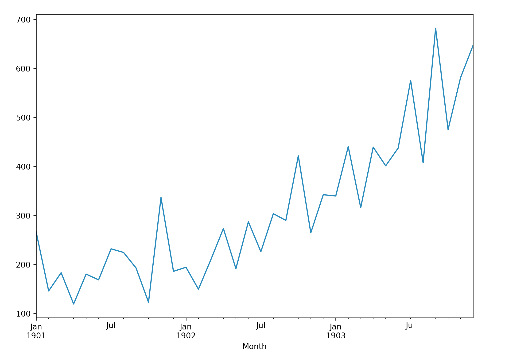

# baseline 特点


- Simple: A method that requires little or no training or intelligence.
- Fast: A method that is fast to implement and computationally trivial to make a prediction.
- Repeatable: A method that is deterministic, meaning that it produces an expected output given the same input.

# 数据


```python
import pandas as pd 
import matplotlib.pyplot as plt 
from sklearn.metrics import mean_squared_error
```


```python
def parser(x):
   return pd.datetime.strptime("190" + x, "%Y-%m")

series = pd.read_csv(
   "https://raw.githubusercontent.com/jbrownlee/Datasets/master/shampoo.csv",
   header = 0,
   parse_dates = [0],
   index_col = 0,
   squeeze = True,
   date_parser = parser
)
print(series.head())
series.plot()
plt.show()
```

```
Month
1901-01-01    266.0
1901-02-01    145.9
1901-03-01    183.1
1901-04-01    119.3
1901-05-01    180.3
Name: Sales, dtype: float64
```



# baseline 模型

- 将单变量时间序列数据转换为监督学习问题
- 建立训练集和测试集
- 定义持久化模型
- 进行预测并建立 baseline 性能
- 查看完整的示例并绘制输出

## 数据转换

```python
# Create lagged dataset
values = pd.DataFrame(series.values)
df = pd.concat([values.shift(1), values], axis = 1)
df.columns = ["t-1", "t+1"]
print(df.head(5))
```

## 建立训练集和测试集


```python
# split into train and test sets
X = df.values
train_size = int(len(X) * 0.66)
train, test = X[1:train_size], X[train_size:]
train_X, train_y = train[:, 0], train[:, 1]
test_X, test_y = test[:, 0], test[:, 1]
```

## 算法

```python
# persistence model
def model_persistence(x):
   return x
```

## 预测并评估预测结果


```python
# walk-forward validation
predictions = list()
for x in test_X:
   yhat = model_persistence(x)
   predictions.append(yhat)
test_score = mean_squared_error(test_y, predictions)
print("Test MSE: %.3f" % test_score)
```

## 预测结果可视化


```python
# plot predictions and expected results
plt.plot(train_y)
plt.plot([None for i in train_y] + [x for x in test_y])
plt.plot([None for i in train_y] + [x for x in predictions])
plt.show()
```