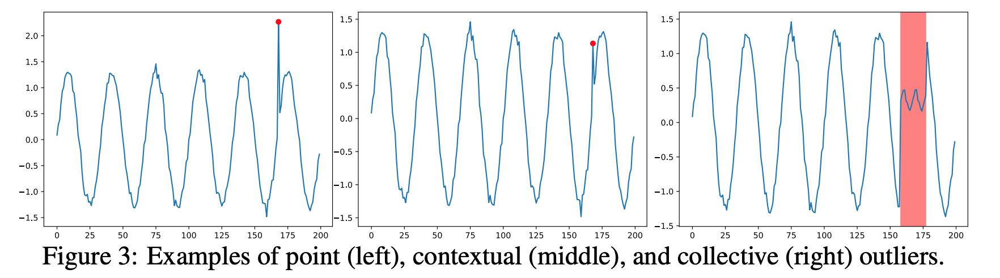
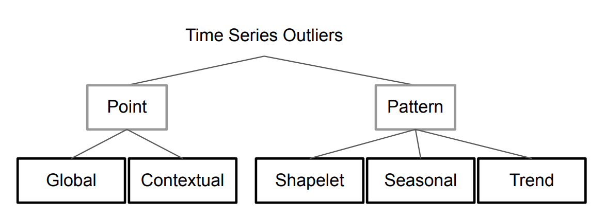
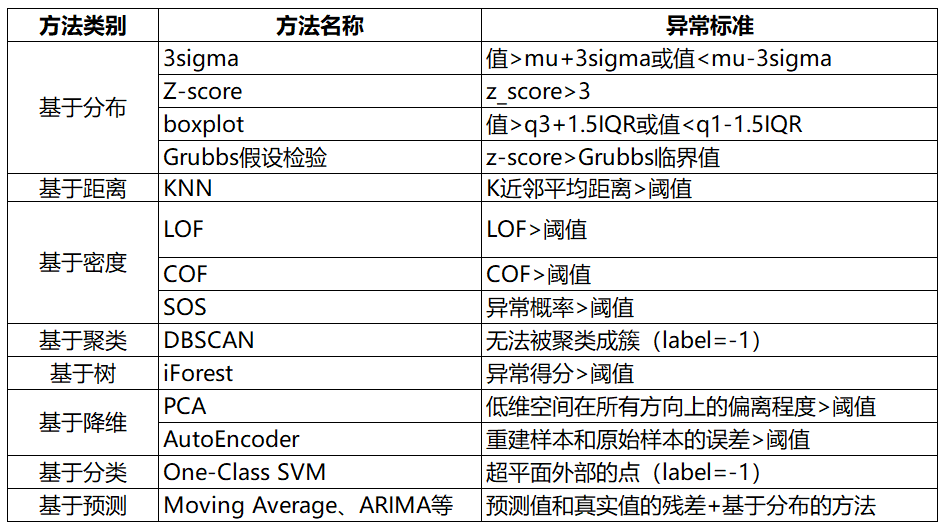

目录

- [时间序列异常检测介绍](#时间序列异常检测介绍)
- [异常分类](#异常分类)
  - [传统分类](#传统分类)
    - [点异常值](#点异常值)
    - [上下文异常值](#上下文异常值)
    - [集体异常值](#集体异常值)
  - [深度方法分类](#深度方法分类)
    - [点(Point)异常值](#点point异常值)
    - [模式(Pattern)异常](#模式pattern异常)
- [异常检测挑战](#异常检测挑战)
- [异常检测模型](#异常检测模型)
  - [基于统计方法和机器学习的方法](#基于统计方法和机器学习的方法)
    - [异常的定义](#异常的定义)
    - [基于统计](#基于统计)
    - [基于度量](#基于度量)
    - [基于深度学习](#基于深度学习)
    - [多变量时间序列](#多变量时间序列)
  - [基于神经网络方法](#基于神经网络方法)
    - [特征提取](#特征提取)
    - [通用常态特征表征学习](#通用常态特征表征学习)
    - [依赖异常度量的特征表征学习](#依赖异常度量的特征表征学习)
    - [端对端异常分数学习](#端对端异常分数学习)
    - [深度相关的代表性模型](#深度相关的代表性模型)
- [异常检测数据集](#异常检测数据集)
  - [SEQ](#seq)
  - [其他](#其他)
- [异常检测工具](#异常检测工具)
  - [PyOD](#pyod)
- [结论和方向](#结论和方向)
- [参考](#参考)

# 时间序列异常检测介绍

异常检测(Outlier Detection)也称为异常挖掘或异常检测, 
是从大量数据中提取隐含在其中的人们事先不知道的但又是潜在的有用的信息和知识的过程

异常检测需要解决两个主要问题: 

* 在给定的数据集合中定义什么样的数据是异常的
* 找到一个有效的方法来检测这样的异常数据
  
按异常在时间序列中的不同表现形式, 时间序列异常可以分为3种: 

* 序列异常
* 点异常
* 模式异常

时间序列异常检测方法主要包括: 

1. 基于窗口的方法
2. 基于距离的方法
3. 基于密度的方法
4. 基于支持向量机的方法
5. 基于聚类的方法

# 异常分类

## 传统分类

传统分类方法因为异常值与正常值的上下文定义边界模糊，
导致集体异常值和上下文异常值的定义边界也模糊。
上下文异常值的上下文在不同的文献中通常非常不同，它们可以是一个小窗口，
包含相邻点或在季节性方法具有相似相对位置的点

### 点异常值

相对于全局其他数据的异常实例

### 上下文异常值

上下文异常通常在它们自己的上下文中具有相对较大/较小的值，但不是全局的

### 集体异常值

相对于整个数据集异常的相关异常数据实例的集合

## 深度方法分类

### 点(Point)异常值

* Global
* Contextual

### 模式(Pattern)异常

* Shapelet
* Seasonal
* Trend

# 异常检测挑战

* 异常检测召回率低
    - 由于异常非常罕见且异质，因此很难识别所有异常
* 异常通常在低维空间中表现出明显的异常特征，而在高维空间中变得隐藏且不明显
* 正常/异常的数据高效学习
    - 利用标记数据来学习正常/异常的表征，对于准确的异常检测至关重要
* 抗噪异常检测
    - 许多弱/半监督异常检测方法假设标记的训练数据是干净的，
      这可能容易受到被错误标记为相反类别标签的噪声实例的影响
* 复杂异常的检测
    - 现有的大多数方法都是针对点异常的，不能用于条件异常和组异常，
      因为它们表现出与点异常完全不同的行为
* 异常解释
    - 在许多安全关键领域中，如果将异常检测模型直接用作黑盒模型，则可能存在一些重大风险

# 异常检测模型

## 基于统计方法和机器学习的方法

### 异常的定义 

在时间序列中, 异常是指在一个或多个信号的模式发生意料之外的变化. 
主要可以分为一下三种异常:

* 点异常(point anomalies): 某些点与全局大多数都不一样
* 上下文异常(contextual anomalies) 某个时间点的表现与前后时间段内存在较大差异
* 集合异常(collective anomalies) 个体不存在异常, 但是个体同时出现表现出异常状态

### 基于统计

基于统计的方法最直观，适用于几乎所有类型的时间序列。在这种方法中，
上限和下限时根据特定的统计量创建的，例如：均值、标准差、Z 统计量、T 统计量、分布的百分位数

- 基于统计置信检验
    - 3-sigma: 值在 `$(\mu - 3\sigma, \mu + 3\sigma)$` 区间的概率为 99.74%, 
        当数据分布超过这个区间时即认为是异常数据, 为提升准确率可采用同环比策略
        - 取整个序列的均值和标准差是不可取的，因为在这种情况下，边界将是静态的。
          边界应该在滚动窗口的基础上创建，就像考虑一组连续的观察来创建边界，
          然后转移到另一个窗口。该方法是一种高效、简单的离群点检测方法
    - t 检验
    - f 检验
    - 卡方检验
- ARIMA 系列模型
- 基于极值优化

### 基于度量

- 基于距离
    - kNN
- 基于密度
- 基于聚类 
    - k-means
    - DBSCAN
    - GMM

K-means 聚类是一种无监督机器学习算法，经常用于检测时间序列数据中的异常值。
该算法查看数据集中的数据点，并将相似的数据点分组为 K 个聚类。
通过测量数据点到其最近质心的距离来区分异常。
如果距离大于某个阈值，则将该数据点标记为异常。K-Means 算法使用欧几里得距离进行比

- 基于树
    - iForest: 孤立森林
    - RRCF

孤立森林是一种基于决策树的异常检测机器学习算法。它通过使用决策树的分区隔离给定特征集上的数据点来工作。
换句话说，它从数据集中取出一个样本，并在该样本上构建树，直到每个点都被隔离。
为了隔离数据点，通过选择该特征的最大值和最小值之间的分割来随机进行分区，直到每个点都被隔离。
特征的随机分区将为异常数据点在树中创建更短的路径，
从而将它们与其余数据区分开来

- 基于谱
- 基于单分类

### 基于深度学习

- CNN 系列
- AutoEncoder 系列
- Attention 系列

### 多变量时间序列

- 基于线性回归
    - VAR
    - VARMA
    - VARMAX
- AutoEncoder 系列
- 图神经网络系列

## 基于神经网络方法

1. 特征提取
    - deep learning 和 anomaly detection 是分开的，deep learning 只负责特征提取
2. 常态特征表征学习：deep learning 和 anomaly detection 是相互依赖的，一起学习正常样本的有效表征
    - 通用常态特征表征学习：这类方法最优化一个特征学习目标函数，该函数不是为异常检测而设计的，
      但学习到的高级特征能够用于异常检测，因为这些高级特征包含了数据的隐藏规律
    - 依赖异常度量的特征表征学习：该类方法直接将现有的异常评价指标嵌入表征学习的优化目标中
3. 端对端异常分数学习
    - deep learning 和 anomaly detection 是完全一体的，通过端到端的学习，直接输出异常分数

### 特征提取

旨在利用深度学习从高维和/或非线性可分离数据中提取低维特征表征，用于下游异常检测。
特征提取和异常评分完全不相交且彼此独立。因此，深度学习组件仅作为降维工作

优点：

* 很容易获得大量先进的预训练深度模型和现成的异常检测器做特征提取和异常检测
* 深度特征提取比传统线性方法更有效

缺点：

* 特征提取和异常评分是独立分开的，通常会导致次优的异常评分
* 预训练的深度模型通常仅限于特定类型的数据。(感觉更适用于图像，
  因为图像可以做分类预训练，个人对时序预训练了解的不是很多)

### 通用常态特征表征学习

这类方法最优化一个特征学习目标函数，该函数不是为异常检测而设计的，
但学习到的高级特征能够用于异常检测，因为这些高级特征包含了数据的隐藏规律。
例如：AutoEncoder、GAN、预测模型。

优点：

* AE：方法简单，可用不同AE变种
* GAN：产生正常样本的能力很强，而产生异常样本的能力就很弱，因此有利于进行异常检测
* 预测模型：存在大量序列预测模型，能学到时间和空间的依赖性

缺点：

* AE：学习到的特征表征可能会因为“训练数据中不常见的规律、异常值或噪声“而产生偏差
* GAN：训练可能存在多种问题，比如难以收敛，模式坍塌。因此，基于异常检测的 GANs 训练或难以进行
* 预测模型：序列预测的计算成本高

另外，以上方法都有两个共性问题：

* 都假设训练集是正常样本，但若训练集中混入噪声或异常值，会给模型表征学习能力带来偏差
* 没有将异常评价纳入到模型优化的目标当中，最后检测的结果可能是次优的

### 依赖异常度量的特征表征学习

该类方法直接将现有的异常评价指标嵌入表征学习的优化目标中，
解决了通用常态特征表征学习中第二个共性问题。
例如 Deep one-class SVM，Deep one-class Support Vector Data Description(Deep one-class SVDD)等

优化：

* 基于距离的度量：比起传统方法，能处理高维空间数据，有丰富的理论支持
* 基于one-class分类的度量：表征学习和one-class模型能一起学习更好的特征表示，同时免于手动选择核函数
* 基于聚类的度量：对于复杂数据，可以让聚类方法在深度专门优化后的表征空间内检测异常点

缺点：

* 基于距离的度量：计算量大
* 基于one-class分类的度量：在正常类内分布复杂的数据集上，该模型可能会无效
* 基于聚类的度量：模型的表现严重依赖于聚类结果。也受污染数据的影响

以上缺点在于：没办法直接输出异常分数

### 端对端异常分数学习

通过端到端的学习，直接输出异常分数。个人对这部分的了解是一片空白，
只能初略转述下综述中的内容，有兴趣的朋友可以阅读原文跟进相关工作

优点：

* 排名模型：利用了排序理论
* 先验驱动模型：将不同的先验分布嵌入到模型中，并提供更多解释性
* Softmax似然模型：可以捕捉异常的特征交互信息
* 端到端的one-class分类模型：端到端式的对抗式优化，GAN有丰富的理论和实践支持

缺点：

* 排名模型：训练数据中必须要有异常样本
* 先验驱动模型：没法设计一个普遍有效的先验，若先验分布不能很好地拟合真实分布，模型的效果可能会变差
* Softmax 似然模型：特征交互的计算成本很大，而且模型依赖负样本的质量
* 端到端的 one-class 分类模型：GAN 具有不稳定性，且仅限于半监督异常检测场景

### 深度相关的代表性模型

# 异常检测数据集

## SEQ

基于 shapelet 函数，我们可以获取 35 个合成数据集(可称 NeurlIPS-TS synthestic datasets or SEQ),
其中 20 个单变量，15 个多变量数据集。该数据集覆盖各类异常数据

## 其他

# 异常检测工具

## PyOD

* [GitHub](https://github.com/yzhao062/Pyod)
* [Doc][https://pyod.readthedocs.io/en/latest/]
* [知乎](https://www.zhihu.com/people/breaknever/posts?page=3)
* [Resources](https://github.com/yzhao062/anomaly-detection-resources)
* https://www.andrew.cmu.edu/user/yuezhao2/

# 结论和方向

把异常度量目标加入到表征学习中：表征学习时，一个关键问题是它们的目标函数是通用的，
但没有专门针对异常检测进行优化。在前面有提到依赖于异常度量的特征学习，
它便是通过施加来自传统异常度量的约束，来帮助解决这个问题

* 探索少标记样本的利用
    - 探索利用这些小标记数据来学习更强大的检测模型和更深层次架构
* 大规模无监督/自监督表示学习
    - 首先在无监督/自监督模式下从大规模未标记数据中学习可迁移的预训练表示模型，然后在半监督模式下微调异常检测模型
* 复杂异常的深度检测
    - 对条件/组异常的深度模型的探索明显较少。另外多模态异常检测是一个很大程度上尚未探索的研究领域
* 可解释和可操作的深度异常检测
    - 具有提供异常解释的内在能力的深度模型很重要，能减轻对人类用户的任何潜在偏见/风险以及实现决策行动
* 新颖的应用和设置
    - 例如分布外(OOD)检测、curiosity learning 等

# 参考

* https://mp.weixin.qq.com/s/KNeSAPx-6B-wo5jzCM17YQ
* https://zhuanlan.zhihu.com/p/419161328
* 