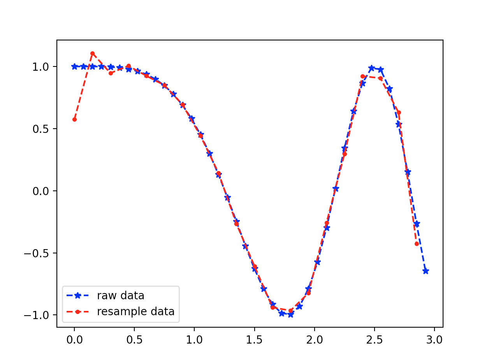
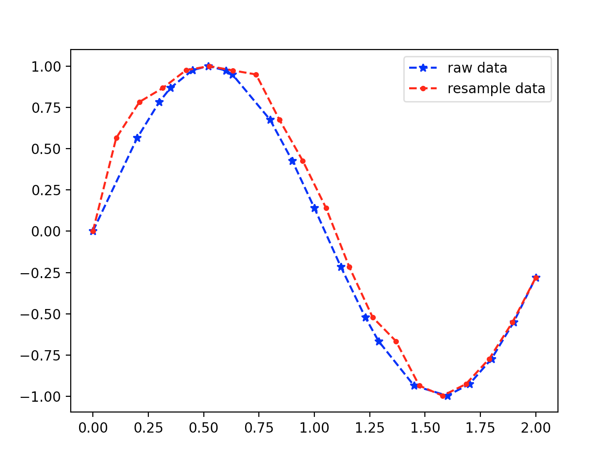

<style>
details {
    border: 1px solid #aaa;
    border-radius: 4px;
    padding: .5em .5em 0;
}
summary {
    font-weight: bold;
    margin: -.5em -.5em 0;
    padding: .5em;
}
details[open] {
    padding: .5em;
}
details[open] summary {
    border-bottom: 1px solid #aaa;
    margin-bottom: .5em;
}
</style>

<details><summary>目录</summary><p>

- [Pandas 重采样](#pandas-重采样)
  - [API](#api)
  - [升采样](#升采样)
  - [降采样](#降采样)
  - [Function application](#function-application)
  - [Indexing 和 iteration](#indexing-和-iteration)
  - [稀疏采用](#稀疏采用)
- [SciPy 重采样](#scipy-重采样)
  - [API](#api-1)
  - [升采样](#升采样-1)
  - [降采样](#降采样-1)
  - [等间隔采样](#等间隔采样)
  - [不等间隔采样](#不等间隔采样)
</p></details><p></p>

重采样(resampling)指的是将时间序列从一个频率转换到另一个频率的处理过程。
是对原样本重新处理的一个方法，是一个对常规时间序列数据重采样和频率转换的便捷的方法

将高频率的数据聚合到低频率称为降采样(downsampling)，
而将低频率数据转换到高频率则称为升采样(upsampling)

# Pandas 重采样

## API

```python
pd.DataFrame.resample(
    rule, 
    how = None, 
    axis = 0, 
    fill_method = None, 
    closed = None, 
    label = None, 
    convention = 'start', 
    kind = None, 
    loffset = None, 
    limit = None, 
    base = 0, 
    on = None, 
    level = None
)
```

主要参数说明:

* `rule`: DateOffset, Timedelta or str
    - 表示重采样频率，例如 ‘M’、‘5min’，Second(15)
* `how`: str
    - 用于产生聚合值的函数名或数组函数，例如'mean'、'ohlc'、'np.max'等，默认是'mean'，
      其他常用的值有：'first'、'last'、'median'、'max'、'min'
* `axis`: {0 or 'index', 1 or 'columns'}, default 0
    - 默认是纵轴，横轴设置 axis=1
* `fill_method`: str, default None
    - 升采样时如何插值，比如 ffill、bfill 等
* `closed`: {'right', 'left'}, default None
    - 在降采样时，各时间段的哪一段是闭合的，'right' 或 'left'，默认 'right'
* `label`: {'right', 'left'}, default None
    - 在降采样时，如何设置聚合值的标签，例如，9:30-9:35 会被标记成 9:30 还是 9:35, 默认9:35
* `convention`: {'start', 'end', 's', 'e'}, default 'start'
    - 当重采样时期时，将低频率转换到高频率所采用的约定（'start'或'end'）。默认'end'
* `kind`: {'timestamp', 'period'}, optional, default None
    - 聚合到时期（'period'）或时间戳（'timestamp'），默认聚合到时间序列的索引类型
* `loffset`: timedelta, default None
    - 面元标签的时间校正值，比如'-1s'或Second(-1)用于将聚合标签调早1秒
* `limit`: int, default None
    - 在向前或向后填充时，允许填充的最大时期数


* `pd.DataFrame.resample()` 和 `pd.Series.resample()`
    - 上采样
        - `.resample().ffill()`
        - `.resample().bfill()`
        - `.resample().pad()`
        - `.resample().nearest()`
        - `.resample().fillna()`
        - `.resample().asfreq()`
        - `.resample().interpolate()`
    - 下采样(计算聚合、统计函数)
        - `.resample().<func>()`
        - `.resample.count()`
        - `.resample.nunique()`
        - `.resample.first()`
        - `.resample.last()`
        - `.resample.ohlc()`
        - `.resample.prod()`
        - `.resample.size()`
        - `.resample.sem()`
        - `.resample.std()`
        - `.resample.var()`
        - `.resample.quantile()`
        - `.resample.mean()`
        - `.resample.median()`
        - `.resample.min()`
        - `.resample.max()`
        - `.resample.sum()`
    - Function application
        - `.resample().apply(custom_resampler)`: 自定义函数
        - `.resample().aggregate()`
        - `.resample().transfrom()`
        - `.resample().pipe()`
    - Indexing, iteration
        - `.__iter__`
        - `.groups`
        - `.indices`
        - `get_group()`
    - 稀疏采样

```python
import pandas as pd

rng = pd.data_range("2000-01-01", periods = 100, freq = "D")
ts = pd.Series(np.random.randn(len(rng)), index = rng)
ts
```

```
2000-01-01   -0.184415
2000-01-02   -0.078049
2000-01-03    1.550158
2000-01-04    0.206498
2000-01-05    0.184059
                ...   
2000-04-05   -0.574207
2000-04-06   -1.719587
2000-04-07    0.140673
2000-04-08   -1.234146
2000-04-09   -0.835341
Freq: D, Length: 100, dtype: float64
```

## 升采样


## 降采样

在用 `resample` 对数据进行降采样时，需要考虑两个参数:

* 各区间哪边是闭合的
* 如何标记各个聚合面元，用区间的开头还是末尾


```python
df = pd.DataFrame({
    'A': [1, 1, 2, 1, 2],
    'B': [np.nan, 2, 3, 4, 5],
    'C': [1, 2, 1, 1, 2]
}, columns = ['A', 'B', 'C'])

df.groupby("A").mean()
df.groupby(["A", "B"]).mean()
df.groupby("A")["B"].mean()
```

## Function application


## Indexing 和 iteration


## 稀疏采用


# SciPy 重采样

## API

```python
import scipy

scipy.signal.resample(
    x, 
    num, 
    t = None, 
    axis = 0, 
    window = None, 
    domain = 'time'
)
```

参数解释:

* `x`: 待重采样的数据
* `num`: 重采样的点数，int 型
* `t`: 如果给定 t，则假定它是与 x 中的信号数据相关联的等距采样位置
* `axis`: 对哪个轴重采样，默认是 0

## 升采样

```python
import numpy as np
import matplotlib.pyplot as plt
from scipy import signal


# 原始数据
t = np.linspace(0, 3, 20, endpoint = False)
y  = np.cos(t ** 2)

# 升采样, 20 个点采 40 个点
re_y = singal.resample(y, 40)
t_new = np.linspace(0, 3, len(re_y), endpoint = False)

# plot
plt.plot(t, y, "b*--", label = "raw")
plt.plot(t_new, re_y, "r.--", lable = "resample data")
plt.legend()
plt.show()
```


## 降采样

```python
import numpy as np
import matplotlib.pyplot as plt
from scipy import signal

# 原始数据
t = np.linspace(0, 3, 40, endpoint = False)
y = np.cos(t ** 2)

# 降采样, 40 个点采 20 个点
re_y = signal_resample(y, 20)
t_new = np.linspace(0, 3, len(re_y), endpoint = False)

# plot
plt.plot(t, y, "b*--", label = "raw data")
plt.plot(t_new, re_y, "r.--", label = "resample data")
plt.legend()
plt.show()
```



## 等间隔采样

```python
import numpy as np
import matplotlib.pyplot as plt
from scipy import signal

# 原始数据
t = np.linspace(0, 3, 40, endpoint = False)
y = np.cos(t ** 2)

# 等间隔降采样，40 个点采 20 个点
re_y, re_t = signal.resample(y, 20, t = t)

# plot
plt.plot(t, y, "b*--", label = "raw data")
plt.plot(re_t, re_y, "g.--", label = "resample data")
plt.legend()
plt.show()
```


## 不等间隔采样

原始数据不等间隔，采样成等间隔的点(点数不变)

```python
import numpy as np
import matplotlib.pyplot as plt
from scipy import signal

# 原始数据
t = np.array([
    0, 2, 3, 3.5, 4.5, 
    5.2, 6, 6.3, 8, 9, 
    10, 11.2, 12.3, 12.9, 14.5,
    16, 17, 18, 19, 20]) / 10
x = np.sin(3 * t)

# 重采样为等间隔
t1 = np.linspace(0, 2, 20, endpoint = True)
re_x, re_t = signal.resample(x, 20, t = t1)

# plot
plt.plot(t, x, 'b*--', label = 'raw data')
plt.plot(re_t, re_x, 'g.--', label = 'resample data')
plt.legend()
plt.show()
```


```python
import numpy as np
import matplotlib.pyplot
from scipy import signal

# 原始数据
t = np.array([
    0, 2, 3, 3.5, 4.5, 
    5.2, 6, 6.3, 8, 9, 
    10, 11.2, 12.3, 12.9, 14.5, 
    16, 17, 18, 19, 20])/10
x = np.sin(3 * t)

# 重采样
t1 = np.linspace(0, 2, 20, endpoint = True)
re_x = signal.resample(x, 20)

plt.plot(t, x, 'b*--', label = 'raw data')
plt.plot(t1, re_x, 'r.--', label = 'resample data')
plt.legend()
plt.show()
```



