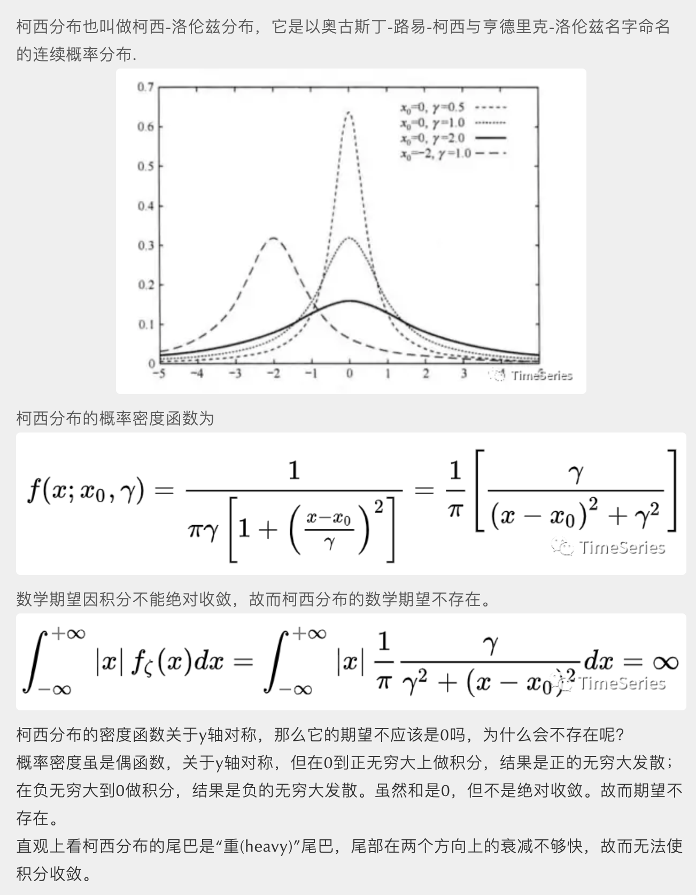

<style>
details {
    border: 1px solid #aaa;
    border-radius: 4px;
    padding: .5em .5em 0;
}
summary {
    font-weight: bold;
    margin: -.5em -.5em 0;
    padding: .5em;
}
details[open] {
    padding: .5em;
}
details[open] summary {
    border-bottom: 1px solid #aaa;
    margin-bottom: .5em;
}
</style>

<details><summary>目录</summary><p>

- [时间序列平稳性](#时间序列平稳性)
  - [时间序列平稳性定义](#时间序列平稳性定义)
    - [严平稳](#严平稳)
    - [宽平稳](#宽平稳)
    - [严平稳与宽平稳的关系](#严平稳与宽平稳的关系)
  - [平稳时间序列](#平稳时间序列)
    - [白噪声](#白噪声)
    - [非白噪声](#非白噪声)
- [时间序列平稳性检验](#时间序列平稳性检验)
- [时间序列平稳性准换](#时间序列平稳性准换)
</p></details><p></p>

> 时间序列分析中的许多方法，如 ARMA、ARIMA、Granger 因果检验等时序预测和分析方法，
> 都需要时间序列具备平稳性。那么什么是时间序列的平稳性呢？
> 什么序列是平稳时间序列，什么序列又是非平稳时间序列？

# 时间序列平稳性

## 时间序列平稳性定义

时间序列的平稳性是指在一组时间数据看起来平坦，
各阶统计特性，如：均值、方差、协方差等不随时间时间的变化而变化。
其数学定义又分为严平稳和宽平稳

### 严平稳

给定随机过程 `$X(t), t \in T$`，如果对任意 `$n \geq 1$`，
`$t_{1}, t_{2}, \ldots, t_{n} \in T$` 和 实数 `$\tau$`，
当 `$t_{1+\tau}, t_{2+\tau}, \ldots, t_{n+\tau}$` 时，
随机变量 `$(X(t_{1}), X(t_{2}), \ldots, X(t_{n}))$` 与 
`$(X(t_{1+\tau}), X(t_{2+\tau}), \ldots, X(t_{n+\tau}))$` 有相同的联合分布函数。
即 

`$$F_{t_{1}, t_{2}, \ldots, t_{n}}(x_{1}, x_{2}, \ldots, x_{m})=F_{t_{1+\tau}, t_{2+\tau}, \ldots, t_{n+\tau}}(x_{1}, x_{2}, \ldots, x_{m})$$`

则称随机过程 `$X_{t}, t \in T$` 是严平稳过程

简单点来说严平稳是一种条件比较苛刻的平稳性定义，
它认为只有当序列所有的统计性质都不会随着时间的推移而发生变化时，该序列才能被认为平稳

### 宽平稳

假定某个时间序列是由某一随机过程生成的，如果满足下列条件：

1. 均值 `$E(X_{t}) = \mu$` 是与时间 `$t$` 无关的常数
2. 方差 `$Var(X_{t}) = \sigma^{2}$` 是与时间无关的常数
3. 协方差 `$Cov(X_{t}, X_{t+k}) = \gamma_{k}$` 是只与时间间隔 `$k$` 有关，与时间 `$t$` 无关的常数

则该时间序列是宽平稳的，该随机过程是平稳随机过程

平稳性的定义在不同文章中描述略有不同，但它们的意思都是一样的。
比如一些定义中会强调二阶矩存在，而我们当前的这个定义中没有强调，
原因在于均值、方差为常数既已表示一阶矩、二阶矩存在

宽平稳序列具有均值、方差和自相关结构不随时间变化的特性。
简单理解就是一个看起来平坦的序列，没有趋势，随时间变化的方差不变，
随时间变化的自相关结构不变，也没有定期波动（季节性）

### 严平稳与宽平稳的关系

严平稳比宽平稳的要求更严格，但两者并没有包含关系。通常情况下，
阶矩存在的严平稳能推出宽平稳成立，而宽平稳序列不能反推严平稳成立。

即便严平稳也不一定宽平稳。不存在低阶矩的严平稳序列不满足宽平稳条件，
例如服从柯西分布的严平稳序列就不是宽平稳序列（柯西分布的一阶矩、二阶矩都不存在）



当序列服从多元正态分布时，宽平稳可以推出严平稳。
因为正态过程的概率密度是由均值函数和自相关函数完全确定的，
宽平稳则均值函数和自相关函数不随时间的推移而变化，
那么正态过程的概率密度函数也就不会随时间的推移而变化，
所以说一个宽平稳的正态过程必定是严平稳的

* 宽平稳，因其定义，又叫二阶平稳，或者协方差平稳 
* 平稳序列，一般是指宽平稳序列，也称弱平稳序列
* 严平稳序列，也可以叫做强平稳序列

## 平稳时间序列

### 白噪声

一种最简单的平稳时间序列就是白噪声，白噪声时间序列是具有零均值、同方差的独立同分布序列，
记作 `$\{\varepsilon_{t}\}$`。当 `$\varepsilon_{t}$` 服从均值为 0 的正态分布时，
称 `$\{\varepsilon_{t}\}$` 为高斯白噪声或正态白噪声

对于任意 `$t \in T$`，`$X_{t}$` 均值相同、方差相同，独立则协方差为 0，所以白噪声序列是平稳的

```python
import numpy as np
import matplotlib.pyplot as plt

# 白噪声序列
white_noise = np.random.standard_normal(size = 1000)

# plot
plt.figure(figsize = (12, 6))
plt.plot(white_noise)
plt.show()
```


当一个序列为白噪声时，表示序列前后没有任何相关关系。过去的行为对将来的发展没有丝毫影响，
从统计分析的角度而言，已没有任何分析建模的价值。未来的趋势亦无法预测，
因为白噪声的取值是完全随机的。此时未来预测为均值就是残差最小的选择。
只有当序列平稳且非白噪声时，应用 ARMA 等分析方法才有意义

通常我们在对时间序列建模之后，还会对残差序列进行白噪声检验，
如果残差序列是白噪声，那么就说明原序列中所有有价值的信息已经被模型所提取，
如果非白噪声就要检查模型的合理性了

### 非白噪声


# 时间序列平稳性检验

* Augmented DIckey Fuller Test(ADF test)
    - `$p>0$`, 过程不是平稳的
    - `$p=0$`, 过程是平稳的
* Kwiatkowski-Phillips-Schmidt-Shin Test(KPSS test)

# 时间序列平稳性准换

理想情况下,需要一个用于建模的固定时间序列. 当然, 不是所有的时间序列都是平稳的, 
但是可以通过做不同的变换使它们保持平稳

对于非平稳的时间序列, 可以通过 **差分**、**log 变换**、**平方根变换** 转化为平稳序列
