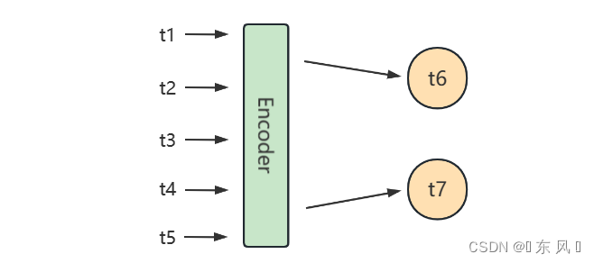
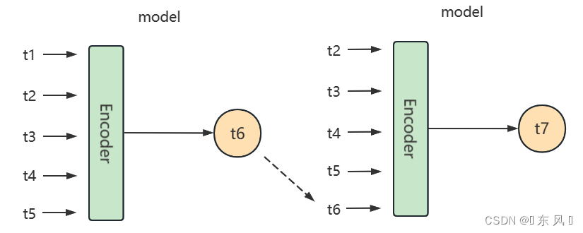
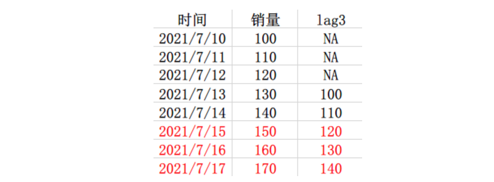
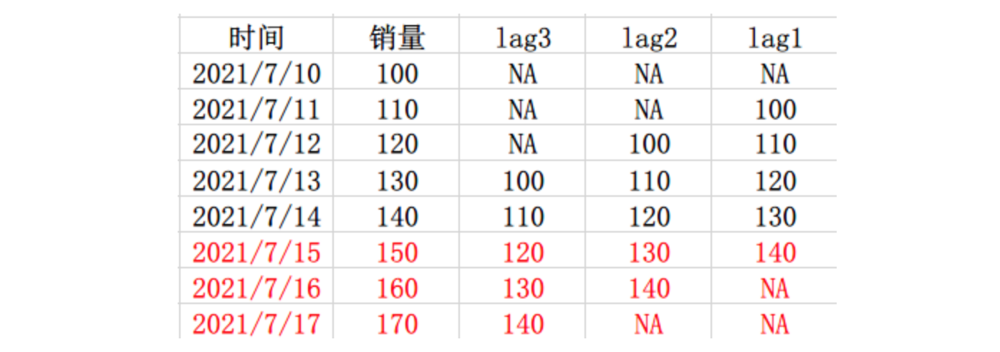
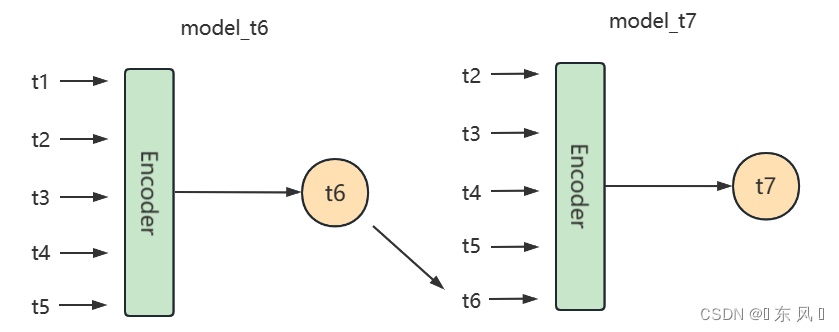

<style>
details {
    border: 1px solid #aaa;
    border-radius: 4px;
    padding: .5em .5em 0;
}
summary {
    font-weight: bold;
    margin: -.5em -.5em 0;
    padding: .5em;
}
details[open] {
    padding: .5em;
}
details[open] summary {
    border-bottom: 1px solid #aaa;
    margin-bottom: .5em;
}
img {
    pointer-events: none;
}
</style>

<details><summary>目录</summary><p>

- [预测方法介绍](#预测方法介绍)
- [模型参数](#模型参数)
- [按输入变量区](#按输入变量区)
  - [自回归预测](#自回归预测)
  - [多变量预测](#多变量预测)
- [按目标个数](#按目标个数)
  - [一元预测](#一元预测)
  - [多元预测](#多元预测)
  - [递归多元预测](#递归多元预测)
  - [多重预测](#多重预测)
- [按预测步长](#按预测步长)
  - [单步预测](#单步预测)
  - [多步预测](#多步预测)
    - [直接多输出预测](#直接多输出预测)
    - [递归多步预测](#递归多步预测)
    - [直接多步预测](#直接多步预测)
      - [只使用一个模型](#只使用一个模型)
      - [使用 n 个模型](#使用-n-个模型)
      - [使用 1~n 个模型](#使用-1n-个模型)
    - [直接递归混合预测](#直接递归混合预测)
      - [混合一](#混合一)
      - [混合二](#混合二)
      - [混合三](#混合三)
    - [Seq2Seq 多步预测](#seq2seq-多步预测)
- [参考文章](#参考文章)
</p></details><p></p>

# 预测方法介绍

机器学习方法处理时间序列问题的基本思路就是吧时间序列切分成一段历史训练窗口和未来的预测窗口，
对于预测窗口中的每一条样本，基于训练窗口的信息来构建特征，转化为一个表格类预测问题来求解

也会看到一些额外加入时序预处理步骤的方法，比如先做 STL 分解再做建模预测。
尝试下来这类方法总体来说效果并不明显，但对于整个 pipeline 的复杂度却有较大的增加，
对于 AutoML、模型解释等工作都造成了一定的困扰，所以实际项目中应用的也比较少

# 模型参数

实际场景中，一般需要确定几个参数：

1. 历史窗口的大小(history length)
    - 即预测未来时，要参考过去多少时间的信息作为输入。太少可能信息量不充分，
      太多则会引入早期不相关的信息(比如疫情前的信息可能目前就不太适用了)
2. 预测点间隔的大小(predict gap)
    - 即预测未来时，是从 T+1 开始预测，还是 T+2，T+3，这与现实的业务场景有关。
      例如像补货场景，预测 T+1 的销量，可能已经来不及下单补货了，
      所以需要扩大这个提前量，做 T+3 甚至更多提前时间的预测
3. 预测窗口的大小(predict length)
    - 即需要连续预测多长的未来值。比如从 T+1 开始一直到 T+14 都需要预测输出。
      这一点也跟实际的业务应用场景有关

# 按输入变量区

## 自回归预测

> 单变量预测

## 多变量预测

> 使用多个协变量预测

多元时间序列，即每个时间有多个观测值：

`$$\{X_{t} = (x_{t}^{a}, x_{t}^{b}, x_{t}^{c}, \ldots)\}_{t}^{T}$$`

这意味着通过不同的测量手段得到了多种观测值，并且希望预测其中的一个或几个值。
例如，可能有两组时间序列观测值 `$\{x_{t-1}^{a}, x_{t-2}^{a}, \ldots\}$`，
`$\{x_{t-1}^{b}, x_{t-2}^{b}, \ldots\}$`，希望分析这组多元时间序列来预测 `$x_{t}^{a}$` 

基于以上场景，许多监督学习的方法可以应用在时间序列的预测中，
在运用机器学习模型时，可以把时间序列模型当成一个回归问题来解决，
比如 svm/xgboost/逻辑回归/回归树/...

# 按目标个数

## 一元预测

## 多元预测

多目标回归为每一个预测结果构建一个模型，如下是一个使用案例：

```python
from sklearn.multioutput import MultiOutputRegressor

direct = MultiOutputRegressor(LinearRegression())
direct.fit(X_tr, Y_tr)
direct.predict(X_test)
```

scikit-learn 的 `MultiOutputRegressor` 为每个目标变量复制了一个学习算法。
在这种情况下，预测方法是 `LinearRegression`。此种方法避免了递归方式中错误传播，
但多目标预测需要更多的计算资源。此外多目标预测假设每个点是独立的，这是违背了时序数据的特点

## 递归多元预测

递归多目标回归结合了多目标和递归的思想。为每个点建立一个模型。
但是在每一步的输入数据都会随着前一个模型的预测而增加

```python
from sklearn.multioutput import RegressorChain

dirrec = RegressorChain(LinearRegression())
dirrec.fit(X_tr, Y_tr)
dirrec.predict(X_test)
```

这种方法在机器学习文献中被称为 chaining。scikit-learn 通过 `RegressorChain` 类为其提供了一个实现

## 多重预测

# 按预测步长

## 单步预测

所谓单步预测，就是每一次预测的时候输入窗口只预测未来的一个值。
在时间序列预测中的标准做法是使用滞后的观测值 `$x_{t}$` 作为输入变量来预测当前的时间的观测值 `$x_{t+1}$`

单步预测的两个策略：

* 滑动窗口(推荐)
* 扩展窗口


## 多步预测

大多数预测问题都被定义为单步预测，根据最近发生的事件预测系列的下一个值。
时间序列多步预测需要预测未来多个值，提前预测许多步骤具有重要的实际优势，
多步预测减少了长期的不确定性。但模型试图预测更远的未来时，模型的误差也会逐渐增加

所谓多步预测就是利用过去的时间数据来预测未来多个状态的时序数据，举个例子就是利用过去 30 天的数据来预测未来 2 天的数据

对于时间序列多步预测常用的解决方案有 5 种：

* 直接多输出预测
* 递归多步预测(单步滚动预测)
    - 扩展窗口
    - 滑动窗口(推荐)
* 直接多步预测(多模型单步预测)
* 直接递归混合预测(多模型滚动预测)
* Seq2Seq 多步预测

为了方便讲解不同的多步预测策略，假设原始时间序列数据位 `$\{t1, t2, t3, t4, t5\}$`，这是已知的数据，
需要预测未来两天的状态 `$\{t6, t7\}$`

### 直接多输出预测

> Direct Multi-Output Forecasting

对于这个策略是比较好理解与实现的，就是训练一个模型，对于深度学习，只不过需要在模型最终的线性层设置为两个输出神经元即可。
而对于机器学习，需要在预测时连续预测两个值

正常单输出预测，预测未来一个时刻的模型最终的输出层为 `Linear(hidden_size, 1)`，
对于直接多步预测修改输出层为 `Linear(hidden_size, 2)` 即可，最后一层的两个神经元分别预测 `$\{t6, t7\}$`



定义的模型结构状态为：

`$$\{t1, t2, t3, t4, t5\} \Rightarrow \{t6, t7\}$$` 

对于这种策略优点就是预测 `$t6$` 和 `$t7$` 是独立的，不会造成误差累积，因为两个预测状态会同时通过线性层进行预测，
`$t7$` 的预测状态不会依赖 `$t6$`；

那么缺点也很显然，就是两个状态独立了，但是现实是因为这是时序预测问题，
`$t7$` 的状态会受到 `$t6$` 的状态所影响，如果分别独立预测，`$t7$` 的预测状态会受影响，造成信息的损失

### 递归多步预测

> Recursive Multi-Step Forecasting

递归多步预测就是利用递归方式进行预测未来状态，该策略会训练一个模型，然后依次按照时序递归进行预测，
先利用已知时序数据预测 `$t6$`，然后再滑动一个窗口，利用刚刚预测出的 `$t6$` 去预测 `$t7$` 的状态



定义的模型结构状态为：

`$$\{t1, t2, t3, t4, t5\} \Rightarrow \{t6\}$$`
`$$\{t2, t3, t4, t5, t6\} \Rightarrow \{t7\}$$`

这种实现策略的优点就是解决了上个策略中 `$t6$` 和 `$t7$` 的独立性，再预测 `$t7$` 的状态时考虑到了 `$t6$` 的状态信息

但是这种策略也会存在缺点就是因为是递归预测，会导致误差累积，举个例子，如果模型在预测 `$t6$` 的过程中出现了偏差，
导致 `$t6$` 的预测结果异常，然后模型会拿着 `$t6$` 的值去预测 `$t7$`，这就会导致 `$t7$` 的预测结果进一步产生误差，
也就是会导致误差累积效应。

还有一个缺点就是该种实现策略利用递归策略，不断滑动窗口拿着刚刚预测出来的值预测下一个值，
会导致性能降低，无法同时预测 `$t6$` 和 `$t7$` 的状态

### 直接多步预测

> Direct Multi-Step Forecasting

直接多步预测意如其名，就是直接输出未来两天的状态，注意一下，不要与直接多输出预测混淆，不同于直接多输出预测，
该策略会同时训练两个模型，其中一个模型用于预测 `$t6$`，另一个模型用于预测 `$t7$`，也就是要预测多个未来状态，就需要训练多个模型


定义的模型结构状态为：

`model_t6`：`$$\{t1, t2, t3, t4, t5\} \Rightarrow \{t6\}$$`
`model_t7`：`$$\{t1, t2, t3, t4, t5\} \Rightarrow \{t7\}$$`

这种实现策略会有一定的缺点，由于是要多步预测，那么就需要训练对应输出数目的模型，如果要预测未来 10 个时刻的状态，
那么就需要训练 10 个模型，会导致计算资源消耗严重；

第二个缺点就是没有考虑到 `$t6$` 和 `$t7$` 的时序相关性，因为 `$t7$` 的状态会受到 `$t6$` 的状态影响，
这种实现策略会独立训练两个模型，所以预测 `$t7$` 的模型缺少了 `$t6$` 的信息状态，造成信息损失

#### 只使用一个模型

举个例子，现有 7 月 10 号到 7 月 14 号的数据，需要预测未来 3 天的销量，那么，就不能用 lag1 和 lag2 作为特征，
但是可以用 lag3，所以就用 lag3 作为特征构建一个模型：



这种是只使用一个模型来预测的，但是呢，缺点是特征居然要构造到 lag3，lag1 和 lag2 的信息完全没用到，
所以就有人提出了一种思路，就是对于每一天都构建一个模型

#### 使用 n 个模型

这个的思路呢，就是想能够尽可能多的用到 lag 的信息，所以，对于每一天都构建一个模型，比如对于 15 号，构建模型 1，
使用了 lag1、lag2 和 lag3 作为特征来训练，然后对于 16 号，因为不能用到 lag1 的信息了，但是 lag2 和 lag3 还是能用到的，
所以就用 lag2 和 lag3 作为特征，再训练一个模型 2，17 号的话，就只有 lag3 能用了，所以就直接用 lag3 作为特征来训练一个模型 3，
然后模型 1、模型 2、模型 3 分别就可以输出每一天的预测值了



这种方法的优势是最大可能的用到了 lag 的信息，但是缺陷也非常明显，就是因为对于每一天都需要构建一个模型的话，
那预测的天数一长，数据一多，那计算量是没法想象的，所以也有人提出了一个这种的方案，就不是对每一天构建一个模型了，
而是每几天构建一个模型

#### 使用 1~n 个模型

还是上面那个例子，这次把数据改变一下，预测四天吧，有 10 号到 14 号的数据，构建了 lag1-5 的特征，
需要预测 16 号到 19 号的数据，那么我们知道 16 号和 17 号是都可以用到 lag2、lag3、lag4 和 lag5 的特征的，
那么为这两天构建一个模型 1，而 18 号和 19 号是只能用到 lag4 和 lag5 的特征的，那么为这两天构建一个模型 2，
所以最后就是模型 1 输出 16 号和 17 号的预测值，模型 2 输出 18 号和 19 号的值


可以发现，这样的话，我们虽然没有尽最大可能的去使用 lag 特征，但是，计算量相比于使用 n 个模型直接小了一半

### 直接递归混合预测

> Direct Recursive Hybrid Forecasting

直接递归混合预测策略融合了递归多步预测和直接多步预测两种策略，它会分别训练两个模型，分别用于预测 `$t6$`、`$t7$`，
与直接多步预测不同的是在预测 `$t7$` 利用到了预测 `$t6$` 模型的输出结果，即 `$t6$` 的预测结果



定义的模型结构状态为：

`model_t6`：`$$\{t1, t2, t3, t4, t5\} \Rightarrow \{t6\}$$`
`model_t7`：`$$\{t1, t2, t3, t4, t5\} \Rightarrow \{t7\}$$`

这种方式的优点就是解决了直接多步预测的信息独立问题，在预测 `$t7$` 的过程中考虑到了 `$t6$` 的状态，
但缺点跟直接多步预测策略一样，由于是要多步预测，那么就需要训练对应输出数目的模型，如果要预测未来 10 个时刻的状态，
那么就需要训练 10 个模型，会导致计算资源消耗严重

#### 混合一

同时使用直接法和递归法，分别得出一个预测值，然后做个简单平均，这个思路也就是采用了模型融合的平均法的思想，
一个高方差，一个高偏差，那么我把两个合起来取个平均方差和偏差不就小了吗

#### 混合二

这种方法是这篇论文提出的：《Recursive and direct multi-step forecasting: the best of both worlds》，有兴趣可以自己去读下，
大概说的就是先使用递归法进行预测，然后再用直接法去训练递归法的残差，有点像 boosting 的思想，论文花了挺大篇幅说了这种方法的无偏性，
不过，这种方法也就是存在论文中，暂时没见到人使用，具体效果还不知道

#### 混合三

简单来说就是使用到了所有的 lag 信息，同时也建立了很多模型，还是这个例子，首先用 10 号到 14 号的数据训练模型 1，
得到 15 号的预测值，然后将 15 号的预测值作为 16 号的特征，同时用 10 号到 15 号的数据训练模型 2，得到 16 号的预测值，
最后使用 16 号的预测值作为 17 号的特征，使用 10 号到 16 号的数据训练模型 3，得到 17 号的预测值


这种方法说实话还不知道他的好处在哪，相比于递归预测法，不就是训练时多了几条数据吗？还是会有误差累计的问题吧

### Seq2Seq 多步预测

> Seq2Seq Multi-Step Forecasting

Seq2Seq 实现策略与直接多输出预测一致，不同之处就是这种策略利用到了 Seq2Seq 这种模型结果，
Seq2Seq 实现了序列到序列的预测方案，由于多步预测的预测结果也是多个序列，所以问题可以使用这种模型架构


定义的模型结构状态为：

`$$\{t1, t2, t3, t4, t5\} \Rightarrow \{t6, t7\}$$` 

对于这种模型架构相对于递归预测效率会高一点，因为可以并行同时预测 `$t6$` 和 `$t7$` 的结果，
而且对于这种模型架构可以使用更多高精度的模型，例如：Bert、Transformer、Attention 等多种模型作为内部的组件

# 参考文章

* [sktime.RecursiveTimeSeriesRegressionForecaster](https://www.sktime.org/en/stable/api_reference/auto_generated/sktime.forecasting.compose.RecursiveTimeSeriesRegressionForecaster.html)
* [机器学习多步时间序列预测解决方案](https://aws.amazon.com/cn/blogs/china/machine-learning-multi-step-time-series-prediction-solution/)
* [时间序列的多步预测方法总结](https://zhuanlan.zhihu.com/p/390093091)
* [时间序列多步预测经典方法总结](https://weibaohang.blog.csdn.net/article/details/128754086)
* [时间序列的多步预测方法总结](https://zhuanlan.zhihu.com/p/390093091)
