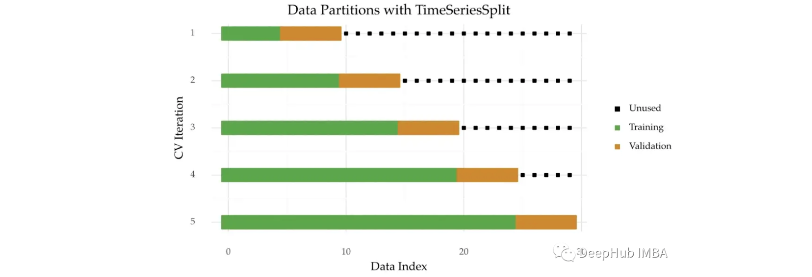
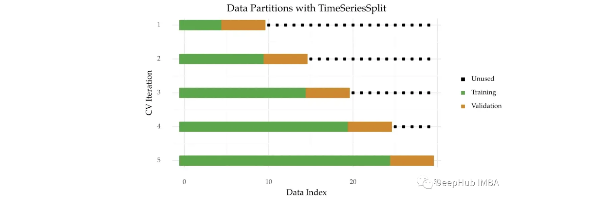
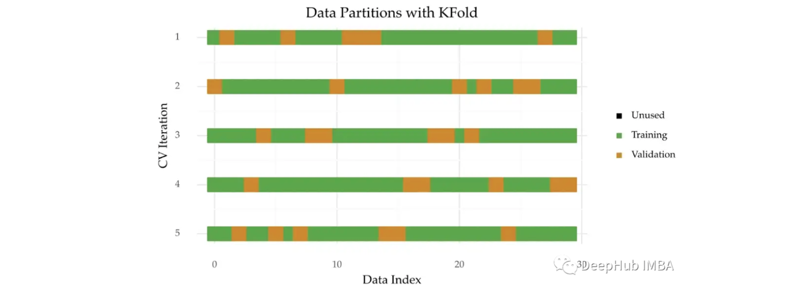
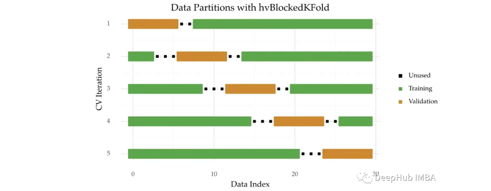

<style>
details {
    border: 1px solid #aaa;
    border-radius: 4px;
    padding: .5em .5em 0;
}
summary {
    font-weight: bold;
    margin: -.5em -.5em 0;
    padding: .5em;
}
details[open] {
    padding: .5em;
}
details[open] summary {
    border-bottom: 1px solid #aaa;
    margin-bottom: .5em;
}
</style>

<details><summary>目录</summary><p>

- [时间序列交叉介绍](#时间序列交叉介绍)
- [时间序列分割](#时间序列分割)
  - [Time Series Split](#time-series-split)
    - [介绍](#介绍)
    - [优缺点](#优缺点)
    - [应用](#应用)
  - [带间隙的 TimeSeriesSplit](#带间隙的-timeseriessplit)
    - [介绍](#介绍-1)
    - [应用](#应用-1)
  - [滑动 TimeSeriesSplit](#滑动-timeseriessplit)
    - [介绍](#介绍-2)
    - [应用](#应用-2)
- [蒙特卡洛交叉验证](#蒙特卡洛交叉验证)
  - [MonteCarloCV 介绍](#montecarlocv-介绍)
  - [MonteCarloCV 实现](#montecarlocv-实现)
  - [MonteCarloCV 使用](#montecarlocv-使用)
- [Hold Out](#hold-out)
  - [Hold Out 介绍](#hold-out-介绍)
  - [Hold Out 应用](#hold-out-应用)
- [K-Fold 交叉验证](#k-fold-交叉验证)
  - [K-Fold](#k-fold)
  - [Blocked K-Fold](#blocked-k-fold)
  - [hv-Blocked K-Fold](#hv-blocked-k-fold)
  - [改进的 K-Fold](#改进的-k-fold)
- [参考](#参考)
</p></details><p></p>

# 时间序列交叉介绍

评估性能对预测模型的开发至关重要。交叉验证是一种流行的技术，但是在处理时间序列时，
应该确保交叉验证处理了数据的时间依赖性质，要防止数据泄漏和获得可靠的性能估计。
在时序问题上，需要特别注意不能做随机分割，而需要在时间维度上做前后的分割，
以保证与实际预测应用时的情况一致

对于方法的采用建议如下：

* 首选技术是蒙特卡洛交叉验证
* 其次，时间序列分割(及其变体)是一个很好的选择
* 如果时间序列数据较大，通常直接使用 Holdout，因为评估过程更快

# 时间序列分割

## Time Series Split

### 介绍

对时间序列进行多次拆分是个好主意，这样做可以在时间序列数据的不同部分上测试模型。
在时间序列分割中，时间序列被分成 `$k+1$` 个连续的大小相等的数据块，前 `$k$` 个块为训练数据，
第 `$k+1$` 个块为测试数据

下面是该技术的可视化描述:



### 优缺点

使用时间序列分割的主要好处如下:

* 保持了观察的顺序
    - 这个问题在有序数据集(如时间序列)中非常重要
* 生成了很多拆分，几次拆分后可以获得更稳健的评估
    - 如果数据集不大，这一点尤其重要

主要缺点是跨折叠的训练样本量是不一致的：

* 假设将该方法应用于上图所示的 5 次分折。在第一次迭代中，所有可用观测值的 20% 用于训练，
  但是，这个数字在最后一次迭代中是 80%。因此，初始迭代可能不能代表完整的时间序列，这个问题会影响性能估计。
  可以使用蒙特卡洛交叉验证结局这个问题

### 应用

时间序列分割就是 scikit-learn 中 `TimeSeriesSplit` 实现

```python
import numpy as np
from sklearn.model_selection import TimeSeriesSplit


X = np.array([
    [1, 2],
    [3, 4],
    [1, 2],
    [3, 4],
    [1, 2],
    [3, 4],
])
y = np.array([1, 2, 3, 4, 5, 6])

tscv = TimeSeriesSplit(n_splits = 5, max_train_size = None, test_size = None, gap = 0)

for i, (train_index, test_index) in enumerate(tscv.split(X)):
    print(f"Fold {i}:")
    print(f"  Train: index={train_index}")
    print(f"  Test: index={test_index}")
```

```
Fold 0:
  Train: index=[0]
  Test:  index=[1]
Fold 1:
  Train: index=[0 1]
  Test:  index=[2]
Fold 2:
  Train: index=[0 1 2]
  Test:  index=[3]
Fold 3:
  Train: index=[0 1 2 3]
  Test:  index=[4]
Fold 4:
  Train: index=[0 1 2 3 4]
  Test:  index=[5]
```

## 带间隙的 TimeSeriesSplit

### 介绍

可以在上述技术中增加训练和验证之间的间隙。这有助于增加两个样本之间的独立性



### 应用

使用 `TimeSeriesSplit` 类中的 `gap` 参数引入这个间隙

```python
import numpy as np
from sklearn.model_selection import TimeSeriesSplit


X = np.array([
    [1, 2],
    [3, 4],
    [1, 2],
    [3, 4],
    [1, 2],
    [3, 4],
])
y = np.array([1, 2, 3, 4, 5, 6])

tscv = TimeSeriesSplit(n_splits = 3, test_size = 2, gap = 2)

for i, (train_index, test_index) in enumerate(tscv.split(X)):
    print(f"Fold {i}:")
    print(f"  Train: index={train_index}")
    print(f"  Test: index={test_index}")
```

```
Fold 0:
  Train: index=[0 1 2 3]
  Test:  index=[6 7]
Fold 1:
  Train: index=[0 1 2 3 4 5]
  Test:  index=[8 9]
Fold 2:
  Train: index=[0 1 2 3 4 5 6 7]
  Test:  index=[10 11]
```

## 滑动 TimeSeriesSplit 

### 介绍

另一种应用时间序列分割的方法是滑动窗口，即在迭代之后老的数据块被丢弃。
这种方法可能在两种情况下有用：

* 数据量巨大
* 旧的观察已经过时了

这种变体也可以应用于训练样本和验证样本之间的间隙


### 应用

```python
# TODO
```

# 蒙特卡洛交叉验证

## MonteCarloCV 介绍

蒙特卡罗交叉验证(MonteCarloCV)是一种可以用于时间序列的方法。与时间序列分割(Time Series Split)不同，
每个迭代中的验证原点是随机选择的，即在不同的随机起点来获取一个时间周期的数据

下图是这种技术的直观图示：


像 TimeSeriesSplit 一样，MonteCarloCV 也保留了观测的时间顺序。它还会保留多次重复估计过程。

MonteCarloCV 与 TimeSeriesSplit 的区别主要有两个方面：

* 对于训练和验证样本量，使用 TimeSeriesSplit 时训练集的大小会增加。在 MonteCarloCV 中，
  训练集的大小在每次迭代过程中都是固定的，这样可以防止训练规模不能代表整个数据
* 随机的分折，在 MonteCarloCV 中，验证原点是随机选择的。这个原点标志着训练集的结束和验证的开始。
  在 TimeSeriesSplit 的情况下，这个点是确定的。它是根据迭代次数预先定义的

经过详细研究 MonteCarloCV，这包括与 TimeSeriesSplit 等其他方法的比较。
MonteCarloCV 可以获得更好的估计

## MonteCarloCV 实现

不幸的是，scikit-learn 不提供 MonteCarloCV 的实现。所以，需要手动实现它：

```python
from typing import List, Generator
import numpy as np
from sklearn.model_selection._split import _BaseKFold
from sklearn.utils.validation import indexable, _num_samples

 
class MonteCarloCV(_BaseKFold):
 
    def __init__(self, 
                 n_splits: int, 
                 train_size: float, 
                 test_size: float, 
                 gap: int = 0):
        """
        Monte Carlo Cross-Validation
 
        Holdout applied in multiple testing periods
        Testing origin (time-step where testing begins) is randomly chosen according to a monte carlo simulation
 
        Parameters
        ----------
        n_splits: (int) Number of monte carlo repetitions in the procedure
        train_size: (float) Train size, in terms of ratio of the total length of the series
        test_size: (float) Test size, in terms of ratio of the total length of the series
        gap: (int) Number of samples to exclude from the end of each train set before the test set.
        """
        self.n_splits = n_splits
        self.n_samples = -1
        self.gap = gap
        self.train_size = train_size
        self.test_size = test_size
        self.train_n_samples = 0
        self.test_n_samples = 0 
        self.mc_origins = []
 
    def split(self, X, y = None, groups = None) -> Generator:
        """
        Generate indices to split data into training and test set.

        Parameters
        ----------
        X : array-like of shape (n_samples, n_features)
            Training data, where `n_samples` is the number of samples
            and `n_features` is the number of features.
        y : array-like of shape (n_samples,)
            Always ignored, exists for compatibility.
        groups : array-like of shape (n_samples,)
            Always ignored, exists for compatibility.
        
        Yields
        ------
        train : ndarray
            The training set indices for that split.
        test : ndarray
            The testing set indices for that split.
        """
        X, y, groups = indexable(X, y, groups)
        self.n_samples = _num_samples(X)
 
        self.train_n_samples = int(self.n_samples * self.train_size) - 1
        self.test_n_samples = int(self.n_samples * self.test_size) - 1
 
        # Make sure we have enough samples for the given split parameters
        if self.n_splits > self.n_samples:
            raise ValueError(
                f'Cannot have number of folds={self.n_splits} greater'
                f' than the number of samples={self.n_samples}.'
            )
        if self.train_n_samples - self.gap <= 0:
            raise ValueError(
                f'The gap={self.gap} is too big for number of training samples'
                f'={self.train_n_samples} with testing samples={self.test_n_samples} and gap={self.gap}.'
            )
 
        indices = np.arange(self.n_samples)
        selection_range = np.arange(self.train_n_samples + 1, self.n_samples - self.test_n_samples - 1)
 
        self.mc_origins = np.random.choice(
            a = selection_range,
            size = self.n_splits,
            replace = True
        )
        for origin in self.mc_origins:
            if self.gap > 0:
                train_end = origin - self.gap + 1
            else:
                train_end = origin - self.gap
            train_start = origin - self.train_n_samples - 1
            test_end = origin + self.test_n_samples

            yield (
                indices[train_start:train_end],
                indices[origin:test_end],
            )
 
    def get_origins(self) -> List[int]:
        return self.mc_origins
```

MonteCarloCV 接受四个参数：

* `n_splitting`：分折或迭代的次数。这个值趋向于 10
* `training_size`：每次迭代时训练集的大小与时间序列大小的比值
* `test_size`：类似于 `training_size`，但用于验证集
* `gap`：分离训练集和验证集的观察数。与 TimeSeriesSplits 一样，此参数的值默认为 0(无间隙)

每次迭代的训练和验证大小取决于输入数据。发现一个 0.6/0.1 的分区工作得很好。
也就是说，在每次迭代中，60% 的数据被用于训练，10% 的观察结果用于验证

## MonteCarloCV 使用

```python
from sklearn.datasets import make_regression
from src.mccv import MonteCarloCV

X, y = make_regression(n_samples = 120)

mccv = MonteCarloCV(
    n_splits = 5, 
    train_size = 0.6, 
    test_size = 0.1, 
    gap = 0
)

for train_index, test_index in mccv.split(X):
    print("TRAIN:", train_index, "TEST:", test_index)
    X_train, X_test = X[train_index], X[test_index]
    y_train, y_test = y[train_index], y[test_index]
```

该实现也与 scikit-learn 兼容。以下是如何结合 GridSearchCV：

```python
from sklearn.ensemble import RandomForestRegressor
from sklearn.model_selection import GridSearchCV

model = RandomForestRegressor()
param_search = {
    'n_estimators': [10, 100]
}

gsearch = GridSearchCV(
    estimator = model, 
    cv = mccv, 
    param_grid = param_search
)
gsearch.fit(X, y)
```

# Hold Out

> Hold Out 验证，样本外验证

## Hold Out 介绍

Hold Out 是估计预测效果最简单的方法。工作原理是进行一次分割，该序列的第一部分数据集用于训练模型，
在保留的数据集中进行验证。一般情况下训练集的大小设置为总数据集的 `$70\%$`，如果时间序列数据集不大，
使用单个分割可能会导致不可靠的估计


## Hold Out 应用

可以使用 scikit-learn 中的 `train_test_split` 函数应用 Hold Out 验证

```python
from sklearn.model_selection import train_test_split

tts = train_test_split()
```

# K-Fold 交叉验证

## K-Fold

K-Fold 交叉验证是一种用于评估模型性能的流行技术。它的工作原理是变换观测数据，
并将它们分配给 K 个相等大小的折，然后每折都被用作验证而剩下的其他数据用作模型训练。
这种方法的主要优点是所有的观测数据都在某个时刻被用于验证，
但是整个过程是在观测是独立的假设下进行的，这对时间序列来说是不成立的，
所以最好选择一种尊重观察的时间顺序的交叉验证方法

但是在某些情况下，K-Fold 交叉验证对时间序列是有用的。
例如，当时间序列是平稳的或样本量很小时



## Blocked K-Fold

一些专门设计的技术用于扩展时间序列的 K-Fold 交叉验证。其中一种方法是阻塞 K-Fold 交叉验证。
这个过程与之前相似，但是没有了打乱的部分。观察的顺序在每个块内保持不变，但在它们之间的关系被打破了。
这种方法对于平稳时间序列是很方便的


## hv-Blocked K-Fold

可以尝试通过在两个样本之间引入间隔来增加训练和验证之间的独立性。
这就是一种称为 hv-Blocked K-Fold 交叉验证的方法



## 改进的 K-Fold

改进的 K-Fold 交叉验证保留了过程中的打乱部分。但是它删除了接近验证样本的任何训练观察值

改进的 K-Fold 交叉验证依赖于创造间隙而不是阻塞。但是这种技术的主要问题是许多训练观察被删除了。
这可能会导致拟合不足的问题


# 参考

* [时间序列分割](https://lonepatient.top/2018/06/10/time-series-nested-cross-validation.html)
* [9个时间序列分割方法的介绍和对比](https://mp.weixin.qq.com/s/JpZV2E102FU94_aj-b-sOA)
* [样本组织](https://mp.weixin.qq.com/s?__biz=Mzk0NDE5Nzg1Ng==&mid=2247492305&idx=1&sn=c4c9783ee3ab85a8f7a813e803f15177&chksm=c32afb5ef45d7248d539aca50cff13a840ff53bb2400166ea146256675b08b93419be3f8fadc&scene=21#wechat_redirect)
* [时间序列的蒙特卡罗交叉验证](https://mp.weixin.qq.com/s/n4Ghl67_-r_NN29Jd5E5SA)
* [时间序列分割方法的介绍和对比](https://mp.weixin.qq.com/s/JpZV2E102FU94_aj-b-sOA)
* Picard, Richard R., and R. Dennis Cook. “Cross-validation of regression models.” 
  Journal of the American Statistical Association 79.387 (1984): 575–583.
* Vitor Cerqueira, Luis Torgo, and Igor Mozetič. “Evaluating time series  forecasting models: 
  An empirical study on performance estimation  methods.” Machine Learning 109.11 (2020): 1997–2028.

