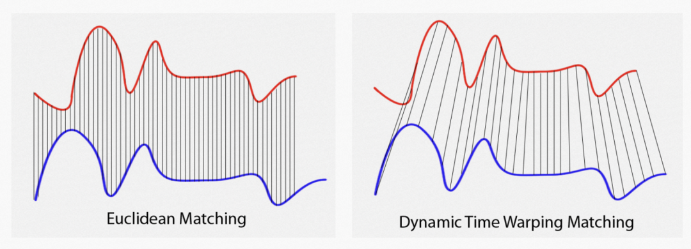
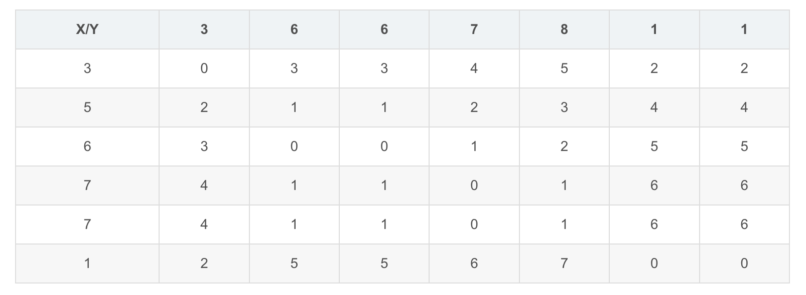
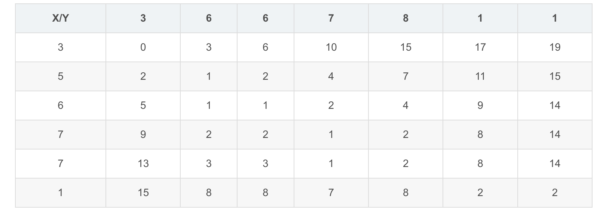

<style>
details {
    border: 1px solid #aaa;
    border-radius: 4px;
    padding: .5em .5em 0;
}
summary {
    font-weight: bold;
    margin: -.5em -.5em 0;
    padding: .5em;
}
details[open] {
    padding: .5em;
}
details[open] summary {
    border-bottom: 1px solid #aaa;
    margin-bottom: .5em;
}
</style>

<details><summary>目录</summary><p>

- [DTW 介绍](#dtw-介绍)
- [DTW 算法理论](#dtw-算法理论)
  - [算法介绍](#算法介绍)
  - [算法讨论](#算法讨论)
    - [约束条件](#约束条件)
    - [步模式](#步模式)
    - [标准化](#标准化)
    - [点与点的距离函数](#点与点的距离函数)
  - [算法应用场景](#算法应用场景)
    - [分类](#分类)
    - [点到点匹配](#点到点匹配)
- [DTW 计算示例](#dtw-计算示例)
  - [问题假设](#问题假设)
  - [计算过程](#计算过程)
    - [距离矩阵](#距离矩阵)
    - [损失矩阵](#损失矩阵)
- [DTW 应用](#dtw-应用)
  - [动态归整同步时间序列数据](#动态归整同步时间序列数据)
    - [fastdtw 库](#fastdtw-库)
      - [安装](#安装)
      - [使用](#使用)
- [参考](#参考)
</p></details><p></p>

# DTW 介绍

> DTW，Dynamic time warping，动态时间归整

动态时间归整，简称 DTW，该算法在 1970 年左右被提出来，最早用于处理语音识别分类的问题，
是一种计算两个数据序列之间的最佳匹配的技术。DTW 的核心思路是，利用动态规划方法，
对两个序列的点之间进行匹配，找到让两个序列相似度最高的匹配方式。DTW 充分考虑了两个序列各个点之间的关系，
通过扭曲重整序列进行对齐，计算最短距离，实现形状上的匹配。在这种最相似的匹配结果下，
两个时间序列的距离就是最终真正的差异，也就可以转换成损失函数。DTW 允许根据需要对数据集应用尽可能多的校正，
以确保每个点都尽可能同步，甚至可以将其应用于不同长度的数据集。DTW 可以应用于时间和非时间数据，
例如财务指标、股票市场指数、计算音频等。但是要确保数据没有空值或缺失值



简单来说，给定两个离散的序列(实际上不一定要与时间有关)，DTW 能够衡量这两个序列的相似程度，或者说两个序列的距离。
同时 DTW 能够对两个序列的延展或者压缩能够有一定的适应性，举个例子，不同人对同一个词语的发音会有细微的差别，
特别在时长上，有些人的发音会比标准的发音或长或短，DTW 对这种序列的延展和压缩不敏感，所以给定标准语音库，
DTW 能够很好得识别单个字词，这也是为什么 DTW 一直被认为是语音处理方面的专门算法。实际上，DTW 虽然老，
但简单且灵活地实现模板匹配，能解决很多离散时间序列匹配的问题，视频动作识别，生物信息比对等等诸多领域都有应用

例如下图，有两个呈现正弦规律序列，其中蓝色序列是稍微被拉长了。即使这两个序列，不重合，
但是我们也可以有把握说这两个序列的相似程度很高(或者说这两个序列的距离很小）


DTW 能够计算这两个序列的相似程度，并且给出一个能最大程度降低两个序列距离的点到点的匹配。
见下图，其中黑色与红色曲线中的虚线就是表示点点之间的一个对应关系。也就是说，
两个比对序列之间的特征是相似的，只是在时间上有不对齐的可能，这个算法名中的 Time Warping，
指的就是对时间序列进行的压缩或者延展以达到一个更好的匹对


# DTW 算法理论

## 算法介绍

假设给定两个序列，样本序列 `$X=(x_{1}, x_{2}, \ldots, x_{N})$` 和测试序列 `$Y = (y_{1}, y_{2}, \ldots, y_{M})$`，
同时给定一个序列中点到点的距离函数 `$d(i,j) = f(x_{i}, y_{j}) \geq 0$`（一般为欧式距离，实际上也可以是别的函数）

DTW 的核心在于求解扭曲曲线(Wraping Curve)或者说扭曲路径，也就是点到点之间的对应关系，
表示为 `$\phi(k) = (\phi_{X}(k), \phi_{Y}(k)),k=1, 2, \ldots, T, T=N\times M$`，其中 `$\phi_{X}(k)$` 的可能值为 `$1, 2, \ldots, N$`，
`$\phi_{Y}(k)$` 的可能值为 `$1, 2, \ldots, M$`。
也就是说，求出 `$T$` 个从 `$X$` 序列中点到 `$Y$` 序列中点的对应关系，例如若 `$\phi(k) = (1, 1)$`，
那么就是说 `$X$` 曲线的第一个点与 `$Y$` 曲线的第一个点是一个对应

给定了 `$\phi(k)$`，可以求解两个序列的累积距离(Accumulated Distortion)：

`$$d_{\phi}(X, Y) = \sum_{k=1}^{T}d(\phi_{X}(k), \phi_{Y}(k))$$`

DTW 的最后输出，就是要找到一个最合适的 `$\phi(k)$` 扭曲曲线，使得累积距离最小，也就是损失矩阵的最后一行最后一列的值：

`$$DTW(X, Y) = \underset{\phi}{min} d_{\phi}(X, Y)$$`

换句话说，就是给定了距离矩阵，如何找到一条从左上角到右下角的路径，使得路径经过的元素值之和最小。
这个问题可以由动态规划（Dynamic Programming）解决（时间复杂度 `$O(N+M)$`），也就是上面例子中，
计算损失矩阵的过程，实际上不需要把整个矩阵都求解出来，大致将对角线上的元素求解出来即可

## 算法讨论

实际上，虽然 DTW 算法简单，但是有很多值得讨论的细节

### 约束条件

首先，路径的寻找不是任意的，一般来说有三个约束条件：

1. 单调性：也就是说扭曲曲线不能往左或者往上后退，否则会出现无意义的循环

`$$\phi_{X}(k+1) \geq \phi_{X}(k)$$`
`$$\phi_{Y}(k+1) \geq \phi_{Y}(k)$$`

2. 连续性：扭曲曲线不能跳跃，必须是连续的，保证两个序列里的所有点都被匹配到，但这个条件可以一定程度上被放松

`$$\phi_{X}(k+1)-\phi_{X}(k) \leq 1$$`

3. 边界条件确定性：路径一定从左上开始，结束于右下，这个条件也可以被放松，以实现局部匹配

`$$\phi_{X}(1) = \phi_{Y}(1)$$`
`$$\phi_{X}(T) = N$$`
`$$\phi_{Y}(T) = M$$`

除此之外，还可以增加别的约束：

1. 全局路径窗口(Warping Window)：比较好的匹配路径往往在对角线附近，
   所以我们可以只考虑在对角线附近的一个区域寻找合适路径(r 就是这个区域的宽度)

`$$|\phi_{X}(S) - \phi_{Y}(S)| \leq r$$`

2. 斜率约束(Slope Constrain)： 这个可以看做是局部的 Warping Window，用于避免路径太过平缓或陡峭，
   导致短的序列匹配到太长的序列或者太长的序列匹配到太短的序列

`$$\frac{\phi_{X}(m) - \phi_{X}(n)}{\phi_{Y}(m) - \phi_{Y}(n)} \leq p$$`
`$$\frac{\phi_{Y}(m) - \phi_{Y}(n)}{\phi_{X}(m) - \phi_{X}(n)} \leq q$$`

### 步模式

实际上，这些步模式(Step Pattern)一定程度上涵盖了不同的约束，步模式指的是生成损失矩阵时的具体算法，
例如在例子中使用的是：

`$$M_{c}(i, j) = min\Big(M_{c}(i-1, j-1), M_{c}(i-1, j), M_{c}(i, j-1)\Big) + M(i,j)$$`

很多其他步模式，不同的步模式会影响最终匹配的结果。关于不同的步模式，常用的有对称，准对称和非对称三种

### 标准化

序列的累积距离，可以被标准化，因为长的测试序列累积距离很容易比短的测试序列累积距离更大，
但这不一定说明后者比前者与样本序列更相似，可以通过标准化累积距离再进行比较。
不同的步模式会需要的不同的标准化参数

### 点与点的距离函数

除了测试序列以外，DTW 唯一需要的输入，就是距离函数 `$d(x, y)$`（除了欧氏距离，也可以选择 Mahalanobis 距离等），
所以不需要考虑输入的具体形式（一维或多维，离散或连续），只要能够给定合适的距离函数，就可以 DTW 比对。
前面说到，DTW 是对时间上的压缩和延展不敏感，但是对值的大小是敏感的，可以通过合理选取距离函数来让 DTW 适应值大小的差异

## 算法应用场景

### 分类

气象指数在旱季和雨季的样本序列分别为 `$X_{1}$` 和 `$X_{2}$`，现有一段新的气象指数 `$Y$`，
要判断该气象指数测得时，是雨季还旱季？

算出 `$DTW(X_{1}, Y)$` 和 `$DTW(X_{2}, Y)$`，小者即为与新测得气象指数更贴近，根据此作判断

DTW 就是一个很好的差异比较的工具，给出的距离(或标准化距离)能够进一步输入到 KNN 等分类器里（KNN 就是要找最近的邻居，DTW 能够用于衡量“近”与否），
进行进一步分类，比对

### 点到点匹配

给定标准语句的录音 `$X$`，现有一段新的不标准的语句录音 `$Y$`，其中可能缺少或者掺入了别的字词。
如何确定哪些是缺少的或者哪些是掺入别的?

通过 DTW 的扭曲路径，我们可以大致得到结论：


DTW 的输出是很丰富的，除了距离外，还提供了扭曲路径，可用于点到点的匹配，
这个信息是非常丰富的，能够看到序列的比对，发现异常的序列

# DTW 计算示例

## 问题假设

给定一个样本序列 `$X$` 和对比序列 `$Y$`、`$Z$`：

`$$X = [3, 5, 6, 7, 7, 1]$$`

`$$Y = [3, 6, 6, 7, 8, 1, 1]$$`

`$$Z = [2, 5, 7, 7, 7, 7, 2]$$`

请问 `$X$` 和 `$Y$` 更相似，还是 `$X$` 和 `$Z$` 更相似？

## 计算过程

### 距离矩阵

DTW 首先会根据两个序列点之间的距离（欧氏距离）获得一个序列距离矩阵 `$M$`，
其中行对应一个序列，列对应另一个序列，矩阵元素对应行列中第一个序列和第二个序列点到点的距离

* `$X$` 和 `$Y$` 的距离矩阵为：



* `$X$` 和 `$Z$` 的距离矩阵为：


### 损失矩阵

然后根据距离矩阵生成损失矩阵(Cost Matrix)，或者叫做累积距离矩阵(Accumulated Distortion Matrix)，表示为 `$M_{c}$`。
其计算方法如下：

1. 第一行第一列元素为 `$M_{c}$` 的第一行第一列元素，在这里就是 0
2. 其他位置的元素 `$M_{c}(i,j)$` 的值则需要逐步计算，具体值的额计算方法为：

`$$M_{c}(i, j) = min\Big(M_{c}(i-1, j-1), M_{c}(i-1, j), M_{c}(i, j-1)\Big) + M(i,j)$$`

* `$X$` 和 `$Y$` 的损失矩阵如下。两个序列的距离，由损失矩阵最后一行最后一列给出，在这里也就是 2：



* `$X$` 和 `$Y$` 的损失矩阵如下。两个序列的距离，由损失矩阵最后一行最后一列给出，在这里也就是 2：


所以，`$X$` 和 `$Y$` 的距离为 2，`$X$` 和 `$Z$` 的距离为 3，`$X$` 和 `$Y$` 更相似

# DTW 应用

## 动态归整同步时间序列数据

在数据相关的职业生涯中遇到最痛苦的事情之一就是必须处理不同步的时间序列数据集。
差异可能是由许多原因造成的——日光节约调整、不准确的 SCADA 信号和损坏的数据等等。
在相同的数据集中，在不同的点上发现几个差异是很常见的，这需要分别识别和纠正每一个差异。
而且当使用它时，可能会无意中抵消另一个同步部分。幸运的是，在新的“动态时间规整”技术的帮助下，
能够对所有的非同步数据集应用一种适用于所有解决方案

### fastdtw 库

#### 安装

```bash
$ pip install fastdtw
```

#### 使用

```python
import numpy as np
import pandas as pd
import streamlit as st
import plotly.express as px
from sklearn.metrics import r2_score
```

在运行同步之前导入数据集并填充缺失值：

```python
df = pd.read_csv('dataset.csv')
df['Power'] = pd.to_numeric(df['Power'], errors = 'coerce')
df['Voltage'] = pd.to_numeric(df['Voltage'], errors = 'coerce')
x = np.array(df['Power'].fillna(0))
y = np.array(df['Voltage'].fillna(0))
```

然后继续执行同步：

```python
distance, path = fastdtw(x, y, dist = euclidean)
```

同步路径的结果将类似于以下内容：

```
path = [(0, 0), (0, 1), (0, 2), (1, 3), (2, 4),...]
```

参考数据集中的每个点都将与目标数据集中的一个或多个点进行匹配，即参考数据的第 0 行可以与目标数据的点 0、1 或 2 匹配

现在有了扭曲的路径，可以继续创建具有同步结果的数据框，如下所示：

```python
result = []
for i in range(0, len(path)):
    result.append([
        df['DateTime'].iloc[path[i][0]],
        df['Power'].iloc[path[i][0]],
        df['Voltage'].iloc[path[i][1]]
    ])

df_sync = pd.DataFrame(data = result, columns = ['DateTime', 'Power', 'Voltage']).dropna()
df_sync = df_sync.drop_duplicates(subset = ['DateTime'])
df_sync = df_sync.sort_values(by = 'DateTime')
df_sync = df_sync.reset_index(drop = True)
df_sync.to_csv('C:/Users/.../synchronized_dataset.csv',index=False)
```

最后，您可以使用 Sklearn 的 r2_score 模块计算相关性分数，以比较同步前后的相关性或同步水平：

```python
correlation = r2_score(df['Power'],df['Voltage'])
```

数据可视化：为了绘制和可视化您的同步数据，将使用 Plotly 和 Streamlit，
两个用于可视化数据并将其呈现为应用程序的库

可以使用下面的函数来创建时间序列图表。请确保时间戳采用正确的 `dd-mm-yyyy hh:mm` 格式，
或者修改函数以适应你的数据

```python
def chart(df):
    df_columns = list(df)
    df['DateTime'] = pd.to_datetime(df['DateTime'], format = '%d-%m-%y %H:%M')
    df['DateTime'] = df['DateTime'].dt.strftime(' %H:%M on %B %-d, %Y')
    df = df.sort_values(by = 'DateTime')

    fig = px.line(
        df, 
        x = "DateTime", 
        y = df_columns,
        labels={
            "DateTime": "DateTime",
            "value": "Value",
            "variable": "Variables"
        },
        hover_data = {
            "DateTime": "|%d-%m-%Y %H:%M"
        }
    )
    fig.update_layout(
        font_family = "IBM Plex Sans",
        font_color = "black"
    )
    fig.update_xaxes(
        rangeselector = dict(
            buttons = list([
                dict(count=12, label="12h", step="hour", stepmode="backward"),
                dict(count=1, label="1d", step="day", stepmode="backward"),
                dict(count=7, label="7d", step="day", stepmode="backward"),
                dict(step="all")
            ])
        )
    )
    st.write(fig)
```

要可视化和呈现图表，请通过在 Anaconda 提示符下键入以下命令来运行您的脚本：

```bash
$  cd C:/Users/.../local_directory
$ streamlit run synchronization.py
```

可以在同步之前和之后对数据进行可视化：

动态时间规整可能是快速方便地同步时间序列数据的最有效的解决方案。
虽然它不是完美无缺的，确实存在边界条件匹配性差等缺点，但它是我接触过的最全面的解决方案。
并且它绝不限于线性数据，并且确实可以同步具有不同维度的非线性数据


# 参考

* [DTW](https://blog.csdn.net/raym0ndkwan/article/details/45614813)

