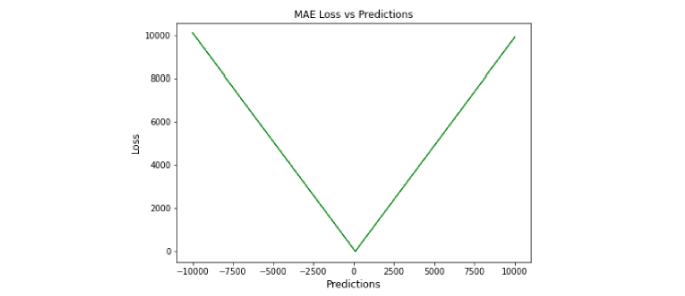
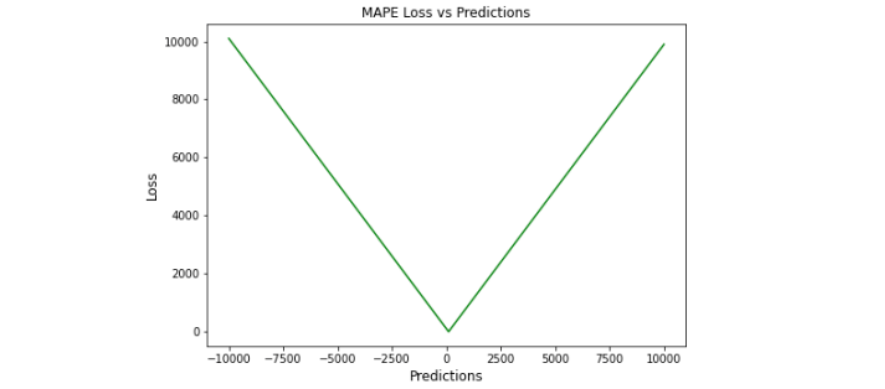
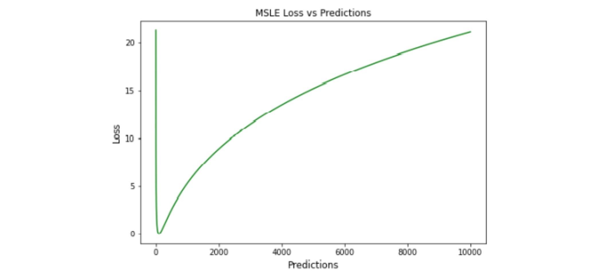
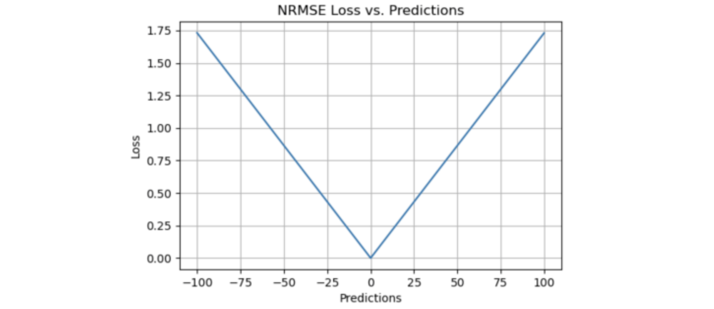
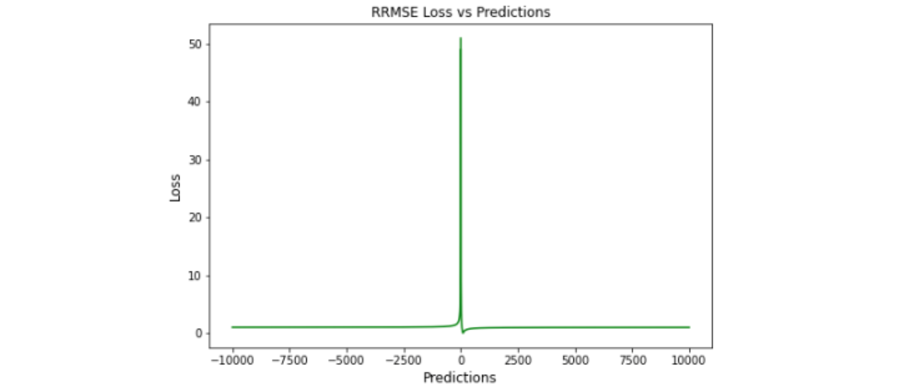
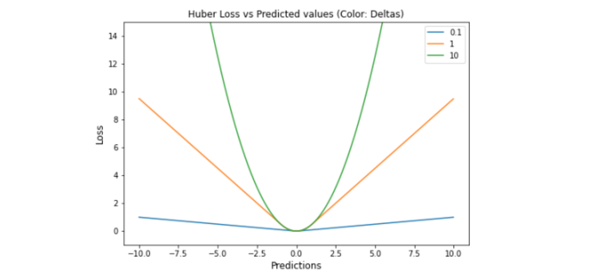

目录

- [时间序列预测模型损失函数](#时间序列预测模型损失函数)
  - [MAE](#mae)
  - [MSE](#mse)
  - [MBE](#mbe)
  - [RAE](#rae)
  - [RSE](#rse)
  - [MAPE](#mape)
  - [WMAPE 和 SMAPE](#wmape-和-smape)
  - [RMSE](#rmse)
  - [MSLE](#msle)
  - [RMSLE](#rmsle)
  - [NRMSE](#nrmse)
  - [RRMSE](#rrmse)
  - [Huber Loss](#huber-loss)
  - [LogCosh Loss](#logcosh-loss)
  - [Quantile Loss](#quantile-loss)
  - [DTW](#dtw)
  - [TILDE-Q 损失](#tilde-q-损失)
- [总结](#总结)
- [参考](#参考)

# 时间序列预测模型损失函数

最常见的时间序列预测损失函数是 MSE、MAE 等点误差函数，这类函数关注每个点的拟合是否准确。
然而，这种损失函数完全忽略了不同点的关系，在时间序列中忽略了各个点的时序关系，
导致了预测结果的形状和真实序列不匹配的问题

针对 MSE 等损失函数的问题，业内提出一种针对时间序列预测问题的 DTW 损失函数。DTW 损失函数的核心思路是，
利用动态规划方法，对两个序列的点之间进行匹配，找到让两个序列相似度最高的匹配方式。
在这种最相似的匹配结果下，两个时间序列的距离就是最终真正的差异，也就可以转换成损失函数。
DTW 充分考虑了两个序列各个点之间的关系，通过扭曲重整序列进行对齐，计算最短距离，实现形状上的匹配

后续也有很多工作针对 DTW 在时间序列预测中的应用进行优化。DTW 也有其缺点，对齐过程容易受到噪声影响，
且对齐过程一定程度上丢失了序列的时间位置信息，一般会影响 MSE 等评价指标

## MAE

> Mean Absolute Error，MAE

MAE，也称 L1 损失，是预测值与实际值之间的绝对误差。所以样本值的绝对误差的均值就称为 MAE

`$$MAE = \frac{1}{N}\sum_{i=1}^{N}|y_{i} - \hat{y}_{i}|$$`

MAE 是回归模型中经常使用的一种简单有效的损失函数。但是由于异常值，
回归问题中的变量可能不是严格的高斯变量，这会带来一些问题

优点：MAE 计算简单，并提供了模型性能的均匀度量。对异常值不太敏感

缺点：MAE 遵循线性平分方法，意味着在计算平均值时，所有误差都被平均加权。
由于 MAE 的陡峭性，可能会在反向传播过程中跳过最小值。MAE 在零处不可微，因此计算梯度很困难

## MSE

> Mean Squared Error，MSE

MSE，也称为 L2 损失，是预测值与实际值之间的平方误差。所有样本值的平方误差的均值就称为 MSE，也称为均方误差：

`$$MSE = \frac{1}{N}\sum_{i=1}^{N}(y_{i} - \hat{y}_{i})^{2}$$`

MSE 也称为二次损失，因为是与平方而不是与误差成正比。当误差被平方时，离群值被赋予更多的权重。
受益于这种对离群 Loss 的惩罚，有助于优化算法获得参数的最佳值。鉴于 Loss 是平方的，MSE 永远不会是负数。
随着 Loss 的增加，MSE 呈指数增长，好的模型的 MSE 值将接近于 0

优点：当梯度逐渐减小时，MSE 有助于对微小错误进行有效的最小收敛。
MSE 值用二次方程表示，有助于在异常值的情况下调整模型参数

缺点：较高的损失值可能会导致反向传播过程中的大幅跳跃，这是不可取的。
MSE 对异常值特别敏感，这意味着数据中的显著异常值可能会影响我们的模型性能

## MBE

> Mean Bias Error，MBE

高估或低估参数值的倾向称为偏差或平均偏差误差。偏差的唯一可能方向是正向或负向。
正偏差表示数据误差被高估，而负偏差表示误差被低估。实际值和预期值之间的差异被测量为平均偏差误差 (MBE)。
除了不考虑绝对值外，它实际上与 MAE 相同。需要注意的是，MBE 正向误差和负向误差可能会相互抵消

`$$MBE = \frac{1}{N}\sum_{i=1}^{N}(y_{i} - \hat{y}_{i})$$`

优点：如果您希望识别和纠正模型偏差，则应使用 MBE 确定模型的方向（即它是正向还是负向）

缺点：MBE 倾向于在一个方向上不断犯错。考虑到误差往往会相互抵消，
对于 `$(-\infty, \infty)$` 范围的数字，不是一个合适的损失函数

## RAE

> Relative Absolute Erro，RAE

RAE 是将总绝对误差除以平均值与实际值之间的绝对差值：

`$$RAE = \frac{\sum_{i=1}^{N}|y_{i} - \hat{y}_{i}|}{\sum_{i=1}^{N}|y_{i} - \bar{y}|}$$`

`$$\bar{y} = \frac{1}{N}\sum_{i=1}^{N}y_{i}$$`

RAE 是一种基于比率的指标，用于评估预测模型的有效性。RAE 的可能值介于 0 和 1 之间。接近零代表模型良好

优点：RAE 可以比较以不同单位测量误差的模型

缺点：如果参考预测等于真值，RAE 可能变得不可预测

## RSE

> Relative Squared Error，RSE

RSE 衡量在没有简单预测器的情况下结果的不准确程度。这个简单的预测变量仅代表实际值的平均值。
RSE 通过简单预测变量的总平方误差对其进行归一化。可以在以不同单位计算误差的模型之间进行比较

`$$RSE = \frac{\sum_{i=1}^{N}(y_{i} - \hat{y}_{i})^{2}}{\sum_{i=1}^{N}(y_{i} - \bar{y})^{2}}$$`

`$$\bar{y} = \frac{1}{N}\sum_{i=1}^{N}y_{i}$$`

优点：RSE 与规模无关。当以不同单位测量误差时，它可以比较模型

缺点：RSE 不受预测的平均值或大小的影响

## MAPE

> Mean Relative Percentage Error，MAPE

平均绝对百分比误差 (MAPE)，也称为平均绝对百分比偏差 (MAPD)，是用于评估预测系统准确性的指标。
它通过实际值减去预测值的绝对值除以实际值来计算每个时间段的平均绝对误差百分比。
由于单位缩放为百分比，因此广泛用于预测误差。当数据中没有异常值时，它效果很好，常用于回归分析和模型评估

`$$MAPE = \frac{1}{N}\sum_{i=1}^{N}\frac{|y_{i} - \hat{y}_{i}|}{y_{i}}\cdot 100\%$$`

优点：MAPE 损失是通过将所有误差标准化为百分比来计算的，因此与变量的规模无关，同时也可以避免正数抵消负数的问题

缺点：因为 MAPE 方程的分母是预测输出，它可以是零，导致未定义的值。MAPE 对正 Loss 的惩罚小于负 Loss。
因此，当我们比较预测算法的精度时，它是有偏差的，因为它默认选择结果低的参数

## WMAPE 和 SMAPE

在指标方面，作为一个回归问题，可以使用 MAE，MSE 等方式来计算。但这类 metric 受到具体预测数值区间范围不同，
展现出来的具体误差值区间也会波动很大。比如预测销量可能是几万到百万，而预测车流量可能是几十到几百的范围，
那么这两者预测问题的 MAE 可能就差距很大，很难做多个任务间的横向比较

所以实际问题中，经常会使用对数值量纲不敏感的一些 metric，尤其是 SMAPE 和 WMAPE 这两种。
这类误差计算方法在各类不同的问题上都会落在 `$[0, 1]$` 的区间范围内，方便来进行跨序列的横向比较，十分方便

在实际项目中还会经常发现，很多真实世界的时序预测目标，如销量，客流等，都会形成一个类似 tweedie 或 poisson 分布的情况。
如果用 WMAPE 作为指标，模型优化目标基本可以等价为 MAE(优化目标为中位数)，则整体的预测就会比平均值小(偏保守)

在很多业务问题中，预测偏少跟预测偏多造成的影响是不同的，所以实际在做优化时，可能还会考察整体的预测偏差(总量偏大或偏小)，
进而使用一些非对称 loss 来进行具体的优化

`$$WMAPE = \frac{\sum_{t=1}^{n}|A_{t} - F_{t}|}{\sum_{t=1}^{n}|A_{t}|}$$`

`$$SMAPE = $$`

## RMSE

> Root Mean Squared Error，RMSE

MSE 的平方根用于计算 RMSE。均方根偏差是 RMSE 的另一个名称。它考虑了实际值的变化并测量误差的平均幅度。
RMSE 可以应用于各种特征，因为它有助于确定特征是否增强模型预测。当非常不希望出现巨大 Loss 时，RMSE 最有用

`$$RMSE = \sqrt{\frac{1}{N}\sum_{i=1}^{N}(y_{i} - \hat{y}_{i})^{2}}$$`

优点：许多优化方法选择 RMSE，因为它容易区分，并且计算简单。即使值很大，
极端损失少，平方根导致 RMSE 惩罚的误差会小于 MSE

缺点：由于 RMSE 仍然是一个线性平分函数，所以梯度在最小值附近是突变的。
随着误差幅度的增加，RMSE 对异常值的敏感性也随之增加。为了收敛模型，
必须降低灵敏度，从而导致使用 RMSE 的额外开销

## MSLE

> Mean Squared Logarithmic Error，MSLE

均方对数误差 (MSLE) 衡量实际值与预期值之间的差异。
通过对数减少对实际值和预测值之间的百分比差异以及两者之间的相对差异的关注。
MSLE 将粗略地处理实际值和预期值之间的微小差异以及大的真实值和预测值之间的巨大差异

`$$MSLE = \frac{1}{N}\sum_{i=0}^{N}\big(log(y_{i} + 1) - log(\hat{y}_{i} + 1)\big)^{2}$$`

这种损失可以解释为真实值和预测值之间比率的度量：

`$$log(y_{i} + 1) - log(\hat{y}_{i} + 1) = log\Big(\frac{y_{i} + 1}{\hat{y}_{i} + 1}\Big)$$`

优点：将实际值和预测值之间的小差异和大差异进行粗略处理

缺点：MSLE 对不充分的预测的惩罚比对过度预测的惩罚更多

## RMSLE

> Root Mean Squared Logarithmic Error，RMSLE

RMSLE 通过应用 log 到实际和预测的值，然后进行相减。当同时考虑小误差和大误差时，RMSLE 可以避免异常值的影响

`$$RMSLE = \sqrt{\frac{1}{N}\sum_{i=0}^{N}\big(log(y_{i} + 1) - log(\hat{y}_{i} + 1)\big)^{2}}$$`

优点：RMSLE 适用于多种尺度，且不依赖于尺度。它不受显著异常值的影响。仅考虑实际值与预期值之间的相对误差

缺点：RMSLE 是有偏见的处罚，低估比高估受到更严重的惩罚

## NRMSE

> Normalized Root Mean Squared Error，NRMSE

归一化均方根误差 (NRMSE) 有助于不同尺度模型之间的比较。该变量可以将 RMSE 观测范围归一化

`$$NRMSE = \frac{\sqrt{\frac{1}{N}\sum_{i=1}^{N}(y_{i} - \hat{y}_{i})^{2}}}{\bar{o}}$$`

优点：NRMSE 克服了尺度依赖性，简化了不同尺度或数据集模型之间的比较

缺点：NRMSE 失去与响应变量相关的单位

## RRMSE

> Relative Root Mean Squared Error，RRMSE

相对均方根误差 (RRMSE) 是一种均方根误差度量，是没有维度的 RMSE 的变体。
它根据实际值进行缩放，然后由均方根值归一化。虽然原始测量的尺度限制了 RMSE，
但 RRMSE 可用于比较各种测量方法。当预测被证明是错误时，会出现增强的 RRMSE

`$$RRMSE = \sqrt{\frac{\frac{1}{N}\sum_{i=1}^{N}(y_{i} - \hat{y}_{i})^{2}}{\sum_{i=1}^{N}\hat{y}_{i}^{2}}}$$`

优点：RRMSE 可用于比较不同的测量技术

缺点：RRMSE 隐藏实验结果中的不精确性

## Huber Loss

Huber Loss 是二次和线性平分方法的理想组合。还有超参数 `$delta$`。对于小于 `$\delta$` 的损失值，
应该使用 MSE；对于大于 `$\delta$` 的损失值，应使用 MAE。这成功地结合了两种损失函数的最大特点

`$$L_{\delta} = \begin{cases}
\frac{1}{2}(y - \hat{y})^{2}, \quad if |y - \hat{y}| < \delta \\
\delta\big((y - \hat{y}) - \frac{1}{2}\delta\big), \quad otherwise
\end{cases}$$`

优点：超参数 `$\delta$` 以上的线性保证了异常值被赋予适当的权重，不像 MSE 中那样极端，
并且允许灵活地适应任何分布。超参数 `$\delta$` 以下的弯曲形状保证了在反向传播过程中梯度长是正确的

缺点：由于额外的条件和比较，Huber Loss 在计算上非常昂贵，特别是数据集很大的情况

## LogCosh Loss

LogCosh 计算 Loss 的双曲余弦对数。这个函数比二次损失函数更平滑。它的功能类似于 MSE，
但不受重大预测误差的影响。鉴于它使用线性和二次平分方法，它非常接近 Huber Loss

`$$Logcosh(t) = \sum_{i=1}^{N}log(cosh(\hat{y}_{i} - y_{i}))$$`

优点：由于其连续性和可微性，它比Huber Loss 所需的计算要少

缺点：它的适应性不如 Huber Loss，因为没有超参数进行调节。推导比 Huber Loss 更复杂，需要更多的研究

## Quantile Loss

分位数回归损失函数用于预测分位数。分位数是指数据中有多少值低于或高于某特定的阈值。
除了第 50 个百分位数是 MAE，其余位置是 MAE 的扩展。它不对响应的参数分布做出任何假设

`$$QuantileLoss = \sum_{i=y_{i} < \hat{y}_{i}}(\gamma - 1)|y_{i} - \hat{y}_{i}| + \underset{i=y_{i}<\hat{y}_{i}}{\sum}\gamma|y_{i} - \hat{y}_{i}|$$`

优点：可以避免异常值的影响。与点预测相比，这有利于进行区间预测。该函数也可用于神经网络和基于树的模型中，以确定预测间隔

缺点：Quantile Loss 是计算密集型的。如果我们估计平均值或使用平方损失来量化效率，则 Quantile Loss 将比较糟

## DTW

## TILDE-Q 损失

第一个损失函数是 Amplitude Shifting Invariance with Softmax，目标是让所有时刻的预测结果和真实结果的距离是一个常数 k。
为了达成这个目标，文中使用了 softmax 函数。Softmax 中传入各个时间点的预测结果和真实结果的距离，
只有当所有距离都相同时候，这个函数才会得到最小值

`$$L_{a.shift}(Y, \hat{Y}) = T'\sum_{i=1}^{T'}\Big|\frac{1}{T'} - Softmax\big(d(y_{i} - \hat{y}_{i})\big)\Big|$$`

`$$Softmax\big(d(y_{i}, \hat{y_{i}})\big) = \frac{e^{d(y_{i}, \hat{y}_{i})}}{\sum_{j=1}^{T'}e^{d(y_{j}, \hat{y}_{j})}}$$`

第二个损失函数是 Invariances with Fourier Coefficients。通过对时间序列进行傅里叶变换，
获取预测结果和真实结果的主成分，使用范数对比两个序列的主成分差异作为损失函数，主成分差异越小，
对应的 loss 越小，以此引入了平移不变性

`$$L_{phase}(Y, \hat{Y} = \begin{cases}
||F(Y) - F(\hat{Y})||_{p}, \quad if dominant frequency\\
||F(\hat{Y})||_{p}, \quad otherwise
\end{cases}$$`

第三个损失函数是 Invariances with auto-correlation，计算真实序列的自相关系数，
以及预测结果和真实序列的相关系数，比较二者的差异

`$$L_{amp}(Y, \hat{Y}) = ||R(Y, Y) - R(Y, \hat{Y})||_{p}$$`

最终的 TILDE-Q 损失函数是上面 3 种衡量不变性损失函数的加权求和：

`$$L_{TILDE-Q}(Y, \hat{Y}) = \alpha L_{a.shift}(Y, \hat{Y}) + (1 - \alpha)L_{phase}(Y, \hat{Y}) + \gamma L_{amp}(Y, \hat{Y})$$`

# 总结

损失函数对模型在给定目标上进行良好拟合起着关键作用。对于时间序列预测等复杂目标，
不可能确定通用损失函数，有很多因素，如异常值、数据分布的偏差、ML模型要求、计算要求和性能要求等。
没有适用于所有类型数据的单一损失函数

特定损失函数可能有用的情况，例如在数据集中出现异常值的情况下，MSE 是最佳策略；
然而，如果有更少的异常值，则MAE将是比MSE更好的选择。同样，如果我们希望保持平衡，
并且目标基于百分位数损失，那么使用 LogCosh 是更好的方法

# 参考

* [让时间序列预测更真实的损失函数](https://mp.weixin.qq.com/s/iLgxtIz8RvLYNvGZNN_JUw)
* [可用于时间序列预测的14种损失函数](https://mp.weixin.qq.com/s?__biz=Mzg3NDUwNTM3MA==&mid=2247490609&idx=1&sn=7b59eaa06fa73e2628fcd4f46ad1880d&chksm=cecee9c4f9b960d2b382f2feb1e14ca5be4405a211220916343ca69e16207d2a3364e431a4f4&scene=132#wechat_redirect)

