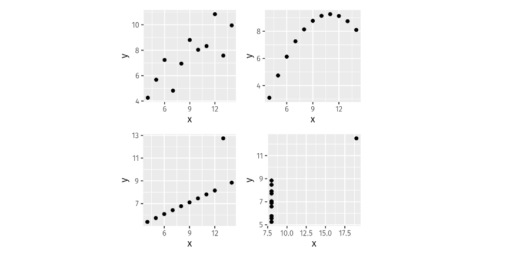

<style>
details {
    border: 1px solid #aaa;
    border-radius: 4px;
    padding: .5em .5em 0;
}
summary {
    font-weight: bold;
    margin: -.5em -.5em 0;
    padding: .5em;
}
details[open] {
    padding: .5em;
}
details[open] summary {
    border-bottom: 1px solid #aaa;
    margin-bottom: .5em;
}
img {
    pointer-events: none;
}
</style>

<details><summary>目录</summary><p>

- [时间序列数据探索性分析](#时间序列数据探索性分析)
- [R 语言知识](#r-语言知识)
    - [tsibble 对象](#tsibble-对象)
        - [索引变量](#索引变量)
        - [关键变量](#关键变量)
    - [tsibble 对象的处理](#tsibble-对象的处理)
    - [读取 CSV 文件并将其转化为 tsibble 对象](#读取-csv-文件并将其转化为-tsibble-对象)
    - [季节性周期](#季节性周期)
- [时间序列模式](#时间序列模式)
    - [趋势](#趋势)
    - [季节性](#季节性)
    - [周期性](#周期性)
    - [季节性与周期性的区别](#季节性与周期性的区别)
    - [时间序列模型示例](#时间序列模型示例)
- [时间序列图形](#时间序列图形)
    - [时间图](#时间图)
    - [季节图](#季节图)
        - [季节图](#季节图-1)
        - [多重季节性周期](#多重季节性周期)
    - [子序列季节图](#子序列季节图)
    - [散点图](#散点图)
        - [时间序列散点图](#时间序列散点图)
        - [相关性](#相关性)
        - [散点图矩阵](#散点图矩阵)
    - [滞后图](#滞后图)
    - [自相关](#自相关)
        - [自相关系数定义](#自相关系数定义)
        - [自相关系数示例](#自相关系数示例)
        - [自相关图示例](#自相关图示例)
        - [自相关图中的趋势性和季节性](#自相关图中的趋势性和季节性)
    - [白噪声](#白噪声)
- [参考](#参考)
</p></details><p></p>

# 时间序列数据探索性分析

> 时间序列图形：开展一切数据分析工作的首要任务是数据可视化。
> 图示化数据可以清晰地呈现数据的特征，包括数据的形态、异常值、
> 随时间变化情况以及变量间的相互关系。我们在预测时应尽可能地将图中显示的特征纳入考虑。
> 正如数据类型会决定所使用的预测方法一样，数据类型也决定了使用什么图形来展示数据。

# R 语言知识

```{r message=FALSE, warning=FALSE}
library(tsibble)
library(fpp3)
```

## tsibble 对象

### 索引变量

时间序列是一组按照时间发生的先后顺序排列，且包含某些特征信息的数据点序列。
在 R 中，这些信息可以被储存在 `tsibble` 对象中。

1. 将数据转化为 `tsibble` 类型

```{r}
library(tsibble)

y = tsibble(
    Year = 2015:2019,
    Observation = c(123, 39, 78, 52, 110),
    index = Year
)

print(y)
```

2. 如果将一个月度数据转换为 `tsibble` 类型

```{r, eval=FALSE}
z |> 
    mutate(月份 = yearmonth(月份)) |> 
    as_tsibble(index = 月份)
```

> 依据数据的观测频率，可以选用具体的时间类函数将文本数据转换为时间对象:
> 
> * `start:end`：年度
> * `yearquarter()`：季度
> * `yearmonth()`：月度
> * `yearweek()`：周度
> * `as_date()`, `ymd()`：日度 
> * `as_datetime()`, `ymd_hms()`：小于每日

### 关键变量

`tsibble` 允许在一个对象中存储多个时间序列。

```{r}
library(fpp3)

olympic_running
```

这个对象中的 14 个时间序列由键来唯一识别，即 `Length` 和 `Sex` 变量

```{r}
olympic_running |> distinct(Sex)
```

## tsibble 对象的处理

可以使用 `dplyr` 中的函数 例如 `mutate()`、`filter()`、`select()` 以及 `summarise()` 来处理 `tsibble` 对象。

```{r}
library(fpp3)

PBS
```

```{r}
PBS |> 
    filter(ATC2 == "A10") |>
    select(Month, Concession, Type, Cost) |>
    summarise(TotalC = sum(Cost)) |>
    mutate(Cost = TotalC / 1e6) -> a10
```

## 读取 CSV 文件并将其转化为 tsibble 对象

```{r}
library(readr)

prison <- readr::read_csv("https://OTexts.com/fpp3/extrafiles/prison_population.csv")

prison <- prison |>
    mutate(Quarter = yearquarter(Date)) |>
    select(-Date) |> 
    as_tsibble(
        key = c(State, Gender, Legal, Indigenous),
        index = Quarter,
    )
prison
```

## 季节性周期

季节性周期是一个季节性周期中包含的观测值数量。在多数情况下，
我们使用时间指数变量自动检测数据的季节周期。

下表展示了常见的不同时间间隔所对应的周期：


* 对于季度、月度和周度数据，只有一个季节性周期——即每年内的观察数。
  实际上，一年中并不是 52 周，而是平均意义上的 365.25/7=52.18 周，
  因为每四年会有一个闰年。不过由于许多模型只支持输入取值为整数的季节性周期数值，
  因而可以考虑将季节性周期近似为整数。
* 如果每周的观测频率高于一次，那么数据中往往会存在一个以上的季节性模式。
    * 按日观测的数据可能有每周（周期 = 7）以及每年（周期 = 365.25）的两种季节性模式；
    * 按分钟观测的数据则可能有每小时（周期 = 60）、每天（周期 = 24×60=1440）、
      每周（周期 = 24×60×7=10080）和每年（周期 = 24 × 60×365.25=525960）四种季节性模式。

# 时间序列模式

## 趋势

当一个时间序列数据长期增长或者长期下降时，称该序列存在趋势。
趋势并不一定线性的。在某些情况下，趋势即代表 “转换方向”，
例如从增长的趋势转换为下降趋势。

## 季节性

当时间序列中的数据受到季节性因素（例如一年或者一周的时间）影响时，
表示该序列具有季节性。季节性总是一个已知的固定频率。

## 周期性

当时间序列数据存在非固定频率的上升和下降时，表明该序列存在周期性。
这些波动经常由经济活动引起，并且与“商业周期”有关。周期波动通常至少持续两年。

## 季节性与周期性的区别

许多初学者都不能很好的区分季节性和周期，然而这两个概念是完全不同的。

* 当数据的波动是无规律时，表示序列存在周期性；
* 如果波动的频率不变且与固定长度的时间段有关，表示序列存在季节性。

一般而言，周期的长度更长、波动幅度也更大。

许多时间序列同时包含趋势、季节性以及周期性。当选择预测方法时，
我们首先应该分析时间序列数据所具备的特征，然后再选择合适的预测方法抓取特征。

## 时间序列模型示例


1. 美国新建独栋房屋的销售额（左上）表现出强烈的年度季节性以及周期为 6~10 年的周期性，
   但没有表现出明显的趋势特征。
2. 美国国库券合约数量（右上）表示1981年美国国债在芝加哥市场连续 100 个交易日的交易量。
   该序列没有明显的季节性，但存在明显下降的趋势。假如我们能够获取该序列更多的观测数据，
   那么将会看到这个下降趋势实际上是一个长期循环的一部分，但在目前仅有的 100 天的数据上体现为下降的趋势。
3. 澳大利亚季度电力产值（左下）表现出明显的增长趋势以及强季节性，但并不存在周期性。
4. Google 每日收盘股价波动情况（右下）序列没有体现出明显的趋势、季节性或周期性，
   仅表现为随机波动的序列。它没有良好的形态特性，也缺乏用于构建预测模型的有价值的特征。

# 时间序列图形

## 时间图

时间图以观测值为纵坐标、观测时间为横坐标绘制观测数据散点，散点之间用直线连接。

示例 1：Ansett 航空公司在澳大利亚两个最大城市之间每周的经济舱客运量

```{r}
melsyd_economy <- ansett |>
    filter(Airports == "MEL-SYD", Class == "Economy") |>
    mutate(Passengers = Passengers / 1000)

autoplot(melsyd_economy, Passengers) + 
    labs(
        title = "Ansett 航空公司经济舱客运量",
        subtitle = "墨尔本-悉尼",
        x = "周",
        y = "客运量（单位：千）"
    )
```

该时间图直观地呈现出了数据的如下特征：

* 由于一些工业纠纷导致 1989 年一段时期内的客运量为 0。
* 由于彼时推行的商务舱取代部分经济舱的试行规则，导致 1992 年一段时期内的客运量大幅减少。
* 1991 年下半年客运量大幅上升。
* 由于节日效应，每年年初的客运量都会有一定幅度的下降。
* 序列存在长期波动，在 1987 年向上波动，在 1988 年向下波动，于 1990 年和 1991 年又再次向上波动。

对此数据进行建模预测时，需要综合考虑上述特征，以便实现对未来客运量的有效预测。

示例 2：

```{r}
autoplot(a10, Cost) + 
    labs(
        y = "美元（单位：百万）",
        x = "月份",
        title = "澳大利亚降糖药物销量",
    )
```

图示的时间序列具有明显的增长趋势，并伴随有明显的波动幅度逐渐增大的季节性模式。
每年年底政府推行的补贴计划使得降糖药品售价更低，致使人们倾向于在年底囤积药物，
从而导致年初的销售额大幅下降。因此，当我们对降糖药物的销量进行预测时，
需同时考虑其趋势和季节性因素。

## 季节图

季节图和时间序列图很相似，不同点在于季节图是针对观察数据的 “季节性” 绘制的。

### 季节图

示例 1：

```{r}
a10 |>
  gg_season(Cost, labels = "both") +
  labs(x = "月份",
       y = "美元（单位：百万）",
       title = "季节图：降糖病药物销售量")
```

### 多重季节性周期

如果数据存在一个以上的季节性模式，可以选择需要的季节图，
下面绘制澳大利亚维多利亚州每半小时的用电量的日模式、周模式或年模式。

```{r, eval=FALSE}
vic_elec |> 
    gg_season(Demand, period = "day") +
    theme(legend.position = "none") +
    labs(x="时间",y="兆瓦时", title="维多利亚州日度用电量")
```


```{r, eval=FALSE}
vic_elec |>
    gg_season(Demand, period = "week") +
    theme(legend.position = "none") + 
    labs(
        x = "时间",
        y = "兆瓦时",
        title = "维多利亚州日度用电量",
    )
```


```{r}
vic_elec |> 
    gg_season(Demand, period = "year") +
    labs(
        x = "时间",
        y = "兆瓦时",
        title = "维多利亚州年度用电量"
    )
```

## 子序列季节图

另一种可用于体现季节性模式的图像是将每个季节的数据整合在一起，形成单独的子时间图。

```{r}
a10 |>
    gg_subseries(Cost) +
    labs(
        x = "",
        y = "美元（单位：百万）",
        title = "子序列季节图：澳大利亚降糖药物销量"
    )
```

图中蓝色的水平线表示每月的平均销量。子序列季节图可以清晰的描绘出数据的潜在季节性模式，
同时也展示了季节性随时间的变化情况，它能够有效的识别特定季节内的变化情况。

## 散点图

探讨多个时间序列 之间的关系也是很重要的。

### 时间序列散点图

示例：

分别展示了两个时间序列：2014 年澳大利亚维多利亚州每半小时的用电量（单位：千兆瓦）和温度（单位：摄氏度）。
温度选取的是维多利亚州最大城市墨尔本的当地温度，而用电量是整个维多利亚州的用电量。

```{r}
vic_elec |> 
    filter(year(Time) == 2014) |>
    autoplot(Demand) +
    labs(
        x = "时间",
        y = "用电量（千兆瓦）",
        title = "每半小时的用电量：维多利亚州"
    )
```

```{r}
vic_elec |> 
    filter(year(Time) == 2014) |>
    autoplot(Temperature) +
    labs(
        x = "时间",
        y = "温度（摄氏度）",
        title = "每半小时的温度：墨尔本"
    )
```

可以在一张图上绘制两个时间序列的散点图来研究用电量和温度之间的关系：

```{r}
vic_elec |> 
    filter(year(Time) == 2014) |>
    ggplot(aes(x = Temperature, y = Demand)) +
    geom_point() +
    labs(
        x = "温度（摄氏度）",
        y = "用电量（千兆瓦）"
    )
```

### 相关性

经常用相关系数衡量两个变量之间的线性相关程度。已知两个变量 `$x$`、`$y$`，
则它们之间的相关系数为：

`$$r = \frac{\sum (x_{t} - \bar{x})(y_{t}-\bar{y})}{\sqrt{\sum(x_{t}-\bar{x})^2}\sqrt{\sum(y_{t}-\bar{y})^2}}.$$`

`$r$` 的值始终介于 `$-1$` 到 `$1$` 之间，负值表示负相关，正值表示正相关。
下图展示了不同相关程度额数据：


相关系数仅仅衡量两个变量间线性相关的程度，有时可能会产生误导。
下图中各组变量的相关系数均为 0.82，但每组变量之间的关系实际上存在很大差异。
这表明绘制并观察数据的散点图非常重要，而不能简单地依赖相关系数进行判断。



### 散点图矩阵

当数据包含多个潜在的预测变量时，可以将变量两两进行比较。
下图中所示的八个时间序列，它呈现了澳大利亚各州、各地区的季度游客数量：

```{r}
visitors <- tourism |>
  group_by(State) |>
  summarise(Trips = sum(Trips))

visitors |>
  ggplot(aes(x = Quarter, y = Trips)) +
  geom_line() +
  facet_grid(vars(State), scales = "free_y") +
  labs(title = "澳大利亚各州的季度旅游情况",
       x="季度",y= "过夜旅行次数 (单位：千)")
```

为了观察上述八个时间序列之间的关系，可以将八个时间序列两两做对比。这些图可以排列成散点图矩阵：

```{r}
visitors |>
    pivot_wider(values_from = Trips, names_from = State) |>
    GGally::ggpairs(columns = 2:9)
```

## 滞后图

下图显示了澳大利亚每季度啤酒产量不同滞后阶数散点图，横轴表示时间序列的滞后阶数。
各图分别呈现了不同 `$k$` 值下 `$y_{t}$` 和 `$y_{t-k}$` 的对比情况。

```{r}
recent_production <- aus_production |> 
    filter(year(Quarter) >= 2000)

recent_production |> 
    gg_lag(Beer, geom = "point") +
    labs(x = "lag(Beer, k)")
```

图中不同颜色的散点表示变量不同季度下的取值点。滞后四阶和滞后八阶时呈现正相关关系，
反映了数据所具有的很强的季节性；而二阶滞后、六阶滞后图则呈现负相关关系，
这是由于第四季度的峰值对应第二季度的低谷。

## 自相关

正如相关系数可以衡量两个变量间的线性相关关系一样，
自相关系数可以衡量时间序列滞后值之间的线性关系。
自相关系数构成了自相关函数（ACF）。

### 自相关系数定义

以下几个不同的自相关系数，对应于滞后图中的不同情况。
例如，`$r_{1}$` 衡量 `$y_{t}$` 和 `$y_{t-1}$` 之间的关系；
`$r_{2}$` 衡量 `$y_{t}$` 和 `$y_{t-2}$` 之间的关系。`$r_{k}$` 定义如下：

`$$r_{k} = \frac{\sum_{t=k+1}^{T}(y_{t} - \bar{y})(y_{t-k} - \bar{y})}{\sum_{t=1}^{T}(y_{t} - \bar{y})^{2}}$$`

其中：

* `$T$` 是时间序列的长度

### 自相关系数示例

计算啤酒生产数据的自相关系数

```{r}
recent_production |> ACF(Beer, lag_max = 9)
```

其中：

* `acf` 列中的值是 `$r_{1}, \cdots, r_{9}$`，对应于滞后图中的 9 个散点图。

### 自相关图示例

通常绘制 ACF 图来查看相关性如何随滞后阶数 `$k$` 变化。
该图有时也被称为 <span style='border-bottom:1.5px dashed red;'>自相关图</span>。

```{r}
recent_production |> 
    ACF(Beer) |>
    autoplot() + 
    labs(title = "澳大利亚啤酒产量 ACF 图")
```

* `$r_{4}$` 值最大。这是由于数据的季节性模式：顶峰往往出现在第四季度，低谷往往出现在第二季度。
* `$r_{2}$` 值最小。这是由于谷底往往在高峰之后的两个季度出现。
* 蓝色虚线之内的区域自相关性可近似看做0（这将会在第2.9节详细阐述）。

### 自相关图中的趋势性和季节性

* 当数据具有趋势性时，短期滞后的自相关值为正且绝对值较大，
  这是由于观测点附近的值波动相对较小。因而存在趋势的时间序列的 ACF 一般是正值，
  同时随滞后阶数的增加而缓慢下降。
* 当数据具有季节性时，自相关值在滞后阶数与季节周期相同（或为季节周期的倍数）时取值较大。
* 当数据同时具有趋势和季节性时，我们会观察到二者的组合效应。
  上图中绘制的 `a10` 数据同时存在趋势和季节性，它的 ACF 在下图中呈现。
  由于数据存在趋势性变化，ACF 值随滞后阶数的增加而缓慢下降；
  而 “扇形” 的图像形态则来源于原时间序列中的季节性变化。

```{r}
a10 |>
    ACF(Cost, lag_max = 48) |>
    autoplot() +
    labs(title = "澳大利亚抗糖药物销售量的 ACF 图")
```

## 白噪声

不存在任何相关性的时间序列被称为白噪声。

```{r}
set.seed(30)

y = tsibble(sample = 1:50, wn = rnorm(50), index = sample)

y |> autoplot(wn) +
    labs(title = "白噪声", y = "")
```

```{r}
y |> 
    ACF(wn) |>
    autoplot() +
    labs(title = "白噪声")
```

对于白噪声而言，我们希望它的自相关值接近 0。但是由于随机扰动的存在，
自相关值并不会精确地等于 0。对于一个长度为 `$T$`的白噪声序列而言，
我们希望在 0.95 的置信度下，它的自相关值处于 `$\pm \frac{2}{\sqrt{T}}$` 之间。
据此我们可以很容易的画出 ACF 的边界值（图中蓝色虚线）。

如果一个序列中有较多的自相关值处于边界之外，那么该序列很可能不是白噪声序列。
在上例中，序列长度 `$T=50$`，边界为 `$\pm \frac{2}{\sqrt{50}}$`。
所有的自相关值均落在边界之内，证明序列是白噪声。

# 参考

* [Forecasting: Principles and Practice](https://otexts.com/fpp3cn/index.html)
