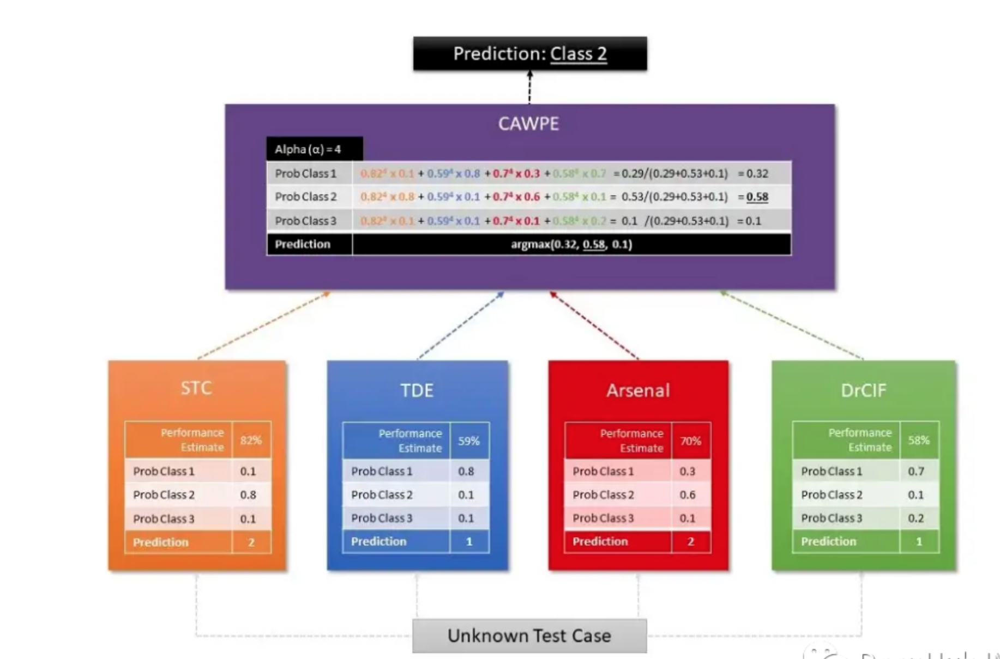

<style>
details {
    border: 1px solid #aaa;
    border-radius: 4px;
    padding: .5em .5em 0;
}
summary {
    font-weight: bold;
    margin: -.5em -.5em 0;
    padding: .5em;
}
details[open] {
    padding: .5em;
}
details[open] summary {
    border-bottom: 1px solid #aaa;
    margin-bottom: .5em;
}
img {
    pointer-events: none;
}
</style>


<details><summary>目录</summary><p>

- [时间序列分类介绍](#时间序列分类介绍)
  - [常用时间序列分类应用](#常用时间序列分类应用)
    - [ECG/EEG 信号分类](#ecgeeg-信号分类)
    - [图像分类](#图像分类)
    - [动作传感器数据分类](#动作传感器数据分类)
- [基于距离的方法](#基于距离的方法)
  - [算法介绍](#算法介绍)
  - [Python API](#python-api)
- [基于区间和频率的方法](#基于区间和频率的方法)
  - [时间序列森林](#时间序列森林)
    - [Python API](#python-api-1)
  - [RISE](#rise)
- [基于字典的方法](#基于字典的方法)
  - [BOP](#bop)
  - [SFA](#sfa)
  - [BOSS](#boss)
    - [BOSS Ensemble](#boss-ensemble)
    - [BOSSVS](#bossvs)
    - [cBOSS](#cboss)
    - [RBOSS](#rboss)
    - [WEASE](#wease)
  - [SAXVSM](#saxvsm)
    - [Python API](#python-api-2)
- [基于 Shapelet 的方法](#基于-shapelet-的方法)
  - [基于 Shapelet 提取的算法](#基于-shapelet-提取的算法)
  - [基于 Shapelet 学习的算法](#基于-shapelet-学习的算法)
    - [Python API](#python-api-3)
- [基于核的方法](#基于核的方法)
- [基于特征的方法](#基于特征的方法)
  - [catch 22 算法](#catch-22-算法)
  - [Matrix Profile Classifier](#matrix-profile-classifier)
  - [模型集成](#模型集成)
- [参考](#参考)
</p></details><p></p>

# 时间序列分类介绍

时间序列分类数据不同于常规分类问题，因为属性具有有序的序列

## 常用时间序列分类应用

### ECG/EEG 信号分类

心电图（ECG，Electrocardiogram）记录着心脏的电活动，被广泛地用于诊断各种心脏问题。
这些心电信号是用外部电极捕捉的。例如，考虑下面的信号样本，它表示一个心跳的电活动。
左边的图像表示正常的心跳，而相邻的图像表示心肌梗死


从电极上采集的数据是时间序列形式的，信号可以分为不同的类别。还可以对记录大脑电活动的脑电波（EEG）信号进行分类

### 图像分类

图像也可以是时间序列相关的格式。考虑以下场景：作物生长在特定的领域取决于天气条件、土壤肥力、水的可用性和其他外部因素。
这片土地的照片是连续 5 年每天拍摄的，并标有种植在这片土地上的作物的名称。
数据集中的图像是在固定的时间间隔后拍摄的，并且有一个确定的序列，这是对图像进行分类的一个重要因素

### 动作传感器数据分类

传感器产生高频数据，可以识别出物体在其范围内的运动。通过设置多个无线传感器，
观察传感器信号强度的变化，可以识别出物体的运动方向

# 基于距离的方法

## 算法介绍

> * DTW 结合 KNN
>     - DTW，Dynamic time warping，动态时间归整
>     - KNN，K Nearst Neighboor，K 近邻

基于距离或最近邻的时间序列分类方法使用各种基于距离的度量来对给定数据进行分类。
它是一种监督学习技术，其中新时间序列的预测结果取决于与其最相似的已知时间序列的标签信息

距离度量是描述两个或多个时间序列之间距离的函数，它是决定性的。典型的距离度量是：

* `$p$` 范数（如曼哈顿距离、欧几里德距离等）
    - 虽然最流行的范数肯定是 `$p$` 范数，尤其是欧几里德距离，但它们有两个主要缺点，
      使它们不太适合时间序列分类任务。因为范数仅针对相同长度的两个时间序列定义，
      实际上并不总是能够得到长度相等的序列。范数仅独立比较每个时间点的两个时间序列值，
      但是大多数时间序列值相互关联
* 动态时间规整 (DTW)
    - 而 DTW 可以解决 `$p$` 范数的两个限制。经典的 DTW 可以最小化时间戳可能不同的两个时间序列点之间的距离。
      这意味着轻微偏移或扭曲的时间序列仍然被认为是相似的。下图可视化了基于 `$p$` 范数的度量与 DTW 的工作方式之间的差异
    
    

决定度量后，通常应用 KNN 算法，该算法测量新时间序列与训练数据集中所有时间序列之间的距离。
计算完所有距离后，选择最近的 k 个。最后新的时间序列被分配到 k 个最近邻居中的大多数所属的类别

结合 KNN，将 DTW 作为基准基准算法，用于时间序列分类的各种基准评估。KNN 也可以有决策树的方法实现。
例如，邻近森林算法建模了一个决策树森林，使用距离度量来划分时间序列数据

## Python API

```python
from pyts.classification import KNeighborsClassifier
from pyts.datasets import load_gunpoint

X_train, X_test, y_train, y_test = load_gunpoint(return_X_y = True)

clf = KNeighborsClassifier(metric = "dtw")
clf.fit(X_train, y_train)
clf.score(X_test, y_test)
```

# 基于区间和频率的方法

基于区间的方法通常将时间序列分割为多个不同的区间。然后使用每个子序列来训练一个单独的机器学习分类器。
会生成一个分类器集合，每个分类器都作用于自己的区间。在单独分类的子序列中计算最常见的类将返回整个时间序列的最终标签

## 时间序列森林

基于区间的模型最著名的代表是时间序列森林（Time Series Forest）。
时间序列森立是建立在初始时间序列的随机子序列上的决策树的集合。
每棵树负责将一个类分配给一个区间

这是通过计算汇总特征（通常是均值、标准差和斜率）来为每个间隔创建特征向量来完成的。
之后根据计算出的特征训练决策树，并通过所有树的多数投票获得预测。
投票过程是必需的，因为每棵树只评估初始时间序列的某个子序列

除了时间序列森林之外，还有其他基于区间的模型。时间序列森林的变体使用附加特征，
例如子序列的中值、四分位数间距、最小值和最大值

### Python API

```python
from pyts.classification import TimeSeriesForest
from pyts.datasets import load_gunpoint

X_train, X_test, y_train, y_test = load_gunpoint(return_X_y = True)

clf = TimeSeriesForest(random_state = 43)
clf.fit(X_train, y_train)
clf.score(X_test, y_test)
```

## RISE

与经典的时间序列森林算法相比，还存在一种相当复杂的算法，
称为随机区间光谱集合(Random Interval Spectral Ensemble, RISE) 算法

RISE 算法在两个方面有别于经典的时间序列森林：

* 每棵树使用单个时间序列间隔
* 它是通过使用从时间序列中提取的光谱特征来训练的（而不是使用汇总统计数据作为均值、斜率等）

在 RISE 技术中，每个决策树都建立在一组不同的傅里叶、自相关、自回归和部分自相关特征之上。
该算法按如下方式工作：

1. 选择时间序列的第一个随机区间，并在这些区间上计算上述特征
2. 然后通过组合提取的特征创建一个新的训练集
3. 在这些基础上，训练决策树分类器
4. 最后使用不同的配置重复这些步骤以创建集成模型，该模型是单个决策树分类器的随机森林

# 基于字典的方法

基于字典的算法是另一类时间序列分类器，它基于字典的结构。它们涵盖了大量不同的分类器，
有时可以与上述分类器结合使用

这里是涵盖的基于字典的方法列表：

* Bag-of-Patterns (BOP)
* Symbolic Fourier Approximation (SFA)
* Individual BOSS
* BOSS Ensemble
* BOSS in Vector Space
* contractable BOSS
* Randomized BOSS
* WEASEL

这类的方法通常首先将时间序列转换为符号序列，通过滑动窗口从中提取 “WORDS”。然后通过确定 “WORDS” 的分布来进行最终分类，
这通常是通过对 “WORDS” 进行计数和排序来完成的。这种方法背后的理论是时间序列是相似的，
这意味着如果它们包含相似的 “WORDS” 则属于同一类。基于字典的分类器主要过程通常是相同的

1. 在时间序列上运行特定长度的滑动窗口
2. 将每个子序列转换为一个 “WORDS”（具有特定长度和一组固定字母）
3. 创建这些直方图

## BOP

> BOP，Bag of Patterns

模式袋(Bag-of-Patterns, BOP)算法的工作原理类似于用于文本数据分类的词袋算法。这个算法计算一个单词出现的次数。
从数字（此处为原始时间序列）创建单词的最常见技术称为符号聚合近似(SAX)。首先将时间序列划分为不同的块，
每个块之后都会标准化，这意味着它的均值为 0，标准差为 1

通常一个词的长度比子序列中实数值的数量要长。因此，进一步对每个块应用分箱。然后计算每个分箱的平均实际值，
然后将其映射到一个字母。例如，对于所有低于 -1 的平均值，分配字母 “a”，所有大于 -1 和小于 1 的值 “b”，
所有高于 1 的值 “c”。下图形象化了这个过程：


这里每个段包含 30 个值，这些值被分成 6 个一组，每个组被分配三个可能的字母，构成一个五个字母的单词。
最后汇总每个词的出现次数，并通过将它们插入最近邻算法来用于分类

## SFA

> SFA，Symbolic Fourier Approximation

与上述 BOP 算法的思想相反，在 BOP 算法中，原始时间序列被离散化为字母然后是单词，
可以对时间序列的傅里叶系数应用类似的方法

最著名的算法是 Symbolic Fourier Approximation, SFA，它又可以分为两部分：

1. 计算时间序列的离散傅立叶变换，同时保留计算系数的子集
    - 监督：单变量特征选择用于根据统计数据（如 F 统计量或 `$\chi^{2}$` 统计量）选择排名较高的系数
    - 无监督：通常取第一个系数的子集，代表时间序列的趋势
2. 结果矩阵的每一列都被独立离散化，将时间序列的时间序列子序列转换为单个单词
    - 监督：计算分箱边缘，使得实例熵的杂质标准最小化
    - 无监督：计算分箱边缘，使其基于傅立叶系数的极值（分箱是统一的）或基于这些的分位数（每个分箱中的系数数量相同）

基于上面的预处理，可以使用各种不同算法，进一步处理信息以获得时间序列的预测

## BOSS

> BOSS，Bag of SFA Symbols

Bag-of-SFA-Symbols，BOSS 算法的工作原理如下：

1. 通过滑动窗口机制提取时间序列的子序列
2. 在每个片段上应用 SFA 转换，返回一组有序的单词
3. 计算每个单词的频率，这会产生时间序列单词的直方图
4. 通过应用 KNN 等算法结合自定义 BOSS 度量（欧氏距离的微小变化）进行分类

BOSS 算法的变体包含很多变体：

* BOSS Ensemble
    - BOSS Ensemble 算法经常用于构建多个单个 BOSS 模型，每个模型在参数方面各不相同：字长、字母表大小和窗口大小。
      通过这些配置捕捉各种不同长度的图案。通过对参数进行网格搜索并仅保留最佳分类器来获得大量模型
* BOSS in Vector Space
    - BOSS in Vector Space(BOSSVS) 算法是使用向量空间模型的个体 BOSS 方法的变体，
      该方法为每个类计算一个直方图，并计算词频-逆文档频率 (TF-IDF) 矩阵。
      然后通过找到每个类的 TF-IDF 向量与时间序列本身的直方图之间余弦相似度最高的类，得到分类
* Contractable BOSS
    - Contractable BOSS(cBOSS) 算法比经典的 BOSS 方法在计算上快得多
    - 通过不对整个参数空间进行网格搜索而是对从中随机选择的样本进行网格搜索来实现加速的。
      cBOSS 为每个基本分类器使用数据的子样本。
      cBOSS 通过仅考虑固定数量的最佳基分类器而不是高于特定性能阈值的所有分类器来提高内存效率
* Randomized BOSS
    - BOSS 算法的下一个变体是 Randomized BOSS (RBOSS)。该方法在滑动窗口长度的选择中添加了一个随机过程，
      并巧妙地聚合各个 BOSS 分类器的预测。这类似于 cBOSS 变体，减少了计算时间，同时仍保持基准性能
* WEASE
    - 通过在 SFA 转换中使用不同长度的滑动窗口，时间序列 分类词提取 (WEASEL) 算法可以提高标准 BOSS 方法的性能。
      与其他 BOSS 变体类似，它使用各种长度的窗口大小将时间序列转换为特征向量，然后由 KNN 分类器对其进行评估
    - WEASEL 使用特定的特征推导方法，通过仅使用应用 `$\chi^{2}$` 检验的每个滑动窗口的非重叠子序列进行，过滤掉最相关的特征
    - 将 WEASEL 与 Multivariate Unsupervised Symbols（WEASEL+MUSE）相结合，
      通过将上下文信息编码到每个特征中从时间序列中提取和过滤多元特征

### BOSS Ensemble


### BOSSVS

```python
from pyts.classification import BOSSVS
from pyts.datasets import load_gunpoint

X_train, X_test, y_train, y_test = load_gunpoint(return_X_y = True)

clf = BOSSVS(window_size = 28)
clf.fit(X_train, y_train)
clf.score(X_test, y_test)
```

### cBOSS


### RBOSS

### WEASE

## SAXVSM


### Python API

```python
from pyts.classification import SAXVSM
from pyts.datasets import load_gunpoint

X_train, X_test, y_train, y_test = load_gunpoint(return_X_y = True)

clf = SAXVSM(window_size = 34, sublinear_tf = False, use_idf = False)
clf.fit(X_train, y_train)
clf.score(X_test, y_test)
```

# 基于 Shapelet 的方法

> Learning Shapelets

基于 Shapelets 的方法使用初始时间序列的子序列(即 Shapelets)的思想。选择 Shapelets 是为了将它们用作类的代表，
这意味着 Shapelets 包含类的主要特征，这些特征可用于区分不同的类。在最优的情况下，它们可以检测到同一类内时间序列之间的局部相似性

下图给出了一个 Shapelet 的示例。它只是整个时间序列的子序列


使用基于 Shapelets 的算法需要确定使用哪个 Shapelets 的问题。可以通过手工制作一组 Shapelets 来选择，
但这可能非常困难。也可以使用各种算法自动选择 Shapelets

## 基于 Shapelet 提取的算法

Shapelet Transform 是由 Lines 等人提出的一种基于 Shapelet 提取的算法，是目前最常用的算法之一。
给定 `$n$` 个实值观测值的时间序列，Shapelet 由长度为 `$l$` 的时间序列的子集定义

Shapelet 和整个时间序列之间的最小距离可以使用欧几里德距离，或任何其他距离度量，
Shapelet 本身和从时间序列开始的所有长度为 `$l$` 的 Shapelets 之间的距离

然后算法选出 `$k$` 个长度属于一定范围的最佳 Shapelets。这一步可以被视为某种单变量特征提取，
每个特征都由给定数据集中 Shapelet 与所有时间序列之间的距离定义。
然后根据一些统计数据对 Shapelets 进行排名。这些通常是 `$f$` 统计量或 `$\chi^{2}$` 统计量，
根据它们区分类的能力对 Shapelets 进行排序

完成上述步骤后，可以应用任何类型的机器学习算法对新数据集进行分类。
例如基于 KNN 的分类器、支持向量机或随机森林等等

寻找理想的 Shapelets 的另一个问题是可怕的时间复杂性，它会随着训练样本的数量成倍增加

## 基于 Shapelet 学习的算法

基于 Shapelet 学习的算法试图解决基于 Shapelet 提取的算法的局限性。
这个想法是学习一组能够区分类的  Shapelet，而不是直接从给定的数据集中提取它们

这样做有两个主要优点：

* 它可以获得不包含在训练集中但对类别具有强烈辨别力的  Shapelet
* 不需要在整个数据集上运行算法，这可以显着减少训练时间

但是这种方法也有一些使用可微分最小化函数和选择的分类器引起的缺点

要想代替欧几里德距离，我们必须依赖可微分函数，这样可以通过梯度下降或反向传播算法来学习 Shapelet。
最常见的依赖于 LogSumExp 函数，该函数通过取其参数的指数之和的对数来平滑地逼近最大值。
由于 LogSumExp 函数不是严格凸函数，因此优化算法可能无法正确收敛，这意味着它可能导致糟糕的局部最小值

并且由于优化过程本身是算法的主要组成部分，所以还需要添加多个超参数进行调优

但是该方法在实践中非常有用，可以对数据产生一些新的见解

### Python API

```python
from pyts.classification import LearningShapelets
from pyts.datasets import load_gunpoint

X_train, X_test, y_train, y_test = load_gunpoint(return_X_y = True)

clf = LearningShapelets(random_state = 42, tol = 0.01)
clf.fit(X_train, y_train)
clf.score(X_test, y_test)
```

# 基于核的方法

基于 Shapelet 的算法的一个细微变化是基于核的算法。
学习和使用随机卷积核（最常见的计算机视觉算法），它从给定的时间序列中提取特征。

随机卷积核变换(ROCKET)算法是专门为此目的而设计的。。它使用了大量的内核，
这些内核在长度、权重、偏置、膨胀和填充方面都不同，并且是从固定的分布中随机创建的

在选择内核后，还需要一个能够选择最相关的特征来区分类的分类器。
原始论文中使用岭回归（线性回归的 L2 正则化变体）来执行预测。
使用它有两个好处，首先是它的计算效率，即使对于多类分类问题也是如此，
其次是使用交叉验证微调唯一的正则化超参数的非常的简单

使用基于核的算法或 ROCKET 算法的核心优势之一是使用它们的计算成本相当低

# 基于特征的方法

这一类的方法都是一些通过某种度量关系来提取相关特征的方法，如词袋法，
通过找到该时间序列中是否有符合已有词袋中的特征（序列的样子），
将一个序列用词来表示，再对词进行分类。而其他的基于特征的方法都是利用了类似的方法，
如提取统计量，基于规则等，再通过分类模型进行分类

## catch 22 算法

该方法旨在推断一个小的TS特征集，不仅需要强大的分类性能，而且还可以进一步最小化冗余。catch22从hctsa库中总共选择了22个特性（该库提供了4000多个特性）。

该方法的开发人员通过在93个不同的数据集上训练不同的模型来获得22个特征，并评估其上表现最好的TS特征，得到了一个仍然保持出色性能的小子集。其上的分类器可以自由选择，这使得它成为另一个超参数来进行调优

## Matrix Profile Classifier

另一种基于特征的方法是 Matrix Profile (MP) 分类器，它是一种基于 MP 的可解释时间序列分类器，可以在保持基准性能的同时提供可解释的结果。

设计人员从基于shapelet的分类器中提取了名为Matrix Profile模型的。该模型表示时间序列的子序列与其最近邻居之间的所有距离。这样，MP 就能够有效地提取时间序列的特征，例如motif和discord，motif 是时间序列的彼此非常相似的子序列，而discords 描述彼此不同的序列。

作为理论上的分类模型，任何模型都可以使用。这种方法的开发者选择了决策树分类器。

除了这两种提到的方法之外，sktime 还提供了一些更基于特征的时间序列分类器

## 模型集成

模型集成本身不是一种独立的算法，而是一种组合各种时间序列分类器以创建更好组合预测的技术。模型集成通过组合多个单独的模型来减少方差，类似于使用大量决策树的随机森林。并且使用各种类型的不同学习算法会导致更广泛和更多样化的学习特征集，这反过来会获得更好的类别辨别力。

最受欢迎的模型集成是 Hierarchical Vote Collective of Transformation-based Ensembles (HIVE-COTE)。它存在许多不同种类的相似版本，但它们的共同点是通过对每个分类器使用加权平均值来组合不同分类器的信息，即预测。

Sktime 使用两种不同的 HIVE-COTE 算法，其中第一种结合了每个估计器的概率，其中包括一个 shapelet 变换分类器 (STC)、一个时间序列森林、一个 RISE 和一个 cBOSS。第二个由 STC、Diverse Canonical Interval Forest Classifier（DrCIF，TS 森林的变体）、Arsenal（ROCKET 模型的集合）和 TDE（BOSS 算法的变体）的组合定义。

最终的预测是由 CAWPE 算法获得的，该算法为每个分类器分配权重，这些权重是通过在训练数据集上找到的分类器的相对估计质量获得的。

下图是用于可视化 HIVE-COTE 算法工作结构的常用图示：




# 参考

* [时间序列分类总结](https://blog.csdn.net/qq_34919792/article/details/104262255)
* [DTW动态时间规整](https://blog.csdn.net/raym0ndkwan/article/details/45614813)
* [8种时间序列分类方法总结](https://mp.weixin.qq.com/s/NdRQMjUBuNkyFSCAA7mo6g)
* [时间序列分类的实践指南](https://www.dataapplab.com/introduction-time-series-classification/)
* [A Hands-On Introduction to Time Series Classification ](https://www.analyticsvidhya.com/blog/2019/01/introduction-time-series-classification/)
* [Indoor User Movement Prediction from RSS data Data Set](https://archive.ics.uci.edu/ml/datasets/Indoor+User+Movement+Prediction+from+RSS+data)

