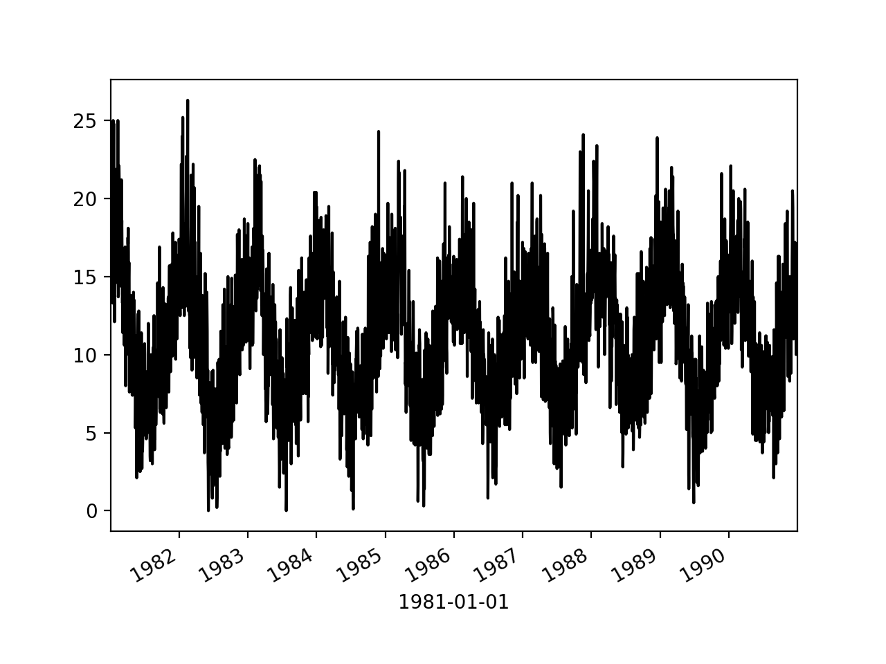
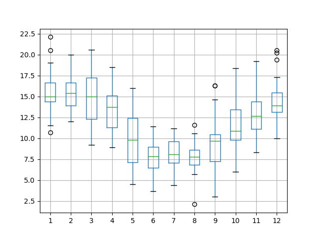

<style>
details {
    border: 1px solid #aaa;
    border-radius: 4px;
    padding: .5em .5em 0;
}
summary {
    font-weight: bold;
    margin: -.5em -.5em 0;
    padding: .5em;
}
details[open] {
    padding: .5em;
}
details[open] summary {
    border-bottom: 1px solid #aaa;
    margin-bottom: .5em;
}
img {
    pointer-events: none;
}
</style>

<details><summary>目录</summary><p>

- [时间序列图形](#时间序列图形)
- [时间序列数据](#时间序列数据)
- [时间序列折线图](#时间序列折线图)
- [时间序列直方图和密度图](#时间序列直方图和密度图)
- [时间序列箱型图和晶须图](#时间序列箱型图和晶须图)
- [时间序列热图](#时间序列热图)
- [时间序列滞后散点图](#时间序列滞后散点图)
- [时间序列自相关图](#时间序列自相关图)
- [时间序列可视化模版](#时间序列可视化模版)
- [大型时间序列可视化压缩算法](#大型时间序列可视化压缩算法)
    - [Midimax 压缩算法](#midimax-压缩算法)
    - [算法源码](#算法源码)
</p></details><p></p>

# 时间序列图形

* 时间序列的时间结构 
    - Line Plots
    - Lag Plots or Scatter Plots
    - Autocorrelation Plots
* 时间序列的分布
    - Histograms and Density Plots
* 时间序列间隔上分布
    - Box and Whisker Plots
    - Heat Maps

# 时间序列数据

- [澳大利亚墨尔本市10年(1981-1990年)内的最低每日温度](https://raw.githubusercontent.com/jbrownlee/Datasets/master/daily-min-temperatures.csv)

```python
import pandas as pd 
import matplotlib.pyplot as plt 

series = pd.read_csv(
    "https://raw.githubusercontent.com/jbrownlee/Datasets/master/daily-min-temperatures.csv",
    header = 0,
    index_col = 0,  # or "ts_col"
    parse_dates = True,  # or ["ts_col"]
    date_parser = lambda dates: pd.to_datetime(dates, format = '%Y-%m-%d'),
    squeeze = True,
)
print(series.head())
```

```
Date,Temp
1981-01-01,20.7
1981-01-02,17.9
1981-01-03,18.8
1981-01-04,14.6
1981-01-05,15.8
1981-01-06,15.8
```

# 时间序列折线图

> * `$x$` 轴: timestamp
> * `$y$` 轴: timeseries

```python
series.plot()
plt.show()
```


 

```python
series.plot(style = "k-")
plt.show()
```


 
```python
series.plot(style = "k.")
plt.show()
```


```python
groups = series.groupby(pd.Grouper(freq = "A"))
years = pd.DataFrame()
for name, group in groups:
    years[name.year] = group.values

years.plot(subplots = True, legend = False)
plt.show()
```


# 时间序列直方图和密度图

> * 时间序列值本身的分布, 没有时间顺序的值的图形

```python
series.hist()
# or 
series.plot(kind = "hist")
plt.show()
```


```python
series.plot(kind = "kde")
plt.show()
```


 
# 时间序列箱型图和晶须图

> * 在每个时间序列(例如年、月、天等)中对每个间隔进行比较

```python
groups = series.groupby(pd.Grouper(freq = "A"))
years = pd.DataFrame()
for name, group in groups:
    years[name.year] = group.values

years.boxplot()
plt.plot()
```


```python
one_year = series["1990"]
groups = one_year.groupby(pd.Grouper(freq = "M"))
months = pd.concat(
    [pd.DataFrame(x[1].values) for x in groups], 
    axis = 1
)
months = pd.DataFrame(months)
months.columns = range(1, 13)

months.boxplot()
plt.show()
```



# 时间序列热图

- 用较暖的颜色(黄色和红色)表示较大的值, 用较冷的颜色(蓝色和绿色)表示较小的值

```python
groups = series.groupby(pd.Grouper(freq = "A"))
years = pd.DataFrame()
for name, group in groups:
    years[name.year] = group.values
years = years.T

plt.matshow(years, interpolation = None, aspect = "auto")
plt.show()
```


 
```python
one_year = series["1990"]
groups = one_year.groupby(pd.Grouper(freq = "M"))
months = pd.concat(
    [pd.DataFrame(x[1].values) for x in groups], 
    axis = 1
)
months = pd.DataFrame(months)
months.columns = range(1, 13)

plt.matshow(months, interpolation = None, aspect = "auto")
plt.show()
```


 

# 时间序列滞后散点图

时间序列中的先前观测值称为 lag, 先前时间步长的观测值称为 lag1, 
两个时间步长之前的观测值称为 lag2, 依此类推

Pandas 具有内置散点图功能, 称为延迟图(lag plot). 它在 x 轴上绘制在时间 t 处的观测值, 
在 y 轴上绘制 lag1(t-1) 处的观测值

如果这些点沿从图的左下角到右上角的对角线聚集, 则表明存在正相关关系. 
如果这些点沿从左上角到右下角的对角线聚集, 则表明呈负相关关系. 由于可以对它们进行建模, 
因此任何一种关系都很好. 越靠近对角线的点越多, 则表示关系越牢固, 而从对角线扩展的越多, 
则关系越弱.中间的球比较分散表明关系很弱或没有关系

```python
from pandas.plotting import lag_plot

lag_plot(series)
plt.show()
```


```python
values = pd.DataFrame(series.values)

lags = 7

columns = [values]
for i in range(1, (lags + 1)):
    columns.append(values.shift(i))

dataframe = pd.concat(columns, axis = 1)
columns = ["t+1"]
for i in range(1, (lags + 1)):
    columns.append("t-" + str(i))
dataframe.columns = columns

plt.figure(1)
for i in range(1, (lags + 1)):
    ax = plt.subplot(240 + i)
    ax.set_title(f"t+1 vs t-{str(i)}")
    plt.scatter(
        x = dataframe["t+1"].values, 
        y = dataframe["t-" + str(i)].values
    )
plt.show()
```


 
# 时间序列自相关图

量化观察值与滞后之间关系的强度和类型. 在统计中, 这称为相关, 
并且根据时间序列中的滞后值进行计算时, 称为自相关

```python
from pandas.plotting import autocorrelation_plot

autocorrelation_plot(series)
plt.show()
```


# 时间序列可视化模版

```python
# -*- coding: utf-8 -*-
# python libraries
import os
import sys
ROOT = os.getcwd()
if str(ROOT) not in sys.path:
    sys.path.append(str(ROOT))
from typing import List, Tuple, Union
import warnings

import pandas as pd
import matplotlib.pyplot as plt
from matplotlib import dates, ticker
import seaborn as sns

# 绘图设置
# ----------------------------------------------
# 绘图风格
# plt.style.use("ggplot")  # style sheet config
# plt.style.use("classic")  # style sheet config

# 字体尺寸设置
# plt.rcParams["font.size"] = 10
title_fontsize = 13
label_fontsize = 7

# figure 设置
# plt.tight_layout()
# plt.rcParams["figure.autolayout"] = True  
plt.rcParams["axes.grid"] = True  # axis grid
# 字体设置
plt.rcParams["font.sans-serif"] = ["Arial Unicode MS", "SimHei"]  # 处理 matplotlib 字体问题
plt.rcParams["font.family"].append("SimHei")  # 处理 matplotlib 字体问题

warnings.filterwarnings("ignore")

# global variable
LOGGING_LABEL = __file__.split('/')[-1][:-3]


def plot_array_temp_curve(data_list: List, title: str):
    """
    绘制拱顶温度、烟道温度曲线

    Args:
        data_list (List): _description_
        title (str): _description_
    """
    # data
    df = pd.DataFrame({"temp": data_list})
    # plot
    fig = plt.figure()
    plt.plot(df.index, df["temp"], marker = ".", linestyle = "-.")
    plt.title(label = title)
    plt.show();


def plot_df_temp_curve(df: pd.DataFrame, ycol: str, title: str = ""):
    """
    绘制拱顶温度、烟道温度曲线

    Args:
        df (pd.DataFrame): _description_
        ycol (str): _description_
        title (str, optional): _description_. Defaults to None.
    """
    # plot
    fig = plt.figure()
    plt.plot(df.index, df[ycol], marker = ".", linestyle = "-.")
    if title:
        plt.title(label = title)
    plt.show();


def plot_heatmap(dfs: List, 
                 stat: str = "corr",  # 协方差矩阵: "cov"
                 method: str = "pearson", 
                 figsize: Tuple = (5, 5), 
                 titles: List[str] = [], 
                 show: bool = False, 
                 img_file_name: str = ""):
    """
    相关系数、协方差矩阵热力图
    """
    fig, axes = plt.subplots(nrows = 1, ncols = len(dfs), figsize = figsize)
    stat_matrixs = []
    for idx, df, title in zip(range(len(dfs)), dfs, titles):
        # ax
        ax = axes[idx] if len(dfs) > 1 else axes
        # 计算相关系数矩阵或协方差矩阵
        if stat == "corr":
            stat_matrix = df.corr(method)#.sort_values(by = sort_col_list, ascending = False)
        elif stat == "cov":
            stat_matrix = df.cov()#.sort_values(by = sort_col_list, ascending = False)
        # 绘制相关系数矩阵热力图
        sns.heatmap(
            data = stat_matrix, annot = True, annot_kws = {"size": 8}, 
            square = True, cmap = sns.diverging_palette(20, 220, n = 256), 
            linecolor = 'w', center = 0, vmin = -1, vmax = 1, 
            fmt = ".2f", cbar = False, ax = ax,
        )
        ax.xaxis.tick_top()
        ax.set_xticklabels(ax.get_xticklabels(), rotation = 90)
        ax.set_title(f"{title}相关系数矩阵热力图", fontsize = title_fontsize)
        
        # 收集相关系数、协方差矩阵
        stat_matrixs.append(stat_matrix)
    # 图像显示
    if show:
        plt.show()
    # 图像保存
    if img_file_name is not None:
        fig.get_figure().savefig(f'imgs/{img_file_name}.png', bbox_inches = 'tight', transparent = True)
        
    return stat_matrixs


def plot_scatter(data, x: str, y: str, 
                 logx = False, logy = False,
                 xtick_major = None, xtick_minor = None,
                 ytick_major = None, ytick_minor = None,
                 hline_ll = None, hline_ul = None,
                 vline_ll = None, vline_ul = None,
                 figsize = (8, 8),
                 title = None):
    fig, ax = plt.subplots(figsize = figsize)
    # xtick
    if xtick_major:
        ax.xaxis.set_major_locator(ticker.MultipleLocator(xtick_major))
    if xtick_minor:
        ax.xaxis.set_minor_locator(ticker.MultipleLocator(xtick_minor))
    # ytick
    if ytick_major:
        ax.yaxis.set_major_locator(ticker.MultipleLocator(ytick_major))
    if ytick_minor:
        ax.yaxis.set_minor_locator(ticker.MultipleLocator(ytick_minor))
    # grid
    ax.grid(True, which = "both", ls = "dashed")
    # plot
    data.plot(
        kind = "scatter", x = x, y = y, 
        s = 20, alpha = 0.7, edgecolors = "white", legend = True, 
        logx = logx, logy = logy,
        ax = ax,
    )
    # xlabel
    plt.setp(ax.get_xmajorticklabels(), rotation = 90.0)
    plt.setp(ax.get_xminorticklabels(), rotation = 0.0)
    # hline and vline
    if hline_ll:
        plt.axhline(y = hline_ll, color = "red", linestyle = "--")
    if hline_ul:
        plt.axhline(y = hline_ul, color = "red", linestyle = "--")
    if vline_ll:
        plt.axvline(x = vline_ll, color = "darkgreen", linestyle = "--")
    if vline_ul:
        plt.axvline(x = vline_ul, color = "darkgreen", linestyle = "--")
    # title
    plt.title(title)
    plt.show();


def plot_scatter_multicols(df: pd.DataFrame, 
                           xcols: List[str], 
                           ycols: List[str], 
                           cate_cols: List[str], 
                           figsize: Tuple = (5, 5), 
                           show: bool = False, 
                           img_file_name: Union[str, any] = None):
    """
    散点图
    scatter legend link ref:
    https://stackoverflow.com/questions/17411940/matplotlib-scatter-plot-legend
    """
    fig, axes = plt.subplots(nrows = 1, ncols = len(xcols), figsize = figsize)
    for idx, xcol, ycol, cate_col in zip(range(len(xcols)), xcols, ycols, cate_cols):
        # ax
        ax = axes[idx] if len(xcols) > 1 else axes
        # 散点图
        if cate_col is not None:
            sns.scatterplot(data = df, x = xcol, y = ycol, hue = cate_col, ax = ax)
        else:
            sns.scatterplot(data = df, x = xcol, y = ycol, ax = ax)
        ax.set_xlabel(xcol, fontsize = label_fontsize)
        ax.set_ylabel(ycol, fontsize = label_fontsize)
        ax.set_title(f"{xcol} 与 {ycol} 相关关系散点图", fontsize = title_fontsize)
        ax.legend(loc = "best")
    # 图像显示
    if show:
        plt.show()
    # 图像保存
    if img_file_name is not None:
        fig.get_figure().savefig(f'imgs/{img_file_name}.png', bbox_inches = 'tight', transparent = True)


def plot_scatter_reg(df: pd.DataFrame, 
                     xcols: List[str], 
                     ycols: List[str],
                     figsize: Tuple = (5, 5),
                     xtick_major = None, xtick_minor = None,
                     ytick_major = None, ytick_minor = None,
                     hline_ll = None, hline_ul = None,
                     vline_ll = None, vline_ul = None,
                     title: str = "",
                     img_file_name: str = None):
    """
    带拟合曲线的散点图
    """
    fig, axes = plt.subplots(nrows = 1, ncols = len(xcols), figsize = figsize)
    for idx, xcol, ycol in zip(range(len(xcols)), xcols, ycols):
        # ax
        ax = axes[idx] if len(xcols) > 1 else axes
        # xtick
        if xtick_major:
            ax.xaxis.set_major_locator(ticker.MultipleLocator(xtick_major))
        if xtick_minor:
            ax.xaxis.set_minor_locator(ticker.MultipleLocator(xtick_minor))
        # ytick
        if ytick_major:
            ax.yaxis.set_major_locator(ticker.MultipleLocator(ytick_major))
        if ytick_minor:
            ax.yaxis.set_minor_locator(ticker.MultipleLocator(ytick_minor))
        # 带拟合曲线的散点图
        sns.regplot(
            data = df, x = xcol, y = ycol, 
            # robust = True,
            lowess = True, 
            line_kws = {"color": "C2"},  
            ax = ax
        )
        # xlabel
        plt.setp(ax.get_xmajorticklabels(), rotation = 90.0)
        plt.setp(ax.get_xminorticklabels(), rotation = 0.0)
        # hline and vline
        if hline_ll:
            plt.axhline(y = hline_ll, color = "red", linestyle = "--")
        if hline_ul:
            plt.axhline(y = hline_ul, color = "red", linestyle = "--")
        if vline_ll:
            plt.axvline(x = vline_ll, color = "darkgreen", linestyle = "--")
        if vline_ul:
            plt.axvline(x = vline_ul, color = "darkgreen", linestyle = "--")
    # title
    plt.title(f"{title}关系图")
    # show
    plt.show()
    # save
    if img_file_name is not None:
        fig.get_figure().savefig(f'imgs/{img_file_name}.png', bbox_inches = 'tight', transparent = True)


def plot_scatter_lm(df: pd.DataFrame, 
                    xcol: str, 
                    ycol: str, 
                    cate_col: str, 
                    figsize = (5, 5),
                    show: bool = False, 
                    img_file_name: str = None):
    """
    带拟合曲线的散点图
    """
    fig, axes = plt.figure(nrows = 1, ncols = 1, figsize = figsize)
    if cate_col is not None:
        sns.lmplot(data = df, x = xcol, y = ycol, hue = cate_col, robust = True, ax = axes)
    else:
        sns.lmplot(data = df, x = xcol, y = ycol, robust = True, ax = axes)
    plt.title(f"{xcol} 与 {ycol} 相关关系散点图", fontsize = title_fontsize)
    # 图像显示
    if show:
        plt.show()
    # 图像保存
    if img_file_name is not None:
        fig.get_figure().savefig(f'imgs/{img_file_name}.png', bbox_inches = 'tight', transparent = True)


def plot_scatter_matrix(df: pd.DataFrame, 
                        cols: List, 
                        figsize: Tuple = (10, 10), 
                        xlabel: str = None,
                        ylabel: str = None,
                        title: str = "", 
                        show: bool = False, 
                        img_file_name: str = None):
    """
    散点图矩阵
    """
    fig, axes = plt.subplots(figsize = figsize)
    sns.pairplot(data = df[cols], kind = "reg", diag_kind = "kde", corner = True)
    axes.set_xlabel(xlabel, fontsize = label_fontsize)
    axes.set_ylabel(ylabel, fontsize = label_fontsize)
    axes.set_title(f"{title} 的散点图矩阵", fontsize = title_fontsize)
    # 图像显示
    if show:
        plt.show()
    # 图像保存
    if img_file_name is not None:
        fig.get_figure().savefig(f'imgs/{img_file_name}.png', bbox_inches = 'tight', transparent = True)


def plot_timeseries(data: List = None,
                    ts_cols: List = None,
                    xtick_major = None, xtick_minor = None, 
                    ytick_major = None, ytick_minor = None, 
                    hline_ll = None, hline_ul = None,
                    vline_ll = None, vline_ul = None,
                    figsize = (28, 10),
                    title = None):
    """
    时间序列图
    """
    fig, ax = plt.subplots(figsize = figsize)
    # xtick
    if xtick_major:
        ax.xaxis.set_major_locator(dates.DayLocator())
        ax.xaxis.set_major_formatter(dates.DateFormatter("%Y-%m-%d"))
    if xtick_minor:
        ax.xaxis.set_minor_locator(dates.HourLocator())
        ax.xaxis.set_minor_formatter(dates.DateFormatter("%Y-%m-%d %H"))
    # ytick
    if ytick_major:
        ax.yaxis.set_major_locator(ticker.MultipleLocator(ytick_major))
    if ytick_minor:
        ax.yaxis.set_minor_locator(ticker.MultipleLocator(ytick_minor))
    # grid
    ax.grid(True, which = "both", ls = "dashed")
    
    # plot
    # 1图多曲线(一个数据源)
    if len(data) == 1:
        data[0][ts_cols].plot(legend = True, ax = ax)
    # 1图1曲线(两个数据源)
    if len(data) == 2 and len(ts_cols) == 1:
        data[0][ts_cols].plot(legend = True, ax = ax)
        data[1][ts_cols].plot(legend = True, ax = ax)
    # 1图2曲线(两个数据源)
    if len(data) == 2 and len(ts_cols) == 2:
        data[0][[ts_cols[0]]].plot(legend = True, ax = ax)
        data[1][[ts_cols[1]]].plot(legend = True, ax = ax)
    
    # xlabel
    plt.setp(ax.get_xmajorticklabels(), rotation = 0.0)
    plt.setp(ax.get_xminorticklabels(), rotation = 0.0)
    
    # hline and vline
    if hline_ll:
        plt.axhline(y = hline_ll, color = "red", linestyle = "--")
    if hline_ul:
        plt.axhline(y = hline_ul, color = "red", linestyle = "--")
    if vline_ll:
        plt.axvline(x = vline_ll, color = "darkgreen", linestyle = "--")
    if vline_ul:
        plt.axvline(x = vline_ul, color = "darkgreen", linestyle = "--")
   
    # title
    plt.title(f"{title}时序图")
    plt.show();


def plot_timeseries_multicols(df: pd.DataFrame, 
                              n_rows_cols: List[int],
                              ycols: List[str], 
                              cate_col: str = None, 
                              figsize: Tuple = (7, 5), 
                              show: bool = False, 
                              img_file_name: str = None):
    """
    时间序列图
    """
    fig, axes = plt.subplots(nrows = n_rows_cols[0], ncols = n_rows_cols[1], figsize = figsize)
    for idx, ycol in enumerate(ycols):
        # ax
        ax = axes[idx] if len(ycols) > 1 else axes
        # 线形图
        if cate_col is not None:
            sns.lineplot(data = df, x = df.index, y = ycol, hue = cate_col, marker = ",", ax = ax)
            ax.set_xticklabels(ax.get_xticklabels(), rotation = 90)
            ax.set_title(f"{ycol} 在不同 {cate_col} 下的对比图", fontsize = title_fontsize)
        else:
            sns.lineplot(data = df, x = df.index, y = ycol, marker = ",", ax = ax)
            ax.set_xticklabels(ax.get_xticklabels(), rotation = 90)
            ax.set_title(f"{ycol} 的时间序列图", fontsize = title_fontsize)
    # 图像显示
    if show:
        plt.show()
    # 图像保存
    if img_file_name is not None:
        fig.get_figure().savefig(f'imgs/{img_file_name}.png', bbox_inches = 'tight', transparent = True)


def plot_distributed(df: pd.DataFrame, 
                     xcols: List[str], 
                     cate_cols: List[str], 
                     figsize: Tuple = (5, 5), 
                     show: bool = False, 
                     img_file_name: str = None):
    fig, axes = plt.subplots(nrows = 1, ncols = len(xcols), figsize = figsize)
    for idx, xcol, cate_col in zip(range(len(xcols)), xcols, cate_cols):
        # ax
        ax = axes[idx] if len(xcols) > 1 else axes
        # 散点图
        if cate_col is not None:
            sns.histplot(data = df, x = xcol, hue = cate_col, kde = True, ax = ax)
        else:
            sns.histplot(data = df, x = xcol, kde = True, ax = ax)
        ax.set_xlabel(xcol, fontsize = label_fontsize)
        ax.set_title(f"{xcol} 分布直方图", fontsize = title_fontsize)
    # 图像显示
    if show:
        plt.show()
    # 图像保存
    if img_file_name is not None:
        fig.get_figure().savefig(f'imgs/{img_file_name}.png', bbox_inches = 'tight', transparent = True)


# 测试代码 main 函数
def main():
    pass

if __name__ == "__main__":
    main()
```


# 大型时间序列可视化压缩算法

压缩算法 “Midimax”，该算法会通过数据大小压缩来提升时间序列图的效果。该算法的设计有如下几点目标：

* 不引入非实际数据
    - 只返回原始数据的子集，所以没有平均、中值插值、回归和统计聚合等
* 快速且计算量小
* 最大化信息增益
    - 意味着它应该尽可能多地捕捉原始数据中的变化
* 由于取最小和最大点可能会给出夸大方差的错误观点，因此取中值点以保留有关信号稳定性的信息

## Midimax 压缩算法

1. 向算法输入时间序列数据、压缩系数(浮点数)
2. 将时间序列数据拆分为大小相等的非重叠窗口
    - 窗口长度为：`$window\_size = floor(3 \times zip\_factory)$`。
    - 3 表示从每个窗口获取的最小、中值和最大点
    - 因此，要实现 2 的压缩因子，窗口大小必须为 6。更大的压缩比需要更宽的窗口
3. 按升序对每个窗口中的值进行排序
4. 选取最小点和最大点的第一个和最后一个值。这将确保我们最大限度地利用差异并保留信息
5. 为中间值选取一个中间值，其中中间位置定义为 `$med\_index = floor(window\_size / 2)$`。
   因此，即使窗口大小是均匀的，也不会进行插值
6. 根据原始索引(即时间戳)对选取的点重新排序

Midimax 是一种简单轻量级的算法，可以减少数据的大小，并进行快速的图形绘制：

* Midimax 在绘制大型时序图时可以保留原始时序的趋势；
  可以使用较少的点捕获原始数据中的变化，并在几秒钟内处理大量数据
* Midimax 会丢失部分细节；压缩过大的话可能会有较多信息丢失

## 算法源码

```python
# midimax.py
"""
Midimax Data Compression for Time-Series

Author: Edwin Sutrisno
Link: https://github.com/edwinsutrisno/midimax_compression
"""

import pandas as pd


def compress_series(inputser: pd.Series, compfactor = 2):
    """
    Split into segments and pick 3 points from each segment, the minimum, median, and maximum. 
    Segment length = int(compfactor x 3). 
    So, to achieve a compression factor of 2, a segment length of 6 is needed.

    Parameters
    ----------
    inputser : pd.Series
        Input data to be compressed.
    compfactor : float
        Compression factor. The default is 2.

    Returns
    -------
    pd.Series
        Compressed output series.
    """
    # If comp factor is too low, return original data
    if (compfactor < 1.4):
        return inputser
    # window size
    win_size = int(3 * compfactor)
    # Create a column of segment numbers
    ser = inputser.rename('value')
    ser = ser.round(3)
    wdf = ser.to_frame()
    del ser
    start_idxs = wdf.index[range(0, len(wdf), win_size)]
    wdf['win_start'] = 0
    wdf.loc[start_idxs, 'win_start'] = 1
    wdf['win_num'] = wdf['win_start'].cumsum()
    wdf.drop(columns = 'win_start', inplace = True)
    del win_size, start_idxs

    def get_midimax_idxs(gdf):
        """
        For each window, get the indices of min, median, and max
        """
        if len(gdf) == 1:
            return [gdf.index[0]]
        elif gdf['value'].iloc[0] == gdf['value'].iloc[-1]:
            return [gdf.index[0]]
        elif len(gdf) == 2:
            return [gdf.index[0], gdf.index[1]]
        else:
            return [gdf.index[0], gdf.index[len(gdf) // 2], gdf.index[-1]]

    wdf = wdf.dropna()
    wdf_sorted = wdf.sort_values(['win_num', 'value'])
    midimax_idxs = wdf_sorted.groupby('win_num').apply(get_midimax_idxs)

    # Convert into a list
    midimax_idxs = [idx for sublist in midimax_idxs for idx in sublist]
    midimax_idxs.sort()

    return inputser.loc[midimax_idxs]
def compress_series(inputser: pd.Series, compfactor=2):
    """
    Split into segments and pick 3 points from each segment, the minimum,
    median, and maximum. Segment length = int(compfactor x 3). So, to achieve a
    compression factor of 2, a segment length of 6 is needed.

    Parameters
    ----------
    inputser : pd.Series
        Input data to be compressed.
    compfactor : float
        Compression factor. The default is 2.

    Returns
    -------
    pd.Series
        Compressed output series.

    """
    # If comp factor is too low, return original data
    if (compfactor < 1.4):
        return inputser

    win_size = int(3 * compfactor)  # window size

    # Create a column ofsegment numbers
    ser = inputser.rename('value')
    ser = ser.round(3)
    wdf = ser.to_frame()
    del ser
    start_idxs = wdf.index[range(0, len(wdf), win_size)]
    wdf['win_start'] = 0
    wdf.loc[start_idxs, 'win_start'] = 1
    wdf['win_num'] = wdf['win_start'].cumsum()
    wdf.drop(columns='win_start', inplace=True)
    del win_size, start_idxs

    # For each window, get the indices of min, median, and max
    def get_midimax_idxs(gdf):
        if len(gdf) == 1:
            return [gdf.index[0]]
        elif gdf['value'].iloc[0] == gdf['value'].iloc[-1]:
            return [gdf.index[0]]
        elif len(gdf) == 2:
            return [gdf.index[0], gdf.index[1]]
        else:
            return [gdf.index[0], gdf.index[len(gdf) // 2], gdf.index[-1]]

    wdf = wdf.dropna()
    wdf_sorted = wdf.sort_values(['win_num', 'value'])
    midimax_idxs = wdf_sorted.groupby('win_num').apply(get_midimax_idxs)

    # Convert into a list
    midimax_idxs = [idx for sublist in midimax_idxs for idx in sublist]
    midimax_idxs.sort()
    return inputser.loc[midimax_idxs]
```

Demo：

```python
# midimax_demo.py
# -*- coding: utf-8 -*-
"""
Demo for Midimax time-series data compression.

Author: Edwin Sutrisno
Link: https://github.com/edwinsutrisno/midimax_compression
"""

import time

import numpy as np
import pandas as pd
from bokeh.models import ColumnDataSource, DatetimeTickFormatter
from bokeh.plotting import figure, output_file, save

from midimax import compress_series


# Create a time-series of sine wave
n = 1000  # points
timesteps = pd.to_timedelta(np.arange(n), unit = 's')
timestamps = pd.to_datetime("2022-04-18 08:00:00") + timesteps

sine_waves = np.sin(2 * np.pi * 0.02 * np.arange(n))
noise = np.random.normal(0, 0.1, n)
signal = sine_waves + noise
ts_data = pd.Series(signal, index = timestamps).astype('float32')
print(f"ts_data:\n{ts_data}")

# Run compression
timer_start = time.time()
ts_data_compressed = compress_series(ts_data, 2)
timer_sec = round(time.time() - timer_start, 2)
print(f"\nts_data_compressed:\n{ts_data_compressed}")
print(f"Compression took {timer_sec} seconds.")


def format_fig_axis(fig):
    """
    Formatting the date stamps on the plot axis
    """
    fig.xaxis.formatter = DatetimeTickFormatter(
        days = ["%m/%d %H:%M:%S"],
        months = ["%m/%d %H:%M:%S"],
        hours = ["%m/%d %H:%M:%S"],
        minutes = ["%m/%d %H:%M:%S"]
    )
    fig.xaxis.axis_label = 'Timestamp'
    fig.yaxis.axis_label = 'Series Value'

    return fig


# Plot before
fig1 = figure(sizing_mode = 'stretch_both', tools = 'box_zoom,pan,reset')
line_before = fig1.line(
    x = ts_data.index, 
    y = ts_data.values, 
    line_width = 2
)
fig1 = format_fig_axis(fig1)
output_file(r'ts_visual/demo_output_before_compression.html')
save(fig1)


# Plot after
fig2 = figure(sizing_mode = 'stretch_both', tools = 'box_zoom,pan,reset')
line_after = fig2.line(
    x = ts_data_compressed.index, 
    y = ts_data_compressed.values, 
    line_color = 'green'
)
fig2 = format_fig_axis(fig2)
output_file(r'ts_visual/demo_output_after_compression.html')
save(fig2)


# Plot before and after together
fig3 = figure(sizing_mode = 'stretch_both', tools = 'box_zoom,pan,reset')
fig3.line(
    x = ts_data.index, 
    y = ts_data.values, 
    line_width = 2
)
fig3.line(
    x = ts_data_compressed.index, 
    y = ts_data_compressed.values, 
    line_color = 'green', 
    line_dash = 'dashed'
)
fig3.scatter(
    x = ts_data_compressed.index, 
    y = ts_data_compressed.values, 
    marker = 'circle', 
    size = 8, 
    color = 'green'
)
fig3 = format_fig_axis(fig3)
output_file('ts_visual/demo_output_before_and_after_compression.html')
save(fig3)
```
