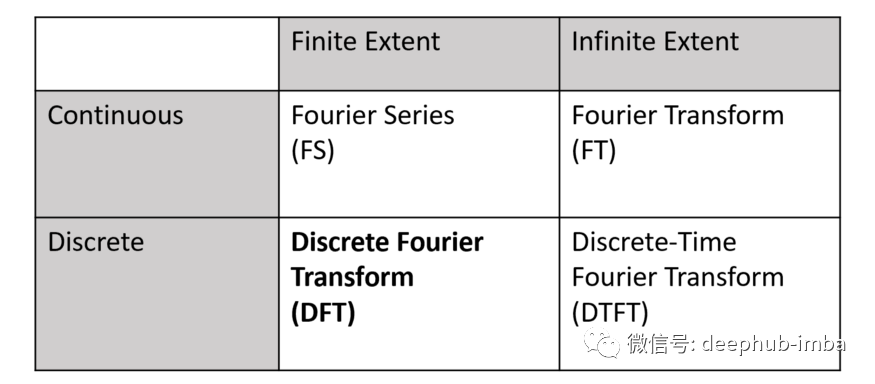

<style>
details {
    border: 1px solid #aaa;
    border-radius: 4px;
    padding: .5em .5em 0;
}
summary {
    font-weight: bold;
    margin: -.5em -.5em 0;
    padding: .5em;
}
details[open] {
    padding: .5em;
}
details[open] summary {
    border-bottom: 1px solid #aaa;
    margin-bottom: .5em;
}
</style>

<details><summary>目录</summary><p>

- [傅里叶变换](#傅里叶变换)
  - [傅里叶变换介绍](#傅里叶变换介绍)
  - [快速傅里叶变换](#快速傅里叶变换)
  - [傅里叶变换的应用](#傅里叶变换的应用)
    - [数据去噪](#数据去噪)
      - [将干净的数据与噪声混合](#将干净的数据与噪声混合)
      - [从时域到频域的转换](#从时域到频域的转换)
      - [去除噪声频率](#去除噪声频率)
      - [从频域到时域的转换](#从频域到时域的转换)
    - [自定义傅里叶变换函数](#自定义傅里叶变换函数)
    - [周期性检测](#周期性检测)
    - [季节性检测](#季节性检测)
    - [TODO](#todo)
- [小波分析](#小波分析)
  - [小波分析的应用](#小波分析的应用)
- [参考资料](#参考资料)
</p></details><p></p>

# 傅里叶变换

傅里叶变换的维基百科介绍：

> **傅里叶变换**（法语：Transformation de Fourier、英语：Fourier Transform）是一种线性积分变换，
> 用于信号在[时域](https://zh.wikipedia.org/wiki/時域)(或空域)和[频域](https://zh.wikipedia.org/wiki/频域)之间的变换，
> 在物理学和工程学中有许多应用。因其基本思想首先由法国学者约瑟夫·傅里叶系统地提出，所以以其名字来命名以示纪念。
> 实际上傅里叶变换就像化学分析，确定物质的基本成分；信号来自自然界，也可对其进行分析，确定其基本成分。
>
> * 时域 (time domain)
>       - 描述数学函数或物理信号对时间的关系。例如一个信号的时域波形可以表达信号随着时间的变化
> * 频域 (frequency domain)
>       - 在电子学、控制系统、统计学中是指在对函数或信号进行分析时，分析其和频率有关的部分，而不是和时间有关的部分

傅立叶变换的思想是如此的深刻。它提醒我世界可能不是你所看到的，
你的生活可能有一个完全不同的新面貌，只能通过一种变换才能看到，比如傅立叶变换。
不仅可以转换声音数据，还可以转换图像，视频，电磁波，甚至股票交易数据(Kondratiev波)

傅立叶变换也可以用描述运动来解释：


四种傅里叶变换：



两本介绍傅里叶变换的书：

* Frequency Domain and Fourier Transforms. Paul W. Cuff’s textbook from Princeton.
* Digital Signal Processing — by Steven W.Smith 的第 8 章 DSP

其他：

* [使用傅立叶变换清理时间序列数据噪声](https://cloud.tencent.com/developer/article/1891362)
* [An Interactive Guide To The Fourier Transform](https://betterexplained.com/articles/an-interactive-guide-to-the-fourier-transform/)
* [Fourier Transforms With scipy.fft: Python Signal Processing](https://realpython.com/python-scipy-fft/)
* [Understanding the FFT Algorithm](http://jakevdp.github.io/blog/2013/08/28/understanding-the-fft/)
* [Frequency Domain and Fourier Transforms](https://www.princeton.edu/~cuff/ele201/kulkarni_text/frequency.pdf)
* [Denoising Data with FFT(Python)](https://www.youtube.com/watch?v=s2K1JfNR7Sc&ab_channel=SteveBrunton)
* [The FFT Algorithm — Simple Step by Step](https://www.youtube.com/watch?v=htCj9exbGo0&ab_channel=SimonXu)

## 傅里叶变换介绍

傅里叶变换(Fourier Transform, FT)是一种将 **时域**、 **空域** 数据转化为 **频域** 数据的方法, 
任何波形(时域)都可以看做是不同振幅、不同相位(频域)正弦波的叠加. 
比如下面最前方的图形就是它后面所有正弦波的总和

下图很好地说明了傅立叶变换：将一个复杂的波分解成许多规则的正弦波，解释了将时域波数据转换为频域视图时会发生什么


将时域数据变换为频域数据的公式如下：

`$$X_{k} = \sum_{n=0}^{N-1} x_{n} \cdot e^{\frac{-i2 \pi k n}{N}}$$`

其中：

* `$x_{n}$`：原始时域信号数据，表示第 `$n$` 个位置(时间)的时域数据点，范围为 `$[0, N-1]$`
    - `$N$`：数据点个数
* `$k$`：频率序号，范围与 `$n$` 相同，`$[0, N-1]$`，因为极端情况下每个数据点代表一个独立的正弦波

将时域数据通过傅里叶变换转换为频域数据后就可以轻松地处理频域中的数据，
例如：去除噪声波。之后，可以使用逆方程将频域数据转换回时域波：

`$$x_{n} = \frac{1}{N}\sum_{n=0}{N-1} X_{k} \cdot e^{\frac{i2 \pi kn}{N}}$$`

## 快速傅里叶变换

快速傅里叶变换(Fast Fourier Transform, FFT)

## 傅里叶变换的应用

### 数据去噪

#### 将干净的数据与噪声混合

创建两个正弦波并将它们合并为一个正弦波，然后故意用随机噪声数据污染干净的数据波。
将两个信号组合成第三个信号也称为卷积或信号卷积

```python
# python libraries
import numpy as np
import matplotlib.pyplot as plt
plt.rcParams.update({
    "figure.figsize": [16, 10],
    "font.size": 18,
})

# ------------------------------
# data
# ------------------------------
data_step = 0.001
t = np.arange(start = 0, stop = 1, step = data_step)

# 正弦波序列
freq_50_series = np.sin(2 * np.pi * 50 * t)
freq_120_series = np.sin(2 * np.pi * 120 * t)
# 正弦波序列组合
f_clean = freq_50_series + freq_120_series

# 噪声数据
noise_series = 2.5 * np.random.randn(len(t))
# 噪声污染序列
f_noise = f_clean + noise_series
```

```python
plt.plot(t, freq_50_series)
plt.title("Freq 50")
plt.xlabel("t")
plt.ylabel("value")
plt.show()
```


```python
plt.plot(t, freq_120_series)
plt.title("Freq 120")
plt.xlabel("t")
plt.ylabel("value")
plt.show()
```


```python
plt.plot(t, f_clean, label = "Clean")
plt.title("Clean")
plt.xlabel("t")
plt.ylabel("value")
plt.show()
```


```python
plt.plot(t, noise_series)
plt.title("Noise")
plt.xlabel("t")
plt.ylabel("value")
plt.show()
```


```python
plt.plot(t, f_noise)
plt.title("Noisy")
plt.xlabel("t")
plt.ylabel("value")
plt.show()
```


```python
plt.plot(t, f_noise, c = "c", linewidth = 1.5, label = "Clean")
plt.plot(t, f_clean, c = "k", linewidth = 2, label = "Noisy")
plt.xlabel("t")
plt.ylabel("value")
plt.title("Clean and Noisy")
plt.legend()
plt.show()
```


上图所示为带有带噪音的波浪，黑色是想要的波，绿线是噪音。
如果隐藏图表中的颜色，几乎无法将噪声从干净的数据中分离出来，
但是 傅立叶变换在这里可以提供帮助。需要做的就是将数据转换到另一个角度，
从时间视图(x 轴是时间)到频率视图(x 轴将是波频率)

#### 从时域到频域的转换

可以使用 `numpy.fft` 或 `scipy.fft` 进行傅里叶转换，PyTorch1.8 以后也增加了 `torch.fft`。
`scipy.fft` 非常方便且功能齐全，但是如果想使用其他模块或者根据公式构建自己的一个也是没问题的

使用 `rfft` 而不是 `fft`，`r` 意味着 reduce 只计算正频率，所有负镜像频率将被省略，因为 `rfft` 的速度更快。
`rfft` 函数的结果 `yf` 是一个复数，形式类似于 `$a+bj$`，`np.abs()` 函数将为复数计算 `$\sqrt{a^{2} + b^{2}}$`

```python
# python libraries
import numpy as np
import matplotlib.pyplot as plt
plt.rcParams.update({
    "figure.figsize": [16, 10],
    "font.size": 18,
})
from scipy.fft import rfft, rfftfreq
# from numpy.fft import rfft, rfftfreq
# from torch.fft import rfft, rfftfreq


# ------------------------------
# fft transform
# ------------------------------
data_step = 0.001
t = np.arange(start = 0, stop = 1, step = data_step)
n = len(t)

yf = rfft(f_noise)
yf_abs = np.abs(yf)
xf = rfftfreq(n, data_step)

plt.plot(xf, yf_abs)
plt.xlabel("Freq")
plt.title("FFT")
plt.show()
```


上图为原始波的频域视图，x 轴表示频率。一些在时域看起来很复杂的东西现在被转换成非常简单的频域数据。
这两个峰代表两个正弦波的频率，一种波是 50Hz，另一种是 120Hz，其他频率就是噪声很容易去除

#### 去除噪声频率

将频域数据中频率为噪声的数据设置为 0，除了 50Hz 和 120Hz

```python
yf_clean = (yf_abs > 300) * yf
yf_clean_abs = np.abs(yf_clean)

plt.plot(xf, yf_clean_abs)
plt.xlabel("Freq")
plt.title("FFT filter noise")
plt.show()
```


#### 从频域到时域的转换

将频域数据转换回时域数据

```python
from scipy.fft import irfft

new_f_clean = irfft(yf_clean)

plt.plot(t, new_f_clean)
plt.title("New Clean")
plt.xlabel("t")
plt.ylabel("value")
plt.ylim(-6, 8)
plt.show()
```


### 自定义傅里叶变换函数

```python
import numpy as np
from scipy.fft import fft

def dft(x):
    x = np.asarray(x, dtype = float)
    N = x.shape[0]
    n = np.arange(N)
    k = np.reshape(N, 1)
    M = np.exp(-2j * np.pi * k * n / N)

    return np.dot(M, x)

x = np.random.random(1024)
np.allclose(dft(x), fft(x))
```

### 周期性检测

对于一条具备周期性的时间序列, 它本身就很接近正弦波, 所以它的组成里一定包含一个显著的正弦波, 
周期就是该正弦波的周期, 而这个正弦波可以通过傅里叶变换找到, 它将时序数据展开成
三角函数的线性组合, 得到每个展开项的系数, 就是傅里叶系数. 
傅里叶系数越大, 表明它所对应的正弦波的周期就越有可能是这份数据的周期. 

### 季节性检测

* https://anomaly.io/detect-seasonality-using-fourier-transform-r/

### TODO

* [An Interactive Guide To The Fourier Transform](https://betterexplained.com/articles/an-interactive-guide-to-the-fourier-transform/)

# 小波分析

小波分析的维基百科介绍：

> **小波分析**（英语：wavelet analysis）或**小波变换**（英语：wavelet transform）是指用有限长或快速衰减的“母小波”（mother wavelet）的振荡波形来表示信号。该波形被缩放和平移以匹配输入的信号。
>
> “小波”（英语：wavelet）一词由吉恩·莫莱特和阿列克斯·格罗斯曼在 1980 年代早期提出。他们用的是法语词 ondelette，意思就是“小波”。后来在英语里，“onde” 被改为 “wave” 而成了 wavelet。
>
> 小波变化的发展，承袭 Gabor transform 的局部化思想，并且克服了傅里叶和 Gabor transform 的部分缺陷，小波变换提供了一个可以调变的时频窗口，窗口的宽度 (width) 随着频率变化，频率增高时，时间窗口的宽度就会变窄，以提高分辨率．小波在整个时间范围内的振幅平均值为0，具有有限的持续时间和突变的频率与震幅，可以是不规则，或不对称的信号。
>
> 小波变换分成两个大类：离散小波变换 (DWT)  和连续小波变换 (CWT)。两者的主要区别在于，连续变换在所有可能的缩放和平移上操作，而离散变换采用所有缩放和平移值的特定子集。

## 小波分析的应用

# 参考资料

* https://zh.wikipedia.org/wiki/%E5%82%85%E9%87%8C%E5%8F%B6%E5%8F%98%E6%8D%A2
* https://www.leiphone.com/category/yanxishe/HJWOsm2lCtCIpVVK.html
* https://www.jezzamon.com/fourier/zh-cn.html
* https://github.com/Jezzamonn/fourier
* https://betterexplained.com/articles/an-interactive-guide-to-the-fourier-transform/
* https://zh.wikipedia.org/wiki/%E5%B0%8F%E6%B3%A2%E5%88%86%E6%9E%90
* http://users.rowan.edu/~polikar/WTpart1.html
* http://users.rowan.edu/~polikar/WTpart2.html
* http://users.rowan.edu/~polikar/WTpart3.html

