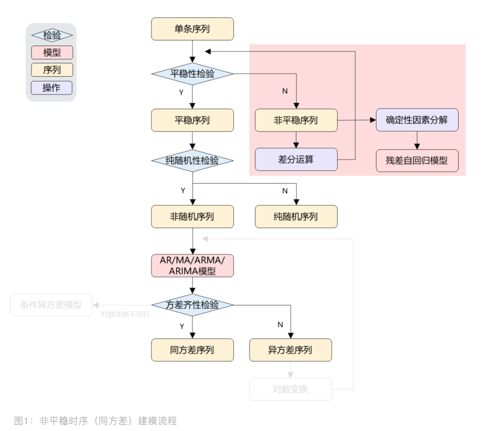

<style>
details {
    border: 1px solid #aaa;
    border-radius: 4px;
    padding: .5em .5em 0;
}
summary {
    font-weight: bold;
    margin: -.5em -.5em 0;
    padding: .5em;
}
details[open] {
    padding: .5em;
}
details[open] summary {
    border-bottom: 1px solid #aaa;
    margin-bottom: .5em;
}
</style>

<details><summary>目录</summary><p>

- [非平稳时间序列分析介绍](#非平稳时间序列分析介绍)
  - [非平稳时序分析-同方差](#非平稳时序分析-同方差)
  - [非平稳时序分析-异方差](#非平稳时序分析-异方差)
  - [方差齐性检验](#方差齐性检验)
    - [残差图](#残差图)
    - [残差平方图](#残差平方图)
    - [假设检验](#假设检验)
- [ARIMA 模型](#arima-模型)
  - [ARIMA(`$p$`, `$d$`, `$q$`) 模型](#arimap-d-q-模型)
  - [差分运算](#差分运算)
    - [p 阶差分](#p-阶差分)
    - [k 步差分](#k-步差分)
    - [滞后算子](#滞后算子)
    - [差分运算 API](#差分运算-api)
  - [百分比变化率](#百分比变化率)
  - [ARIMA(`$p$`, `$d$`, `$q$`) 模型结构](#arimap-d-q-模型结构)
  - [ARIMA(`$p$`, `$d$`, `$q$`) 模型应用](#arimap-d-q-模型应用)
- [残差自回归模型](#残差自回归模型)
  - [确定性因素分解](#确定性因素分解)
    - [趋势](#趋势)
    - [季节](#季节)
    - [随机](#随机)
  - [残差自回归模型](#残差自回归模型-1)
- [对数变换加 ARIMA](#对数变换加-arima)
- [条件异方差模型 ARCH](#条件异方差模型-arch)
  - [广义自回归条件异方差模型 GARCH](#广义自回归条件异方差模型-garch)
  - [AR-GARCH 模型](#ar-garch-模型)
- [参考](#参考)
</p></details><p></p>

# 非平稳时间序列分析介绍

在自然界中绝大部分序列都是非平稳的，因而对非平稳序列的分析更普遍、更重要。
对于非平稳时间序列分析，根据残差序列的方差是否相同，时序分析可以分为两种：

* 残差序列具有同方差性
    - 差分自回归移动平均模型 ARIMA
    - 残差自回归模型
* 残差序列具有异方差性
    - 对数变换后拟合 ARIMA
    - 条件异方差模型 ARCH
        - 广义自回归条件异方差模型 GARCH
        - AR-GARCH 模型

## 非平稳时序分析-同方差

如果时序是非平稳的，即没有通过平稳性检验，并且残差序列具有同方差性。
传统时序分析中一般有两种手段进行处理：差分运算、确定性因素分解。
针对这两种确定信息提取方式，可以分别构建两种传统模型：ARIMA 和残差自回归模型

* 差分运算具有强大的确定性信息提取能力，许多非平稳序列差分后会显示出平稳序列的性质, 称这个非平稳序列为差分平稳序列。
  对差分平稳序列可以使用 ARIMA(autoregression integrated moving average, 求和自回归移动平均)模型进行拟合。
  ARIMA 模型的实质就是差分运算和 ARMA 模型的组合，说明任何非平稳序列如果能通过适当阶数的差分实现差分后平稳，
  就可以对差分后序列进行 ARMA 模型拟合, 而 ARMA 模型的分析方法非常成熟
* 残差自回归模型

非平稳时序（同方差）建模流程如下：



## 非平稳时序分析-异方差

有时候，发现即使在非平稳时序上，使用了 ARIMA 或残差自回归模型也难达到理想效果，
此时，问题可能发生在残差序列具有异方差性上，因为当使用 ARIMA 拟合非平稳序列时，
对残差序列有一个重要的假定：残差序列为零均值白噪声序列。但现实是，方差可能会随着时间变化而变化，
比如说股市里，今年市场不稳定性比去年大，那么今年的方差就会比去年大，这就不满足 ARIMA 的方差齐性假定。
这里介绍如何识别异方差？如何对异方差非平稳时序建模？

异方差序列应对方法有从两种角度去做：

* 对序列做对数变换，再走 ARIMA
* 直接构建条件异方差模型，拟合异方差函数

非平稳时序（异方差）建模流程：


## 方差齐性检验

方差齐性检验有两种方法：残差图和残差平方图

### 残差图

残差图是直接可视化残差序列，观察波动状况


### 残差平方图

残差平方图是对一阶差分后的时序求平均后的图。差分是抽取波动性，平方是把差分变正数


### 假设检验

使用统计检验来检查时间序列是否为异方差序列主要有三种方法：

* White Test
* Breusch-Pagan Test
* Goldfeld-Quandt Test

这些检验的主要输入是回归模型的残差(如普通最小二乘法)。零假设是残差的分布方差相等。
如果 `$p$` 值小于显著性水平，则拒绝该假设。这就说明时间序列是异方差的，检验显著性水平通常设置为 0.05

```python
import pandas as pd
import statsmodels.stats.api as sms
from statsmodels.formula.api import ols

TEST_NAMES = ["White", "Breusch-Pagan", "Goldfeld-Quandt"]
FORMULA = 'value ~ time'


class Heteroskedasticity:
 
    @staticmethod
    def het_tests(series: pd.Series, test: str) -> float:
        """
        Testing for heteroskedasticity

        Parameters:
            series: Univariate time series as pd.Series
            test: String denoting the test. One of 'White','Goldfeld-Quandt', or 'Breusch-Pagan'
        Return:
            p-value as a float.
 
        If the p-value is high, we accept the null hypothesis that the data is homoskedastic
        """
        assert test in TEST_NAMES, 'Unknown test'
 
        series = series.reset_index(drop = True).reset_index()
        series.columns = ['time', 'value']
        series['time'] += 1
 
        olsr = ols(FORMULA, series).fit()
 
        if test == 'White':
            _, p_value, _, _ = sms.het_white(olsr.resid, olsr.model.exog)
        elif test == 'Goldfeld-Quandt':
            _, p_value, _ = sms.het_goldfeldquandt(olsr.resid, olsr.model.exog, alternative='two-sided')
        else:
            _, p_value, _, _ = sms.het_breuschpagan(olsr.resid, olsr.model.exog)
 
        return p_value
 
    @classmethod
    def run_all_tests(cls, series: pd.Series):
        test_results = {k: cls.het_tests(series, k) for k in TEST_NAMES}
 
        return test_results
```

使用实例：

```python
from pmdarima.datasets import load_airpassengers
 
# https://github.com/vcerqueira/blog/blob/main/src/heteroskedasticity.py
from src.heteroskedasticity import Heteroskedasticity

series = load_airpassengers(True)

test_results = Heteroskedasticity.run_all_tests(series)

# {'Breusch-Pagan': 4.55e-07,
# 'Goldfeld-Quandt': 8.81e-13,
# 'White': 4.34e-07}
```


# ARIMA 模型

## ARIMA(`$p$`, `$d$`, `$q$`) 模型

ARIMA(Autoregressive Integrated Moving Average)，差分自回归移动平均模型，
是差分后的时间序列和残差误差的线性函数

差分可以将许多非平稳序列转为平稳序列，通常称之为差分平稳序列，对此，
可以使用 ARIMA 模型（Autoregressive Integrated Moving Average model）进行拟合，
该模型将差分运算与 ARMA 模型结合在一起，本质上就是差分后做 ARMA 模型。
ARIMA 有三个参数 `$p$`、`$q$` 和 `$d$`，其中 `$d$` 为 `$d$` 阶差分。
下图的 ARIMA 建模流程跟图是一样的：


## 差分运算

差分运算是一种十分简单有效的确定性信息提取方法，很多时候适当阶数的差分便可以充分提取出确定性信息


针对不同时序，我们可以选择不同差分方式，请见下图所示：


### p 阶差分

相距一期的两个序列值至之间的减法运算称为 `$1$` 阶差分运算；对 `$1$` 阶差分后序列在进行一次 `$1$` 阶差分运算称为 `$2$` 阶差分；
以此类推，对 `$p-1$` 阶差分后序列在进行一次 `$1$` 阶差分运算称为 `$p$` 阶差分

`$$\Delta x_{t} = x_{t-1} - x_{t-1}$$`

`$$\Delta^{2} x_{t} = \Delta x_{t} - \Delta x_{t-1}$$`

`$$\Delta^{p} x_{t} = \Delta^{p-1} x_{t} - \Delta^{p-1} x_{t-1}$$`

### k 步差分

相距 `$k$` 期的两个序列值之间的减法运算称为 `$k$` 步差分运算

`$$\Delta_{k}x_{t} = x_{t} - x_{t-k}$$`

### 滞后算子

滞后算子类似于一个时间指针，当前序列值乘以一个滞后算子，就相当于把当前序列值的时间向过去拨了一个时刻

假设 `$B$` 为滞后算子：

`$$x_{t-1} = Bx_{t}$$`
`$$x_{t-2} = B^{2}x_{t}$$`
`$$\vdots$$`
`$$x_{t-p} = B^{p}x_{t}$$`

也可以用滞后算子表示差分运算：

`$p$` 阶差分：

`$$\Delta^{p}x_{t} = (1-B)^{p}x_{t} = \sum_{i=0}^{p}(-1)C_{p}^{i}x_{t-i}$$`

`$k$` 步差分：

`$$\Delta_{k}x_{t} = x_{t} - x_{t-k} = (1-B^{k})x_{t}$$`

### 差分运算 API

* pandas.Series.diff
* pandas.DataFrame.diff
* pandas.DataFrame.percent
* pandas.DataFrame.shift

```python
# 1 阶差分、1步差分
pandas.DataFrame.diff(periods = 1, axis = 0)

# 2 步差分
pandas.DataFrame.diff(periods = 2, axis = 0)

# k 步差分
pandas.DataFrame.diff(periods = k, axis = 0)

# -1 步差分
pandas.DataFrame.diff(periods = -1, axis = 0)
```

## 百分比变化率

当前值与前一个值之间的百分比变化

```python
DataFrame/Series.pct_change(
    periods = 1, 
    fill_method = 'pad', 
    limit = None, 
    freq = None, 
    **kwargs
)
```

## ARIMA(`$p$`, `$d$`, `$q$`) 模型结构

`$$\left\{
\begin{array}{**lr**}
\Phi(B)\Delta^{d}x_{t} = \Theta(B)\epsilon_{t}& \\
E(\epsilon_{t}) =0, Var(\epsilon_{t}) = \sigma_{\epsilon}^{2}, E(\epsilon_{s}\epsilon_{t}) = 0, s \neq t& \\
E(x_{s}\epsilon_{t}) = 0, \forall s < t&
\end{array}
\right.$$`

其中: 

* `${\epsilon_{t}}$` 为零均值白噪声序列
* `$\Delta^{d} = (1-B)^{d}$`
* `$\Phi(B) = 1-\sum_{i=1}^{p}\phi_{i}B^{i}$` 为平稳可逆 ARMA(`$p$`, `$q$`) 模型的自回归系数多项式
* `$\Theta(B) = 1 + \sum_{i=1}^{q}\theta_{i}B^{i}$` 为平稳可逆 ARMA(`$p$`, `$q$`) 模型的移动平滑系数多项式

ARIMA 之所以叫差分自回归移动平均是因为：`$d$` 阶差分后的序列可以表示为下面的表示形式，
即差分后序列等于原序列的若干序列值的加权和，而对它又可以拟合 ARMA 模型：

`$$\Delta^{d}x_{t} = \sum_{i=0}^{d}(-1)C_{d}^{i}x_{t-i}$$`

其中：

* `$C_{d}^{i} = \frac{d!}{i!(d-i)!}$`

ARIMA(`$p$`, `$d$`, `$q$`) 模型的另一种形式：

`$$\Delta^{d}x_{t} = \frac{\Theta(B)}{\Phi(B)}\epsilon_{t}$$`

其中：

* 当 `$d=0$` 时，ARIMA(`$p$`, `$0$`, `$q$`) 模型就是 ARMA(`$p$`, `$q$`) 模型
* 当 `$p=0$` 时，ARIMA(`$0$`, `$d$`, `$q$`) 模型可以简记为 IMA(`$d$`, `$q$`) 模型
* 当 `$q=0$` 时，ARIMA(`$p$`, `$d$`, `$0$`) 模型可以简记为 ARI(`$p$`, `$d$`) 模型
* 当 `$d=1, p=q=0$` 时，ARIMA(`$0$`, `$1$`, `$0$`) 模型为 随机游走 (random walk) 模型：
 
`$$\left\{
\begin{array}{**lr**}
x_{t} = x_{t-1} + \epsilon_{t}& \\
E(\epsilon_{t}) =0, Var(\epsilon_{t}) = \sigma_{\epsilon}^{2}, E(\epsilon_{s}\epsilon_{t}) = 0, s \neq t& \\
E(x_{s}\epsilon_{t}) = 0, \forall s < t&
\end{array}
\right.$$`

## ARIMA(`$p$`, `$d$`, `$q$`) 模型应用

```python
from statsmodels.tsa.arima_model import ARIMA
from random import random

data = [x + random() for x in range(1, 100)]

model = ARIMA(data, order = (1, 1, 1))
model_fit = model.fit(disp = True)

y_hat = model_fit.predict(len(data), len(data), typ = "levels")
print(y_hat)
```

```python
import numpy as np
import pandas as pd
import matplotlib.pyplot as plt
import os
import warnings
warnings.filterwarnings("ignore")
from datetime import datetime
from datetime import timedelta
from matplotlib.pyplot import rcParams
rcParams["figure.figsize"] = 15, 6
# 平稳性检验(AD检验)
from statsmodels.tsa.stattools import adfuller
# 模型分解
from statsmodels.tsa.seasonal import seasonal_decompose
# ARIMA 模型
from statsmodels.tsa.arima_model import ARIMA
from statsmodels.tsa.stattools import acf, pacf
```

ADFuller 平稳性检验

```python
def stationarity_test(ts):
    # rolling statistics
    rollmean = pd.Series.rolling(ts, window = 12).mean()
    rollstd = pd.Series.rolling(ts, window = 12).std()

    orig = plt.plot(ts, color = "blue", label = "Original")
    mean = plt.plot(rollmean, color = "red", label = "Rolling mean")
    std = plt.plot(rollstd, color = "black", label = "Rolling std")
    plt.legend(loc = "best")
    plt.title("Rolling mean & Standard Deviation")
    plt.show()

    # Dickey Fuller test
    print("Results of Dickey-Fuller Test:")
    dftest = adfuller(ts, autolag = "AIC")
    dfountput = pd.Series(dftest[0:4], 
                        index = ["Test Statistic", 
                                "p-value", 
                                "#lag used", 
                                "Number of observation used"])
    for key, value in dftest[4].items():
        dfountput["Critical Value(%s)" % key] = value
```

ACF 自相关函数，PACF 偏自相关函数

```python
def acf_pacf(data):
    lag_acf = acf(data, nlags = 20)
    lag_pacf = pacf(data, nlags = 20, method = "ols")

    plt.subplot(121)
    plt.plot(lag_acf)
    plt.axhline(y = 0, linestyle = "--", color = "gray")
    plt.axhline(y = - 1.96 / np.sqrt(len(data)), linestyle = "", color = "gray")
    plt.axhline(y = 1.96 / np.sqrt(len(data)), linestyle = "", color = "gray")
    plt.title("Autocorrelation Function")

    plt.subplot(122)
    plt.plot(lag_pacf)
    plt.axhline(y = 0, linestyle = "--", color = "gray")
    plt.axhline(y = - 1.96 / np.sqrt(len(data)), linestyle = "", color = "gray")
    plt.axhline(y = 1.96 / np.sqrt(len(data)), linestyle = "", color = "gray")
    plt.title("Partial Autocorrelation Function")

    plt.tight_layout()
```

```python
def arima_performance(data, order1):
    model = ARIMA(data, order = order1)
    results_arima = model.fit(disp = -1)
    results_arima_value = results_arima.fittedvalues
    results_future = result_airma.forecast(7)
    return results_arima_value, results_future
```

```python
def arima_plot(data, results_arima_value):
    plt.plot(data)
    plt.plot(results_arima_value, color = "red")
    plt.title("RSS: %.4f" % sum((results_arima_value) ** 2))
```

```python
def add_season(ts_recover_trend, startdate):
    ts2_season = ts2_season
    values = []
    low_conf_values = []
```

# 残差自回归模型

## 确定性因素分解

除了差分运算，非平稳序列常会显示出非常明显的规律性：

* 长期趋势（Trend）：长期递增、递减等
* 循环波动（Circle）：周期性/季节性反复循环波动
* 随机波动（immediate）：消除趋势和周期变化后的随机影响

这三种因素有不同的相互作用模式：

* 加法模型
    - `$x = T + C + I$`
* 乘法模型
    - `$x = T \times C \times I$`

### 趋势

获取趋势有两种方法：

* 拟合法：线性拟合或非线性拟合
* 平滑法：移动平均或指数平滑法
    - Python 中 statsmodel 的序列趋势分解便是用的平滑法

### 季节

看季节/周期性，也有两种方法：

* 季节指数：反映该季度与总平均值之间的关系，若季节指数大于 1，说明该季度的值常高于总平均值，
  若小于 1，则反之，若近似等于 1，说明该序列没有明显的季节效应。它分 3 步走：

第一步：计算周期内各期平均数（假设 m 期为一周期，共 n 个周期）

`$$\bar{x}_{k} = \frac{\sum_{i=1}^{n}x_{ik}}{n}, k= 1,2,\ldots, m$$`

第二步：计算总平均数

`$$\bar{x}_{k} = \frac{\sum_{i=1}^{n}\sum_{k=1}^{m}x_{ik}}{nm}$$`

第三步：时期平均数处于总平均数，得到各时期的季节指数

`$$S_{k}=\frac{\bar{x}_{k}}{\bar{x}}, k=1,2,\ldots, m$$`

* 去趋势求周期平均：Python 中 statsmodel 的序列周期提取是先对原序列去除趋势项后，计算给定周期内的均值，用均值作为反映周期性。

### 随机

若认为是加法模型形式，随机项=序列-趋势项-季节项。乘法模型，则通过除法获取随机项（有时也称残差项）

## 残差自回归模型

残差自回归模型的中心思想很简单，就是先提取趋势项和周期项，再针对残差做 AR 模型。
所以说它利用了确定性因素分解的方法，不同于差分提取非平稳序列中的确定性信息，
确定因素分解将非平稳序列中趋势和季节提取出来了，而这样我们有：序列 = 趋势项 + 周期项 + 残差项，
但有时候残差项可能也会具有确定性信息没被分解出来，因此残差自回归模型对残差做 AR 模型

残差自回归模型函数为：

`$$x_{t} = T_{t} + S_{t} + \varepsilon_{t}$$`

其中，对 `$$\varepsilon_{t}$$` 做 AR(`$p$`)：

`$$x_{t} = \phi_{0} + \phi_{1}\varepsilon_{t-1}+\phi_{2}\varepsilon_{t-2} + \ldots + \phi_{p}\varepsilon_{t-p} + \alpha_{t}$$`

其中，对趋势项 `$T$` 的拟合有两种：

1. 自变量为时间 `$t$` 的幂函数

`$$T_{t}=\beta_{0}+\beta_{1}t + \ldots + \beta_{k}t^{k} + \varepsilon_{t}$$`

2. 自变量为历史观察值 `$x_{t-1}, x_{t-2}, \ldots, x_{t-k}$`

`$$T_{t} = \beta_{0} + \beta_{1}x_{t-1} + \ldots + \beta_{k}x_{t-k} + \varepsilon_{t}$$`

对周期项的拟合有两种：

1. 季节指数

`$$S_{t} = S_{t}^{'}$$`

`$S_{t}^{'}$` 是某个已知的季节指数

2. 季节自回归模型(假设固定周期为 `$m$`)

`$$S_{t} = \alpha_{0} + \alpha_{1} x_{t-1} + \ldots + \beta_{k}x_{t-k} + \varepsilon_{t}$$`

那我们什么时候要用残差自回归模型呢？不单是非平稳下，更要看残差是否具有自相关性（即确定性信息），
为了检验残差序列的自相关性，有两种方法可以参考：DW 检验 (Durbin-Watson) 和 Durbin h 检验，
前者存在有偏，现在常用是后者。若通过检验，则可以去残差做自回归模型

# 对数变换加 ARIMA

当标准差与水平成正比的异方差序列（即序列均值变高的同时，标准差也变大），
log 对数转换可以有效实现方差齐性，然后就可以正常走方差齐性平稳序列的建模方法(ARIMA)了

# 条件异方差模型 ARCH

对数变换只适用于部分异方差波动序列，而条件异方差模型是一种在宏观经济领域和金融领域广泛采用的异方差处理方法。
条件异方差（ARCH）模型如下：

`$$\begin{align}
x_{t}=f(t, x_{t-1}, x_{t-2}, \ldots) + \varepsilon_{t} \\
\varepsilon = \sqrt{h_{t}}e_{t} \\
h_{t} = \omega + \sum_{j=1}^{q}\lambda_{j}\varepsilon_{t-j}^{2}
\end{align}$$`

其中：

* `$f(t, x_{t-1}, x_{t-2}, \ldots)$` 为 `$x_{t}$` 的确定性信息拟合模型
* `$\varepsilon_{t}$` 为时间点 `$t$` 的残差
* `$h_{t}$` 为 `$\varepsilon_{t}$` 的方差函数（ 即基于历史残差信息条件下的条件方差）

其实，ARCH 模型的本质就是使用残差平方（`$diff^{2}$`）序列的 `$q$` 阶移动平均（MA(`$q$`)）拟合当期异方差函数值

## 广义自回归条件异方差模型 GARCH

ARCH 是基于 MA 的，所以具有自相关系数 `$q$` 阶截尾性，因此它只适用于异方差函数短期自相关过程。
但实际上有些残差序列的异方差函数具有长期自相关性，所以 GARCH 模型被提出来了： 

`$$\begin{align}
x_{t}=f(t, x_{t-1}, x_{t-2}, \ldots) + \varepsilon_{t} \\
\varepsilon = \sqrt{h_{t}}e_{t} \\
h_{t} = \omega + \sum_{i=1}^{p}\eta_{t}h_{t-i} + \sum_{j=1}^{q}\lambda_{j}\varepsilon_{t-j}^{2}
\end{align}$$`

GARCH 模型本质上就是在 ARCH 上加入了 `$p$` 阶自相关性（我理解是 AR(`$p$`)），
这样就能有效拟合具有长期记忆性的异方差函数

## AR-GARCH 模型

有时回归函数 `$f(t, x_{t-1}, x_{t-2}, \ldots)$` 不能充分提取原序列中相关信息，
导致 `$\varepsilon_{t}$` 存在自相关性，所以需要先对 `$\varepsilon_{t}$` 拟合自回归模型 AR，
再考察残差序列 `$\upsilon_{t}$` 的方差齐性

# 参考

* [非平稳时序分析 (同方差)](https://mp.weixin.qq.com/s?__biz=MzUyNzA1OTcxNg==&mid=2247486538&idx=1&sn=998daad088940387c00016611049c23a&chksm=fa041221cd739b375a97adba05afb6c085783731d075937d6712583f7798e7d0ed2c436ff784&scene=178&cur_album_id=1577157748566310916#rd)
* [非平稳时序分析 (异方差)](https://mp.weixin.qq.com/s?__biz=MzUyNzA1OTcxNg==&mid=2247486539&idx=1&sn=e829d3372e728a32abc25af97cbd70ed&chksm=fa041220cd739b3660811059434a2f3aa66dd98c018209d923f610813bc45232024b445454ab&scene=178&cur_album_id=1577157748566310916#rd)
* [时间序列中的异方差检测](https://mp.weixin.qq.com/s/FrNk-Od6cKsLY9d1feb6ww)
