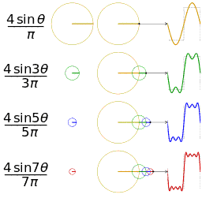
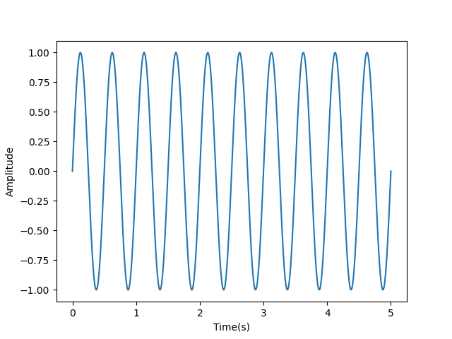
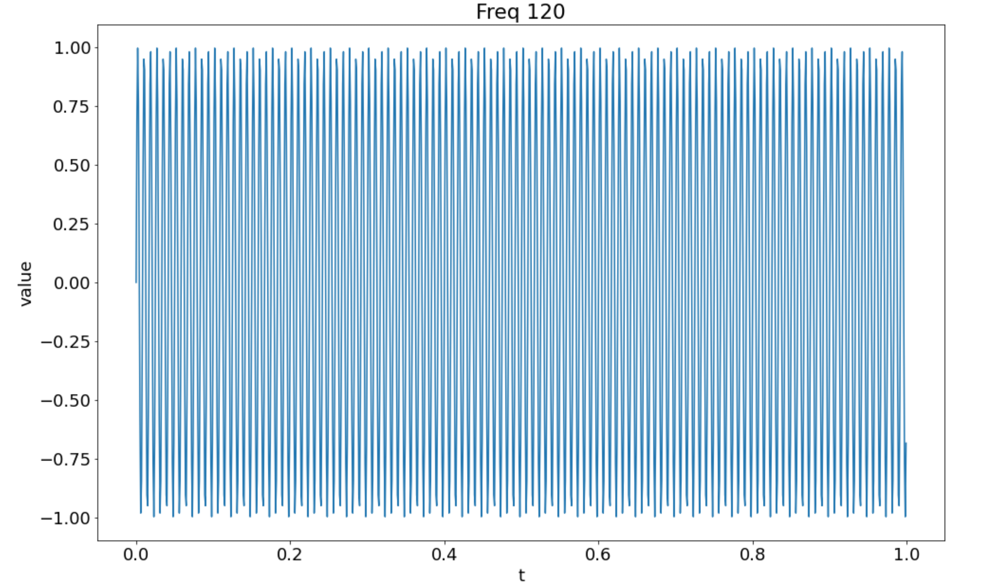
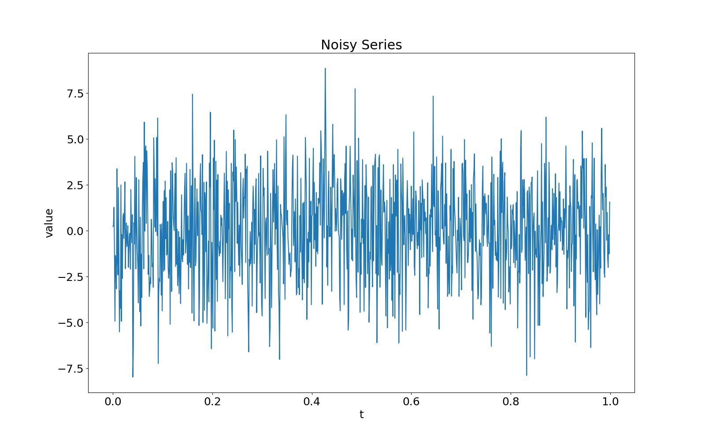
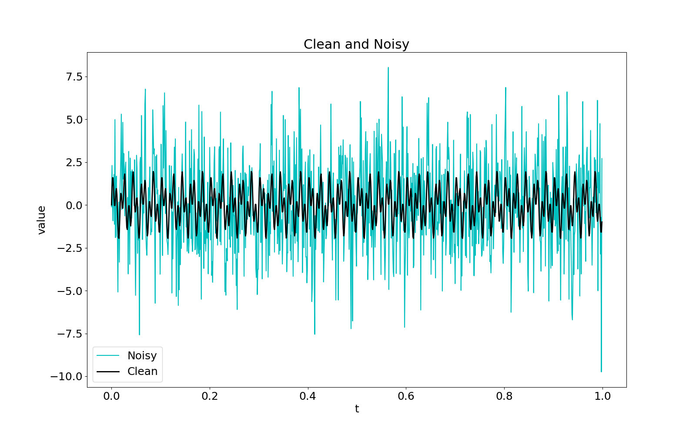
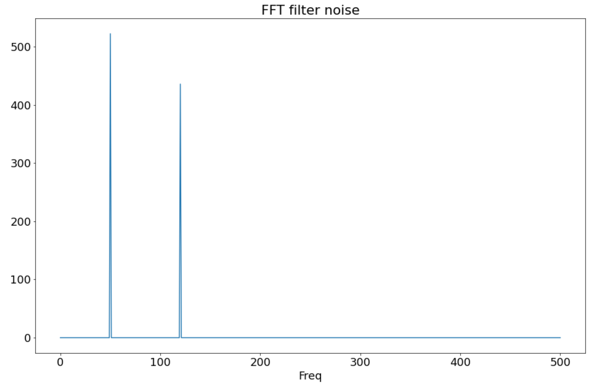

<style>
details {
    border: 1px solid #aaa;
    border-radius: 4px;
    padding: .5em .5em 0;
}
summary {
    font-weight: bold;
    margin: -.5em -.5em 0;
    padding: .5em;
}
details[open] {
    padding: .5em;
}
details[open] summary {
    border-bottom: 1px solid #aaa;
    margin-bottom: .5em;
}
img {
    pointer-events: none;
}
</style>

<details><summary>目录</summary><p>

- [傅里叶分析](#傅里叶分析)
    - [傅里叶变换基本概念](#傅里叶变换基本概念)
    - [为什么需要傅里叶变换](#为什么需要傅里叶变换)
    - [时域与频域](#时域与频域)
    - [傅里叶变换类型](#傅里叶变换类型)
- [傅里叶变换介绍](#傅里叶变换介绍)
    - [维基百科介绍](#维基百科介绍)
    - [图形介绍](#图形介绍)
    - [数学公式介绍](#数学公式介绍)
        - [DFT](#dft)
        - [IDFT](#idft)
- [傅里叶变换应用](#傅里叶变换应用)
    - [消除音频中不需要的噪音](#消除音频中不需要的噪音)
        - [创建信号](#创建信号)
        - [混合音频信号](#混合音频信号)
        - [快速傅里叶变换](#快速傅里叶变换)
        - [过滤信号](#过滤信号)
        - [应用逆 FFT](#应用逆-fft)
    - [数据去噪](#数据去噪)
        - [将干净的数据与噪声混合](#将干净的数据与噪声混合)
        - [从时域到频域的转换](#从时域到频域的转换)
        - [去除噪声频率](#去除噪声频率)
        - [从频域到时域的转换](#从频域到时域的转换)
        - [自定义傅里叶变换函数](#自定义傅里叶变换函数)
    - [周期性检测](#周期性检测)
    - [季节性检测](#季节性检测)
- [傅里叶变换 API](#傅里叶变换-api)
- [参考资料](#参考资料)
</p></details><p></p>

# 傅里叶分析

**傅立叶分析(Fourier Analysis)** 是研究如何将数学函数分解为一系列更简单的三角函数的领域。
**傅立叶变换(Fourier Transfrom)** 是该领域的一种工具，**用于将函数分解为其分量频率**。

## 傅里叶变换基本概念

傅立叶变换是一种工具，可让您获取信号并查看其中每个频率的功率。基本概念包括：

* **信号(signal)** 是随时间变化的信息。例如，音频、视频和电压迹线都是信号的示例。
* **频率(frequency)** 是某事物重复的速度。例如，时钟以一赫兹 (Hz) 的频率走动，或每秒重复一次。
* **功率(power)** 表示每个频率的强度。

下图是一些正弦波的频率和功率的直观演示。可以看到高频正弦波的峰值与低频正弦波的峰值更接近，
只是高频正弦波重复得更频繁。低功率正弦波的峰值比其他两个正弦波更小：


为了使这一点更加具体，想象一下您对某人在钢琴上同时弹奏三个音符的录音使用了傅立叶变换。
生成的频谱(frequency spectrum)将显示三个峰值，每个音符对应一个峰值。


* 如果一个人弹奏的一个音符比其他音符 **更轻**，那么该音符的 **频率强度(frequency power)**（y 轴）就会低于其他两个音符。
* 钢琴上的最高音符比其他两个音符弹得 **更安静**，因此该音符的 **频谱峰值**（y 轴） 较低。

## 为什么需要傅里叶变换

傅立叶变换在许多应用中都很有用。例如，**音乐识别服务** 使用傅里叶变换来识别歌曲。
**JPEG 压缩** 使用傅里叶变换的变体来去除图像的高频分量。
**语音识别** 使用傅里叶变换和相关变换从原始音频中恢复口语单词。

一般来说，如果需要查看信号中的频率，则需要傅立叶变换。
如果在时域处理信号很困难，那么使用傅立叶变换将其移至频域值得尝试。

## 时域与频域

时域和频域指的是看待信号的两种不同方式，信号要么作为其分量频率，要么作为随时间变化的信息。

在时域中，信号是幅度（y 轴）随时间（x 轴）变化的波。例如下图（这是一些音频的图像，它是一个时域信号。
横轴表示时间，纵轴表示振幅。）：


在频域中，信号表示为一系列频率（x 轴），每个频率都有关联的功率（y 轴）。
下图是上面的音频信号经过傅里叶变换后的结果：


这里，之前的音频信号由其组成频率表示。底部的每个频率都有一个相关的功率，产生频谱。

## 傅里叶变换类型

傅里叶变换可以分为不同类型的变换。最基本的分类基于变换所操作的数据类型：连续函数或离散函数，
因此分为 **连续傅里叶变换(CFT)**、**离散傅立叶变换(DFT)**。这里仅讨论处理 **离散傅立叶变换(DFT)**。

在下面会看到术语 DFT 和 FFT 互换使用。然而，它们并不完全相同。
**快速傅里叶变换(FFT)** 是一种用于计算离散傅里叶变换 (DFT) 的算法，
而 DFT 就是变换本身。

> 在 `scipy.fft` 库中看到的另一个区别是不同类型的输入之间的区别。`fft()` 接受复数值输入，
> 而 `rfft()` 接受实数值输入。

另外两种变换与 DFT 密切相关：**离散余弦变换(DCT)** 和 **离散正弦变换(DST)**。

# 傅里叶变换介绍

## 维基百科介绍

傅里叶变换的维基百科介绍

> **傅里叶变换**（法语：Transformation de Fourier、英语：Fourier Transform）是一种线性积分变换，
> 用于信号在[时域](https://zh.wikipedia.org/wiki/時域)(或空域)和[频域](https://zh.wikipedia.org/wiki/频域)之间的变换，
> 在物理学和工程学中有许多应用。因其基本思想首先由法国学者约瑟夫·傅里叶系统地提出，所以以其名字来命名以示纪念。
> 实际上傅里叶变换就像化学分析，确定物质的基本成分；信号来自自然界，也可对其进行分析，确定其基本成分。
>
> * 时域 (time domain)
>       - 描述数学函数或物理信号对时间的关系。例如一个信号的时域波形可以表达信号随着时间的变化
> * 频域 (frequency domain)
>       - 在电子学、控制系统、统计学中是指在对函数或信号进行分析时，分析其和频率有关的部分，而不是和时间有关的部分
> 
> 傅立叶变换的思想是如此的深刻。它提醒我们世界可能不是你所看到的，
> 你的生活可能有一个完全不同的新面貌，只能通过一种变换才能看到，比如傅立叶变换。
> 不仅可以转换声音数据，还可以转换图像，视频，电磁波，甚至股票交易数据(Kondratiev 波)。

<!-- 傅立叶变换也可以用描述运动来解释：

 -->

## 图形介绍

傅里叶变换(Fourier Transform, FT)是一种将 **时域**、 **空域** 数据转化为 **频域** 数据的方法，
**任何波形(时域)都可以看做是不同振幅、不同相位(频域)正弦波的叠加**。
下图很好地说明了傅立叶变换：将一个复杂的波分解成许多规则的正弦波，
解释了将时域波数据转换为频域视图时会发生什么。最前方的图形就是它后面所有正弦波的总和。

动态图：


静态图：


## 数学公式介绍

### DFT

> 正向(离散)傅里叶变换, Forward Discrete Fourier Transform, DFT

将 **时域数据** 变换为 **频域数据** 的公式如下：

`$$X_{k} = \sum_{n=0}^{N-1} x_{n} \cdot e^{\frac{-i 2 \pi k n}{N}}$$`

> `$$X(f) = \int_{-\infty}^{\infty} x(t) \cdot e^{-i 2 \pi ft} dt$$`

其中：

* `$x_{n}$`：原始时域信号数据，表示第 `$n$` 个位置(时间)的时域数据点，
  `$n \in [0, N-1]$`，其中 `$N$` 为数据点个数
* `$k$`：频率序号，范围与 `$n$` 相同，`$k \in [0, N-1]$`，
  因为极端情况下每个数据点代表一个独立的正弦波

计算离散傅里变换：

上面的 DTF 表达式是一个简答的线性运算：矩阵向量乘法：

`$$\vec{X} = M \cdot \vec{x}$$`

其中：`$M_{kn} = e^{\frac{-i 2 \pi k n}{N}}$`。

```python
import numpy as np

def DFT_slow(x):
    """
    Compute the discrete Fourier Transform of the 1D array x
    """
    x = np.asarray(x, dtype = float)
    N = x.shape[0]
    n = np.arange(N)
    k = n.reshape((N, 1))
    M = np.exp(-2j * np.pi * k * n / N)
    
    X = np.dot(M, x)

    return X

x = np.random.random(1024)
np.allclose(DFT_slow(x), np.fft.fft(x))

%timeit DFT_slow(x)
%timeit np.fft.fft(x)
```

```
True
10 loops, best of 3: 75.4 ms per loop
10000 loops, best of 3: 25.5 µs per loop
```

离散傅里叶变换中的对称性：

`$$\begin{align*}
X_{N + k} &=  \sum_{n=0}^{N-1} x_n \cdot e^{-i~2\pi~(N + k)~n~/~N}\\
          &= \sum_{n=0}^{N-1} x_n \cdot e^{- i~2\pi~n} \cdot e^{-i~2\pi~k~n~/~N}\\
          &= \sum_{n=0}^{N-1} x_n \cdot e^{-i~2\pi~k~n~/~N}
\end{align*}$$`

### IDFT

> (离散)傅里叶逆变换, Inverse Discrete Fourier Transform, IDFT

将 **时域数据** 通过傅里叶变换转换为 **频域数据** 后就可以轻松地处理频域中的数据，
例如：去除噪声波。之后，可以使用 **逆方程** 将频域数据转换回时域波：

`$$x_{n} = \frac{1}{N}\sum_{k=0}^{N-1} X_{k} \cdot e^{\frac{i 2 \pi kn}{N}}$$`

`$$x(t) = \int_{-\infty}^{\infty } X(f) \cdot e^{i 2 \pi ft} df$$`

# 傅里叶变换应用

## 消除音频中不需要的噪音

为了了解傅里叶变换以及可以用它做什么，将过滤一些音频。
首先，将创建一个带有高音调嗡嗡声的音频信号，然后使用傅里叶变换消除嗡嗡声。

### 创建信号

正弦波有时被称为 **纯音**，因为它们代表单一频率。
将使用正弦波来生成音频，因为它们将在生成的频谱中形成明显的峰值。

```python
import numpy as np
from matplotlib import pyplot as plt

SAMPLE_RATE = 44100  # Hertz
DURATION = 5  # Seconds

def generate_sine_wave(freq, sample_rate, duration):
    x = np.linspace(0, duration, sample_rate * duration, endpoint=False)
    # 2pi because np.sin takes radians
    y = np.sin((2 * np.pi) * x * freq)

    return x, y


# Generate a 2 hertz sine wave that lasts for 5 seconds
x, y = generate_sine_wave(2, SAMPLE_RATE, DURATION)
plt.plot(x, y)
plt.xlabel("Time(s)")
plt.ylabel("Amplitude")
plt.show()
```

其中：

* `SAMPLE_RATE` 确定信号每秒使用多少个数据点来表示正弦波。因此，如果信号的采样率为 10 Hz，
  并且是 5 秒的正弦波，则它将具有 `10 * 5 = 50` 数据点；
* `DURATION` 是生成样本的长度；
* 然后，定义了一个函数来生成正弦波。
    - 该函数采用频率 `freq`；
    - 函数返回用于绘制波形的 `x` 和 `y` 值；
    - 正弦波的 x 坐标在 `0` 和 `DURATION` 之间均匀分布，
      因此代码使用 NumPy 的 `linspace()` 来生成它们。
      它需要一个起始值、一个结束值和要生成的样本数。
      设置 `endpoint=False` 对于傅里叶变换正常工作很重要，
      因为它假设信号是周期性的；
    - `np.sin()` 计算每个 x 坐标处的正弦函数值。将结果乘以频率，使正弦波以该频率振荡，
      并将乘积乘以 `$2 \pi$`，将输入值转换为弧度。
* 最终生成持续 5 秒的 2 赫兹正弦波



上图中 x 轴表示时间（以秒为单位），由于每一秒时间有两个峰值，因此可以看到正弦波每秒振荡两次。
该正弦波的频率太低而听不见，下面将生成一些较高频率的正弦波，并且将了解如何将它们混合。

### 混合音频信号

混合音频信号仅包含两个步骤：

1. 将信号相加

```python
_, nice_tone = generate_sine_wave(400, SAMPLE_RATE, DURATION)
_, noise_tone = generate_sine_wave(4000, SAMPLE_RATE, DURATION)
noise_tone = noise_tone * 0.3

mixed_tone = nice_tone + noise_tone
```

上面代码中使用高音调作为不需要的噪音，因此将其乘以 0.3 以降低其功率。
然后代码将这些音调添加到一起。

2. 标准化(Normalizing)结果


```python
normalized_tone = np.int16((mixed_tone / mixed_tone.max()) * 32767)

plt.plot(normalized_tone[:1000])
plt.show()
```


根据稍后存储音频的方式，目标格式是一个 16 位整数，范围从 -32768 到 32767。
该信号看起来像失真的正弦波。看到的正弦波是生成的 400 Hz 音调，
失真的是 4000 Hz 音调。如果仔细观察，可以看到失真具有正弦波的形状。

> 要收听音频，需要将其存储为音频播放器可以读取的格式。
> 最简单的方法是使用 SciPy 的 `wavfile.write` 方法将其存储在 WAV 文件中。
> 16 位整数是 WAV 文件的标准数据类型，因此可以将信号标准化为 16 位整数：
> 
> ```python
> from scipy.io.wavfile import write
> 
> # Remember SAMPLE_RATE = 44100 Hz is our playback rate
> write("mysinewave.wav", SAMPLE_RATE, normalized_tone)
> ```
> 
> 此代码将写入运行 Python 脚本的目录中的文件 `mysinewave.wav`。
> 然后，可以使用任何音频播放器甚至 Python 来收听该文件。
> 会听到低音调和高音调，这些是混合的 400 Hz 和 4000 Hz 正弦波。

完成此步骤后，您就准备好了音频样本。下一步是使用傅里叶变换去除高音！

### 快速傅里叶变换

对生成的音频使用 FFT。 FFT 是一种实现傅立叶变换的算法，可以计算时域信号（例如音频）的频谱：

```python
from scipy.fft import fft, fftfreq

# Number of samples in normalized_tone
N = SAMPLE_RATE * DURATION

yf = fft(normalized_tone)
xf = fftfreq(N, 1 / SAMPLE_RATE)

plt.plot(xf, np.abs(yf))
plt.xlabel("Freq")
plt.ylabel("Power")
plt.show()
```

此代码将计算生成的音频的傅里叶变换并绘制它。在分解之前，先看一下它生成的图：


可以看到正频率中的两个峰值以及负频率中这些峰值的镜像。
正频率峰值位于 400 Hz 和 4000 Hz，这对应于输入音频的频率。

傅里叶变换获取了复杂的、不稳定的信号，并将其转换为它所包含的频率。
由于只输入了两个频率，因此只输出了两个频率。负正对称性是将实值输入放入傅立叶变换的副作用。

代码中调用了两个非常重要的函数：

* `fft()` 计算变换本身；
* `fftfreq()` 计算 `fft()` 输出中每个 bin 中心的频率。
  如果没有这个，就无法在频谱上绘制 x 轴。
  bin 是一组已分组的值，就像直方图中一样。

> 这段代码有趣的部分是在绘制 `yf` 之前对其进行的处理。
> 
> 对 `yf` 调用 `np.abs()` 的原因是因为它的值是复数。
> 由于复数有两部分，因此在二维轴上根据频率绘制它们需要计算它们的单个值。
> 这就是 `np.abs()` 的用武之地。它计算复数的 `$\sqrt{a^{2}+b^{2}}$`，
> 这是两个数字在一起的总大小，重要的是单个值。


`fft()` 输出的频谱沿 `y` 轴反射，因此负半部分是正半部分的镜像。
这种对称性是由于向变换输入实数（而不是复数）而引起的。
可以利用这种对称性，只需计算一半即可使傅立叶变换更快。

`scipy.fft` 以 `rfft()` 的形式实现这种速度黑客。`rfft()` 的好处在于它是 `fft()` 的直接替代品。

```python
from scipy.fft import rfft, rfftfreq

# Note the extra 'r' at the front
yf = rfft(normalized_tone)
xf = rfftfreq(N, 1 / SAMPLE_RATE)

plt.plot(xf, np.abs(yf))
plt.show()
```


可以看到上图只是 `fft()` 产生的频谱的正侧。`rfft()` 从不计算频谱的负半部分，
这使得它比使用 `fft()` 更快，使用 `rfft()` 速度最多可以是使用 `fft()` 两倍。

现在您已经有了信号的频谱，您可以继续对其进行滤波。

### 过滤信号

傅立叶变换的一大优点是它是可逆的，因此当将信号变换回时域时，
在频域中对信号所做的任何更改都将适用。将利用这一点来过滤音频并消除高音频率。

`rfft()` 返回的值代表每个频率 bin 的功率。如果将给定 bin 的功率设置为零，
则该 bin 中的频率将不再出现在生成的时域信号中。

使用 `xf` 的长度、最大频率以及频率 bing 均匀分布的事实，可以计算出目标频率的索引：

```python
# The maximum frequency is half the sample rate
points_per_freq = len(xf) / (SAMPLE_RATE / 2)

# Our target frequency is 4000 Hz
target_idx = int(points_per_freq * 4000)
```

然后，可以在目标频率附近的索引处将 `yf` 设置为 `0` 以消除它：

```python
yf[target_idx - 1 : target_idx + 2] = 0

plt.plot(xf, np.abs(yf))
plt.show()
```


由于只有一个峰值，看起来它有效！接下来，将应用傅里叶逆变换返回时域。

### 应用逆 FFT

应用逆 FFT 与应用 FFT 类似：

```python
from scipy.fft import irfft

new_sig = irfft(yf)

plt.plot(new_sig[:1000])
plt.show()
```


> 由于使用的是 `rfft()`，因此需要使用 `irfft()` 来应用逆函数。
> 但是，如果使用了 `fft()`，那么反函数将是 `ifft()`。

正如所看到的，现在有一个以 400 Hz 振荡的正弦波，并且已成功消除了 4000 Hz 噪声。


## 数据去噪

> 参考：[使用傅立叶变换清理时间序列数据噪声](https://cloud.tencent.com/developer/article/1891362)

### 将干净的数据与噪声混合

创建两个正弦波并将它们合并为一个正弦波，然后故意用随机噪声数据污染干净的数据波。
将两个信号组合成第三个信号也称为 **卷积** 或 **信号卷积**。

```python
# python libraries
import numpy as np
import matplotlib.pyplot as plt
plt.rcParams.update({
    "figure.figsize": [16, 10],
    "font.size": 18,
})

# ------------------------------
# data
# ------------------------------
# 时间序列
t = np.arange(start = 0, stop = 1, step = 0.001)

# 正弦波序列
freq_50_series = np.sin(2 * np.pi * 50 * t)
freq_120_series = np.sin(2 * np.pi * 120 * t)
# 正弦波序列组合
f_clean = freq_50_series + freq_120_series
# 噪声数据
noise = 2.5 * np.random.randn(len(t))
# 噪声污染序列
f_noise = f_clean + noise
```

```python
plt.plot(t, freq_50_series)
plt.title("Freq 50")
plt.xlabel("t")
plt.ylabel("value")
plt.show()
```


```python
plt.plot(t, freq_120_series)
plt.title("Freq 120")
plt.xlabel("t")
plt.ylabel("value")
plt.show()
```



```python
plt.plot(t, f_clean, label = "Clean")
plt.title("Clean")
plt.xlabel("t")
plt.ylabel("value")
plt.show()
```


```python
plt.plot(t, noise)
plt.title("Noise")
plt.xlabel("t")
plt.ylabel("value")
plt.show()
```


```python
plt.plot(t, f_noise)
plt.title("Noisy Series")
plt.xlabel("t")
plt.ylabel("value")
plt.show()
```



```python
plt.plot(t, f_noise, c = "c", linewidth = 1.5, label = "Noisy")
plt.plot(t, f_clean, c = "k", linewidth = 2, label = "Clean")
plt.xlabel("t")
plt.ylabel("value")
plt.title("Clean and Noisy")
plt.legend()
plt.show()
```



上图所示为带有带噪音的波浪，黑色是想要的波，绿线是噪音。
如果隐藏图表中的颜色，几乎无法将噪声从干净的数据中分离出来，
但是 傅立叶变换在这里可以提供帮助。需要做的就是将数据转换到另一个角度，
从时间视图(`$x$` 轴是时间)到频率视图(`$x$` 轴将是波频率)。

### 从时域到频域的转换

可以使用 `numpy.fft` 或 `scipy.fft` 进行傅里叶转换，PyTorch 1.8 以后也增加了 `torch.fft`。
`scipy.fft` 非常方便且功能齐全，但是如果想使用其他模块或者根据公式构建自己的一个也是没问题的。

> 使用 `rfft` 而不是 `fft`，`r` 意味着 reduce 只计算正频率，所有负镜像频率将被省略，因为 `rfft` 的速度更快。
> `rfft` 函数的结果 `yf` 是一个复数，形式类似于 `$a+bj$`，`np.abs()` 函数将为复数计算 `$\sqrt{a^{2} + b^{2}}$`。

```python
# python libraries
import numpy as np
import matplotlib.pyplot as plt
plt.rcParams.update({
    "figure.figsize": [16, 10],
    "font.size": 18,
})
from scipy.fft import rfft, rfftfreq
# from numpy.fft import rfft, rfftfreq
# from torch.fft import rfft, rfftfreq

# ------------------------------
# fft transform
# ------------------------------
# 时间序列、长度
data_step = 0.001
t = np.arange(start = 0, stop = 1, step = data_step)
n = len(t)

# 傅里叶变换
yf = rfft(f_noise)
yf_abs = np.abs(yf)  # 原始波
xf = rfftfreq(n, data_step)  # 频率

plt.plot(xf, yf_abs)
plt.xlabel("Freq")
plt.title("FFT")
plt.show()
```


上图为原始波的频域视图，x 轴表示频率。一些在时域看起来很复杂的东西现在被转换成非常简单的频域数据。
**这两个峰代表两个正弦波的频率，一种波是 50Hz，另一种是 120Hz，其他频率就是噪声很容易去除**。

### 去除噪声频率

将频域数据中频率为噪声的数据设置为 0，除了 50Hz 和 120Hz

```python
yf_clean = (yf_abs > 300) * yf
yf_clean_abs = np.abs(yf_clean)

plt.plot(xf, yf_clean_abs)
plt.xlabel("Freq")
plt.title("FFT filter noise")
plt.show()
```



### 从频域到时域的转换

将频域数据转换回时域数据

```python
from scipy.fft import irfft

new_f_clean = irfft(yf_clean)

plt.plot(t, new_f_clean)
plt.title("New Clean")
plt.xlabel("t")
plt.ylabel("value")
plt.ylim(-6, 8)
plt.show()
```


### 自定义傅里叶变换函数

```python
import numpy as np
from scipy.fft import fft

def dft(x):
    x = np.asarray(x, dtype = float)
    N = x.shape[0]
    n = np.arange(N)
    k = np.reshape(N, 1)
    M = np.exp(-2j * np.pi * k * n / N)

    return np.dot(M, x)

x = np.random.random(1024)
np.allclose(dft(x), fft(x))
```

## 周期性检测

对于一条具备周期性的时间序列，它本身就很接近正弦波，所以它的组成里一定包含一个显著的正弦波，
周期就是该正弦波的周期。这个正弦波可以通过傅里叶变换找到，它将时序数据展开成三角函数的线性组合，
得到每个展开项的系数，就是傅里叶系数。
傅里叶系数越大，表明它所对应的正弦波的周期就越有可能是这份数据的周期。

## 季节性检测

* https://anomaly.io/detect-seasonality-using-fourier-transform-r/

# 傅里叶变换 API

* numpy.fft
* scipy.fft
* torch.fft
* [PyFFTW](https://github.com/PyFFTW/PyFFTW)

# 参考资料

* [十分简明易懂的快速傅里叶变换](https://blog.csdn.net/enjoy_pascal/article/details/81478582)
* [Fourier Transforms With scipy.fft: Python Signal Processing](https://realpython.com/python-scipy-fft/)
* [维基百科](https://zh.wikipedia.org/wiki/%E5%82%85%E9%87%8C%E5%8F%B6%E5%8F%98%E6%8D%A2)
* 交互方式
    - [傅里叶变换交互式入门](https://www.jezzamon.com/fourier/zh-cn.html)
    - [An Interactive Introduction to Fourier Transforms](https://github.com/Jezzamonn/fourier)
    - [An Interactive Guide To The Fourier Transform](https://betterexplained.com/articles/an-interactive-guide-to-the-fourier-transform/)
* 其他 
    - [Understanding the FFT Algorithm](http://jakevdp.github.io/blog/2013/08/28/understanding-the-fft/)
    -  [Frequency Domain and Fourier Transforms](https://www.princeton.edu/~cuff/ele201/kulkarni_text/frequency.pdf)
    - [Denoising Data with FFT(Python)](https://www.youtube.com/watch?v=s2K1JfNR7Sc&ab_channel=SteveBrunton)
    - [The FFT Algorithm — Simple Step by Step](https://www.youtube.com/watch?v=htCj9exbGo0&ab_channel=SimonXu)
* [信号频域分析方法的理解](https://zhuanlan.zhihu.com/p/34989414)
