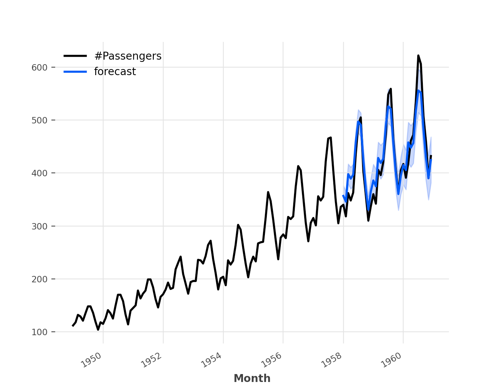

<style>
details {
    border: 1px solid #aaa;
    border-radius: 4px;
    padding: .5em .5em 0;
}
summary {
    font-weight: bold;
    margin: -.5em -.5em 0;
    padding: .5em;
}
details[open] {
    padding: .5em;
}
details[open] summary {
    border-bottom: 1px solid #aaa;
    margin-bottom: .5em;
}
</style>

<details><summary>目录</summary><p>

- [Darts 安装](#darts-安装)
- [快速入门](#快速入门)
</p></details><p></p>

# Darts 安装

```bash
$ pip install darts
```

# 快速入门

```python
# python libraries
import os
import sys
_path = os.path.abspath(os.path.dirname(__file__))
if os.path.join(_path, "..") not in sys.path:
    sys.path.append(os.path.join(_path, ".."))

from utils_data.sample_data.AirPassengers import air_passengers

import matplotlib.pyplot as plt
from darts import TimeSeries
from darts.models import ExponentialSmoothing
from darts.datasets import AirPassengersDataset


# data
series = TimeSeries.from_dataframe(
    air_passengers, 
    "Month", 
    "#Passengers"
)
# series = AirPassengersDataset().load()

# data split
train, val = series[:-36], series[-36:]

# model train
model = ExponentialSmoothing()
model.fit(train)

# model predict
prediction = model.predict(len(val), num_samples = 1000)
print(f"prediction = {prediction}")

# data plot
series.plot()
prediction.plot(
    label = "forecast", 
    low_quantile = 0.05, 
    high_quantile = 0.95
)
plt.legend()
plt.show()
```

```
prediction = <TimeSeries (DataArray) (Month: 36, component: 1, sample: 1000)>
array([[[377.55991095, 361.92076704, 368.5550806 , ..., 358.41241137,
         344.17323775, 353.22602694]],

       [[357.26471154, 357.20372924, 343.79040639, ..., 347.90754735,
         329.42848749, 329.7587304 ]],

       [[387.72459113, 382.71899559, 400.7626274 , ..., 397.15434965,
         378.1515451 , 392.91370992]],

       ...,

       [[440.19776438, 421.43552657, 434.15100355, ..., 438.81088906,
         430.15140209, 411.3172967 ]],

       [[388.17374652, 358.22128285, 394.8366057 , ..., 387.6524671 ,
         402.02459451, 400.56730285]],

       [[447.09195375, 410.87186063, 400.00607393, ..., 413.03568153,
         444.74965309, 422.4323968 ]]])
Coordinates:
  * Month      (Month) datetime64[ns] 1958-01-01 1958-02-01 ... 1960-12-01
  * component  (component) object '#Passengers'
Dimensions without coordinates: sample
Attributes:
    static_covariates:  None
    hierarchy:          None
```

