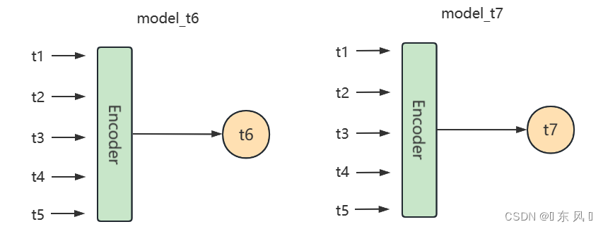

<style>
details {
    border: 1px solid #aaa;
    border-radius: 4px;
    padding: .5em .5em 0;
}
summary {
    font-weight: bold;
    margin: -.5em -.5em 0;
    padding: .5em;
}
details[open] {
    padding: .5em;
}
details[open] summary {
    border-bottom: 1px solid #aaa;
    margin-bottom: .5em;
}
img {
    pointer-events: none;
}
</style>

<details><summary>目录</summary><p>

- [预测模型数据](#预测模型数据)
  - [训练数据](#训练数据)
  - [测试数据](#测试数据)
- [按输入变量](#按输入变量)
  - [单变量预测](#单变量预测)
  - [多变量预测](#多变量预测)
    - [独立多变量预测](#独立多变量预测)
    - [相关多变量预测](#相关多变量预测)
- [按预测步长](#按预测步长)
  - [单步预测](#单步预测)
    - [扩展窗口](#扩展窗口)
    - [滑动窗口](#滑动窗口)
  - [多步预测](#多步预测)
    - [直接多输出预测](#直接多输出预测)
    - [递归多步预测](#递归多步预测)
    - [直接多步预测](#直接多步预测)
    - [直接递归混合预测](#直接递归混合预测)
    - [Seq2Seq 多步预测](#seq2seq-多步预测)
- [按目标个数](#按目标个数)
  - [一元预测](#一元预测)
  - [多元预测](#多元预测)
  - [递归多元预测](#递归多元预测)
  - [多重预测](#多重预测)
- [参考](#参考)
</p></details><p></p>

# 预测模型数据

用机器学习算法构造时间序列预测模型，关键的思路在于，通过时间滑窗，
人为地构造 “未来” Target，来给算法进行学习。

从时间的角度上来看，有历史数据和新数据。但这里，不能简单地把历史数据作为训练集、把新数据作为测试集。


## 训练数据

1. 首先，在历史数据上，通过截取不同时间窗口的数据来构造一组或几组数据
    - 比如，历史数据是 2017 年 1 月到 12 月每家店每天的销售数据，那么可以截取 3 组数据（见上图的深绿、浅绿部分）：
        - 2017 年 1 月到 10 月的数据
        - 2017 年 2 月到 11 月的数据
        - 2017 年 3 月到 12 月的数据
2. 然后，人为地给每组数据划分历史窗口（对应上图的深绿色部分）和未来窗口（对应上图的浅绿色部分）
    - 比如，对于 2017 年 1 月到 10 月的数据，把 1 月到 9 月作为历史窗口，10 月作为未来窗口，以此类推
3. 接着，分别给每组数据构建预测特征，包括历史特征（预测特征 A）和未来特征（预测特征 B）。
   而此时，每组数据还有预测 Target

这个时候，把得到的所有预测特征（例子里是三组预测特征）都合并起来作为训练集特征、
把所有预测 Target（例子里是三组预测 Target）合并起来作为训练集 Target，之后就可以构建机器学习模型了。

## 测试数据

测试集的构建遵循之前的数据处理逻辑，拿历史数据构建历史特征，拿新数据构建未来特征，
然后把这些特征加入到从训练集上训练出的预测模型中去，即可得到任务需要的最终预测值。

这里需要注意，划多少个时间窗口因数据而异。此外，
数据的历史窗口（图上深绿部分）和未来窗口（图上浅绿部分）可以是定长也可以是变长，看具体情况。

# 按输入变量

## 单变量预测

> Univariate Time Series Forecasting, 单变量预测
> 
> 自回归预测

在单变量时间序列预测中，单个时间序列被建模为其滞后的线性或非线性组合，
其中该序列的过去值用于预测其未来。

## 多变量预测

> Multivariate Time Series Forecasting, 多变量预测

多元时间序列，即每个时间有多个观测值：

`$$\{X_{t} = (x_{t}^{a}, x_{t}^{b}, x_{t}^{c}, \ldots)\}_{t}^{T}$$`

这意味着通过不同的测量手段得到了多种观测值，并且希望预测其中的一个或几个值。
例如，可能有两组时间序列观测值 `$\{x_{t-1}^{a}, x_{t-2}^{a}, \ldots\}$`，
`$\{x_{t-1}^{b}, x_{t-2}^{b}, \ldots\}$`，希望分析这组多元时间序列来预测 `$x_{t}^{a}$`。

基于以上场景，许多监督学习的方法可以应用在时间序列的预测中，
在运用机器学习模型时，可以把时间序列模型当成一个回归问题来解决，
比如 SVM、XGBoost、回归树 等。

在多变量预测中，两个或多个时间序列使用单个模型一起建模。多变量预测有两种不同的策略：

* 独立多变量预测
* 相关多变量预测

### 独立多变量预测

> Independent Multi-Series Forecasting


为了预测未来的 `$n$` 步，应该用**递归多步预测策略**：


### 相关多变量预测

> Dependent Multi-Series Forecasting(Multivariate time series)


# 按预测步长

## 单步预测

所谓**单步预测**，就是每一次预测的时候输入窗口只预测未来的一个值。
在时间序列预测中的标准做法是使用滞后的观测值 `$x_{t}$` 作为输入变量来预测当前的时间的观测值 `$x_{t+1}$`。
单步预测的两个策略：扩展窗口、滑动窗口(推荐)。


上图中，左图为扩展窗口，右侧为滑动窗口。

### 扩展窗口

### 滑动窗口

## 多步预测

大多数预测问题都被定义为单步预测，根据最近发生的事件预测系列的下一个值。
**多步预测**需要预测未来多个值，就是利用过去的时间数据来预测未来多个时刻的时序数据。
提前预测多个时刻的数据具有重要的实际优势，多步预测减少了长期的不确定性，
但模型试图预测更远的未来时，模型的误差也会逐渐增加。

对于多步预测常用的解决方案有 5 种：

* 直接多输出预测
* 递归多步预测：单步滚动预测
* 直接多步预测：多模型单步预测
* 直接递归混合预测：多模型滚动预测
* Seq2Seq 多步预测

为了方便讲解不同的多步预测策略，假设原始时间序列数据为 `$\{t1, t2, t3, t4, t5\}$`，
这是已知的数据，需要预测未来两个时刻的状态 `$\{t6, t7\}$`。

### 直接多输出预测

> Direct Multi-Output Forecasting

某些机器学习模型，例如长短期记忆神经网络(LSTM)，可以同时预测一个序列的多个值（一次性预测）。
对于这个策略是比较好理解与实现的，对于机器学习，需要在模型预测时连续预测两个值。
对于深度学习，只不过需要在模型最终的线性层设置为多个输出神经元即可。
正常单输出预测，预测未来一个时刻的模型最终的输出层为 `Linear(hidden_size, 1)`，
对于直接多步预测修改输出层为 `Linear(hidden_size, 2)` 即可，
最后一层的两个神经元分别预测 `$\{t6, t7\}$`。

定义的模型结构状态为：


<!-- `$$\{t1, t2, t3, t4, t5\} \Rightarrow \{t6, t7\}$$`  -->

这种策略的优缺点为：

* 优点就是预测 `$t6$` 和 `$t7$` 是**独立**的，不会造成**误差累积**，
  因为两个预测状态会同时通过线性层进行预测，`$t7$` 的预测状态不会依赖 `$t6$`；
* 缺点也很显然，就是两个状态独立了，但是现实是因为这是时序预测问题，
  `$t7$` 的状态会受到 `$t6$` 的状态所影响。如果分别独立预测，`$t7$` 的预测状态会受影响，
  造成信息的损失。

### 递归多步预测

> Recursive Multi-Step Forecasting

递归多步预测就是利用递归方式预测未来状态。

1. 该策略会训练一个单步输出预测模型；模型依次按照时序递归进行预测；
2. 首先，利用已知时序数据预测出 `$t6$`；
3. 然后，再滑动一个窗口，该窗口最后一个值为 `$t6$`，
4. 利用该窗口数据，去预测 `$t7$`。

定义的模型结构状态为：

<!--  -->


<!-- 
`$$\{t1, t2, t3, t4, t5\} \Rightarrow \{t6\}$$`
`$$\{t2, t3, t4, t5, t6\} \Rightarrow \{t7\}$$` -->

这种实现策略的优缺点为：

* **优点**就是解决了上个策略中 `$t6$` 和 `$t7$` 的独立性，再预测 `$t7$` 的状态时考虑到了 `$t6$` 的状态信息；
* **缺点**
    - 因为是递归预测，会导致误差累积，举个例子，如果模型在预测 `$t6$` 的过程中出现了偏差，
      导致 `$t6$` 的预测结果异常，然后模型会拿着 `$t6$` 的值去预测 `$t7$`，
      这就会导致 `$t7$` 的预测结果进一步产生误差，也就是会**导致误差累积效应**；
    - 还有一个缺点就是该种实现策略利用递归策略，不断滑动窗口拿着刚刚预测出来的值预测下一个值，
      会导致**性能降低**，无法同时预测 `$t6$` 和 `$t7$` 的状态。

### 直接多步预测

> Direct Multi-Step Forecasting

直接多步预测意如其名，就是直接输出未来多个时刻的的状态。
注意一下，不同于直接多输出预测，该策略会同时训练两个模型，其中一个模型用于预测 `$t6$`，
另一个模型用于预测 `$t7$`，也就是要预测未来多少个时刻状态，就需要训练多少个模型。

定义的模型结构状态为：

<!--  -->


<!-- `model_t6`：`$$\{t1, t2, t3, t4, t5\} \Rightarrow \{t6\}$$`
`model_t7`：`$$\{t1, t2, t3, t4, t5\} \Rightarrow \{t7\}$$` -->

这种实现策略的优缺点为：

* 第一个缺点是由于是要多步预测，那么就需要训练对应输出数目的模型，如果要预测未来 10 个时刻的状态，
  那么就需要训练 10 个模型，会导致计算资源消耗严重；
* 第二个缺点就是没有考虑到 `$t6$` 和 `$t7$` 的时序相关性，因为 `$t7$` 的状态会受到 `$t6$` 的状态影响，
  这种实现策略会独立训练两个模型，所以预测 `$t7$` 的模型缺少了 `$t6$` 的信息状态，造成信息损失。

<!-- 
#### 只使用一个模型

举个例子，现有 7 月 10 号到 7 月 14 号的数据，需要预测未来 3 天的销量，那么，就不能用 lag1 和 lag2 作为特征，
但是可以用 lag3，所以就用 lag3 作为特征构建一个模型：


这种是只使用一个模型来预测的，但是呢，缺点是特征居然要构造到 lag3，lag1 和 lag2 的信息完全没用到，
所以就有人提出了一种思路，就是对于每一天都构建一个模型

#### 使用 n 个模型

这个的思路呢，就是想能够尽可能多的用到 lag 的信息，所以，对于每一天都构建一个模型，比如对于 15 号，构建模型 1，
使用了 lag1、lag2 和 lag3 作为特征来训练，然后对于 16 号，因为不能用到 lag1 的信息了，但是 lag2 和 lag3 还是能用到的，
所以就用 lag2 和 lag3 作为特征，再训练一个模型 2，17 号的话，就只有 lag3 能用了，所以就直接用 lag3 作为特征来训练一个模型 3，
然后模型 1、模型 2、模型 3 分别就可以输出每一天的预测值了


这种方法的优势是最大可能的用到了 lag 的信息，但是缺陷也非常明显，就是因为对于每一天都需要构建一个模型的话，
那预测的天数一长，数据一多，那计算量是没法想象的，所以也有人提出了一个这种的方案，就不是对每一天构建一个模型了，
而是每几天构建一个模型

#### 使用 1-n 个模型

还是上面那个例子，这次把数据改变一下，预测四天吧，有 10 号到 14 号的数据，构建了 lag1-5 的特征，
需要预测 16 号到 19 号的数据，那么我们知道 16 号和 17 号是都可以用到 lag2、lag3、lag4 和 lag5 的特征的，
那么为这两天构建一个模型 1，而 18 号和 19 号是只能用到 lag4 和 lag5 的特征的，那么为这两天构建一个模型 2，
所以最后就是模型 1 输出 16 号和 17 号的预测值，模型 2 输出 18 号和 19 号的值


可以发现，这样的话，我们虽然没有尽最大可能的去使用 lag 特征，但是，计算量相比于使用 n 个模型直接小了一半 -->

### 直接递归混合预测

> Direct Recursive Hybrid Forecasting

**直接递归混合预测**融合了**递归多步预测**和**直接多步预测**两种策略。
它会分别训练两个模型，分别用于预测 `$t6$`、`$t7$`，
与直接多步预测不同的是在预测 `$t7$` 时利用到了预测 `$t6$` 模型的输出结果，
即 `$t6$` 的预测结果。

定义的模型结构状态为：


<!-- `model_t6`：`$$\{t1, t2, t3, t4, t5\} \Rightarrow \{t6\}$$`
`model_t7`：`$$\{t2, t3, t4, t5, t6\} \Rightarrow \{t7\}$$` -->

这种策略的优缺点为：

* 这种方式的优点就是解决了直接多步预测的信息独立问题，在预测 `$t7$` 的过程中考虑到了 `$t6$` 的状态；
* 缺点跟直接多步预测策略一样，由于是要多步预测，那么就需要训练对应输出数目的模型，
  如果要预测未来 10 个时刻的状态，那么就需要训练 10 个模型，会导致计算资源消耗严重。

### Seq2Seq 多步预测

> Seq2Seq Multi-Step Forecasting

Seq2Seq 实现策略与**直接多输出预测**一致，不同之处就是这种策略利用到了 Seq2Seq 这种模型结果，
Seq2Seq 实现了序列到序列的预测方案，由于多步预测的预测结果也是多个序列，所以问题可以使用这种模型架构。

定义的模型结构状态为：


<!-- `$$\{t1, t2, t3, t4, t5\} \Rightarrow \{t6, t7\}$$`  -->

对于这种模型架构相对于递归预测效率会高一点，因为可以并行同时预测 `$t6$` 和 `$t7$` 的结果，
而且对于这种模型架构可以使用更多高精度的模型，例如：Bert、Transformer、Attention 等多种模型作为内部的组件。

# 按目标个数

## 一元预测

* TODO

## 多元预测

多元预测(多目标回归)为每一个预测结果构建一个模型，如下是一个使用案例：

```python
from sklearn.multioutput import MultiOutputRegressor

direct = MultiOutputRegressor(LinearRegression())
direct.fit(X_tr, Y_tr)
direct.predict(X_test)
```

scikit-learn 的 `MultiOutputRegressor` 为每个目标变量复制了一个学习算法。
在这种情况下，预测方法是 `LinearRegression`。此种方法避免了递归方式中错误传播，
但多目标预测需要更多的计算资源。此外多目标预测假设每个点是独立的，这是违背了时序数据的特点。

## 递归多元预测

递归多目标回归结合了多目标和递归的思想。为每个点建立一个模型。
但是在每一步的输入数据都会随着前一个模型的预测而增加。

```python
from sklearn.multioutput import RegressorChain

dirrec = RegressorChain(LinearRegression())
dirrec.fit(X_tr, Y_tr)
dirrec.predict(X_test)
```

这种方法在机器学习文献中被称为 chaining。
scikit-learn 通过 `RegressorChain` 类为其提供了一个实现。

## 多重预测

# 参考

* [机器学习多步时间序列预测解决方案](https://aws.amazon.com/cn/blogs/china/machine-learning-multi-step-time-series-prediction-solution/)
* [时间序列多步预测经典方法总结](https://weibaohang.blog.csdn.net/article/details/128754086)
* [时间序列的多步预测方法总结](https://zhuanlan.zhihu.com/p/390093091)
* [skforecast 时序预测库](https://mp.weixin.qq.com/s/61MUqOZvQcNHtFnjyQMaQg)
* [sktime 时序预测库](https://github.com/sktime/sktime)
* [Time Series Forecasting as Supervised Learning](https://machinelearningmastery.com/time-series-forecasting-supervised-learning/)
* [How to Convert a Time Series to a Supervised Learning Problem in Python](https://machinelearningmastery.com/convert-time-series-supervised-learning-problem-python/)
* [How To Resample and Interpolate Your Time Series Data With Python](https://machinelearningmastery.com/resample-interpolate-time-series-data-python/)
* [Multistep Time Series Forecasting with LSTMs in Python](https://machinelearningmastery.com/multi-step-time-series-forecasting-long-short-term-memory-networks-python/)
* [Machine Learning Strategies for Time Series Forecasting](https://link.springer.com/chapter/10.1007%2F978-3-642-36318-4_3)
* [Machine Learning Strategies for Time Series Forecasting. Slide](http://di.ulb.ac.be/map/gbonte/ftp/time_ser.pdf)
* [Machine Learning for Sequential Data: A Review](http://web.engr.oregonstate.edu/~tgd/publications/mlsd-ssspr.pdf)
* [如何用 Python 将时间序列转换为监督学习问题](https://cloud.tencent.com/developer/article/1042809)
* [sktime.RecursiveTimeSeriesRegressionForecaster](https://www.sktime.org/en/stable/api_reference/auto_generated/sktime.forecasting.compose.RecursiveTimeSeriesRegressionForecaster.html)
* [机器学习多步时间序列预测解决方案](https://aws.amazon.com/cn/blogs/china/machine-learning-multi-step-time-series-prediction-solution/)
* [时间序列的多步预测方法总结](https://zhuanlan.zhihu.com/p/390093091)
* [机器学习与时间序列预测](https://www.jianshu.com/p/e81ab6846214)