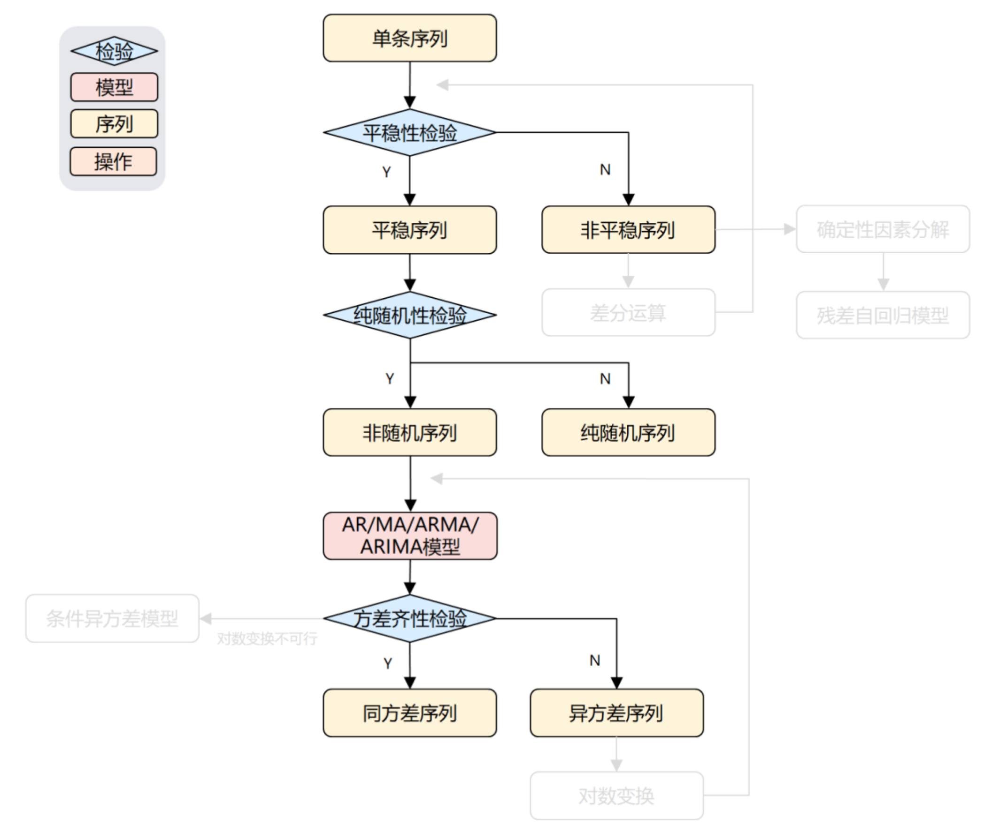
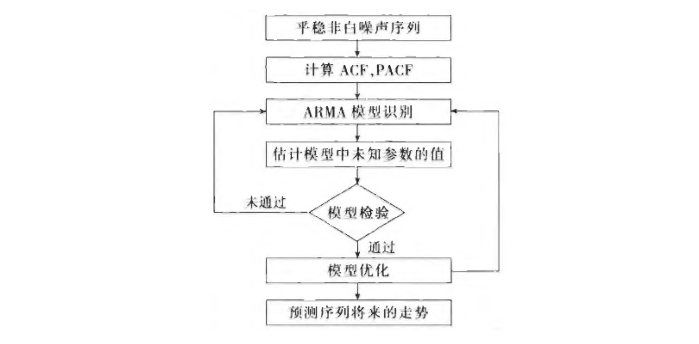
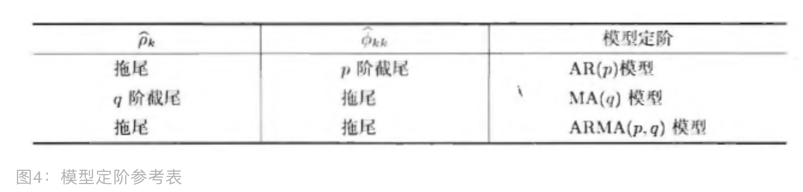
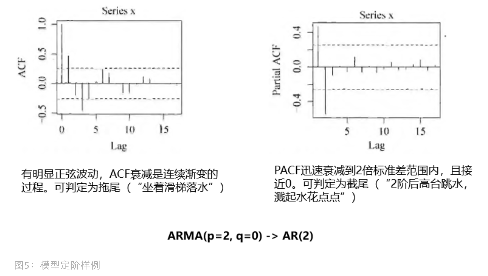

<style>
details {
    border: 1px solid #aaa;
    border-radius: 4px;
    padding: .5em .5em 0;
}
summary {
    font-weight: bold;
    margin: -.5em -.5em 0;
    padding: .5em;
}
details[open] {
    padding: .5em;
}
details[open] summary {
    border-bottom: 1px solid #aaa;
    margin-bottom: .5em;
}
img {
    pointer-events: none;
}
</style>

<details><summary>目录</summary><p>

- [平稳时间序列分析介绍](#平稳时间序列分析介绍)
- [白噪声模型](#白噪声模型)
- [AR 模型](#ar-模型)
- [MA 模型](#ma-模型)
- [ARMA 模型](#arma-模型)
- [ARMA 建模流程](#arma-建模流程)
  - [计算 ACF 和 PACF](#计算-acf-和-pacf)
    - [ACF 和 PACF 计算示例](#acf-和-pacf-计算示例)
    - [ACF 和 PACF 可视化](#acf-和-pacf-可视化)
  - [模型识别](#模型识别)
  - [参数估计](#参数估计)
  - [模型检验](#模型检验)
  - [模型优化](#模型优化)
- [参考](#参考)
</p></details><p></p>

# 平稳时间序列分析介绍

一个时间序列经过预处理被识别为 **平稳非白噪声时间序列**，就说明该序列是一个蕴含相关信息的平稳序列。
在统计上，通常是建立一个线性模型来拟合该序列的发展，借此提取该序列中的有用信息 

ARMA(Auto Regression Moving Average) 模型的全称是 **自回归移动平均模型**， 
它是目前最常用的拟合平稳序列的模型。它又可以细分为 AR 模型、MA 模型、ARMA 模型三类

假设一个时间序列经过预处理被识别为 **平稳非白噪声时间序列**，就可以利用 ARMA 模型对该序列建模。
建模的基本步骤为：



建模步骤详解：

1. 求出该观察序列的样本自相关系数(ACF)和样本偏自相关系数(PACF)的值
2. 根据样本自相关系数(ACF)和偏自相关系数(PACF)的性质，选择阶数适当的 ARMA(`$p$`, `$q$`) 模型进行拟合
3. 估计模型中的位置参数的值
4. 检验模型的有效性
    - 如果拟合模型通不过检验，转向步骤 2，重新选择模型再拟合
5. 模型优化
    - 如果拟合模型通过检验，仍然转向步骤 2，充分考虑各种可能，
      建立多个拟合模型，从所有通过检验的拟合模型中选择最优模型
6. 利用拟合模型，预测序列的将来走势

# 白噪声模型

白噪声序列 `$\varepsilon_{t}$` 是指期望为 0，方差有限，且不存在序列相依性的序列。性质数学表示如下：

* `$E(\varepsilon_{t}) = 0$`
* `$Var(\varepsilon_{t}) = \sigma_{\varepsilon}^{2}$`
* `$E(\varepsilon_{t}\varepsilon_{s}) = 0, s \neq t$`

在实际建模中，往往需要做出更强的白噪声假设，因此还有两种白噪声序列：

* 独立的白噪声是指序列之间彼此独立
* 独立的高斯白噪声是指每一个时刻都服从正态分布的独立的白噪声。高斯白噪声序列其方差为常数，并且围绕均值较快地振荡

在后续的模型构建中，我们会看到这三种白噪声在时间序列分析中的作用

# AR 模型

AR(`$p$`) 模型，称为 `$p$` 阶自回归模型(Autoregression)。
该模型适用于无趋势(trend)和无季节性(seasonal)因素的单变量时间序列。
其数学表达式为：

`$$x_{t}=c + \phi_{1}x_{t-1} + \phi_{2}x_{t-2} + \cdots + \phi_{p}x_{t-p} + \varepsilon_{t}$$`

自回归模型实际上是指由 `$x_{t}$` 的历史观测值和白噪声序列构造出的时间序列。
与传统的回归相似，该模型的解释变量为 `$x_{t}$` 的历史观测值；与传统的回归模型不同的是，
该模型的解释变量为被解释变量自身的滞后观测值，因此得名自回归模型。
自回归模型中一类非常特殊且重要的模型是带漂移项的随机游走(random walk)。
带漂移项的随机游走的模型为 `$x_{t}=\delta + x_{t-1} +\varepsilon$`，其中 `$\delta$` 称为漂移项。
当 `$\delta =0$` 时，该模型简称为随机游走。当 `$x_{0} = 0$` 时，易得 `$x_{t} = \delta t + \sum_{j=1}^{t}\varepsilon_{j}$`。
易知，随机游走序列是非平稳时间序列

AR(`$p$`) 有三个限制条件：

* `$\phi_{p} \neq 0$`，保证模型最高阶数为 `$p$`
* 要求随机干扰序列 `$\varepsilon_{t}$` 是 零均值白噪声序列
    - `$E(\varepsilon_{t}) = 0$`
    - `$Var(\varepsilon_{t}) = \sigma_{\varepsilon}^{2}$`
    - `$E(\varepsilon_{t}\varepsilon_{s}) = 0, s \neq t$`
* 当期的随机干扰 `$\varepsilon_{t}$` 与过去的序列值 `$\forall s < t$` 无关
    - `$E(x_{s}\varepsilon_{t}) = 0, \forall s < t$`

另外，`$c$` 是常数，当 `$c=0$` 时，为中心化的 AR(`$p$`) 模型；当 `$c \neq 0$`时，为非中心化的 AR(`$p$`) 模型，
可以通过以下变换，转化为中心化 AR(`$p$`) 序列

`$$y_{t} = x_{t} - \mu$$`
`$$\mu = \frac{c}{1-\phi_{1} - \phi_{2} - \ldots - \phi_{p}}$$`

`$y_{t}$` 为 `$x_{t}$` 的中心化序列，相当于将非中心化序列上下平移了 `$\mu$`

由于 AR(`$p$`) 模型拟合的是平稳序列，所以拟合后的模型也应该为平稳的，因此在拟合完模型后，
为了保险，会将模型拟合后的结果再做平稳性检验，看拟合模型是否平稳

# MA 模型

MA(`$p$`) 模型，称为 `$q$` 阶移动(滑动)平均(Moving Average, MA)模型。
为残差误差(residual erros)的线性函数，与计算原始时间序列的 **移动平均** 不同，
该模型适用于无趋势(trend)和无季节性(seasonal)因素的单变量时间序列，因为 MA 模型其实是对白噪声序列建模。
其数学表达式为：

`$$x_{t}=\mu + \varepsilon_{t} + \theta_{1}\varepsilon_{t-1} + \theta_{2}\varepsilon_{t-2} + \cdots + \theta_{q}\varepsilon_{t-q}$$`

移动平均模型实际上是指由白噪声序列进行滑动窗口计算平均得到的序列。
例如，若以 `$\varepsilon_{t}$` 表示一个白噪声序列，
则 `$y_{t} = (\varepsilon_{t-2} + \varepsilon_{t -1} + \varepsilon_{t}) / 3$` 即表示一个滑动窗口长度为 3 的简单(等权重)移动平均模型。
不难发现，滑动平均的序列比原来的白噪声序列更加平滑，围绕均值 0 上下相对较慢地振荡。
并且 `$y_{t} = (\varepsilon_{t-2} + \varepsilon_{t-1} + \varepsilon_{t}) / 3$` 和 `$y_{t-1} = (\varepsilon_{t-3} + \varepsilon_{t-2} + \varepsilon_{t-1}) / 3$` 中具有共同的元素 `$\varepsilon_{t-2}$` 和 `$\varepsilon_{t-1}$`，从而使得它们之间具有相依相。对时间序列进行线性组合也常常被称为 **滤波(filtering)**

MA(`$q$`) 有两个限制条件：

* `$\theta_{q} \neq 0$`，保证模型最高阶数为 `$q$`
* 要求随机干扰序列 `$\varepsilon_{t}$` 为零均值白噪声序列
    - `$E(\varepsilon_{t}) = 0$`
    - `$Var(\varepsilon_{t}) = \sigma_{\varepsilon}^{2}$`
    - `$E(\varepsilon_{t}\varepsilon_{s}) = 0, s \neq t$`

另外，`$\mu$` 是常数，当 `$\mu=0$` 时，为中心化的 MA(`$q$`) 模型；当 `$\mu \neq 0$` 时，
为非中心化 MA(`$q$`) 模型，可以通过以下变换，转化为中心化 MA(`$q$`) 序列：

`$$y_{t} = x_{t} - \mu$$`

不同于 AR 模型，MA 模型拟合后会做可逆性检验。因为 MA 模型会出现：一个自相关系数未必唯一对应一个平稳时间序列模型，
因此会考察 MA 模型的可逆性，模型可逆，说明它 ACF 具有唯一性。而不可逆，说明 ACF 不唯一，会导致模型选择变得困难，
比如 MA(3) 和 MA(4) 的 ACF 相同，你选哪个？

误差项是不可观察的，其中的 `$\varepsilon_{t}$` 是由 `$\varepsilon_{0}$` 递推过来的，
而 `$\varepsilon_{0}$` 有专门的获取方法，可以参考[这里](https://stats.stackexchange.com/questions/26024/moving-average-model-error-terms)。
具体介绍如下：


# ARMA 模型

ARMA(`$p$`, `$q$`) 模型，称为自回归移动平均(Auto-Regressive Moving Average)模型，
是时间序列和残差误差的线性函数，是 AR(`$p$`) 和 MA(`$q$`) 模型的组合，
该模型适用于无趋势(trend)和无季节性(seasonal)因素的单变量时间序列。
其数学表达式为：

`$$\left\{
\begin{array}{**lr**}
x_{t}=\phi_{0} + \phi_{1}x_{t-1} + \phi_{2}x_{t-2} + \cdots + \phi_{p}x_{t-p} + \varepsilon_{t} + \theta_{1}\varepsilon_{t-1} + \theta_{2}\varepsilon_{t-2} + \cdots + \theta_{q}\varepsilon_{t-q} & \\
\phi_{p} \neq 0, \theta_{q} \neq 0& \\
E(\varepsilon_{t}) = 0, Var(\varepsilon_{t}) = \sigma_{\varepsilon}^{2}, E(\varepsilon_{t}\varepsilon_{s}) = 0, s \neq t & \\
E(x_{s}\varepsilon_{t}) = 0, \forall s < t & 
\end{array}
\right.$$`

ARMA 模型的另一种形式：

`$$(1-\sum_{i=1}^{p}\phi_{i}B^{i})x_{t} = (1 - \sum_{i=1}^{q}\theta_{i}B^{i})\varepsilon_{t}$$`
`$$\Phi(B)x_{t} = \Theta(B)\varepsilon_{t}$$`

当 `$\phi_{0} = 0$` 时，为中心化模型。当 `$q = 0$` 时，ARMA(`$p$`, `$q$`) 模型就退化成了 AR(`$p$`) 模型；
当 `$p = 0$` 时，ARMA(`$p$`, `$q$`) 模型就退化成了 MA(`$q$`) 模型。
所以 AR(`$p$`) 和 MA(`$q$`) 实际上是 ARMA(`$p$`, `$p$`) 模型的特例，它们统称为 ARMA 模型。
而 ARMA(`$p$`, `$p$`) 模型的统计性质也正是 AR(`$p$`) 模型和 MA(`$p$`) 模型统计性质的有机结合

# ARMA 建模流程

总结来说，AR/MA/ARMA 模型适用于平稳非纯随机序列。它的建模流程如下图所示，其实和上图一样，
只不过下图把流程细化了，尤其是 ”计算ACF、PACF“ 和 ”ARMA模型识别” 这两块是重点



## 计算 ACF 和 PACF

自相关系数(ACF)，考察当前 `$t$` 序列与其延迟 `$k$` 期序列之间的相关性

`$$\hat{p}_{k}=\frac{\sum_{t=1}^{n-k}(x_{t}-\bar{x})(x_{t+k}-\bar{x})}{\sum_{t=1}^{n}(x_{t}-\bar{x})^{2}}, \quad 0<k<n$$`

其中：

* `$t$` 为当前时序数据的时间索引
* `$k$` 为滞后期(lag)
* `$n$` 为原始时间序列长度
* `$\bar{x}$` 为原始时间序列的均值

根据 ACF 求出滞后 `$k$` 自相关系数时，实际上得到并不是 `$x(t)$` 与 `$x(t-k)$` 之间单纯的相关关系。
因为 `$x(t)$` 同时还会受到中间 `$k-1$` 个随机变量 `$x(t-1)$`，`$x(t-2)$`，`$\ldots$`，`$x(t-k+1)$` 的影响，
而这 `$k-1$` 个随机变量又都和 `$x(t-k)$` 具有相关关系，
所以自相关系数里面实际掺杂了其他变量对 `$x(t)$` 与 `$x(t-k)$` 的影响

在剔除了中间 `$k-1$` 个随机变量 `$x(t-1), x(t-2), \ldots, x(t-k+1)$` 的干扰之后，
`$x(t-k)$` 对 `$x(t)$` 影响的相关程度，叫偏自相关系数(PACF)。不同滞后期得到的偏自相关系数，叫偏自相关图

### ACF 和 PACF 计算示例

原序列：

`$$x = [2, 3, 4, 3, 8, 7]$$`

滞后(lag=1)序列：

`$$A = [2, 3, 4, 3, 8]$$`
`$$B = [3, 4, 3, 8, 7]$$`

原序列均值、方差:

`$$\bar{x} = \sum_{i=1}^{6}x_{i} = 4.5$$`
`$$\sigma^{2}(x) = \sum_{i=1}^{6}(x_{i} - \bar{x})(x_{i} - \bar{x}) = 4.916$$`

`$A$` 与 `$B$` 的相关系数:

`$$r(lag = 1) = \frac{1}{5}\sum_{i=1}^{5}(A_{i} - \bar{x})(B_{i} - \bar{x}) = 1.75$$`

自相关系数:

`$$ACF(lag = 1) = \frac{r(lag = 1)}{\sigma^{2}(x)} = \frac{1.75}{4.91666667} = 0.3559322$$`

Python API：

```python
import statsmodels.api as sm

X = [2, 3, 4, 3, 8, 7]

acf_value = sm.tsa.stattools.acf(X, nlags = 1, adjusted = True)
pacf_value = sm.tsa.stattools.pacf(x, nlags = 1)
print(acf_value)
print(pacf_value)

[1, 0.3559322]
[1, 0.3559322]
```

### ACF 和 PACF 可视化

```python
import numpy as np
import pandas as pd
import akshare as ak
from matplotlib import pyplot as plt
from statsmodels.graphics.tsaplots import plot_acf, plot_pacf
np.random.seed(123)

# -------------- 准备数据 --------------
# 白噪声
white_noise = np.random.standard_normal(size = 1000)

# 随机游走
x = np.random.standard_normal(size = 1000)
random_walk = np.cumsum(x)

# GDP
df = ak.macro_china_gdp()
df = df.set_index('季度')
df.index = pd.to_datetime(df.index)
gdp = df['国内生产总值-绝对值'][::-1].astype('float')

# GDP DIFF
gdp_diff = gdp.diff(4).dropna()
# -------------- 绘制图形 --------------
fig, ax = plt.subplots(4, 2)
fig.subplots_adjust(hspace = 0.5)

plot_acf(white_noise, ax = ax[0][0])
ax[0][0].set_title('ACF(white_noise)')
plot_pacf(white_noise, ax = ax[0][1])
ax[0][1].set_title('PACF(white_noise)')

plot_acf(random_walk, ax = ax[1][0])
ax[1][0].set_title('ACF(random_walk)')
plot_pacf(random_walk, ax = ax[1][1])
ax[1][1].set_title('PACF(random_walk)')

plot_acf(gdp, ax = ax[2][0])
ax[2][0].set_title('ACF(gdp)')
plot_pacf(gdp, ax = ax[2][1])
ax[2][1].set_title('PACF(gdp)')

plot_acf(gdp_diff, ax = ax[3][0])
ax[3][0].set_title('ACF(gdp_diff)')
plot_pacf(gdp_diff, ax = ax[3][1])
ax[3][1].set_title('PACF(gdp_diff)')

plt.show()
```


1. 白噪声的自相关系数很快就衰减到 0 附近，是明显的平稳序列
    - 滞后期为 0 时自相关系数(ACF)和偏自相关系数(PACF)其实就是序列自己和自己的相关性，故为 1；
      滞后期为 1 时，自相关系数为 0，表示白噪声无自相关性
2. 随机游走，自相关系数下降非常缓慢，故为非平稳序列；另从偏自相关系数中可以看到随机游走只和前一项有关
3. GDP 数据的自相关图中也可以看到存在一定的周期性，滞后 4、8、12 等自相关系数较大下降较慢，
   差分后下降多一些起到一定效果，认为差分后序列是平稳的。同可视化数据一样，直观判断带有较强主观性，
   但能让我们对数据有更直观的认识

## 模型识别

基于 ACF 和 PACF 图，可以参考下图，进行模型定阶（即确定 `$p$` 和 `$q$` 的取值）。
其中，AR 看 PACF 定 `$p$`，MA 看 ACF 定 `$q$`。拖尾是指趋向于 0，截尾是指为 0，
但实际上并不能出现完美的理论截尾，但可以利用 2 倍标准差范围辅助判断：

* 如果 ACF/PACF 在最初 `$d$` 阶明显超过 2 倍 std，但后面几乎 95% 都落在 2 倍 std 以内，而且衰减的十分突然，可判断为 d 阶截尾
* 如果有超过 5% 的系数落入 2 倍 std 外，或系数衰减缓慢或非常连续，可判断为不截尾



我们看一个例子，会更好帮助理解模型定阶：



## 参数估计

参数估计有以下三种：

* 矩估计：适用于低阶 ARMA 模型，因为计算量少，估计思想简单，且不需要假设总体分布。但估计精度不高
* 极大似然估计：估计精度高，同时具有好的统计性质
* 最小二乘估计：借助迭代法，充分利用序列观察值信息，精度很高

## 模型检验

模型显著性检验分两方面检验：

* 模型显著性检验：检查残差序列是否为白噪声序列，若不是，说明模型不够有效，导致残差序列还残留相关信息。采用白噪声检验方式
* 参数显著性检验：检验每个未知参数是否显著为零，目的是让模型精简。采用假设检验方式

## 模型优化

若同一个序列出现两个拟合模型（例如：AR(2) 和 ARMA(2, 1)）都显著有效，该如何选择？可以基于 AIC 和 BIC(SBC) 信息准则。
信息准则衡量的是模型拟合精度和参数个数，我们希望参数个数小且模型精度好 

`$$AIC=2 ln(模型的极大似然函数) + 2(模型中未知参数个数)$$`

AIC 越小，模型越优秀。但 AIC 有不足，就是 AIC 的拟合误差会受样本容量放大而被影响，样本容量越大，
往往 AIC 选择的模型会含有更多的参数。为此，BIC 加入对未知参数个数的惩罚权重： 

`$$AIC = 2ln(模型的极大似然函数) + ln(x) (模型中未知参数个数)$$`

# 参考

* [时间序列预测](https://mp.weixin.qq.com/s?__biz=Mzg3NDUwNTM3MA==&mid=2247484974&idx=1&sn=d841c644fd9289ad5ec8c52a443463a5&chksm=cecef3dbf9b97acd8a9ededc069851afc00db422cb9be4d155cb2c2a9614b2ee2050dc7ab4d7&scene=21#wechat_redirect)
* [时间序列统计分析](https://mp.weixin.qq.com/s/INZgM6hLSEpboaNhS22CaA)
* [平稳时序分析](https://mp.weixin.qq.com/s?__biz=MzUyNzA1OTcxNg==&mid=2247486537&idx=1&sn=03cc507873683e4ad030b1bec8305c39&chksm=fa041222cd739b34e18c209b91f5c4da9ea9aa4162e46ffdaa5a0e4e18f784ca26b2d3e34092&scene=178&cur_album_id=1577157748566310916#rd)
* [Moving-average model error terms](https://stats.stackexchange.com/questions/26024/moving-average-model-error-terms)
* [ACF 和 PACF](https://mp.weixin.qq.com/s?__biz=MzkxNDE1NjM5MA==&mid=2247484365&idx=1&sn=d4e22bd52ae58c78eb5424f3f4f139f3&chksm=c173fdc4f60474d287e3111f7cadef9fa9211aa3565f1852c6bbd8276f32f226922a3386ee24&scene=178&cur_album_id=2111235593522200577#rd)
* [PACF](https://mp.weixin.qq.com/s?__biz=MzkxNDE1NjM5MA==&mid=2247484417&idx=1&sn=efd49713967931a93568f1a8557672cd&chksm=c173fa08f604731e96ff7ddfc07f622befb1351fdda49b602715dca91c0eddcfd4b2e83655db&cur_album_id=2111235593522200577&scene=189#wechat_redirect)
