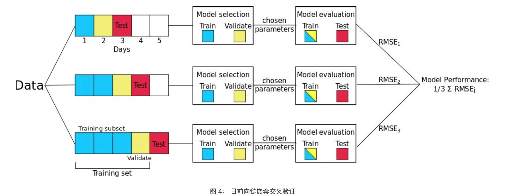
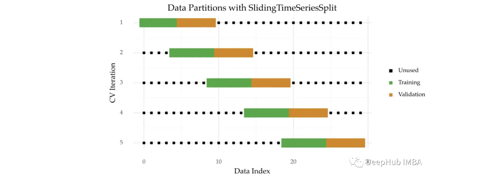
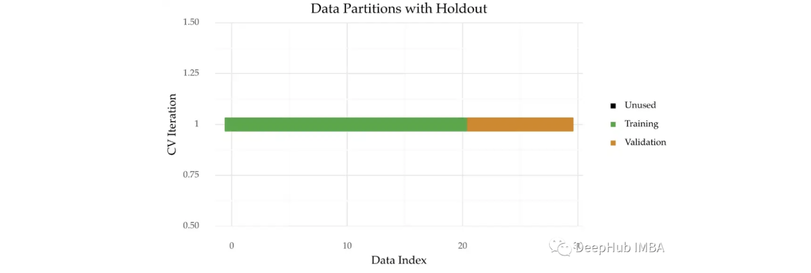

<style>
details {
    border: 1px solid #aaa;
    border-radius: 4px;
    padding: .5em .5em 0;
}
summary {
    font-weight: bold;
    margin: -.5em -.5em 0;
    padding: .5em;
}
details[open] {
    padding: .5em;
}
details[open] summary {
    border-bottom: 1px solid #aaa;
    margin-bottom: .5em;
}
img {
    pointer-events: none;
}
</style>

<details><summary>目录</summary><p>

- [时间序列交叉验证](#时间序列交叉验证)
    - [交叉验证](#交叉验证)
    - [时序不能使用 K-Fold 交叉验证](#时序不能使用-k-fold-交叉验证)
    - [嵌套交叉验证](#嵌套交叉验证)
    - [单时序嵌套交叉验证](#单时序嵌套交叉验证)
        - [预测后一半嵌套交叉验证](#预测后一半嵌套交叉验证)
        - [日间隔前向链接嵌套交叉验证](#日间隔前向链接嵌套交叉验证)
    - [多时序嵌套交叉验证](#多时序嵌套交叉验证)
        - [常规嵌套交叉验证](#常规嵌套交叉验证)
        - [群体知情嵌套交叉验证](#群体知情嵌套交叉验证)
    - [总结](#总结)
- [时间序列交叉验证应用](#时间序列交叉验证应用)
    - [蒙特卡洛交叉验证](#蒙特卡洛交叉验证)
        - [MonteCarloCV 介绍](#montecarlocv-介绍)
        - [MonteCarloCV 实现](#montecarlocv-实现)
        - [MonteCarloCV 使用](#montecarlocv-使用)
    - [Time Series Split](#time-series-split)
        - [扩展窗口时间分割](#扩展窗口时间分割)
        - [带间隙的扩展窗口时间分割](#带间隙的扩展窗口时间分割)
        - [滑动窗口时间分割](#滑动窗口时间分割)
    - [Hold Out 交叉验证](#hold-out-交叉验证)
- [回测预测模型](#回测预测模型)
    - [重新拟合并增加训练规模](#重新拟合并增加训练规模)
    - [重新拟合并固定训练规模](#重新拟合并固定训练规模)
    - [不重新拟合](#不重新拟合)
    - [重新拟合并带有间隙](#重新拟合并带有间隙)
- [参考](#参考)
</p></details><p></p>

# 时间序列交叉验证

评估性能对预测模型的开发至关重要。交叉验证是一种流行的技术，但是在处理时间序列时，
应该确保交叉验证处理了数据的时间依赖性质，要防止数据泄漏和获得可靠的性能估计。
在时序问题上，需要特别注意不能做随机分割，而需要在时间维度上做前后的分割，
以保证与实际预测应用时的情况一致

对于方法的采用建议如下：

* 首选技术是蒙特卡洛交叉验证
* 其次，时间序列分割(及其变体)是一个很好的选择
* 如果时间序列数据较大，通常直接使用 Hold-Out 交叉验证，因为评估过程更快

## 交叉验证

交叉验证（Cross Validation, CV）是一项很流行的技术，用于调节超参数，
是一种具备鲁棒性的模型性能评价技术。两种最常见的交叉验证方式分别是：

1. K-Fold 交叉验证
2. Hold Out 交叉验证


> 图 1：Hold-Out 交叉验证的例子。数据被分为训练集和测试集。然后训练集进一步进行分割：
> 一部分用来调整参数（训练子集），另一部分用来验证模型（验证集）。

由于文献中术语的不同，本文中将明确定义交叉验证步骤：

1. 首先，将数据集分割为两个子集：**训练集**、**测试集**。
   如果有需要被调整的参数，再将训练集分为**训练子集**和**验证集**；
2. 然后，模型在**训练子集**上进行训练，在**验证集**上将误差最小化的参数将最终被选择，得到最优训练模型；
3. 最后，使用所选的最优训练模型在**整个训练集**上进行训练，并且记录测试集上的误差。

## 时序不能使用 K-Fold 交叉验证

为什么时序数据的交叉验证会有所不同？在处理时序数据时，
不应该使用传统的交叉验证方法（如 K-Fold 交叉验证），原因如下：

1. 时序依赖
    - 为了避免**数据泄露**，要特别注意时间序列数据的分割。为了准确地模拟我们现在所处、预测未来的真实预测环境，
      预测者必须保留用于拟合模型的事件之后发生的事件的数据。
    - 对于时间序列数据而言不能使用 k 折交叉验证，而是使用 **Hold-Out 交叉验证**，
      其中一个数据子集（按照时间顺序分割）被保留下来用于验证模型性能。
      例如，图 1 中的测试集数据在时间顺序上是位于训练数据之后的。类似地，验证集也在训练集之后。
2. 任意选择测试集
    - 图 1 中测试集的选择是相当随意的，这种选择也意味着测试集误差是在独立测试集上不太好的误差估计。

## 嵌套交叉验证

为了解决时间序列不能使用传统 K-Fold 交叉验证的问题，
使用一种叫做 **嵌套交叉验证（Nested Cross-Validation）** 的方法。
嵌套交叉验证包含一个用于误差估计的外循环，以及一个用于调参的内循环（如图 2 所示）：

* 内循环所起的作用和之前谈到的一样：训练集被分割成一个训练子集和一个验证集，
  模型在训练子集上训练，然后选择在验证集上能够使误差最小化的参数；
* 外循环将数据集分割成多个不同的训练集和测试集，为了计算模型误差的鲁棒估计，
  对每一次分割的误差求平均值。

嵌套交叉验证过程可以提供一个几近无偏的真实误差估计。


> 图 2： 嵌套交叉验证示例

## 单时序嵌套交叉验证

下面两种嵌套交叉验证的方法，用来来处理仅具有一个时间序列的数据。

### 预测后一半嵌套交叉验证

> Regular Predict Second Half

所谓**预测后一半嵌套交叉验证**就是该方法预测所有数据的后一半，
这是嵌套交叉验证的基本情况，只有一次训练、测试分割。

前一半数据（按照时间分割的）作为训练集，后一半数据成为测试集。
验证集的大小可以根据给定问题的不同而变化（例如图 3 中的例子用一天的数据作为验证集），
但是保证验证集的时间顺序在训练子集后面是非常重要的。


该方法的优缺点为：

* 优势是易于实现
* 缺点是仍然有任意选择测试集的局限性

### 日间隔前向链接嵌套交叉验证

> Regular Day Forward-Chaining

**预测后一半嵌套交叉验证**的一个缺陷是 Hold-Out 测试集的任意选择会导致在独立测试集上预测误差的有偏估计。
为了生成对模型预测误差的更好估计，一个常用的方法就是进行多次训练/测试分割，然后计算这些分割上的误差平均值。

**日间隔前向链接**是一种基于前向链（Forward-Chaining）的方法（在文献中也被称为 rolling-origin evaluation 和 rolling-origin-recalibration evaluation）。
利用这种方法，将每天的数据作为测试集，并将以前的所有数据分配到训练集中。
该方法产生许多不同的训练、测试分割，并且对每个分割上的误差求平均，以计算模型误差的鲁棒估计。



例如，如上图所示，如果数据集有五天，那么将生成三个不同的训练和测试分割。
在本示例中有三次拆分，而不是五次拆分，因为需要确保至少有一天的训练和验证数据可用。
在这个例子中使用日前向链，但是也可以在每个数据点上进行迭代，而不是按天迭代（但这明显意味着更多的拆分）。

## 多时序嵌套交叉验证

### 常规嵌套交叉验证

> Regular Nested Cross-Validation 

常规嵌套交叉验证的训练集、验证集、测试集分割基本思路和之前的描述是一样的。
唯一的变化是现在的分割包含了来自数据集中不同参与者的数据。

如果有两个参与者 A 和 B，那么训练集将包含来自参与者 A 的前半天的数据和来自参与者 B 的前半天的数据。
同样，测试集将包含每个参与者的后半天数据。

### 群体知情嵌套交叉验证

> Population-Informed Predict Second Half

对于群体知情嵌套交叉验证方法而言，我们利用了不同参与者数据之间的独立性。
这使得我们打破严格的时间顺序，至少在个人数据之间（在个人数据内打破严格时序仍然是必要的）。
由于这种独立性，我们可以稍微修改常规嵌套交叉验证算法。
现在，测试集和验证集仅包含来自一个参与者（例如参与者 A）的数据，
并且数据集中所有其他参与者的所有数据都被允许存在于训练集中。


图 5 描述了这种方法是如何适用于群体知情的日前向链嵌套交叉验证的。
该图显示，参与者 A 第 18 天的数据是测试集（红色），之前三天是验证集（黄色），
训练集（绿色）包含参与者 A 的所有先前数据以及其他参与者（本例中为 B、C、D 和 E）的所有数据。
需要强调的一点是，由于其他参与者的时间序列的独立性，使用这些参与者的未来观测不会造成数据泄漏

> Population-Informed Day Forward-Chaining

## 总结

最后，总结了不同嵌套交叉验证方法的优缺点，特别是独立测试集误差估计的计算时间和偏差。
分割的次数假定数据集包含 `$p$` 个参与者，以及每个参与者共有 `$d$` 天的数据。


# 时间序列交叉验证应用

## 蒙特卡洛交叉验证

### MonteCarloCV 介绍

蒙特卡罗交叉验证(MonteCarloCV)是一种可以用于时间序列的方法。
与时间序列分割(Time Series Split)不同，每个迭代中的验证原点是随机选择的，
即在不同的随机起点来获取一个时间周期的数据。像 TimeSeriesSplit 一样，
MonteCarloCV 也保留了观测的时间顺序。它还会保留多次重复估计过程。

经过详细研究 MonteCarloCV，这包括与 TimeSeriesSplit 等其他方法的比较。
MonteCarloCV 可以获得更好的估计。

下图是这种技术的直观图示：


MonteCarloCV 与 TimeSeriesSplit 的区别主要有两个方面：

* 对于训练和验证样本量，使用 TimeSeriesSplit 时训练集的大小会增加。在 MonteCarloCV 中，
  训练集的大小在每次迭代过程中都是固定的，这样可以防止训练规模不能代表整个数据
* 随机的分折，在 MonteCarloCV 中，验证原点是随机选择的。这个原点标志着训练集的结束和验证的开始。
  在 TimeSeriesSplit 的情况下，这个点是确定的。它是根据迭代次数预先定义的

### MonteCarloCV 实现

scikit-learn 不提供 MonteCarloCV 的实现。所以，需要手动实现它：

```python

```

MonteCarloCV 接受四个参数：

* `n_splitting`：分折或迭代的次数。这个值趋向于 10
* `training_size`：每次迭代时训练集的大小与时间序列大小的比值
* `test_size`：类似于 `training_size`，但用于验证集
* `gap`：分离训练集和验证集的观察数。与 TimeSeriesSplits 一样，此参数的值默认为 0(无间隙)

每次迭代的训练和验证大小取决于输入数据。发现一个 0.6/0.1 的分区工作得很好。
也就是说，在每次迭代中，60% 的数据被用于训练，10% 的观察结果用于验证。

### MonteCarloCV 使用

```python

```

该实现也与 scikit-learn 兼容。以下是如何结合 GridSearchCV：

```python

```

## Time Series Split

### 扩展窗口时间分割 

> Time Series Split

对时间序列进行多次拆分是个好主意，这样做可以在时间序列数据的不同部分上测试模型。
在时间序列分割中，时间序列被分成 `$k+1$` 个连续的大小相等的数据块，前 `$k$` 个块为训练数据，
第 `$k+1$` 个块为测试数据。下面是该技术的可视化描述:


使用时间序列分割的主要好处如下:

* 保持了观察的顺序
    - 这个问题在有序数据集(如时间序列)中非常重要
* 生成了很多拆分，几次拆分后可以获得更稳健的评估
    - 如果数据集不大，这一点尤其重要

主要缺点是跨折叠的训练样本量是不一致的：

* 假设将该方法应用于上图所示的 5 次分折。在第一次迭代中，所有可用观测值的 20% 用于训练，
  但是，这个数字在最后一次迭代中是 80%。因此，初始迭代可能不能代表完整的时间序列，这个问题会影响性能估计。
  可以使用蒙特卡洛交叉验证结局这个问题。

时间序列分割就是 scikit-learn 中 `TimeSeriesSplit` 实现。

### 带间隙的扩展窗口时间分割

> Time Series Split with Gap

可以在上述技术中增加训练和验证之间的间隙。这有助于增加两个样本之间的独立性。


使用 `TimeSeriesSplit` 类中的 `gap` 参数引入这个间隙。

### 滑动窗口时间分割

> Sliding Time Series Split 

另一种应用时间序列分割的方法是滑动窗口，即在迭代之后老的数据块被丢弃。
这种方法可能在两种情况下有用：

* 数据量巨大
* 旧的观察已经过时了

这种变体也可以应用于训练样本和验证样本之间的间隙。



## Hold Out 交叉验证

> Hold Out 交叉验证，样本外验证

Hold Out 交叉验证是估计预测效果最简单的方法。工作原理是进行一次分割，
该序列的第一部分数据集用于训练模型，在保留的数据集中进行验证。
一般情况下训练集的大小设置为总数据集的 `$70\%$`。



可以使用 scikit-learn 中的 `train_test_split` 函数应用 Hold Out 验证。

# 回测预测模型

在时间序列预测中，回测是指使用历史数据验证预测模型的过程。该技术涉及逐步向后移动，
以评估如果在该时间段内使用模型进行预测，该模型的表现如何。回溯测试是一种交叉验证形式，
适用于时间序列中的先前时期。

回测的目的是评估模型的准确性和有效性，并确定任何潜在问题或改进领域。通过在历史数据上测试模型，
可以评估它在以前从未见过的数据上的表现如何。这是建模过程中的一个重要步骤，因为它有助于确保模型稳健可靠。

回测可以使用多种技术来完成，例如简单的训练测试拆分或更复杂的方法，如滚动窗口或扩展窗口。
方法的选择取决于分析的具体需要和时间序列数据的特点。

总的来说，回测是时间序列预测模型开发中必不可少的一步。通过在历史数据上严格测试模型，
可以提高其准确性并确保其有效预测时间序列的未来值。


## 重新拟合并增加训练规模

> 扩展窗口
> 
> Backtesting with refit and increasing training size (fixed origin)

在这种方法中，模型在每次做出预测之前都经过训练，并且在训练过程中使用到该点的所有可用数据。
这不同于标准交叉验证，其中数据随机分布在训练集和验证集之间。

这种回测不是随机化数据，而是按顺序增加训练集的大小，同时保持数据的时间顺序。
通过这样做，可以在越来越多的历史数据上测试模型，从而更准确地评估其预测能力。


## 重新拟合并固定训练规模

> 滚动窗口
> 
> Backtesting with refit and fixed training size (rolling origin)

在这种方法中，模型是使用过去观察的固定窗口进行训练的，测试是在滚动的基础上进行的，训练窗口会及时向前移动。
训练窗口的大小保持不变，允许在数据的不同部分测试模型。当可用数据量有限或数据不稳定且模型性能可能随时间变化时，
此技术特别有用。也称为时间序列交叉验证或步进验证。


## 不重新拟合

> Backtesting without refit

没有重新拟合的回测是一种策略，其中模型只训练一次，并且按照数据的时间顺序连续使用而不更新它。
这种方法是有利的，因为它比其他每次都需要重新训练模型的方法快得多。
然而，随着时间的推移，该模型可能会失去其预测能力，因为它没有包含最新的可用信息。


## 重新拟合并带有间隙

> Backtesting including gap

这种方法在训练集和测试集之间引入了时间间隔，复制了无法在训练数据结束后立即进行预测的场景。

例如，考虑预测 D+1 日 24 小时的目标，但需要在 11:00 进行预测以提供足够的灵活性。
D 天 11:00，任务是预测当天的 [12-23] 小时和 D+1 天的 [0-23] 小时。
因此，必须预测未来总共 36 小时，只存储最后 24 小时。


# 参考

* [时间序列分割方法的介绍和对比](https://mp.weixin.qq.com/s/JpZV2E102FU94_aj-b-sOA)
* [时间序列的蒙特卡罗交叉验证](https://mp.weixin.qq.com/s/n4Ghl67_-r_NN29Jd5E5SA)
* [时间序列交叉验证](https://lonepatient.top/2018/06/10/time-series-nested-cross-validation)
* [样本组织](https://mp.weixin.qq.com/s?__biz=Mzk0NDE5Nzg1Ng==&mid=2247492305&idx=1&sn=c4c9783ee3ab85a8f7a813e803f15177&chksm=c32afb5ef45d7248d539aca50cff13a840ff53bb2400166ea146256675b08b93419be3f8fadc&scene=21#wechat_redirect)
* [Cross validation of time series data](https://scikit-learn.org/stable/modules/cross_validation.html)
