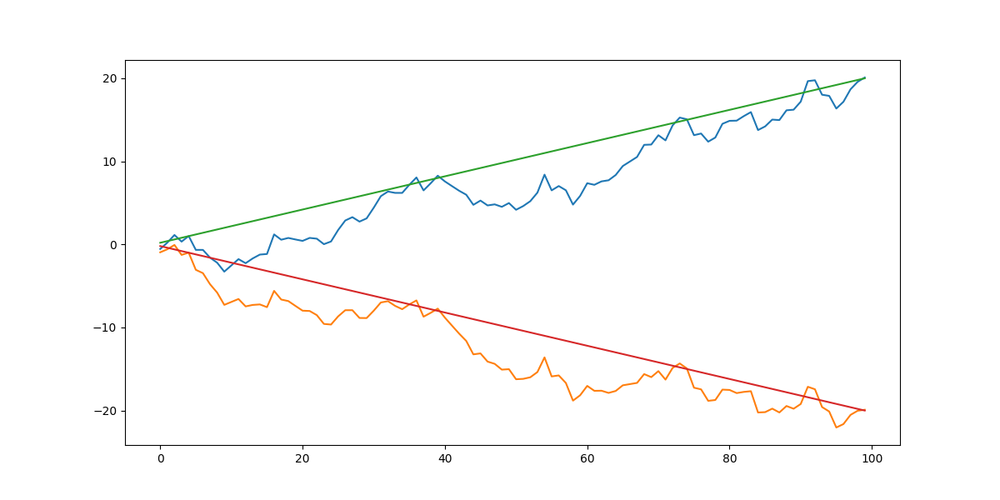
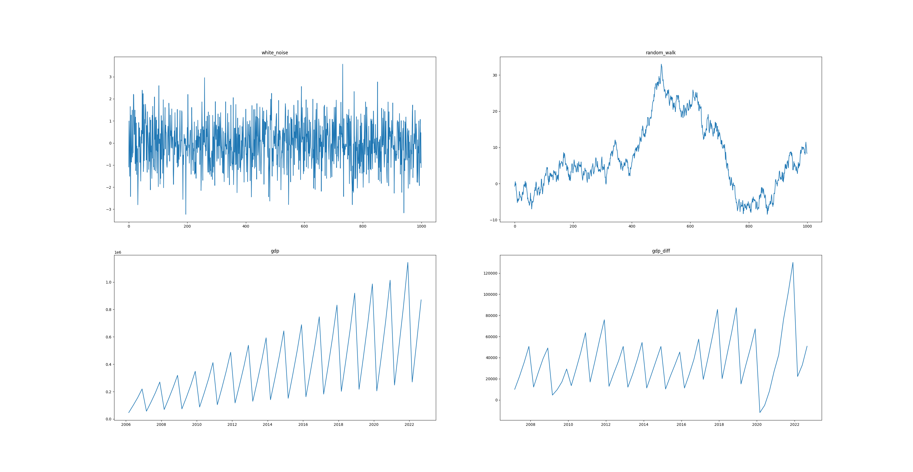
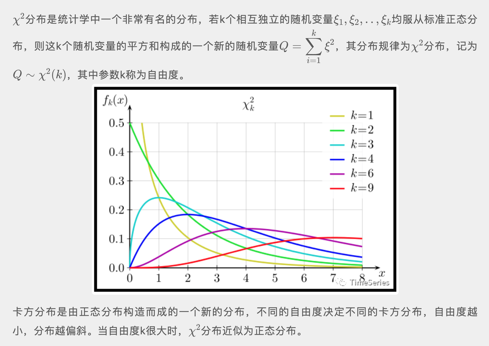

<style>
details {
    border: 1px solid #aaa;
    border-radius: 4px;
    padding: .5em .5em 0;
}
summary {
    font-weight: bold;
    margin: -.5em -.5em 0;
    padding: .5em;
}
details[open] {
    padding: .5em;
}
details[open] summary {
    border-bottom: 1px solid #aaa;
    margin-bottom: .5em;
}
img {
    pointer-events: none;
}
</style>

<details><summary>目录</summary><p>

- [时间序列平稳性](#时间序列平稳性)
  - [平稳性](#平稳性)
    - [严平稳](#严平稳)
    - [宽平稳](#宽平稳)
    - [严平稳与宽平稳的关系](#严平稳与宽平稳的关系)
  - [平稳时间序列](#平稳时间序列)
    - [白噪声](#白噪声)
    - [非白噪声](#非白噪声)
  - [非平稳时间序列](#非平稳时间序列)
    - [股票收盘价](#股票收盘价)
    - [随机游走](#随机游走)
    - [带漂移项的随机游走](#带漂移项的随机游走)
  - [时间序列平稳性理解](#时间序列平稳性理解)
    - [时间序列随机变量的分布](#时间序列随机变量的分布)
    - [严平稳](#严平稳-1)
    - [宽平稳](#宽平稳-1)
- [时间序列平稳性检验](#时间序列平稳性检验)
  - [图检验](#图检验)
    - [可视化数据-时序图检验](#可视化数据-时序图检验)
    - [可视化统计特征-自相关图检验](#可视化统计特征-自相关图检验)
  - [简单统计方法](#简单统计方法)
  - [假设检验方法](#假设检验方法)
- [时间序列纯随机性检验](#时间序列纯随机性检验)
  - [时间序列平稳性转换的目的](#时间序列平稳性转换的目的)
  - [时间序列白噪声检验](#时间序列白噪声检验)
    - [自相关图](#自相关图)
    - [Box-Pierce 检验](#box-pierce-检验)
      - [Barlett 定理](#barlett-定理)
      - [假设条件](#假设条件)
      - [检验统计量](#检验统计量)
      - [判断准则](#判断准则)
      - [示例](#示例)
    - [Ljung-Box 检验](#ljung-box-检验)
      - [假设条件](#假设条件-1)
      - [检验统计量](#检验统计量-1)
      - [判断准则](#判断准则-1)
      - [白噪声检验示例](#白噪声检验示例)
      - [非白噪声检验示例](#非白噪声检验示例)
- [参考](#参考)
</p></details><p></p>

# 时间序列平稳性

时间序列分析中的许多方法，如 ARMA、ARIMA、Granger 因果检验等时序预测和分析方法，
都需要时间序列具备平稳性。那么：

* 什么是时间序列的平稳性呢？
* 什么序列是平稳时间序列？
* 什么序列又是非平稳时间序列？

## 平稳性

时间序列平稳性是指在一组时间序列数据看起来平坦，各阶统计特性（所有统计特征），
如：均值、方差、协方差等不会随着时间时间的推移而发生变化。其数学定义又分为严平稳和宽平稳。
但实际上时序很难达到严平稳（strictly sationary），更可能为宽平稳（weak stationary），
即序列里不同子序列的方差近似相同，是一种近似稳定的状态。

### 严平稳

给定随机过程 `$X(t), t \in T$`，如果对任意 `$n \geq 1$`，
`$t_{1}, t_{2}, \ldots, t_{n} \in T$` 和实数 `$\tau$`，
当 `$t_{1+\tau}, t_{2+\tau}, \ldots, t_{n+\tau}$` 时，
随机变量 `$(X(t_{1}), X(t_{2}), \ldots, X(t_{n}))$` 与 
`$(X(t_{1+\tau}), X(t_{2+\tau}), \ldots, X(t_{n+\tau}))$` 有相同的联合分布函数。
即 

`$$F_{t_{1}, t_{2}, \ldots, t_{n}}(x_{1}, x_{2}, \ldots, x_{m})=F_{t_{1+\tau}, t_{2+\tau}, \ldots, t_{n+\tau}}(x_{1}, x_{2}, \ldots, x_{m})$$`

则称**随机过程 `$X_{t}, t \in T$` 是严平稳过程**。

简单点来说严平稳是一种条件比较苛刻的平稳性定义，
它认为只有当序列所有的统计性质都不会随着时间的推移而发生变化时，
该序列才能被认为平稳。

### 宽平稳

假定某个时间序列是由某一随机过程生成的，如果满足下列条件：

1. 均值 `$E(X_{t}) = \mu$` 是与时间 `$t$` 无关的常数
2. 方差 `$Var(X_{t}) = \sigma^{2}$` 是与时间无关的常数
3. 协方差 `$Cov(X_{t}, X_{t+k}) = \gamma_{k}$` 是只与时间间隔 `$k$` 有关，与时间 `$t$` 无关的常数

则该时间序列是**宽平稳**的，该随机过程是**平稳随机过程**。

平稳性的定义在不同文章中描述略有不同，但它们的意思都是一样的。
比如一些定义中会强调二阶矩存在，而当前的这个定义中没有强调，
原因在于均值、方差为常数既已表示一阶矩、二阶矩存在。

宽平稳序列具有均值、方差、自相关结构不随时间变化的特性。
简单理解就是一个看起来平坦的序列，没有趋势，随时间变化的方差不变，
随时间变化的自相关结构不变，也没有定期波动(季节性)。


### 严平稳与宽平稳的关系

严平稳比宽平稳的要求更严格，但两者并没有包含关系。

* 通常情况下，低阶矩存在的严平稳能推出宽平稳成立，而宽平稳序列不能反推严平稳成立
* 即便严平稳也不一定宽平稳。不存在低阶矩的严平稳序列不满足宽平稳条件，
  例如服从柯西分布的严平稳序列就不是宽平稳序列(柯西分布的一阶矩、二阶矩都不存在)。
* 当序列服从多元正态分布时，宽平稳可以推出严平稳。
  因为正态过程的概率密度是由均值函数和自相关函数完全确定的，
  宽平稳则均值函数和自相关函数不随时间的推移而变化，
  那么正态过程的概率密度函数也就不会随时间的推移而变化，
  所以说一个宽平稳的正态过程必定是严平稳的。


> * 宽平稳，因其定义，又叫二阶平稳，或者协方差平稳
> * 平稳序列，一般是指宽平稳序列，也称弱平稳序列
> * 严平稳序列，也可以叫做强平稳序列

## 平稳时间序列

### 白噪声

一种最简单的平稳时间序列就是白噪声，白噪声时间序列是具有零均值、同方差的独立同分布序列，
记作 `$\{\varepsilon_{t}\}$`。当 `$\varepsilon_{t}$` 服从均值为 0 的正态分布时，
称 `$\{\varepsilon_{t}\}$` 为**高斯白噪声**或**正态白噪声**。

对于任意 `$t \in T$`，`$X_{t}$` 均值相同、方差相同，独立且协方差为 0，所以白噪声序列是平稳的。

```python
import numpy as np
import matplotlib.pyplot as plt

# 白噪声序列
white_noise = np.random.standard_normal(size = 1000)

# plot
plt.figure(figsize = (12, 6))
plt.plot(white_noise)
plt.show()
```


当一个序列为白噪声时，表示序列前后没有任何相关关系。过去的行为对将来的发展没有丝毫影响，
从统计分析的角度而言，已没有任何分析建模的价值。未来的趋势亦无法预测，
因为白噪声的取值是完全随机的。此时未来预测为均值就是残差最小的选择。
**只有当序列平稳且非白噪声时，应用 ARMA 等分析方法才有意义**。

通常在对时间序列建模之后，还会**对残差序列进行白噪声检验**，
如果残差序列是白噪声，那么就说明原序列中所有有价值的信息已经被模型所提取，
如果非白噪声就要检查模型的合理性了。


### 非白噪声

平稳时间序列可不止白噪声，生活中也会有平稳的时间序列，但却是很少。
很多序列是可以经过简单处理后变为平稳的非白噪声序列

```python
# 我国06年以来的季度GDP数据季节差分后，就可以认为是一个平稳的时间序列
import numpy as np
import pandas as pd
import akshare as ak
import matplotlib.pyplot as plt
import matplotlib as mpl

font_name = ["Arial Unicode MS"]
mpl.rcParams["font.sans-serif"] = font_name
mpl.rcParams["axes.unicode_minus"] = False

# data
df = ak.macro_china_gdp()
df = df.set_index("季度")
df.index = pd.to_datetime(df.index)
print(df.head())
print(df.shape)

# 原始数据
gdp = df["国内生产总值-绝对值"][::-1].astype("float")
print(gdp)

# 原始数据差分
gdp_diff = gdp.diff(4)
print(gdp_diff)

# 差分数据（平稳非白噪声序列）可视化
plt.figure(figsize = (12, 6))
gdp_diff.plot()
plt.show()
```


## 非平稳时间序列

大多数时间序列都是非平稳的，一般可以通过差分、取对数等方法转化成平稳时间序列，
若不能转换为平稳序列，就不能使用平稳时间序列分析方法了。
虽说还有各种非平稳时间序列的分析方法，预测好坏看各家本领，
但终归不如平稳时间序列分析来的省心。

### 股票收盘价

比如一些股票的收盘价数据就是非平稳的。下图是 2019～2021 年来伊份的每日收盘价数据，
整体看上去走势无明显规律，且不同时段波动不一，就可以认为是一个非平稳的时间序列。

```python
import pandas as pd
import akshare as ak
from matplotlib.pyplot as plt

# data
df = ak.stock_zh_a_hist(
    symbol = "603777",
    start_date = "20190101",
    end_date = "20210616",
)
df = df.set_index("日期")
df.index = pd.to_datetime(df.index)
close = df["收盘"].astype(float)
close = close[::-1]

# plot
plt.figure(figszie = (12, 6))
plt.plot(close)
plt.show()
```


### 随机游走

有一类特殊的非平稳时间序列叫随机游走，很简单，也很有意思。
一个简单随机游走过程定义为：

`$$y_{t} = y_{t-1} + \epsilon_{t}$$`

其中:

* `$\epsilon_{t}$` 是均值为 0 的白噪声

```python
import numpy as np
import matplotlib.pyplot as plt

y = np.random.standard_normal(size = 1000)
y = np.cumsum(y)

plt.figure(figsize = (12, 6))
plt.plot(y)
plt.show()
```


```python
import numpy as np
import matplotlib.pyplot as plt

np.random.seed(5)

def random_walk():
    steps = np.random.standard_normal(size = 1000)
    steps[0] = 0
    walk = np.cumsum(steps)
    return walk

plt.figure(figsize = (12, 6))
plt.plot(random_walk())
plt.plot(random_walk())
plt.show()
```


金融领域中有个概念叫**有效市场假说**，就认为股票的价格是随机游走的，
也就是说我们刚刚举的那个上证指数的例子就是随机游走的。
以上随机游走的示例图和之前的股价数据走势图比较一下，是不是有点那么个意思。

一个随机游走过程对过去发生的信息具有完美的记忆，如醉汉走路，
每一步都是在上一步的位置上胡乱的走，故而能够积累起点以来的每一步信息。
初起离家，偶有归时，不知所终。均值为零，方差无限大。

生活中还有一个现象和随机游走有关，叫“久赌必输”。每次赌博时输赢总是不确定的(假设胜率50%，胜负五五开)，
每次赌博的输赢作为一个随机变量，可以认为是步长，手里的钱数会随着每次输赢而变化，
故而赌博时手中的钱服从随机游走模型。手中累积的钱数走势就像上图中的曲线，但却不会一直延展下去。
当曲线触碰到下界时(手中的钱输光时)，游戏也就结束了；
或当曲线触碰到上界时(庄家的钱没有了，贪心到赢钱停不下来要一直赢下去)，游戏同样也会结束。
庄家的钱无限多，则必然是赌徒输光。庄家的钱再少，也比赌徒的本金多的多。
所以上界不知在哪，下界却很清晰，曲线游走到上界的概率几乎为零，输光的终归是赌徒，更别提胜率往往不足 50%。

### 带漂移项的随机游走

带漂移的随机游走，就是随机游走中加入一个常数，如此而已：

`$$y_{t} = c + y_{t-1} + \epsilon_{t}$$`

其中：

* `$c$` 是常数，称作位移项或漂移项

漂移项使得随机游走序列产生了长期趋势，长期趋势的斜率对应漂移项，
漂移项为正，则有增长趋势，漂移项为负，则有下降趋势。

```python
import numpy as np
import matploblib.pyplot as plt

np.random.seed(123)

y = np.random.standard_normal(size = 1000)
y1 = np.cumsum(0.2 + y)
y2 = np.cumsum(-0.2 + y)
l1 = np.cumsum(0.2 * np.ones(len(y1)))
l2 = np.cumsum(-0.2 * np.ones(len(y2)))

plt.figure(figsize = (12, 6))
plt.plot(y1)
plt.plot(y2)
plt.plot(l1)
plt.plot(l2)
plt.show()
```



无论是简单随机游走，还是带漂移项的随机游走，
都可以通过差分的方式转换为**纯随机的平稳时间序列**--白噪声。

随机游走的一阶差分即为白噪声：

`$$y_{t} - y_{t-1} = \epsilon_{t}$$`

带漂移项的随机游走一阶差分为白噪声加上常数：

`$$y_{t} - y_{t-1} = c + \epsilon_{t}$$`

所以说**随机游走过程和白噪声一样也是无法预测的**，既然无法根据历史走势预测未来趋势，
那是否能够从其他维度信息中解释历史时序中的取值，从而能够用同样的逻辑预测未来的值，
只有实践才能知道。

## 时间序列平稳性理解

为什么这么多方法都要强调时间序列的平稳性？要求平稳性的最终目标无非就是希望能够更好更准确的预测未来。
非平稳时间序列太过杂乱无章，有的甚至完全无规律可循，而平稳时间序列本身存在某种分布规律，
前后具有一定自相关性且能够延续下去，进而可以利用这些信息帮助预测未来。
那时间序列的平稳性具体又是如何帮助预测未来的，平稳性又如何怎么理解呢？

### 时间序列随机变量的分布

时间序列 `$\{\ldots, X_{1}, X_{2}, \ldots, X_{t}, \ldots\}$` 中每个时刻 `$t$` 都可以认为是一个随机变量，
它们都有自己的分布。时间不能倒流，时刻 `$t$` 的取值也不能进行反复观测，
因而每个随机变量 `$X_{t}$` 就只有一个观测值。这样一来，每个分布也就只有一个观测值，
数目太少，无法研究分布的性质。但是通过平稳性，从不同时刻的分布之间发现内在关联，
可以缓解由于样本容量少导致的估计精度低的问题。

先做一个无理假设，假设时间序列中的每个随机变量的分布相同(随机变量的分布不随时间 `$t$` 的变化而变化)，
那么对于这个分布我也可以说得到了 `$N$` 个观测值。有了多个观测值之后，就可以统计这个分布的特性了。
如此一来 `$X_{N+1}$` 的具体分布也就知道了。

### 严平稳

其实强平稳定义更甚，要求任意连续 `$k, k \in [1, N]$` 个随机变量的联合分布不变，
即联合分布只与随机变量的个数有关，不随时间的推移而变化。序列中每个随机变量的分布相同不一定是严平稳。
但若序列中每个随机变量独立同分布的话，则这个序列一定是严平稳序列，而且还是白噪声

虽然根据历史数据知道了 `$X_{N+1}$` 数据分布情况，其实也就只能知道均值、方差这些个统计特征，
但是具体 `$t_{N+1}$` 时刻的取值还是无法确定

现实中的时间序列数据，我们无法知道这些随机变量的分布到底长什么样子。我们观测得到的数据，
只是服从某种未知分布的随机变量的一种取值。既然连单个随机变量的分布都难以求出，
就更不用说求由一堆随机变量组成的多维随机向量的联合分布有多困难了。
所以说严平稳终归太过于理想化，实际上很难检验一个时间序列的严平稳性

### 宽平稳

那我们就放宽些条件，不在局限于严平稳，着眼于宽平稳：

1. 均值 `$E(X_{t}) = \mu$` 是与时间 `$t$` 无关的常数
2. 方差 `$Var(X_{t}) = \sigma^{2}$` 是与时间无关的常数
3. 协方差 `$Cov(X_{t}, X_{t+k}) = \gamma_{k}$` 是只与时间间隔 `$k$` 有关，与时间 `$t$` 无关的常数


第1)、2)条，均值恒定、方差恒定，还是 `$X_{t}$` 限制变量的分布，围绕某一均值上下波动，且波动幅度前后一致。
到这里，还是可以用均值来预测。第3)条约束协方差，是希望不仅 `$X_{t}$` 的整体分布不随着时间变化，
而且的条件概率分布也不随着时间变化，这样才能用以前的值来预测未来的值

比如：`$X_{t}$` 受前一时刻 `$X_{t-1}$` 的影响，且前后影响程度不随时间变化：

`$$\begin{cases}
Cov(X_{t}, X_{t-1}) = \gamma \\
Cov(X_{t+1}, X_{t}) = \gamma, (\gamma \neq 0)
\end{cases}$$`

对 `$Cov(X_{t+1}, X_{t}) = \gamma, (\gamma \neq 0)$` 变换得到：

`$$\frac{1}{n-1}\sum_{i=1}^{n}(X_{t+1}^{i} - \bar{X}_{t})(X_{t}^{i} - \bar{X_{t}}) = \gamma$$`

`$$\sum_{i=1}^{n}(X_{t+1}^{i} - \bar{X}_{t+1})(X_{t}^{i} - \bar{X}_{t}) = (n-1)\gamma$$`

`$$\sum_{i=1}^{n}(X_{t+1}^{i} - \mu)(X_{t}^{i} - \mu) = (n-1)\gamma$$`

`$$(x_{t+1} - \mu)(x_{t} - \mu) = \gamma$$`

则：

`$$x_{t+1} = \frac{\gamma}{x_{t} - \mu} + \mu$$`

那么将 `$t+1$` 时刻的取值预测为 `$\frac{\gamma}{x_{t} - \mu} + \mu$`，
而非均值 `$\mu$`，就显得更准确一些。但是当协方差为 0 的时候，`$x_{t+1} = \mu$` 就变为了一个白噪声过程。
白噪声过程也是平稳的，但是却不可预测，其均值虽恒定，但具体取值却是完全随机

综上，当时间序列具备了平稳性后(且非白噪声)，预测序列相对容易，预测结果也会相对更可靠一些

# 时间序列平稳性检验

时间序列平稳性检验方法，可分为三类：

* 图检验
    - 时序图检验
    - 自相关图检验
* 简单统计方法
* 假设检验方法
    - 单位根检验

## 图检验

图检验内又分时序图检验和自相关图检验


时序图检验就是直接绘制时序图，观察是否近似平稳，比如上图第一行第 3 张时序图能看出：
气温围绕 37 度上下随机波动，无明显趋势或周期，可以视作平稳序列

而自相关图检验，就是绘制不同延迟期数 k 下的自相关系数变化图，如上图的第二行，由于平稳序列通常具有短期相关性，
所以平移初期（lag 较小时），自相关系数一般为正/负，说明短期 lag 内存在时序内在相关性，
而随着 lag 增加，若 p(ACF) 很快的衰减向0，则说明为平稳序列，因为平稳序列下，平移前后的子序列之间不存在相关性

* 单调性：ACF 衰减到 0 的速度很慢，而且可能一直为正，或一直为负，或先正后负，或先负后正
* 周期性：ACF 呈正弦波动规律
* 平稳性：ACF 衰减到 0 的速度很快，并且十分靠近 0，并控制在 2 倍标准差内

### 可视化数据-时序图检验

图形分析方法是一种最基本、最简单直接的方法，即绘制图形，肉眼判断。
可直接可视化时间序列数据，也可以可视化时间序列的统计特征

可视化数据即绘制时间序列的折线图，以此来判断时间序列是否是平稳的：

* 看曲线是否围绕某一数值上下波动(判断均值是否稳定)
* 看曲线上下波动幅度变化大不大(判断方差是否稳定)
* 看曲线不同时间段波动的频率(紧凑程度)变化大不大(判断协方差是否稳定)

```python
import numpy as np
import pandas as pd
import akshare as ak
from matplotlib import pyplot as plt

np.random.seed(123)

# -------------- 准备数据 --------------
# 白噪声
white_noise = np.random.standard_normal(size=1000)

# 随机游走
x = np.random.standard_normal(size=1000)
random_walk = np.cumsum(x)

# GDP
df = ak.macro_china_gdp()
df = df.set_index('季度')
df.index = pd.to_datetime(df.index)
gdp = df['国内生产总值-绝对值'][::-1].astype('float')

# GDP DIFF
gdp_diff = gdp.diff(4).dropna()

# -------------- 绘制图形 --------------
fig, ax = plt.subplots(2, 2)

ax[0][0].plot(white_noise)
ax[0][0].set_title('white_noise')

ax[0][1].plot(random_walk)
ax[0][1].set_title('random_walk')

ax[1][0].plot(gdp)
ax[1][0].set_title('gdp')

ax[1][1].plot(gdp_diff)
ax[1][1].set_title('gdp_diff')

plt.show()
```



1. 白噪声，曲线围绕 0 值上下波动，波动幅度前后、上下一致，为平稳序列
2. 随机游走，曲线无确定趋势，均值、方差波动较大，非平稳序列
3. GDP 数据趋势上升，均值随时间增加，非平稳序列
4. GDP 季节差分后数据，曲线大致在一条水平线上上下波动，波动幅度前后变化较小，可认为是平稳的

### 可视化统计特征-自相关图检验

可视化统计特征，是指绘制时间序列的自相关图和偏自相关图，根据自相关图的表现来判断序列是否平稳

自相关，也叫做序列相关，是一个信号与自身不同时间点的相关度，或者说与自身的滞后序列的相关性，是滞后期(lag)的函数。
不同滞后期得到的自相关系数，叫自相关图。这里有一个默认假设，即序列是平稳的，平稳序列的自相关性只和滞后期(lag)有关，
不随时间的变化而变化，因而可以称自相关函数是滞后期(lag)的函数

* 平稳序列通常具有短期相关性，对于平稳的时间序列，自相关系数往往会迅速退化到零(滞后期越短相关性越高，滞后期为 0 时，相关性为 1)
* 对于非平稳的数据，退化会发生得更慢，或存在先减后增或者周期性的波动等变动

## 简单统计方法

宽平稳中有两个条件是均值不变和方差不变，可视化数据中我们可以直观看出来，其实还可以具体计算一下看看。
很有意思的逻辑，直接将序列前后拆分成 2 个序列，分别计算这 2 个序列的均值、方差，对比看是否差异明显。
其实很多时序异常检验也是基于这种思想，前后分布一致则无异常，否则存在异常或突变

```python
import numpy as np

np.random.seed(123)

# 白噪声
white_noise = np.random.standard_normal(size = 1000)
# 随机游走
x = np.random.standard_normal(size = 1000)
random_walk = np.cumsum(x)

def describe(X):
    split = int(len(X) / 2)
    X1, X2 = X[0:split], X[split:]
    mean1, mean2 = X1.mean(), X2.mean()
    var1, var2 = X1.var(), X2.var()
    print(f"mean1 = {mean1}, mean2 = {mean2}")
    print(f"variance1 = {var1}, variance2 = {var2}")

print("White noise sample:")
describe(white_noise)

print("Random walk sample:")
describe(random_walk)
```

```
white noise sample:
mean1=-0.038644, mean2=-0.040484
variance1=1.006416, variance2=0.996734

random walk sample:
mean1=5.506570, mean2=8.490356
variance1=53.911003, variance2=126.866920
```

白噪声序列均值和方差略有不同，但大致在同一水平线上；随机游走序列的均值和方差差异就比较大，因此为非平稳序列

## 假设检验方法

平稳性的假设检验方法当前主流为单位根检验，检验序列中是否存在单位根，若存在，则为非平稳序列，不存在则为平稳序列

单位根（unit root）检验是一种统计检验的方法，检验差分方程的特征方程（characteristic equation）的各个特征根（characteristic root）是否小于 1，
即是否在单位圆（unit circle）内。其中，DF 检验是 ADF 检验在自相关为 1 的一个特例，前者适用于 AR(1)，后者适用于 AR(p)

* Augmented DIckey Fuller Test(ADF test)
    - `$p>0$`, 过程不是平稳的
    - `$p=0$`, 过程是平稳的
* DF test
* Kwiatkowski-Phillips-Schmidt-Shin Test(KPSS test)

TODO：https://www.zhihu.com/question/22385598/answer/21221607

# 时间序列纯随机性检验

## 时间序列平稳性转换的目的

时间序列的平稳性检验完成之后，应该做什么呢？

* 若时间序列非平稳，使用差分等方法将序列平稳化，平稳化后再来检验是否为白噪声
    * 非白噪声，使用各种简单又不失准确的平稳时间序列预测模型进行预测
    * 白噪声，序列是完全随机的，过去的行为对未来的发展没有丝毫影响，故而没有必要再深入分析了 
* 若时间序列平稳，检验序列是否是白噪声
    * 非白噪声，使用各种简单又不失准确的平稳时间序列预测模型进行预测
    * 白噪声，序列是完全随机的，过去的行为对未来的发展没有丝毫影响，故而没有必要再深入分析了

当序列平稳非白噪声时，使用 ARMA 等方法进行预测过程中，如何判断模型拟合的是否足够好，
是否还存在有价值的信息待提取，一种判断方法就是看拟合后的残差是否为白噪声：

* 残差为白噪声，说明模型拟合的很好，残差部分为无法捕捉的纯随机数据
* 残差非白噪声，说明模型哪里出了问题，比如参数没调好，需要继续优化；
  若如何优化模型也无法使得残差为白噪声，换模型，或者对残差进行二次预测

## 时间序列白噪声检验

如果时间序列为白噪声，需要满足以下三个条件：

1. `$E(\epsilon_{t}) = \mu$`
2. `$Var(\epsilon_{t}) = \sigma^{2}$`
3. `$Cov(\epsilon_{t}, \epsilon_{s}) = 0, t \neq s$`

另一种常见的白噪声定义方式为：

* 一个具有零均值同方差的独立同分布的序列为白噪声

白噪声检验，也称纯随机性检验。若序列为纯随机性序列，说明该序列过去的行为对将来的发展没有影响，
没有任何分析价值。白噪声的检验常用有以下三种方法：

* 自相关图检验
* Box-Pierce 检验
* Ljung-Box 检验

### 自相关图

白噪声完全无自相关性，除 0 阶自相关系数为 1 外，理想情况下 `$\forall k(k > 0)$`，
延迟 `$k$` 阶的样本自相关系数均为 0.实际上由于样本序列的有限性，延迟 `$k$` 阶自相关系数并不完全为 0，
只要在 0 值附近即认为无自相关性

```python
import numpy as np
import matplotlib.pyplot as plt
from statsmodels.graphics.tsaplots import plot_acf, plot_pacf

# 白噪声
white_noise = np.random.standard_normal(size = 1000)

# 绘制白噪声序列图及其 ACF 图和 PACF 图
fig = plt.figure(figsize = (20, 10))
ax1 = fig.add_subplot(211)
ax2 = fig.add_subplot(223)
ax3 = fig.add_subplot(224)
# 白噪声序列图
ax1.plot(white_noise)
ax1.set_title("white noise")
# 白噪声序列 ACF 图
plot_acf(white_noise, ax = ax2)
# 白噪声序列 PACF 图
plot_pacf(white_noise, ax = ax3)
plt.show()
```


自相关图和偏自相关图中浅蓝色条形的边界为，T 为序列的长度。
由于随机扰动的存在，自相关系数并不严格等于 0，期望在 95% 的置信度下，相关系数均在之间。
如果一个序列中有较多自相关系数的值在边界之外，那么该序列很可能不是白噪声序列。
上图中自相关系数均在边界之内，为白噪声序列

### Box-Pierce 检验

#### Barlett 定理

Barlett 证明，如果一个时间序列是纯随机的，得到一个观察期数为 `$n$` 的观察序列，
那么该序列的延迟非零期的样本自相关系数将近似服从均值为零、方差为序列观察期倒数的正态分布，即：

`$$\hat{p}_{k} \thicksim N(0, \frac{1}{n}), \forall k \neq 0$$`

其中：

* `$n$` 为序列的观察期数
* `$\hat{p}_{k}$` 为延迟 `$k$` 阶样本自相关系数的估计值

根据 Barlett 定理，样本自相关系数近似服从正态分布，那么是否可以简单根据 `$3\sigma$` 原则，
当存在自相关系数在 `$(\mu - 3\sigma, \mu + 3\sigma)$` 区间之外，即取值落在了小概率区间内(`$0.26%$`)，
认为存在自相关性

这种方法和看自相关图方法一致，看的是特定延迟期是否存在自相关性。
是否可以联合多个自相关系数构造检验统计量的方式来检验序列的纯随机性

1970年，博克斯(Box)和皮尔斯(Pierce)推导出了 Q 统计量，
用来检测一个时间序列数据所有k阶自相关系数是否联合为零

> 样本自相关函数(ACF)和偏自相关函数(PACF)是评估时间序列数据中是否存在特定延迟期相关性的一种有效的定性分析工具，
  使用假设检验方法可以用更加量化方式联合检验多个延迟期的自相关性，进而判断序列总体的相关性或者说随机性是否存在

#### 假设条件

* `$H_{0}: \rho_{1} = \rho_{2} = \ldots = \rho_{m} = 0$`: 滞后 `$m$` 阶序列值之间相互独立，序列为独立同分布的白噪声
* `$H_{1}: \exists \rho_{k} \neq 0, 1 \leq k \leq m$`: 滞后 `$m$` 阶序列值之间有相关性，序列为非独立同分布的白噪声

其中：

* `$\rho_{k}$` 为延迟 `$k$` 阶的自相关系数
* `$m$` 为最大延迟阶数

#### 检验统计量

`$$Q_{bp} = n \sum_{k=1}^{m}\hat{\rho}_{k}^{2}$$`

其中

* `$n$` 为序列观察期数
* `$m$` 为指定的最大延迟阶数
* `$\hat{\rho_{k}}$` 为延迟 `$k$` 阶自相关系数的估计值

> 根据 Barlett 定理，`$\hat{\rho}_{k}$` 服从标准正态分布，可推导出 Q 统计量近似服从自由度为 `$m$` 的卡方分布：
> 
> `$$Q_{bp} = n \sum_{k=1}^{m}\hat{\rho}_{k}^{2} \thicksim \chi^{2}(m)$$`
> 
> 所以这种检验白噪声的方式即为白噪声的 `$\chi^{2}$` 检验


#### 判断准则

* Q 统计量小于选定置信水平下的临界值，或者 p 值大于显著性水平(如0.05)，不能拒绝原假设，可认为序列为白噪声序列
* Q 统计量大于选定置信水平下的临界值，或者 p 值小于显著性水平(如0.05)，拒绝原假设，认为至少存在某一阶数的自相关，序列非白噪声



> 说明：卡方分布的自由度很重要，不同的自由度决定不同的卡方分布。
> 而 Q 统计量中的 m(最大延迟阶数)又是手动指定，所以不同的 m 对应不同分布。
> 可以手动指定 m 为 6、12、24，以包含数据完整的周期，也有一些根据公式计算如。
> 其实 m 的设置也无必要太大，一些包的默认最大值为 40。检验，检验的是前若干项系数是否均为零，
> 而不是检验所有项的自相关系数。因为平稳时间序列数据具有短期相关性，
> 短期不相关长期更不相关，故不需要计算所有自相关系数

#### 示例

```python
# 可以使用statsmodels的acorr_ljungbox函数进行检验，指定boxpierce为True
'''
acorr_ljungbox(x, lags=None, boxpierce=False, model_df=0, period=None,return_df=None, auto_lag=False)
x: 观测序列
lags为延迟阶数，整数/列表，如果是一个整数，返回延迟1阶～延迟该指定整数阶的检验结果；如果是一个列表，仅返回列表中指定的延迟阶数的检验结果；如果为None，默认值为min((nobs // 2 - 2), 40)，nobs就是观测序列中样本个数。
boxpierce: 布尔类型，如果为True，不仅返回QLB统计量检验结果还返回QBP统计量检验结果；默认为False，仅返回QLB统计量检验结果。
model_df: degreee if freedib，即模型的自由度，默认值为0，一般检验单个序列默认值即可；当检验模型拟合后的残差序列时，
残差序列中观测值的个数不能表示自由度(个人理解就是里面随机变量的个数，比如方差中无偏估计的因为已知均值，结合前n-1项就能算出第n项，故自由度为样本个数减1)
如ARMA拟合后的残差检验时模型自由度为p+q，计算完Q统计量查找P值时，卡方分布的自由度应为lags-p-q，此时指定model_df=p+q。
period: 季节性序列周期大小，帮助确定最大延迟阶数
return_df: 是否以DataFrame格式返回结果，默认False以元组方式返回结果
auto_lag: 根据自相关性自动计算最佳最大延迟阶数，指定时报错了，pass

返回值：
lbvalue: QLB检验统计量(Ljung-Box检验)
pvalue: QLB检验统计量下对应的P值(Ljung-Box检验)
bpvalue: QBP检验统计量，boxpierce为False时不反回(Box-Pierce检验)
bppvalue: QBP检验统计量下对应的P值，boxpierce为False时不反回(Box-Pierce检验)
'''

import numpy as np
import matplotlib.pyplot as plt
from statsmodels.stats.diagnostic import acorr_ljungbox
# 随机种子
np.random.seed(123)
# 生成白噪声序列
white_noise=np.random.standard_normal(size=1000)
# 白噪声检验，想要查看QBP检验统计量的结果需要指定boxpierce参数为True
# 不指定boxpierce参数，默认返回QLB检验统计量的结果
res = acorr_ljungbox(white_noise, lags=24, boxpierce=True, return_df=True)
print(res)

# 根据检验统计量值查表
# from scipy import stats
# print(stats.chi2.sf(18.891607, 20))
```

> 我们这里只看 `$Q_{BP}$` 检验统计量下检验效果，即最后两列。可以可看到，各延迟阶数下的 p 值均大于 0.05，不能拒绝原假设，序列为白噪声

### Ljung-Box 检验

实际应用中人们发现 Q 统计量在大样本场合(n 很大的场合)检验效果很好(传统检验方法中样本量大于 30 即认为大样本量，
Joel 等人指出当样本量在 500 这个量级时 Q 统计量检验效果较好)，但是在小样本场合不太精确。
为了弥补这一缺陷，Box 和 Ljung 于 1979 年对其进行了改进，推导出 LB(Ljung-Box)统计量

#### 假设条件

* `$H_{0}: \rho_{1} = \rho_{2} = \ldots = \rho_{m} = 0$`: 滞后 `$m$` 阶序列值之间相互独立，序列为独立同分布的白噪声
* `$H_{1}: \exists \rho_{k} \neq 0, 1 \leq k \leq m$`: 滞后 `$m$` 阶序列值之间有相关性，序列为非独立同分布的白噪声

其中：

* `$\rho_{k}$` 为延迟 `$k$` 阶的自相关系数
* `$m$` 为最大延迟阶数

#### 检验统计量

`$$Q_{LB} = n(n+2)\sum_{k=1}^{m}\frac{\rho_{k}^{2}}{n-k}$$`

其中：

* `$n$` 为序列的观察期数
* `$m$` 为指定的最大延迟阶数

LB 统计量同样近似服从自由度为 `$m$` 的 `$\chi^{2}$` 分布。
由于 LB 统计量就是 Box 和 Pierce 的 Q 统计量的修正，所以人们习惯把它们统称为 Q 统计量

#### 判断准则

* LB 统计量小于选定置信水平下的临界值，或者 p 值大于显著性水平(如 0.05)，不能拒绝原假设，序列为白噪声
* LB 统计量大于选定置信水平下的临界值，或者 p 值小于显著性水平(如 0.05)，拒绝原假设，序列非白噪声

#### 白噪声检验示例

```python
import numpy as np
import matplotlib.pyplot as plt
from statsmodels.stats.diagnostic import acorr_ljungbox

# 白噪声序列
np.random.seed(123)
white_noise = np.random.standard_normal(size = 100)

# 不再指定boxpierce参数，近返回QLB统计量检验结果
# 同时设置lags参数为一个列表，相应只返回对应延迟阶数的检验结果
res = acorr_ljungbox(white_noise, lags = [6, 12, 24], return_df = True)
print(res)
```

延迟 6 阶、12 阶时 p 值较大，增加到延迟 24 阶时，p 值略小但也大于 0.05，
所以在 95% 的置信水平下认为序列为白噪声。(但若延迟 24 阶时，p 值小于 0.05，则认为序列为非白噪声)

```python
import numpy as np
import pandas as pd
import statsmodels as sm

# 白噪声序列
np.random.seed(123)
white_noise = np.random.standard_normal(size = 100)

# 计算自相关系数时指定 qstat 为 True，表示返回结果中除返回自相关系数外，
# 另返回自相关系数的独立性检验结果 Q(QLB)统计量及对应 P 值
r, q, p = sm.tsa.stattools.acf(white_noise, nlags = 12, qstat = True)
df = pd.DataFrame(
    zip(range(1, 41), q, p),
    columns = ["lag", "lb_stat", "lb_pvalue"],
)
print(df)
```


#### 非白噪声检验示例

```python
import matplotlib.pyplot as plt
import statsmodels.api as sm

data = sm.datasets.sunspots.load_pandas().data
data = data.set_index("YEAR")

res = acorr_ljungbox(
    data.SUNACTIVITY, 
    lags = [6, 12, 24], 
    boxpierce = True,
    return_df = True,
)
print(res)

data.plot(figsize = (12, 4))
plt.show()
```

# 参考

* [时间序列的平稳性检验方法汇总](https://mp.weixin.qq.com/s?__biz=MzkxNDE1NjM5MA==&mid=2247484151&idx=1&sn=32b42c2c03f168e0ffa53b1a10f9fe3f&chksm=c173fcfef60475e84cacd5303ce60ae652b029a2475bde6dbfbd89ff175acf6c788e710868ac&cur_album_id=2111235593522200577&scene=189#wechat_redirect)
* [时间序列白噪声检验](https://mp.weixin.qq.com/s?__biz=MzkxNDE1NjM5MA==&mid=2247484287&idx=1&sn=be786628cc58bbbbd5a267497eac246d&chksm=c173fd76f6047460cf693916bc9ceda10ebb325378a496a4067ad0a1ba66f71e66f267639a46&cur_album_id=2111235593522200577&scene=189#wechat_redirect)
