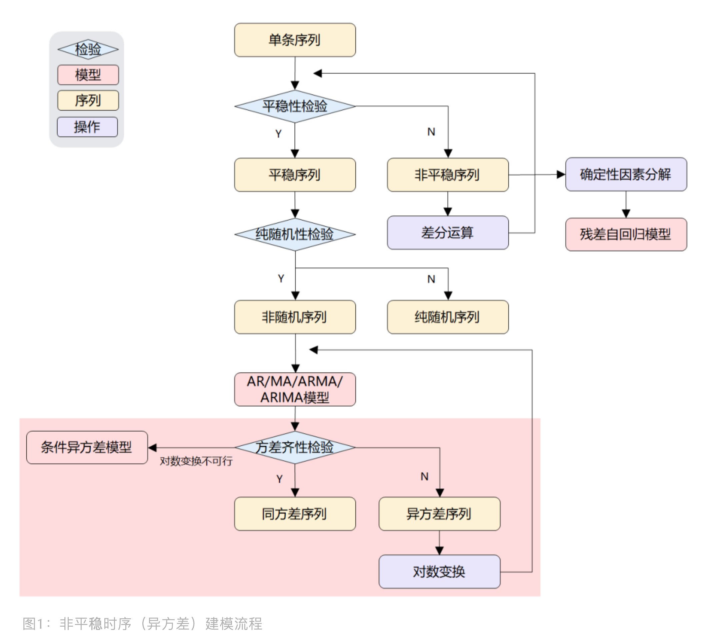
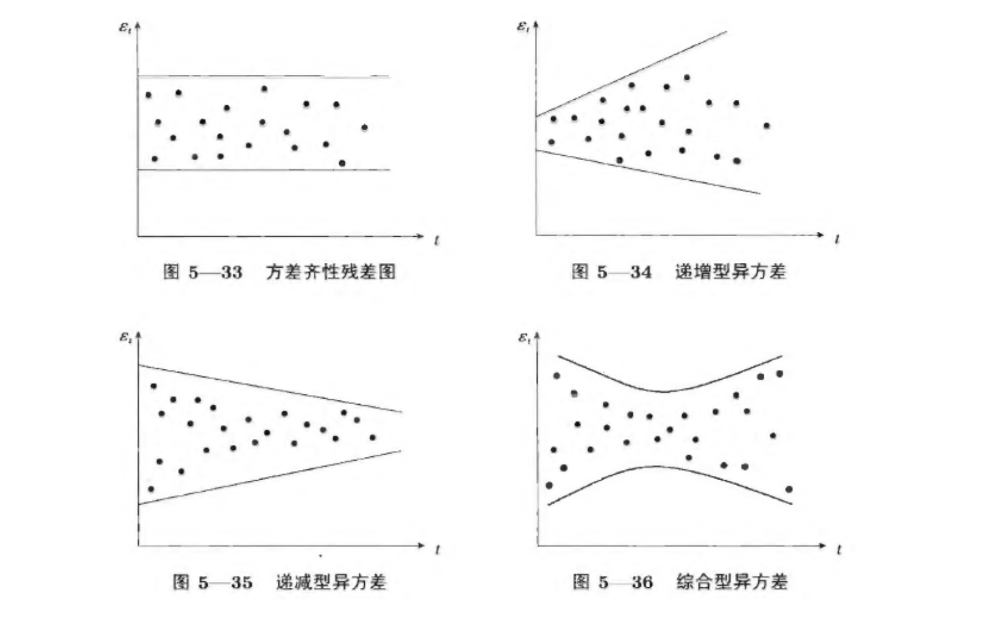
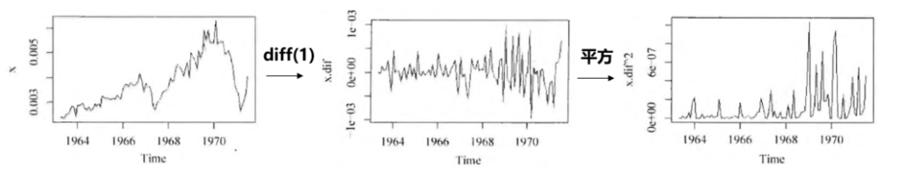
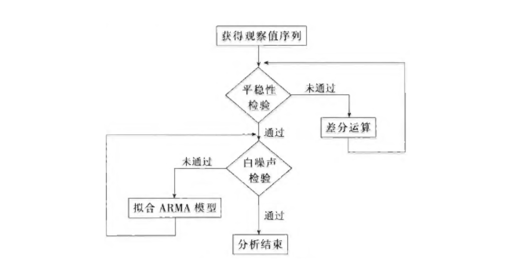
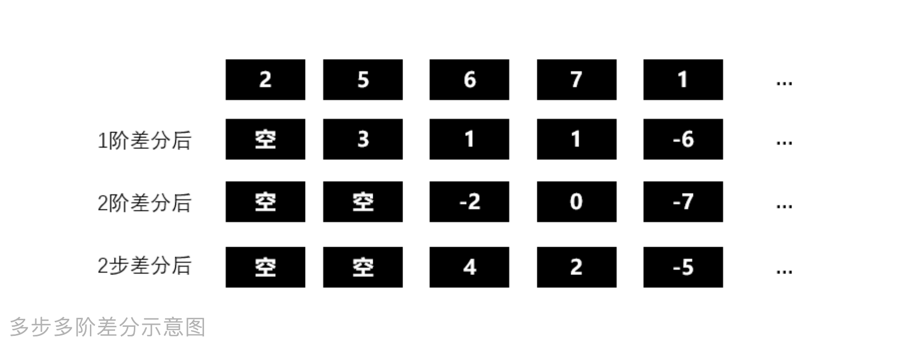
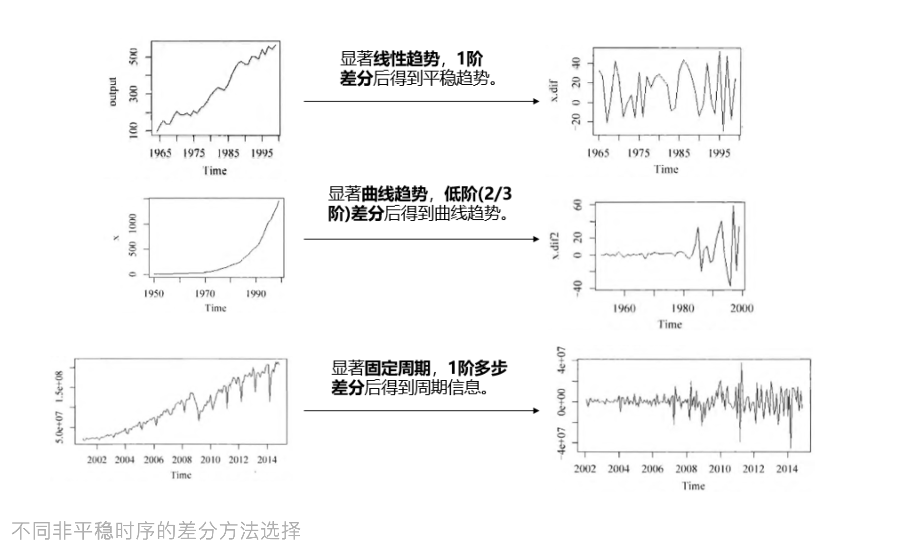

<style>
details {
    border: 1px solid #aaa;
    border-radius: 4px;
    padding: .5em .5em 0;
}
summary {
    font-weight: bold;
    margin: -.5em -.5em 0;
    padding: .5em;
}
details[open] {
    padding: .5em;
}
details[open] summary {
    border-bottom: 1px solid #aaa;
    margin-bottom: .5em;
}
img {
    pointer-events: none;
}
</style>

<details><summary>目录</summary><p>

- [非平稳时间序列分析介绍](#非平稳时间序列分析介绍)
    - [非平稳时序分析-同方差](#非平稳时序分析-同方差)
    - [非平稳时序分析-异方差](#非平稳时序分析-异方差)
    - [方差齐性检验](#方差齐性检验)
        - [残差图](#残差图)
        - [残差平方图](#残差平方图)
        - [假设检验](#假设检验)
- [非平稳时序分析-同方差](#非平稳时序分析-同方差-1)
    - [ARIMA 模型](#arima-模型)
        - [ARIMA 模型介绍](#arima-模型介绍)
        - [ARMA 模型结构](#arma-模型结构)
        - [ARIMA 模型结构](#arima-模型结构)
        - [ARIMA 建模流程图](#arima-建模流程图)
        - [差分运算](#差分运算)
    - [残差自回归模型](#残差自回归模型)
        - [确定性因素分解](#确定性因素分解)
            - [趋势](#趋势)
            - [季节](#季节)
            - [随机](#随机)
        - [时间序列分解模型](#时间序列分解模型)
            - [加法模型](#加法模型)
            - [乘法模型](#乘法模型)
            - [加法乘法混合模型](#加法乘法混合模型)
        - [时间序列分解实现示例](#时间序列分解实现示例)
            - [时序数据](#时序数据)
            - [时序乘法模型分解](#时序乘法模型分解)
            - [时序加法模型分解](#时序加法模型分解)
        - [时间序列的分解方法](#时间序列的分解方法)
            - [使用移动平均法分离出显性的周期性波动](#使用移动平均法分离出显性的周期性波动)
            - [将业务周期性波动效应和随机波动进行分解](#将业务周期性波动效应和随机波动进行分解)
            - [观察数据波动的拐点将时间序列分段](#观察数据波动的拐点将时间序列分段)
            - [利用线性回归基于移动平均数计算长期趋势](#利用线性回归基于移动平均数计算长期趋势)
            - [分离出循环效应和随机波动](#分离出循环效应和随机波动)
            - [检验时间序列分解的效果](#检验时间序列分解的效果)
        - [时间序列分解方法的应用局限性](#时间序列分解方法的应用局限性)
        - [残差自回归模型](#残差自回归模型-1)
- [非平稳时序分析-异方差](#非平稳时序分析-异方差-1)
    - [对数变换加 ARIMA](#对数变换加-arima)
        - [对数变换](#对数变换)
        - [ARIMA 建模](#arima-建模)
    - [ARCH 模型](#arch-模型)
    - [GARCH 模型](#garch-模型)
    - [AR-GARCH 模型](#ar-garch-模型)
    - [SARIMA](#sarima)
- [参考](#参考)
</p></details><p></p>

# 非平稳时间序列分析介绍

在自然界中绝大部分序列都是非平稳的，因而对非平稳序列的分析更普遍、更重要。
对于非平稳时间序列分析，根据**残差序列的方差是否相同**，时序分析可以分为两种：

* 残差序列具有同方差性
    - 差分自回归移动平均模型(Autoregressive Integrated Moving Average, ARIMA)
    - 残差自回归模型(Residual Auto-Regressive, RAR)
* 残差序列具有异方差性
    - 对数变换后拟合 ARIMA
    - 自回归条件异方差模型(Auto-Regressive Conditional Heteroscedastic, ARCH)
        - 广义自回归条件异方差模型(Generalized Auto-Regressive Conditional Heteroscedastic, GARCH)
        - AR-GARCH

## 非平稳时序分析-同方差

如果时序是非平稳的，即没有通过平稳性检验，并且残差序列具有同方差性。
传统时序分析中一般有两种手段进行处理：**差分运算**、**确定性因素分解**。
针对这两种确定信息提取方式，可以分别构建两种传统模型：**ARIMA** 和**残差自回归模型**。

* **差分运算**
    - 差分运算具有强大的确定性信息提取能力，许多非平稳序列差分后会显示出平稳序列的性质，
      称这个非平稳序列为**差分平稳序列**。
    - 对差分平稳序列可以使用 ARIMA 进行拟合。ARIMA 模型的实质就是差分运算和 ARMA 模型的组合，
      说明任何非平稳序列如果能通过适当阶数的差分实现差分后平稳，
      就可以对差分后序列进行 ARMA 模型拟合，而 ARMA 模型的分析方法非常成熟。
* **确定性因素分解**
    - **残差自回归模型**

非平稳时序（同方差）建模流程如下：


## 非平稳时序分析-异方差

有时候，发现即使在非平稳时序上，使用了 ARIMA 或残差自回归模型也难达到理想效果，
此时，问题可能发生在**残差序列具有异方差性**上，因为当使用 ARIMA 拟合非平稳序列时，
对残差序列有一个重要的假定：残差序列为零均值白噪声序列。但现实是，方差可能会随着时间变化而变化，
比如说股市里，今年市场不稳定性比去年大，那么今年的方差就会比去年大，这就不满足 ARIMA 的方差齐性假定。
这里介绍如何识别异方差？如何对异方差非平稳时序建模？

异方差序列应对方法有从两种角度去做：

* 对序列做对数变换，再拟合 ARIMA 模型
* 直接构建 ARCH 模型，拟合异方差函数

非平稳时序（异方差）建模流程：



## 方差齐性检验

方差齐性检验有两种方法：残差图和残差平方图。

### 残差图

残差图是直接可视化残差序列，观察波动状况。



```python

```

### 残差平方图

残差平方图是对一阶差分后的时序求平方后的图。差分是抽取波动性，平方是把差分变正数。



```python

```

### 假设检验

使用统计检验来检查时间序列是否为异方差序列主要有三种方法：

* White Test
* Breusch-Pagan Test
* Goldfeld-Quandt Test

这些检验的主要输入是回归模型的残差(如普通最小二乘法)。零假设是残差的分布方差相等。
如果 `$p$` 值小于显著性水平，则拒绝该假设。这就说明时间序列是异方差的，
检验显著性水平通常设置为 0.05。

```python
# -*- coding: utf-8 -*-

# ***************************************************
# * File        : heteroskedasticity.py
# * Author      : Zhefeng Wang
# * Email       : wangzhefengr@163.com
# * Date        : 2024-09-08
# * Version     : 0.1.090822
# * Description : 使用统计检验来检查时间序列是否为异方差序列主要有三种方法：
# *               - White Test
# *               - Breusch-Pagan Test
# *               - Goldfeld-Quandt Test
# *               这些检验的主要输入是回归模型的残差(如普通最小二乘法)。
# *               零假设是残差的分布方差相等。如果 p 值小于显著性水平，则拒绝该假设。
# *               这就说明时间序列是异方差的， 检验显著性水平通常设置为 0.05。
# * Link        : https://github.com/vcerqueira/blog/blob/main/src/heteroskedasticity.py
# * Requirement : 相关模块版本需求(例如: numpy >= 2.1.0)
# ***************************************************

# python libraries
from typing import Dict
import pandas as pd
import statsmodels.stats.api as sms
from statsmodels.formula.api import ols

TEST_NAMES = ["White", "Breusch-Pagan", "Goldfeld-Quandt"]
FORMULA = 'value ~ time'


class Heteroskedasticity:
 
    @staticmethod
    def het_tests(series: pd.Series, test: str) -> float:
        """
        Testing for heteroskedasticity
        异方差检验

        Parameters:
            series: Univariate time series as pd.Series
            test: String denoting the test. 
                  One of 'White','Goldfeld-Quandt', or 'Breusch-Pagan'
        Return:
            p-value as a float.
 
        If the p-value is high, we accept the null hypothesis that the data is homoskedastic
        """
        # 测试方法验证
        assert test in TEST_NAMES, 'Unknown test'
        # 时间序列预处理
        series = series.reset_index(drop = True).reset_index()
        series.columns = ['time', 'value']
        series['time'] += 1
        # 最小二乘回归
        olsr = ols(FORMULA, series).fit()
        # 假设检验
        if test == 'White':
            _, p_value, _, _ = sms.het_white(
                olsr.resid, 
                olsr.model.exog
            )
        elif test == 'Goldfeld-Quandt':
            _, p_value, _ = sms.het_goldfeldquandt(
                olsr.resid, 
                olsr.model.exog, 
                alternative = 'two-sided'
            )
        else:
            _, p_value, _, _ = sms.het_breuschpagan(
                olsr.resid, 
                olsr.model.exog
            )
 
        return p_value

    @classmethod
    def run_all_tests(cls, series: pd.Series) -> Dict[str, float]:
        """
        运行建设检验

        Args:
            series (pd.Series): _description_

        Returns:
            Dict: 检验结果, p-value
        """
        test_results = {
            k: cls.het_tests(series, k) 
            for k in TEST_NAMES
        }
 
        return test_results


# 测试代码 main 函数
def main():
    from pmdarima.datasets import load_airpassengers
    # from heteroskedasticity import Heteroskedasticity

    series = load_airpassengers(True)
    test_results = Heteroskedasticity.run_all_tests(series)
    print(test_results)

if __name__ == "__main__":
    main()
```

```
{
    'White': 4.3457544661287e-07, 
    'Breusch-Pagan': 4.559001856883369e-07, 
    'Goldfeld-Quandt': 8.812950329262268e-13
}
```

# 非平稳时序分析-同方差

## ARIMA 模型

### ARIMA 模型介绍

ARIMA(Autoregressive Integrated Moving Average)，差分自回归移动平均模型，
是**差分后的时间序列**和**残差误差**的线性函数。

差分可以将许多非平稳序列转为平稳序列，通常称之为**差分平稳序列**，可以使用 ARIMA 模型进行拟合，
该模型将**差分运算**与 **ARMA 模型**结合在一起，本质上就是差分后做 ARMA 模型。
ARIMA 有三个参数 `$p$`、`$q$` 和 `$d$`，其中 `$d$` 为 `$d$` 阶差分。

### ARMA 模型结构

> ARMA(`$p$`, `$q$`) 模型，称为 **自回归移动平均(Auto-Regressive Moving Average)模型**，
> 是 **时间序列**和**残差误差** 的线性函数，是 AR(`$p$`) 和 MA(`$q$`) 模型的组合，
> 该模型适用于 **无趋势(trend)** 和 **无季节性(seasonal)** 因素的单变量时间序列。
> 
> ARMA 模型的数学表达式为：
> 
> `$$\left\{
> \begin{array}{**lr**}
> x_{t}=\phi_{0} + \phi_{1}x_{t-1} + \cdots + \phi_{p}x_{t-p} + \varepsilon_{t} + \theta_{1}\varepsilon_{t-1} + \cdots + \theta_{q}\varepsilon_{t-q} & \\
> \phi_{p} \neq 0, \theta_{q} \neq 0& \\
> E(\varepsilon_{t}) = 0, Var(\varepsilon_{t}) = \sigma_{\varepsilon}^{2}, E(\varepsilon_{t}\varepsilon_{s}) = 0, s > \neq t & \\
> E(x_{s}\varepsilon_{t}) = 0, \forall s < t & 
> \end{array}
> \right.$$`
> 
> ARMA 模型的另一种形式：
> 
> `$$(1-\sum_{i=1}^{p}\phi_{i}B^{i})x_{t} = (1 - \sum_{i=1}^{q}\theta_{i}B^{i})\varepsilon_{t}$$`
> `$$\Phi(B)x_{t} = \Theta(B)\varepsilon_{t}$$`
> 
> * 当 `$\phi_{0} = 0$` 时，为中心化模型；
> * 当 `$q = 0$` 时，ARMA(`$p$`, `$q$`) 模型就退化成了 AR(`$p$`) 模型；
> * 当 `$p = 0$` 时，ARMA(`$p$`, `$q$`) 模型就退化成了 MA(`$q$`) 模型；
> 
> 所以 AR(`$p$`) 和 MA(`$q$`) 实际上是 ARMA(`$p$`, `$p$`) 模型的特例，它们统称为 ARMA 模型。
> 而 ARMA(`$p$`, `$p$`) 模型的统计性质也正是 AR(`$p$`) 模型和 MA(`$p$`) 模型统计性质的有机结合。

### ARIMA 模型结构

ARIMA 模型的

`$$\left\{
\begin{array}{**lr**}
\Phi(B)\Delta^{d}x_{t} = \Theta(B)\epsilon_{t}& \\
E(\epsilon_{t}) =0, Var(\epsilon_{t}) = \sigma_{\epsilon}^{2}, E(\epsilon_{s}\epsilon_{t}) = 0, s \neq t& \\
E(x_{s}\epsilon_{t}) = 0, \forall s < t&
\end{array}
\right.$$`

其中: 

* `${\epsilon_{t}}$` 为零均值白噪声序列
* `$\Delta^{d} = (1-B)^{d}$`
* `$x_{t}$` 为原始时间序列
* `$\Phi(B) = 1-\sum_{i=1}^{p}\phi_{i}B^{i}$` 为平稳可逆 ARMA(`$p$`, `$q$`) 模型的自回归(AR)系数多项式
* `$\Theta(B) = 1 + \sum_{i=1}^{q}\theta_{i}B^{i}$` 为平稳可逆 ARMA(`$p$`, `$q$`) 模型的移动平滑(MA)系数多项式

ARIMA 之所以叫差分自回归移动平均是因为：`$d$` 阶差分后的序列可以表示为下面的表示形式，
即差分后序列等于原序列的若干序列值的加权和，而对它又可以拟合 ARMA 模型：

`$$\Delta^{d}x_{t} = \sum_{i=0}^{d}(-1)C_{d}^{i}x_{t-i}$$`

其中，`$C_{d}^{i} = \frac{d!}{i!(d-i)!}$`。

ARIMA(`$p$`, `$d$`, `$q$`) 模型的另一种形式：

`$$\Delta^{d}x_{t} = \frac{\Theta(B)}{\Phi(B)}\epsilon_{t}$$`

其中：

* 当 `$d=0$` 时，ARIMA(`$p$`, `$0$`, `$q$`) 模型就是 ARMA(`$p$`, `$q$`) 模型
* 当 `$p=0$` 时，ARIMA(`$0$`, `$d$`, `$q$`) 模型可以简记为 IMA(`$d$`, `$q$`) 模型
* 当 `$q=0$` 时，ARIMA(`$p$`, `$d$`, `$0$`) 模型可以简记为 ARI(`$p$`, `$d$`) 模型
* 当 `$d=1, p=q=0$` 时，ARIMA(`$0$`, `$1$`, `$0$`) 模型为 随机游走 (random walk) 模型：
 
`$$\left\{
\begin{array}{**lr**}
x_{t} = x_{t-1} + \epsilon_{t}& \\
E(\epsilon_{t}) =0, Var(\epsilon_{t}) = \sigma_{\epsilon}^{2}, E(\epsilon_{s}\epsilon_{t}) = 0, s \neq t& \\
E(x_{s}\epsilon_{t}) = 0, \forall s < t&
\end{array}
\right.$$`

### ARIMA 建模流程图



### 差分运算

差分运算是一种十分简单有效的确定性信息提取方法，
很多时候适当阶数的差分便可以充分提取出确定性信息。



针对不同时序，我们可以选择不同差分方式，请见下图所示：



> p 阶差分

相距一期的两个序列值之间的减法运算称为 `$1$` 阶差分运算；
对 `$1$` 阶差分后序列在进行一次 `$1$` 阶差分运算称为 `$2$` 阶差分；
以此类推，对 `$p-1$` 阶差分后序列在进行一次 `$1$` 阶差分运算称为 `$p$` 阶差分。

`$$\Delta x_{t} = x_{t} - x_{t-1}$$`
`$$\Delta^{2} x_{t} = \Delta x_{t} - \Delta x_{t-1}$$`
`$$\cdots$$`
`$$\Delta^{p} x_{t} = \Delta^{p-1} x_{t} - \Delta^{p-1} x_{t-1}$$`

> k 步差分

相距 `$k$` 期的两个序列值之间的减法运算称为 `$k$` 步差分运算：

`$$\Delta_{k}x_{t} = x_{t} - x_{t-k}$$`

> 滞后算子

滞后算子类似于一个时间指针，当前序列值乘以一个滞后算子，
就相当于把当前序列值的时间向过去拨了一个时刻。

假设 `$B$` 为滞后算子：

`$$x_{t-1} = Bx_{t}$$`
`$$x_{t-2} = B^{2}x_{t}$$`
`$$\vdots$$`
`$$x_{t-p} = B^{p}x_{t}$$`

也可以用滞后算子表示差分运算：

`$p$` 阶差分：

`$$\Delta^{p}x_{t} = (1-B)^{p}x_{t} = \sum_{i=0}^{p}(-1)C_{p}^{i}x_{t-i}$$`

`$k$` 步差分：

`$$\Delta_{k}x_{t} = x_{t} - x_{t-k} = (1-B^{k})x_{t}$$`

> 差分运算 API

* `pandas.Series.diff`
* `pandas.DataFrame.diff`
* `pandas.DataFrame.percent`
* `pandas.DataFrame.shift`

```python
# 1 阶差分、1步差分
pandas.DataFrame.diff(periods = 1, axis = 0)

# 2 步差分
pandas.DataFrame.diff(periods = 2, axis = 0)

# k 步差分
pandas.DataFrame.diff(periods = k, axis = 0)

# -1 步差分
pandas.DataFrame.diff(periods = -1, axis = 0)
```

> 百分比变化率

当前值与前一个值之间的百分比变化。

```python
pandas.DataFrame/Series.pct_change(
    periods = 1, 
    fill_method = 'pad', 
    limit = None, 
    freq = None, 
    **kwargs
)
```

示例：

```python
data = pdr.get_data_fred("HOUSTNSA", "1959-01-01", "2019-06-01")
data
```


```python
fig, ax = plt.subplots()
ax = housing.plot(ax = ax)
```


```python
housing = data.HOUSTNSA.pct_change().dropna()
housing = 100 * housing.asfreq("MS")
housing
```

```
DATE
1959-02-01     2.910603
1959-03-01    28.989899
1959-04-01    18.089272
1959-05-01     1.127321
1959-06-01    -3.081967
                ...    
2019-02-01    -8.045977
2019-03-01    22.750000
2019-04-01    18.737271
2019-05-01     1.286449
2019-06-01    -2.540220
Freq: MS, Name: HOUSTNSA, Length: 725, dtype: float64
```

```python
fig, ax = plt.subplots()
ax = housing.plot(ax = ax)
```


## 残差自回归模型

> 残差自回归模型, Residual Auto-Regressive, RAR

### 确定性因素分解

除了差分运算，非平稳序列常会显示出非常明显的规律性：

* 长期趋势（Trend）：长期递增、递减等
* 循环波动（Circle）：周期性/季节性反复循环波动
* 随机波动（immediate）：消除趋势和周期变化后的随机影响

这三种因素有不同的相互作用模式：

* 加法模型
    - `$x = T + C + I$`
* 乘法模型
    - `$x = T \times C \times I$`

#### 趋势

获取趋势有两种方法：

* 拟合法：线性拟合或非线性拟合
* 平滑法：移动平均或指数平滑法
    - Python 中 statsmodel 的序列趋势分解便是用的平滑法

#### 季节

看季节/周期性，也有两种方法：

* 季节指数：反映该季度与总平均值之间的关系，若季节指数大于 1，说明该季度的值常高于总平均值，
  若小于 1，则反之，若近似等于 1，说明该序列没有明显的季节效应。它分 3 步走：

第一步：计算周期内各期平均数（假设 m 期为一周期，共 n 个周期）

`$$\bar{x}_{k} = \frac{\sum_{i=1}^{n}x_{ik}}{n}, k= 1,2,\ldots, m$$`

第二步：计算总平均数

`$$\bar{x}_{k} = \frac{\sum_{i=1}^{n}\sum_{k=1}^{m}x_{ik}}{nm}$$`

第三步：时期平均数处于总平均数，得到各时期的季节指数

`$$S_{k}=\frac{\bar{x}_{k}}{\bar{x}}, k=1,2,\ldots, m$$`

* 去趋势求周期平均：Python 中 statsmodel 的序列周期提取是先对原序列去除趋势项后，计算给定周期内的均值，用均值作为反映周期性。

#### 随机

若认为是加法模型形式，随机项=序列-趋势项-季节项。乘法模型，则通过除法获取随机项（有时也称残差项）

### 时间序列分解模型

时间序列数据，即数据指标按时间维度统计形成的序列。这种数据在我们的日常报表中非常常见。
观察这类数据的出发点有两个：

* 一是长期追踪，一旦指标出现上涨和下跌，能直观地观察到，进而去调查原因
* 二是判断趋势，通过指标的波动，判断指标在未来的走势
  
第一点相对简单，看到指标变化后从不同维度不断下钻，总能找到原因。
第二点则要从时间序列的波动中看出门道，不是光盯着数据看就可以的，
最常见的逻辑就是 “将时间序列波动的信息进行分解”

在时间序列分析中, 常见的分析方法叫做时间序列的分解(Decomposition of Time Series)。
通过分解，将数据分解成可预测部分和不规则变动(随机波动)部分，
可预测部分占比比不规则变动大很多，那么就具备了预测未来的条件

时间序列分解的原理是将时间序列 `$Y_{t}$` 分为三个或四个部分:

`$$Y_{t} = f(T_{t}, S_{t}, C_{t}, I_{t})$$`

* 长期趋势因素(Secular trend) `$T_{t}$`
    - 数据中对时间的变化相对稳定的一部分因素。往往是长期稳定的上涨或下跌。
      这个数据一般可以通过移动平均或者线性回归等方法进行拟合，因此它是可预测的部分
* 季节/周期变动因素(Seasonal Variation) `$S_{t}$`
    - 传统的时间序列分解方法一般用在长期的宏观经济指标中，因此颗粒度是季度，所以会呈季节性变动。
      在数据运营的场景中，季节数据跨度太长，几乎没有使用的必要性。
      所以将季节变动引申为“周期性波动”，而且是显性的周期性波动，
      例如业务指标在一周内会有周末和工作日的差别，在一个月中会有月初和月末的差别。
      周期性波动因素取决于数据处在周期中的位置，通过固定位置的历史数据(取均值或者其他数学变换)，
      也能对未来的某个位置的周期性因素进行估计，因此它也是可预测的部分
* 循环变动因素(Cyclical Variation) `$C_{t}$`
    - 循环变动和季节变动其实很像，也有周期性因素在。但循环变动的周期是隐性的，
      往往要先将显性的周期性波动排除后，再观察剩下的数据部分是否有循环波动的因素，
      若有，也能通过同比计算等方法将其提出，因此也是可预测的
* 随机变动因素(Irregular Variation) `$I_{t}$`
    - 既然是随机波动，自然是不可预测的
    - 时间序列分解的成功与否，取决于两个因素：一是数据序列本身是隐藏着规律的，不可预测的部分只是其中的一小部分；
      二是分解的方法要合适，尤其是周期的判断要准确。因此，这个方法非常考验使用者的经验和直觉

时间序列分解法试图从时间序列中区分出这四种潜在的因素, 特别是长期趋势因素(T)、季节变动因素(S)、
循环变动因素(C). 显然, 并非每一个预测对象中都存在着 T、S、C 这三种趋势, 可能是其中的一种或两种. 
一个具体的时间序列究竟由哪几类变动组合, 采取哪种组合形式, 应根据所掌握的资料、时间序列及研究目的来确定

#### 加法模型
   
`$$Y_{t} = T_{t} + S_{t} + C_{t} + I_{t}$$`

其中: 

* `$Y_{t}, T_{t}, S_{t}, C_{t}, I_{t}$` 均有相同的量纲
* `$\sum_{t=1}^{k}S_{t}=0$`，`$k$` 为季节性周期长度
* `$I_{t}$` 是独立随机变量序列，服从正态分布

加法模型中的四种成分之间是相互独立的, 某种成分的变动不影响其他成分的变动. 
各个成分都用绝对量表示, 并且具有相同的量纲

#### 乘法模型

`$$Y_{t} = T_{t} \times S_{t} \times C_{t} \times I_{t}$$`

其中:

* `$Y_{t}$`，`$T_{t}$` 有相同的量纲
* `$S_{t}$` 为季节性指数，`$C_{t}$` 为循环指数，两者皆为比例数
* `$\sum_{t=1}^{k}S_{t}=k$`，`$k$` 为季节性周期长度
* `$I_{t}$` 是独立随机变量序列，服从正态分布

乘法模型中四种成分之间保持着相互依存的关系, 一般, 长期趋势用绝对量表示, 
具有和时间序列本身相同的量纲, 其他成分则用相对量表示

上面的乘法模型等价于:

`$$\ln y_{t} = \ln S_t + \ln T_t + \ln C_t + \ln I_{t}$$`

由于上面的等价关系, 所以, 有的时候在预测模型的时候会先取对数, 
然后再进行时间序列的分解, 就能得到乘法的形式

#### 加法乘法混合模型

`$$Y_{t} = T_{t} \times S_{t} \times C_{t} + I_{t}$$`

其中: 

* `$Y_{t}, T_{t}, C_{t}, I_{t}$` 有相同的量纲
* `$S_{t}$` 是季节指数，为比例数
* `$\sum_{t=1}^{k}S_{t} = k$`，`$k$` 为季节性周期长度
* `$I_{t}$` 是独立随机变量序列，服从正态分布

### 时间序列分解实现示例

有多种算法和方法可以将时间序列分解为三个分量。以下的经典方法，经常会使用并且非常直观。

1. 使用移动/滚动平均值计算趋势分量 T
2. 对序列进行去趋势处理，Y-T 用于加法模型，Y/T 用于乘法模型
3. 通过取每个季节的去趋势序列的平均值来计算季节分量 S
4. 残差分量 R 的计算公式为：对于加法模型 R = Y-T-R，对于乘法模型 R = Y/(TR)

还有其他几种可用于分解的方法，例如 STL、X11 和 SEATS。这些是先进的方法，
是对经典方法的基本方法的补充，并改进了它的缺点

#### 时序数据

```python
# 使用1948年至1961年的美国航空客运量数据集
# https://www.kaggle.com/datasets/ashfakyeafi/air-passenger-data-for-time-series-analysis

import plotly.express as px
import pandas as pd

# Read in the data
data = pd.read_csv('AirPassengers.csv', index_col = 0)
data.index = pd.to_datetime(data.index)

# Plot the data
fig = px.line(
    data, 
    x = data.index, 
    y = '#Passengers',
    labels = ({
        '#Passengers': 'Passengers', 
        'Month': 'Date'
    })
)
fig.update_layout(
    template = "simple_white", 
    font = dict(size = 18),
    title_text = 'Airline Passengers', 
    width = 650, 
    title_x = 0.5, 
    height = 400
)
fig.show()
```

从图中我们观察到趋势是增加的，每年也有季节性。波动的大小随着时间的推移而增加，因此我们可以说这是一个乘法模型

#### 时序乘法模型分解

```python
from statsmodels.tsa.seasonal import seasonal_decompose
import matplotlib.pyplot as plt

# Plot the decomposition for multiplicative series
data.rename(
    columns = {
        '#Passengers': 'Multiplicative Decomposition'
    }, 
    inplace = True
)
decomposition_plot_multi = seasonal_decompose(
    data['Multiplicative Decomposition'],
    model = 'multiplicative'
)
decomposition_plot_multi.plot()
plt.show()
```

从上图中可以看到，该函数确实成功地捕获了这三个组成部分

#### 时序加法模型分解

通过应用 Scipy 的函数 boxcox ，可以使用 Box-Cox 变换稳定方差，这样可以将序列转换为一个加法模型

```python
# Import packages
from statsmodels.tsa.seasonal import seasonal_decompose
import matplotlib.pyplot as plt
from scipy.stats import boxcox

# Apply boxcox to acquire additive model
data['Additive Decomposition'], lam = boxcox(data['#Passengers'])

# Plot the decomposition for additive series
decomposition_plot_add = seasonal_decompose(
    data['Additive Decomposition'],
    model = 'additive'
)
decomposition_plot_add.plot()
plt.show()
```

这个函数也很好地捕获了这三个组件。但是我们看到残差在早期和后期具有更高的波动性。
所以在为这个时间序列构建预测模型时，需要考虑到这一点

### 时间序列的分解方法

时间序列数据的预测值就是:

> 长期趋势(线性回归估计值) + 循环效应(循环周期各位置的均值) + 周期效应(业务周期各位置的均值)

就意味着，能通过时间长度和所在周期的位置给出一个未知时间点的预测值

#### 使用移动平均法分离出显性的周期性波动

* 首先，清洗数据，将异常值剔除
* 其次，根据现实业务周期(显性周期)，按周期的长度求移动平均数，
  这样所获得的移动平均数就是排除了周期性波动影响和一部分随机波动的数据(`$SI_{1}$`)，
  即移动平均数为长期趋势、循环波动和一部分随机波动(`$TCI_{2}$`)
* 最后，用原始数据减去移动平均数(`$TCI_{2}$`)，就得到了周期性波动效应和一部分随机波动(`$SI_{1}$`)

#### 将业务周期性波动效应和随机波动进行分解

这部分的处理取决于周效应和不规则变动的量级。在实际场景中，若量比较大，建议计算每周中对应某一天的均值，
即得到周一的均值、周二的均值等，这便是加法模型中的周效应

`$S = SI_{1} / I_{1}$`

#### 观察数据波动的拐点将时间序列分段

移动平均数包含了数据的长期趋势(`$T$`)、循环变动(`$C$`)

* 首先，长期趋势是会改变的，这种改变往往是运营策略的变化带来的，所以不能教条地假设长期趋势稳定不变
* 其次，在数据的不同阶段，循环的周期也会有所不同

#### 利用线性回归基于移动平均数计算长期趋势

原始数据在剔除了业务周期波动和随机波动后(`$SI_{1}$`)，剩下了长期趋势和循环变动(`$TC$`)

长期趋势与时间的增加是有关系的(建模的原始假设)，因此以时间为自变量(`$t$`)(起点为0，之后每天都以1自增的序列)，
以业务周期移动平均数(`$TC$`)为因变量，构建一个线性回归模型。
由时间(`$t$`)和回归模型计算得出的因变量(`$TC$`)的估计值，就是长期趋势 `$T$`，用移动平均数减去 `$T$`，
剩下的部分就是循环效应和一部分的随机波动(不规则变动)。

需要注意的是，估计长期趋势(趋势拟合的方法)并不是只能采用线性回归。
这取决于数据点的分布，有时要用指数回归，有时要用多项式回归。
而且，在数据的不同阶段，使用的长期趋势估计方式也可以是不同的

#### 分离出循环效应和随机波动

因为循环效应不是那么容易观察出来的。一个简单的观察办法是：看数据是否有规律地分布在 0 值之上和 0 值之下。
若数据不规则地在 0 值上下跳动，则可以认定这是随机波动，不需要分离循环效应。
若数据一段时间在 0 之上，一段时间在 0 之下，且持续的时间大致相同，那么就有必要分离循环效应

一个波峰加一个波谷所跨越的时间，就是循环的周期(这个规则适用于所有周期性数据的判断)。
计算循环中各个位置的均值，即为循环效应

移动平均数(`$TCI_{2}$`)与线性回归值(`$T$`)的差值，即“循环效应+不规则变动”(`$CI_{2}$`)，
减去循环效应(`$C$`)后(除了阶段2，其他阶段的循环效应认为是0)，
剩下的就是随机波动(`$I_{2}$`)

#### 检验时间序列分解的效果

* 第一种手段就是图形法，观察预测值与实际值的契合程度
* 第二种方法是回归分析法
    - 以预测值为自变量，实际值为因变量，建立一个线性回归模型，
      观察模型的拟合优度，通过拟合优度判断预测是否靠谱

### 时间序列分解方法的应用局限性

每种分析方法都有它的局限性，时间序列分解方法也一样，“分解”这种思维，事实上是可以应用在更广泛的业务分析中的，
而不仅是时间序列数据。通过以上案例，需要注意时间序列分解法中的以下几点局限性：

1. 原始数据中的随机波动因素占比不能过大
    - 随机波动因素的占比过大，说明我们不可预测的东西过多，那么，剩余的部分再怎么分解也无济于事
2. 分解的过程中，确定移动平均的期数、数据阶段的划分、趋势拟合的方法、循环周期都带有一定的主观判断。
   这就对分析者提出了较高的要求。在应用时，需要不断地改变这些参数来获得更好的结果。而且，经常会出现仁者见仁的局面
3. 用加法模型、乘法模型或混合模型没有定论，需要具体问题具体分析。实际情况中，往往是混合模型用得比较多
4. 需要用在长期的数据序列中。时间序列的分解对时间的长度是有要求的，却没有明确的阈值
    - 至少要在 40 个数据点以上才能讨论所谓的长期趋势。另外，该方法不适合用在比“天”的颗粒度更小的时间维度上
5. 时间序列阶段的改变可预测性较差
    - 将时间序列分解的结果应用于预测时，是不知道何时进入新的阶段的(序列的结构性断点不可预测)。
      今天还在阶段1，明天就进入阶段2了，这可如何是好？有一些缓解这个问题的方法：
        - 一是做“事后诸葛亮”，即连续追踪数据，若连续出现上涨或者下跌，或者出现“史无前例”的最大值和最小值，
          那么就要考虑数据的结构性变化可能出现了，就要放弃原先的建模方式；
        - 二是从业务决策上“明察秋毫”，数据出现结构性变化，往往是较大的决策改变或者产品迭代引起的，
          那么反过来思考，若业务出现一些“重大改变”，也许就应该重新建模了。
6. 真正的预测，只能在阶段内进行
    - 历史往往会重演，前面几个阶段的数据特征，一定会出现在未来的某个时间点。
      所以，当数据进入有“历史参考”的某个阶段时，可以用历史经验预测未来的走势

### 残差自回归模型

残差自回归模型的中心思想很简单，就是先提取趋势项和周期项，再针对残差做 AR 模型。
所以说它利用了确定性因素分解的方法，不同于差分提取非平稳序列中的确定性信息，
确定因素分解将非平稳序列中趋势和季节提取出来了，而这样我们有：序列 = 趋势项 + 周期项 + 残差项，
但有时候残差项可能也会具有确定性信息没被分解出来，因此残差自回归模型对残差做 AR 模型

残差自回归模型函数为：

`$$x_{t} = T_{t} + S_{t} + \varepsilon_{t}$$`

其中，对 `$$\varepsilon_{t}$$` 做 AR(`$p$`)：

`$$x_{t} = \phi_{0} + \phi_{1}\varepsilon_{t-1}+\phi_{2}\varepsilon_{t-2} + \ldots + \phi_{p}\varepsilon_{t-p} + \alpha_{t}$$`

其中，对趋势项 `$T$` 的拟合有两种：

1. 自变量为时间 `$t$` 的幂函数

`$$T_{t}=\beta_{0}+\beta_{1}t + \ldots + \beta_{k}t^{k} + \varepsilon_{t}$$`

2. 自变量为历史观察值 `$x_{t-1}, x_{t-2}, \ldots, x_{t-k}$`

`$$T_{t} = \beta_{0} + \beta_{1}x_{t-1} + \ldots + \beta_{k}x_{t-k} + \varepsilon_{t}$$`

对周期项的拟合有两种：

1. 季节指数

`$$S_{t} = S_{t}^{'}$$`

`$S_{t}^{'}$` 是某个已知的季节指数

2. 季节自回归模型(假设固定周期为 `$m$`)

`$$S_{t} = \alpha_{0} + \alpha_{1} x_{t-1} + \ldots + \beta_{k}x_{t-k} + \varepsilon_{t}$$`

那我们什么时候要用残差自回归模型呢？不单是非平稳下，更要看残差是否具有自相关性（即确定性信息），
为了检验残差序列的自相关性，有两种方法可以参考：DW 检验 (Durbin-Watson) 和 Durbin h 检验，
前者存在有偏，现在常用是后者。若通过检验，则可以去残差做自回归模型

# 非平稳时序分析-异方差

## 对数变换加 ARIMA

当标准差与水平成正比的异方差序列（即序列均值变高的同时，标准差也变大），
log 对数转换可以有效实现方差齐性，然后就可以正常走方差齐性平稳序列的建模方法(ARIMA)了。

### 对数变换

* TODO

### ARIMA 建模

* TODO

## ARCH 模型

> 自回归条件异方差模型, Auto-Regressive Conditional Heteroscedastic, ARCH

对数变换只适用于部分异方差波动序列，
而 ARCH 是一种在宏观经济领域和金融领域广泛采用的异方差处理方法。

ARCH 模型如下：

`$$x_{t}=f(t, x_{t-1}, x_{t-2}, \ldots) + \varepsilon_{t}$$`
`$$\varepsilon_{t} = \sqrt{h_{t}}e_{t}$$`
`$$h_{t} = \omega + \sum_{j=1}^{q}\lambda_{j}\varepsilon_{t-j}^{2}$$`

其中：

* `$f(t, x_{t-1}, x_{t-2}, \ldots)$` 为 `$x_{t}$` 的确定性信息拟合模型
* `$\varepsilon_{t}$` 为时间点 `$t$` 的残差
* `$h_{t}$` 为 `$\varepsilon_{t}$` 的方差函数（ 即基于历史残差信息条件下的条件方差）

其实，ARCH 模型的本质就是使用残差平方（`$diff^{2}$`）序列的 `$q$` 阶移动平均（MA(`$q$`)）拟合当期异方差函数值。

## GARCH 模型

> 广义自回归条件异方差模型, Generalized Auto-Regressive Conditional Heteroscedastic, GARCH

ARCH 是基于 `$\text{MA}(q)$` 的，所以 ARMA 具有自相关系数 `$q$` 阶截尾性，
因此它只适用于异方差函数短期自相关过程。但实际上有些残差序列的异方差函数具有长期自相关性，
所以 GARCH 模型被提出来了： 

`$$x_{t}=f(t, x_{t-1}, x_{t-2}, \ldots) + \varepsilon_{t}$$`
`$$\varepsilon_{t} = \sqrt{h_{t}}e_{t}$$`
`$$h_{t} = \omega + \sum_{i=1}^{p}\eta_{t}h_{t-i} + \sum_{j=1}^{q}\lambda_{j}\varepsilon_{t-j}^{2}$$`

GARCH 模型本质上就是在 ARCH 上加入了 `$p$` 阶自相关性（我理解是 `$\text{AR}(p)$`），
这样就能有效拟合具有长期记忆性的异方差函数。

## AR-GARCH 模型

有时回归函数 `$f(t, x_{t-1}, x_{t-2}, \ldots)$` 不能充分提取原序列中相关信息，
导致 `$\varepsilon_{t}$` 存在自相关性，所以需要先对 `$\varepsilon_{t}$` 拟合自回归模型 AR，
再考察残差序列 `$\upsilon_{t}$` 的方差齐性。

## SARIMA

* TODO

# 参考

* [非平稳时序分析 (同方差)](https://mp.weixin.qq.com/s?__biz=MzUyNzA1OTcxNg==&mid=2247486538&idx=1&sn=998daad088940387c00016611049c23a&chksm=fa041221cd739b375a97adba05afb6c085783731d075937d6712583f7798e7d0ed2c436ff784&scene=178&cur_album_id=1577157748566310916#rd)
* [非平稳时序分析 (异方差)](https://mp.weixin.qq.com/s?__biz=MzUyNzA1OTcxNg==&mid=2247486539&idx=1&sn=e829d3372e728a32abc25af97cbd70ed&chksm=fa041220cd739b3660811059434a2f3aa66dd98c018209d923f610813bc45232024b445454ab&scene=178&cur_album_id=1577157748566310916#rd)
* [时间序列中的异方差检测](https://mp.weixin.qq.com/s/FrNk-Od6cKsLY9d1feb6ww)
* [季节性自回归整合滑动平均模型（SARIMA）](https://mp.weixin.qq.com/s?__biz=MzkzMTMyMDQ0Mw==&mid=2247483973&idx=1&sn=f9f3f84c5db03e3c2235620435cd75f1&chksm=c26d8551f51a0c47b84185f379c69832041a677f6c3004ac018e3f8ffe67e960d0593f99a87c&scene=21#wechat_redirect)
