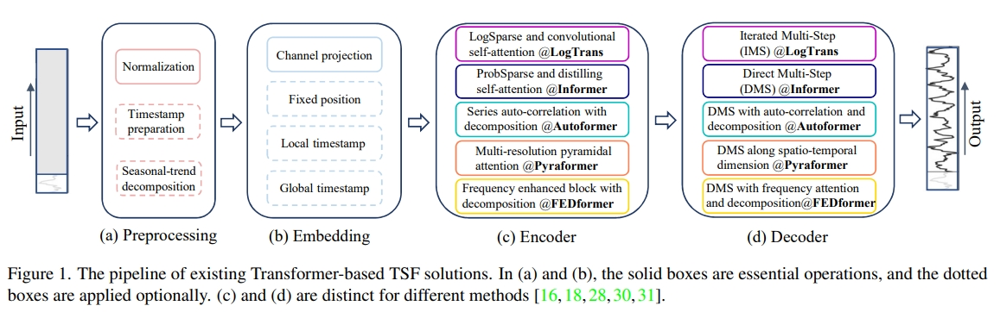
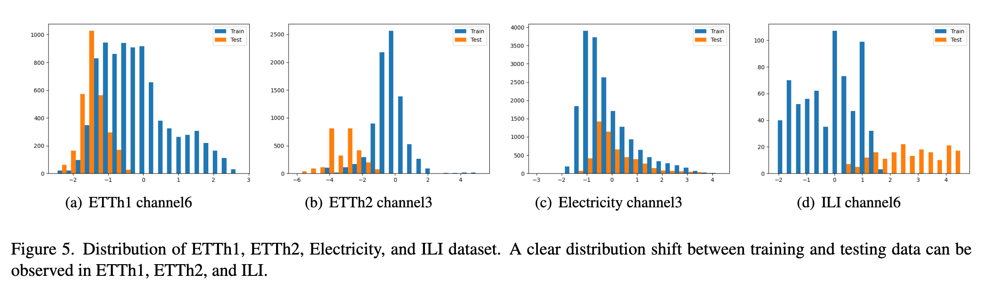
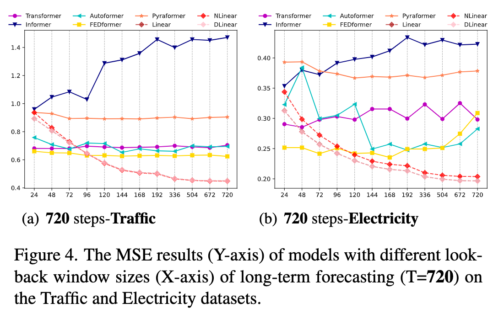

目录

- [论文简介](#论文简介)
- [历史研究和瓶颈](#历史研究和瓶颈)
- [论文贡献](#论文贡献)
- [问题定义](#问题定义)
- [模型定义](#模型定义)
    - [LTSF-Linear](#ltsf-linear)
    - [DLinear](#dlinear)
    - [NLinear](#nlinear)
- [实验结果](#实验结果)
    - [定量分析](#定量分析)
    - [定性分析](#定性分析)
- [Transformer 类模型进一步分析](#transformer-类模型进一步分析)
- [总结](#总结)
- [资料](#资料)

# 论文简介

> * 论文名称：Are Transformers Effective for Time Series Forecasting? 
> * 论文地址：[https://arxiv.org/abs/2205.13504](https://arxiv.org/abs/2205.13504)
> * 模型代码：[https://github.com/cure-lab/LTSF-Linear](https://github.com/cure-lab/LTSF-Linear)

# 历史研究和瓶颈

基于 Transformer 的长时间序列预测模型：

* AutoFormer
* Informer
* ...

# 论文贡献

* 质疑基于 Transformer 的序列预测模型在长时间序列预测任务(LTSF，long-term time series forecasting)的有效性
    - 大部分模型无法从长序列中抽取时序信息（实验中预测误差并没有随着历史窗口增大而减少）
    - 大部分模型相对于 baseline（rnn 类）的提升是将预测方法从 IMS 替换成 DMS 得到的。
* 提出只有 one-layer linear model：**LTSF-Linear**，通过 DMS 方式预测效果超过之前模型。
* 对已有模型的能力进行实验分析
    - 建模长输入的能力
    - 对时间顺序的敏感性
    - 位置编码
    - 子序列 embdding 影响
    - 模型性能

# 问题定义

时间序列预测问题主要形式是：已知前 `$t$` 时间的特征，然后预测未来一段时间的结果。
如果需要预测的时间很长，被称之为**长时间序列预测**。

* IMS: Iterated Multi-Step forecasting
    - 每次预测一个结果，迭代多次得到对未来一段时间的预测结果（自回归）。
    - 结果方差比较小，但是预测过程中误差会累积。
* DMS: Direct Multi-Step forecasting
    - 一步得到对于未来一段时间的预测结果。
    - 常在需要预测未来时间很长或者很难训练无偏单步预测模型时使用。

Transformer 前提假设是**成对元素之间有语义相关性**，self-attention 机制本质是**元素置换不变**，
建模时序关系能力很大程度上取决于**与输入标记相关联的位置编码**。
时序数据基本上没有点对点的语义相关性，需要模型能提取连续点之间的时序关系。
Time Series Transformer 通过**位置编码**以及**序列编码**提供**部分顺序信息**，
但是由于**置换不变自注意力机制**的存在必然存在**时序信息丢失**问题。

Time Series Transformer 框架：

* Time series decomposition 对输入序列进行分解，后续更好预测。
    - Autoformer 在 Seasonal-trend decomposition 中通过移动平均(moving average)建模趋势项(trend)。
    - FEDformer 通过 MoE 策略将移动平均提取的趋势和各种大小核进行混合。
* 对输入特征的 Emebdding 策略：
    - 原始时间序列的顺序 local positional information
    - 全局时间信息，比如 hierarchical timestamps (week, month, year) 和 agnostic timestamps(holidays and events)
    - injecting several embeddings, like a fixed positional encoding, 
      a channel projection embedding, and learnable temporal embeddings into the input sequence.
    - temporal embeddings with a temporal convolution layer or learnable timestamps are introduced
* self-attention 机制让 attention 矩阵计算尽可能稀疏
* Decoders 改进原始 Transformer 的自回归模式

# 模型定义

* Linear: Just one linear layer.
* DLinear: Decomposition Linear to handle data with trend and seasonality patterns.
* NLinear: A Normalized Linear to deal with train-test set distribution shifts. 

## LTSF-Linear

* 通过一层神经网对过去信息加权得到未来预测结果
* 不同变量间共享参数并且不对 spatial correlations 建模

## DLinear

* D 对应 Decomposition scheme，将输入数据分解成 trend 和 remaninder 两部分
    - trend 通过移动平均核得到
    - remaninder 是输入数据减去 trend 结果得到
* 在数据集有明显趋势性的时候该方法能提升预测效果

## NLinear

部分数据集的训练数据和测试数据存在分布偏移（下图中 b），无法使用训练集的均值和方差进行归一化。

NLinear 将输入序列每一个值减去该序列最后一个值，然后输入序列过完线性层后加回被减去的值得到最后预测结果。

# 实验结果

## 定量分析

* `Repeat*` 指用输入序列最后一个特征做为未来一段时间的预测，模型如果效果比这个差，说明模型错误预测了趋势。
* NLiner 和 DLinear 的结果比 Linear 好，说明处理分布偏移和分解趋势-周期特征的重要性。
* FEDformer 相比其他 Transformer 方法好，是因为它采用经典的时间序列分析技术，不太依赖自注意力机制。

## 定性分析

* 过去 96 预测未来 192 时，下图 a 和 c，部分 Tranformer 模型根本无法预测未来数据的取值范围和偏差。
* 在非周期数据（图 b，汇率）Tranformer 模型几乎无法预测适当的趋势。

# Transformer 类模型进一步分析

1. 能否从长序列中提取时序信息？
    - 历史窗口(look-back window)越长(输入信息越多)，预测效果应该越好。
    - 下图 x 轴对应不同历史窗口长度，可以看到随着输入信息变多，
      LTSF-Linear 方法预测结果越来越准，但是大部分 Transformer 模型 MSE 并没有太多变化，
      作者猜测可能模型过拟合噪音而不能获得时序信息。
    
2. 从长序列预测可以学到什么？
    - 历史窗口中的动态时间会显著影响短期预测的精度，
      而长期预测仅依赖模型是否很好捕捉趋势和周期性。
      即预测时间跨度越长，历史窗口本身影响越小。
    - 预测未来 720 步，下面两种取历史窗口方法:
        - Close 前 96 步输入
        - Far 前 192 步到 前 97 步输入
    - FEDformer 和 Autoformer 在两种方法下预测效果几乎相同，
      说明模型只能从相邻时间序列中捕获到类似的时序信息。
    
3. self-attention scheme 是否有效？
    - 对 Informer 结构进行消融实验，下表从左到右网络结构越来越简单，然后效果基本上逐步提升。
      看起来注意力机制和其他复杂模块在 LTSF 上没有正向效果。
        - Att.-Linear 用 linear layer 替换 self-attention layer
        - Embed+Linear 再去除其他模块
    
4. 模型可以保留时序信息吗？
    - self-attention 本质上不考虑空间关系（无视元素的位置信息） permutation-invariant，通过 positional and temporal embedding 模型还是丢失时间信息。
    - 三种数据处理方式
        - Shuf 输入数据顺序全部打乱
        - Half-ex 输入数据分成前后两部分，交换这两部分的顺序。
    - 两个实验表明 Transformers 不能很好保留时序信息
        - 在 Exchange 汇率数据集，三个 Tranformer 模型在这三种数据处理方式下，
          预测结果的 MSE 基本上都都接近，可能仅保留有限的时间关系，但是最终过拟合了。
          Linear 模型自然建模顺序并且使用更少的参数避免过度拟合。
        - 在 ETH1 数据集，FEDformer 建模时考虑时间序列偏差，提出了数据中明显的时间信息，
          所以在 shuf 组 MSE 下降非常快。Informer 根本没有建模这方面信息。
    
5. 不同 embedding 策略的作用？
    * 依次删除模型中的 Position embedding、global time stamp embedding 和同时删除这两个 temebdding。
    * Informer 的预测误差在没有位置嵌入（wo/Pos.）的情况下大幅增加。
      在没有时间戳嵌入（wo/Temp.）的情况下，随着预测长度的增加，Informer的性能将逐渐受损。
    - 论文中给的原因没有看懂：Informer uses a single time step for each token, 
      it is necessary to introduce temporal information in tokens.
    * Autoformer 和 FEDformer 通过一系列时间戳去编码时间信息，所以删除 pos 后效果可能变得更好。
    * Autoformer 去除时间 embedding 后效果明显变差。
    * FEDformer 通过 frequency-enhanced module 使模型有 temporal inductive bias，删除 pos 和 temp 影响不是很大。
    
6. 训练数据大小是现在模型的限制因素？
    * 问题：是不是训练数据量太少导致 Transformer 类模型表现差？
    * 在交通数据上用 Ori 17544*0.7 hour 数据和 Short 365＊24=8760 hour 数据对比：
        - 基本上是训练数据小的时候，预测误差小。证明训练数据不是限制 Transformer 类模型表现的原因。
        - 导致这种现象的原因可能是 short 对应全年数据，有更清晰的时间特征趋势。
    
7. 性能真的是长时间预测任务中优先级最高的事情吗？
    * 两个问题：Transformer 模型的推理时间和内存消耗是否增加？现在的 GPU 显存能否满足任务和模型需求。
    * 下图可以看到大部分 Transformer 模型参数量和原始 Tranformer 没有太大区别，但是推理时间可能超过原来……
        - 另外在通过 96 步预测 720 步任务上，原始 Tranformer 的参数 GPU 也放得下……
    

# 总结

* 模型可解释性
    - 由于模型是线性模型，不同输入位置的权重可以直接用来解释模型如何生效以及反应特点。
    - 金融数据可以观察到越靠近未来时刻的特征权重越大，代表它们对预测值的贡献更大。
    - 交通数据能观察到明显的周期性。
* 灵魂七问提供了很好设计对比实验的思路
* 读论文需要更加仔细思考，之前根本没有想过 informer 这种**点注意力**其实在时间序列预测上的有效性
* Transformer 在时序预测的应用还是值得进一步思考

# 资料

* [Blog](https://blog.xiang578.com/post/are-transformers-effective-for-time-series-forecasting.html)
