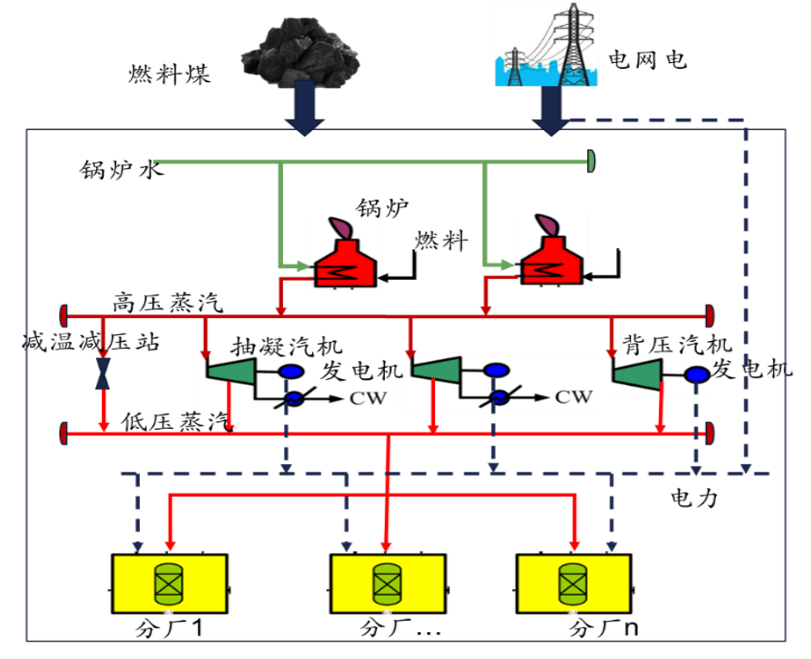

目录

- [前言](#前言)
- [热电联产小科普](#热电联产小科普)
  - [热电厂](#热电厂)
  - [热电联产](#热电联产)
  - [我理解的热电联产](#我理解的热电联产)
- [工业互联网-数字孪生体](#工业互联网-数字孪生体)
  - [工业互联网](#工业互联网)
  - [数字孪生体](#数字孪生体)
- [碳中和-碳达峰-碳交易](#碳中和-碳达峰-碳交易)
- [热电联产产品](#热电联产产品)
  - [问题](#问题)
  - [思路](#思路)
  - [实现](#实现)
- [热电联产项目](#热电联产项目)
  - [项目实施流程](#项目实施流程)
- [热电联产为什么这么难做？](#热电联产为什么这么难做)
- [总结](#总结)
- [参考资料](#参考资料)

# 前言

千言万语在下面这行字里都显得那么苍白无力：在热电联产产品、项目的开发过程中，我熬走了四个产品经理、三任直属领导、四个前端开发、两个测试，三个锅炉、汽机专家，极其惨烈！

再讲个冷笑话：在我给热电产品经理介绍完热电产品后，热电产品经理才能开始设计热电产品，然后我才能在产品经理的指导下搞热电产品。

# 热电联产小科普

## 热电厂

热电联产的维基百科介绍是这样(因为介绍得比我专业得多，所以直接抄作业了)：

> 热力发电厂（英语：thermal power station 或 thermal power plant），简称热电厂，是由蒸汽作原动力的发电厂。水被加热，转变为蒸汽，推动蒸汽轮机运转，带动发电机工作，同时也做一些其他工作（如船舶推进）。当蒸汽通过轮机时，它被冷凝器冷凝，被加热它的场所回收，称为郎肯循环。
> 
> 核电站和大部分火力发电厂（即燃烧化石燃料的发电厂）都是热电厂，全球大部分的电力都是来自这两种电厂。另外地热、生物质能以及小部分太阳能发电站也是热电厂。
> 
> 另外有些时候热电厂一词指热电联产的电厂。

- 热电厂结构

## 热电联产

热电联产的维基百科介绍是这样的(抄作业)：

> 热电联产（又称汽电共生，英语：Cogeneration, combined heat and power，缩写：CHP），是利用热机或发电站同时产生电力和有用的热量。三重热电联产（Trigeneration）或冷却，热和电力联产（CCHP）"是指从燃料燃烧或太阳能集热器中同时产生电和有用的热量和冷却。
> 
> 热电联产是燃料的热力学有效使用。 在单独的电力生产中，一些能量必须作为废热被丢弃，但是在热电联产中，这些热能中的一些被投入使用。所有热电厂在发电期间排放的热量，可以通过冷却塔，烟道气或通过其它方式释放到自然环境中。相反，热电联产捕获一些或全部用于加热的副产物，或者非常接近于工厂，或者特别是在斯堪的纳维亚和东欧，作为用于生活区域加热的热水，温度范围为约80至130℃。这也称为“热电联产区域供热”（combined heat and power district heating, 缩写CHPDH）。小型热电联产厂是分散式发电的一个例子[2]。在中等温度（100-180℃，212-356°F）下的副产物热量也可以用于吸附式制冷机中以进行冷却。
> 
> 热电联产为一种工业制程技巧，利用发电后的废热用于工业制造或是利用工业制造的废热发电，达到能量最大化利用的目的。以先发电式来说由于传统发电机效率只有30%左右，高达70%燃料能量被转化成无用的热，汽电共生能再利用30%的热能于工业，使燃料达到60%效率。系统使用了各种工业机具原本就会在运作中所产生的废热，等于所发的电都是额外的收益。

## 我理解的热电联产

下面这张图是我第一次接触一热电联产场景时产品经理给我展示的图

下面我用自己的话描述一下热电联产的内在逻辑，以及在产品、算法层面可以做的事：

- 1.热电厂通过从外部购买燃煤、燃油等化学燃料来烧锅炉，锅炉通过燃烧化学燃料，
将水进行充分蒸发，产生过热高压蒸汽，并且通过烟气排放系统将化学染料的燃烧物经过脱硫、
脱销、除尘等环保处理，排放到环境中
- 2.锅炉生产的过热高压蒸汽通过高压蒸汽管网进入汽轮发电机组及减温减压站等设备。
高压蒸汽通过汽轮机时带动汽轮机的叶片进行做功将热能转换为动能，
汽轮机叶片做功带动汽轮机轴进行旋转，汽轮机轴的另一端连接着发电机机的轴，
从而汽轮机轴带动发电机的轴进行旋转，发电机的轴旋转会让发电机的线圈切割磁感线，
从而产生电，即整个过程将将热能转换为动能，动能又转换为电能，
同时汽轮发电机组将没有完全做功的蒸汽抽出去进行利用；
而高压蒸汽通过减温减压等设备时，通过在减温减压设备中喷减温水将高压蒸汽进行减温、减压，
此时高压蒸汽转换为品质低的低压、中压蒸汽，这种转换是为了满足下游用汽的需要，
对高压蒸汽的利用不是很充分
- 3.汽轮发电机组的抽汽、排汽以及减温减压设备的抽汽通过进入低压蒸汽管网，
低压蒸汽管网将低压蒸汽运输到热电厂下游的用汽车间，供生产使用，
当然，低压蒸汽也可以通过低压蒸汽管网进入千家网户的暖气片，进行冬季供暖
- 4.汽轮发电机组发的电一方面可以通过电厂内容部电网供下游生产车间使用，
另一方面可以通过外电网进行上网卖电，但如果热电厂下游用电端对电的需求超过热电厂发的电时，
下游也可以通过外部电网进行买电，外部电网的电在峰谷平时间段有着不同的电价，
此时热电厂需要进行抉择，是发电多一点呢，还是买电多一点呢，这时就存在一个决策优化的东西了
- 5.最后，热电厂通常跟下游用汽、用电生产车间的联系不太紧密，毕竟大家都是各自为政，各忙各的，
但也会关注一下下游的用汽、用电情况，以满足下游的需求，但是下游到底需要多少低压蒸汽和电呢？
这时存在一个信息不对称或者信息缺失的点，所以对下游用汽、用电进行预测的想法就有了

# 工业互联网-数字孪生体

## 工业互联网

工业互联网、IoT 听说是这几年的风口，拭目以待

## 数字孪生体

数字孪生体(Digital Twin)

- 商业人士一顿吹，数字孪生体是工业互联网的灵魂！
- 技术工人看一眼，数字孪生体就 TM 一数据库 Schema、工业场景业务定义方式

# 碳中和-碳达峰-碳交易

# 热电联产产品

## 问题

* 热电厂下游用汽、用电预测模型
* 汽机进多少汽、抽多少汽、发多少电合适呢？需要进行汽机调节，并且要优化调节
* 减温减压设备需要抽多少汽呢？是否开减温减压设备呢？
  - 原则：保供下游
  - 机会：提高汽机效率(汽耗)、节省用汽
* 锅炉生产多少汽呢？需要进行锅炉调节，并且需要优化调节
  - 原则：保供汽机
  - 机会：提高锅炉效率、节省燃煤成本
* 是否需要从外电网买电？卖多少电呢？

## 思路

## 实现

# 热电联产项目

## 项目实施流程

1. 热电厂场景调研
    - 我干过
2. 数字孪生体搭建
    - 我干过
3. 数据采集
    - 我干过
4. 模型构建
    - 我干过
5. 模型测试
    - 我干过
6. 应用开发
    - 我干不了
7. 应用测试
    - 我干过
8. 模型应用联调测试
    - 我干过
9. 生产环境部署
    - 我干过
10. 客户培训
    - 我干过
11. 客户试用
    - 我不需要干
12. 项目验证
    - 我干过
13. 项目交付
    - 我干过

# 热电联产为什么这么难做？

* 热电厂供应能源的下游生产车间低压蒸汽、电力使用量预测难做
* 汽机性能曲线难搞
* 汽机、锅炉能源成本优化模型难调
* 成本难算
* 策略消息难以符合工人的习惯
* 工厂管理与软件产品脱钩

# 总结

# 参考资料

* [热电厂流程草图-维基百科](https://zh.wikipedia.org/wiki/%E7%83%AD%E5%8A%9B%E5%8F%91%E7%94%B5%E5%8E%82#/media/File:PowerStation3-zh.svg)