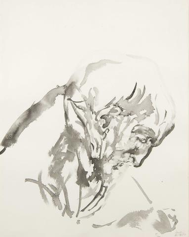

> 纪念 2022 年 1 月 10 日那个寒冷的早晨，纪念我最在乎的那个人，内心对他充满愧疚

## 给父亲 

[北岛]

 
 

在二月寒冷的早晨

橡树终有悲哀的尺寸

父亲，在你照片前

八面风保持圆桌的平静

 

我从童年的方向

看到的永远是你的背影

沿着通向君主的道路

你放牧乌云和羊群

 

雄辩的风带来洪水

胡同的逻辑深入人心

你召唤我成为儿子

我追随你成为父亲

 

掌中奔流的命运

带动日月星辰运转

在男性的孤灯下

万物阴影成双

 

时针兄弟的斗争构成

锐角，合二为一

病雷滚进夜的医院

砸响了你的门

 

黎明如丑角登场

火焰为你更换床单

钟表停止之处

时间的飞镖呼啸而过

 

快追上那辆死亡马车吧

一条春天窃贼的小路

查访群山的财富

河流环绕歌的忧伤

 

标语隐藏在墙上

这世界并没多少改变：

女人转身融入夜晚

从早晨走出男人

##

- [Father painting by Maggi Hambling](https://images1.bonhams.com/image?src=Images/live/2009-02/03/94437009-2-1.jpg&width=640&height=480&autosizefit=1)
- [《My Blood》-- Westlife](https://music.163.com/#/song?id=1399054436)
    
<iframe frameborder="no" border="0" marginwidth="0" marginheight="0" width=330 height=86 src="//music.163.com/outchain/player?type=2&id=1854076006&auto=0&height=66"></iframe>

