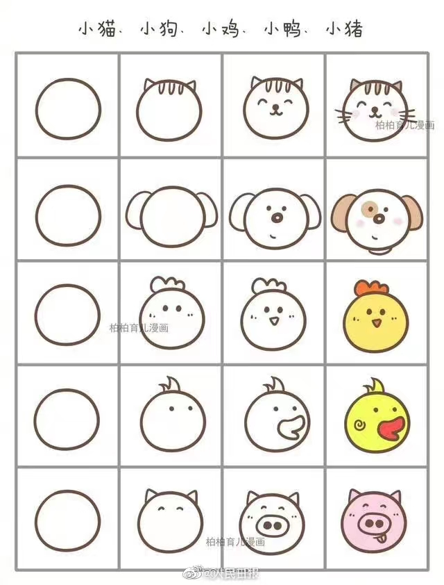
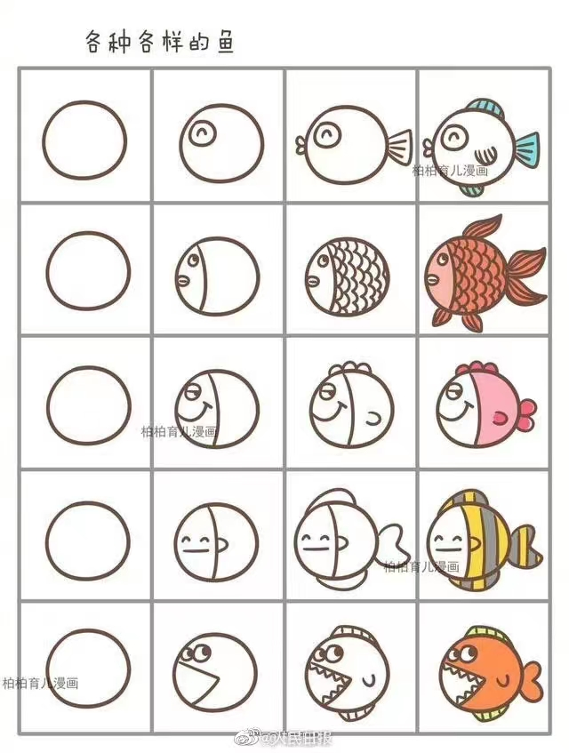
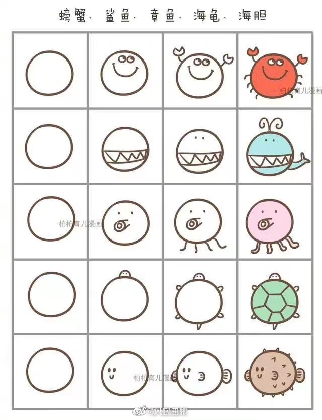
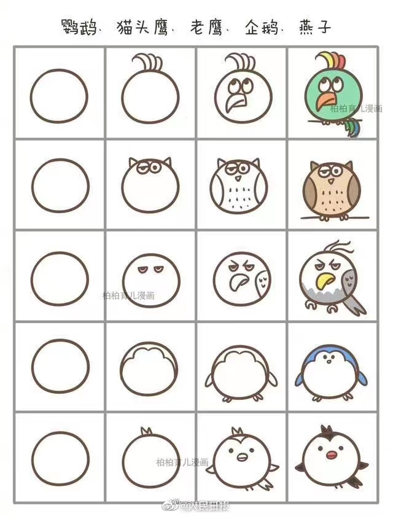
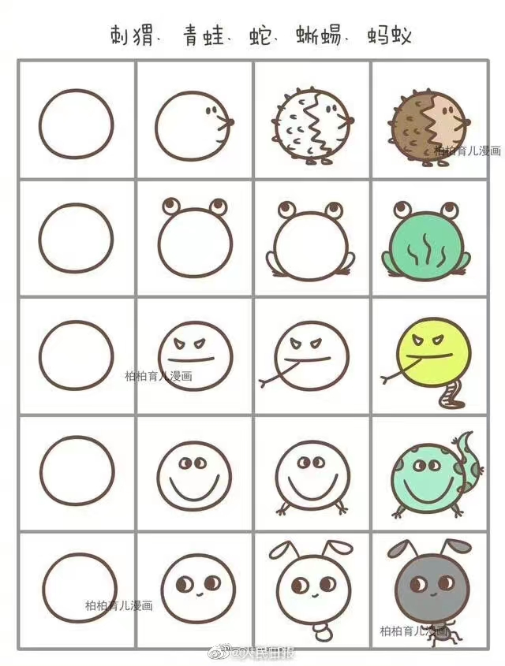
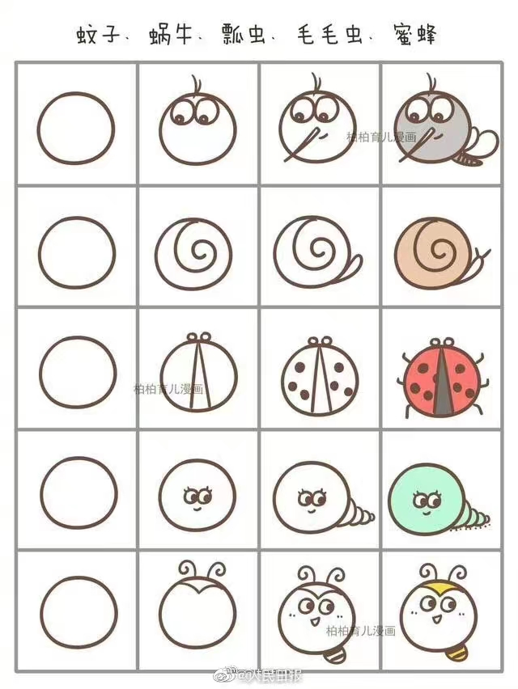
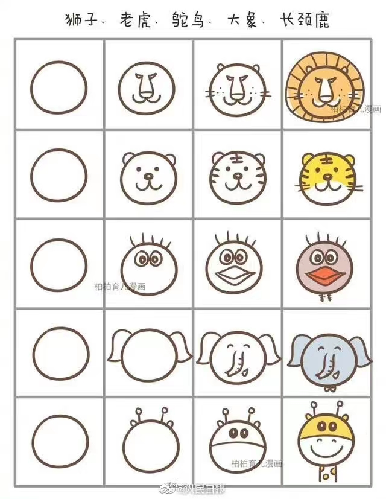
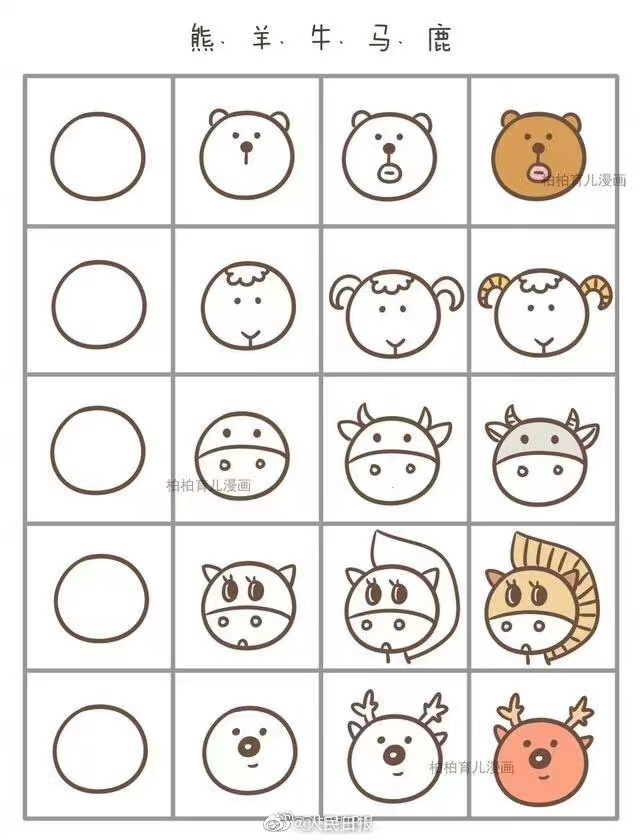
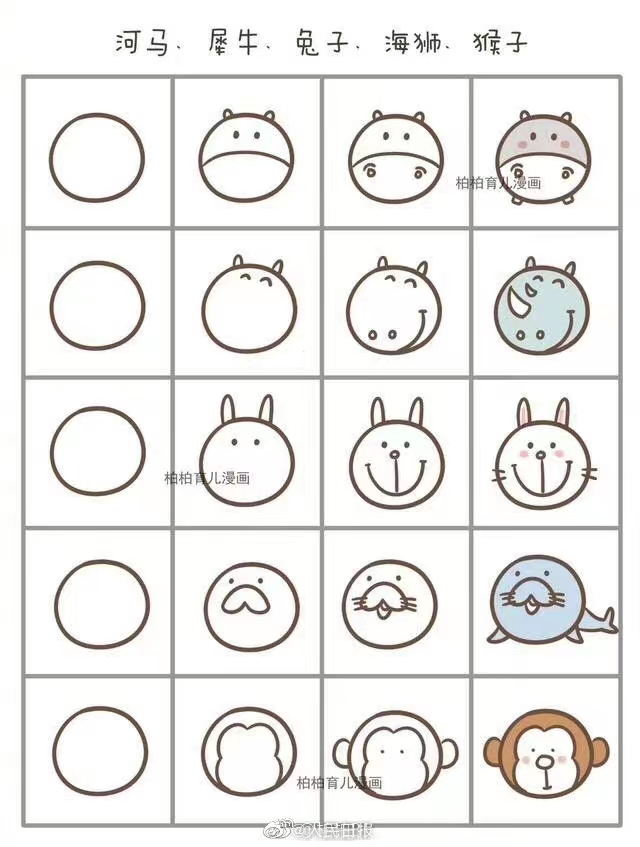

目录

- [为什么要学绘画](#为什么要学绘画)
- [绘画技巧](#绘画技巧)
- [绘画教程](#绘画教程)
- [来源](#来源)

# 为什么要学绘画

今年过年刷微博的时候，偶然看到人民日报发了一组出自“柏柏育儿漫画”的图片，
是教如何画小动物的，虽然是育儿系列，但这组图片突然激发起蕴藏我在体内多年的绘画意识，
一时间感觉绘画也没那么难，关键是操作简单，效果可爱（我 TM 好幼稚啊）

# 绘画技巧

通过我的观察，这组小动物的画法很讲究，每个动物都分四步即可完成：

1. 都从画一个小圆圈开始。让我想到了一个知识点：
木板年画中人物可爱的精髓就是：**脑袋大，身体小**；
2. 基本是加上脸形、耳朵、眼睛，嘴巴、鼻子，有些器官可能需要在第三步完成；
3. 加上鼻子、嘴巴、手、脚、腿，有些器官可能在第二步已经完成；
4. 加上小细节及上色。

# 绘画教程

这里先上原图(带水印)，后续我准备一下本子和画笔，把自己的作品贴上来（我 TM 真的好幼稚啊）：

- 第一组，家里能养的，有些是可以吃的

- 第二组，水里能游的，家里也可以养，也可以吃

- 第三组，河里的，海里的，能吃的，不能吃的

- 第四组，天上飞的，有翅膀不能飞的

- 第五组，地上爬的、跳的、跑的

- 第六组，额，有害虫，有益虫

- 第七组，动物园能看到的，非洲的，山上的

- 第八组，四条腿的，能跑、能跳

- 第九组，自己看

# 来源

- 微博 人民日报
- 柏柏育儿漫画
