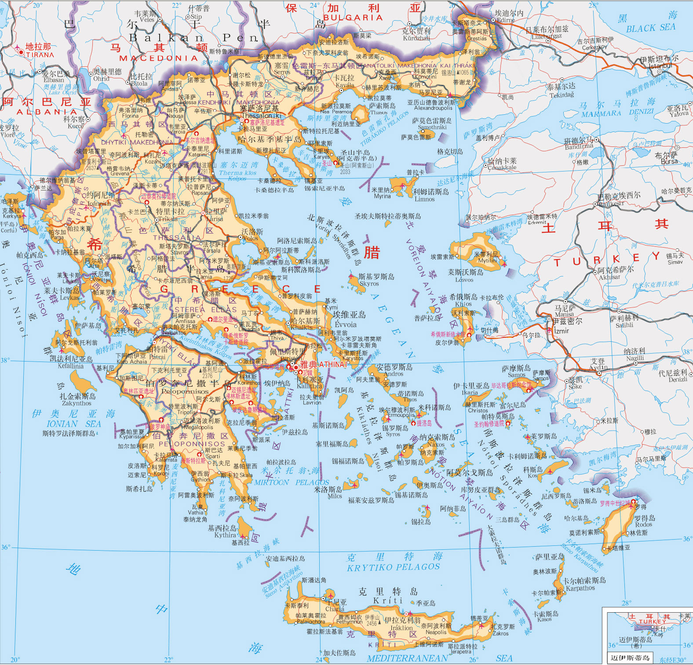

目录

- [导言：哲学的作用](#导言哲学的作用)
  - [哲学的内容](#哲学的内容)
    - [逻辑学:](#逻辑学)
    - [美学](#美学)
    - [伦理学](#伦理学)
    - [政治学](#政治学)
    - [形而上学](#形而上学)
  - [为什们要研究哲学家？](#为什们要研究哲学家)
- [柏拉图](#柏拉图)
  - [希腊的地理位置](#希腊的地理位置)
    - [斯巴达](#斯巴达)
    - [雅典](#雅典)
    - [波斯战争](#波斯战争)
  - [哲学的诞生](#哲学的诞生)
    - [物理学性质的哲学](#物理学性质的哲学)
    - [智者学派](#智者学派)
  - [伯罗奔尼撒战争](#伯罗奔尼撒战争)
  - [苏格拉底](#苏格拉底)
    - [形象](#形象)
    - [学生](#学生)
    - [家庭](#家庭)
    - [思想](#思想)
  - [前期的柏拉图](#前期的柏拉图)
  - [伦理学问题](#伦理学问题)
    - [正义大讨论](#正义大讨论)
    - [伦理学的本质问题](#伦理学的本质问题)
  - [政治学问题](#政治学问题)
    - [柏拉图心中的理想国](#柏拉图心中的理想国)
  - [心理学问题](#心理学问题)
- [亚里士多德和希腊科学](#亚里士多德和希腊科学)
  - [历史背景](#历史背景)
- [弗朗西斯·培根](#弗朗西斯培根)
- [斯宾诺莎](#斯宾诺莎)
- [伏尔泰和法国启蒙运动](#伏尔泰和法国启蒙运动)
- [伊曼努尔·康德和德国唯心主义](#伊曼努尔康德和德国唯心主义)
- [叔本华](#叔本华)
- [赫伯特·斯宾塞](#赫伯特斯宾塞)
- [弗里德里希·尼采](#弗里德里希尼采)
- [现代欧洲哲学家：伯格森、克罗齐和罗伯特·罗素](#现代欧洲哲学家伯格森克罗齐和罗伯特罗素)
- [当代美国哲学家：桑塔亚纳、詹姆斯和杜威](#当代美国哲学家桑塔亚纳詹姆斯和杜威)
- [书籍](#书籍)

# 导言：哲学的作用

> 哲学使人愉悦，即使是形而上学的幻景也蕴含诱惑，每个学习者都能体会得到，
> 的直到粗粝的生存需求将我们从思想的高峰拽下，拋入生活的撕扯琐碎中。

## 哲学的内容

哲学包含以下五门学科：逻辑学、美学、伦理学、政治学和形而上学

### 逻辑学: 

逻辑学探究的是思考与研究的理想方法：观察和内省、推理和归纳、假设和实验、
分析和综合——这些人类行为的形式正式逻辑学试图解释和提供指引的领域。

对大多数人而言，这是一门无聊的学科，然而人类思想史上所有的里程碑式
的事件皆指向人们在思考和研究上的方法论改造。

### 美学

美学研究理想的形式，即美，是艺术的哲学。

### 伦理学

伦理学研究理想的行为方式

苏格拉底认为，知识的最高层次是能够辨识善恶，是关于生活的智慧。

### 政治学

政治学研究理想的社会组织形式(它并非如人们想象的那样，是一门意在传授截取及保持政权的艺术和科学)；

君主制、贵族制、民主制、社会主义、无政府主义、女权主义——这些都是政治哲学舞台上的角色。

### 形而上学

形而上学研究万物的“终极实在”(与其他形式的哲学不同，它并不视图寻求理想与现实间的妥协与平衡，这也是使得它更难为世人所接受)，
其中包括：

* 研究“物质”的真实终极本质的本体论
* 研究“心灵”的哲学心理学
* 研究认知过程中“心灵”与“物质”相互关系的认识论

## 为什们要研究哲学家？

这本书书并不是一部完整的哲学史，只是围绕即为主要的哲学家，
以讲故事的形式，对其思辨哲学进行考察，以期达到知识人性化的目的。

爱默生曾这样问道，“你知道真正的学者的内心秘密吗？”， 
他说：“每个人身上都有值得我学习的东西，从这个意义上说，我就是他的学生。”
既然如此，我们就可以秉承这种思想去向那些伟大的哲人学习，而不会感到自尊心受伤了！

我们可以继续沾沾自喜了，因为爱默生还说过，每每聆听圣人之声便经历一次一种奇异的似曾相识感，
仿佛在遥远的青年时代，我们年轻的头脑中也曾出现过这些声音，
只不过当时我们既无能力也无勇气将它们表达出来罢了。

静下心来品读这些先贤，宽恕他们偶尔的过失并虚心学习他们迫切想传授给我们的知识吧。
苏格拉底教导克利托道：“理智起来吧，不要在意教授哲学的老师是好是坏，
你只需要思考哲学本身，对她进行细致而公正的研究。假若哲学为恶，那么你应说服所有人远离她，
假若哲学确如我所信奉的那样，那么请你追随她并效力于她，而且心甘情愿。”，

# 柏拉图

## 希腊的地理位置

* 雅典
* 斯巴达

### 斯巴达

### 雅典

### 波斯战争

公元前 490 年至前 470 年，斯巴达提供陆军，雅典提供海军，两者联合兵力，
粉碎了波斯人试图将希腊变为其亚洲帝国的一个殖民地的野心。

战争结束后，斯巴达解散了军队，经历了战后不可避免的经济混乱；
雅典则将海军打造成一直商船队伍，摇身一变成为当时最伟大的商贸城市之一。

各路人马在雅典汇集，各种宗教和习俗于此交融，
而**人与人之间的合作和竞争则激发了人们的比较、分析和思考**。

## 哲学的诞生

在雅典，传统和教条在这种多元文化频频冲撞的环境中相互制衡，维持在最低限度，
因为面对一千种信仰的时候，人们往往哪一种也不愿相信。

1. 生意人的秉性让他们质疑每一条所谓的信条
2. 生意人开始发展科学
3. 复杂的贸易催生了数学
4. 不断膨胀的航海野心也促使天文学蓬勃发展
5. 日益增多的财富让一部分人着手研究与猜想，瞭望星空值为知晓四之方向，更希望求得对无限宇宙之谜的一份了解

所以古希腊的第一批哲人是天文学家。

人们的胆子越来越大，开始尝试对一些过去被归结为超自然力的现象进行解释。
于是幻术和宗教仪式逐渐让位于科学和对自然的控制；哲学亦由此诞生。

### 物理学性质的哲学

起初的哲学是物理学性质的，它探索构成万物最终的、不可分割的成分究竟是什么。
这股思潮的发展过程如下：

* 德谟克利特的唯物论：实际上，世上除原子与虚空之外，别无它物。
* 柏拉图时代悄然流传
* 伊壁鸠鲁期间呈现于世
* 卢萊修发扬光大

### 智者学派

古希腊哲学最具代表性、最富生命力的篇章成形于智者学派:

* 他们是云游四方的智慧大师。
* 他们重视内省，考量自身的思想和本质，但非外在的物化世界
* 他们全都聪慧非凡，譬如高尔基亚和希庇亚斯
* 他们大多思想深邃，譬如普罗泰戈拉和普罗狄库
* 对于今天我们仍在人类心灵和行为的哲学性探讨中讨论或注释的几乎每一个问题，他们都意识到了、讨论过了
* 他们无所不问，面对宗教或政治禁忌亦毫不避讳，勇敢地用理性辩论去检验当时的一切信条和制度

政治方面分为两派：

* 卢梭：坚持性本善，文明本恶，坚持人生而平等，后天的不平等则完全由按阶级划分的社会制度导致，
  法律则是强者用以压制和统治弱者的发明
* 尼采：认为人的本性无所谓善恶，人一出生即不平等，到的是弱者用来牵制强者的工具，
  权利是最高的德行，是人类职至高的追求，贵族制才是最有效的、最自然的政府组织形式

## 伯罗奔尼撒战争

在长达二十多年的伯罗奔尼撒战争中，斯巴达军队战胜了雅典海军，
雅典的赛提亚领导的寡头政权借战争失利之机宣布泛起民主，
并暗地里赞赏斯巴达的贵族制政府。最终开展富人革命，反对在战争中执政的“民主”政党。
但是革命失败了，赛提亚也战死沙场。

- 老师：苏格拉底
    - 学生：
        - 赛提亚(柏拉图的叔伯)--贵族
        - 柏拉图--贵族

## 苏格拉底

### 形象

### 学生

### 家庭

### 思想

## 前期的柏拉图

## 伦理学问题

### 正义大讨论

苏格拉底：你认为财富给你带来的最大福祉是什么？

克法路斯(富裕贵族)：财富之所以令他感到幸福，主要因为财富使他慷慨大方、诚信正义。

苏格拉底：你所说的正义指什么？-- 下定义是最困难的，也是思维清晰程度和逻辑推理能力最严格的测试和练习。

...

克法路斯(富裕贵族)：你应该试着去回答而不是去发问，...，因为很多人只会发问而不能回答。

苏苏格拉底：我认为强权就是公理，正义是强者的利益...不同形式的政府，不论是民主制、贵族制还是独裁制，
制定法律时都只着眼于他们自己的利益。这些法律，作为满足统治者利益的工具，被塑造成‘正义’的形象颁布给臣民，
同时对违背这些法律的人严惩不怠，并贴上‘非正义’的标签...我指的是大范围的非正义。这在独裁制中表现得最为明显，
证券通过欺诈和暴力掠夺人民的全部财产。

### 伦理学的本质问题

伦理学中遇到的最本质的问题，也是道德行为理论的核心：

* 什么是正义？
* 我们应该追求正义，还是权力？
* 善良与强大，哪个更好？

## 政治学问题

柏拉图说，若人心简单，那么正义也将是一件简单的事。这样的话，社会有一个无政府主义者的共产主义就足够令人满足了。

### 柏拉图心中的理想国

## 心理学问题

# 亚里士多德和希腊科学

## 历史背景

* 诞生地：雅典城北二百公里左右的马其顿城市塔基啦
* 父亲：马其顿国王、亚历山大祖父阿敏塔斯的朋友和御医
* 生长环境：在浓郁的医学氛围中长大，有着一切机会朝科学探索的路途前行，从一开始他即注定要称为科学的奠基者
* 青年时期：前往雅典师从柏拉图学习哲学。我们的哲学家终于还是落定在柏拉图学院安静的树荫下了
* 柏拉图门下：两人皆为天才。众所周知，天才是绝不会轻易同意另一位天才的意见的，这就像炸药遇上了明火
* 建立图书馆：在欧里庇得斯之后唯一搜集图书、构建起一整座图书馆的人；而他对人类学术文明的贡献之一就是确立了图书馆书籍分类的总原则
* 

# 弗朗西斯·培根

# 斯宾诺莎

# 伏尔泰和法国启蒙运动

# 伊曼努尔·康德和德国唯心主义

# 叔本华

# 赫伯特·斯宾塞

# 弗里德里希·尼采

# 现代欧洲哲学家：伯格森、克罗齐和罗伯特·罗素

# 当代美国哲学家：桑塔亚纳、詹姆斯和杜威

# 书籍

* 哲学的故事, [美] 威尔·杜兰特 著

