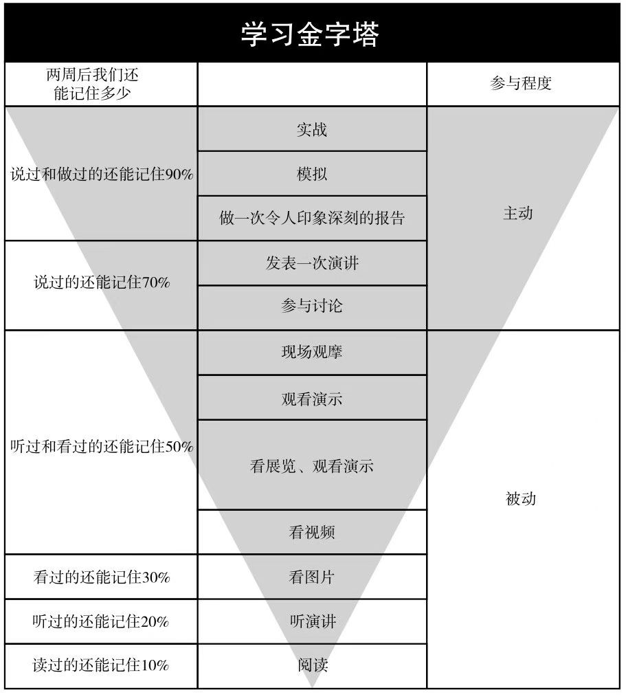

## 学习的原则和本质

学习时，我们可能会感到茫然，或者无从下手，也可能不知道这个知识到底有什么用；
甚至在学习过程中，不知道自己已经学到了哪里、离真正掌握还有多远。

学习知识时，可以先问自己三个问题：

- 它的本质是什么？
- 它的第一原则是什么？
- 它的知识结构是怎样的？

## 本质是什么

很多知识背后都有更底层、更稳定的规律。越接近本质的内容，通常越不容易随着时间变化。

所以，学习时要尽量抓住那些本质的、不过时的东西，这些才是最稳定的支点。

## 第一原则是什么

“第一原则”听起来和刚才说的“了解本质”有点冲突啊？
但实际上并不冲突。“第一原则”强调的是：学习一项知识时，心里要有目标、原则和大方向。

“了解本质”是说我们也要知道这项知识它的整体定位和其背后都是什么。
至于那些更深层的本质问题，可以在后续再一点点深入理解。

## 知识体系是什么

知识体系，顾名思义，就是整体脉络。

一个知识体系可以帮我们在头脑中建立一个整体的框架，
其实就像一本书的目录大纲，一门课的思维导图一样，
多去了解下这些内容，会帮助我们很好地建立一个知识体系。

另外，某些知识可能并没有现成的体系，这时也要尝试自己搭建结构。

这里有一个小技巧，学习一个领域知识的时候，时时把“最终能写出一篇漂亮的综述”放在大脑中提醒自己，
这有助于我们在阅读过程中，有意识地整理知识的结构、本质和重点。经过整理之后，理解也会更深刻。

## 学习金字塔

