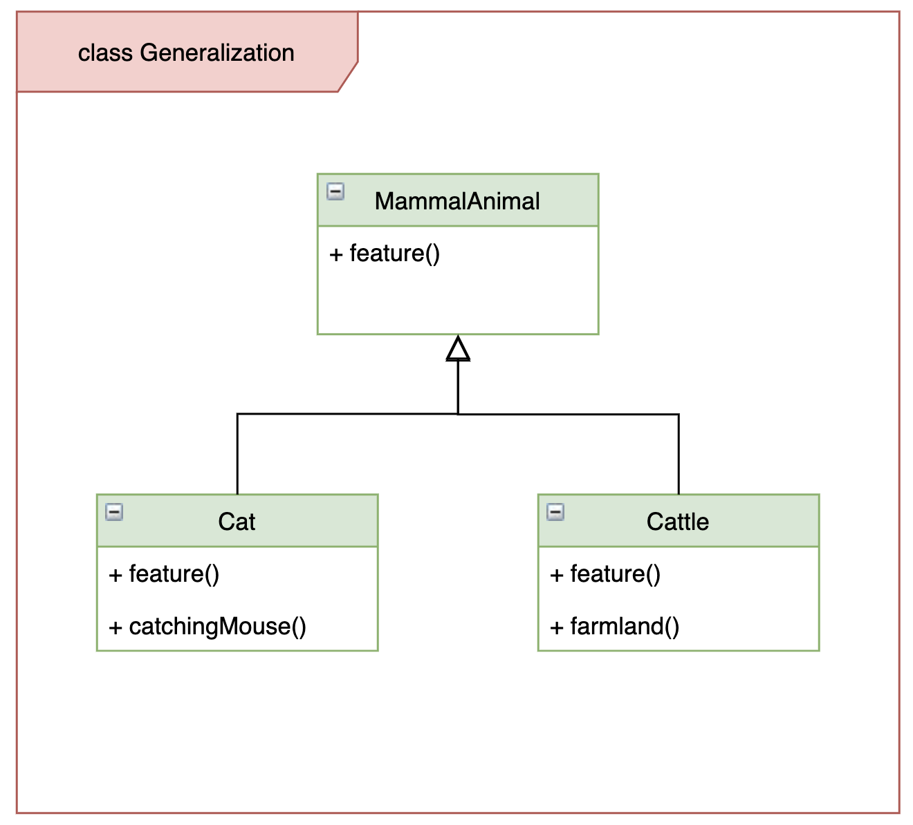
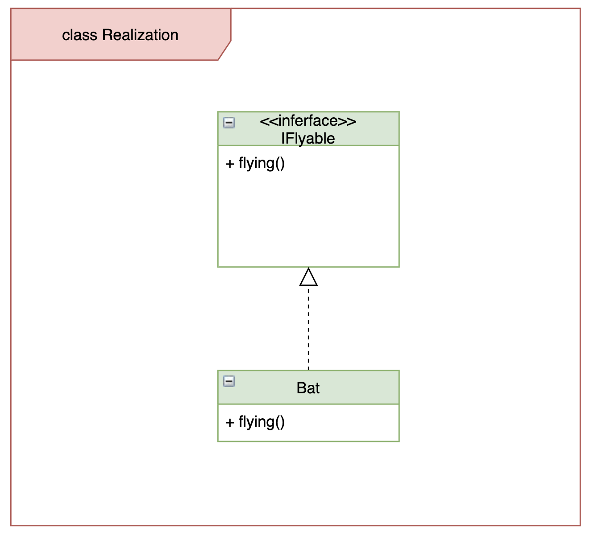
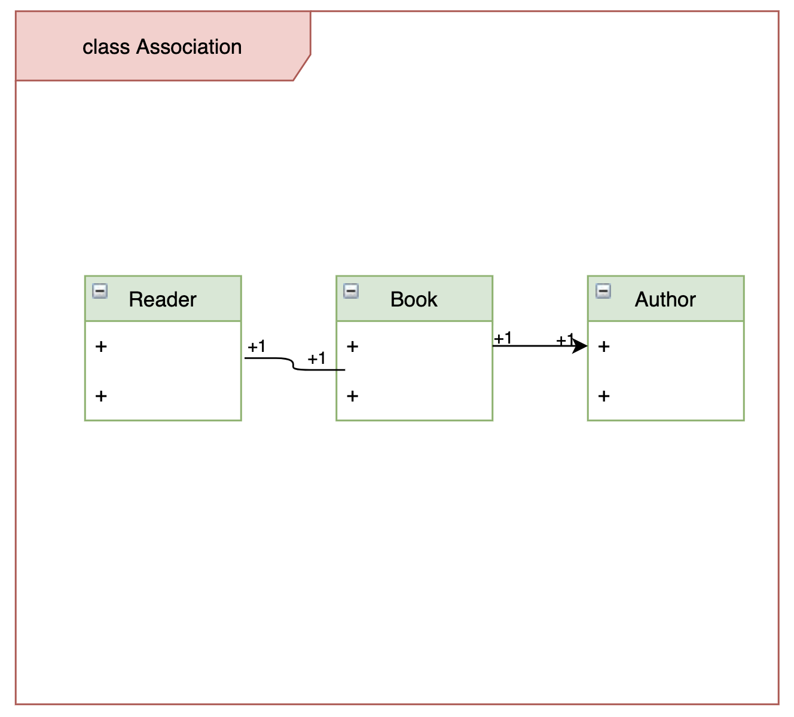

# UML 

UML, Unified Modeling Language, 统一建模语言, 
它是由一整套图组成的标准化建模语言, 
用于帮助系统开发人员阐明、设计和构建软件系统. 

UML 的这一整套图被分为两组: 

- 结构性图
   - 类图
   - 组件图
   - 部署图
   - 对象图
   - 包图
   - 组合结构图
   - 轮廓图
- 行为性图
   - 用例图
   - 流程图
   - 状态机图
   - 序列图
   - 通信图
   - 交互图
   - 时序图

# 类图

类图是应用最广泛的一种图, 经常被用于软件架构设计中. 
类图用于表示不同的实体(人、事物、数据), 以及他们彼此之间的关系. 
该图描述了系统中对象的类型以及它们之间存在的各种静态关系, 
是一切面向对象方法的核心建模工具. 

UML 类图中最常见的几种关系有: 

- 泛化(Generalization)
- 实现(Realization)
- 组合(Composition)
- 聚合(Aggregation)
- 关联(Association)
- 依赖(Dependency)

这些关系的强弱顺序为: 泛化 = 实现 > 组合 > 聚合 > 关联 > 依赖

- 泛化(Generalization)
   - 泛化是一种继承关系, 表示一般与特殊的关系, 它指定了子类如何特化父类的所有特征和行为

- 实现(Realization)
   - 实现是一种类与接口的关系, 表示类是接口所有特征和行为的实现

- 组合(Composition)
   - 组合表示整体与部分的关系, 但部分离开整体后无法单独存在. 因此, 组合与聚合相比是一种更强的关系

- 聚合(Aggregation)
   - 聚合是整体与部分的关系, 部分可以离开整体而单独存在

- 关联(Association)
   - 关联是一种拥有关系, 它使一个类知道另一个类的属性和方法. 关联可以是双向的, 也可以是单向的

- 依赖(Dependency)
   - 依赖是一种使用的关系, 即一个类的实现需要另一个类的协助, 所以尽量不要使用双向的互相依赖

