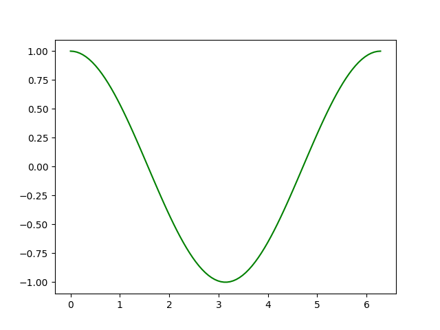
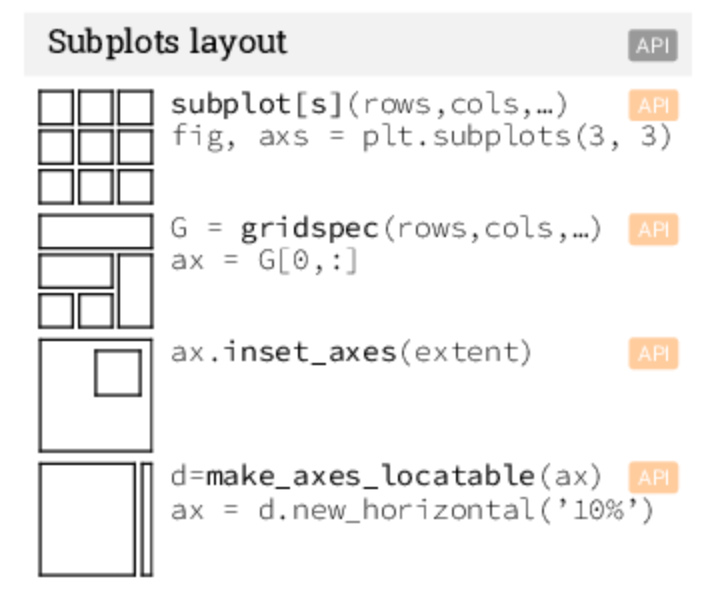
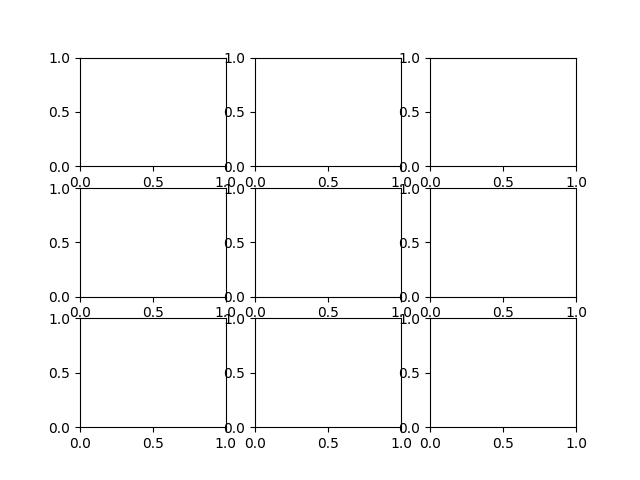
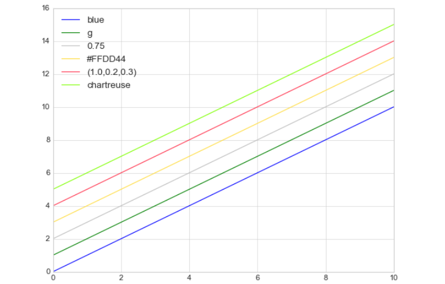
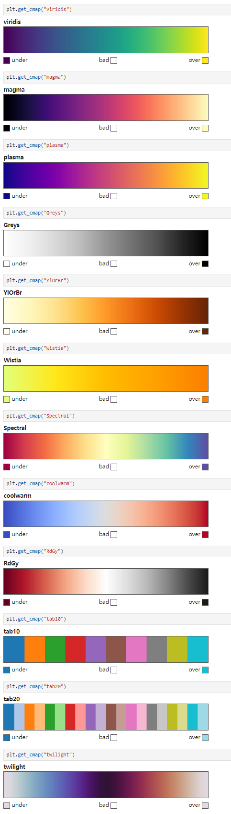

<style>
details {
    border: 1px solid #aaa;
    border-radius: 4px;
    padding: .5em .5em 0;
}
summary {
    font-weight: bold;
    margin: -.5em -.5em 0;
    padding: .5em;
}
details[open] {
    padding: .5em;
}
details[open] summary {
    border-bottom: 1px solid #aaa;
    margin-bottom: .5em;
}
img {
    pointer-events: none;
}
</style>

<details><summary>目录</summary><p>

- [一个 Plot 的生命周期](#一个-plot-的生命周期)
- [快速开始](#快速开始)
- [一张统计图的结构](#一张统计图的结构)
- [图形 API](#图形-api)
    - [Figure](#figure)
        - [Figure class](#figure-class)
        - [Axes class](#axes-class)
        - [Axis class](#axis-class)
        - [Artist class](#artist-class)
    - [Subplots layout](#subplots-layout)
        - [API](#api)
        - [subplots](#subplots)
        - [gridsepc](#gridsepc)
        - [inset\_axes](#inset_axes)
        - [make\_axes\_locatable](#make_axes_locatable)
- [Matplotlib 开发环境](#matplotlib-开发环境)
    - [Python Script](#python-script)
    - [IPython shell](#ipython-shell)
    - [IPython Notebook](#ipython-notebook)
- [Matplotlib 编程接口](#matplotlib-编程接口)
    - [pyplot 接口](#pyplot-接口)
        - [API](#api-1)
        - [示例](#示例)
    - [OOP 接口](#oop-接口)
        - [API](#api-2)
        - [示例](#示例-1)
    - [GUI 应用程序中嵌入 Matplotlib](#gui-应用程序中嵌入-matplotlib)
    - [最佳实践](#最佳实践)
- [Matplotlib 个性化](#matplotlib-个性化)
    - [rcParams](#rcparams)
        - [API](#api-3)
        - [配置选项](#配置选项)
        - [全局设置](#全局设置)
        - [临时设置](#临时设置)
    - [style sheets](#style-sheets)
        - [API](#api-4)
        - [所有样式](#所有样式)
        - [全局样式](#全局样式)
        - [临时样式](#临时样式)
    - [matplotlibrc file](#matplotlibrc-file)
- [Matplotlib 图形保存](#matplotlib-图形保存)
    - [图像文件格式](#图像文件格式)
    - [保存](#保存)
    - [展示](#展示)
- [基本图形](#基本图形)
    - [plot](#plot)
    - [scatter](#scatter)
    - [bar](#bar)
    - [imshow](#imshow)
    - [contour](#contour)
    - [pcolormesh](#pcolormesh)
    - [quiver](#quiver)
    - [pie](#pie)
    - [text](#text)
    - [fill](#fill)
- [高级图形](#高级图形)
    - [step](#step)
    - [boxplot](#boxplot)
    - [errorbar](#errorbar)
    - [hist](#hist)
    - [violinplot](#violinplot)
    - [barbs](#barbs)
    - [eventplot](#eventplot)
    - [hexbin](#hexbin)
- [Color, Line, Marker](#color-line-marker)
    - [Color](#color)
        - [Sigle Color](#sigle-color)
        - [Colormaps](#colormaps)
    - [Line](#line)
    - [Marker](#marker)
    - [Color 加 Line 和 Marker](#color-加-line-和-marker)
- [Scales](#scales)
- [Projections](#projections)
- [Tick locators](#tick-locators)
- [Tick formatters](#tick-formatters)
- [Ornaments](#ornaments)
- [Event handling](#event-handling)
- [Animation](#animation)
- [Quick reminder](#quick-reminder)
- [函数输入格式](#函数输入格式)
- [Image](#image)
    - [将 image 数据转换为 Numpy array](#将-image-数据转换为-numpy-array)
    - [将 Numpy array 绘制成图片](#将-numpy-array-绘制成图片)
    - [将伪彩色方案应用于图像](#将伪彩色方案应用于图像)
    - [色标参考](#色标参考)
    - [检查特定数据范围](#检查特定数据范围)
    - [数组插值](#数组插值)
</p></details><p></p>

# 一个 Plot 的生命周期

```python
import numpy as np
import matplotlib.pyplot as plt

print(plt.style.available)
plt.style.use("fivethirtyeight")
plt.rcParams.update({
    "figure.autolayout": True,
})


# data
data = {
    'Barton LLC': 109438.50,
    'Frami, Hills and Schmidt': 103569.59,
    'Fritsch, Russel and Anderson': 112214.71,
    'Jerde-Hilpert': 112591.43,
    'Keeling LLC': 100934.30,
    'Koepp Ltd': 103660.54,
    'Kulas Inc': 137351.96,
    'Trantow-Barrows': 123381.38,
    'White-Trantow': 135841.99,
    'Will LLC': 104437.60
}
group_data = list(data.values())
group_names = list(data.keys())
group_mean = np.mean(group_data)


# plot
def currency(x, pos):
    """
    The two arguments are the value and tick position

    Args:
    x ([type]): [description]
    pos ([type]): [description]
    """
    if x >= 1e6:
        s = "${:1.1f}M".format(x * 1e-6)
    else:
        s = "${:1.0f}K".format(x * 1e-3)
    return s

fig, ax = plt.subplots(figsize = (8, 4))
# bar
ax.barh(group_names, group_data)
labels = ax.get_xticklabels()
plt.setp(labels, rotation = 45, horizontalalignment = "right")
# vertical line
ax.axvline(group_mean, ls = "--", color = "r")
# group text
for group in [3, 5, 8]:
    ax.text(
        145000, 
        group, 
        "New Company", 
        fontsize = 10, 
        verticalalignment = "center"
    )
# 标题设置
ax.title.set(y = 1.05)
# 设置X轴限制、X轴标签、Y轴标签、主标题
ax.set(
    xlim = [-10000, 140000], 
    xlabel = "Total Revenue", 
    ylabel = "Company", 
    title = "Company Revenue"
)
# 设置X轴主刻度标签格式
ax.xaxis.set_major_formatter(currency)
# 设置X轴主刻度标签
ax.set_xticks([0, 25e3, 50e3, 75e3, 100e3, 125e3])
# 微调fig
fig.subplots_adjust(right = 0.1)
# 图片保存
print(fig.canvas.get_supported_filetypes())
fig.savefig("sale.png", transparent = False, dpi = 80, bbox_inches = "tight")
plt.show()
```

# 快速开始

```python
def quick_start():
    import numpy as np
    import matplotlib as mpl
    import matplotlib.pyplot as plt

    X = np.linspace(0, 2 * np.pi, 100)
    Y = np.cos(X)

    fig, ax = plt.subplots()
    ax.plot(X, Y, color = "green")

    fig.savefig(
        os.path.join(
            os.path.dirname(__file__), 
            "images/figure.png"
        )
    )
    fig.show()

quick_start()
```



# 一张统计图的结构


# 图形 API

```python
import matplotlib.pyplot as plt

fig, ax = plt.subplots()
```

* 图形
    - Figure: `fig`
    - Axes: `fig.subplots` 
    - Line: `ax.plot`
    - Markers: `ax.scatter`
    - Grid: `ax.grid`
    - Legend: `ax.legend`
    - Spine: `ax.spines`
* 标题 
    - Title: `ax.set_title`
* Y 轴
    - y Axis: `ax.yaxis`
    - ylabel: `ax.set_ylabel`
    - Major tick: `ax.yaxis.set_major_locator`
    - Major tick label: `ax.yaxis.set_major_formatter`
    - Minor tick: `ax.yaxis.set_minor_locator`
* X 轴
    - x Axis: `ax.xaxis`
    - xlabel: `ax.set_xlabel`
    - Minor tick label: `ax.xaxis.set_minor_formatter`

## Figure

> - image 图像
> - graph 图形
> - aritst 可视化元素
> - figure 图形
> - canvas 画布
>
> - axes 数据在图像中的区域
> - data 数据
> 	- plot
> 		- line
> 		- marker
> - Spines 边框
> - axis 坐标轴、坐标轴限制、坐标轴刻度、坐标轴标签、坐标轴刻度标签
> - grid 背景网格
> - legend 图例
> - title 标题

### Figure class

- Figure
    - Axes
    - Artist
    - canvas

```python
fig = plt.fiure()			  # an empty figure with no Axes
fig, ax = plt.subplots()      # a figure with a single Axes
fig, ax = plt.subplots(2, 2) # a figure with a 2x2 grid of Axes
```

### Axes class

- Figure
    - Axes: a plot：data 在 image 中的区域
        - title: `axes.Axes.set_title()`
        - xlim: `axes.Axes.set_xlim()`
        - ylim: `axes.Axes.set_ylim()`
        - x-label: `axes.Axes.set_xlabel()`
        - y-label: `axes.Axes.set_ylabel()`

### Axis class

- Figure
    - Axes
        - Axis
            - 坐标轴(Axis)
                - X axis
                - Y axis
                - ...
            - 坐标轴标签(Axis label)
                - X axis label
                - Y axis label
            - 坐标轴限制(Axis limit)
                - X axis limit
                - Y axis limit
            - 坐标轴刻度(Tick)
                - 主刻度(Major tick)
                - 副刻度(Minor tick)
                - 刻度位置 Locator
            - 坐标轴刻度标签(Tick label)
                - 主刻度标签(Major tick label)
                - 副刻度标签(Minor tick label)
                - 刻度标签格式 Formatter

### Artist class

- 图形中可见的东西都是一个 Artist，包括 Figure、Axes、Axis、Text、Line2D、collections、Patch等对象
- 当一个 figure(图形) 被渲染时，所有的 artist 都被画在 canvas 上
- Artist
    - Figure
        - Axes
            - Axis
            - Text
            - Line2D
            - collections
            - Pathc


## Subplots layout

> Subplots layout，子图布局

### API



### subplots

```python
def subplots_layout():
    fig, ax = plt.subplots(3, 3)
    fig.show()
```



### gridsepc

### inset_axes

### make_axes_locatable

# Matplotlib 开发环境

## Python Script

```python
plt.show()
```

## IPython shell

 
## IPython Notebook

```bash
%matploblib inline
```

# Matplotlib 编程接口

> Matplotlib 的文档和示例同时使用 OO 和 pyplot 方法（它们同样强大），
> 可以随意使用其中任何一种（但是，最好选择其中之一并坚持使用，而不是混合使用它们）。
> 通常，建议将 pyplot 限制为交互式绘图（例如，在 Jupyter 笔记本中），
> 并且更喜欢 OO 风格的非交互式绘图（在旨在作为更大项目的一部分重用的函数和脚本中）。

下面是两个简单的示例：

* pyplot API

```python
fig = plt.figure()
# or plt.figure()
ax = plt.axes()
plt.plot(
    [1, 2, 3, 4],
    [1, 4, 2, 3]
);
```


* 面向对象 API

```python
fig = plt.figure()
ax = plt.axes()
ax.plot(
    [1, 2, 3, 4],
    [1, 4, 2, 3]
);
```

```python
fig, ax = plt.subplots()
ax.plot(
    [1, 2, 3, 4],
    [1, 4, 2, 3]
);
```

## pyplot 接口

> MatLab 风格接口

pyplot 是使 Matplotlib 像 MATLAB 一样工作的函数集合。每个 `pyplot` 函数都会对图形进行一些更改：
例如，创建图形、在图形中创建绘图区域、在绘图区域中绘制一些线条、用标签装饰绘图等。
在 pyplot 函数调用中保留各种状态，以便跟踪当前图形(figure)和绘图区域(plotting area)等内容，并且绘图函数指向当前轴(axes)

### API

* Figure 和 Axes
    - `fig = plt.figure(num = n, figsize = ())`
    - `plt.subplot(m, n ,i)` or `plt.subplot(mni)`
    - `plt.gcf()` 返回当前图形, `matplotlib.figure.Figure` 实例
    - `plt.gca()` 函数返回当前轴, `matplotlib.axes.Axes` 实例
* 基本图形函数
    - `plt.plot(x, y, color, linestyle, marker)`
    - `plt.bar()`
    - `plt.scatter()`
* 辅助函数
    - 标题
        - `plt.suptitle()`
        - `plt.title()`
    - 图例
        - `plt.legend()`
        - `plt.colorbar()`
    - 坐标轴
        - 坐标轴上下限
            - `plt.axis([xmin, xmax, ymin, ymax])`
            - `plt.axis("tight")` 收紧坐标轴，不留空白区域
            - `plt.axis("equal")` 让屏幕上显示的图形分辨率为 1:1，x 轴单位长度与 y 轴单位长度相等
            - `plt.xlim()`
            - `plt.ylim()`
        - 坐标轴标签
            - `plt.xlabel()`
            - `plt.ylabel()`
    - 文本注释
        - `plt.text()`
        - `plt.annotate()`
    - 其他
        - `plt.show()`
        - `plt.grid()`

### 示例

```python
# 图形
fig = plt.figure(num = 2, figsize = (8, 8))
# 坐标轴
# ax = plt.axes()

plt.subplot(211)
plt.plot(x, np.sin(x), label = "sin")
plt.xlabel("x label")
plt.ylabel("y label")
plt.title("Simple Plot")
plt.legend()

plt.subplot(212)
plt.plot(x, np.cos(x), label = "cos")
plt.xlabel("x label")
plt.ylabel("y label")
plt.title("Simple Plot")
plt.legend()
plt.show()

fig.savefig();
```

```python
plt.gcf() # 获取当前图形(figure)
plt.gca() # 获取当前坐标轴(axes)
```

## OOP 接口

### API

* Figure 和 Axes
    - `fig, ax = plt.subplots(nrows, ncols, figsize, sharex, sharey)`
        - `fig, ax = plt.subplots()`  默认 nrow=1, ncols=1
        - `fig, ax = plt.subplots(n)`  默认 nrows=n, ncols=1
        - `fig, ax = plt.subplots(m, n)`
* 基本图形函数
    - `ax.plot(x, y, color, linestyle, marker)`
    - `ax.bar()`
    - `ax.scatter()`
* 辅助函数
    - 标题
        - `ax.set_title()`
    - 图例
        - `ax.legend()`
    - 坐标轴
        - 坐标轴上下限
            - `ax.set_xlim()`
            - `ax.set_ylim()`
        - 坐标轴标签
            - `ax.set_xlabel()`
            - `ax.set_ylabel()`
    - 文本注释
    - 其他
        - `ax.set(xlim, ylim, xlabel, ylabel, title)`

### 示例

```python
# data
x = np.linspace(0, 2, 100)

# plot
fig, ax = plt.subplots(1, 3, figsize = (18, 5), sharey = True)
ax[0].plot(x, x, label = "linear")
ax[0].plot(x, x**2, label = "quadratic")
ax[0].plot(x, x**3, label = "cubic")
ax[0].set_xlabel("x label")
ax[0].set_ylabel("y label")
ax[0].set_title("linear Plot")
ax[0].legend()

ax[1].plot(x, x, label = "linear")
ax[1].plot(x, x**2, label = "quadratic")
ax[1].plot(x, x**3, label = "cubic")
ax[1].set_xlabel("x label")
ax[1].set_ylabel("y label")
ax[1].set_title("quadratic Plot")
ax[1].legend()

ax[2].plot(x, x, label = "linear")
ax[2].plot(x, x**2, label = "quadratic")
ax[2].plot(x, x**3, label = "cubic")
ax[2].set_xlabel("x label")
ax[2].set_ylabel("y label")
ax[2].set_title("cubic Plot")
ax[2].legend();
```

## GUI 应用程序中嵌入 Matplotlib

- 略

## 最佳实践

- 用不同数据绘制同样的图片
- 方法

```python
def my_plotter(ax, data1, data2, param_dict):
    """
    A helper function to make a graph

    Parameters
    ----------
    ax : Axes
        The axes to draw to

    data1 : array
       The x data

    data2 : array
       The y data

    param_dict : dict
       Dictionary of keyword arguments to pass to ax.plot

    Returns
    -------
    out : list
        list of artists added
    """
       out = ax.plot(data1, data2, **param_dict)
    return out
```

- 使用

```python
# data
data1, data2, data3, data4 = np.random.randn(4, 100)
# plot
fig, ax = plt.subplots(1, 1)
my_plotter(ax, data1, data2, {"marker": "x"})
```


```python
# data
data1, data2, data3, data4 = np.random.randn(4, 100)
# plot
fig, ax = plt.subplots(1, 1)
my_plotter(ax, data1, data2, {"marker": "x"})
my_plotter(ax, data3, data4, {"marker": "o"})
```


# Matplotlib 个性化

* rcParams
* style sheets
* matplollibrc file

> 优先级： rcParams > style sheets > matplotlibrc file

## rcParams

> rc: runtime configuration

* rc 设置保存在类字典的变量中 matplotlib.rcParams
* rc 设置对于 matplotlib 库是全局的
* 可以动态改变默认 rc 设置
* rc 设置可以直接修改


### API

* `mpl.rc()`
* `mpl.rcParams`
* `mpl.rc_context()`
* `@mpl.rc_context()`

### 配置选项

```python
rc = dict(mpl.rcParams)
rc_table = pd.DataFrame({
    "param": rc.keys(),
    "value": rc.values(),
})
# rc_table
```

### 全局设置

```python
from cycler import cycler

# lines
mpl.rcParams["lines.linewidth"] = 2
mpl.rcParams["lines.linestyle"] = "--"
mpl.rc("lines", linewidth = 4, linestyle = "--")
# axes
mpl.rcParams["axes.porp_cycle"] = cycler(color = ["r", "g", "b", "y"])
```

### 临时设置

```python
with mpl.rc_context({"lines.linewidth": 2, "lines.linestyle": ":"}):
    plt.plot(data)

@mpl.rc_context({"lines.linewidth": 3, "lines.linestyle": "-"})
def plotting_function():
    plt.plot(data)
```

## style sheets

* `matplotlib.pyplot.style`

### API

* `plt.style`
* `plt.style.available`
* `plt.style.use()`
* `plt.style.context()`

### 所有样式

```python
print(plt.style.available)
```

```
['Solarize_Light2',
 '_classic_test_patch',
 '_mpl-gallery',
 '_mpl-gallery-nogrid',
 'bmh',
 'classic',
 'dark_background',
 'fast',
 'fivethirtyeight',
 'ggplot',
 'grayscale',
 'seaborn-v0_8',
 'seaborn-v0_8-bright',
 'seaborn-v0_8-colorblind',
 'seaborn-v0_8-dark',
 'seaborn-v0_8-dark-palette',
 'seaborn-v0_8-darkgrid',
 'seaborn-v0_8-deep',
 'seaborn-v0_8-muted',
 'seaborn-v0_8-notebook',
 'seaborn-v0_8-paper',
 'seaborn-v0_8-pastel',
 'seaborn-v0_8-poster',
 'seaborn-v0_8-talk',
 'seaborn-v0_8-ticks',
 'seaborn-v0_8-white',
 'seaborn-v0_8-whitegrid',
 'tableau-colorblind10']
```

### 全局样式

```python
plt.style.use("ggplot")
plt.style.use("./images/presentation.mplstyle")
plt.style.use(["dark_background", "presentation"])
```

### 临时样式

```python
with plt.style.context("dark_background"):
    plt.plot(data)
```

## matplotlibrc file

matplotlibrc 文件的位置：

* 当前目录
* `\$MATPLOTLIBRC` 或 `\$MATPLOTLIBRC\matplotlibrc`
* `.matplotlib/matplotlibrc`
* `INSTALL/matplotlib/mpl-data/matplotlibrc`

查看当前加载的 matplotlibrc 文件的位置

```python
mpl.matploblib_fname()
```

```
'D:\\software\\miniconda3\\envs\\pysci\\lib\\site-packages\\matplotlib\\mpl-data\\matplotlibrc'
```

# Matplotlib 图形保存

## 图像文件格式

在 `savefig()` 里面，保存的图片文件格式就是文件的扩展名。
Matplotlib 支持许多图形格式，可以通过 `canvas` 对象的方法查看系统支持的文件格式

```python
fig = plt.figure()
fig.canvas.get_supported_filetypes()
```

```
{'eps': 'Encapsulated Postscript',
 'jpg': 'Joint Photographic Experts Group',
 'jpeg': 'Joint Photographic Experts Group',
 'pdf': 'Portable Document Format',
 'pgf': 'PGF code for LaTeX',
 'png': 'Portable Network Graphics',
 'ps': 'Postscript',
 'raw': 'Raw RGBA bitmap',
 'rgba': 'Raw RGBA bitmap',
 'svg': 'Scalable Vector Graphics',
 'svgz': 'Scalable Vector Graphics',
 'tif': 'Tagged Image File Format',
 'tiff': 'Tagged Image File Format',
 'webp': 'WebP Image Format'}
```

## 保存

```python
fig.savefig("my_figure.png")
```

## 展示

```python
from IPython.display import Image

Image("my_figure.png")
```

# 基本图形

## plot

* 线形图
* 散点图

```python
plot([X], Y, [fmt], color, marker, linestyle)
```

## scatter

散点图

```python
scatter(X, Y, [s]izes, [c]olors, markers, alpha, cmap)
```

## bar

```python
bar[h](x, height, width, bottom, align, color)
```

## imshow

```python
imshow(Z, cmap, interpolation, extent, origin)
```

## contour

```python
contour[f]([X], [Y], Z, levels, colors, extent, origin)
```

## pcolormesh

```python
pcolormesh([X], [Y], Z, vmin, vmax, cmap)
```

## quiver

```python
quiver([X], [Y], U, V, C, units, angles)
```

## pie

```python
pie(Z, explode, labels, colors, raidus)
```

## text

```python
text(x, y, text, va, ha, size, weight, transform)
```

## fill

```python
fill[_between][x](X, Y1, Y2, color, where)
```

# 高级图形

## step

```python
step(X, Y, [fmt], color, marker, where)
```

## boxplot

```python
boxplot(X, notch, sym, bootstrap, widths)
```

## errorbar

```python
errorbar(X, Y, xerr, yerr, fmt)
```

示例：

```python
# data
dx = 0.1
x = np.linspace(0, 10, 50)
dy = 0.8
y = np.sin(x) + dy * np.random.randn(50)

# plot
fig = plt.figure()
plt.errorbar(
    x, y, 
    yerr = dy, 
    xerr = dx
    fmt = ".k", 
    ecolor = "lightgray", 
    elinewidth = 3, 
    capsize = 0
)
```


## hist

```python
hist(X, bins, range, density, weights)
```

## violinplot

```python
violinplot(D, positions, widths, vert)
```

## barbs

```python
barbs([X], [Y], U, V, C, length, pivot, sizes)
```

## eventplot

```python
eventplot(positions, orientation, lineoffsets)
```

## hexbin

```python
hexbin(X, Y, C, gridsize, bins)
```


# Color, Line, Marker

## Color

### Sigle Color

常用单色：

| character | color
|-------|---------|
| `'b'` | `blue` |
| `'g'` | `green` |
| `'r'` | `red` |
| `'c'` | `cyan` |
| `'m'` | `magenta` |
| `'y'` | `yellow` |
| `'k'` | `black` |
| `'w'` | `white` |

```python
# data
x = np.linspace(0, 10, 1000)

# plot
fig, ax = plt.subplots()
ax.plot(x, x + 0, color='blue', label = "blue")  # 标准颜色名称
ax.plot(x, x + 1, color='g', label = "g")  # 缩写颜色代码（rgbcmyk）
ax.plot(x, x + 2, color='0.75', label = "0.75")  # 范围在0~1的灰度值
ax.plot(x, x + 3, color='#FFDD44', label = "#FFDD44")  # 十六进制（RRGGBB，00~FF）
ax.plot(x, x + 4, color=(1.0,0.2,0.3), label = "(1.0,0.2,0.3)")  # RGB元组，范围在0~1
ax.plot(x, x + 5, color='chartreuse', label = "chartreuse")  # HTML颜色名称
ax.legend(loc = "best");
```



### Colormaps

* `plt.get_cmap(name)`
    - Uniform
        - `viridis`
        - `magma`
        - `plasma`
    - Sequential
        - `Greys`
        - `YlOrBr`
        - `Wistia`
    - Diverging
        - `Spectral`
        - `coolwarm`
        - `RdGy`
    - Quanlitative
        - `tab10`
        - `tab20`
    - Cyclic
        - `twilight`



## Line

`linestyle` 或者 `ls`：

| character   |    description        |       |
|-------------|-----------------------|-------|
| `'-'`      |    solid line style |  实线    |
| `'--'`      |   dashed line style |  实点线 |
| `'-.'`      |   dash-dot line style |  虚线 |
| `':'`      |    dotted line style |  点划线 |

```python
# data
x = np.linspace(0, 10, 1000)

# plot
fig, ax = plt.figure(), plt.axes()
plt.plot(x, x + 0, linestyle='solid', label = "solid")
plt.plot(x, x + 1, linestyle='dashed', label = "dashed")
plt.plot(x, x + 2, linestyle='dashdot', label = "dashdot")
plt.plot(x, x + 3, linestyle='dotted', label = "dotted")
plt.plot(x, x + 4, linestyle='-', label = "-") # 实线
plt.plot(x, x + 5, linestyle='--', label = "--") # 虚线
plt.plot(x, x + 6, linestyle='-.', label = "-.") # 点划线
plt.plot(x, x + 7, linestyle=':', label = ":") # 实点线
plt.legend(loc = "best");
```


## Marker

`marker`:

| character |       description |
|----------|--------------------|
| `'.'`   |      point marker  |
| `','`   |      pixel marker  |
| `'o'`   |      circle marker  |
| `'v'`   |      triangle_down marker  |
| `'^'`   |      triangle_up marker  |
| `'<'`   |      triangle_left marker  |
| `'>'`   |      triangle_right marker  |
| `'1'`   |      tri_down marker  |
| `'2'`   |      tri_up marker  |
| `'3'`   |      tri_left marker  |
| `'4'`   |      tri_right marker  |
| `'8'`   |      octagon marker  |
| `'s'`   |      square marker  |
| `'p'`   |      pentagon marker  |
| `'P'`   |      plus (filled) marker  |
| `'*'`   |      star marker  |
| `'h'`   |      hexagon1 marker  |
| `'H'`   |      hexagon2 marker  |
| `'+'`   |      plus marker  |
| `'x'`   |      x marker  |
| `'X'`   |      x (filled) marker  |
| `'D'`   |      diamond marker  |
| `'d'`   |      thin_diamond marker  |
| `'\|'`   |      vline marker  |
| `'_'`   |      hline marker  |


示例：

```python
fig, ax = plt.subplots(figsize = (12, 12))
rng = np.random.RandomState(0)
for marker in [".", ",", "o", "v", "^", "<", ">", 
               "1", "2", "3", "4", "8", "s", "p", "P", 
               "*", "h", "H", "x", "X", "+", "d", "D", 
               "|", "_"]:
    plt.plot(rng.rand(5), rng.rand(5), marker, label = f"marker={marker}")
    plt.legend(numpoints = 1)
    plt.xlim(0, 1.8)
```

marker 参数：

```python
# data
x = np.linspace(0, 10, 30)
y = np.sin(x)

# plot
fig, ax = plt.subplots(figsize = (5, 5))
plt.plot(
    x, y, "-p", color = "gray", linewidth = 4,
    markersize = 15,
    markerfacecolor = "white",
    markeredgecolor = "gray",
    markeredgewidth = 2,
)
```

## Color 加 Line 和 Marker

使用示例：

* `'b'`    # blue markers with default shape
* `'or'`   # red circles
* `'-g'`   # green solid line
* `'--'`   # dashed line with default color
* `'^k:'`  # black triangle_up markers connected by a dotted line

```python
# data
x = np.linspace(0, 10, 1000)

# plot
fig, ax = plt.figure(), plt.axes()
plt.plot(x, x + 0, '-g') # 绿色实线
plt.plot(x, x + 1, '--c') # 青色虚线
plt.plot(x, x + 2, '-.k') # 黑色点划线
plt.plot(x, x + 3, ':r'); # 红色实点线
plt.plot(x, x + 4, 'or');
plt.plot(x, x + 5, '^k');
plt.legend(loc = "best");
```

# Scales

`ax.set_[xy]scale(scale, ...)`

* linear
* log
* symlog
* logit

# Projections

`subplot(..., projection = p)`

* p = "polar"
* p = "3d"
* p = Orthographic() `from cartopy.crs import Cartographic`

# Tick locators

```python
from matplotlib import ticker

ax.[xy]axis.set_[minor|major]_locator(locator)
```

`locator`:

* ticker.NullLocator()
* ticker.MultipleLocator(0.5)
* ticker.LinearLocator(numticks = 3)
* ticker.IndexLocator(base = 0.5, offset = 0.25)
* ticker.AutoLocator()
* ticker.MaxNLocator(n = 4)
* ticker.LogLocator(base = 10, numticks = 15)

# Tick formatters

```python
from matplotlib import ticker

ax.[xy]axis.set_[minor|major]_formatter(formatter)
```

`formatter`:

* ticker.NullFormatter()
* ticker.FixedFormatter(["zeor", "one", "two", ...])
* ticker.FuncFormatter(lambda x, pos: "[%.2f]" % x)
* ticker.FormatStrFormatter(">%d<")
* ticker.ScalarFormatter()
* ticker.StrMethodFormatter("{x}")
* ticker.PercentFormatter(xmax = 5)

# Ornaments

* `ax.legend(...)`
* ax.colorbar()
* ax.annotate()

# Event handling

```python
import matplotlib.pyplot as plt

fig, ax = plt.subplots()

def on_click(event):
    print(event)

fig.canvas.mpl_connect("button_press_event", on_click)
```

# Animation

```python
import matplotlib.animation as mpla

T = np.linspace(0, 2 * np.pi, 100)
S = np.sin(T)
line, = plt.plot(T, S)

def animate(i):
    line.set_ydata(np.sin(T + i / 50))

anim = mpla.FuncAnimation(plt.gcf(), animate, interval = 5)
plt.show()
```

# Quick reminder

```python
import matplotlib.pyplot as plt

fig, ax = plt.subplots()

ax.grid()
ax.set_[xy]lim(vmin, vmax)
ax.set_[xy]label(label)
ax.set_[xy]ticks(ticks, [labels])
ax.set_[xy]ticklabels(labels)
ax.set_title(title)
ax.tick_params(width = 10, ...)
ax.set_axis_[on|off]()

fig.suptitle(title)

fig.tight_layout()

plt.gcf(), plt.gca()

mpl.rc("axes", linewidth = 1, ...)

[fig|ax].patch.set_alpha(0)

text = r"$frac{-e^{i\pi}}{2^n}"
```

# 函数输入格式

- numpy.array
    - pandas data object => np.array
    - numpy.matrix => np.array

```python
# pandas.DataFrame 转换
pandas_dataframe = pandas.DataFrame()
array_inputs = pandas_datarframe.values

# numpy.matrix 转换
numpy_matrix = numpy.matrix([1, 2], [3, 4])
array_inputs = numpy.asarray(numpy_matrix)
```

- numpy.ma.masked_array

# Image

- Matplotlib 依赖 Pillow 库导入图片数据

```python
import matplotlib.image as mpimg
```

## 将 image 数据转换为 Numpy array


- 图片信息
    - 24-bit RGB PNG image(8 big for each R, G, B)
- 其他格式图片
    - RGBA(允许透明度 transparency)图片
    - 单通道灰度(single-channel grayscale, luminosity)图片
- 图片 array 数据
    - dtype: float32
    - matplotlib 将每个通道的 8 位数据重新缩放为 0.0 和 1.0 之间的浮点数据
    - Pillow 可以使用的唯一数据类型是 uint8
    - matplotlib 绘图可以处理 float32 和 uint8，但对 PNG 以外的任何格式的图像读取、写入仅限于 uint8，大多数显示器只能呈现每个通道 8 位的颜色等级，因为人眼所能看到的只有 8 位

```python
img = mpimg.imread("stinkbug.png")
print(img)
print(img.shape)

[[[0.40784314 0.40784314 0.40784314]
  [0.40784314 0.40784314 0.40784314]
  [0.40784314 0.40784314 0.40784314]
  ...
  [0.42745098 0.42745098 0.42745098]
  [0.42745098 0.42745098 0.42745098]
  [0.42745098 0.42745098 0.42745098]]

 [[0.4117647  0.4117647  0.4117647 ]
  [0.4117647  0.4117647  0.4117647 ]
  [0.4117647  0.4117647  0.4117647 ]
  ...
  [0.42745098 0.42745098 0.42745098]
  [0.42745098 0.42745098 0.42745098]
  [0.42745098 0.42745098 0.42745098]]

 [[0.41960785 0.41960785 0.41960785]
  [0.41568628 0.41568628 0.41568628]
  [0.41568628 0.41568628 0.41568628]
  ...
  [0.43137255 0.43137255 0.43137255]
  [0.43137255 0.43137255 0.43137255]
  [0.43137255 0.43137255 0.43137255]]

 ...

 [[0.4392157  0.4392157  0.4392157 ]
  [0.43529412 0.43529412 0.43529412]
  [0.43137255 0.43137255 0.43137255]
  ...
  [0.45490196 0.45490196 0.45490196]
  [0.4509804  0.4509804  0.4509804 ]
  [0.4509804  0.4509804  0.4509804 ]]

 [[0.44313726 0.44313726 0.44313726]
  [0.44313726 0.44313726 0.44313726]
  [0.4392157  0.4392157  0.4392157 ]
  ...
  [0.4509804  0.4509804  0.4509804 ]
  [0.44705883 0.44705883 0.44705883]
  [0.44705883 0.44705883 0.44705883]]

 [[0.44313726 0.44313726 0.44313726]
  [0.4509804  0.4509804  0.4509804 ]
  [0.4509804  0.4509804  0.4509804 ]
  ...
  [0.44705883 0.44705883 0.44705883]
  [0.44705883 0.44705883 0.44705883]
  [0.44313726 0.44313726 0.44313726]]]

(375, 500, 3)
```

## 将 Numpy array 绘制成图片

```python
imgplot = plt.imshow(img)
```


## 将伪彩色方案应用于图像

- 伪彩色可以使图像增强对比度和更轻松地可视化数据
- 伪彩色仅与单通道、灰度、亮度图像有关

```python	
lum_img = img[:, :, 0]
plt.imshow(lum_img)
```


```python
lum_img = img[:, : 0]
plt.imshow(lum_img, cmap = "hot")
```


```python
lum_img = img[:, :, 0]
imgplot = plt.imshow(lum_img)
imgplot.set_cmap("nipy_spectral")
```


## 色标参考

```python
lum_img = img[:, : 0]
imgplot = plt.imshow(lum_img)
plt.colorbar()
```


## 检查特定数据范围

```python
lum_img = img[:, :, 0]
plt.hist(lum_img.ravel(), bins = 256, range(0.0, 1.0), fc = "k", ec = "k")
```


```python
# 调增上限，有效放大直方图中的一部分
lum_img = img[:, :, 0]
imgplot = plt.imshow(lum_img, clim = (0.0, 0.7))
```


```python
lum_img = img[:, :, 0]

fig = plt.figure()

ax = fig.add_subplot(1, 2, 1)
imgplot = plt.imshow(lum_img)
ax.set_title('Before')
plt.colorbar(ticks=[0.1, 0.3, 0.5, 0.7], orientation='horizontal')

ax = fig.add_subplot(1, 2, 2)
imgplot = plt.imshow(lum_img)
imgplot.set_clim(0.0, 0.7)
ax.set_title('After')
plt.colorbar(ticks=[0.1, 0.3, 0.5, 0.7], orientation='horizontal')
```


## 数组插值

```python
from PIL import Image

img = Image.open("stinkbug.png")
img.thumbnail((64, 64), Image.ANTIALIAS) # resizes image in-replace
imgplot = plt.imshow(img)
```


```python
from PIL import Image

img = Image.open("stinkbug.png")
img.thumbnail((64, 64), Image.ANTIALIAS) # resizes image in-replace
imgplot = plt.imshow(img, interpolation = "nearest")
```


```python
from PIL import Image

img = Image.open("stinkbug.png")
img.thumbnail((64, 64), Image.ANTIALIAS) # resizes image in-replace
imgplot = plt.imshow(img, interpolation = "bicubic")
```


