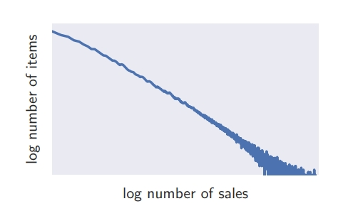

目录

- [论文简介](#论文简介)
- [历史研究和瓶颈](#历史研究和瓶颈)
- [论文贡献](#论文贡献)
- [问题定义](#问题定义)
- [模型定义](#模型定义)
- [实验结果](#实验结果)
- [总结](#总结)
- [资料](#资料)

# 论文简介

> * 论文：DeepAR: Probabilistic Forecasting with Autoregressive Recurrent Networks
> * 作者：亚马逊
> * 代码：https://github.com/husnejahan/DeepAR-pytorch
> * 简介：一种使用自回归 RNN 预测时序分布的模型 DeepAR，
>   它有效解决了多时序间尺度不一致问题，并基于数据特征选择似然函数预测时序概率分布。

# 历史研究和瓶颈

有时，多条时间序列的幅度差异很大，
而且幅度分布可能强烈有偏（skew distribution）。由于幅度难找到分组标准，导致时序很难被分组建模。
历史有些 Normalization 做法，例如输入标准化或 Batch Normalizaiton，但效率不高。

比如，下图的销售量和销售额的幂律函数（一个量的相对变化会导致另一个量的相应幂次比例的变化）的双对数形式，
就有长尾表现：

# 论文贡献

提出一种方法解决时序幅度分布大的算法框架。相比于传统模型，DeepAR 的好处：

1. 学习季节性行为和时序对协变量的依赖。减少人工特征工程去挖掘负责的组间依赖行为； 
2. 使用蒙特卡洛采样能估计未来概率分布的分位数；
3. 通过学习相似 items，即使当前 items 的历史很少或者没有历史，也能被预测；
4. 允许基于数据统计性质，选择不同的似然函数。

DeepAR 的主要特色是：预测未来时序的分布和处理多条序列之间振幅对模型的影响，从而提高准确性。

# 问题定义

模型的目标是构建出下面的条件分布：

`$$P(\mathbb{z}_{i,t_{0}:T}|\mathbb{z}_{i,1:t_{0}-1}, \mathbb{x}_{i,1:T})$$`

其中：

* `$i$` 为时序 id
* `$t$` 为时刻点
* `$t_{0}$` 为训练集和测试集的分割时间点
* `$\mathbb{z}_{i, t_{0}:T} := [\mathbb{z}_{i,t_{0}}, \mathbb{z}_{i,t_{0}+1},\cdots,\mathbb{z}_{i,T}]$` 是 prediction range(未来 `$t_{0}$` 到 `$T$` 时期)的目标值
* `$\mathbb{z}_{i,1:t_{0}-1}$` 是 condition range(历史 1 到 `$t_{0}-1$`)的目标值
* `$\mathbb{x}_{i, 1:T}$` 是时序的协变量

# 模型定义

DeepAR 的模型是自回归循环网络(autoregressive recurrent network)结构，
下图是 DeepAR 的 Encoder 和 Decoder(共享模型结构和参数)：

# 实验结果

# 总结

# 资料

* [论文：https://arxiv.org/abs/1704.04110](https://arxiv.org/abs/1704.04110)
* [GitHub](https://github.com/husnejahan/DeepAR-pytorch)
* [亚马逊：DeepAR Forecasting Algorithm](https://docs.aws.amazon.com/sagemaker/latest/dg/deepar.html)
* [DeepAR: 自回归RNN预测时序概率分布](https://mp.weixin.qq.com/s?__biz=MzUyNzA1OTcxNg==&mid=2247486573&idx=1&sn=6033360211bb24b125843058cbe6c3d2&chksm=fa041206cd739b101e0bac9aa531a9fdd117413d3602003dbd21fb554e70353615d13a06192f&cur_album_id=2217041786139623427&scene=189#wechat_redirect)
* [深度学习中的时间序列模型：DeepAR](https://mp.weixin.qq.com/s/58ZxgFiXqT4efdfygm_t9g)
