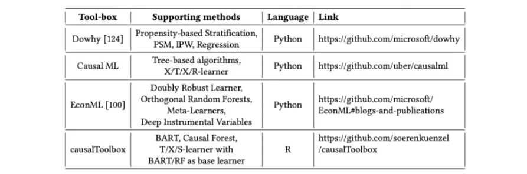
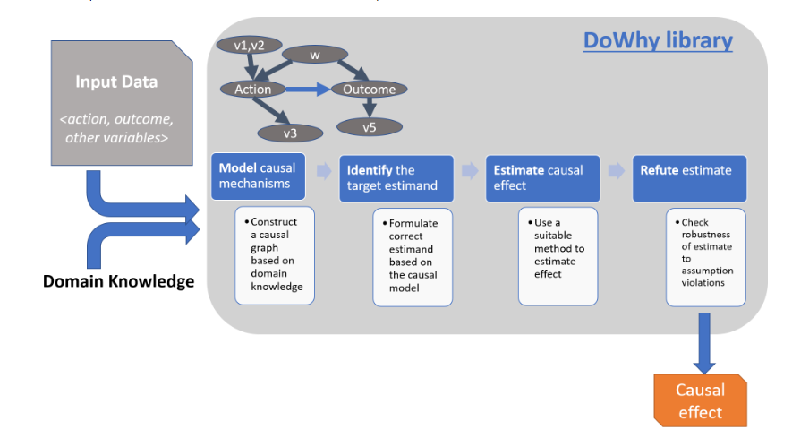

目录

- [因果分析](#因果分析)
  - [因果分析基础](#因果分析基础)
    - [因果分析的概念](#因果分析的概念)
    - [因果分析的要素](#因果分析的要素)
    - [因果分析的分类](#因果分析的分类)
    - [因果分析的方法](#因果分析的方法)
  - [因果分析原理](#因果分析原理)
    - [AB test](#ab-test)
    - [鱼骨图分析](#鱼骨图分析)
  - [因果分析应用](#因果分析应用)
  - [因果分析总结](#因果分析总结)
    - [因果分析的本质](#因果分析的本质)
    - [因果关系和相关关系](#因果关系和相关关系)
    - [因果分析的发展趋势](#因果分析的发展趋势)
    - [总结](#总结)
- [因果推断框架 DoWhy](#因果推断框架-dowhy)
  - [DoWhy 流程详解](#dowhy-流程详解)
    - [建模](#建模)
    - [识别](#识别)
    - [估计](#估计)
    - [反驳](#反驳)
  - [DoWy 应用示例](#dowy-应用示例)
- [参考](#参考)

# 因果分析

因果分析(Causal Analysis)是分析变量彼此之间的因果关系。因果推断(Casual Inference)是基于原因推结果，
是因果分析的一部分。

因果分析是数据分析、数据科学中重要的方法，广泛应用于 A/B Test、异常分析、用户增长等领域。

## 因果分析基础

### 因果分析的概念

1. 因果
    - 原因和结果
2. 因果关系
    - 原因和结果的关系
3. 因果分析
    - 分析彼此之间的因果关系

### 因果分析的要素

> 因果分析的三要素是：原因、结果、关系

原因可能有多个，导致的结果也可能是多个：

这里把问题聚焦，仅探讨抽象的因果关系，所以因果分析可以抽象如下：

* 原因 `$\Longrightarrow$` 结果
* 原因 `$\Longleftarrow$` 结果
* 原因 `$\Longleftrightarrow$` 结果

### 因果分析的分类

按照因果分析的三要素，把因果分析分为三类：

1. 第一类：由原因推结果，又称为因果推断(Causal Inference)
2. 第二类：由结果找原因
3. 第三类：原因和结果互推

### 因果分析的方法

| 类型                         | 方法                     |
|------------------------------|-------------------------|
| 原因 `$\Longrightarrow$` 结果 | 1.随机实验(A/B 实验)     |
|                              | 2.倾向评分匹配(PSM)      |
|                              | 3.断点归因(断点回归、RDD) |
|                              | 4.双重差分(DID)          |
|                              | 5.Uplift                |
|                              | ...                     |
| 原因 `$\Longleftarrow$` 结果  | 1.鱼骨图分析             |
|                              | 2.五个“为什么”分析        |
|                              | ...                      |
| 原因 `$\Longleftrightarrow$` 结果 | 公式推导             |

## 因果分析原理

互联网领域，A/B Test、鱼骨图分析法是常用的因果分析方法，所以下面阐述这两种方法的原理

* A/B Test（原因 `$\Longrightarrow$` 结果）
  - 适用于验证单因素的因果关系
* 鱼骨图分析（原因 `$\Longleftarrow$` 结果）
  - 适用于头脑风暴，寻找多个可能的原因

### AB test

A/B Test 是一种随机对照实验，用于实验验证因果关系。A/B Test，是因果实验的代表，
是因果归因、数据归因的主要手段。

A/B 实验是一种单因素归因，适用于验证单因素的因果关系。

具体可参考：

* [A/B Test 的概述、原理、公式推导、Python实现和应用](https://zhuanlan.zhihu.com/p/346602966)

### 鱼骨图分析

鱼骨图分析(Cause and Effect Analysis Chart，也称因果分析法)是典型的由结果找原因的方法。

鱼骨图分析法是对一个问题，分类别、穷举性地列出所有影响因素，进行进一步分析。
其中鱼头是结果（问题），大鱼骨是原因的类别，小鱼骨是具体原因。

鱼骨图分析适用于头脑风暴，寻找多个可能的原因。

## 因果分析应用

因果分析的典型场景是：

| 类型                         | 方法                     |
|------------------------------|-------------------------|
| 原因 `$\Longrightarrow$` 结果 | 1.随机实验(A/B 实验)：策略调整     |
|                              | 4.双重差分(DID)          |
|                              | ...                     |
| 原因 `$\Longleftarrow$` 结果  | 1.[异常分析](https://zhuanlan.zhihu.com/p/418371189)               |
|                              | 2.流失分析               |
|                              | ...                      |

因果分析、推断工具：

1. DoWhy
    - 开发者：微软
    - 简介：基于因果推理的统一语言，结合了因果图模型和潜在结果框架，支持因果假设的显式建模和测试
    - 官网：[GitHub](https://github.com/py-why/dowhy)
2. CDT，CausalDiscoveryToolbox
    - 开发者：Goudet Olivier
    - 简介：基于神经网络 CGNN 的图形化（networkx）因果推断。基于 NumPy，sklearn，PyTorch，bnlearn, 和 pcalg
    - [GitHub](https://github.com/GoudetOlivier/CausalDiscoveryToolbox)
3. causalml
    - 开发者：uber
    - 简介：基于机器学习的因果推断的综合包。主要功能包括：
        - 基于实验数据，计算 CATE 和 ITE
        - 基于决策树的算法
        - Meta-learner algorithms
        - 工具变量算法
        - 基于神经网络的算法
    - [GitHub](https://github.com/uber/causalml)
4. EconML
    - 开发者：微软
    - 简介：机器学习因果推断综合包，对标 causalml，安装相对容易一些。主要功能：
        - 主要用于计算 HTE 异质性处理效应
        - 提供模型的解释，以及系数的CI置信区间
        - 基于观测数据，进行因果推断
    - [GitHub](https://github.com/py-why/EconML)

## 因果分析总结

### 因果分析的本质

因果分析的本质就是论证因果关系的充分性、必要性

* 充分条件：原因 `$\Longrightarrow$` 结果
* 必要条件：原因 `$\Longleftarrow$` 结果

### 因果关系和相关关系

因果关系大多数情况下有相关关系，但相关关系不一定是因果关系

### 因果分析的发展趋势

* 原因 `$\Longrightarrow$` 结果
    - 元分析(多个随机试验的整合)
    - 因果推断(因果推断机器学习)
* 原因 `$\Longleftarrow$` 结果
    - 破界创新(逻辑不适合，奇点下移，找到新的底层假设)

### 总结

《精益数据分析》作者认为："发现相关性可以帮助你预测未来，而发现因果关系意味着你可以改变未来"，
所以重视因果关系，重视因果分析吧。

因果分析可以定位问题，挖掘商业价值，洞见机会，在互联网领域有广泛的应用，
比如因果推断、A/B Test、用户增长、异常分析和流失分析等。

但是商业是个复杂生态，因果分析是个很好的分析工具，还要结合具体的用户、业务、数据进行针对性的分析。

# 因果推断框架 DoWhy

因果推断(causal inference)是基于观察数据进行反事实估计，分析 **干预** 与 **结果** 之间的因果关系的一门科学。
虽然在因果推断领域已经有许多的框架与方法，但大部分方法缺乏稳定的实现。
DoWhy 是微软发布的一个用于进行端到端因果推断的 Python 库，其特点在于：

* 提供了一种原则性的方法将给定的问题转化为一张因果图，保证所有假设的明确性
* 提供了一种面向多种常用因果推断方法的统一接口，并结合了两种主要的因果推断框架
* 自动化测试假设的正确性及估计的鲁棒性

如上所述，DoWhy 基于因果推断的两大框架构建：**图模型** 与 **潜在结果模型**。
具体来说，其使用基于图的准则与 do-积分来对假设进行建模并识别出非参数化的因果效应；
而在估计阶段则主要基于潜在结果框架中的方法进行估计。DoWhy 的整个因果推断过程可以划分为四大步骤：

1. 识别(identify)
    - 在假设（模型）下识别因果效应的表达式（因果估计量）
2. 建模(model)
    - 利用假设（先验知识）对因果推断问题建模
3. 估计(estimate)
    - 使用统计方法对表达式进行估计
4. 反驳(refute)
    - 使用各种鲁棒性检查来验证估计的正确性

下图总结了 DoWhy 的整体流程：

下面将分别对这四个步骤及其所涉及的方法进行简要介绍。

## DoWhy 流程详解

### 建模

DoWhy 会为每个问题创建一个因果图模型，以保证因果假设的明确性。该因果图不需要是完整的，你可以只提供部分图，来表示某些变量的先验知识（即指定其类型），DoWhy 支持自动将剩余的变量视为潜在的混杂因子。

目前，DoWhy 支持如下形式的因果假设：

「图」（Graph）：提供 gml 或 dot 形式的因果图，具体可以是文件或字符串格式
「命名变量集合」（Named variable sets）：直接提供变量的类型，包括「混杂因子」（common causes / cofounders）、「工具变量」（instrumental variables）、「结果修改变量」（effect modifiers）、「前门变量」（front-door variables）等

### 识别

基于构建的因果图，DoWhy 会基于所有可能的方式来识别因果效应。具体来说，会使用基于图的准则与 do-积分 来找出可以识别因果效应的表达式，支持的识别准则有：

「后门准则」（Back-door criterion）
「前门准则」（Front-door criterion）
「工具变量」（Instrumental Variables）
「中介-直接或间接结果识别」（Mediation-Direct and indirect effect identification）

### 估计

DoWhy 支持一系列基于上述识别准则的估计方法，此外还提供了非参数置信空间与排列测试来检验得到的估计的统计显著性。具体支持的估计方法列表如下：

「基于估计干预分配的方法」
基于倾向的分层（Propensity-based Stratification）
倾向得分匹配（Propensity Score Matching）
逆向倾向加权（Inverse Propensity Weighting）
「基于估计结果模型的方法」
线性回归（Linear Regression）
广义线性模型（Generalized Linear Models）
「基于工具变量等式的方法」
二元工具/Wald 估计器（Binary Instrument/Wald Estimator）
两阶段最小二乘法（Two-stage least squares）
非连续回归（Regression discontinuity）
「基于前门准则和一般中介的方法」
两层线性回归（Two-stage linear regression）
此外，DoWhy 还支持调用外部的估计方法，例如 EconML 与 CausalML。

### 反驳

DoWhy 支持多种反驳方法来验证估计的正确性，具体列表如下：

「添加随机混杂因子」：添加一个随机变量作为混杂因子后估计因果效应是否会改变（期望结果：不会）
「安慰剂干预」：将真实干预变量替换为独立随机变量后因果效应是否会改变（期望结果：因果效应归零）
「虚拟结果」：将真实结果变量替换为独立随机变量后因果效应是否会改变（期望结果：因果效应归零）
「模拟结果」：将数据集替换为基于接近给定数据集数据生成过程的方式模拟生成的数据集后因果效应是否会改变（期望结果：与数据生成过程的效应参数相匹配）
「添加未观测混杂因子」：添加一个额外的与干预和结果相关的混杂因子后因果效应的敏感性（期望结果：不过度敏感）
「数据子集验证」：将给定数据集替换为一个随机子集后因果效应是否会改变（期望结果：不会）
「自助验证」：将给定数据集替换为同一数据集的自助样本后因果效应是否会改变（期望结果：不会）

## DoWy 应用示例

# 参考

* [因果分析的原理、方法论和应用](https://zhuanlan.zhihu.com/p/409609129)
* [破界创新：从结果到原因，再从原因到结果](https://zhuanlan.zhihu.com/p/539417288)
* [目前主流的 Python 因果推断包和教材](https://www.zhihu.com/tardis/zm/art/405226148?source_id=1003)
* [A Survey on Causal Inference](https://arxiv.org/pdf/2002.02770.pdf)
* [因果推断框架 DoWhy 入门](https://zhuanlan.zhihu.com/p/321808640)
* [DoWhy GitHub](https://github.com/py-why/dowhy)
* [因果推断：从概念到实践](https://github.com/xieliaing/CausalInferenceIntro)
