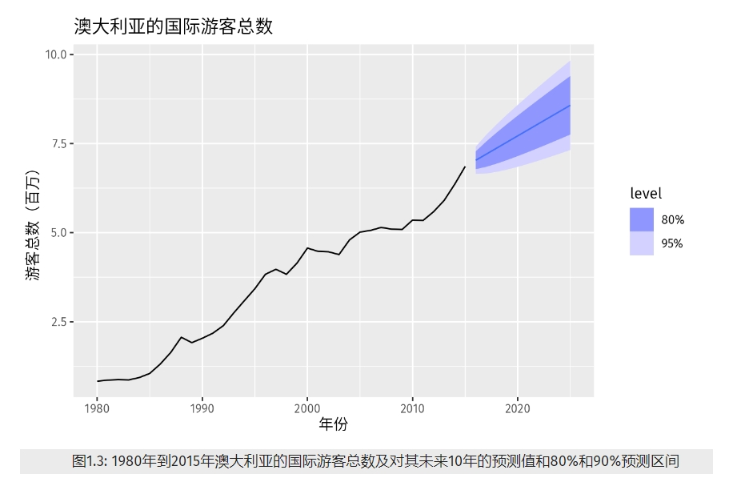

<style>
details {
    border: 1px solid #aaa;
    border-radius: 4px;
    padding: .5em .5em 0;
}
summary {
    font-weight: bold;
    margin: -.5em -.5em 0;
    padding: .5em;
}
details[open] {
    padding: .5em;
}
details[open] summary {
    border-bottom: 1px solid #aaa;
    margin-bottom: .5em;
}
img {
    pointer-events: none;
}
</style>

<details><summary>目录</summary><p>

- [预测](#预测)
    - [什么是可以被预测的？](#什么是可以被预测的)
        - [可预测性需要满足的条件](#可预测性需要满足的条件)
        - [如何准确预测](#如何准确预测)
        - [预测方法的选择](#预测方法的选择)
    - [预测什么？](#预测什么)
        - [预测时长](#预测时长)
        - [预测需要多频繁](#预测需要多频繁)
        - [预测需要的数据](#预测需要的数据)
    - [预测数据和方法](#预测数据和方法)
        - [定性预测方法](#定性预测方法)
        - [定量预测方法](#定量预测方法)
        - [时间序列预测](#时间序列预测)
        - [预测变量和时间序列预测](#预测变量和时间序列预测)
    - [预测过程的主要步骤](#预测过程的主要步骤)
        - [定义问题](#定义问题)
        - [收集信息](#收集信息)
        - [初步探索性分析](#初步探索性分析)
        - [选择及拟合模型](#选择及拟合模型)
        - [使用及评估预测模型](#使用及评估预测模型)
    - [统计预测观点](#统计预测观点)
        - [区间预测与点预测](#区间预测与点预测)
        - [预测分布](#预测分布)
- [时间序列数据探索性分析](#时间序列数据探索性分析)
- [时间序列分解](#时间序列分解)
    - [变换和调整](#变换和调整)
        - [日历调整](#日历调整)
        - [人口调整](#人口调整)
        - [通货膨胀调整](#通货膨胀调整)
        - [数学变换](#数学变换)
            - [对数变换](#对数变换)
            - [幂变换](#幂变换)
            - [Box-Cox 变换族](#box-cox-变换族)
    - [时间列成分](#时间列成分)
        - [加法分解](#加法分解)
        - [乘法分解](#乘法分解)
        - [季节调整数据](#季节调整数据)
    - [移动平均](#移动平均)
        - [平滑移动平均](#平滑移动平均)
        - [移动移动平均](#移动移动平均)
        - [用季节数据估计趋势-周期项](#用季节数据估计趋势-周期项)
        - [加权移动平均](#加权移动平均)
    - [经典时间序列分解](#经典时间序列分解)
        - [加法分解](#加法分解-1)
        - [乘法分解](#乘法分解-1)
    - [经典时间序列分解法评价](#经典时间序列分解法评价)
    - [官方统计机构使用的分解法](#官方统计机构使用的分解法)
    - [STL 分解法](#stl-分解法)
- [时间序列特征](#时间序列特征)
    - [简单的统计描述](#简单的统计描述)
    - [ACF 特征](#acf-特征)
    - [STL 特征](#stl-特征)
    - [其他特征](#其他特征)
- [预测工具集](#预测工具集)
    - [规整的预测工作流程](#规整的预测工作流程)
    - [一些简单的预测方法](#一些简单的预测方法)
- [参考](#参考)
</p></details><p></p>

# 预测

## 什么是可以被预测的？

### 可预测性需要满足的条件

事件（或数量）的可预测性取决于一下几个因素：

1. 我们对它的影响因素的了解程度；
2. 有多少历史数据是可用的；
3. 未来与过去的相似程度；
4. 预测是否会影响我们试图预测的事物。

例如，对居民用电需求可以非常准确地预测，因为通常这四个条件都可以满足的：

1. 我们很好地了解它的影响因素：电力需求很大程度上受温度影响，也受日期（如假期）和经济状况的影响；
2. 通常我们可以获得过去几年的电力需求数据，以及过去几十年的天气状况数据；
3. 对于短期预测（几周内），可以假设未来的需求行为将与过去是类似的；
4. 对于大多数住宅用户来说，电价不依赖于需求，因此需求预测对消费者行为几乎没有影响。

### 如何准确预测

通常在预测中关键的一步是知道什么情形下能够进行准确预测，确定什么时候预测还不如抛个硬币来的准确。
好的预测可以捕捉到历史数据中的真实模式和关系，而不是重复过去发生过未来不会再发生的事情。

* 如何区分应该忽略的历史数据中的随机波动，和历史数据中应该建模推断的真实模式。
* 一个预测模型的目的是捕捉事物变化的方式，而不仅仅是找到事物在什么位置。

### 预测方法的选择

预测方法的选择取决于什么数据可用和被预测变量的可预测性。

* 朴素方法：使用最近一次观测作为预测
* 判断性预测
* ...

## 预测什么？

在预测的初期阶段，需要决定应该预测的内容。例如，如果生产中的物料需要预测，应该探究以下问题是否要预测：

1. 用于每条产品线或一组产品？
2. 用于每个销售网点，或按区域分组的网点，或仅用于总销售额？
3. 周度数据、月度数据或年度数据？

在进行预测时，应该花时间与使用预测者进行交流，以确保你了解他们的需求并知道预测会被如何使用，
然后再进行扩展性的工作。

### 预测时长

考虑预测的前景时段也十分必要。是需要提前 1 个月，提前 6 个月还是提前 10 年预测？
根据哪个预测时长最为重要，我们需要不同种类的模型。

预测应该是说管理决策中的一个主要组成部分，因为它在企业的很多地方都发挥着重要作用。
现代企业组织需要短期、中期和长期预测，具体预测什么取决于特定的应用场景。

* 短期预测

人员、生产和运输的安排调度需要短期预测。作为安排过程中的一部分，需求预测常常也是必须的。

* 中期预测

确定未来的资源需求需要中期预测，以便购买原材料、雇用人员或购买机器和设备。

* 长期预测

在战略规划中会使用长期预测。此类决定必须将市场机会、环境因素和内部资源纳入考量。

### 预测需要多频繁

需要经常进行的预测，最好是使用自动化系统，而不是需要仔细人工操作。

### 预测需要的数据

一旦确定了所需的预测，则需要查找或收集预测所基于的数据。预测所需的数据可能已经存在了。
近年来，大量的数据被记录，而预测者的任务往往是确定所需数据的存储位置和方式。
数据可能会包括公司的销售记录、产品的历史需求或地理区域的失业率。在制定合适的预测方法之前，
预测者大一部分的时间将用于寻找和整理可用数据。

## 预测数据和方法

在大程度上，什么数据是可用的决定了适合什么合适的预测方法。

### 定性预测方法

如果没有可用的数据，或者如果可用的数据与预测无关，那么应该使用 <span style='border-bottom:1.5px dashed red;'>定性预测</span> 方法。
这些方法不是纯粹的猜测—有完善的结构化方法来获得良好的预测，而不使用历史数据。

### 定量预测方法

在满足以下两个条件的时候可以使用 <span style='border-bottom:1.5px dashed red;'>定量预测</span>：

1. 关于过去的数字化信息是可以用的；
2. 有理由假设过去的一些模式会在未来延续下去。

有各种各样的定量预测方法，这些方法通常是在特定的学科范围为特定的目的而开发的。
每一种方法都有自己的属性、精度和成本，这些应该在方法选择时考虑到。

大多数定量预测问题都使用 <span style='border-bottom:1.5px dashed red;'>时间序列数据</span> (按时间间隔定期收集) 或 <span style='border-bottom:1.5px dashed red;'>横截面数据</span> (在一个时间点收集)。
这里，我们只关注预测未来的数据，并且我们主要专注于时间序列领域。

### 时间序列预测

任何按照时间顺序观察的事物都是时间序列。
我们将只考虑定期观察的时间序列 (例如,每小时、每天、每周、每月、每季度、每年)。
不规则间隔时间序列也可能出现，目前暂不考虑。

最简单的时间序列预测方法只用了预测变量的信息，而不去寻找影响预测变量的因素。
因此，这些方法可以推断趋势部分和季节性部分，但是它们会忽略掉所有其他的信息，
如营销计划，竞争对手活动，经济状况变动等。

### 预测变量和时间序列预测

通常预测变量在时间序列预测中是有用的。例如，假设我们想要预测炎热地区夏季时每小时用电需求量。
可以用如下包含预测变量的模型：

`$$ED = f(当前气温, 经济实力, 人口当日时间, 星期几, 误差)$$`

这种关系并不确切–总会有不能由预测变量决定的电力需求变化。
右侧的“误差”项表示随机波动和没有被包括在模型中的相关变量的影响。
我们将它称之为可解释模型，因为它帮助解释电力需求变化的原因。

---

因为电力需求数据构成了一组时间序列，我们也可以用一个时间序列模型来进行预测。
在这种情况下，一个合适的时间序列模型可以为如下形式：

`$$ED_{t+1}=f(ED_{t}, ED_{t-1}, ED_{t-2}, ED_{t-3}, \cdots, 误差)$$`

`$t$` 表示当前得时间，`$t+1$` 表示下一个小时，`$t-1$` 表示前一个小时，`$t-2$` 表示前两个小时，以此类推。
此处，对未来的预测是基于变量得过去值，而不是基于可能影响系统得外部变量。
同样，右侧得“误差”项允许随机波动和不包含在模型中的相关变量的影响。

---

还有第三种模型，它结合了上述两种模型的特定。例如，它可能有如下形式：

`$$ED_{t+1}=f(ED_{t}, 当前气温, 当前时间, 星期几, 误差)$$`

这些类型的“混合模型”在不同的学科中给出了不同的名称。它们被称为动态回归模型、面板数据模型、纵向模型。
传递函数模型和线性系统模型（假设 `$f$` 是线性的）。

解释模型非常有用，因为它包含了有关其他变量的信息，而不仅仅是要预测的变量的历史值。
但是，预测者可能选择时间序列模型而不是解释性或混合模型的原因有多种：

* 首先，这一系统可能不被理解，即使被理解，也很难衡量被认为应该管理行为的关系；
* 其次，有必要知道或预测各种预测因子的未来价值，以便能够预测有意义的变量，但是这可能太难了；
* 第三，可能主要只是关注预测会发生什么，而不知道为什么会发生；
* 最后，时间序列模型可以提供比解释或混合模型更准确的预测。

在预测中使用的模型取决于可用的资源和数据、模型的准确性以及预测模型的使用方式。

## 预测过程的主要步骤

### 定义问题

通常这是预测中最困难的步骤。要准确定义这个问题，需要了解怎样运用预测方法，谁需要这个预测，
以及预测效果如何满足需要这个预测的机构。预测人员需要花费一定时间与所有参与收集数据、
维护数据库和使用这个预测对未来进行规划的人沟通。

### 收集信息

一般至少需要两种信息收集方式：

1. 统计数据
2. 收集数据和进行预测方面专家的积累经验

通常情况下，要获得足够多的历史数据以构建良好的统计模型是很困难的。
在这种情况下，可以使用判断预测方法。有时候，陈旧数据会因相应数据发生结构变化而失效，
因而我们一般只选择使用较新的数据。然而，一个好的统计模型可以处理系统中的结构变化，
因此不要轻易丢弃好的数据。

### 初步探索性分析

* 总是以图形开头。
* 有一致的模式吗？
* 有明显的长期趋势吗？
* 季节性重要吗？
* 是否有证据表明商业周期存在？
* 数据中是否包含需要专业知识解释的异常值？
* 用于分析的变量之间的相关性有多强？

### 选择及拟合模型

最佳模型的选择取决于历史数据的可用性、预测变量与各解释变量之间的相关性，以及预测的使用方式。
比较两个或三个潜在的模型是很常见的。每个模型本身都基于人为提出的一组假设(显式和隐式)而建立，
通常包含一个或多个参数，这些参数必须使用已知的历史数据进行估计。

常用统计学模型：

* 回归模型
* 指数平滑方法
* Box-Jenkins ARIMA 模型
* 动态回归模型
* 分层预测
* 其他：计数时间序列、神经网络、向量自回归

### 使用及评估预测模型

一旦模型及其参数确定后，该模型就可以用来进行预测。
模型的预测效果只有用于预测的数据得到之后才能得到正确的评价。
目前已经开发了许多方法来评估预测的准确性。在使用和进行预测时会存在很多组织结构问题。
当在实践中使用预测模型时，会出现许多实际问题，例如如何处理缺失值和异常值，或者如何处理短时间序列。

## 统计预测观点

### 区间预测与点预测

我们试图预测的东西是未知的（或者我们不能预测它），所以我们可以把它想象成一个 <span style='border-bottom:1.5px dashed red;'>随机变量</span>。
例如，下个月的总销售额可能会有一系列的可能值，直到月底我们把实际销售额加起来，我们才知道这个值会是多少。
所以在我们知道下个月的销售情况之前，这是一个随机的变量。

因为下个月时间节点比较近，我们通常清楚销售量大概是多少。如果我们预测明年同一个月的销售情况，
可能的销售量变动就会较大。在大多数预测情况下，随着事件的临近，预测对象的相关变动较小。
换句话说，<span style='border-bottom:1.5px dashed red;'>预测的越早，预测结果越不稳定</span>。

我们进行预测的过程实际是寻找随机变量可能取值范围内的中间值。通常情况下，预测会伴随着一个 <span style='border-bottom:1.5px dashed red;'>预测区间</span>，
给出一个随机变量具有较高概率的范围值。例如，95% 的预测区间包含一系列的值，这个预测区间包含实际未来值的概率为 95%。

我们通常会给出这些预测区间，而不是下图中显示的单个可能的预测值。
下面的图表显示了未来澳大利亚国际游客的 80% 和 95% 的预测区间。
蓝线是可能的预测值的平均值，我们称之为 <span style='border-bottom:1.5px dashed red;'>点预测</span>。



### 预测分布

使用下标 `$t$` 作为时间。例如，`$y_{t}$` 表示时间 `$t$` 对应的观察值。假设将观察到的所有信息表示为 `${\cal I}$`，
目标是预测 `$y_{t}$`。此时，我们将 `$y_{t}|{\cal I}$` 表示为“给定已知 `${\cal I}$`” 情况下的随机变量 `$y_{t}$`。
这个随机变量取值的概率测度称为 `$y_{t}|{\cal I}$` 的“概率分布”。在预测中，我们称之为 <span style='border-bottom:1.5px dashed red;'>预测分布</span>。

每当我们谈到“预测”时，通常指的是预测分布的平均值，用 `$\hat{y}_{t}$` 来表示 `$y_{t}$` 的预测值，
这意味着 `$y_{t}$` 所有可能取值的均值包含了我们所有已知的信息。

明确指出我们在进行预测时使用的信息时很必要的。
例如，我们使用 `$\hat{y}_{t|t-1}$` 表示在已知观测值 `$(y_{1}, \cdots, y_{t-1})$` 的情况下 `$y_{t}$` 的预测值。
类似地，我们使用 `$\hat{y}_{T+h|T}$` 表示在已知观测值 `$y_{1}, \cdots, y_{T}$` 的情况下 `$y_{T+h}$` 的预测值（即考虑时间 `$T$` 之前所有观测值的 `$h$` 步预测）。

# 时间序列数据探索性分析

> 时间序列图形：开展一切数据分析工作的首要任务是数据可视化。图示化数据可以清晰地呈现数据的特征，包括数据的形态、异常值、随时间变化情况以及变量间的相互关系。我们在预测时应尽可能地将图中显示的特征纳入考虑。正如数据类型会决定所使用的预测方法一样，数据类型也决定了使用什么图形来展示数据。


# 时间序列分解

时间序列数据通常有很多种潜在模式，因此一种有效的处理时间序列的方式是将其分解为多个成分，
其中每个成分都对应一种基础模式。

一般有三种基础的时间序列模式：趋势性，季节性和周期性。当我们想要把时间序列分解为多个成分时，
我们通常将趋势和周期组合为 <span style='border-bottom:1.5px dashed red;'>趋势-周期项（有时也简单称其为趋势项）</span>，因此，我们认为时间序列包括三个成分：<span style='border-bottom:1.5px dashed red;'>趋势-周期项</span>，<span style='border-bottom:1.5px dashed red;'>季节项</span> 和 <span style='border-bottom:1.5px dashed red;'>残差项</span>（残差项包含时间序列中其它所有信息）。
对于不同的季节时期，某些时间序列（例如，至少每日都观测的序列）可能有不止一个季节成份。
我们主要介绍从时间序列中提取成分的常用方法，进而更好的理解时间序列的特点，并以此提高时间序列的预测精度。

分解时间序列时，首先要使变换或调整序列以使分解尽可能简单（随后的分析也要尽可能简单）。
因此，我们从变换和调整开始讨论。

## 变换和调整

调整历史数据通常可以产生更简单的时间序列。这里，我们进行四种调整：日历调整、人口调整、通货膨胀调整和数学变换。
这些调整和变换的目的是通过 <span style='border-bottom:1.5px dashed red;'>消除来源已知的波动</span>、或者 <span style='border-bottom:1.5px dashed red;'>使整个数据集的特征更加一致</span>，达到 <span style='border-bottom:1.5px dashed red;'>简化历史数据特征</span> 的目的。

> 更简单的特征通常更容易建模，产生的预测也更准确。

### 日历调整

季节性数据中出现的一些变化可能是由于简单的日历影响。在这种情况下，在进行进一步分析之前，消除这些变化通常更为容易。

例如，如果你正在研究零售店的月度总销售额，除了一年中的季节性波动外，
由于 <span style='border-bottom:1.5px dashed red;'>每个月的交易天数不同</span>，
月度销售额也会有变化。通过计算每个月 <span style='border-bottom:1.5px dashed red;'>每个交易日的平均销售额</span>，而不是 <span style='border-bottom:1.5px dashed red;'>当月的总销售额</span>，
很容易消除由于每月天数不同引起的变化。通过这种方法我们有效地消除了日历变化。

### 人口调整

任何受人口变化影响的数据都可以调整为人均数据。即考虑每人平均（或每千人平均，或每百万人平均）的数据，而不是总数。

```r
library(fpp3)
library(tibble)

# GDP
global_economy |>
    filter(Country == "Australia") |>
    autoplot(GDP) +
    labs(title= "GDP", x = '年份',y = "$美元")

# 人均 GDP
global_economy |>
    filter(Country == "Australia") |>
    autoplot(GDP/Population) +
    labs(title= "人均GDP", x = '年份',y = "$美元")
```


### 通货膨胀调整

受货币价值影响的数据最好在建模前进行调整。比如，如果要比较前后 20 年的同一贩子的价格，
需要通过调整时间序列，将房价调整到同一时期的价格表示。一般通过价格指数进行调整，
一个常见的价格指数就是消费者价格指数（CPI）。

### 数学变换

如果数据显示的变化随着序列的级别增加或减少，那么数学变换可能很有用。

#### 对数变换

通常可以使用对数变换。如果我们将原始观测值表示为 `$y_{1}, \cdots, y_{T}$`，
并且将变换后的观测值表示为由 `$w_{1}, \cdots, w_{T}$`，则 `$w_{T}=log(y_{T})$`。
对数很好用，因为它们是可解释的：对数值的变化可以表示为原始刻度的相对（或百分比）变化。
因此，如果使用的对数基数为 10，那么在对数标度上增加 1 对应于在原始标度上乘以 10。
如果原始序列有零或负值，则不能求对数。

#### 幂变换

有时也会使用其他数学变换（尽管它们可解释度较低）。例如，我们可以使用平方根和立方根。
这些被称为幂变换，因为它们可以写成 `$w_{t}=y_{t}^{P}$` 的形式。

#### Box-Cox 变换族

之前已经有过介绍：[数值特征中的 Box-Cox 变换](https://wangzhefeng.com/note/2022/09/13/feature-engine-type-numeric/#box-cox-%E8%BD%AC%E6%8D%A2)

一个有用的变换族 Box-Cox 变换族，包括对数变换和幂变换，它取决于参数 `$\lambda$`，定义如下：

`$$w_{t}=\begin{cases}
log(y_{t}), & \lambda = 0 \\
\frac{\Big(sign(y_{t})|y_{t}|^{\lambda}-1\Big)}{\lambda}, & \lambda \neq 0
\end{cases}$$`

<!-- 或者：

`$$y = \begin{cases} 
ln(x), & \lambda = 0 \\
\frac{(x^\lambda-1)}{\lambda}, & \lambda \neq 0
\end{cases}$$` -->

这实际上是一个修改的 Box-Cox 变换，在 Bickel & Doksum(1981) 中讨论过，
当 `$\lambda>0$` 时允许 `$y_{t}$` 是负值。

Box-Cox 变换中的对数总是自然对数（即以 `$e$` 为对数底）。因此：

* 如果 `$\lambda=0$`，则使用自然对数
* 如果 `$\lambda\neq 0$`，将使用幂变换，然后进行一些缩放
* 如果 `$\lambda=1$`，则 `$w_{t}=y_{t}-1$`，因此变换后的数据向下移动，但时间序列的形式没有变化
* 对于 `$\lambda$` 的所有其他值，时间序列将改变形状

合理选择 `$\lambda$` 值可以使整个序列的季节变化大小大致相同，这会使预测模型更简单。
在这种情况下，令 `$\lambda = 0.10$` 效果很好，
尽管 `$\lambda$` 的任何值在 `$0.0$` 和 `$0.2$` 之间都会产生类似的结果。

## 时间列成分

### 加法分解

假设一条时间序列是由多种成分相加得来的，那么它可以写为如下形式：

`$$y_{t}=S_{t}+T_{t}+R_{t}$$`

其中：

* `$y_{t}$` 是时间序列数据
* `$S_{t}$` 表示季节成分
* `$T_{t}$` 表示趋势-周期项
* `$R_{t}$` 表示残差项

### 乘法分解

此外，时间序列也可以写成相乘的形式：

`$$y_{t} = S_{t} \times T_{t} \times R_{t}$$`

如果季节性波动的幅度或者趋势周期项的波动不随时间序列水平的变化而变化，那么加法模型是最为合适的。
当季节项或趋势周期项的变化与时间序列的水平成比例时，则乘法模型更为合适。在经济时间序列中，乘法模型较为常用。
使用乘法分解的一种替代方法是：首先对数据进行变换，直到时间序列随时间的波动趋于稳定，然后再使用加法分解。
显然，采用对数变换的加法模型等价于乘法模型：

`$$y_{t} = S_{t} \times T_{t} \times R_{t}$$`

等价于

`$$log y_{t} = log S_{t} + log T_{t} + log R_{t}$$`

### 季节调整数据

如果将季节项从原始数据中剔除，可以得到经过”季节调整”后的数据。 对于加法分解，季节调整数据的表达式为：
`$y_{t} - S_{t}$`，对于乘法分解，季节调整数据可以表示为：`$y_{t}/S_{t}$`。

如果我们关心的不是季节性的数据波动，那么季节调整后的时间序列就会十分有用。

例如，每月的失业率会受到季节性因素的影响，在学生离校的时期，当月失业率会显著上升，
但这种失业率并不是由于经济衰退而导致的。因此，当研究经济和失业率的关系时，
应该将失业率进行季节调整。大多数研究实业数据的经济分析学者对非季节性变化更感兴趣。
因此，就业数据（和很多其他的经济数据）通常会经过季节调整。

经过季节调整后的时间序列既包含残差项也包含趋势周期项。因此，它们不太”平滑”，
其”下转折”和”上转折”可能会有误导性。如果我们的目的是找到序列的转折点并解释方向的变化，
那么相比于用季节调整后的数据，用趋势-周期项会更合适。

## 移动平均

时间序列分解的经典方法起源于 20 世纪 20 年代，直到 20 世纪 50 年代才被广泛使用。
它仍然是许多时间序列分解方法的基础，因此了解它的原理十分重要。
传统的时间序列分解方法的第一步是用移动平均的方法估计趋势-周期项。

### 平滑移动平均

`$m$` 阶移动平均可以被写为：

`$$\hat{T}_{t} = \frac{1}{m}\sum_{j=-k}^{k}y_{t+j}$$`

上式中 `$m=2k+1$`，也能是说，时间点 `$t$` 的趋势-周期项的估计值是通过求 `$t$` 时刻 `$k$` 周期内的平均得到的。
时间临近的情况下，观测值也很可能接近。由此，平均值消除了数据中的一些随机性，得到较为平滑的趋势周期，
我们称它为 `$m-MA$`，也就是 `$m$` 阶移动平均。

移动平均的阶数决定了趋势-周期项的平滑程度。一般情况下，阶数越大曲线越平滑。

简单移动平均的阶数常常是奇数阶（例如：3，5，7等），这样可以确保对称性。
在阶数为 `$m=2k+1$` 的移动平均中，中心观测值和两侧各有的 `$k$` 个观测值可以被平均。
但是如果 `$m$` 是偶数，那么它就不再具备对称性。

### 移动移动平均

### 用季节数据估计趋势-周期项


### 加权移动平均


## 经典时间序列分解

经典时间序列分解法起源于20世纪20年代。它的步骤相对简单，它是很多其他的时间序列分解法的基石。
有两种经典时间序列分解法：加法分解和乘法分解。

下面将描述一个季节周期为 `$m$` 的时间序列（例：`$m=4$` 的季度数据，`$m=12$` 的月度数据， 
`$m=7$` 的周度数据）。

在经典时间序列分解法中，我们假设季节项每年都是连续的。对于乘法季节性，
构成季节项的 `$m$` 个值被称为季节指数。

### 加法分解

* 步骤1：若 `$m$` 为偶数，用 `$2\times m-MA$` 来计算趋势周期项 `$\hat{T}_{t}$`。
  若 `$m$` 为奇数，用 `$m-MA$` 来计算趋势周期项 `$\hat{T}_{t}$`。
* 步骤2：计算去趋势序列：`$y_{t}-\hat{T}_{t}$`。
* 步骤3：为了估计每个季度的季节项，简单平均那个季度的去趋势值。例如，对于月度数据，
  三月份的季节项是对所有去除趋势后的三月份的值的平均。然后将这些季节项进行调整，
  使得它们的加和为 0。季节项是通过将这些各年的数据排列结合在一起而得到的，
  即  `$\hat{S}_{t}$`。
* 步骤 4：残差项是通过时间序列减去估计的季节项和趋势-周期项求得的：`$\hat{R}_{t}=y_{t}-\hat{T}_{t}-\hat{S}_{t}$`。

### 乘法分解

经典乘法分解与加法分解十分相似，只不过是用除法代替了减法。

* 步骤 1：若 `$m$` 为偶数，用 `$2\times m-MA$` 来计算趋势周期项 `$\hat{T}_{t}$`。
  若 `$m$` 为奇数，用 `$m-MA$` 来计算趋势周期项 `$\hat{T}_{t}$`。
* 步骤 2：计算去趋势序列：`$y_{t}-\hat{T}_{t}$`。
* 步骤 3：为了估计每个季度的季节项，简单平均那个季度的去趋势值。
  例如，对于月度数据，三月份的季节项是对所有去除趋势后的三月份的值的平均。
  然后将这些季节项进行调整，使得它们的加和为 `$m$`。
  季节项是通过将这些各年的数据排列结合在一起而得到的，即 `$\hat{S}_{t}$`。
* 步骤 4：残差项是通过时间序列除以估计的季节项和趋势-周期项求得的：`$\hat{R}_{t}=y_{t}/(\hat{T}_{t}\hat{S}_{t})$`。

## 经典时间序列分解法评价

尽管经典时间序列分解法的应用还很广泛，但是我们不十分推荐使用它，因为现在已经有了一些更好的方法。
经典时间序列分解的几点问题总结如下：

1. 经典时间序列分解法无法估计趋势-周期项的最前面几个和最后面几个的观测。例如，若 `$m=12$`，
   则没有前六个或后六个观测的趋势-周期项估计。由此也会使得相对应的时期没有残差项的估计值。
2. 经典时间序列分解法对趋势-周期项的估计倾向于过度平滑数据中的快速上升或快速下降（如上面例子中所示）。
3. 经典时间序列分解法假设季节项每年是重复的。对于很多序列来说这是合理的，但是对于更长的时间序列来说这还有待考量。
   例如，因为空调的普及，用电需求模式会随着时间的变化而变化。具体来说，在很多地方几十年前的时候，
   各个季节中冬季是用电高峰（用于供暖加热），但是现在夏季的用电需求最大（由于开空调）。
   经典时间序列分解法无法捕捉这类的季节项随时间变化而变化。
4. 有时候，时间序列中一些时期的值可能异乎寻常地与众不同。例如，每月的航空客运量可能会受到工业纠纷的影响，
   使得纠纷时期的客运量与往常十分不同。处理这类异常值，经典时间序列分解法通常不够稳健。

## 官方统计机构使用的分解法


## STL 分解法


# 时间序列特征

## 简单的统计描述

## ACF 特征

## STL 特征

## 其他特征

# 预测工具集

## 规整的预测工作流程

为时间序列数据生成预测的过程可以分解为几个步骤：


1. 数据准备--整理

预测的第一步是以正确的格式准备数据。 此过程可能涉及加载数据、识别缺失值、过滤时间序列和其他预处理任务。

许多模型有不同的数据要求； 有些要求序列按时间顺序排列，有些则要求没有缺失值。
检查数据是了解其特征的重要步骤，应始终在估计模型之前完成。

2. 数据可视化--可视化

可视化是理解数据的重要步骤。 查看您的数据可以让您识别常见模式，然后指定合适的模型。

3. 定义模型--指定

有许多不同的时间序列模型可用于预测，为数据指定适当的模型对于生成适当的预测至关重要。

4. 训练模型--估计

一旦指定了合适的模型，接下来我们将在一些数据上训练模型。

5. 检查模型性能--评估

拟合模型后，重要的是检查它对数据的执行情况。 有多种诊断工具可用于检查模型行为，
以及允许将一个模型与另一个模型进行比较的准确性度量。

6. 产生预测--预测

指定、估计和检查了适当的模型后，就可以生成预测了。

在其他情况下，提供未来时间段的数据集进行预测可能更方便。
当您的模型使用数据中的附加信息(例如外生回归变量)时，通常需要这样做。
模型所需的额外数据可以包含在要预测的观测数据集中。

## 一些简单的预测方法


# 参考

* [Forecasting: Principles and Practice](https://otexts.com/fpp3cn/index.html)
