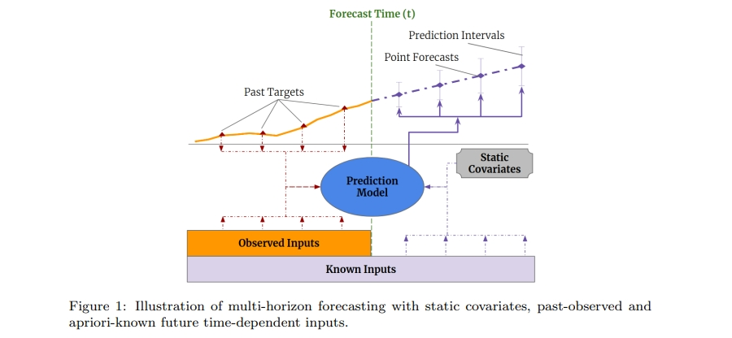
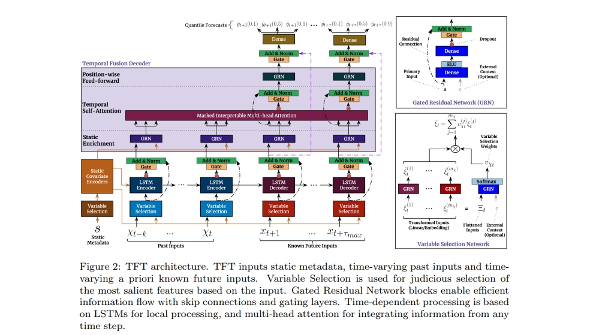

目录

- [论文简介](#论文简介)
- [历史研究和瓶颈](#历史研究和瓶颈)
    - [如何利用多个数据源](#如何利用多个数据源)
    - [如何解释模型的预测结果](#如何解释模型的预测结果)
- [论文贡献](#论文贡献)
- [问题定义](#问题定义)
- [模型定义](#模型定义)
- [实验结果](#实验结果)
- [总结](#总结)
- [资料](#资料)

# 论文简介

> * 论文：Temporal Fusion Transformers for Interpretable Multi-horizon Time Series Forecasting
> * 作者：牛津大学和谷歌云AI
> * 代码：https://github.com/google-research/google-research/tree/master/tft
> * 简介：TFT （Temporal Fusion Transformers）是针对多步预测任务的一种Transformer模型，并且具有很好的可解释性。

# 历史研究和瓶颈

在时序多步预测任务中，DNN（深度神经网络模型）面临以下两个挑战：

1. 如何利用多个数据源？
2. 如何解释模型的预测结果？

## 如何利用多个数据源

在时序任务中，有 2 类数据源，见下图所示：

1. 静态变量（Static Covariates）：不会随时间变化的变量，例如商店位置;
2. 时变变量（Time-dependent Inputs）：随时间变化的变量;
    - 过去观测的时变变量（Past-observed Inputs）：过去可知，但未来不可知，例如历史客流量
    - 先验已知未来的时变变量（Apriori-known Future Inputs）：过去和未来都可知，例如节假日；

很多 RNN 结构的变体模型，还有 Transformer 的变体模型，很少在多步预测任务上，
认真考虑怎么去利用不同数据源的输入，只是简单把静态变量和时变变量合并在一起，
但其实针对不同数据源去设计网络，会给模型带来提升。

## 如何解释模型的预测结果

除了不考虑常见的多步预测输入的异质性之外，大多数当前架构都是" 黑盒" 模型，
预测结果是由许多参数之间的复杂非线性相互作用控制而得到的。
这使得很难解释模型如何得出预测，进而让使用者难以信任模型的输出，
并且模型构建者也难对症下药去 Debug 模型。

不幸的是，DNN 常用的可解释性方法不适合应用于时间序列。在它们的传统方法中，
事后方法（Post-hoc Methods），例如 LIME 和 SHAP 不考虑输入特征的时间顺序。

另一方面，像 Transformer 架构，它的自相关模块更多是能回答“哪些时间点比较重要？”，
而很难回答“该时间点下，哪些特征更重要？”。

# 论文贡献

TFT 模型有如下贡献：

1. 静态协变量编码器：可以编码上下文向量，提供给网络其它部分；
2. 门控机制和样本维度的特征选择：最小化无关输入的贡献；
3. sequence-to-sequence 层：局部处理时变变量（包括过去和未来已知的时变变量）；
4. 时间自注意解码器：用于学习数据集中存在的长期依赖性。这也有助于模型的可解释性，
   TFT 支持三种有价值的可解释性用例，帮助使用者识别：
    - 全局重要特征
    - 时间模式
    - 重要事件

# 问题定义

# 模型定义

TFT 模型完整结构如下图所示：

# 实验结果

# 总结

# 资料

* [TFT：Temporal Fusion Transformers](https://mp.weixin.qq.com/s?__biz=MzUyNzA1OTcxNg==&mid=2247486809&idx=1&sn=dc7a1da5583790977c0ffa45e5b1b1e7&scene=19#wechat_redirect)
* [论文：https://arxiv.org/abs/1912.09363](https://arxiv.org/abs/1912.09363)
* [TFT GitHub](https://github.com/google-research/google-research/tree/master/tft)