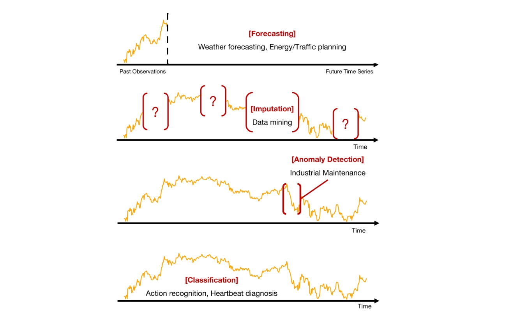
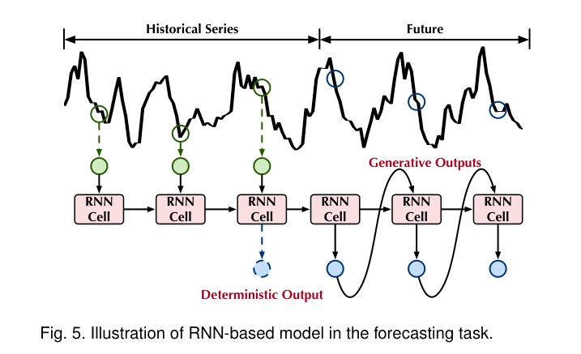
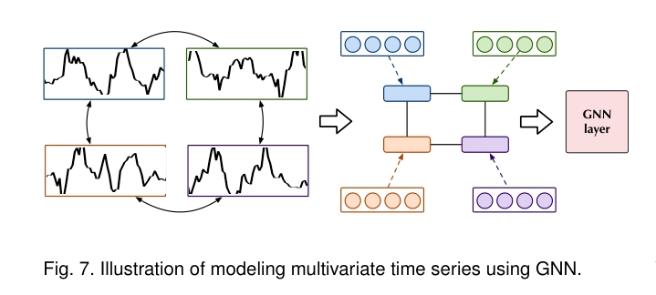
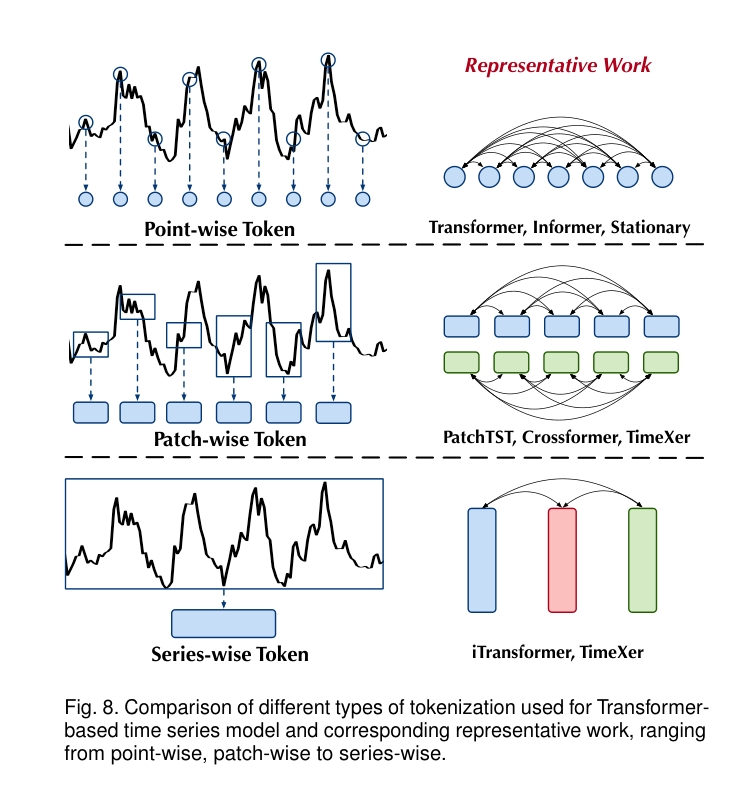
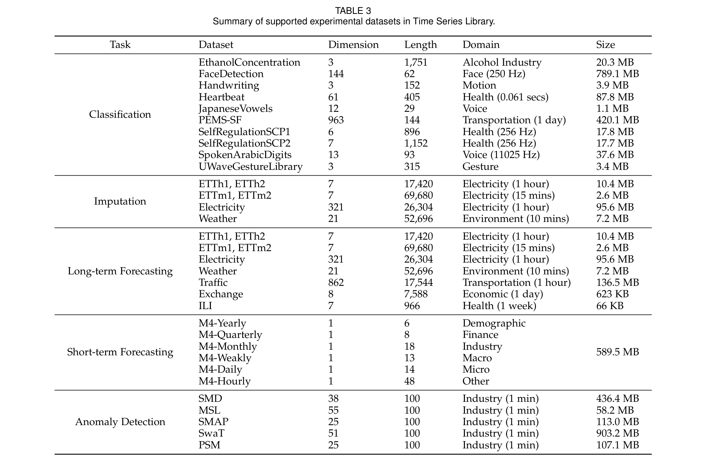
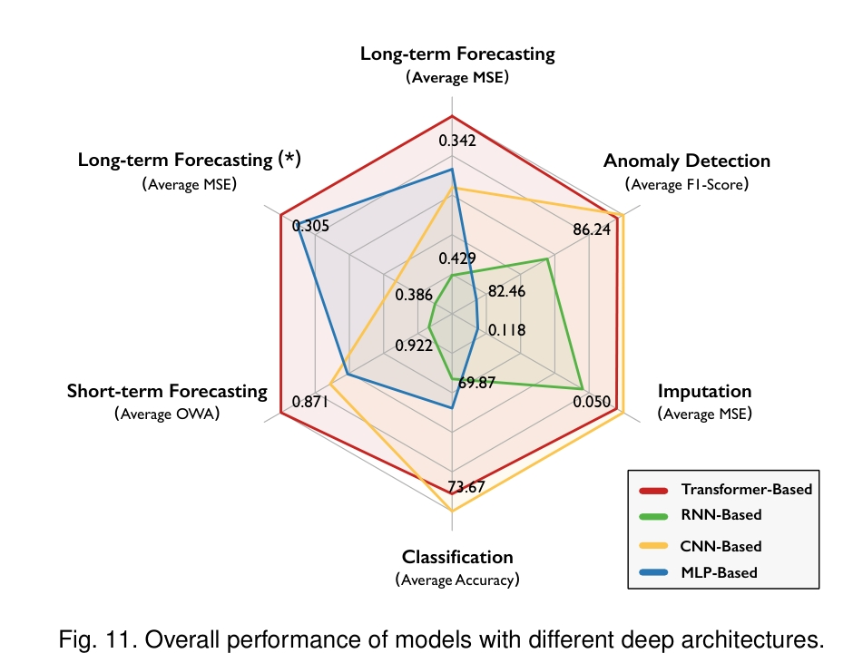

目录

- [论文信息](#论文信息)
- [背景介绍](#背景介绍)
    - [时间序列数据及分析简介](#时间序列数据及分析简介)
    - [传统方法](#传统方法)
    - [深度学习模型](#深度学习模型)
    - [本文的工作](#本文的工作)
- [时间序列及时间序列分析任务](#时间序列及时间序列分析任务)
    - [时间序列分析](#时间序列分析)
        - [Temporal Dependency](#temporal-dependency)
        - [Variate Correlation](#variate-correlation)
    - [时间序列分析任务](#时间序列分析任务)
- [基本模块](#基本模块)
    - [时间序列平稳化](#时间序列平稳化)
        - [传统统计方法](#传统统计方法)
        - [深度学习方法](#深度学习方法)
    - [时间序列分解](#时间序列分解)
        - [Seasonal-Trend 分解](#seasonal-trend-分解)
        - [Basis Expansion](#basis-expansion)
        - [Matrix Factorization](#matrix-factorization)
    - [傅里叶分析](#傅里叶分析)
        - [Time-Domain 建模](#time-domain-建模)
        - [Frequency-Domain 建模](#frequency-domain-建模)
- [模型架构](#模型架构)
    - [Multi-Layer Perceptrons](#multi-layer-perceptrons)
    - [Recurrent Neural Networks](#recurrent-neural-networks)
    - [Convolutional Neural Networks](#convolutional-neural-networks)
    - [Graph Neural Networks](#graph-neural-networks)
    - [Transformers](#transformers)
        - [Point-wise Dependency](#point-wise-dependency)
        - [Patch-wise Dependency](#patch-wise-dependency)
        - [Series-wise Dependency](#series-wise-dependency)
- [时间序列库](#时间序列库)
    - [设计和实现原则](#设计和实现原则)
    - [模型评估](#模型评估)
    - [数据集](#数据集)
    - [模型目前结果](#模型目前结果)
- [未来的方向](#未来的方向)
- [参考](#参考)

# 论文信息

* 论文名称：Deep Time Series Models: A Comprehensive Survey and Benchmark
* 论文地址：[https://arxiv.org/abs/2407.13278](https://arxiv.org/abs/2407.13278)
* 论文代码：[https://github.com/thuml/Time-Series-Library](https://github.com/thuml/Time-Series-Library)

# 背景介绍

## 时间序列数据及分析简介

时间序列数据的语义信息主要来自时间变化(temporal variation)，这对理解数据提出了重大挑战，
例如识别顺序依赖性、趋势、季节性模式和复杂动态。因此，
分析时间序列数据需要复杂的方法来捕获和利用这些复杂的时间表示。

时间序列分析包括分析时间变化的过程(temporal variation)，
以了解时间序列数据并做出准确的预测和明智的决策(informed decisions)。
时间序列分析的重要基石之一是发现时间序列数据中的潜在模式，
其中涉及数据中固有的复杂的时间依赖性(temporal dependencies)和变量相关性(variate correlations)。
通过捕捉这些复杂的依赖关系，时间序列模型可以有效地揭示潜在的动态，
并促进各种下游任务，包括预测、分类、插补和异常检测。

## 传统方法

传统的时间序列方法，例如自回归移动平均法(AutoRegressive Integrated Moving Average, ARIMA)、
指数平滑法(Exponential Smoothing)和频谱分析(Spectral Analysis)，长期以来一直是时间序列分析的中坚工具。
这些基于统计方法的模型在发现时间变化中的模式、趋势和季节性方面发挥了重要作用。
然而，由于捕捉现实世界时间序列数据中存在的复杂非线性关系和长期依赖关系的固有局限性，它们的能力受到了阻碍。
传统模型所依赖的线性和平稳性的严格假设限制了它们对多变(eventful)且不断变化(evolving)的数据流的适应性。

## 深度学习模型

深度模型已引起广泛关注，并在自然语言处理(NLP)、计算机视觉(CV) 和推荐系统等各个领域取得了卓越的表现。
近年来，深度学习模型已证明其能够捕捉时间序列数据中复杂的依赖关系，
使深度学习模型成为超越传统统计方法的时间序列分析的强大工具。
最近，最初为自然语言处理任务开发的具有注意机制的 Transformer 模型在处理大规模数据方面表现出惊人的能力，
并且也已适用于学习时间序列数据。这些架构的优势在于可以选择性地关注输入序列的不同部分，
从而可以更细致地发现时间序列中的时间和变量依赖关系。

## 本文的工作

1. 时间序列分析的背景概念
2. 深度学习模型中的基本模块
3. 现有的深度学习时间序列模型架构
4. 开源时间序列库：Time Series Library(TSLib)
5. 未来的方向

# 时间序列及时间序列分析任务

## 时间序列分析

时间序列是按时间排序的 `$T$` 个观测序列，
可以表示为 `$\mathbf{X}=\{\mathbf{x}_{1},\mathbf{x}_{2},\cdots,\mathbf{x}_{T}\} \in \mathbb{R}^{T\times C}$`，
其中 `$\mathbf{x}_{t} \in \mathbb{R}^{C}$` 表示在时间点 `$t$` 的观测值（向量），`$C$` 是变量数量。

由于时间序列数据是从传感器获得的物理测量值，因此系统通常用多个变量记录。
因此，现实世界的时间序列通常以多变量形式记录。理论研究表明，当有两个或多个非平稳序列时，
它们的线性组合可以是平稳的。这种协整特性有助于揭示和建模非平稳序列之间的长期关系。
因此，时间序列分析的本质是捕捉和利用观测值中的时间依赖性(temporal dependencies)和变量间相关性(variate correlations)。

### Temporal Dependency

时间依赖性鉴于观察结果固有的顺序性，一种明显的技术范式是捕获一组历史数据的时间依赖性。
时间依赖性的基本思想是**时间点**或**子序列**之间复杂的相关性。传统统计模型为时间依赖性建模奠定了基础。
突出的模型包括 ARIMA（自回归积分移动平均线），它已被广泛研究用于捕获时间序列模态中的复杂时间模式。
由于它们的简单性和可解释性，这些统计方法在底层时间动态不表现出高复杂性的任务中仍然很受欢迎。
考虑到现实世界时间序列的高维性和非平稳性，研究重点转向时间序列分析的深度学习。
这些先进的方法旨在处理更复杂的时间动态，并在捕获时间序列数据的时间依赖性方面提供更大的灵活性。

### Variate Correlation

变量相关性除了捕获时间依赖性之外，了解高维内的变量相关性在分析多变量时间序列中起着关键作用。
这些相关性是指不同变量之间随时间变化的复杂相互作用和关联。它们为测量之间的潜在动态和依赖关系提供了宝贵的见解，
从而可以更全面地了解潜在过程。传统方法，例如向量自回归 (VAR) 模型，将自回归的概念扩展到多个变量，
并且可以捕获多个数量随时间变化的关系。从技术上讲，VAR 将每个变量表示为其滞后值和模型中所有其他变量的滞后值的线性组合，
这导致无法捕获复杂和非线性关系。最近，图神经网络 和 Transformers 等先进的深度模型也被引入用于变量相关建模。

## 时间序列分析任务

* 预测(Forecasting)
    - 预测是时间序列分析中的一项基本任务，需要模型来揭示数据中的时间依赖性和动态模式。
      通过捕获过去和未来数据之间的关系，预测模型旨在预测输入序列的未来值或趋势
* 插补(Imputation)
    - 由于传感器故障、数据损坏或缺乏测量而导致的数据丢失在实际应用中普遍存在，
      导致对时间序列插补以获得更高质量数据的需求不断增长。与根据历史观察预测未来值的预测不同，
      插补侧重于使用可用的上下文信息重建缺失值
* 异常值检测(Anomaly Detection)
    - 异常检测涉及识别时间序列中的异常或异常模式，这可以指示关键事件、系统故障或需要进一步调查的异常值
* 分类(Classification)
    - 分类根据给定时间序列的特征为其分配标签或类别，该任务广泛应用于医疗诊断等领域

# 基本模块

时间序列建模方法已经发生了显着的发展，从传统的统计模型过渡到复杂的深度学习模型。
尽管取得了这些进步，许多经典工具和分析算法仍然被广泛使用，并继续作为现代深度模型的基础设计原则。

## 时间序列平稳化

作为时间序列分析的基本概念，平稳性是指时间序列的统计属性随时间保持恒定的属性。
平稳时间序列具有恒定的均值和方差，这简化了统计分析，并且更容易捕获时间序列内的潜在模式和行为。
由于许多基于统计的时间序列分析方法都以平稳性作为基本假设，
因此时间序列数据的平稳性已成为必不可少的模块。有多种方法可以将非平稳时间序列转换为平稳时间序列。

### 传统统计方法

* 差分(differencing)
* 对数变换(log-transformation)

### 深度学习方法

数据归一化(data normalization)以一种简单但有效的方式发挥了平稳化的作用，
它标准化(standardizes)了观测值的分布，同时保持了内在的变化，
并进一步有助于减轻源域和目标域之间的分布变化。

* deep adaptive input normalization(DAIN) layer
    - 根据时间序列的原始分布自适应地平稳化时间序列
* RevIN
    - 将可逆实例归一化引入到时间序列数据中，这是一种有效的归一化和反归一化方法，
      具有可学习的仿射变换，使模型绕过非平稳输入
* Non-Stationary Transformer
    - 提出了一种更简单但更有效的序列平稳化技术，无需额外参数即可提高非平稳序列的预测能力。具体来说，对于一个时间序列 `$\mathbf{X} = \{\mathbf{X}_{1}, \mathbf{X}_{2}, \cdots, \mathbf{X}_{T}\} \in \mathbb{R}^{T \times C}$`，`$T$` 为时间戳数量，`$C$` 为变量数。
    Non-Stationary Transformer 对时间序列进行平稳化的固定框架如下：
    `$$\mu_{\mathbf{X}} = \frac{1}{T}\sum_{i=1}^{T}\mathbf{X}_{i}, \sigma_{\mathbf{X}}^{2}=\sum_{i=1}^{T}\frac{1}{T}(\mathbf{X}_{i} - \mu_{\mathbf{X}})^{2}$$`
    `$$\mathbf{X}' = \frac{(\mathbf{X} - \mu_{\mathbf{X}})}{\sqrt{\sigma_{\mathbf{X}}^{2} + \epsilon}}$$`
    `$$\mathbf{Y}' = Model(\mathbf{X}')$$`
    `$$\hat{\mathbf{Y}} = \sigma_{\mathbf{X}}^{2}(\mathbf{Y}' + \mu_{\mathbf{X}}) \tag{1}$$`
    其中：
        - `$\epsilon$` 是一个较小的数字（保证数值稳定性）
        - `$\mu_{\mathbf{X}}, \sigma_{\mathbf{X}}^{2} \in \mathbb{R}^{1\times C}$` 变量特定的平均值和方差
        - `$Y'$`：为了恢复原始序列的分布和非平稳性，进一步使用反规范化模块，用输入的均值和方差统计数据来增强模型输出 `$Y'$`
* SAN
    - 重新思考非平稳数据的本质，并尝试将其分割成不重叠的同等大小的切片，并对每个切片进行归一化。
      具体来说，SAN 根据统计属性的演变趋势，引入统计预测模块来预测未来切片的分布

## 时间序列分解

### Seasonal-Trend 分解

趋势季节性分解是使原始数据更具可预测性的最常见做法之一，它可以将序列分成几个不同的组成部分：
趋势、季节性、周期性和不规则，即

`$$\mathbf{X} = \mathbf{T} + \mathbf{S} + \mathbf{C} + \mathbf{I} \tag{2}$$`

其中：

* 趋势分量 `$\mathbf{T}$` 代表数据随时间变化的整体长期模式，
* 季节性分量 `$\mathbf{S}$` 表示固定周期内的重复模式
* 周期性分量 `$\mathbf{C}$` 反映数据内重复但非周期性的波动
* 不规则成分 `$\mathbf{I}$` 是去除其他成分后时间序列的残差或剩余部分

趋势季节性分解可以通过使用过滤器或指数平滑等数学工具来实现。
以往的统计方法主要采用趋势季节性分解作为数据预处理。

在深度模型中，Autoformer 首先将分解的思想引入到深度学习架构中，
并提出了一系列分解块作为基本模块来提取深层特征和输入序列的季节性和趋势循环部分，
其计算过程可以形式化为：

`$$\mathbf{X}_{\mathcal{T}} = AvgPool(Padding(\mathbf{X}))$$`
`$$\mathbf{X}_{\mathcal{S}} = \mathbf{X} - \mathbf{X}_{\mathcal{T}}\tag{3}$$`

序列分解块基于时间平均池化层实现，并具有填充操作保持序列长度不变。
这种设计可以捕获趋势 `$\mathbf{X}_{\mathcal{T}}$`，其余部分作为季节性部分 `$\mathbf{X}_{\mathcal{S}}$`。
所提出的序列分解块已在后续模型中广泛使用，作为深度模型的原生构建快，以理清深层特征的底层模式。

### Basis Expansion

基扩展是一种数学方法，用于用一组新的预定义函数来表示一个函数或一组数据点。
这些新函数形成了函数空间的基础，这意味着该空间中的任何函数都可以表示为这些基础函数的线性组合。

在时间序列分析中，基扩展用于通过将时间序列分解为基本变化的组合来揭示复杂的非线性时间关系，
这也增强了可解释性。作为代表性模型，N-BEATS 通过利用全连接层为后向和前向预测生成扩展系数，
对时间序列进行层次分解。对于所提出的分层架构中的第 `$l$` 个块，操作可以如下：

`$$\mathbf{X}_{l}=\mathbf{X}_{l-1}-\hat{\mathbf{X}}_{l-1}$$`
`$$\hat{\mathbf{X}}_{l},\hat{\mathbf{Y}}_{l} = Block_{l}(\mathbf{X}_{l}) \tag{4}$$`

其中：

* `$\hat{\mathbf{X}}_{l-1}$` 是限制块逼近输入信号 `$\mathbf{X}_{l-1}$` 的反向预测结果，
  然后 `$\mathbf{X}_{l}$` 删除良好估计的信号 `$\hat{\mathbf{X}}_{l-1}$`，因此提供了分层分解
* `$\hat{\mathbf{Y}}_{l}$` 是基于分解输入 `$\mathbf{X}_{l}$` 的部分预测，
  最终预测 `$\hat{\mathbf{Y}}_{l}=\sum_{l}\hat{\mathbf{Y}}_{l}$` 是所有部分预测的总和

随后，N-HiTs 通过在完全连接的块之前合并子采样层来重新定义 N-BEATS，这通过多频率数据采样增强了输入分解，
并通过多尺度插值增强了未来预测器。DEPTS 通过引入周期状态作为隐藏变量，提出了一种新颖的周期时间序列解耦公式，
然后在残差学习之上开发了深度扩展模块，以在观测信号和隐藏周期状态之间进行逐层扩展。
类似地，DEWP 也是一个逐堆栈扩展模型，用于处理多变量时间序列数据，
其中每个堆栈由一个用于捕获多个变量之间的依赖关系的变量扩展块和一个用于学习时间依赖关系的时间扩展块组成。

### Matrix Factorization

趋势-季节分解和基扩展这两种分解方法是针对单变量序列提出的，或者以与变量无关的方式应用于多元序列。
在这里，我们讨论多元序列的基于因式分解的分解。具体来说，现实场景中的许多多元时间序列数据也可以称为高维数据。
它们可以以矩阵的形式形式化，其行对应于变量，列对应于时间点。由于多元时间序列中的变量往往高度相关，
因此可以将其简化为更紧凑的空间。矩阵分解方法通过将高维序列数据分解为低维潜在空间中两个矩阵的乘积来工作。

对于多元时间序列 `$\mathbf{X} \in \mathbb{R}^{T\times C}$`，
如下图，该矩阵可以通过两个较低秩嵌入矩阵 `$\mathbf{X}\approx \mathbf{F}\hat{\mathbf{X}}$` 的乘积来近似，
其中 `$\mathbf{F} \in \mathbb{R}^{k \times C}$`、`$\hat{\mathbf{X}}\in \mathbb{R}^{T \times k}$`，
`$k$` 是一个超参数。

除了估计之外，还有**正则化器**可以避免因式分解中的**过度拟合**问题。

* 超越以弗罗贝尼乌斯范数平方(squared Frobenius norm)作为正则化器的规范设计，
  时间正则化矩阵分解（TRMF）设计了一个基于自回归的时间正则化器来描述潜在时间嵌入之间的时间依赖性。
  此外，使用新的空间自回归正则化器扩展了 TRMF，通过同时学习空间和时间自相关来估计低秩潜在因子。
* NoTMF 将向量自回归过程与差分运算集成到经典的低秩矩阵分解框架中，
  以更好地对具有趋势和季节性的现实世界时间序列数据进行建模。
* BTF 是一种完全贝叶斯模型，无需调整正则化参数，它将概率矩阵分解和向量自回归过程集成到单个概率图形模型中。
* DeepGLO 没有使用基于自回归的时间正则化，而是利用时间卷积网络进行正则化来捕获非线性依赖性。
* LSTM-GL-ReMF 包含一个基于 LSTM 的时间正则器来学习复杂的长期和短期非线性时间相关性，
  以及一个图拉普拉斯空间正则器来捕获空间相关性。

## 傅里叶分析

傅里叶分析可以将物理信号转换到**傅里叶域**，以突出原始数据的**固有频率特性**，并且已成为广泛领域中公认的分析工具。
由于时间序列通常通过对原始连续信号进行采样来记录为一系列离散时间点，
因此傅里叶分析已成为时间序列建模的主流工具之一，并已被证明具有良好的有效性和效率。
**域**不仅增强了原始序列的表示，而且还提供了**频谱分布**的全局视图，可以指示**时间序列的基本周期性**属性。

在实践中，快速傅里叶变换(FFT)和小波变换(WT)作为连接**离散时域**和**频域**的基本算法，
在深度时间序列模型的模块化设计中越来越受欢迎。现有的方法可以大致分为两类：
时域(Time-Domain)和频域(Frequency-Domain)建模。

### Time-Domain 建模

傅立叶变换背后的基本原理是**顺序数据可以分解并由一系列周期信号表示**。
因此，它可以通过分析最高振幅分量来识别数据中潜在的主导周期及其相应的频率。
作为一种典型做法，TimesNet 采用快速傅立叶变换(FFT) 来提取具有最高幅度值的最重要频率，
随后根据识别的周期将一维时间序列数据重塑为二维空间，以实现更好的表示学习。
继 TimesNet 之后，PDF 认为频率值越大，有助于更明显地区分长期关系和短期关系。

除了利用傅里叶变换器获得的序列信息之外，一些工作尝试通过快速傅里叶变换器进行高效计算。
自相关是时间序列分析中的一个基本概念，它测量数据序列中不同时间点的观测值之间的依赖性。
Wiener-Khinchin 定理提供了自相关函数和平稳随机过程的功率谱密度（PSD）之间的数学关系，
其中自相关函数表示 PSD 的逆傅里叶变换。将数据视为真正的离散时间过程，
Autoformer 提出了一种自相关机制，具有高效的快速傅里叶变换来捕获序列相关性。

频域表示提供有关幅度和相位的信息，其中低频分量对应于信号中较慢的变化或趋势，
高频分量捕获精细细节或快速变化。重要的工作重点是利用频域信息来增强模型捕获时间依赖性的能力。
FiLM 引入了频率增强层（FEL），它将傅里叶分析与低秩近似相结合，
保留与低频傅里叶分量和顶部特征空间相关的表示部分，以有效降低噪声并提高训练速度。
FITS 集成了一个低通滤波器（LPF）来消除高于指定截止频率的高频分量，从而压缩模型大小，
同时保留基本信息。从相反的想法来看，FEDformer 认为仅保留低频分量不足以进行时间序列建模，
因为它可能会忽略数据中的重要波动。基于上述考虑，为了捕获时间序列的全局视图，
FEDformer 通过随机选择恒定数量的傅立叶分量（包括高频分量和低频分量）来表示序列。

### Frequency-Domain 建模

基于信号处理中的时频分析，已经开发了几种方法来同时研究时域和频域的时间序列。

* ATFN 包括一个增强的序列到序列模型，该模型学习复杂非平稳时间序列的趋势特征，
  以及一个旨在捕获动态和复杂周期性模式的频域块。
* TFAD 引入了一种基于时频分析的模型，该模型采用时间卷积网络来学习时域和频域表示。

一些作品开发了专门的深度学习架构来处理时间序列的频域。

* STFNet 将短时傅立叶变换应用于输入信号，并直接在频域中应用滤波、卷积和池化操作。
* StemGNN 结合了图傅里叶变换（GFT）和离散傅里叶变换来对系列间相关性和时间依赖性进行建模。
* EV-FGN 在嵌入的时空平面上使用二维离散傅里叶变换，并执行图卷积以在频域中同时捕获时空依赖性。
* FreTS 利用离散傅立叶变换（DFT）将数据转换为频域频谱，并引入专为复数设计的频域 MLP，
  并对实部和虚部进行分离建模。
* FCVAE 将全局和局部频率特征同时集成到条件变分自动编码器（CVAE）的条件中。
* 最近的 TSLANet 提出了一种轻量级自适应谱块（ASB）来取代自注意力机制，
  这是通过全局和局部滤波器基于傅立叶的乘法来实现的。
* FourierDiffusion 探索将基于分数的 SDE 扩散公式扩展到复值数据，从而在频域中实现时间序列扩散。

# 模型架构

时间序列模型需要挖掘观测值内在的时间依赖性(temporal dependencies)和变量相关性(variate correlations)。
根据模型的主干架构可以将深度学习模型分为五类：

* 基于 MLP
* 基于 RNN
* 基于 CNN
* 基于 GNN
* 基于 Transformer

## Multi-Layer Perceptrons

作为传统统计时间序列模型的代表，自回归（AR）模型假设模型输出线性依赖于其自身的历史值。
受自回归模型卓越性能的启发，多层感知器（MLP）已成为时间序列数据建模的流行架构。

* 作为基于线性的模型的代表作品，N-BEATS 是一种纯粹的基于 MLP 的深度时间序列模型，
  没有任何特定于时间序列的知识来捕获时间序列中的时间模式。
  具体来说，如等式 (4) 中所述。N-BEATS 由全连接层的深层堆栈组成，每层有两个残差分支，
  一个用于反向预测，另一个用于预测分支。
* 扩展神经基扩展分析(Basis Expansion Analysis)的思想，N-HiTs 使用多速率信号采样和分层插值。
* N-BEATSx 结合外生变量来增强预测。
* DLinear（也称为 LTSF-Linear）最近的研究挑战了时间建模中复杂深层架构的有效性。
  它认为原始空间中的简单线性回归在建模和效率方面都取得了显着的性能。
  如上图所示，流行的基于 MLP 的深度时间序列模型由主要为预测任务设计的简单线性层组成。
* 同样轻量但有效的 FITS 主张时间序列分析可以被视为复杂频域内的插值练习，
  并进一步引入复值线性层来学习频域中的幅度缩放和相移。

受计算机视觉中 MLP-Mixer 的启发，一些工作尝试利用 MLP 来建模时间和变量依赖性。

* TSMixer 包含交错的时间混合和特征混合 MLP，以从不同的角度提取信息。
* 为了更好地建模时间序列数据中的全局依赖性，FreTS 研究了频域 MLP 的学习模式，
  这些模式在系列间和系列内尺度上运行，以捕获多变量数据中的通道和时间依赖性。

最近的工作已经超越了在离散时间点上使用简单的线性层。

* TimeMixer 认为时间序列在不同的采样尺度上表现出不同的模式，并提出了一种基于 MLP 的多尺度混合架构。
* TiDE 结合了外生变量来增强时间序列预测。
* 基于库普曼理论和动态模式分解（DMD）（分析复杂动力系统的主要方法），
  Koopa 通过端到端预测训练框架分层解开动力学，并可以利用实时传入的数据在线开发系列。

## Recurrent Neural Networks

递归神经网络（RNN）专门设计用于对顺序数据进行建模，例如自然语言处理和音频建模。
由于时间序列本质上也是串行的，因此 RNN 已成为分析时间序列数据的流行选择。
现有的基于 RNN 的深度时间序列模型侧重于解决由普通循环结构引起的梯度消失问题，
并对多元变量之间的相互相关性进行建模。之前的作品使用 RNN 的变体来建模时间依赖性。

* LSTNet 将循环结构与卷积层相结合，以捕获变量之间的短期局部依赖性和时间序列的长期模式。
  此外，引入了一种基于周期性模式的新颖的循环跳跃组件，以减轻长期依赖性建模中的梯度消失。
* 类似地，DA-RNN 将循环单元与双阶段注意力机制相结合，在每个时间步自适应地提取相关序列。
* 除了确定性预测之外，DeepAR 提出了一种自回归循环网络模型来预测进一步时间点的概率分布。
  从技术上讲，它不仅学习时间序列的季节性行为，还学习时间序列中给定协变量的依赖关系，
  从而使模型即使在历史数据很少或没有历史数据的情况下也可以做出预测。
* 同样基于马尔可夫状态表示，状态空间模型（SSM）是另一个经典数学框架，
  它捕获随机动力系统中观测到的测量之间的概率依赖性。具体来说，
  单输入单输出（SISO）线性状态空间模型定义如下：

    `$$\frac{dx(t)}{dt} = Ax(t) + Bu(t)$$`
    `$$y(t) = Cx(t) + Du(t)$$`

    其中：

    * `$u(t)$`，`$x(t)$`，`$y(t)$` 分别是输入信号、隐藏状态、输出信号
    * 矩阵 `$A \in \mathbb{R}^{N \times N}$`，`$B \in \mathbb{R}^{N \times 1}$`，
      `$C \in \mathbb{R}^{1 \times N}$`，`$D \in \mathbb{R}^{1 \times 1}$` 可以通过深度神经网路学习

SSM 已经证明了其在处理结构良好的时间序列数据方面的有效性和效率，但传统方法必须单独重新拟合每个时间序列样本，
因此无法从相似时间序列的数据集中推断出共享模式。随着深度学习模型的兴起，现代 SSM 通常以循环方式实现。
通过调整和传播确定性隐藏状态，RNN 能够表示连续数据中的长期依赖性，这提供了经典状态空间模型的替代方案。
因此，一些工作尝试将经典状态空间模型与深度神经网络融合。

像深度状态空间模型（DSSM）这样的代表，使用循环神经网络（RNN）来参数化特定的线性 SSM，
利用了合并结构假设和学习复杂模式的优势。
结构化状态空间序列模型（S4）通过低秩校正条件矩阵 `$A$` 为SSM引入了一种新的参数化，
使其能够稳定地对角化，从而使模型具有更好的长效性。术语建模能力。
与 S4 类似，LS4 是一个遵循状态空间常微分方程（ODE）的潜在空间演化生成模型。

最近关于 Mamba 的工作已经成为一种强大的方法，用于对长上下文序列数据进行建模，同时随序列长度线性缩放。
利用一种简单的选择机制，根据输入对 SSM 参数进行参数化，Mamba 可以以类似于注意力机制的方式辨别信息的重要性，
为顺序建模提供了一种潜在有效的方法。

## Convolutional Neural Networks

由于时间序列的语义信息主要隐藏在时间变化中，卷积神经网络（CNN）因其捕获局部特征和模式识别的能力而成为有竞争力的支柱。
通过利用卷积和分层特征提取，CNN 在各种计算机视觉任务中取得了显着的成功，例如图像分类、分割和对象检测。

考虑到时间序列数据的时间连续性，之前的工作应用一维 CNN（1D CNN）来捕获时间序列数据的局部模式。
最近的 SCINet 应用具有分层下采样-卷积-交互架构的普通卷积来捕获时间序列数据的不同时间分辨率下的动态时间依赖性。
受掩码卷积思想的启发，Wavenet 引入了因果卷积和扩张因果卷积来模拟长程时间因果关系。
与 Wavenet 类似，时间卷积网络（TCN）使用一堆具有逐渐增大的扩张因子的扩张卷积核来实现大的感受野。
然而，TCN 有限的感受野使得它们很难捕获时间序列数据中的全局关系。基于 TCN，MICN 是一种局部-全局卷积网络，
它结合了不同的卷积核，从局部和全局的角度对时间相关性进行建模。
ModernTCN 通过 DWConv 和 ConvFFN 分别增强传统 TCN 来捕获跨时间和跨变量依赖性。
考虑到 DWConv 是为了学习时间信息而提出的，它是独立变量操作的，以学习每个单变量时间序列的时间依赖性。

超越一维空间，受时间序列数据周期性特性的启发，
TimesNet 将一维时间序列 `$\mathbf{X}_{1D}$` 数据转换为每个 TimesBlock 
中的一组二维张量 `$\mathbf{X}_{2D}=\{\mathbf{X}_{2D}^{1}\}, \cdots, \mathbf{X}_{2D}^{k}$` 估计的周期长度，
其中周期间的变化以张量列的形式呈现，周期内的变化以张量的行的形式呈现。
这里 `$k$` 是一个超参数，对应于不同周期的多个一维到二维变换。
然后它应用初始块来处理变换后的 2D 张量，可以概括为：

`$$\mathbf{X}_{2D}^{i} = Reshape(Padding(\mathbf{X}_{1D})), i \in \{1, \cdots, k\}$$`
`$$\hat{\mathbf{X}}_{2D}^{i} = Inception(\mathbf{X}_{2D}^{i}), i \in \{1, \cdots, k\}$$`
`$$\hat{\mathbf{X}}_{1D}^{i} = Trunc(Reshape(\hat{\mathbf{X}}_{2D}^{i})), i \in \{1, \cdots, k\}$$`

其中 `$\mathbf{X}_{2D}^{i}$` 是第 `$i$` 变换后的二维张量。
经过初始块 `$Inception(\cdot)$` 后，学习到的 2D 表示将转换回 1D 进行聚合。
这些转换使 TimesNet 能够有效地同时捕获多尺度的周期内变化和周期间变化。
此外，通过利用分层卷积层，TimesNet 能够学习高级和低级表示，
从而促进跨四个不同任务的全面时间序列分析。

## Graph Neural Networks

由于变量之间复杂且通常是非线性相关性，分析多元时间序列数据通常具有挑战性。
为了应对这一挑战，图神经网络（GNN）已在时间序列分析中得到广泛采用。
通过将多元数据建模为**时空图**（其中每个节点代表一个变量），
GNN 可以提取相邻节点之间的关系并捕获节点属性随时间的时间演化，
从而为理解多元时间序列的底层动态提供一个强大的框架。

GNN 架构的核心目标是对多元数据中的底层拓扑关系进行建模，
因此现有的基于 GNN 的工作可以根据图结构是否是模型输入的一部分大致分为两类。
DCRNN 将流量的空间依赖性建模为有向图上的扩散过程，并使用扩散卷积来捕获空间依赖性，
同时使用循环神经网络来捕获时间动态。类似地，STGCN 集成了图卷积网络，
通过时间卷积对交通传感器之间的空间依赖性进行建模，以捕获交通时间序列数据中的时间依赖性。
Graph WaveNet 将图卷积与扩张随意卷积相结合，并通过节点嵌入学习自适应依赖矩阵，
使模型能够自动捕获时空图数据中隐藏的空间依赖关系。
类似地，AGCRN 通过节点自适应参数学习和数据自适应图生成模块增强了传统图卷积网络，
允许在没有预定义图结构的情况下自动捕获空间和时间相关性。 
MTGNN 引入了图学习层来自适应学习图邻接矩阵，从而捕获多元时间序列数据之间的隐藏关系。
STFGNN 采用具有生成的时间图的时空融合图神经网络来学习局部时空异质性和全局时空同质性。
StemGNN 利用图傅里叶变换（GFT）和离散傅里叶变换（DFT）的优点，对谱域中的多元时间序列进行建模。

## Transformers

鉴于自然语言处理和计算机视觉领域的巨大成功，Transformers 也成为时间序列分析的强大支柱。
受益于自注意力机制，基于 Transformer 的模型可以捕获长期时间依赖性和复杂的多元相关性。
如上图所示，现有的基于 Transformer 的时间序列模型可以根据注意力机制中使用的表示粒度进行分类，
即逐点、逐块和逐系列方法。

### Point-wise Dependency

> 逐点依赖

由于时间序列的串行性质，大多数现有的基于 Transformer 的作品都使用时间序列数据的逐点表示，
并应用注意力机制来捕获不同时间点之间的相关性。在这些逐点建模方法中，
数据嵌入是将时间序列数据的值映射到高维表示的关键组件。
给定时间序列 `$\mathbf{X} \in \mathbb{R}^{T\times C}$` 以及相应的时间戳信息 `$\mathbf{X}^{mark} \in \mathbb{R}^{T\times D}$`，其中 `$C$` 是变量数并且 `$D$` 是时间戳的类型，embedding 模块可以总结如下：

`$$\mathbf{H}_{t} = Projection(\mathbf{X}_{t}) + PE(\mathbf{X}_{t}) + TE(\mathbf{X}_{t}^{mark})$$`

其中：

* `$\mathbf{H}_{t} \in \mathbb{R}^{T \times d_{model}}$`
* `$d_{model}$` 是嵌入表示(embedded representation)的维度
* 值投影 `$Projection: \mathbb{R}^{C} \mapsto \mathbb{R}^{d_{model}}$` 
  和时间戳嵌入 `$TE: \mathbb{R}^{D} \mapsto \mathbb{R}^{d_{model}}$` 由通道维度线性层实现
* `$PE(\cdot)$` 表示绝对位置嵌入以保留输入序列的顺序上下文

为了更好地将 Transformer 架构应用到时间序列领域，研究人员从两个方面进行了探索：

* 设计预处理模块和修改注意力机制。正如我们在第 3.1 节中讨论的，
  过去的 RevIN 和 Stationary 通过在普通 Transformer 之前和之后引入归一化和反归一化模块来实现卓越的性能。
* 此外，Stationary 进一步提出 De-stationary Attention 以避免过度平稳化问题。

鉴于规范注意力方法会导致二次计算复杂性，因此提出了许多高效的 Transformer 来减轻逐点建模引起的复杂性，
下表总结了这一点。

* LogSparse 提出了卷积自注意力（Convolutional Self-Attention），
  通过使用因果卷积在自注意力层中产生查询和键来取代规范注意力。
* Informer 引入了查询稀疏性测量，其中较大的值表示在自注意力中包含主导信息的机会较高。
  基于所提出的稀疏性测量，它进一步设计了仅使用具有最大测量结果的顶级查询的 ProbSparse 自注意力，
  这可以减少时间和内存上的二次复杂度。
* Pyraformer 构造多分辨率 `$C$`-ary 树并开发了金字塔注意力机制，
  其中每个节点只能关注其相邻节点、相邻节点和子节点。通过计算出的注意力掩码，
  Pyraformer 可以捕获具有线性时间和空间复杂度的短时间和长时间依赖性。

### Patch-wise Dependency

> 补丁依赖性

基于补丁的架构在自然语言处理（NLP）和计算机视觉（CV）的 Transformer 模型中发挥着至关重要的作用。
由于逐点表示不足以捕获时间数据中的局部语义信息，因此一些研究一直致力于探索时间序列数据中的补丁级时间依赖性。

先驱工作 Autoformer 提出了一种自相关机制，它捕获时间序列的系列依赖性来取代规范的逐点自注意力。
基于随机过程理论，自相关利用快速傅立叶变换来发现不同子序列之间的时滞相似性。
进一步提出了时间延迟模块来聚合基础周期中的相似子系列，而不是分散点之间的关系，
这首先探索了基于 Transformer 的模型中子系列级别的建模。

与修改注意力机制不同，最近的工作利用时间序列数据的分片表示，并执行自注意力机制来捕获分片依赖性。 
PatchTST 和后续作品分时间系列 `$\mathbf{X}$` 到一系列重叠的补丁中并嵌入以下每个补丁：

`$$\{\mathbf{P}_{1}, \mathbf{P}_{2}, \cdots, \mathbf{P}_{N}\} = Patchify(\mathbf{X})$$`
`$$\mathbf{H}_{i}=PatchEmbed(\mathbf{P}_{i}) + \mathbf{W}_{pos}^{i}$$`

假设 `$\mathbf{P}, \mathbf{N}$` 是补丁长度和相应的补丁分割数，
并且 `$\mathbf{P}_{i}$` 表示序列长度为 `$mathbf{P}$` 的第 `$i$` 个补丁。
通过时间线性投影将补丁映射到潜在空间 `$PatchEmbed: \mathbb{R}^{P} \mapsto \mathbb{d_{model}}$` 和可学习的位置嵌入 `$\mathbf{W}_{pos} \in \mathbb{R}^{d_{model}\times N}$`。

基于普通的注意力机制，PatchTST 学习补丁依赖关系。最近的Pathformer 超越了 PatchTST，
提出了一种具有自适应路径的基于 Transformer 的多尺度模型。基于不同尺度的斑块划分，
自适应路径选择具有顶部的斑块大小 `$K$` 由路由器生成的权重来捕获多尺度特征。

PatchTST 的成功还得益于通道无关的设计，其中每个时间补丁级令牌仅包含来自单个系列的信息。除了捕获单个系列内的补丁级时间依赖性之外，最近的方法[ 54 , 157 ]还努力捕获不同变量的补丁之间随时间的相互依赖性。 Crossformer [ 29 ]引入了包含跨时间阶段和跨维度阶段的两阶段注意力层，以有效捕获每个补丁标记之间的跨时间和跨变量依赖关系。对于得到的嵌入向量 `$\mathbf{H} \in \mathbb{R}^{N \times C \times d_{model}}$`，整体注意力阶段可以描述如下：

`$$\mathbf{Z}^{time} = MSA^{time}(\mathbf{H}, \mathbf{H}, \mathbf{H})$$`
`$$\mathbf{B} = MSA_{1}^{dim}(\mathbf{R}, \mathbf{Z}^{time}, \mathbf{Z}^{time})$$`
`$$\bar{\mathbf{Z}}^{dim}=MSA_{2}^{dim}(\mathbf{Z}^{time}, \mathbf{B}, \mathbf{B})$$`

其中 `$\mathbf{R} \in \mathbb{R}^{N \times C \times d_{model}}$` 是一个可学习的向量数组，
用作路由器从所有维度收集信息，然后分发收集的信息。

### Series-wise Dependency

进一步扩大感受野，也有一些作品尝试使用整个时间序列的标记化来捕获序列间的依赖关系。 
iTransformer 介绍 VariateEmbed 多变量数据，并且对于 `$i$`-th 变量 `$\mathbf{X}^{(i)}$`，
可以简单地表述为：

`$$\mathbf{H}^{(i)} = VariateEmbed(\mathbf{X}^{(i)})$$`

其中 `$VariateEmbed: \mathbb{R}^{T} \mapsto \mathbb{R}^{d_{model}}$` 被实例化为可训练的线性投影仪。
基于每个序列的全局表示，
iTransformer 利用 vanilla Transformer 无需进行任何架构修改即可捕获多元时间序列数据中的相互相关性。
类似地，TimeXer 专注于外生变量的预测，并分别利用内生变量和外生变量的补丁级和系列级表示。
此外，TimeXer 还引入了内生全局令牌，作为中间的桥梁，因此可以共同捕获内生时间依赖性和外生到内生的相关性。

# 时间序列库

时间序列库（TSLib）是一个公平、全面地比较和评估深度时间序列模型在各种时间序列分析任务中的性能的基准。
如上图所示，TSLib 包含统一的模型实验流程、标准化的评估协议、广泛多样的真实数据集、
主流和先进的时间序列分析模型以及统一的实验验证和分析流程。

在该时间序列库中，实现了 24 个广泛使用且先进的深度时间序列分析模型。
这些模型源自四种规范的深度学习架构。用户可以根据自己的具体实际使用场景来选择这些型号。

## 设计和实现原则

## 模型评估

* 对于**长期预测**和**插补**，依靠**均方误差(MSE)**和**平均绝对误差(MAE)**作为主要评估指标。
  这些指标帮助我们准确评估预测和估算的准确性。
* 对于**短期预测**，使用**对称平均绝对百分比误差(SMAPE)**和**平均绝对比例误差(MASE)**作为指标，
  重点关注绝对误差并减少异常值的影响，提供跨数据集和预测精度的可靠评估方法论。
* 在时间序列**分类**任务的情况下，我们使用**准确度**作为评估指标。
  准确率通过计算正确分类的样本占样本总数的比例来衡量整体预测性能。
* 对于**异常检测**，我们使用 **F1 分数**来验证异常值的识别。F1 分数代表了精度和召回率的平衡组合，
  提供了对分类器性能的全面评估，特别是在异常检测背景下处理不平衡类时。

## 数据集

## 模型目前结果

如图 10 所示，我们还提供了更详细的结果以及四个代表性时间序列分析任务的前三名性能排行榜。
这些结果清楚地表明：

* 基于 Transformer 的模型，即 iTransformer 和 PatchTST，与其他模型相比，
  在长期和短期预测任务方面都表现出卓越的预测能力。
  这进一步证明探索时间序列中时间标记的不同建模方法具有重要的意义和价值。
* 此外，TimesNet 在时间序列分类、插补和异常检测任务方面表现出更全面、更有效的性能。
  它开创了通用时间序列分析模型的里程碑。

总体结果基于图 11 中不同架构的模型的总体结果，我们惊讶地发现：

* 基于 MLP 的模型通常更简单且计算开销更低，在时间序列预测任务上表现良好。
  然而，这些模型在其他类型的任务中似乎效果较差，这需要模型学习更多信息表示。
* 相反，基于 CNN 的模型表现出更全面的能力，并且在分类、插补和异常检测任务方面表现出色。
* 基于 RNN 的模型虽然在异常检测任务上表现良好，但与其他模型架构相比，其有效性有限。
* 相比之下，基于 Transformer 的模型在各种时间序列分析任务中表现出了极具竞争力的性能。
  这可以归因于 Transformer 架构固有的强大数据建模功能，
  这有助于其在不同的时间序列分析任务中整体且始终如一的卓越性能。
  它进一步表明基于 Transformer 的模型在时间序列分析领域具有重要的研究价值和应用潜力，
  并已成为时间序列领域特别有前途的选择。

# 未来的方向

* 时间序列预训练
* 大型时间序列模型
* 实际应用
    - 处理极长序列
    - 利用外生变量
    - 处理异构数据

# 参考

* [Paper](https://arxiv.org/pdf/2407.13278)
* [GitHub](https://github.com/thuml/Time-Series-Library?tab=readme-ov-file)
