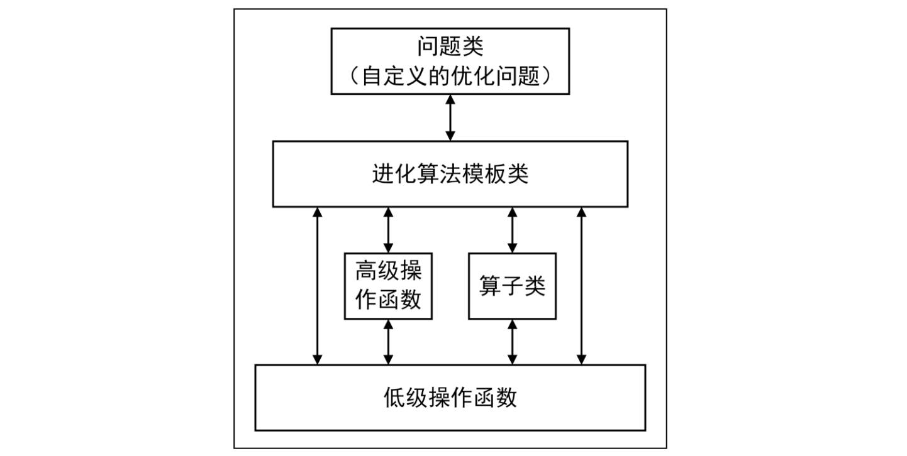

<style>
details {
    border: 1px solid #aaa;
    border-radius: 4px;
    padding: .5em .5em 0;
}
summary {
    font-weight: bold;
    margin: -.5em -.5em 0;
    padding: .5em;
}
details[open] {
    padding: .5em;
}
details[open] summary {
    border-bottom: 1px solid #aaa;
    margin-bottom: .5em;
}
img {
    pointer-events: none;
}
</style>

<details><summary>目录</summary><p>

- [最优化算法求解器](#最优化算法求解器)
- [Python Gurobi](#python-gurobi)
    - [Gurobi 简介](#gurobi-简介)
    - [Gurobi 安装](#gurobi-安装)
    - [Gurobi 数据结构](#gurobi-数据结构)
        - [Multidict](#multidict)
        - [Tuplelist](#tuplelist)
        - [Tupledict](#tupledict)
        - [Gurobi 数据结构示例](#gurobi-数据结构示例)
    - [Gurobi 参数和属性](#gurobi-参数和属性)
        - [参数类型](#参数类型)
            - [修改参数](#修改参数)
            - [修改参数的例子](#修改参数的例子)
        - [属性类型](#属性类型)
            - [修改属性](#修改属性)
            - [修改属性的例子](#修改属性的例子)
    - [Gurobi 线性化技巧](#gurobi-线性化技巧)
        - [最大值](#最大值)
        - [最小值](#最小值)
        - [绝对值](#绝对值)
        - [逻辑与](#逻辑与)
        - [逻辑或](#逻辑或)
        - [指示函数](#指示函数)
        - [带固定成本约束](#带固定成本约束)
        - [分段线性函数](#分段线性函数)
    - [Gurobi 多目标优化](#gurobi-多目标优化)
        - [Gurobi 多目标优化 API](#gurobi-多目标优化-api)
        - [合成型](#合成型)
        - [分层型](#分层型)
        - [混合型](#混合型)
        - [Gurobi 多目标优化示例](#gurobi-多目标优化示例)
    - [callback 函数](#callback-函数)
        - [callback 定义](#callback-定义)
        - [状态 where 与值 what](#状态-where-与值-what)
    - [callback 函数的功能](#callback-函数的功能)
- [Python SCIP](#python-scip)
    - [SCIP 简介](#scip-简介)
    - [SCIP 安装](#scip-安装)
        - [Conda](#conda)
        - [pip](#pip)
    - [SCIP 解决的问题](#scip-解决的问题)
        - [Linear Program](#linear-program)
        - [Mixed-Integer Linear Program](#mixed-integer-linear-program)
        - [Mixed-Integer NonLinear Program](#mixed-integer-nonlinear-program)
        - [Constraint Integer Program](#constraint-integer-program)
        - [Convex MINLP](#convex-minlp)
        - [Pseudoboolean optimization](#pseudoboolean-optimization)
        - [Satisfiability (SAT) and variants](#satisfiability-sat-and-variants)
        - [Multicriteria optimization](#multicriteria-optimization)
        - [Mixed-Integer SemiDefinite Program](#mixed-integer-semidefinite-program)
    - [SCIP 快速使用](#scip-快速使用)
- [Python CPLEX](#python-cplex)
    - [CPLEX 简介](#cplex-简介)
    - [CPLEX 安装](#cplex-安装)
        - [pip](#pip-1)
        - [conda](#conda-1)
        - [CPLEX Studio](#cplex-studio)
    - [CPLEX 使用](#cplex-使用)
        - [Mathematical Programming](#mathematical-programming)
        - [Constraint Programming](#constraint-programming)
- [Python Ortools](#python-ortools)
    - [Ortools 简介](#ortools-简介)
    - [安装](#安装)
    - [快速开始](#快速开始)
        - [什么是优化问题](#什么是优化问题)
        - [解决 Python 中的优化问题](#解决-python-中的优化问题)
        - [Python 程序](#python-程序)
        - [运行程序](#运行程序)
    - [优化问题类型](#优化问题类型)
        - [线性优化](#线性优化)
        - [限制条件优化](#限制条件优化)
        - [混合整数优化](#混合整数优化)
        - [分配关系](#分配关系)
        - [打包](#打包)
        - [调度](#调度)
        - [路由](#路由)
        - [网络流](#网络流)
- [Python Scipy](#python-scipy)
    - [数值优化](#数值优化)
    - [APIs 说明](#apis-说明)
    - [多元标量函数的无约束最小化(minimize)](#多元标量函数的无约束最小化minimize)
        - [示例](#示例)
    - [多元标量函数的约束最小化(minimize)](#多元标量函数的约束最小化minimize)
    - [全局最优](#全局最优)
    - [最小二乘最小化](#最小二乘最小化)
    - [单变量函数最小化器](#单变量函数最小化器)
    - [自定义最小化器](#自定义最小化器)
    - [寻根](#寻根)
    - [线性规划](#线性规划)
- [Python Pyomo](#python-pyomo)
    - [Pyomo 简介](#pyomo-简介)
    - [安装 pyomo 和 GLPK](#安装-pyomo-和-glpk)
- [Python PuLP](#python-pulp)
- [Python Geatpy](#python-geatpy)
    - [Population 类是一个表示种群的类](#population-类是一个表示种群的类)
    - [Algorithm 类是进化算法的核心类](#algorithm-类是进化算法的核心类)
- [参考](#参考)
</p></details><p></p>

# 最优化算法求解器

无论是在生产制造领域，还是在金融、保险、交通等其他领域，当实际问题越来越复杂、
问题规模越来越庞大，就需要借助计算机的快速计算能力，求解器的作用就是能简化编程问题，
使得工程师能专注于问题的分析和建模，而不是编程。

算法优化的求解器有很多，其中商用的求解器包括 Gurobi、CPLEX、Xpress 等；
开源的求解器有 SCIP、GLPK、Ortools 等，这些求解器都有 Python 接口，
因此，能够用比较简单的方式对运筹优化问题进行建模。

* **Gurobi** 是由美国 Gurobi 公司开发的针对算法最优化领域的求解器，可以高效求解算法优化中的建模问题。
* **SCIP**：
* **CPLEX** 用于 Python 的 IBM Decision Optimization CPLEX 建模包
* Ortools 是 Google 开源维护的算法优化求解器，针对 Google 的商业场景进行优化，如 VRP 问题，
  对于中小规模的商业场景的使用是个不错的选择。
* Scipy
* Xpress
* GLPK

# Python Gurobi

> gurobipy，Gurobi 的 Python API

## Gurobi 简介

运筹优化软件 Gurobi 虽然核心是使用 C/C++ 编写的，但也开发了 Python 接口，
使 Python 使用者能够以其熟悉的方式用 Gurobi 求解算法最优化问题。

## Gurobi 安装 

Gurobi 的安装根据[参考文档](https://support.gurobi.com/hc/en-us/articles/360044290292-How-do-I-install-Gurobi-for-Python)进行安装即可，在安装了 Gurobi 软件之后，
Gurobi 的 Python 扩展就可以直接到 Gurobi 的安装目录用一下命令进行安装：

```bash
$ pip install gurobipy
```

## Gurobi 数据结构

虽然用基础的 Python 数据结构也能实现 Gurobi 的建模，但在建模过程中，经常要对带不同下标的数据进行组合，
如果使用 Python 内置的数据结构，则效率会比较低，为了提高建模效率，Gurobi 封装了更高级的 Python 数据结构，
即 `Multidict`、`Tuplelist`、`Tupledict`。在对复杂或大规模问题建模时，它们可以大大提高模型求解的效率。

### Multidict

Multidict，即复合字典，就是多重字典的意思，`multidict` 函数允许在一个语句中初始化一个或多个字典

```python
import gurobipy as grb

student, chinese, math, english = grb.multidict({
    "student1": [1, 2, 3],
    "student2": [2, 3, 4],
    "student3": [3, 4, 5],
    "student4": [4, 5, 6],
})

# 字典的键
print(student)
# 语文成绩的字典
print(chinese)
# 数学成绩的字典
print(math)
# 英语成绩的字典
print(english)
```

```
['student1', 'student2', 'student3', 'student4']
{'student1': 1, 'student2': 2, 'student3': 3, 'student4': 4}
{'student1': 2, 'student2': 3, 'student3': 4, 'student4': 5}
{'student1': 3, 'student2': 4, 'student3': 5, 'student4': 6}
```

### Tuplelist

Tuplelist，即元组列表，就是 `tuple` 和 `list` 的组合，也就是 `list` 元素的 `tuple` 类型，
其设计的目的是为了高效地在元组列表中构建子列表，如可以使用 `tuplelist` 对象的 `select` 方法进行检索。
如与特定字段中的一个或多个指定值匹配的所有元组，这个操作有点像 SQL 里的 `select-where` 操作。

```python
import gurobipy as grb

t1 = grb.tuplelist([
    (1, 2),
    (1, 3),
    (2, 3),
    (2, 5),
])

print(t1)
# 输出第一个值是 1 的元素
print(tl.select(1, "*"))
# 输出第二个值是 3 的元素
print(tl.select("*", 3))
```

```
<gurobi.tuplelist (4 tuples, 2 values each):
 ( 1 , 2 )
 ( 1 , 3 )
 ( 2 , 3 )
 ( 2 , 5 )
>
<gurobi.tuplelist (2 tuples, 2 values each):
 ( 1 , 2 )
 ( 1 , 3 )
>
<gurobi.tuplelist (2 tuples, 2 values each):
 ( 1 , 3 )
 ( 2 , 3 )
>
```

Tuplelist 继承自 list，所以向 `tuplelist` 中添加新元素和普通 `list` 添加元素一样，
有 `append`、`pop` 等方法，同样用迭代地方式遍历元素。

```python
# 添加一个元素
t1.append((3, 5))
print(t1.select(3, "*"))

# 使用迭代地方式实现 select 功能
print(t1.select(1, "*"))
```

```
<gurobi.tuplelist (1 tuples, 2 values each):
 ( 3 , 5 )
>
<gurobi.tuplelist (2 tuples, 2 values each):
 ( 1 , 2 )
 ( 1 , 3 )
>
```

从上面的代码可以看出，其实 `tuplelist` 在内部存储上和普通的 list 是一样的，
只是 Gurobi 在继承 list 类的基础上添加了 `select` 方法。因此，可以把 `tuplelist` 看作是 list 对象，
可以用迭代、添加或删除元素等方法。


### Tupledict

Tupledict 是 Python 的 `dict` 的一个子类，
通过 `tupledict` 可以更加高效地操作 Gurobi 中的变量子集，
也就是说当定义了很多变量，需要对一部分变量进行操作时，
可以使用 `tupledict` 的内置方法来高效轻松地构建线性表达式，如 `sum` 和 `prod`。

`tupledict` 的键在内部存储格式是 `tuplelist`，
因此可以使用 `tuplelist` 的 `select` 方法选择集合的子集。在实际使用中，
通过将元组与每个 Gurobi 变量关联起来，可以有效地创建包含匹配变量子集的表达式。

示例：

下面创建一个 `$3 \times 3$` 的矩阵，里面的每个元素表示线性表达式的变量，
取其中一部分变量的操作就显得很方便了。

`$$\begin{bmatrix}
x_{11} & x_{12} & x_{13} \\
x_{21} & x_{22} & x_{23} \\
x_{31} & x_{32} & x_{33}
\end{bmatrix}$$`

```python
import gurobipy as grb

model = grb.Model()

# 定义变量的下标
t1 = [
    (1, 1), (1, 2), (1, 3),
    (2, 1), (2, 2), (2, 3),
    (3, 1), (3, 2), (3, 3),
]
vars = model.addVars(t1, name = "d")
```

对第 1 行求和，即 `$x_{11} + x_{12} + x_{13}$`，下面是两种计算方法：

```python
# 基于元素下标的操作，对第一行求和
print(sum(vars.select(1, "*")))
print(vars.sum(1, "*"))
```

```
<gurobi.LinExpr: d[1,1] + d[1,2] + d[1,3]>
```

上面的例子中讨论的情况是变量的系数都是 1，如果变量系数不是 1，就不能用 `sum` 方法，
而需要用 `prod` 方法来构建线性表达式，`prod` 方法用于变量和系数相乘后的累加。
首先创建一个系数矩阵，用 `tupledict` 存储，键与 `vars` 是一样的，
这样就可以快速匹配系数和对应的变量，然后采用 `prod` 方法来选定的变量和系数来构建线性表达式。

```python
import gurobipy as grb

# 创建一个系数矩阵，用 tupledict 格式存储
c1 = [
    (1, 1),
    (1, 2),
    (1, 3),
]
coeff = grb.tupledict(c1)
coeff[(1, 1)] = 1
coeff[(1, 2)] = 0.3
coeff[(1, 3)] = 0.4

print(vars.prod(coeff, 1, "*"))
```

```
<gurobi.LinExpr: d[1,1] + 0.3 d[1,2] + 0.4 d[1,3]>
```

如果不是选择部分变量而是选择全部变量，`prod` 函数实现的功能就是具有相同下标的变量相乘后加和。

```python
obj = grb.quicksum(cost[i, j] * x[i, j] for i , j in arcs)
obj = x.prod(cost)
```

由于 `tupledict` 是 `dict` 的子类，因此可以使用标准的 `dict` 方法来修改 `tupledict`。
Gurobi 变量一般都是 `tupledict` 类型，用 `tupledict` 定义变量的好处是可以快速选择部分变量，
创建各种各样的约束，因为 `tupledict` 有 `sum` 函数和 `select` 函数。

```python
import gurobipy as grb

# tupledict 类型的变量快速创建约束条件
m = grb.Model()

x = m.addVars(3, 4, vtype = grb.GRB.BINARY, name = "x")
m.addConstrs((x.sum(i, "*") <= 1 for i in range(3)), name = "con")
m.update()
m.write("tupledict_vars.lp")

# 将创建如下约束：
# con[0]: x[0,0] + x[0,1] + x[0,2] + x[0,3] <= 1
# con[1]: x[1,0] + x[1,1] + x[1,2] + x[1,3] <= 1
# con[2]: x[2,0] + x[2,1] + x[2,2] + x[2,3] <= 1
```

### Gurobi 数据结构示例

下面通过一个网络流的例子来讲解 `Multidict`、`Tuplelist`、`Tupledict` 在优化建模的问题中的应用。
在这个网络流的例子中，有两个城市生产了两种商品，必须装运到三个城市的仓库，以满足给定的需求。
网络中每一条弧都有其总容量和成本。

```python
import gurobipy as grb

# global variable
LOGGING_LABEL = __file__.split('/')[-1][:-3]


# ------------------------------
# 两种商品
# ------------------------------ 
commodities = ["Pencils", "Pens"]

# ------------------------------
# 两个产地、三个目的地
# ------------------------------ 
nodes = [
    "Detroit",
    "Denver",
    "Boston",
    "New York",
    "Seattle",
]

# ------------------------------
# 网络中每条弧的容量(multidict)
# ------------------------------ 
arcs, capacity = grb.multidict({
    ("Detroit", "Boston"): 100,
    ("Detroit", "New York"): 80,
    ("Detroit", "Seattle"): 120,
    ("Denver", "Boston"): 120,
    ("Denver", "New York"): 120,
    ("Denver", "Seattle"): 120,
})
# print(arcs)
# print(capacity)

# ------------------------------
# 商品在不同弧上的运输成本(tupledict)
# ------------------------------ 
cost = {
    ("Pencils", "Detroit", "Boston"): 10,
    ("Pencils", "Detroit", "New York"): 20,
    ("Pencils", "Detroit", "Seattle"): 60,
    ("Pencils", "Denver", "Boston"): 40,
    ("Pencils", "Denver", "New York"): 40,
    ("Pencils", "Denver", "Seattle"): 30,
    ("Pens", "Detroit", "Boston"): 20,
    ("Pens", "Detroit", "New York"): 20,
    ("Pens", "Detroit", "Seattle"): 80,
    ("Pens", "Denver", "Boston"): 60,
    ("Pens", "Denver", "New York"): 70,
    ("Pens", "Denver", "Seattle"): 30,
}

# ------------------------------
# 商品在不同节点的流入量、流出量（需求量），
# 正数表示产地，负数表示需求量(tupledict)
# ------------------------------ 
inflow = {
    ("Pencils", "Detroit"): 50,
    ("Pencils", "Denver"): 60,
    ("Pencils", "Boston"): -50,
    ("Pencils", "New York"): -50,
    ("Pencils", "Seattle"): -10,
    ("Pens", "Detroit"): 60,
    ("Pens", "Denver"): 40,
    ("Pens", "Boston"): -40,
    ("Pens", "New York"): -30,
    ("Pens", "Seattle"): -30,
}

# ------------------------------
# 创建模型
# ------------------------------ 
m = grb.Model("netflow")

# ------------------------------
# 创建变量(tupledict) 
# ------------------------------
flow = m.addVars(commodities, arcs, obj = cost, name = "flow")
# print(flow)

# ------------------------------
# 添加约束
# ------------------------------ 
# 添加容量约束
# capacity[i, j] 表示 i->j 的弧的容量，i 是产地，j 是目的地
m.addConstrs(
    (flow.sum("*", i, j) <= capacity[i, j] for i, j in arcs), 
    "cap"
)

# 添加节点流入=流出的约束
m.addConstrs(
    (flow.sum(h, "*", j) + inflow[h, j] == flow.sum(h, j, "*") for h in commodities for j in nodes),
    "node"
)

# ------------------------------
# 求解模型
# ------------------------------ 
m.optimize()

# ------------------------------
# 输出结果
# ------------------------------ 
if m.status == grb.GRB.Status.OPTIMAL:
    solution = m.getAttr("x", flow)
    for h in commodities:
        print(f"\nOptimal flows for {h}")
        for i, j in arcs:
            if solution[h, i, j] > 0:
                print(f"{i} -> {j}: {solution[h, i, j]}")
```

## Gurobi 参数和属性

Gurobi 的默认参数并不能高效求解模型，因此有必要了解 Gurobi 的重要参数和属性，以便在建模过程中能写出更高效的代码，
能更快地进行试验和求解模型。

这里将讲解 Gurobi 的参数（Parameterss）和属性（Attributes）。通过参数来控制优化器的行为，
如求解时间限制、在命令行窗口中输出日志、MIP 可行解数量等，因此需要在优化求解启动前设置。
通过属性来控制模型（变量、约束、目标等对象）的特征，如模型优化方向、变量的上界和下界等。

### 参数类型

参数控制 Gurobi 优化求解器的行为，需要在启动之前设置，一般来说 Gurobi 已经选择了最优的参数作为默认值，
因此除非有必要，否则不用修改这些默认参数。

前 8 种类型参数使用比较多，后 3 种类型参数在部署 Gurobi 服务器或部署服务计算时使用，
这些参数的详细说明可以参考 Gurobi 接口文档的相关内容。

1. **Termination 停止参数**，用于控制求解的停止条件。
    - TimeLimit 设定整个求解过程耗时限制；
    - SolutionLimit 设定 MIP 可行解数量；
    - BarIterLimit 设定障碍法（Barrier）迭代次数限制；
    - IterationLimit 设定单纯形法迭代次数限制；
2. **Tolerances 容差参数**，用于控制结果的精度，在大多数情况下，这个限制是通过数值公差来管理的；
   如果冲突小于相应的公差，求解器将结果视为满足约束。
3. **Simplex 单纯形参数**，用于控制单纯形法的应用。如 InfUnbdInfo 控制是否生成不可行或无界模型附加信息。
4. **Barrier 障碍法参数**，用于控制障碍法的操作，障碍法也称罚函数法。如 QCPDual 控制是否获取二次模型的对偶值。
5. **MIP 混合整数规划参数**，用于控制混合整数规划算法。如 BranchDir 用于设定分支割平面搜索方向，默认值是自动选择的
6. **MIP Cuts 割平面参数**，用于控制割平面的形式。如 Cuts 用于控制全局割平面法的强度。
7. **Tuning 调参参数**，用于控制求解器的调参行为。如 `TuneCriterion` 可设定调参的准则，
   `TuneTimeLimit` 可设定调参的事件。
8. **Multiple Solutions 多解参数**，用于修改 MIP 的搜索行为，用于尝试为 MIP 模型寻找多个解。
   如 `PoolSolutions` 决定存储可行解的数量。
9.  **Distributed Algorithms 分布式计算参数**，用于控制分布式并行计算（分布式 MIP、分布式并发和分布式调优）参数。
10. **Compute Server 计算服务器参数**，用于配置和启动 Gurobi 计算服务器作业的参数。
11. **Cloud 云计算参数**，用于启动 Gurobi 即时云实例的参数。
12. **Token Server 令牌服务参数**，用于通信加密等功能。
13. 其他参数，是上述 12 种参数之外的参数，部分参数和上述参数有关联但是又不完全符合该分类，故独立出来。
    比如 `LogFile` 参数用于指定将模型求解信息保存到日志文件 `LogFile`

#### 修改参数

Gurobi 修改参数有三种方法：

1. `setParam(paramname, newvalue)` 方法，其中 `paramname` 还有两种方法：
    - 一种是参数的字符串，比如 `TimeLimit`
    - 一种是完整的类属性，比如 `gkb.GRB.param.TimeLimit`
2. 直接修改类的属性，写法是 `model.Params.xxx`

#### 修改参数的例子

示例 1：

```python
import gurobipy as grb

model = grb.Model()

# 设定求解时间的方法
# 方法 1
model.setParam("TimeLimit", 600)
# 方法 2
model.setParam(GRB.param.TimeLimit, 600)
# 方法 3
model.Params.TimeLimit = 600
```

示例 2：演示如何在优化器启动前修改 `TimeLimit` 参数和 MIP 模型的 `MIPFocus` 参数。

```python
import gurobipy as grb

# 读取模型文件
model_file = "XXX.lp"
m = grb.read(model_file)

# 参数设定 1：设定优化器求解时间限定 2 秒
m.Params.TimeLimit = 2

# 复制模型
bestModel = m.copy()
bestModel.optimize()

# 模型调参
# 修改模型参数比较不同参数下的求解结果
for i in range(1, 4):
    m.reset()  # 将所有参数重置为默认值
    m.Params.MIPFocus = i  # 参数设定 2：修改 MIPFocus 参数
    m.optimize()
    if bestModel.MIPGap > m.MIPGap:
        bestModel, m = m, bestModel  # swap 模型

# 将运行参数修改为默认值，并重新运行模型
del m
best_model.Params.TimeLimit = "default"
bestModel.optimize()
print(f"Solved with MIPFocus: {bestModel.Params.MIPFocus}")
```

示例 3：

```python
import gurobipy as grb

# 读取模型
model = grb.read("tune_model.lp")

# 将返回最优参数组合数设置为 1
model.Params.tuneResults = 1

# 模型调参
model.tune()

# 如果找到最优参数组合数大于 0
if model.tuneResultCount > 0:
    # 获取最优参数组合，注意 getTuneResult 
    # 会覆盖内部默认属性，参数组合按最优到最差降序排序，
    # 最优的结果序号是 0
    model.getTuneResult(0)
    # 将调参后的参数组合保存到文件中
    model.write("tune.prm")
    # 用获取的最优参数组合再次求解模型
    model.optimize()
```

### 属性类型

通过属性（Attributes）能够控制模型（变量、约束、目标等对象）的特征，
Gurobi 中的属性共分为 8 种类型，分别是：

1. 模型属性（Model Attributes）
    - `ModelSense` 模型优化方向（最大化或最小化）
    - `ObjVal` 当前的目标值。
2. 变量属性（Variable Attributes）
    - `varName` 获取当前变量的名称
    - `x` 获取当前变量的取值
    - `Start` 属性用于设置 MIP 模型的初始解
3. 线性约束属性（Linear Constraint Attributes），这些属性提供与特定线性约束相关的信息
    - `Pi` 约束对应的对偶值
    - `Slack` 约束对应的松弛量
    - `RHS` 约束对应的右端项
4. SOS 约束属性（Special-Ordered Set Constraints Attributes），这些属性提供与特定的顺序集（SOS）约束相关的信息
    - `IISSOS` 对不可行的模型，指示约束是否属于 IIS （Irreducible Inconsistent Subsystem）
5. 二次约束属性（Quadratic Constraint Attributes），这些属性提供与特定二次约束相关的信息
    - `QCRHS` 约束右端项
6. 广义约束属性（General Constraint Attributes），这些属性提供与特定常规约束关联的信息
    - `GenConstrName` 约束名称
7. 解质量属性（Solution Quality Attributes），用于评价解质量的相关属性
    - `BoundVio` 最大的界违反
    - `IntVio` 整数变量离最近整数的最大距离
8. 多目标属性（Multi-objective Attributes），用于多目标优化问题的相关属性
    - `ObjN` 对应多目标表达式中的变量系数
    - `ObjNVal` 对应目标函数值

#### 修改属性

查看和修改 Gurobi 参数属性的方法很简单。注意：并不是所有属性都能进行修改，
对于只读属性就只能查看而不能修改。

1. 查看属性
    - 方法：`getAttr(attrname, objs)`，其中 `attrname` 是属性名称，
      `objs`（可选）是列表或字典对象用来存储查询的值。  
    - 例如：`model.getAttr(GRB.Attr.ObjVal)` 或简写为 `model.ObjVal`。
2. 修改属性
    - 方法：`setAttr(attrname, newvalue)`，其中 `attrname` 是属性名称，`newvalue` 是属性的值。
    - 例如：`var.setAtrr(GRB.Attr.VType, "C")` 或简写为 `var.VType = "C"`   

#### 修改属性的例子

Gurobi 求解整数规划的例子中：

```python
# 通过模型属性获取模型最优解
print(f"最优值：{m.objVal}")

# 通过变量属性获取变量值
for v in m.getVars():
    print(f"参数 {v.varName} = {v.x}")
```

其中：

* `m.objVal` 用于获取目标函数值的属性
* `v.varName` 用于获取变量名称的属性
* `v.x` 用于获取变量值的属性

## Gurobi 线性化技巧

现在最优算法规划求解软件都是基于**线性规划原理**而设计开发的，然而实际问题却千变万化，
它们的约束、目标等各不相同。如何对实际问题进行建模，并将它归结为一个线性规划问题，
是应用线性规划求解问题时最重要，也是最困难的一步。

问题建模是否合理，很大程度上会影响后续的模型求解过程。但是，由于受限于实际问题特征、
建模经验、建模技巧等因素，在对问题建立初步模型之后，目标函数和约束条件往往会包含一些**特殊约束**或**特殊变量**，
如绝对值、在集合中取最大值和最小值、二选一的问题等。尽管它们看起来不是线性规划问题，但是通过一些建模技巧，
可以将其转化成线性规划问题，将非线性约束转换成线性约束为广义约束。

**广义约束**不同于**线性约束**或**函数约束**，函数约束可以看成是连续光滑的函数表达式，
如 `$x+y+z>0$`；而广义约束更像是一种集合操作、分段函数，如 `$h=max(x,y,z)$`，
函数约束给人的感觉是可微函数空间，而广义约束是不可微的。
虽然这么说不恰当，但是广义约束的处理和平常接触到的优化模型的分析思路有很大的区别。

添加广义约束有两种方法：

1. `model` 类的方法 `add_XXX`
2. `model.addConstr` 方法

约束条件用 Gurobi 内置函数表示，即用 `gurobipy.XXX` 函数来表达广义约束。

### 最大值

`$max$` 函数用来获取集合中的最大值，如 `$z=max(x,y,3)$`，
这类问题可以通过大 M 法转换成线性约束：

`$$\text{max}\space z$$`

`$$z = max(x,y,3) \Rightarrow s.t.\begin{cases}
x \leq z, y \leq z, 3 \leq z \\ 
x \leq z - M(1-u_{1}) \\
y \leq z - M(1-u_{2}) \\
3 \leq z - M(1-u_{3}) \\
u_{1} + u_{2} + u_{3} \geq 1 \\
u_{1}, u_{2}, u_{3} \in \{0, 1\}
\end{cases}$$`

大 M 法是数学规划中的一个建模技巧，
通过引入一个极大的数 M，结合约束条件来实现逻辑运算功能。

下面演示常规的线性化方法和 Gurobi 内置 `max_` 广义线性化接口的方法，其得到的结果是一样的。

```python
# max 线性化方法 1：常规线性方法，假设 x = 4, y = 5
import gurobipy as grb

# 创建模型
m = grb.Model()

# 定义变量
x = m.addVar(name = "x")
y = m.addVar(name = "y")
z = m.addVar(name = "z")
u1 = m.addVar(vtype = "B", name = "u1")
u2 = m.addVar(vtype = "B", name = "u2")
u3 = m.addVar(vtype = "B", name = "u3")
M = 10000

# 添加约束
m.addConstr(x < z - M * (1 - u1), name = "c1")
m.addConstr(y < z - M * (1 - u2), name = "c2")
m.addConstr(3 < z - M * (1 - u3), name = "c3")
m.addConstr(x == 4, name = "c4")
m.addConstr(y == 5, name = "c5")
m.addConstr(u1 + u2 + u3 >= 1, name = "c6")
m.addConstr(x < z, name = "c7")
m.addConstr(y < z, name = "c8")
m.addConstr(3 < z, name = "c9")

# 定义目标函数并求解
m.setObjective(z)
m.optimize()
print(f"最大值是：z={z.X}")

# 输出：z=5
```

```python
# max 线性化方法 2：使用 gurobi 内置接口方法
import gurobipy as grb

# 创建模型
m = grb.Model()

# 定义变量
x = m.addVar(name = "x")
y = m.addVar(name = "y")
z = m.addVar(name = "z")

# 添加约束
m.addConstr(x == 4, name = "c4")
m.addConstr(y == 5, name = "c5")
m.addConstr(z == grb.max_(x, y, 3))

# 定义目标函数并求解
m.setObjective(z)
m.optimize()
print(f"z={z.X}")

# 输出：z=5.0
```

### 最小值

与 max 函数相对应的是 min 函数，获取集合中的最小值，以 `$z=min(x,y,3)$`，
使用大 M 法得到对应的线性约束表达式，即：

`$$\text{min} \space z$$`

`$$z = min(x,y,3) \Rightarrow s.t.\begin{cases}
x \geq z, y \geq z, 3 \geq z \\ 
x \geq z - M(1-u_{1}) \\
y \geq z - M(1-u_{2}) \\
3 \geq z - M(1-u_{3}) \\
u_{1} + u_{2} + u_{3} \geq 1 \\
u_{1}, u_{2}, u_{3} \in \{0, 1\}
\end{cases}$$`

### 绝对值

abs 约束表示获取变量的绝对值，例如有如下规划问题：

`$$\text{min}\space c|x|$$`

令 `$y = |x|$`，即 `$y \geq x, y \geq -x$`，将原问题转换成如下新问题：

`$$\text{min} \space cy$$`
`$$s.t. \begin{cases}
y \geq x \\ 
y \geq -x
\end{cases}$$`

```python
import gurobipy as grb

m = grb.Model()

x = m.addVar(lb = -10, name = "x")
y = m.addVar(name = "y")

m.addConstr(y == grb.abs_(x), name = "C_abs")
m.addConstr(x >= -5, name = "C_2")
m.addConstr(x <= 3, name = "C_3")
c = 2
m.setObjective(c * y)
m.optimize()
print(f"y = y.X")
print(f"x = x.X")

# 输出
# y = 0.0
# x = 0.0
```

### 逻辑与

如果集合中全部变量都是 1，则结果为 1，否则为 0。判断集合中的变量是否全为 1 的实现功能，
类似 Pandas 中的 `any` 功能。

例如，如果 `$x=1$` 且 `$y=1$`，则 `$z=1$`，否则 `$z=0$`，
可以用大 M 法结合 0-1 变量(0-1 变量指的是取值只能是 0 或 1 的变量，
又称二值变量)实现线性化，具体如下：

令 `$j=x+y-m+B$`，若 `$j>0$` 则 `$z=1$`，否则 `$z=0$`。其中变量的个数，此处 `$m=2$`，
`$B$` 是一个很小的正数。因此，将问题转换成指示函数 `indicator` 的线性化问题。

### 逻辑或

集合中全部变量只要有一个使 1 则结果位 1，否则为 0，即实现“不全为 0”的判断，
如有下面的问题：

`$$\text{max} \space z = x+y$$`
`$$\text{s.t.} \space 2x+3y\leq 100\space \text{or} \space x+y\leq 50$$`

可使用大 M 法转换成线性规划问题，具体如下：

`$$\text{max} \space z = x+y$$`
`$$\text{s.t.}\begin{cases}
2x+3y \leq 100 + uM \\
2x+3y \leq 100+(1-u)M \\
u \in \{0, 1\}
\end{cases}$$`

### 指示函数

如果指示变量的值为 1，则约束成立，否则约束可以被违反。

例如，如果 `$x>0$`，则 `$y=1$`，否则 `$y=0$`，
`indicator` 的线性方法可以使用大 M 法实现，原理如下：

`$$x>0 \rightarrow y=1 \Rightarrow 
\begin{cases}
x \leq uM \\
uM \leq M + x + B 
\end{cases}$$`

其中，`$M$` 是一个很大的数，`$B$` 是一个很小的正数。

在 Gurobi 中实现该功能的是函数 `addGenConstrIndicator`：

```python
import gurobipy as grb

model = grb.Model()

x = model.addVar(name = "x")
y = model.addVar(name = "y")
model.addConstr((y == 1) >> (x > 0), name = "indicator")
```

### 带固定成本约束

在库存问题中，通常会考虑订货的固定成本和可变成本。就是说，
只要订货 `$x>0$` 就有一个固定成本 `$k$` 和可变成本 `$cx$`，它的成本函数是：

`$$z(x) = \begin{cases}
0, x = 0 \\
cx + k, x > 0 
\end{cases}$$`

这实际上是一个二选一约束，使用大 M 法即可转换成线性约束，即：

`$$z(x)=cx+ky$$`

`$$z(x)=\begin{cases}
0 \\
cx + k
\end{cases}
\Rightarrow\text{s.t.}\begin{cases}
x \leq yM \\
y = \{0, 1\}   
\end{cases}$$`

### 分段线性函数

在现实生活中，购买商品的数量越多就会有折扣，其单价就越低。在数学中，
它的成本或利润函数可以表示为如下的分段线性函数：

`$$z=\begin{cases}
2+3x, 0 \leq x \leq 2 \\ 
20-x, 2 \leq x \leq 3 \\
6+2x, 3 \leq x \leq 7
\end{cases}$$`

对于分段线性函数，可以通过引入 **SOS2 约束(a Special Order Set Constraint of Type 2)**，
将其转换为线性规划。然而，还有一个更通用的方法，
设有一个 `$n$` 段线性函数 `$f(x)$` 的分界点 `$b_{1} \leq \cdots \leq b_{n} \leq b_{n+1}$`，
引入 `$w_{k}$` 将 `$x$` 和 `$f(x)$` 表示为：

`$$x=\sum_{k=1}^{n+1}w_{k}b_{k}$$`
`$$f(x_{k})=\sum_{k=1}^{n+1}w_{k}f(b_{k})$$`

`$w_{k}$` 和 `$z_{k}$` 满足以下约束：

`$$z_{1}+\cdots+z_{n} = 1, z_{k}=\{0, 1\}$$`
`$$w_{1}+\cdots+w_{n+1}=1, w_{k}\geq 0$$`

前面已经讲了许多非线性模型线性化的方法，需要注意的是，在使用 Gurobi 的广义线性化函数时，
不能对表达式做线性化，而需要先将表达式赋予变量，然后再对变量做线性化，例如：

```python
m.addConstr(z == grb.max_(x, y))
```

`$$\text{s.t.} \space x = g + k$$`

是正确的，而：

```python
m.addConstr(z == grb.max_(g + k, y))
```

则是错误的。

## Gurobi 多目标优化

在多目标优化中，可以直接把多个目标通过分配权重的方式组合成单目标优化问题，
但是如果多个目标函数之间的数量级差异很大，则应该使用分层优化的方法。

### Gurobi 多目标优化 API

在 Gurobi 中，可以通过 `Model.setObjectiveN` 函数来建立多目标优化模型，
多目标的 `setObjectiveN` 函数和单目标的 `setObjective` 函数用法基本一致，
不同的是多了目标优先级、目标劣化接受程度、多目标的权重等参数。

```python
setObjectiveN(expr, index, priority, weight, abstol, reltol, name)
```

参数说明如下：

1. `expr`: 目标函数表达式，如 `$x+2y+3z$`；
2. `index`: 目标函数对应的需要 `$(0, 1, 2, \cdots)$`，即第几个目标，注意目标函数序号从 `$0$` 开始；
3. `priority`: 优先级，为整数，值越大表示目标优先级越高；
4. `weight`: 权重（浮点数），在合成型多目标解法中使用该参数，表示不同目标之间的组合权重；
5. `abstol`: 允许的目标函数值最大的降低量 `abstol`（浮点数），即当前迭代的值相比最优值的可接受劣化程度；
6. `reltol`: `abstol` 的百分数表示，如 `reltol = 0.05` 表示可接受劣化程度是 5%； 
7. `name`: 目标函数名称；

需要注意的是，在 Gurobi 的多目标优化中，要求所有的目标函数都是线性的，并且目标函数的优化方向应一致，
即全部最大化或全部最小化，因此可以通过乘以 -1 实现不同的优化方向。

当前 Gurobi 支持 3 种多目标模式，分别是 Blend(合成型)、Hierarchical(分层型)、两者的混合型。

### 合成型

合成型(Blend)通过对多个目标赋予不同的权重实现将多目标转化成单目标函数，
权重扮演优先级的角色。例如，有如下两个优化目标：

`$$obj_{1}=x+2y, weight_{1} = 3$$`
`$$obj_{2}=x-3y, weight_{2} = 0.5$$`

经过合成后的单目标函数为：

`$$\begin{align}
obj
&=weight_{1} \times obj_{1} + weight_{2}\times obj_{2} \\
&=3\times (x+2y)-0.5\times(x-3y)\\
&=2.5x + 7.5
\end{align}$$`

Gurobi 使用方法如下：

```python
import gurobipy as grb

model = grb.Model()

x = model.addVar(name = "x")
y = model.addVar(name = "y")

# 添加第一个目标
model.setObjectiveN(x + 2 * y, index = 0, weight = 3, name = "obj1")
# 添加第二个目标
model.setObjectiveN(x - 3 * y, index = 1, weight = 0.5, name = "obj2")
```

```python
for i in range(model.NumObj):
    model.setParam(grb.GRB.Param.ObjNumber, i)
    print(f"第 {i} 个目标的优化值是 {model.objNVal}")
```

### 分层型

分层型(Hierarchical)有优先级，一般理解是在保证第一个目标值最优的情况下优化第二个目标，
或者在优化第二个目标时要保证第一个目标的最优值只能允许少量劣化。

例如，有如下两个优化目标：

`$$obj_{1}=x+2y, priority_{1}=2$$`
`$$obj_{2}=x-3y, priority_{2}=1$$`

此时 Gurobi 按照优先级大小进行优化（先优化 `$obj_{1}$`，再优化 `$obj_{2}$`）。
若没有设定 `abstol` 或 `reltol`，则在优化低优先级目标(`$obj_{2}$`)时，
不会改变高优先级的目标(`$obj_{1}$`)值。

```python
import gurobipy as grb

model = grb.Model()

x = model.addVar(name = "x")
y = model.addVar(name = "y")

# 添加第一个目标
model.setObjectiveN(x + 2 * y, index = 0, priority = 20, name = "obj1")
# 添加第二个目标
model.setObjectiveN(x - 3 * y, index = 1, priority = 1, name = "obj2")
```

```python
for i in range(model.NumObj):
    model.setParam(grb.GRB.Param.ObjNumber, i)
    print(f"第 {i} 个目标的优化值是 {model.objNVal}")
```

### 混合型

混合型的写法也很简单，将权重和优先级同时设定即可：

```python
import gurobipy as grb

model = grb.Model()

x = model.addVar(name = "x")
y = model.addVar(name = "y")

# 添加第一个目标
model.setObjectiveN(x + 2 * y, index = 0, weight = 3, priority = 20, name = "obj1")
# 添加第二个目标
model.setObjectiveN(x - 3 * y, index = 1, weight = 0.5, priority = 1, name = "obj2")
```

```python
for i in range(model.NumObj):
    model.setParam(grb.GRB.Param.ObjNumber, i)
    print(f"第 {i} 个目标的优化值是 {model.objNVal}")
```

### Gurobi 多目标优化示例

假设工厂需要把 `$N$` 份工作分配给 `$N$` 个工人，每份工作只能由一个工人做，
且每个工人也只能做一份工作。假设工人 `$i$` 处理工作 `$j$` 需要的时间是 `$T_{ij}$`，
获得的利润是 `$C_{ij}$`，那么需要怎么安排才能使得总利润最大且总耗时最小呢？

这里有两个目标，最主要的目标是利润最大化，次要目标是耗时最小化。

为了编程方便，这里假设 `$N=10$`，`$T_{ij}$` 和 `$C_{ij}$` 通过随机数生成。

```python
import numpy as np
import gurobipy as grb

# 设置工人数和工作数量
N = 10
np.random.seed(1234)

# 用随机数初始化时间矩阵 T_{ij} 和成本矩阵 C_{ij}
Tij = {
    (i, j): np.random.randint(0, 100) 
    for i in rang(1, N + 1) 
    for j in rang(1, N + 1)
}
Cij = {
    (i, j): np.random.randint(0, 100) 
    for i in rang(1, N + 1) 
    for j in rang(1, N + 1)
}

# 定义模型
m = grb.Model("MultiObj")

# 添加变量
# x 是 0-1 变量，xij=1 表示第 i 个工人被分配到第 j 个工作中
x = m.addVars(Tij.keys(), vtype = grb.GRB.BINARY, name = "x")

# 添加约束
# 第 1 个约束表示一份工作只能分配给一个工人
m.addConstrs((x.sum("*", j) == 1 for j in range(1, N + 1)), name = "C1")
# 第 2 个约束表示一个工人制作一份工作
m.addConstrs((x.sum(i, "*") == 1 for i in range(1, N + 1)), name = "C2")
```

多目标方式 1: 合成型

```python
# 设置多重目标权重
m.setObjectiveN(x.prod(Tij), index = 0, weight = 0.1, name = "obj1")
m.setObjectiveN(-x.prod(Cij), index = 1, weight = 0.5, name = "obj2")

# 启动求解
m.optimize()

# 获取求解结果
for i in Tij.keys():
    if x[i].x > 0.9:
        print(f"工人 {i[0]} 分配工作 {i[1]}")

# 获取目标函数值
for i in rang(1, 3):
    m.setParam(grb.GRB.Param.ObjNumber, i)
    print(f"Obj{i} = {m.ObjNVal}")
```

多目标方式 2：分层型

```python
# 设置目标函数
m.setObjectiveN(
    x.prod(Tij), index = 0, priority = 1, 
    abstol = 0, reltol = 0, name = "obj1"
)
m.setObjectiveN(
    -x.prod(Cij), index = 1, priority = 2, 
    abstol = 100, reltol = 0, name = "obj2"
)

# 启动求解
m.optimize()

# 获取求解结果
for i in Tij.keys():
    if x[i].x > 0.9:
        print(f"工人 {i[0]} 分配工作 {i[1]}")

# 获取目标函数值
for i in rang(1, 3):
    m.setParam(grb.GRB.Param.ObjNumber, i)
    print(f"Obj{i} = {m.ObjNVal}")
```

```

```

多目标方式 3：混合型

```python
# 设置目标函数

# 启动求解
m.optimize()
```

## callback 函数

`callback` 函数的主要作用是为了获取程序运行过程中的一些中间信息，
或者在程序运行过程中动态修改程序运行状态，如用户有时在求解过程中需要实现一些功能，
包括终止优化、添加约束条件（割平面）、嵌入自己的算法等。

### callback 定义

回调函数 `callback` 的定义的方法如下：

```python
def function_name(model, where):
    print("do something where gurobi run")
```

其中 `callback` 函数有两个固定的参数：

* `model` 是指定义的 `gurobi.Model` 类
* `where` 是指回调函数的出发点

在 `callback` 函数使用过程中，需要注意的是 `where` 和 `what`，
即在什么地方(`where`)获取哪些信息(`what`)，如下面的代码，`cbGet` 查询获取优化器的指定信息，
即 `grb.GRB.Callback.MULTIOBJ_OBJCNT` 当前解的数量。

```python
if where == grb.GRB.Callback.MULTIOBJ:  # where
    print(model.cbGet(grb.GRB.Callback.MULTIOBJ_OBJCNT))  # what
```

### 状态 where 与值 what

`callback` 函数的 `where` 取值如下：

| `where`             | 取值 | 优化器状态 |
|---------------------|------|-----------|
| `grb.GRB.Callback.POLLING` | `0`  | 轮询回调 |
| `grb.GRB.Callback.PRESOLVE` | `1`  | 预处理 |
| `grb.GRB.Callback.SIMPLEX` | `2`  | 单纯形 |
| `grb.GRB.Callback.MIP` | `3`  | 当前 MIP |
| `grb.GRB.Callback.MIPSOL` | `4`  | 发现新的 MIP 解 |
| `grb.GRB.Callback.MIPNODE` | `5`  | 当前探索节点 |
| `grb.GRB.Callback.MESSAGE` | `6`  | 打印出 Log 信息 |
| `grb.GRB.Callback.BARRIER` | `7`  | 当前内点法 |
| `grb.GRB.Callback.MULTIOBJ` | `8`  | 当前多目标 |

当 `where = grb.GRB.Callback.MIP` 时（MIP 建模），`what` 可以取以下值：

| what                          | 类型     | 描述               | 
|-------------------------------|----------|--------------------|
| `grb.GRB.Callback.MIP_OBJBST` | `double` | 当前最优目标值      |
| `grb.GRB.Callback.MIP_OBJBND` | `double` | 当前最优界          |
| `grb.GRB.Callback.MIP_NODCNT` | `double` | 当前已探索的节点数   |
| `grb.GRB.Callback.MIP_SOLCNT` | `int`    | 当前发现可行解的数量 |
| `grb.GRB.Callback.MIP_CUTCNT` | `int`    | 当前割平面使用次数   |
| `grb.GRB.Callback.MIP_NODLFT` | `double` | 当前未搜索的节点数   |
| `grb.GRB.Callback.MIP_ITRCNT` | `double` | 当前单纯形法迭代步数 |

当 `where = grb.GRB.Callback.MIPSOL` 时，`what` 可以取以下值：

| what                             | 类型     | 描述               | 
|----------------------------------|----------|--------------------|
| `grb.GRB.Callback.MIPSOL_SOL`    | `double` | 当前解的具体取值      |
| `grb.GRB.Callback.MIPSOL_OBJ`    | `double` | 新解的目标值 |
| `grb.GRB.Callback.MIPSOL_OBJBST` | `double` | 当前最优目标值 |
| `grb.GRB.Callback.MIPSOL_OBJBND` | `double` | 当前最优界 |
| `grb.GRB.Callback.MIPSOL_NODCNT` | `double` | 当前已搜索的节点数   |
| `grb.GRB.Callback.MIPSOL_SOLCNT` | `int`    | 当前发现可行解的数量 |

## callback 函数的功能

在 Gurobi 中除了 `cbGet` 函数外还有一些常用函数用于获取运行过程中信息或修改运行状态。

1. `cbGet(what)`
2. `cbGetNodeRel(vars)`
3. `cbGetSolution(vars)`
4. `cbCut(Ihs, sense, rhs)`
5. `cbLazy(Ihs, sense, rhs)`
6. `cbSetSolution(vars, solution)`
7. `cbStopOneMultiObj(objcnt)`

TODO

# Python SCIP

## SCIP 简介

SCIP 是目前混合整数规划 (MIP) 和混合整数非线性规划 (MINLP) 最快的非商业求解器之一。
它也是约束整数规划和分支切割与定界的框架。它允许完全控制求解过程并访问求解器内部的详细信息。
默认情况下，SCIP 附带了一系列不同的插件来求解 MIP 和 MINLP。

## SCIP 安装

### Conda

```bash
$ conda install --channel conda-forge pyscipopt
```

### pip

```bash
$ pip install pyscipopt
```

Windows 上需要手动设置环境变量，其中 

```bash
$ set PATH=%PATH%;%SCIPOPTDIR%\bin
```


## SCIP 解决的问题

### Linear Program 

> Linear Program, LP，线性规划

`$$\begin{align*} 
\text{min} \quad& c^T x \\ 
\text{s.t.} \quad& Ax \geq b \\ 
& x_{j} \geq 0 && \forall j \in \mathcal{N} 
\end{align*}$$`

### Mixed-Integer Linear Program

> Mixed-Integer Linear Program, MIP, 混合整数线性规划

`$$$$`
`$$\begin{align*}
\text{min} \quad& c^T x \\ 
\text{s.t.} \quad& Ax \geq b \\ 
&l_{j} \leq x_{j} \leq u_{j} && \forall j \in \mathcal{N} \\ 
&x_{j} \in \mathbb{Z} && \forall j \in \mathcal{I} 
\end{align*}$$`

### Mixed-Integer NonLinear Program

> Mixed-Integer NonLinear Program, MINLP, 混合整数非线性规划

`$$\begin{align*} 
\text{min} \quad& f(x) \\ 
\text{s.t.} \quad& g_{i}(x) \leq 0 && \forall i \in \mathcal{M} \\ 
&l_{j} \leq x_{j} \leq u_{j} && \forall j \in \mathcal{N} \\ 
&x_{j} \in \mathbb{Z} && \forall j \in \mathcal{I} 
\end{align*}$$`

### Constraint Integer Program

> Constraint Integer Program, CIP, 约束整数规划

`$$\begin{align*} 
\text{min} \quad& c^T x + d^T y \\ 
\text{s.t.} \quad& C_i(x,y) = \text{true} && \forall i \in \mathcal{M} \\ 
& x \in \mathbb{Z}^{p}, y \in \mathbb{R}^{n - p} 
\end{align*}$$`
`$$\text{where} \space \forall i \in\mathcal{M}, \forall x^* \in \mathbb{Z}^{p},$$`
`$$\{ y : C_i(x^*, y) = \text{true} \} \space \text{is a polyhedron.}$$` 

### Convex MINLP 

> Convex MINLP Like MINLP

`$$f \space \text{and all} \space g_{i} \space\text{are convex.}$$`

### Pseudoboolean optimization

`$$\begin{align*} 
\text{min} \quad& c^T x \\ 
\text{s.t.} \quad& \sum_{k=0}^p a_{ik} \cdot \prod_{j \in \mathcal{N}_{ik}} x_j \leq b_i && \forall i \in \mathcal{M} \\ 
&x_{j} \in \{0,1\} && \forall j \in \mathcal{N} 
\end{align*}$$`

### Satisfiability (SAT) and variants

`$$\begin{align*} 
\text{min} \quad& 0 \\ 
\text{s.t.} \quad&\bigvee\limits_{j \in B_i} x_j \vee \bigvee\limits_{j \in \bar{B}_i} \neg x_j = \text{true} && \forall i \in \mathcal{M}\\ 
&x_{j} \in \{\text{false},\text{true}\} && \forall j \in \mathcal{N} 
\end{align*}$$`

### Multicriteria optimization

`$$\begin{align*} 
\text{min} \quad &(c_1^T x,\ldots,c_k^T x) \\ 
\text{s.t. } \quad& Ax \geq b \\ 
&x \in \mathbb{K}^n 
\end{align*}$$`

`$$\text{where} \space \mathbb{K}\space \text{is either}\space \mathbb{Z}\space \text{or} \space \mathbb{R}.$$`.


### Mixed-Integer SemiDefinite Program

> Mixed-Integer SemiDefinite Program, MISDP, 混合整数半正定规划

`$$\begin{align*} 
\text{inf} \quad \thinspace & b^T y \\ 
\text{s.t.} \quad & \sum_{j=1}^m A_j\, y_j - A_0 \succeq 0 \\ 
& y_j \in \mathbb{Z} && \forall\, j \in \mathcal{I} 
\end{align*}$$`

## SCIP 快速使用

```python
from pyscipopt import Model

# create a solver instance
model = Model("Example")

x = model.addVar("x")
y = model.addVar("y", vtype = "INTEGER")
model.setObjective(x + y)
model.addCons(2 * x - y*y >= 0)
model.optimize()

sol = model.getBestSol()
print(f"x: {sol[x]}")
print(f"y: {sol[y]}")
```

# Python CPLEX 

## CPLEX 简介

> `docplex`，用于 Python 的 IBM Decision Optimization CPLEX 建模包

`docplex` 可以快速轻松地为应用程序添加优化功能。可以使用 Python API 对问题进行建模，
并使用 IBM Decision Optimization on Cloud 服务在云上解决这些问题，
或者使用 IBM ILOG CPLEX Optimization Studio 在计算机上解决这些问题。

`docplex` 由两个模块组成：

* `docplex.mp`(DOcplex.MP)：数学规划建模
* `docplex.cp`(DOcplex.CP)：约束规划建模

## CPLEX 安装

### pip

```bash
$ pip install docplex
```

* https://ibmdecisionoptimization.github.io/docplex-doc/getting_started_python.html

### conda

```bash
$ 
```

### CPLEX Studio

> optimization engine

* https://ibmdecisionoptimization.github.io/docplex-doc/getting_started.html

## CPLEX 使用


### Mathematical Programming

构建模型需要：

1. 定义**决策变量**及其范围

决策变量是使用 `Model` 类上的工厂方法创建的。该模型可以创建单个变量、
变量列表以及按业务对象索引的变量字典。下面是创建变量的标准工厂方法表：

| Function               | Creates       |
|------------------------|---------------|
| `binary_var()` | 单个二元变量 |
| `binary_var_list()` | 二元变量列表 |
| `binary_var_dict()` | 二元变量字典 |
| `binary_var_matrix()` | 二元变量矩阵 |
| `integer_var()` | 单个整型变量 |
| `integer_var_list()` | 整型变量列表 |
| `integer_var_dict()` | 整型变量字典 |
| `integer_var_matrix()` | 整型变量矩阵 |
| `continuous_var()` | 单一连续变量 |
| `continuous_var_list()` | 连续变量列表 |
| `continuous_var_dict()` | 连续变量列表 |
| `continuous_var_matrix()` | 连续变量列表 |

2. 从变量创建约束以表达变量和业务限制之间的相互作用，只有满足约束条件的变量值才是可能的
3. 在模型中添加约束
4. 定义优化的目标是什么。目标是用于对可能的解决方案进行排序的数值标准。
   数学编程算法旨在返回最佳解决方案。此步骤是可选的：如果未定义目标，算法将返回一个可行解。

* https://ibmdecisionoptimization.github.io/docplex-doc/mp/creating_model.html

### Constraint Programming

* https://ibmdecisionoptimization.github.io/docplex-doc/cp/creating_model.html

# Python Ortools

## Ortools 简介

OR-Tools 是用于组合优化的快速且可移植的软件。OR-Tools 是一个用于进行优化的开源软件套件，
经过调整，可解决车辆路线、数据流、整数和线性编程以及约束编程方面的全球最棘手问题。

OR-Tools 套件包含：

* 两个约束规划求解器(CP* 和 CP-SAT)
* 两个线性规划求解器（Glop 和 PDLP）
* 商业和其他开源求解器，包括混合整数求解器
* 装箱(Bin packing)和背包(Knapsack)问题
* 旅行商问题和车辆路径问题的算法
* 图算法（修短路径、最小成本流、最大流、线性和分配）

OR-Tools 用 C++ 编写，提供 Python、C#、Java API。

OR-Tools 是一种用于组合优化的开源软件，该软件力求从一组可能的大量解决方案中找出某个问题的最佳解决方案。
以下是 OR 工具可以解决的一些问题示例：

* 车辆路线：根据给定的限制条件（例如，“这辆卡车承载的重量不能超过 20,000 磅”或“所有送货都必须在两小时内完成”）。
* 调度：为一组复杂的任务找到最佳调度，其中一些任务需要先完成，然后才能在一组固定的机器或其他资源上执行。
* 箱装：将各种不同尺寸的对象装入具有最大容量的固定数量的箱中。

在大多数情况下，此类问题具有大量可能的解决方案，计算机过多无法搜索所有解决方案。
为了解决这个问题，OR-Tools 使用了先进的算法来缩小搜索集的范围，
以寻找最佳（或最接近）的解决方案。OR-Tools 包含以下解决方案：

* 约束编程
    - 用于寻找可行解的方法，用于解决以约束条件表示的问题（例如，无法同时将房间用于两个事件，
      或者与剪裁内容的距离必须小于软管的长度，或者一次最多只能录制五个电视节目）。
* 线性和混合整数编程
    - Glop 线性优化器会在指定一组线性不等式（例如，
      为人员分配作业，或在尽量降低费用的情况下找到一组资源的最佳分配）后，
      找出线性目标函数的最佳值。也可以通过 Google Apps 脚本优化服务使用 Glop 和混合整数编程软件 SCIP。
* 车辆路线
    - 用于在满足指定限制条件的情况下确定最佳车辆路线的专用库。
* 图表算法
    - 此代码用于查找图表、最短费用流、最大流量和线性总和分配中的最短路径。

## 安装

OR-Tools 可以安装在多种操作系统中：

* Ubuntu 18.04 LTS 及更高的版本(64 位)
* macOS Mojave 和 Xcode 9.x(64 位)
* 带有 Visual Studio 2022 的 Windows(64位)

获取 OR-Tools 的最快方法是安装 Python 二进制版本。如果已经安装 Python>=3.8，
并且安装了 pip，可以用以下命令进行安装：

```bash
$ pip install ortools
```

具体的安装说明在[这里](https://developers.google.com/optimization/install?hl=zh-cn)和[这里](https://developers.google.com/optimization/install/python?hl=zh-cn)。

## 快速开始

OR-Tools 示例：https://developers.google.com/optimization/examples?hl=zh-cn

### 什么是优化问题

优化的目标是从大量可能的解决方案中找到问题的最佳解决方案。

下面是一个典型的优化问题。假设一家货运公司使用一支卡车将包裹交付给客户。
每天，该公司必须将包裹分配给卡车，然后为每辆卡车选择配送路线。
每次可能的包裹和路线分配都会产生成本，具体费用取决于卡车的总行程距离，可能还涉及其他因素。
问题是选择费用最低的套餐和路由的分配。

与所有优化问题一样，此类问题具有以下元素：

* **目标**：要优化的数量。
    - 上面的示例中的目标是最大限度地减少费用。如需设置优化问题，您需要定义一个函数，
      用于计算任何可能的解决方案的目标值。这称为目标函数。在前面的示例中，
      目标函数将计算任何软件包和路线分配的总费用。
    - 最佳解决方案是指目标函数的值是最佳解决方案。（“最佳”可以是最大值，也可以是最小值。）
* **限制条件**：根据问题的具体要求对可能的解决方案集的限制。
    - 例如，如果货运公司无法将超过给定重量的包裹分配给卡车，这会对解决方案施加限制。
    - 可行解决方案满足针对问题的所有给定约束条件，而不一定是最优解决方案。

解决优化问题的第一步是确定目标和限制。

### 解决 Python 中的优化问题

接下来，我们将给出一个优化问题的示例，演示如何在 Python 中设置和解决这种问题。

线性优化示例：线性优化（或线性规划）是最古老且最常用的优化领域之一，
其中目标函数和约束可以编写为线性表达式。这是一个此类问题的简单示例。

`$$min Z = 3x_{1} + x_{2}$$`

`$$s.t.\begin{cases}
x_{1} + x_{2} \leq 2 \\
0 \leq x_{1} \leq 1 \\ 
0 \leq x_{2} \leq 2
\end{cases}$$`

此示例中的目标函数为 `$3x_{1}+x_{2}$`。目标函数和约束条件都由线性表达式指定，这使其成为线性问题。

解决该问题的主要步骤

1. 导入所需的库
2. 声明求解器
3. 创建变量
4. 定义约束条件
5. 定义目标函数
6. 调用求解器
7. 显示结果

### Python 程序

```python
# 导入所需的库
from ortools.init.python import init
from ortools.linear_solver import pywraplp

def get_solver():
    """
    声明求解器: GLOP
    """
    solver = pywraplp.Solver.CreateSolver("GLOP")
    if not solver:
        print("Could not create solver GLOP")
        return

    return solver


def get_vars(solver):
    """
    创建变量
    """
    # create 0<=x1<=1, 0<=x2<=2
    x1_var = solver.NumVar(0, 1, "x1")
    x2_var = solver.NumVar(0, 2, "x2")
    print(f"Number of variables = {solver.NumVariables()}")

    return solver, x1_var, x2_var


def get_constraint(solver, x1_var, x2_var):
    """
    定义约束条件
    """
    infinity = solver.infinity()
    # create a linear constraint: x1 + x2 <= 2
    constraint = solver.Constraint(-infinity, 2, "ct")
    constraint.SetCoefficient(x1_var, 1)
    constraint.SetCoefficient(x2_var, 1)
    print(f"Number of constraints = {solver.NumConstraints()}")

    return solver


def get_objective(solver, x1_var, x2_var):
    """
    定义目标函数
    """ 
    objective = solver.Objective()
    # create the objective function: 3x1 + x2
    objective.SetCoefficient(x1_var, 3)
    objective.SetCoefficient(x2_var, 1)
    objective.SetMaximization()

    return solver, objective


def solve_problem(solver):
    """
    调用求解器
    """ 
    print(f"Solving with {solver.SolverVersion()}")
    result_status = solver.Solve()
    print(f"Status: {result_status}")
    if result_status != pywraplp.Solver.OPTIMAL:
        print("The problem does not have an optimal solution!")
        if result_status == pywraplp.Solver.FEASIBLE:
            print("A potential suboptimal solution was found.")
        else:
            print("The solver could not solve the problem.")
            return
    
    return solver


def print_res(solver, objective, x1_var, x2_var):
    """
    显示结果
    """ 
    print("-" * 20)
    print("Solution:")
    print("-" * 20)
    print(f"Objective value = {objective.Value()}")
    print(f"x1 = {x1_var.solution_value()}")
    print(f"x2 = {x2_var.solution_value()}")
    print("-" * 20)
    print("Advanced usage:")
    print("-" * 20)
    print(f"Problem solved in {solver.wall_time():d} milliseconds")
    print(f"Problem solved in {solver.iterations():d} iterations")


# 测试代码 main 函数
def main():
    # init.CppBridge.init_logging("basic_example.py")
    # cpp_flags = init.CppFlags()
    # cpp_flags.stderrthreshold = True
    # cpp_flags.log_prefix = False
    # init.CppBridge.set_flags(cpp_flags)

    print(f"Google OR-Tools version: {init.OrToolsVersion.version_string()}")
    # 声明求解器: GLOP 后端
    solver = get_solver()
    # 创建变量    
    solver, x1_var, x2_var = get_vars(solver)
    # 定义约束条件
    solver = get_constraint(solver, x1_var, x2_var)
    # 定义目标函数 
    solver, objective = get_objective(solver, x1_var, x2_var)
    # 调用求解器 
    solver = solve_problem(solver)
    # 显示结果
    print_res(solver, objective, x1_var, x2_var)

if __name__ == "__main__":
    main()
```

### 运行程序

```bash
$ python program.py
```

该程序会返回 `$x_{1}$` 和 `$x_{2}$` 的值，用于最大限度地提高目标函数：

```
Google OR-Tools version: 9.10.4067
Number of variables = 2
Number of constraints = 1
Solving with Glop solver v9.10.4067
Status: 0
--------------------
Solution:
--------------------
Objective value = 4.0
x1 = 1.0
x2 = 1.0
--------------------
Advanced usage:
--------------------
Problem solved in 0 milliseconds
Problem solved in 0 iterations
```

## 优化问题类型

* 线性优化
* 限制条件优化
* 混合整数优化
* 分配关系
* 时间安排
* 打包
* 转送
* 网络流

### 线性优化

如上一部分中所述，线性优化问题是指目标函数和约束条件为变量中的线性表达式。

OR 工具中用于此类问题的主要求解器是线性优化求解器，
它实际上是多个用于线性和混合整数优化（包括第三方库）的不同库的封装容器。

### 限制条件优化

约束优化或约束编程 (CP)，可在大量候选集合中确定可行的解决方案，根据任意约束条件对问题进行建模。
CP 基于可行性（找到可行的解决方案）而非优化（找到最佳解决方案），
并且侧重于约束条件和变量，而非目标函数。不过，CP 可用于解决优化问题，
只需比较所有可行解决方案的目标函数值即可。

### 混合整数优化

混合整数优化问题是指部分或全部变量必须为整数。例如分配问题，需要将一组工作器分配给一组任务。
您可以为每个工作器和任务定义一个变量，如果将指定工作器分配给了给定任务，则该变量的值为 1，
否则为 0。在本例中，变量只能采用 0 或 1 的值。

### 分配关系

分配问题涉及将一组代理（例如工作器或机器）分配给一组任务，
将每个代理分配给特定任务具有固定的费用。问题在于找到总费用最低的分配。
分配问题实际上是网络流问题的特殊情况。

### 打包

装箱是指将一组不同大小的对象打包到具有不同容量的容器中的问题。
目标是根据容器的容量来打包尽可能多的对象。这种特殊情况是 Knapsack 问题，
其中只有一个容器。


### 调度

调度问题涉及分配资源以在特定时间执行一组任务。一个重要的示例是求职招聘问题，
即在多台机器上处理多个作业。 每个作业都由一系列任务组成，这些任务必须按给定顺序执行，
并且每个任务都必须在特定的机器上处理。问题在于如何分配时间表，
以便在尽可能短的时间间隔内完成所有作业。

### 路由

路线规划问题涉及为车队寻找遍历网络的最佳路线，由有向图定义。什么是优化问题？
中描述的将包裹分配给送货卡的问题就是路线问题的一个示例。另一个是旅行推销员问题。

### 网络流

许多优化问题都可以由由节点和有向弧线组成的有向图表示。
例如，运输问题（其中商品通过铁路网运）可以用图表表示，
其中弧线是铁路线，节点是配送中心。

在“最大流”问题中，每条弧形都有可以跨越传输的最大容量。
问题是分配要在各个弧形运输的商品量，使运输总量尽可能大。

# Python Scipy

## 数值优化

scipy.optimize 提供了多种常用的优化算法. 

1. 无约束和约束多元标量函数
   - scipy.optimize.minimize
   - 算法
      - BFGS
      - Nelder-Mead单纯形法
      - 牛顿共轭梯度
      - COBYLA
      - SLSQP
2. 全局优化
   - scipy.optimize.basinhopping
   - scipy.optimize.differential_evolution
   - scipy.optimize.shgo
   - scipy.optimize.dual_annealing
3. 最小二乘最小化和曲线拟合
   - scipy.optimize.least_sequares
   - scipy.optimize.curve_fit
4. 单变量函数最小化和根查找器
   - scipy.optimize.minimize_scalar
   - scipy.optimize.root_scalar
5. 多元方程组求解
   - scipy.optimize.root
   - 算法
      - 混合鲍威尔
      - 莱文贝格-马夸特

## APIs 说明

```python
scipy.optimize.minimize(
    fun, 
    x0, 
    args = (), 
    method = 'SLSQP', 
    jac = None, 
    bounds = None, 
    constraints = (), 
    tol = None, 
    callback = None, 
    options = {
        'func': None, 
        'maxiter': 100, 
        'ftol': 1e-06, 
        'iprint': 1, 
        'disp': False, 
        'eps': 1.4901161193847656e-08
    }
)
```

```python
scipy.optimize.basinhopping(
    func, 
    x0, 
    niter = 100, 
    T = 1.0, 
    stepsize = 0.5, 
    minimizer_kwargs = None, 
    take_step = None, 
    accept_test = None, 
    callback = None, 
    interval = 50, 
    disp = False, 
    niter_success = None, 
    seed = None
)
```

- scipy.optimize.minimize
   - Minimization of scalar function of one or more variables.
   - `method`
      - Unconstrained minimization
         - 'Nelder-Mead'
         - 'Powell'
         - 'CG'
         - 'BFGS'
         - 'Newton-CG'
         - 'dogleg'
         - 'trust-ncg'
         - 'trust-krylov'
         - 'trust-exact'
      - Constrained Minimization
         - 'COBYLA'
         - 'SLSQP'
         - 'trust-constr'
      - Bound-Constrained minimization
         - 'L-BFGS-B'
         - 'TNC'
      - Finite-Difference Options
         - 'trust-constr'
      - Custom minimizers
         - custom - a callable object

## 多元标量函数的无约束最小化(minimize)

- Nelder-Mead 单纯形算法
   - `method = 'Nelder-Mead'`
- Broyden-Fletcher-Goldfarb-Shanno 算法
   - `method = 'BFGS'`
- 牛顿共轭梯度算法
   - `method = 'Newton-CG'`
- 信赖域牛顿共轭梯度算法
   - `method = 'trust-ncg'`
- 信任区域截断的广义Lanczos /共轭梯度算法
   - `method = 'trust-krylov'`
- 信任区域几乎精确的算法
   - `method = 'trust-exact'`


### 示例

官方示例: 

```python
from scipy.optimize import minimize, rosen, rosen_der

# -----------------------
# 
# -----------------------
x0 = [1.3, 0.7, 0.8, 1.9, 1.2]
res = minimize(rosen, x0, method = "Nelder-Mead", tol = 1e-6)
print(res.x)


# -----------------------
# 
# -----------------------
x0 = [1.3, 0.7, 0.8, 1.9, 1.2]
res = minimize(rosen, x0, method = "BFGS", jac = rosen_der, options = {"gtol": 1e-6, "disp": True})
print(res.x)
print(res.message)
print(res.hess_inv)


# -----------------------
# 
# -----------------------
fun = lambda x: (x[0] - 1) ** 2 + (x[1] - 2.5) ** 2
cons = ({"type": "ineq", "fun": lambda x: x[0] - 2 * x[1] + 2},
        {"type": "ineq", "fun": lambda x: -x[0] - 2 * x[1] + 6},
        {"type": "ineq", "fun": lambda x: -x[0] + 2 * x[1] + 2})
bnds = ((0, None), (0, None))
res = minimize(fun, (2, 0), method = "SLSQP", bounds = bnds, constraints = cons)
```

示例2: 

```python
# -*- coding: utf-8 -*-

import logging
from scipy.optimize import minimize
import numpy as np


def fun(args):
    """
    待优化函数: [1 / x + x]
    """
    a = args
    v = lambda x: a / x[0] + x[0]

    return v


def con(args):
    """
    约束条件: 
        None
    """
    pass


def optimizer():
    args_fun = (1)
    args_con = None
    x0 = np.asarray((2))
    res = minimize(fun = fun(args_fun), x0 = x0, method = "SLSQP")

    return res


def main():
    result = optimizer()
    print("优化得到的目标函数最小值: ", result.fun)
    print("优化状态: ", result.success)
    print("优化路径: ", result.x)

if __name__ == "__main__":
    main()
```

示例3: 

```python
# -*- coding: utf-8 -*-

from scipy.optimize import minimize
import numpy as np

"""
目标函数:  min[(2+x1)/(1+x2) -3 * x1 + 4 * x3]
约束条件:  x1, x2, x3 的范围都在 [0.1, 0.9] 范围内
"""

def fun(args):
    """
    待优化函数: [(2+x1)/(1+x2) -3 * x1 + 4 * x3]
    """
    a, b, c, d = args
    v = lambda x: (a + x[0]) / (b + x[1]) - c * x[0] + d * x[2]

    return v


def con(args):
    """
    约束条件: 
        x1 - x1_min >= 0
        x1_max - x1 >= 0
        x2 - x2_min >= 0
        x2_max - x2 >= 0
        x3 - x3_min >= 0
        x3_max - x3 >= 0
    """
    x1_min, x1_max, x2_min, x2_max, x3_min, x3_max = args
    cons = (
        {
            "type": "ineq", 
            "fun": lambda x: x[0] - x1_min 
        },
        {
            "type": "ineq",
            "fun": lambda x: -x[0] + x1_max
        },
        {
            "type": "ineq",
            "fun": lambda x: x[1] - x2_min
        },
        {
            "type": "ineq",
            "fun": lambda x: -x[1] + x2_max
        },
        {
            "type": "ineq",
            "fun": lambda x: x[2] - x3_min
        },
        {
            "type": "ineq",
            "fun": lambda x: -x[2] + x3_max
        }
    )
    return cons


def optimizer():
    """
    目标函数优化器
    """
    # 目标函数系数
    args_fun = (2, 1, 3, 4)
    # 约束条件参数范围
    args_con = (
        0.1, 0.9,
        0.1, 0.9,
        0.1, 0.9
    )
    # 构造约束条件
    cons = con(args_con)
    # 设置优化变量初始猜测值
    x0 = np.asarray((0.5, 0.5, 0.5))
    # 目标函数优化
    res = minimize(fun(args_fun), 
                    x0, 
                    method = "SLSQP", 
                    constraints = cons)
    return res


def main():
    result = optimizer()
    print("优化得到的目标函数最小值: ", result.fun)
    print("优化状态: ", result.success)
    print("优化路径: ", result.x)

if __name__ == "__main__":
    main()
```

## 多元标量函数的约束最小化(minimize)

- 信任区域约束算法
   - `method = "trust-constr"`
   - 定义边界约束
   - 定义线性约束
   - 定义非线性约束
   - 解决优化问题
- 顺序最小二乘法(SLSQP)算法
   - `method = "SLSQP"`

## 全局最优

## 最小二乘最小化

## 单变量函数最小化器

- 无约束最小化
   - `method = "brent"`
- 有界最小化
   - `method = "bounded"`

## 自定义最小化器

## 寻根

## 线性规划

```python
# -*- coding: utf-8 -*-

from scipy import optimize as op
import numpy as np

'''
线性规划demo

求解 max z = 2x1 + 3x2 - 5x3
s.t. x1 + x2 + x3 = 7
      2x1 - 5x2 + x3 >= 10
      x1 + 3x2 + x3 <= 12
      x1, x2, x3 >= 0

scipy.optimize.linprog(c, A_ub=None, b_ub=None, A_eq=None, b_eq=None, bounds=None, method='simplex', callback=None, options=None)
- c 函数系数数组, 最大化参数为c, 最小化为-c, 函数默认计算最小化. 
- A_ub 不等式未知量的系数, 默认转成 <= , 如果原式是 >= 系数乘负号. 
- B_ub 对应A_ub不等式的右边结果
- A_eq 等式的未知量的系数
- B_eq 等式的右边结果
- bounds 每个未知量的范围
'''

c = np.array([2, 3, -5])
A_ub = np.array([[-2, 5, -1], [1, 3, 1]])
B_ub = np.array([-10, 12])
A_eq = np.array([[1, 1, 1]])
B_eq = np.array([7])
x1 = (0, 7)
x2 = (0, 7)
x3 = (0, 7)
res = op.linprog(-c, A_ub, B_ub, A_eq, B_eq, bounds = (x1, x2, x3))

print(res)
```

# Python Pyomo

## Pyomo 简介

Pyomo 是一个基于 Python 的开源软件包，它支持多种优化功能，用于制定和分析优化模型。
Pyomo 可用于定义符号问题、创建具体的问题实例，并使用标准解决程序解决这些实例。
Pyomo 支持多种问题类型，包括:

* 线性规划
* 二次规划
* 非线性规划
* 整数线性规划
* 混合整数二次规划
* 混合整数非线性规划
* 整数随机规划
* 广义分隔编程
* 微分代数方程
* 具有平衡约束的数学规划

Pyomo 支持全功能编程语言中的分析和脚本编制。此外，Pyomo 还证明了开发高级优化和分析工具的有效框架。
例如，PySP 包提供了随机规划的通用求解程序。PySP 利用了 Pyomo 的建模对象嵌入在功能全面的高级编程语言中的事实，
这种语言允许使用 Python 并行通信库透明地并行化子问题

## 安装 pyomo 和 GLPK

pyomo：

```bash
$ pip install -q pyomo
```

GLPK 是一个开源的 GNU 线性编程工具包，可在 GNU 通用公共许可证 3 下使用。GLPK 是一个单线程单形解算器，
通常适用于中小型线性整数规划问题。它是用 C 语言编写的，依赖性很小，因此在计算机和操作系统之间具有很高的可移植性。
对于许多示例来说，GLPK 通常“足够好”。对于较大的问题，用户应该考虑高性能的解决方案，如 COIN-OR CBC，它们可以利用多线程处理器

```bash
$ apt-get install -y -qq glpk-utils
```

# Python PuLP

> pulp，用 Python 编写的 LP/MILP 建模

# Python Geatpy

Geatpy2 整体上看由工具箱内核函数（内核层）和面向对象进化算法框架（框架层）两部分组成。
其中面向对象进化算法框架主要有四个大类：

* Problem 问题类
* Algorithm 算法模板类
* Population 种群类
* PsyPopulation 多染色体种群类


## Population 类是一个表示种群的类

一个种群包含很多个个体，而每个个体都有一条染色体(若要用多染色体，则使用多个种群、并把每个种群对应个体关联起来即可)。
除了染色体外，每个个体都有一个译码矩阵 Field(或俗称区域描述器)来标识染色体应该如何解码得到表现型，
同时也有其对应的目标函数值以及适应度。种群类就是一个把所有个体的这些数据统一存储起来的一个类。比如：

* Chrom 是一个存储种群所有个体染色体的矩阵，它的每一行对应一个个体的染色体
* ObjV 是一个目标函数值矩阵，每一行对应一个个体的所有目标函数值，每一列对应一个目标

PsyPopulation 类是继承了 Population 的支持多染色体混合编码的种群类。一个种群包含很多个个体，而每个个体都有多条染色体

* Chroms 列表存储所有的染色体矩阵(Chrom)
* Encodings 列表存储各染色体对应的编码方式(Encoding)
* Fields 列表存储各染色体对应的译码矩阵(Field)

## Algorithm 类是进化算法的核心类

Algorithm 类既存储着跟进化算法相关的一些参数，同时也在其继承类中实现具体的进化算法。
比如 Geatpy 中的 `moea_NSGA3_templet.py` 是实现了多目标优化 NSGA-III 算法的进化算法模板类，
它是继承了 Algorithm 类的具体算法的模板类

关于 Algorithm 类中各属性的含义可以查看 `Algorithm.py` 源码。这些算法模板通过调用 Geatpy 工具箱提供的进化算法库函数实现对种群的进化操作，
同时记录进化过程中的相关信息，其基本层次结构如下图：



# 参考

* [Gurobi 官方文档](https://docs.gurobi.com/current/)
* [SCIP 官方文档](https://www.scipopt.org/)
* [PySCIPOpt](https://github.com/scipopt/PySCIPOpt?tab=readme-ov-file)
* [docplex Doc](http://ibmdecisionoptimization.github.io/docplex-doc/)
* [docplex Examples](https://github.com/IBMDecisionOptimization/docplex-examples)
* [OR-Tools 官方文档](https://developers.google.com/optimization?hl=zh-cn)
* [OR-Tools GitHub](https://github.com/google/or-tools?tab=readme-ov-file)
* [Pyomo Tutorial](https://www.osti.gov/servlets/purl/1376827)
