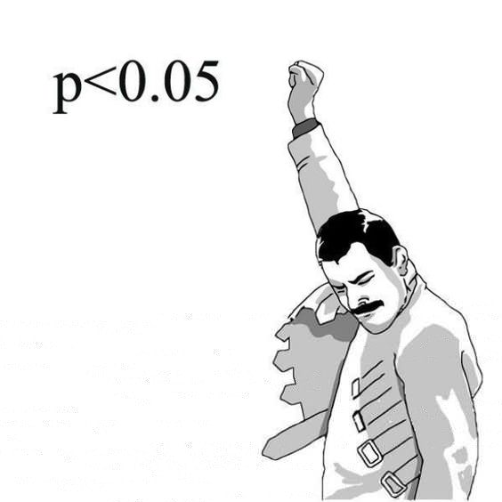

Prof. C.R.Rao:

> * All knowledge is, in final analysis, **history**.
> * All sciences are, in the abstract, **mathematics**.
> * All judgements are, in their rationale, **statistics**.
> 
> -- Preface of Statistics and Truth 1987
