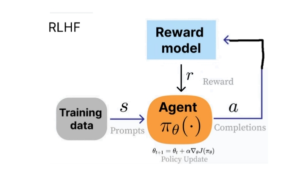
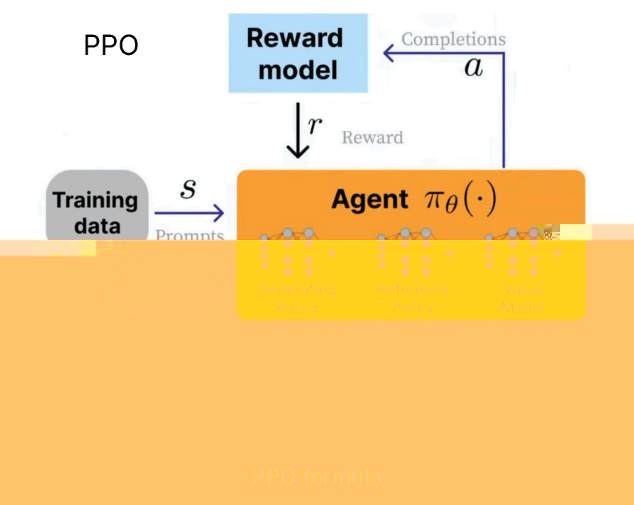
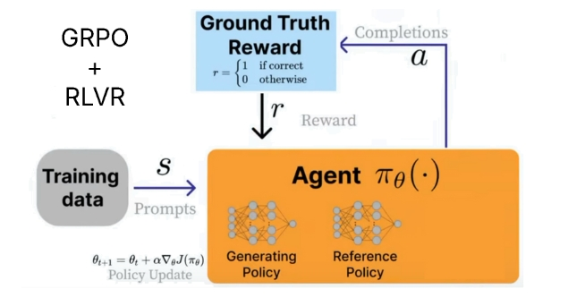
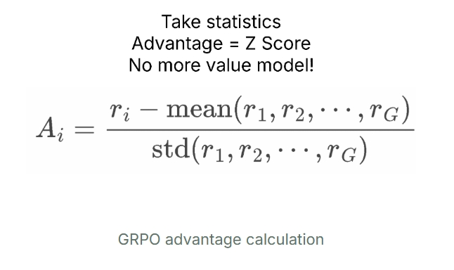

<style>
details {
    border: 1px solid #aaa;
    border-radius: 4px;
    padding: .5em .5em 0;
}
summary {
    font-weight: bold;
    margin: -.5em -.5em 0;
    padding: .5em;
}
details[open] {
    padding: .5em;
}
details[open] summary {
    border-bottom: 1px solid #aaa;
    margin-bottom: .5em;
}
img {
    pointer-events: none;
}
</style>

<details><summary>目录</summary><p>

- [强化学习基础](#强化学习基础)
    - [强化学习的定义](#强化学习的定义)
    - [强化学习和监督学习的区别](#强化学习和监督学习的区别)
    - [强化学习的特征](#强化学习的特征)
    - [强化学习的历史](#强化学习的历史)
    - [强化学习的应用](#强化学习的应用)
- [序列决策](#序列决策)
- [动作空间](#动作空间)
- [强化学习智能体的组成成分和类型](#强化学习智能体的组成成分和类型)
- [学习与规划](#学习与规划)
- [探索和利用](#探索和利用)
- [强化学习示例](#强化学习示例)
    - [CartPole](#cartpole)
        - [开发环境](#开发环境)
        - [CartPole 示例](#cartpole-示例)
- [强化学习指南](#强化学习指南)
    - [问题](#问题)
    - [什么是强化学习](#什么是强化学习)
    - [从 RLHF、PPO 到 GRPO 和 RLVR](#从-rlhfppo-到-grpo-和-rlvr)
    - [Luck(well Patience) Is All You Need](#luckwell-patience-is-all-you-need)
- [资料](#资料)
</p></details><p></p>

# 强化学习基础

## 强化学习的定义

> 强化学习包含环境、动作和奖励三部分，其本质是智能体通过与环境的交互，
> 使其做出的动作对应的决策得到的总奖励最大，或者说是期望最大。

强化学习(Reinforcement Learning, RL)讨论的问题是 **智能体(agent)** 怎么在复杂、
不确定的 **环境(environment)** 中最大化它能获得的奖励。


强化学习由两部分组成：**智能体(agent)** 和 **环境(environment)**。
在强化学习过程中，智能体与环境一直在交互。智能体在环境中获取某个 **状态(state)** 后，
它会利用该状态输出一个 **动作(action)**，这个动作也称为 **决策(decision)**。
然后这个动作会在环境中被执行，环境会根据智能体采取的动作，
输出下一个状态以及当前这个动作带来的 **奖励(award)**
智能体的目的就是尽可能地从环境中获得奖励。

## 强化学习和监督学习的区别

1. 强化学习处理的大多数是序列数据，其很难像监督学习的样本一样满足独立同分布；
2. 学习器并没有告诉我们每一步正确的动作应该是什么，学习器需要自己去发现哪些动作可以带来最多的奖励，
   智能通过不断地尝试来发现最有利地动作；
3. 智能体获得自己能力的过程，其实是不断地试错探索（trial-and-error exploration）的过程。
   探索 （exploration）和利用（exploitation）是强化学习里面非常核心的问题。
   其中，探索指尝试一些新的动作， 这些新的动作有可能会使我们得到更多的奖励，
   也有可能使我们“一无所有”；利用指采取已知的可以获得最多奖励的动作，
   重复执行这个动作，因为我们知道这样做可以获得一定的奖励。
   因此，我们需要在探 索和利用之间进行权衡，这也是在监督学习里面没有的情况。
4. 在强化学习过程中，没有非常强的监督者（supervisor），只有奖励信号（reward signal），
   并且奖励信号是延迟的，即环境会在很久以后告诉我们之前我们采取的动作到底是不是有效的。
   因为我们没有得 到即时反馈，所以智能体使用强化学习来学习就非常困难。
   当我们采取一个动作后，如果我们使用监督学习，我们就可以立刻获得一个指导，
   比如，我们现在采取了一个错误的动作，正确的动作应该是什么。而在强化学习里面，
   环境可能会告诉我们这个动作是错误的，但是它并没有告诉我们正确的动作是什么。
   而且更困难的是，它可能是在一两分钟过后告诉我们这个动作是错误的。
   所以这也是强化学习和监督学习不同的地方。

## 强化学习的特征

1. 强化学习会试错探索，它通过探索环境来获取对环境的解释；
2. 强化学习智能体会从环境中获得延迟的奖励；
3. 在强化学习的训练过程中，时间非常重要。因为我们得到的是有时间关联的数据（sequential data），
   而不是独立同分布的数据。在机器学习中，如果观测数据有非常强的关联，会使得训练非常不稳定。
   这也是为什么在监督学习中，我们希望数据尽量满足独立同分布，这样就可以消除数据之间的相关性。
4. 智能体的动作会影响它随后得到的数据，这一点是非常重要的。在训练智能体的过程中，
   很多时 候我们也是通过正在学习的智能体与环境交互来得到数据的。
   所以如果在训练过程中，智能体不能保持稳定，就会使我们采集到的数据非常糟糕。
   我们通过数据来训练智能体，如果数据有问题，整个训练过程就会失败。
   所以在强化学习里面一个非常重要的问题就是，怎么让智能体的动作一直稳定地提升。

## 强化学习的历史

早期的强化学习，称其为<span style='border-bottom:1.5px dashed red;'>标准强化学习</span>，
最近业界才把强化学习与深度学习结合起来，就形成了<span style='border-bottom:1.5px dashed red;'>深度强化学习(deep reinforcement learning)</span>，
因此，<span style='border-bottom:1.5px dashed red;'>深度强化学习 = 深度学习 + 强化学习</span>。
可以将标准强化学习和深度强化学习类比于传统的计算机视觉和深度计算机视觉。

可以把神经网络放到强化学习中：

* 标准强化学习：比如 TD-Gammon 玩 Backgammon 游戏的过程，
  其实就是 <span style='border-bottom:1.5px dashed red;'>设计特征</span>，
  然后训练<span style='border-bottom:1.5px dashed red;'>价值函数</span>的过程。
  标准强化学习先设计很多特征，这些特征可以描述当前整个状态。得到这些特征后，
  就可以通过训练一个<span style='border-bottom:1.5px dashed red;'>分类网络</span>或者分别训练一个<span style='border-bottom:1.5px dashed red;'>价值估计函数</span>来采取动作。
* 深度强化学习：自从有了深度学习，有了神经网络，
  就可以把智能体玩游戏的过程改进成一个端到端训练（end-to-end training）的过程。
  这样就不需要设计特征，直接输入状态就可以输出动作。
  可以用一个神经网络来拟合价值函数、Q 函数或策略网络，省去特征工程（feature engineering）的过程。

## 强化学习的应用

强化学习最近几年有很多应用，并且都有很好的表现。这有如下几个原因：

1. 首先，有了更多的算力（computation power），有了更多的 GPU，可以更快地做更多的试错尝试；
2. 其次，通过不同的尝试，智能体在环境中获得了很多信息，可以在环境中取得很大的奖励；
3. 最后，通过端到端训练，可以把特征提取、价值估计以及决策部分一起优化，就可以得到一个更强的决策网络。

强化学习中比较有意思的应用如下：

1. DeepMind 研发的走路的智能体
2. 机械臂抓取
3. OpenAI 的机械臂翻魔方
4. 穿衣服的智能体

# 序列决策


# 动作空间


# 强化学习智能体的组成成分和类型

对于一个强化学习智能体，它可能有一个或多个如下地组成部分：

1. 策略（policy）
    - 智能体会用策略来选取下一步地动作
2. 价值函数（value function）
    - 用价值函数来对当前状态进行评估。价值函数用于评估智能体进入某个状态后，可以对后面的奖励带来多大的影响。
      价值函数值越大，说明智能体进入这个状态越有利
3. 模型（model）
    - 模型表示智能体对环境的状态进行理解，它决定了环境中世界的运行方式


# 学习与规划

# 探索和利用


# 强化学习示例

## CartPole

以下示例使用深度强化学习玩 CartPole(倒立摆)游戏，倒立摆是控制论中的经典问题，
在这个游戏中，一根杆的底部与一个小车通过轴相连，而杆的重心在轴之上，因此是一个不稳定的系统。
在重力的作用下，杆很容易倒下。需要控制小车在水平的轨道上进行左右运动，
使得杆一直保持竖直平衡状态。

### 开发环境

OpenAI 推出的 Gym 环境库中的 CartPole 游戏环境，和 Gym 的交互过程很像一个回合制游戏：

* 首先，获得游戏的初始状态(比如杆的角度、小车位置)
* 然后，在每个回合，都需要在当前可行的动作中选择一个并交由 Gym 执行
    - 比如：向左或者右推动小车，每个回合中二者只能选择一
* Gym 在执行动作后，会返回动作执行后的下一个状态和当前回合所获得的奖励值
    - 比如：选择向左推动小车并执行后，小车位置更加偏左，而杆的角度更加偏右，
      Gym 将新的角度和位置返回，而如果在这一回合杆没有倒下，Gym 同时返回一个小的正奖励
* 上述过程可以一直迭代下去，直到游戏结束
    - 比如：杆倒下了

Gym 环境库中的 CartPole 游戏环境库安装

```bash
$ pip install gym
```

Gym 的 Python 基本调用方法

```python
import gym

# 实例化一个游戏环境，参数为游戏名称
env = gym.make("CartPole-v1")

# 初始化环境，获得初始状态
state = env.reset()

while True:
    # 对当前帧进行渲染，绘图到屏幕
    env.render()
    
    # 假设我们有一个训练好的模型，能够通过当前状态预测出这时应该进行的动作
    action = model.predict(state)
    
    # 让环境执行动作，获得执行完动作的下一个状态，动作的奖励，游戏是否已结束以及额外信息
    next_state, reward, done, info = env.step(action)
    
    # 如果游戏结束，则退出循环
    if done:
        break
```

### CartPole 示例

任务：训练出一个模型，能够根据当前的状态预测出应该进行的一个好的动作。
粗略地说，一个好的动作应当能够最大化整个游戏过程中获得的奖励之和，
这也是强化学习的目标。

CartPole 游戏中的目标是，希望做出的合适的动作使得杆一直不倒，
即游戏交互的回合数尽可能多，而每进行一回合，都会获得一个小的正奖励，
回合数越多则积累的奖励值也越高。因此，最大化游戏过程中的奖励之和与最终目标是一致的。

使用深度强化学习中的 Deep Q-Learning 方法来训练模型

1. 首先，引入常用库，定义一些模型超参数

```python
import tensorflow as tf
```

2. 使用 `tf.keras.Model` 建立一个 Q 函数网络，用于拟合 Q-Learning 中的 Q 函数

使用较简单的多层全连接神经网络进行拟合，该网络输入当前状态，
输入各个动作下的 Q-Value(CartPole 下为二维，即向左和向右推动小车)。

```python
class QNetwork(tf.keras.Model):
    pass
```

# 强化学习指南

## 问题

> 1. 什么是 RL？RLVR？PPO？GRPO？RLHF？RFT？
>     - `Is "Luck is All You Need?" for RL?`
> 2. 什么是 Environment？Agent？Action？Reward function？Rewards？

## 什么是强化学习

强化学习的目标是：

1. **提高** 出现 **“好(good)”** 结果的概率。
2. **降低** 出现 **“坏(bad)”** 结果的概率。

关于"好"和"坏"的具体含义，或者我们如何"增加"或"减少"它，甚至"结果"是什么，都有一些复杂之处。
例如，在吃豆人游戏中：

1. 环境(environment)是游戏世界
2. 你可以采取的行动(actions)有向上、向左、向右和向下。
3. 如果你吃到饼干，奖励(rewards)是好的；如果你撞到任何一个波浪形敌人，奖励(rewards)是坏的。
4. 在强化学习中，你不能知道你能采取的"最佳行动"，但你可以观察到中间步骤，或者最终的游戏状态（胜利或失败）

## 从 RLHF、PPO 到 GRPO 和 RLVR

OpenAI 推广了 **RLHF（从人类反馈中进行强化学习）**的概念，我们训练一个"智能体"来生成对问题（状态）的输出，
这些输出被人类认为更有用。例如，ChatGPT 中的点赞和点踩可以用于 RLHF 过程。



为了进行 RLHF，开发了 **PPO（近端策略优化）**。



在这种情况下，智能体是语言模型。实际上它由 3 个系统组成：

1. Generating Policy (current trained model): 生成策略（当前训练的模型）
2. Reference Policy (original model): 参考策略（原始模型）
3. Value Model (average reward estimator): 值模型（平均奖励估计器）

DeepSeek 开发了 **GRPO（Group Relative Policy Optimization, 组相对策略优化）** 来训练他们的 R1 推理模型。



与 PPO 的主要区别在于：

1. 移除了价值模型(Value Model)，用多次调用奖励模型得到的统计信息来替代。
2. 移除了奖励模型(Reward Model)，用自定义奖励函数(Reward function)替代，RLVR 可用于此。

这意味着 GRPO 非常高效。之前 PPO 需要训练多个模型——现在移除了奖励模型和价值模型，
我们可以节省内存并加快所有进程。

**RLVR (Reinforcement Learning with Verifiable Rewards, 可验证奖励的强化学习)** 允许我们根据具有易于验证的解决方案的任务来奖励模型。例如：

1. 数学方程式可以轻松验证。例如 2+2 = 4。
2. 代码输出可以验证是否正确执行。
3. 设计可验证的奖励函数可能很困难，因此大多数示例都是数学或代码。
4. GRPO 的应用场景并不仅限于代码或数学——其推理过程可以提升电子邮件自动化、数据库检索、法律和医学等任务，
   根据您的数据集和奖励函数极大地提高准确性——关键在于定义一个标准——即一个由多个可验证的小奖励组成的列表，
   而不是一个最终消耗性的单一奖励。例如，OpenAI 在其强化学习微调（RFT）服务中推广了这一方法。

为什么是 "Group Relative(组相对)"？

GRPO 完全移除了价值模型，但我们仍然需要根据当前状态估计"平均奖励"。
诀窍是采样 LLM！然后我们通过跨多个不同问题的采样过程的统计数据来计算平均奖励。

例如对于 `"2+2 等于多少？"` 这个问题，我们采样 4 次。可能会得到 `4`、`3`、`D`、`C`。
然后我们计算每个答案的奖励，接着计算平均奖励和标准差，最后对 Z-score 进行标准化！



这样就创建了 **优势 A(advantages A)**，我们将用它来替代价值模型。这能节省大量内存！

## Luck(well Patience) Is All You Need

强化学习的诀窍只需要两样东西：

1. 一个问题或指令，例如 `"2+2 等于多少？"`、`"用 Python 创建一个 Flappy Bird 游戏"`；
2. 一个奖励函数和验证器来验证输出是否良好或糟糕。

仅凭这两样，我们基本上可以无限次地训练调用语言模型，直到得到一个良好的答案。例如，对于 `"2+2 等于多少？"`，
一个未经训练的糟糕语言模型会输出：

> `0, cat, -10, 1928, 3, A, B, 122, 17, 182, 172, A, C, BAHS, %$, #, 9, -192, 12.31` then suddenly `4`.
> 
> The reward signal was `0, 0, 0, 0, 0, 0, 0, 0, 0, 0, 0, 0, 0, 0, 0` then suddenly `1`.

所以通过运气和偶然，强化学习设法在多次展开中找到正确答案。我们的目标是希望看到好答案 `4` 更多，
而其余（坏答案）要少得多。

**所以强化学习的目标是要有耐心——在极限情况下，如果正确答案的概率至少是一个小数（不为零），
那只是一个等待游戏——你必定会在极限情况下遇到正确答案。**

# 资料

* [强化学习](https://mp.weixin.qq.com/mp/appmsgalbum?__biz=MzkwMTU3NjYwOA==&action=getalbum&album_id=3265062318488158212&subscene=159&subscene=189&scenenote=https%3A%2F%2Fmp.weixin.qq.com%2Fs%3F__biz%3DMzkwMTU3NjYwOA%3D%3D%26mid%3D2247484478%26idx%3D1%26sn%3D8e573705e9f7eb99fe6d3b41e1125a46%26chksm%3Dc0b3e6f1f7c46fe72dcda053230dcb1d10da23f9060bf6e62073029de2ae0f114f46f9f6c805%26cur_album_id%3D3265062318488158212%26scene%3D189%23wechat_redirect&nolastread=1#wechat_redirect)
* [Reinforcement Learning Guide](https://docs.unsloth.ai/basics/reinforcement-learning-guide)
