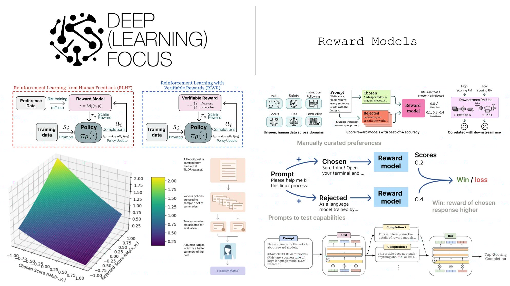
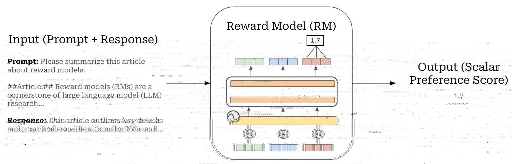
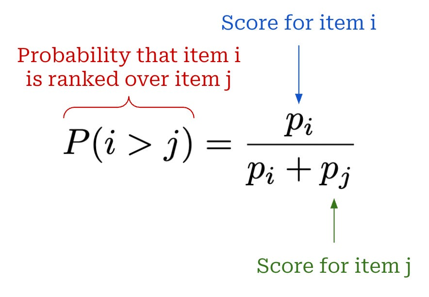
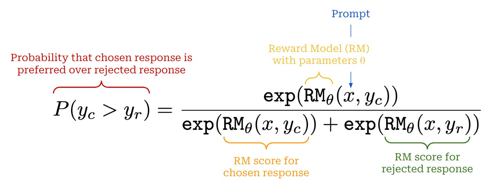

目录

- [强化学习简介](#强化学习简介)
- [多臂老虎机](#多臂老虎机)
    - [问题](#问题)
    - 
- [马尔可夫决策过程](#马尔可夫决策过程)
- [动态规划算法](#动态规划算法)
- [时序差分算法](#时序差分算法)
- [Dyna-Q 算法](#dyna-q-算法)
- [强化学习指南](#强化学习指南)
    - [问题](#问题-1)
    - [什么是强化学习](#什么是强化学习)
    - [从 RLHF、PPO 到 GRPO 和 RLVR](#从-rlhfppo-到-grpo-和-rlvr)
    - [Luck(well Patience) Is All You Need](#luckwell-patience-is-all-you-need)
- [Reward Model](#reward-model)
    - [什么是 Reward Model？](#什么是-reward-model)
        - [Bradley-Terry model of preference](#bradley-terry-model-of-preference)
        - [Reward Model 架构](#reward-model-架构)
        - [Reward Model 训练](#reward-model-训练)
- [资料](#资料)

# 强化学习简介

# 多臂老虎机

> Multi-Armed Bandit MAB

多臂老虎机问题，它可以被看作简化版的强化学习问题。与强化学习不同，
多臂老虎机不存在状态信息，只有动作和奖励，算是最简单的“和环境交互中的学习”的一种形式。
多臂老虎机中的探索与利用（exploration vs. exploitation）问题一直以来都是一个特别经典的问题，
理解它能够帮助我们学习强化学习。

## 问题

## 

# 马尔可夫决策过程

# 动态规划算法

# 时序差分算法

# Dyna-Q 算法

# 强化学习指南

## 问题

> 1. 什么是 RL？RLVR？PPO？GRPO？RLHF？RFT？
>     - `Is "Luck is All You Need?" for RL?`
> 2. 什么是 Environment？Agent？Action？Reward function？Rewards？

## 什么是强化学习

强化学习的目标是：

1. **提高** 出现 **“好(good)”** 结果的概率。
2. **降低** 出现 **“坏(bad)”** 结果的概率。

关于"好"和"坏"的具体含义，或者我们如何"增加"或"减少"它，甚至"结果"是什么，都有一些复杂之处。
例如，在吃豆人游戏中：

1. 环境(environment)是游戏世界
2. 你可以采取的行动(actions)有向上、向左、向右和向下。
3. 如果你吃到饼干，奖励(rewards)是好的；如果你撞到任何一个波浪形敌人，奖励(rewards)是坏的。
4. 在强化学习中，你不能知道你能采取的"最佳行动"，但你可以观察到中间步骤，或者最终的游戏状态（胜利或失败）

## 从 RLHF、PPO 到 GRPO 和 RLVR

OpenAI 推广了 **RLHF（从人类反馈中进行强化学习）**的概念，我们训练一个"智能体"来生成对问题（状态）的输出，
这些输出被人类认为更有用。例如，ChatGPT 中的点赞和点踩可以用于 RLHF 过程。

为了进行 RLHF，开发了 **PPO（近端策略优化）**。

在这种情况下，智能体是语言模型。实际上它由 3 个系统组成：

1. Generating Policy (current trained model): 生成策略（当前训练的模型）
2. Reference Policy (original model): 参考策略（原始模型）
3. Value Model (average reward estimator): 值模型（平均奖励估计器）

DeepSeek 开发了 **GRPO（Group Relative Policy Optimization, 组相对策略优化）** 来训练他们的 R1 推理模型。

与 PPO 的主要区别在于：

1. 移除了价值模型(Value Model)，用多次调用奖励模型得到的统计信息来替代。
2. 移除了奖励模型(Reward Model)，用自定义奖励函数(Reward function)替代，RLVR 可用于此。

这意味着 GRPO 非常高效。之前 PPO 需要训练多个模型——现在移除了奖励模型和价值模型，
我们可以节省内存并加快所有进程。

**RLVR (Reinforcement Learning with Verifiable Rewards, 可验证奖励的强化学习)** 允许我们根据具有易于验证的解决方案的任务来奖励模型。例如：

1. 数学方程式可以轻松验证。例如 2+2 = 4。
2. 代码输出可以验证是否正确执行。
3. 设计可验证的奖励函数可能很困难，因此大多数示例都是数学或代码。
4. GRPO 的应用场景并不仅限于代码或数学——其推理过程可以提升电子邮件自动化、数据库检索、法律和医学等任务，
   根据您的数据集和奖励函数极大地提高准确性——关键在于定义一个标准——即一个由多个可验证的小奖励组成的列表，
   而不是一个最终消耗性的单一奖励。例如，OpenAI 在其强化学习微调（RFT）服务中推广了这一方法。

为什么是 "Group Relative(组相对)"？

GRPO 完全移除了价值模型，但我们仍然需要根据当前状态估计"平均奖励"。
诀窍是采样 LLM！然后我们通过跨多个不同问题的采样过程的统计数据来计算平均奖励。

例如对于 `"2+2 等于多少？"` 这个问题，我们采样 4 次。可能会得到 `4`、`3`、`D`、`C`。
然后我们计算每个答案的奖励，接着计算平均奖励和标准差，最后对 Z-score 进行标准化！

这样就创建了 **优势 A(advantages A)**，我们将用它来替代价值模型。这能节省大量内存！

## Luck(well Patience) Is All You Need

强化学习的诀窍只需要两样东西：

1. 一个问题或指令，例如 `"2+2 等于多少？"`、`"用 Python 创建一个 Flappy Bird 游戏"`；
2. 一个奖励函数和验证器来验证输出是否良好或糟糕。

仅凭这两样，我们基本上可以无限次地训练调用语言模型，直到得到一个良好的答案。例如，对于 `"2+2 等于多少？"`，
一个未经训练的糟糕语言模型会输出：

> `0, cat, -10, 1928, 3, A, B, 122, 17, 182, 172, A, C, BAHS, %$, #, 9, -192, 12.31` then suddenly `4`.
> 
> The reward signal was `0, 0, 0, 0, 0, 0, 0, 0, 0, 0, 0, 0, 0, 0, 0` then suddenly `1`.

所以通过运气和偶然，强化学习设法在多次展开中找到正确答案。我们的目标是希望看到好答案 `4` 更多，
而其余（坏答案）要少得多。

**所以强化学习的目标是要有耐心——在极限情况下，如果正确答案的概率至少是一个小数（不为零），
那只是一个等待游戏——你必定会在极限情况下遇到正确答案。**

# Reward Model

> Reward Model, 奖励模型
>
> 在推理模型时代，对 LLMs 进行人类偏好建模...

奖励模型（Reward Model, Reward Model）是大型语言模型（LLM）研究的关键组成部分，
通过将人类偏好融入训练过程，推动了重大进展。尽管它们发挥着关键作用，但奖励模型常常被忽视。
关于如何有效训练和使用它们的实用指导仍然稀缺——尤其是随着无需奖励模型的强化学习等技术的流行。
尽管如此，基于 PPO 的强化学习训练 LLM 仍然是开发顶级基础模型的关键因素。

## 什么是 Reward Model？

Reward Model 是特殊的 LLMs——通常是从我们当前正在训练的 LLM 派生而来，
它们被训练以根据输入的提示(prompt)和候选补全(candidate completion)内容来预测人类偏好分数(human preference score)；
Reward Model 给出更高分数表明给定的补全内容更可能被人类偏好。

作为第一步，我们必须对奖励模型（Reward Model）建立基本理解，
了解它们的创建方式以及我们如何在 LLMs 的上下文中使用它们：

* Reward Model 的动机来源
* Reward Model 的架构设计
* Reward Model 的训练过程

### Bradley-Terry model of preference

Reward Model 的标准实现源自 **偏好 Bradley-Terry 模型(Bradley-Terry model of preference)**，
一种用于根据成对比较数据(paired comparison data)中项目的相对强度(relative strength)或性能(perfoReward Modelance)进行排序的统计模型。
给定两个从同一分布中抽取的事件 `$i$` 和 `$j$`，
Bradley-Terry 模型定义了事件 `$i$` 相对于事件 `$j$` 获胜或被偏好的概率如下：

在 LLMs 的背景下，事件 `$i$` 和 `$j$` 是由同一个 LLM 生成的两个补全结果，
并且来自同一个提示(Prompt)（即，这些补全结果是从同一个分布中采样的）。
Reward Model 为这些补全结果中的每一个分配一个分数，
然后我们使用 Bradley-Terry 模型中的上述表达式来推导出补全结果 `$i$` 比补全结果 `$j$` 更受偏好的概率。
简而言之，我们使用 Bradley-Terry 模型来表示两个补全结果之间的成对比较概率。

<!--  -->

偏好数据(Preference Data)。成对偏好数据(Pairwise preference)在 LLMs 的 post-training 中被广泛使用，
并且已经使用了相当长的时间。这类数据由许多不同的提示组成，我们的目标是在数据中最大化提示的多样性。
提示分布应该能代表模型在真实环境中会看到的提示。对于每个提示，我们有一对候选补全结果，
其中一个补全结果通常由人类识别，但有时由模型——为比另一个更受偏好；
一个包含相关选定(chosen)和拒绝(rejected)补全结果(completion)的提示数据集被称为（人类）偏好数据集(Human Preference Dataset)。

### Reward Model 架构

Reward Mode 是基于 Bradley-Terry 偏好模型，但可以以多种方式在实际中实现这种统计模型。
在 LLMs 领域，这些模型可以使用一个 LLM 实现。然而，与标准的（生成式）仅解码器 LLMs 相比，
Reward Model 修改了底层架构和训练目标。

Reward Model 从 LLM 接收一个提示-补全对作为输入，并输出一个（标量）偏好分数。
在实践中，Reward Model 通过在 decoder-only 架构的末尾添加一个线性头(linear head)来实现。
具体来说，LLM 输出一个 token 向量列表，我们将这个列表的最后一个向量通过线性头产生一个单一的、标量分数。
我们可以将 Reward Model 视为一个带有额外分类头(classification head)的 LLM，该分类头用于将给定的补全分类为偏好或非偏好。

### Reward Model 训练

Reward Model 的参数通常使用一个现有策略(Policy)进行初始化，我们将此策略称为 Reward Model 的“基础”模型。
初始化 Reward Model 的策略有多种选择；例如，正在训练的 LLM 或该模型的先前版本，如预训练基础模型或 SFT 模型。
一旦 Reward Model 初始化补全，我们向该模型添加线性头，并在偏好数据集（即针对提示选择和拒绝的模型响应对）上进行训练。

# 资料

* [强化学习](https://mp.weixin.qq.com/mp/appmsgalbum?__biz=MzkwMTU3NjYwOA==&action=getalbum&album_id=3265062318488158212&subscene=159&subscene=189&scenenote=https%3A%2F%2Fmp.weixin.qq.com%2Fs%3F__biz%3DMzkwMTU3NjYwOA%3D%3D%26mid%3D2247484478%26idx%3D1%26sn%3D8e573705e9f7eb99fe6d3b41e1125a46%26chksm%3Dc0b3e6f1f7c46fe72dcda053230dcb1d10da23f9060bf6e62073029de2ae0f114f46f9f6c805%26cur_album_id%3D3265062318488158212%26scene%3D189%23wechat_redirect&nolastread=1#wechat_redirect)
* [Reinforcement Learning Guide](https://docs.unsloth.ai/basics/reinforcement-learning-guide)
* [RLHF_Q&A系列](https://www.zhihu.com/column/c_1991812183886152898)