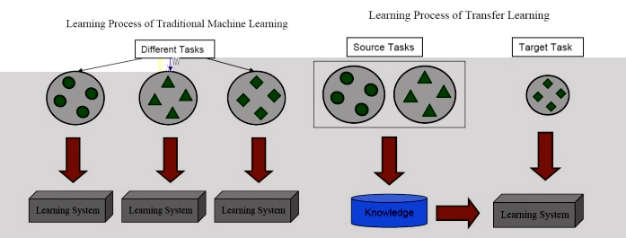
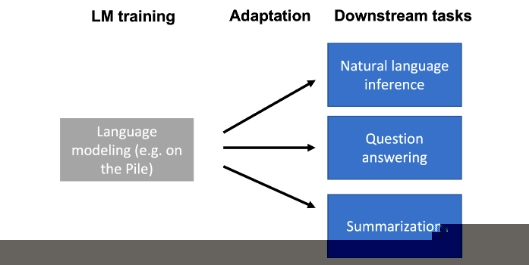
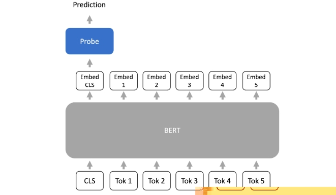
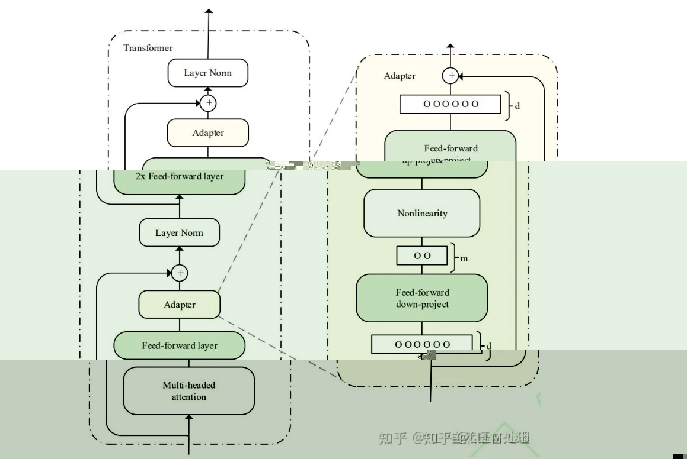
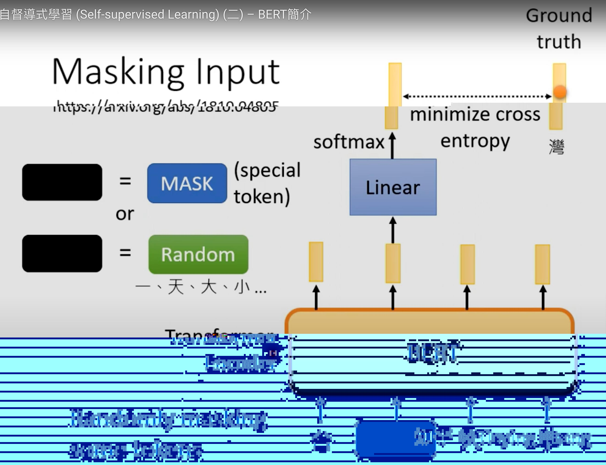
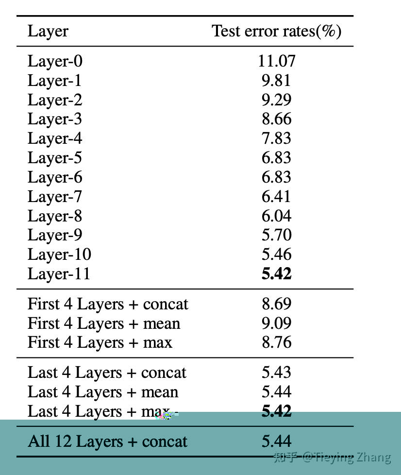
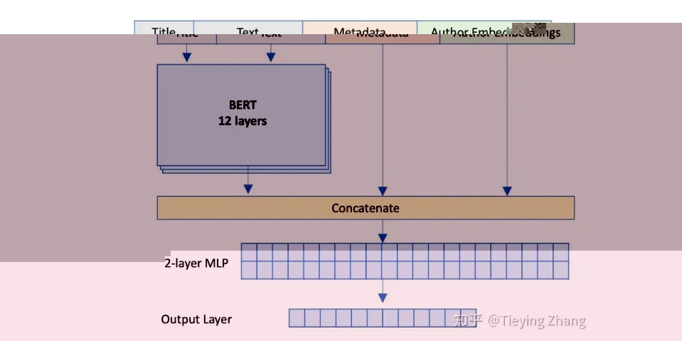
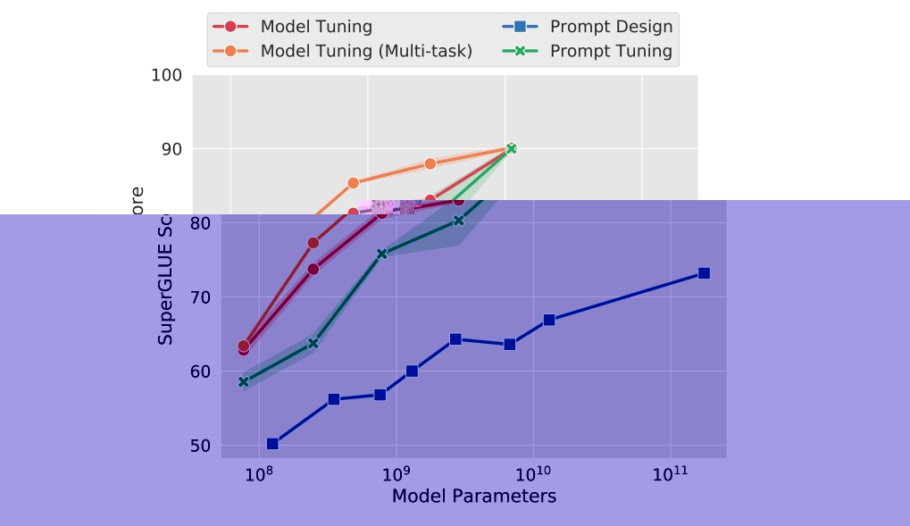
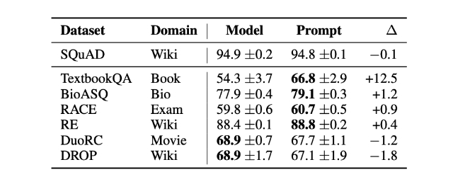
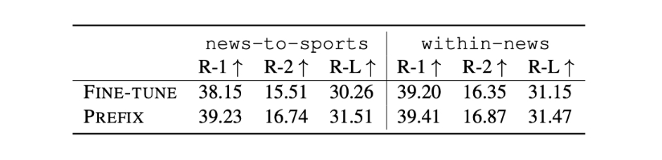

<style>
details {
    border: 1px solid #aaa;
    border-radius: 4px;
    padding: .5em .5em 0;
}
summary {
    font-weight: bold;
    margin: -.5em -.5em 0;
    padding: .5em;
}
details[open] {
    padding: .5em;
}
details[open] summary {
    border-bottom: 1px solid #aaa;
    margin-bottom: .5em;
}
img {
    pointer-events: none;
}
</style>

<details><summary>目录</summary><p>

- [预训练模型](#预训练模型)
- [Adaptation](#adaptation)
    - [Adaptation 简介](#adaptation-简介)
    - [Adaptation 配置](#adaptation-配置)
    - [Adaptation 方法](#adaptation-方法)
- [Probing](#probing)
    - [Probing 方法的引入](#probing-方法的引入)
    - [Probing 适用性和适配](#probing-适用性和适配)
    - [固定长度表示策略](#固定长度表示策略)
- [Finetune](#finetune)
    - [Fine-tuning 简介](#fine-tuning-简介)
    - [Fine-tuning 对于 Zero-shot 能力](#fine-tuning-对于-zero-shot-能力)
    - [用于人类对齐语言模型的 Fine-tuning](#用于人类对齐语言模型的-fine-tuning)
    - [微调的过程和影响](#微调的过程和影响)
    - [Fine-tuning 总结](#fine-tuning-总结)
    - [什么是微调](#什么是微调)
    - [为什么要微调](#为什么要微调)
    - [微调的两种方法](#微调的两种方法)
        - [冻结 Feature Extractor](#冻结-feature-extractor)
        - [不同层使用不同学习率](#不同层使用不同学习率)
    - [LoRA](#lora)
        - [针对的问题](#针对的问题)
        - [替代解决方案](#替代解决方案)
        - [LoRA 的思路](#lora-的思路)
        - [LoRA 的优势](#lora-的优势)
        - [LoRA 的原理](#lora-的原理)
        - [LoRA 使用](#lora-使用)
    - [如何微调](#如何微调)
    - [通俗解释](#通俗解释)
    - [Finetune 示例](#finetune-示例)
        - [语言大模型-BERT 微调](#语言大模型-bert-微调)
        - [LLM 微调](#llm-微调)
        - [图片大模型-ResNet50 微调](#图片大模型-resnet50-微调)
            - [微调](#微调)
            - [固定层的向量导出](#固定层的向量导出)
        - [知识注入](#知识注入)
- [Lightweight Fine-tuning](#lightweight-fine-tuning)
    - [Lightweight Fine-tuning 的变体](#lightweight-fine-tuning-的变体)
    - [Prompt Tuning](#prompt-tuning)
    - [Prefix Tuning](#prefix-tuning)
    - [Adapter Tuning](#adapter-tuning)
    - [Lightweight Fine-tuning 的其他性质](#lightweight-fine-tuning-的其他性质)
    - [Lightweight Fine-tuning 总结](#lightweight-fine-tuning-总结)
- [参考](#参考)
</p></details><p></p>

# 预训练模型

> Pre-trained Model，预训练模型

**预训练模型** 是指之前通过大量的数据训练出的大模型（如果不是大模型，
用少量数据训练的小模型能直接用在新的任务上也可以，但是一般来说少量数据没有强大的迁移能力，
所以一般都是指大模型），比如很大很耗时间的模型，又不想从头训练一遍。
这时候可以直接下载别人训练好的模型，里面保存的都是每一层的参数配置情况。有了这样的模型之后，
可以直接拿来做测试，前提是输出的类别是一样的。

预训练模型可以直接使用或者 Finetune 后用在新的任务上。
一般把预训练模型分为三类：**图像大模型（VLM）**、**语言大模型（LLM）**、
**Meta learning（一般指 few-shot learning）**。
这三类模型都是先通过在已有数据集上进行训练，然后在任务数据集上 Finetune。
从实用的角度，先把 Meta learning 排除掉，还处于研究和探索阶段。
在工业界真正用起来的，一般是图像大模型和语言大模型。而图像大模型最常用的是 **ResNet**，
语言大模型是 Transformer 的各类变种，如 **BERT 系列** 和 **GPT 系列**。

概括来说，ResNet 和 BERT 都是 Finetune 最后几层（有的方法也会再训练整个模型），
因为前几层提取了公共信息，比如 ResNet 前几层提取了颜色、形状等公共信息，
BERT 前几层提取了词性、语义等公共信息。后几层往往和训练任务关联了，
比如 BERT 后几层是关注填空的准确度，所以后几层和你想做的任务关系不是很大。
所以一般是固定前面几层的模型参数，Finetune 后面几层参数。

另外，预训练模型也不局限在图像大模型和语言大模型，如果有一个简单的 DNN 训练出来，
可以用在新的任务上，也可以称之为预训练模型，总之通过已有数据训练出的模型，
直接（或 Finetune）后用在不同任务上，就可以称之为预训练模型。
<!-- 
# 迁移学习

> Transfer Learning


## 迁移学习介绍

Transfer Learning 是机器学习的分支，主要研究 **源域(source domain)** 所学到的知识，
如何迁移到 **目标域(target domain)** 中。如 《A Survey on Transfer Learning》中的图所示：



为什么要这样做呢？这是因为在 target domain 中，数据量较少，可学习提取的知识不足以完成任务，
所以需要进行迁移学习，这样在 target domain 中可以学得快，学得好。

> 例如一个人学会了骑自行车，再去学骑电动车就很快，又比如一个人学会了 C 语言，再去学 Python 就会比较快。

Transfer Learning 是一个较大的领域，这里只讨论 **神经网络的 Finetune**，
如何理解模型的 Finetune 它也是迁移学习呢？我们知道，神经网络中最重要的东西就是权值参数，
训练模型就是在更新参数，这些参数就是模型学习到知识。
Alexnet 的卷积核学习到的图像边缘，色彩信息就是 Alexnet 所学习到的知识。
在图像任务中，这些知识是可以共享，可以迁移到其它任务中去，
因此，大家常常采用在 ImageNet 上训练好的模型进行 Finetune，进行 Transfer Learning。

总是有人把迁移学习和神经网络的训练联系起来，这两个概念刚开始是无关的。
迁移学习是机器学习的分支，现在之所以迁移学习和神经网络联系如此紧密，
是因为现在图像识别发展的太快效果也太好了，所以几乎所有的迁移学习都是图像识别方向的，
所以大家看到的迁移学习基本上都是以神经网络相关的计算机视觉为主。

迁移学习初衷是节省人工标注样本的时间，
让模型可以通过一个已有的标记数据的领域向未标记数据领域进行迁移从而训练出适用于该领域的模型，
直接对目标域从头开始学习成本太高，故而转向运用已有的相关知识来辅助尽快地学习新知识。

举一个简单的例子就能很好的说明问题，我们学习编程的时候会学习什么？
语法、特定语言的 API、流程处理、面向对象，设计模式等等。
这里面语法和 API 是每一个语言特有的，但是面向对象和设计模式可是通用的，
我们学了 JAVA，再去学 C#，或者 Python，面向对象和设计模式是不用去学的，
因为原理都是一样的，甚至在学习 C# 的时候语法都可以少学很多，这就是迁移学习的概念，
把统一的概念抽象出来，只学习不同的内容。

迁移学习按照学习方式可以分为 **基于样本的迁移**、**基于特征的迁移**、**基于模型的迁移**，
以及 **基于关系的迁移**，这里就不详细介绍了。

其实 "Transfer Learning" 和 "Fine-tune" 并没有严格的区分，含义可以相互交换，
只不过后者似乎更常用于形容迁移学习的后期微调中。微调应该是迁移学习中的一部分。
微调只能说是一个 trick。

## 计算机视觉迁移学习

下面只介绍下[计算机视觉方向的迁移学习](https://cs231n.github.io/transfer-learning/)。

在实践中，很少有人从头开始训练整个卷积网络（随机初始化），因为拥有足够大小的数据集相对较少。
相反，通常在非常大的数据集（例如 ImageNet，包含 120 万张图像和 1000 个类别）上预训练 ConvNet，
然后使用 ConvNet 作为感兴趣任务的初始化或固定特征提取器。三个主要的迁移学习场景如下：

1. ConvNet 作为固定特征提取器。
    - 在 ImageNet 上预训练 ConvNet，删除最后一个全连接层（该层的输出是 ImageNet 等不同任务的 1000 个类别分数），
      然后将 ConvNet 的其余部分视为新数据集的固定特征提取器。
    - 在 AlexNet 中，这将为每个图像计算一个 4096 维向量，其中包含紧邻分类器之前的隐藏层的激活。
      我们将这些特征称为 CNN 代码。如果这些代码在 ImageNet 上的 ConvNet 训练期间也被阈值化（通常是这种情况），
      那么这些代码是 ReLUd（即阈值为零）对于性能非常重要。
      提取所有图像的 4096-D 代码后，为新数据集训练线性分类器（例如线性 SVM 或 Softmax 分类器）。
2. Fine-tuning ConvNet
    - 第二种策略是不仅在新数据集上替换并重新训练 ConvNet 之上的分类器，
      而且还通过继续反向传播来微调预训练网络的权重。可以微调 ConvNet 的所有层，
      也可以保持某些较早的层固定（由于过度拟合问题），而仅微调网络的某些较高级别部分。
      这是由于观察到 ConvNet 的早期特征包含更多通用特征（例如边缘检测器或颜色斑点检测器），
      这些特征对许多任务都有用，但 ConvNet 的后续层逐渐变得更加具体于类的细节包含在原始数据集中。
      以包含许多狗品种的 ImageNet 为例，ConvNet 的表示能力的很大一部分可能专门用于区分狗品种的特定特征。
3. Pre-trained Model
    - 这个其实和上面第二种是一个意思，不过比较极端，使用整个预训练模型作为初始化，
      然后 fine-tune 整个网络而不是某些层，但是这个的计算量是非常大的，就只相当于做了一个初始化。
    - 由于现代 ConvNet 在 ImageNet 上跨多个 GPU 进行训练需要 2-3 周的时间，
      因此人们经常会发布最终的 ConvNet 检查点，以便其他可以使用网络进行微调的人受益。
      例如，Caffe 库有一个 Model Zoo，人们可以在其中共享他们的网络权重。

何时以及如何进行微调？如何决定应该在新数据集上执行哪种类型的迁移学习？
这是多个因素的函数，但最重要的两个因素是新数据集的大小（小或大），
以及它与原始数据集的相似性（例如，在图像内容和类别方面类似于 ImageNet，
或非常不同，例如显微镜图像）。请记住，ConvNet 特征在早期层中更通用，
在后面层中更特定于原始数据集，以下是用于导航 4 个主要场景的一些常见经验规则：

1. 新数据集很小并且与原始数据集相似。
    - 由于数据很小，由于过度拟合的担忧，对 ConvNet 进行微调并不是一个好主意。
      由于数据与原始数据相似，我们预计 ConvNet 中的更高级别特征也与该数据集相关。
      因此，最好的想法可能是在 CNN 代码上训练线性分类器。
2. 新数据集很大并且与原始数据集相似。
    - 由于我们拥有更多数据，因此我们可以更有信心，如果我们尝试通过整个网络进行微调，
      我们就不会过度拟合。
3. 新数据集很小，但与原始数据集有很大不同。
    - 由于数据很小，因此最好只训练线性分类器。由于数据集非常不同，
      因此从网络顶部训练分类器可能不是最好的，因为网络顶部包含更多数据集特定的特征。
      相反，从网络中较早某个位置的激活来训练 SVM 分类器可能效果更好。
4. 新数据集很大并且与原始数据集有很大不同。
    - 由于数据集非常大，我们可能期望能够从头开始训练 ConvNet。
      然而，在实践中，使用预训练模型的权重进行初始化通常仍然是有益的。
      在这种情况下，我们将有足够的数据和信心来对整个网络进行微调。

实用建议。执行迁移学习时还需要记住一些其他事项：

1. 来自预训练模型的约束。
    - 请注意，如果您希望使用预训练网络，则可用于新数据集的架构可能会受到一些限制。
      例如，你不能任意从预训练网络中取出 Conv 层。然而，一些变化是直接的：由于参数共享，
      您可以轻松地在不同空间大小的图像上运行预训练的网络。这在 Conv/Pool 层的情况下非常明显，
      因为它们的前向函数独立于输入体积空间大小（只要步幅“适合”）。
      对于 FC 层，这仍然成立，因为 FC 层可以转换为卷积层：例如，
      在 AlexNet 中，第一个 FC 层之前的最终池化体积的大小为 [6x6x512]。
      因此，查看此体积的 FC 层相当于具有感受野大小为 6x6 的卷积层，并应用 0 的填充。
2. 学习率。
    - 与计算新数据集类别分数的新线性分类器的（随机初始化）权重相比，
      通常对正在微调的 ConvNet 权重使用较小的学习率。
      这是因为我们期望 ConvNet 权重相对较好，因此我们不希望太快、
      太多地扭曲它们（特别是当它们上面的新线性分类器正在通过随机初始化进行训练时）。

## 通俗解释

举个例子，假设今天老板给你一个新的数据集，让你做一下图片分类，这个数据集是关于 flowers 的。
问题是，数据集中 flower 的类别很少，数据集中的数据也不多，你发现从零训练开始训练 CNN 的效果很差，
很容易过拟合。怎么办呢，于是你想到了使用 Transfer Learning，用别人已经训练好的 Imagenet 的模型来做。
做的方法有很多：

1. 把 AlexNet 里卷积层最后一层输出的特征拿出来，然后直接用 SVM 分类。这是 Transfer Learning，
   因为你用到了 AlexNet 中已经学到了的“知识”。
2. 把 VggNet 卷积层最后的输出拿出来，用贝叶斯分类器分类。思想基本同上。
3. 甚至你可以把 AlexNet、VggNet 的输出拿出来进行组合，自己设计一个分类器分类。
   这个过程中你不仅用了 AlexNet 的“知识”，也用了 VggNet 的“知识”。
4. 最后，你也可以直接使用 fine-tune 这种方法，在 AlexNet 的基础上，重新加上全连接层，再去训练网络。

综上，Transfer Learning 关心的问题是：什么是“知识”以及如何更好地运用之前得到的“知识”。
这可以有很多方法和手段。而 fine-tune 只是其中的一种手段。

简单来说 Transfer learning 可以看成是一套完整的体系，是一种处理流程，
目的是为了不抛弃从之前数据里得到的有用信息，
也是为了应对新进来的大量数据的缺少标签或者由于数据更新而导致的标签变异情况。
至于说 fine-tune，在深度学习里面，这仅仅是一个处理手段。之所以现在大量采用 fine-tune，
是因为有很多人用实验证实了：单纯从自己的训练样本训练的模型，效果没有 fine-tune 的好。
学术界的风气本就如此，一个被大家证实的行之有效的方法会在短时间内大量被采用。 -->

# Adaptation

## Adaptation 简介



使用语言模型通过仅给出提示(Prompt)已经能够执行一些任务，例如在上下文学习中。
然而，提示(Prompt)方法并不适用于全部的下游任务，如 **自然语言推理(NLI)**、**问题回答(QA)**、
**将网络表格转换为文本**、**解析电子健康记录(EHR)** 等。

**下游任务** 与 **语言模型**的训练数据（例如，Pile 数据集）可能在格式和主题上有所不同，
或者需要随时间更新新知识。因此，**语言模型需要使用特定于任务的数据或领域知识来针对下游任务进行适配**。
 
在自动化和人工智能的时代，语言模型已成为一个迅速发展的领域。
**这些模型被训练为对各种各样的任务作出响应，但它们真的适合所有的任务吗？**
在探讨这一问题之前，需要理解语言模型如何被训练，
并明确 **下游任务与原始训练任务之间可能存在的不同之处**。

从语言模型的训练方式来说（例如 GPT-3），通常是 **任务不可知(task-agnostic)** 的，
这意味着它们在一个广泛的领域内进行训练，而不是针对特定任务。
这种方法的优点在于模型具有广泛的适用性，但也带来了一些挑战。

> task-agnostic 这个词组用于描述一种不针对任何特定任务进行优化的方法或模型。
> 在机器学习和人工智能的背景下，task-agnostic 通常指的是一种可以在多个不同任务上运行，
> 而不需要对每个单独任务进行特别调整或训练的方法。例如，
> 一个 task-agnostic 的语言模型在训练时不会专门针对特定任务进行优化，
> 例如情感分析、文本摘要或问题回答。相反，它被设计为能够捕捉到语言的通用特性和结构，
> 以便可以用于许多不同的下游任务。这种方法的优点是灵活性和广泛适用性，
> 因为相同的模型可以用于各种各样的应用。然而，它也可能带来挑战，
> 因为通用模型可能在特定任务上不如专门为该任务训练的模型表现出色。
> 这就引出了如何将 task-agnostic 的模型适应特定任务的需求，
> 以便在不同的应用场景中实现最佳性能。

比如下游任务的多样性，不同的下游任务与语言模型的预训练方式可以非常不同，这可能导致问题。
例如，自然语言推理(NLI)任务与 Pile 数据集上的语言建模任务可能完全不同。

> 考虑以下例子：
> 
> * **Premise**: I have never seen an apple that is not red.
> * **Hypothesis**: I have never seen an apple.
> * **Correct output**: Not entailment (the reverse direction would be entailment)
> 
> 这种格式对模型来说可能并不自然，因为它远离了模型的训练范围。

另外在处理下游任务时，与原始训练任务之间的差异可能造成一些挑战。
这些不同之处可以从以下几个方面进行详细探讨：

* **格式的不同**
    - 自然语言推理(NLI)：下游任务如 NLI 涉及两个句子的比较以产生单一的二进制输出。
      这与语言模型通常用于生成下一个标记或填充 MASK 标记的任务截然不同。
      例如，NLI 的逻辑推理过程涉及多层次的比较和理解，
      而不仅仅是根据给定的上下文生成下一个可能的词。
    - BERT 训练与 MASK 标记：BERT 训练过程中使用了 MASK 标记，
      而许多下游任务可能并不使用这些标记。
      这种不同可能导致在针对具体任务时需要对模型进行显著的调整。
* **主题转变**
    - 特定领域的需求：下游任务可能集中在特定的主题或领域上，例如医疗记录分析或法律文档解析。
      这些任务可能涉及专门的术语和知识，与模型的通用训练任务相去甚远。
    - 广泛主题的灵活性：语言模型可能需要处理各种不同的主题。
      如果下游任务突然聚焦在一个新的或非常独特的领域上，这可能会超出模型的训练范围。
* **时间转变**
    - 新知识的需求：随着时间的推移，新的信息和知识不断涌现。
      例如，GPT-3 在拜登成为总统之前就已训练完毕，因此可能缺乏有关他总统任期的最新信息。
    - 非公开信息的需求：有时下游任务可能涉及在训练期间不公开的信息。
      这可能需要更多特定领域的专业知识和调整。

因此可以总结一下 “为什么需要语言模型的 Adaptation？”，下游任务与语言模型的训练任务之间的不同之处非常复杂。
这些差异可以从格式、主题和时间三个方面来探讨，每个方面都可能涉及许多具体的挑战和需求。
通过深入了解这些不同之处，可以更好地理解如何有效地适配语言模型以满足各种下游任务的需求。

## Adaptation 配置

下面提供使用预训练语言模型的参数来适配(adapt)下游任务的一般设置。
下面将这个过程分为相关且逐渐递进的各个部分：

1. **预训练语言模型(Pre-trained LM)**：在适配阶段的开始，我们已经有了一个预训练的语言模型，
   用参数 `$\theta_{\text{LM}}$` 表示。这个模型被训练来理解(NLU)和生成(NLG)语言，但不是特别针对任何特定任务；
2. **下游任务数据集(Downstream Task Dataset)**：我们获得了一组来自下游任务分布 `$P_{\text{task}}$` 的样本数据。
   这些数据可以是文本分类、情感分析等任务的特定实例，每个样本由输入 `$x$` 和目标输出 `$y$` 组成，
   如 `$\left(x^{(1)}, y^{(1)}\right), \ldots,\left(x^{(n)}, y^{(n)}\right)$`；
3. **适配参数(Adaptation Parameters)**：为了使预训练的语言模型适合特定的下游任务，
   需要找到一组参数 `$\gamma$`，这组参数可以来自现有参数的子集或引入的新的参数 `$\Gamma$`。
   这些参数将用于调整模型，以便它在特定任务上的表现更好；
4. **任务损失函数(Task Loss Function)**：需要定义一个损失函数 `$\ell_{\text{task}}$` 来衡量模型在下游任务上的表现。
   例如，交叉熵损失是一种常见的选择，用于衡量模型预测的概率分布与真实分布之间的差异；
5. **优化问题(Optimization Problem)**：目标是找到一组适配参数 `$\gamma_{\text{adapt}}$`，
   使得任务损失在整个下游数据集上最小化。数学上，这可以通过以下优化问题表示：

   `$$ \gamma_{\text{adapt}}=\underset{\gamma \in \Gamma}{\text{argmin}} \frac{1}{n} \sum_{i=1}^{n} \ell_{\text{task}}(\gamma, \theta_{\mathrm{LM}}, x_i, y_i)$$`

通过这个过程，可以取得一组适配参数 `$\gamma_{\text{adapt}}$`，用于参数化适配后的模型 `$p_{\text{adapt}}$`。
这样，就可以将通用的、任务无关的预训练语言模型适配到特定的下游任务上，以实现更好的性能。
这种适配方法将 **模型的通用性** 与 **特定任务的效能** 结合在一起，既保留了模型的灵活性，又确保了在特定任务上的高效表现。

## Adaptation 方法

Adaptation 将大型语言模型适配到各种不同的下游任务中，这些任务可能与语言建模有很大不同。

1. **探测法(Probing)**：探测法在冻结的语言模型之上训练一个特定任务的预测头，
   将语言模型视为良好的表示提取器。冻结语言模型倾向于限制该方法的表现能力；
2. **微调(Fine-tuning)**：微调将大型语言模型参数视为下游任务的进一步训练的初始化，
   这比探测更具表现力，但也更昂贵，因为必须为每个下游任务保存整个模型；
3. **轻量级微调(Lightweight Fine-tuning)**：轻量级微调在微调和探测之间取得了平衡，
   只优化少量参数（小于模型的 1%），但它优化了模型的高杠杆部分，因此仍然非常具有表现力。

通过上述方法，可以更灵活地应对各种不同的下游任务，既实现了对特定任务的精确适配，
又在一定程度上控制了计算和存储的成本，从而在实际应用中取得更好的性能和效率。

# Probing

> Probing，探针/探测

[Probing 策略](https://arxiv.org/pdf/1909.03368.pdf)是在大规模预训练阶段就已经广泛使用的一种 **微调策略**。

## Probing 方法的引入

Probing 是一种分析和理解模型内部表示的技术。它引入了一个新的参数集 `$\Gamma$`，
用于定义 Probing，这些 Probing 通常是线性的或浅前馈网络。

通过 Probing 方法，可以检查和理解模型的表示。例如，如果一个简单的 Probing 可以预测词性标注(POS)，
那么这些表示就 “存储” 了 POS 信息。

## Probing 适用性和适配

Probing 主要适用于 Encoder-only 模型（例如，BERT），
但 Decoder-only 模型也可以使用（[Liu et al. 2021](https://arxiv.org/pdf/2103.10385.pdf)）。

对于 Adaptation 来说，从语言模型的最后一层表示中训练一个 Probing（或预测头）到输出（例如，类标签），
整体的形式如下图所示：



## 固定长度表示策略

可以发现 Probing 方法是通过线性的或浅前馈网络来学习预训练模型的输出，
并获得分析和理解模型内容表示的能力，从而在下游任务中取得不错的表现。
值得一提的是，Probing 方法对于预训练模型本身的权重是固定的，
只对参数量很少的线性的或浅前馈网络进行训练，因此符合 Adaptation，
大大的减缓训练成本。

但是这样又引出了一个问题，**对于预训练模型的输入，线性的或浅前馈网络需要对多少内容进行表征才可以呢？**
因此自然的引出了 **固定长度表示的策略**。由于许多任务（例如分类）需要固定长度的输出，
Transformer 编码器如何将 `$L$` 个 token 映射到 1 个嵌入向量(Embedding Vector)成为了一个问题。

下面介绍了两种常见策略：

1. [**CLS token 策略**](https://arxiv.org/pdf/1810.04805.pdf)：
   在预训练和微调期间，在提示符前加上一个名为 `CLS` 的特殊 token。
   使用与 `CLS` token 对应的嵌入向量作为 “序列级” 嵌入；
2. **平均化 token 策略**：另一种常见方法是对 `$L$` 个 token 求平均。
   注意，由于每个嵌入向量都是上下文相关的并且位置依赖的，这并不使模型具有置换不变性。

# Finetune

> Fine-tuning，微调

## Fine-tuning 简介

Fine-tuning 使用语言模型参数 `$\theta_{\text{LM}}$` 作为优化的初始化。
其中，优化后的参数家族 `$\Gamma$` 包括了所有的语言模型参数和任务特定的预测头参数。
与此同时，预训练的优化器状态被丢弃。

在微调过程中，通常至少使用比预训练时小一个数量级的 **学习速率**，而且 **微调的时长**远远少于预训练。
这意味着需要存储针对每个下游任务专门化的大型语言模型，这可能相当昂贵。
然而，微调是在更大的模型家族（即非常具有表现力）上进行优化的，并且通常比探针有更好的性能。

## Fine-tuning 对于 Zero-shot 能力

Zero-shot learning(零样本学习)是一种机器学习范式，在训练阶段在没有见过的任务或类别上进行泛化的能力，
它允许模型在没有任何具体示例的情况下解释和处理全新的信息。
这个能力对于许多实际应用至关重要，特别是当新任务或类别的样本难以获得时。

Zero-shot learning 的能力使得模型具有更高的灵活性和泛化能力，能够在未见过的任务上迅速适应。
这在现实世界中极为重要，因为我们常常会遇到一些新的、未在训练数据中出现过的任务或情境。
零样本学习模型可以迅速解决这些问题，而无需每次都进行繁琐的重新训练。

**针对 Zero-shot 性能的微调是对现有模型的进一步优化，可以提高模型在未见过的任务上的表现。**
以下是经过微调后对零样本性能的影响：

* **模型调整**：使用诸如 [FLAN](https://arxiv.org/pdf/2109.01652.pdf) 和 [T0](https://arxiv.org/pdf/2110.08207.pdf) 这样的技术微调模型以获得更好的零样本性能。
  它们通过统一许多下游任务的 Prompt format(提示格式)，
  并根据此格式微调模型来执行各种各样的任务；
* **性能提升**：与原始语言模型相比，未见任务的零样本性能得到了显著提高。
  这表明微调可以有效地改善模型的泛化能力；
* **学习新技能**：模型正在学习使用提示格式来执行零样本任务。
  这样的提示格式有助于引导模型理解和完成全新的任务，
  从而实现了真正的零样本学习。

## 用于人类对齐语言模型的 Fine-tuning

在当前的 LLMs 中，指令(Instructions)常常作为输入提示(Prompt)，来引导模型产生特定类型的输出。
有效的指令可以让模型更好地理解人类用户的需求，并产生有用、诚实、无害的反馈，LLMs 带来的有害性参考之前学习内容。

**人类反馈** 是指从人类用户或评估者收集的反馈，以评价模型的输出是否符合人们的期望和需求。
人类反馈在模型的训练和微调中起着关键作用。

## 微调的过程和影响

**微调** 可以使 **语言模型** 更好地与 **人类价值观和目标** 一致。

下面是 InstructGPT 对 GPT-3 模型进行微调的三个步骤：

1. **收集人类书写的示范行为**：这一步骤涉及收集符合人类期望的示例，并对这些示例进行监督微调；
2. **基于指令的采样与人类偏好**：对于每个指令，从步骤 1 的 LM 中采样 `$k$` 个输出。
   然后收集人类对哪个采样输出最优先的反馈。与步骤 1 相比，这些数据更便宜；
3. **使用强化学习目标微调语言模型**：通过强化学习目标微调步骤 1 中的 LM，以最大化人类偏好奖励。

经过这样的微调，1.3B 的 InstructGPT 模型在 85% 的时间里被优先于 175B 的 GPT-3，
使用少样本提示时为 71%。在封闭领域的问答/摘要方面，InstructGPT 21% 的时间会产生虚构信息，
相比 GPT-3 的 41% 有所改善。在被提示要尊重时，InstructGPT 比 GPT-3 减少了 25% 的有毒输出。

## Fine-tuning 总结


* 冻结（灰色）：无需任何操作；
* 优化（蓝色，每个任务有所不同）：语言模型的所有参数，外加一个新的预测头。

微调是一种强大的工具，可以使预先训练的语言模型更好地符合人类的期望和需求。
通过 **监督学习**、**人类反馈** 和 **强化学习** 等手段，可以显著提高模型在特定任务和场景下的性能。
然而，仍需关注并解决某些方面的挑战，如偏见和虚构信息的产生，以确保语言模型的安全和可靠使用。
虽然有一些挑战和限制，但微调仍然是现代机器学习中一种非常有力的工具。

## 什么是微调

针对于某个任务，自己的训练数据不多，那怎么办？没关系，我们先找到一个同类的别人训练好的模型，
把别人现成的训练好了的模型拿过来，换成自己的数据，调整一下参数，再训练一遍，这就是微调(Finetune)。

PyTorch 里面提供的经典的网络模型都是官方通过 Imagenet 的数据集训练好的模型，
如果我们的数据训练数据不够，这些数据是可以作为基础模型来使用的。

## 为什么要微调

1. 对于数据集本身很小（几千张图片）的情况，从头开始训练具有几千万参数的大型神经网络是不现实的，
   因为越大的模型对数据量的要求越大，过拟合无法避免。这时候如果还想用上大型神经网络的超强特征提取能力，
   只能靠微调已经训练好的模型。
2. 可以降低训练成本：如果使用导出特征向量的方法进行迁移学习，后期的训练成本非常低，
   用 CPU 都完全无压力，没有深度学习机器也可以做。
3. 前人花很大精力训练出来的模型在大概率上会比你自己从零开始搭的模型要强悍，没有必要重复造轮子。

## 微调的两种方法

通常，会将模型划分为两个部分

* **Feature Extractor**: 将 FC 层之前的部分认为是一个 Feature Extractor(特征提取器)
* **Classifier**: FC 层认为是 Classifier

基于此，Finetune 大体有两种方法：

* 将 Feature Extractor 部分的参数固定、冻结，不进行训练，仅训练 Classifier；
* 将 Feature Extractor 设置较小的学习率(learning rate)，
  Classifier 设置较大的学习率(learning rate)

下面通过一个实例讲解两种方法：

### 冻结 Feature Extractor

原理是通过设置模型层 Paramters 的 `requires_grad` 为 `False`，让它们不进行权重更新即可。

```python
for param in resnet18_ft.parameters():
    param.requires_grad = False
```

### 不同层使用不同学习率

原理是通过优化器的参数组管理，不同参数组可以设置不同的学习率。
因此第一步需要将不同的参数从模型中识别、提取出来，分别定义为不同参数组，
这里通过内存地址进行区分。

```python
# 返回的是该层所有参数的内存地址
fc_params_id = list(map(id, resnet18_ft.fc.parameters()))

# 遍历 model 的参数，只要不是需要 ignore 的就保留，返回 filter 对象，
# 在 optimizer.py 中的 add_param_group 中有

base_params = filter(lambda p: id(p) not in fc_params_id, resnet18_ft.parameters())
optimizer = optim.SGD([
        {'params': base_params, 'lr': LR},  # 0
        {'params': resnet18_ft.fc.parameters(), 'lr': LR*2}
    ], 
    momentum = 0.9
)
```


## LoRA

### 针对的问题

全量参数 Fine-tune 需要调整模型全部参数，随着预训练模型规模的不断扩大（GPT-3，175B），
全量 Fine-tune 的资源压力也倍增。高效、快速对模型进行领域或任务的微调，在大模型时代极其重要。

### 替代解决方案

针对全量 Fine-tune 的昂贵问题，目前主要有两种解决方案：

1. Adapt Tuning
    - 即在模型中添加 Adapter 层，在微调时冻结原参数，仅更新 Adapter 层。
      具体而言，其在预训练模型每层中插入用于下游任务的参数，即 Adapter 模块，
      在微调时冻结模型主体，仅训练特定于任务的参数。
    - 每个 Adapter 模块由两个前馈子层组成，第一个前馈子层将 Transformer 块的输出作为输入，
      将原始输入维度 `$d$` 投影到 `$m$`，通过控制 `$m$` 的大小来限制 Adapter 模块的参数量，
      通常情况下 `$m << d$`。在输出阶段，通过第二个前馈子层还原输入维度，将 `$m$` 重新投影到 `$d$`，
      作为 Adapter 模块的输出(如上图右侧结构)。LoRA 事实上就是一种改进的 Adapt Tuning 方法。
      但 Adapt Tuning 方法存在推理延迟问题，由于增加了额外参数和额外计算量，
      导致微调之后的模型计算速度相较原预训练模型更慢。

    

2. Prefix Tuning
    - 该种方法固定预训练 LM，为 LM 添加可训练，任务特定的前缀，这样就可以为不同任务保存不同的前缀，
      微调成本也小。具体而言，在每一个输入 token 前构造一段与下游任务相关的 virtual tokens 作为 prefix，
      在微调时只更新 prefix 部分的参数，而其他参数冻结不变。也是目前常用的微量微调方法的 Ptuning，
      其实就是 Prefix Tuning 的一种改进。但 Prefix Tuning 也存在固定的缺陷：模型可用序列长度减少。
      由于加入了 virtual tokens，占用了可用序列长度，因此越高的微调质量，模型可用序列长度就越低。

### LoRA 的思路

如果一个大模型是将数据映射到高维空间进行处理，这里假定在处理一个细分的小任务时，
是不需要那么复杂的大模型的，可能只需要在某个子空间范围内就可以解决，
那么也就不需要对全量参数进行优化了，我们可以定义当对某个子空间参数进行优化时，
能够达到全量参数优化的性能的一定水平（如 90% 精度）时，
那么这个子空间参数矩阵的秩就可以称为对应当前待解决问题的本征秩（intrinsic rank）。

预训练模型本身就隐式地降低了本征秩，当针对特定任务进行微调后，
模型中权重矩阵其实具有更低的本征秩（intrinsic rank）。
同时，越简单的下游任务，对应的本征秩越低。
因此，权重更新的那部分参数矩阵尽管随机投影到较小的子空间，仍然可以有效的学习，
可以理解为针对特定的下游任务这些权重矩阵就不要求满秩。
我们可以通过优化密集层在适应过程中变化的秩分解矩阵来间接训练神经网络中的一些密集层，
从而实现仅优化密集层的秩分解矩阵来达到微调效果。

例如，假设预训练参数为 `$\theta_{0}^{D}$`，
在特定下游任务上密集层权重参数矩阵对应的本征秩为 `$\theta^{d}$`，
对应特定下游任务微调参数为 `$\theta^{D}$`，那么有：

`$$\theta^{D} = \theta_{0}^{D} + \theta^{d}M$$`

这个 `$M$` 即为 LoRA 优化的秩分解矩阵。

### LoRA 的优势

1. 可以针对不同的下游任务构建小型 LoRA 模块，从而在共享预训练模型参数基础上有效地切换下游任务。
2. LoRA 使用自适应优化器（Adaptive Optimizer），不需要计算梯度或维护大多数参数的优化器状态，
   训练更有效、硬件门槛更低。
3. LoRA 使用简单的线性设计，在部署时将可训练矩阵与冻结权重合并，不存在推理延迟。
4. LoRA 与其他方法正交，可以组合。

### LoRA 的原理


### LoRA 使用

## 如何微调

对于不同的领域微调的方法也不一样，比如语音识别领域一般微调前几层，图片识别问题微调后面几层，
原因如下：

* 对于图片来说，CNN 的前几层学习到的都是低级的特征，比如，点、线、面，
  这些低级的特征对于任何图片来说都是可以抽象出来的，所以将它们作为通用数据，
  只微调这些低级特征组合起来的高级特征即可，例如，这些点、线、面，组成的是圆还是椭圆，
  还是正方形，这些代表的含义是我们需要后面训练出来的。
* 对于语音来说，每个单词表达的意思都是一样的，只不过发音或者是单词的拼写不一样，
  比如 苹果，apple，apfel（德语），都表示的是同一个东西，只不过发音和单词不一样，
  但是他具体代表的含义是一样的，就是高级特征是相同的，所以我们只要微调低级的特征就可以了。

## 通俗解释

> fine-tune，微调

> 一个通俗的场景例子说明一下 Fine-tune 的机制。
> 
> 假设有一家公司，我们把它看作是一个 AI 模型，它曾经从事过机械制造/外贸/AR 领域的业务，
> 相当于这个 AI 模型在这 3 个领域被训练过，能熟悉得处理这些领域的问题。
> 
> 这家公司内部有 100 个员工，我们看作是 100 个神经元，它们按照不同部门分成 DNN 里的不同层。
> 每个员工脑袋里记忆的信息相当于每个神经元的权重，它们涵盖了机械制造/外贸/AR 三个领域的特征。
> 
> 如今，这家公司因为业务调整/改造，准备进军大飞机制造行业，具体业务是利用 AR 设备协助飞机内布线。
> 由于这是一个垂直行业，公司决定在现有基础上对 100 个员工针对性的培训(Fine-tune)一下，
> 发放了相关的学习资料(Fine-tune 所需的训练数据)。
> 
> 这次公司改造并不增加员工数量，仅仅是对现有员工的业务能力改造。
> 每个员工的大脑容量是固定的，不能追加新知识，那么就必须 “遗忘” 一些以前学习过的知识，
> 好装入新的领域知识，本质上就是对已有的权重做修正。
> 
> 那么要遗忘哪些？当然是跟AR和大飞机制造无关的知识，比如先前已经掌握的外贸业务知识，
> 机械制造领域的知识有部分被遗忘，还有一些跟布线有关的可以保留，员工大脑里腾出的空间就用来装新知识了。
> 
> 整个过程中，预训练的知识同新领域知识的关联程度决定了它被改造的程度，关联性越大，保留的越多，反之越少。
> 
> 这个被改造后的公司如果再去面对外贸业务就会很不适应了。
> 
> 以上过程中，改造的基础是建立在新旧知识的差异性上，
> 也就是说 AI 模型（公司本身）没有为这次改造设定特定的规则，完全是数据差异驱动的改造。
> 
> 事实上，可以设定一些简单规则，来优化改造过程。比如 Diffusion 领域的 DreamBooth，
> 它有一个概念叫做 Preservation。对应到刚才的例子，我们假设这次业务是针对一家外国大飞机制造公司的，
> 那么我们希望保留外贸业务中的结算能力，外贸的其它知识可以抛弃，那么在 Fine-tune 的时候，
> 特地把以前已经学会过的外贸结算知识也加入到这次的学习材料中，使得改造后的公司不至于错误得遗忘结算能力。
> 
> 一般来讲，DNN 中哪一层会被改造以及被改造的程度，就要看新旧知识在这些层面上的关联程度了。

## Finetune 示例

### 语言大模型-BERT 微调

简单说一下 BERT 是怎么训练的。简单来说 BERT 训练就是填空题，把给定的训练语料中某一个字 mask 掉，
可以用 `[CLS]` 这个特殊字符来代替，输出位置是一个相应的 vector，
这个 **vector** 再输入到一个 **linear 层** 然后做 **softmax 变换**，最后**和 label 做 loss 计算**。

注意，上面的过程中，从输入 `[CLS]` 到输出的 vector（linear 层之前）是 BERT。
BERT 的内部结构是 Transformer 的 encoder 部分，是 12 层（block）的 encoder，
而 BERT 的训练过程是 **BERT** + **Linear 层** + **softmax**，一起来训练，训练完毕后，
BERT 部分单独拿出来使用，也就是把 12 层的 encoder 的参数拿来用。



Finetune 是指大模型（这里可以看做 BERT）用在下游任务中的训练过程。
从上面可以看到，BERT 是已经训练完毕的 12 层 encoder，其大小是 110~340 个 million 的参数，
可以看到非常的大。下游任务是指你自己要做的任务，通常包括句子分类，词性分类等。
以句子分类为例子（如下图），
首先 BERT 已经被预训练好（上面说的填空题方式预训练的 340 个 million 的参数的 12 层encoder），
然后以该 BERT 为基础，后面接一个 linear 层构成整体 Finetune 的结构，
输入是特殊字符 `[CLS]` + 一句话，`[CLS]` 位置的输出作为 linear 层的输入，
linear 的输出作为最后的输出和 label 计算 loss，反向更新整个 linear + BERT。

那么 Finetune 到底要 tune 哪里？是要 Finetune 整个模型还是最后一层，还是哪几层？
上面的例子中是 Finetune 是训练了整个 BERT+linear，真实场景中也往往先固定 BERT 的前面几层，
然后 Finetune 最后一层或者最后 3~4 层 + linear。对于不同领域，Finetune 的方法也不太一样。

BERT 往往 Finetune 最后几层：



### LLM 微调

> Fine-Tune LLMs

* [How to Fine-Tune LLMs in 2024 with Hugging Face](https://www.philschmid.de/fine-tune-llms-in-2024-with-trl)

### 图片大模型-ResNet50 微调

使用 PyTorch 训练好的 ResNet50 对狗的种类识别来做一个简单的微调实例。

#### 微调

```python
import os

import numpy as np
import pandas as pd
import matplolib.pyplot as plt
from PIL import Image
from sklearn.model_selection import StratifiedShuffleSplit

import torch
import torchvision
import torch.nn as nn
import torch.nn.functional as F
import torch.utils.data import DataLoader, Dataset
from torchvision import datasets, models, transforms
print(torch.__vision__)

# ------------------------------
# Data
# ------------------------------
# 下载官方的数据(https://www.kaggle.com/c/dog-breed-identification)解压，只要保持数据的目录结构即可
DATA_ROOT = "data"
all_labels_df = pd.read_csv(os.path.join(DATA_ROOT, "label.csv"))
print(all_labels_df.head())
# 获取狗的分类，根据分进行编号
breeds = all_labels_df.breed.unique()
breed2idx = dict(breed, idx) for idx, breed in enumerate(breeds)
# idx2breed = dict(idx, breed) for idx, breed in enumerate(breeds)
# 上面定义两个字典，分别以名字和 id 作为对应，添加到列表中
all_labels_df["label_idx"] = [breed2idx[b] for b in all_labels_df.breed]
print(all_labels_df.head())

# 定义一个数据集
class DogDataset(Dataset):

    def __init__(self, labels_df, img_path, transform = None):
        self.labels_df = labels_df
        self.img_path = img_path
        self.transform = transform

    def __len__(self):
        return self.labels_df.shape[0]

    def __getitem__(self, idx):
        image_name = os.path.join(self.img_path, self.labels_df.id[idx]) + ".jpg"
        img = Image.open(image_name)
        label = self.labels_df.label_idx[idx]

        if self.transform:
            img = self.transform(img)

        return img, label

# 定义一些超参数
IMG_SIZE = 224  # resnet50 的输入是 224，需要将图片统一大小
BATCH_SIZE= 256  # 这个批次大小需要占用 4.6-5g 的显存，如果不够的化可以改下批次，如果内存超过 10G 可以改为 512
IMG_MEAN = [0.485, 0.456, 0.406]
IMG_STD = [0.229, 0.224, 0.225]
DEVICE = torch.device("cuda" if torch.cuda.is_available() else "cpu")

# 定义训练和验证数据的图片变换规则
train_transforms = transforms.Compose([
    transforms.Resize(IMG_SIZE),
    transforms.RandomResizedCrop(IMG_SIZE),
    transforms.RandomHorizontalFlip(),
    transforms.RandomRotation(30),
    transforms.ToTensor(),
    transforms.Normalize(IMG_MEAN, IMG_STD),
])
val_transforms = transforms.Compose([
    transforms.Resize(IMG_SIZE),
    transforms.CenterCrop(IMG_SIZE),
    transforms.ToTensor(),
    transforms.Normalize(IMG_MEAN, IMG_STD),
])

# 分割 10% 数据作为训练时的验证数据
stratified_split = StratifiedShuffleSplit(n_splits = 1, test_size = 0.1, random_state = 0)
train_split_idx, val_split_idx = next(iter(stratified_split.split(all_labels_df.id, all_labels_df.breed)))
train_df = all_labels_df.iloc[train_split_idx].reset_index()
val_df = all_labels_df.iloc[val_split_idx].reset_index()
print(len(train_df))
print(len(val_df))

# 创建 DataLoader
train_dataset = DogDataset(
    train_df, 
    os.path.join(DATA_ROOT, "train"), 
    transform = train_transforms,
)
val_datgaset = DogDataset(
    val_df,
    os.path.join(DATA_ROOT, "train"),
    transform = val_transforms,
)
train_dataloader = DataLoader(
    train_dataset,
    batch_size = BATCH_SIZE,
    shuffle = True, 
    num_workers = 0,
)
val_dataloader = DataLoader(
    val_dataset,
    batch_size = BATCH_SIZE,
    shuffle = True, 
    num_workers = 0,
)

dataset_names = ["train", "test"]
image_transforms = {"train", train_transforms, "valid": val_transforms}
image_dataset = {"train": train_dataset, "valid": val_dataset}
image_dataloader = {"train": train_dataloader, "val": val_dataloader}

# ------------------------------
# Model
# ------------------------------
# 配置网络，由于 ImageNet 是识别 1000 个物体，我们的数据狗一共只有 120，所以需要对模型的最后一层全连接层进行微调，
model_ft = models.resnet50(pretrained = True)
# 将所有的参数进行冻结
for param in model_ft.parameters():
    param.requires_grad = False
# 打印全连接层的信息
print(model_ft.fc)

# 获取到 fc 层的输入
num_fc_ftr = model_ft.fc.in_features 
# 定义一个新的 FC 层，新模型
model_ft.fc = nn.Linear(num_fc_ftr, len(breeds))
model_ft = model_ft.to(DEVICE)
print(model_ft)

# ------------------------------
# Model Training
# ------------------------------
# 设置训练参数
criterion = nn.CrossEntropyLoss()
optimizer = torch.optim.Adam([{"params": model_ft.fc.parameters()}], lr = 0.001)

# 定义训练函数
def train(model, device, train_loader, epoch):
    passmodel.train()
    for batch_idx, data in enumerate(train_loader):
        x, y = data
        x, y = x.to(device), y.to(device)
        optimizer.zero_grad()
        y_hat = model(x)
        loss = criterion(y_hat, y)
        loss.backward()
        optimizer.step()
    print ('Train Epoch: {}\t Loss: {:.6f}'.format(epoch, loss.item()))


# 定义测试函数
def test(model, device, test_loader):
    model.eval()
    test_loss = 0
    correct = 0
    with torch.no_grad():
        for i,data in enumerate(test_loader):          
            x,y = data
            x, y =x.to(device), y.to(device)
            optimizer.zero_grad()
            y_hat = model(x)
            test_loss += criterion(y_hat, y).item()  # sum up batch loss
            pred = y_hat.max(1, keepdim = True)[1]  # get the index of the max log-probability
            correct += pred.eq(y.view_as(pred)).sum().item()
    test_loss /= len(test_loader.dataset)
    print('\nTest set: Average loss: {:.4f}, Accuracy: {}/{} ({:.0f}%)\n'.format(
        test_loss, 
        correct, 
        len(val_dataset),
        100.0 * correct / len(val_dataset)
    ))


# 训练
for epoch in range(1, 10):
    train(model = model_ft, 
          device = DEVICE, 
          train_loader = image_dataloader["train"], 
          epoch = epoch)
    test(model = model_ft, 
         device = DEVICE, 
         test_loader = image_dataloader["valid"])

```

看到只训练了9次就达到了80%的准确率，效果还是可以的。
但是每次训练都需要将一张图片在全部网络中进行计算，
而且计算的结果每次都是一样的，这样浪费了很多计算的资源。
面我们就将这些不进行反向传播或者说不更新网络权重参数层的计算结果保存下来，
这样我们以后使用的时候就可以直接将这些结果输入到 FC 层或者以这些结果构建新的网络层，
省去了计算的时间，并且这样如果只训练全连接层，CPU 就可以完成了。

#### 固定层的向量导出

采用 PyTorch 比较高级的 API hook 来处理了，首先要定义一个 `hook` 函数：

```python
# 这里存放所有的输出
in_list = [] 
def hook(module, input, output):
    """
    Params:
        input 是一个 tuple 代表顺序代表每一个输入项，这里只有一项，所以直接获取
    """
    # 需要全部的参数信息可以使用这个打印
    for val in input:
        print("input val:", val)
    
    for i in range(input[0].size(0)):
        in_list.append(input[0][i].cpu().numpy())


# 在相应的层注册 `hook` 函数，保证函数能够正常工作，
# 这里直接 `hook` 全连接层前面的 `pool` 层，
# 获取 `pool` 层的输入数据，这样会获得更多的特征
model_ft.avgpool.register_forward_hook(hook)


# 开始获取输出，这里因为不需要反向传播，所以直接可以使用 `no_grad` 嵌套
with torch.no_grad():
    for batch_idx, data in enumerate(image_dataloader["train"]):
        x, y = data
        x, y = x.to(DEVICE), y.to(DEVICE)
        y_hat = model_ft(x)


features = np.array(in_list)
np.save("features", features)
```

这样再训练时只需将这个数组读出来，然后可以直接使用这个数组再输入到 linear 或者前面讲到的 sigmod 层就可以了。
这里在 pool 层前获取了更多的特征，可以将这些特征使用更高级的分类器，例如 SVM，树型的分类器进行分类。

### 知识注入

Finetune 最后 4 层已经足够了，其实很多任务 Finetune 最后一层就可以。
另外对于特殊任务，知识注入也是非常有效的一种方式。知识注入有两种方式：

* 在 BERT embedding 层注入：通过将外部 Embedding 与 Bert token-embedding 拼接（相加）进行融合；
* 在 BERT 后的一层，拼接外部 Embedding，
  如 [Enriching BERT with Knowledge Graph Embeddings for Document Classification]() 中，
  通过在 Transformer 的最后一层中拼接其他信息，提高模型的性能。



# Lightweight Fine-tuning

轻量级微调（Lightweight Fine-Tuning）是一种特殊的微调技术，
旨在结合全面微调的表现力和更节省资源的优点。
轻量级微调试图在不需要为每个任务存储完整语言模型的同时，
保持与全面微调相同的表现力。换句话说，
它希望在减小模型存储需求和计算负担的同时，仍然实现出色的性能。

## Lightweight Fine-tuning 的变体

轻量级微调有许多变体，其中一些主要的方法包括：

* [提示调整(Prompt Tuning)](https://arxiv.org/pdf/2104.08691.pdf)：
  通过微调模型的输入 Prompt 来优化模型的表现。Prompt Tuning 可以被视为一种更灵活的微调方法，
  允许用户通过调整输入 Prompt 来导向模型的输出，而不是直接修改模型参数；
* [前缀调整(Prefix Tuning)](https://arxiv.org/pdf/2101.00190.pdf)：与 Prompt Tuning 类似，
  Prefix Tuning 也集中在输入部分。它通过添加特定前缀来调整模型的行为，从而对特定任务进行定制；
* [适配器调整(Adapter Tuning)](https://arxiv.org/pdf/1902.00751.pdf)：
  Adapter Tuning 是通过在模型的隐藏层之间插入可训练的 “适配器” 模块来微调模型的一种方法。
  这些 “适配器” 模块允许模型在不改变原始预训练参数的情况下进行微调，从而降低了存储和计算的需求。

## Prompt Tuning

提示调整（Prompt Tuning）是一种特殊的微调技术，主要用于文本分类任务。
Prompt Tuning 的灵感来源于推理为基础的自适应提示设计/工程。
与传统的微调方法不同，提示调整专注于优化输入提示，而不是改变模型的内部参数。

Prompt Tuning 通过在输入前添加 `$k$` 个可学习的、连续的标记嵌入（定义为 `$Γ$`）来工作。
因此，新的输入长度现在为 `$L^{′} = L + k$`，其中 `$L$` 是原始输入的长度。
这些额外的标记嵌入通过在带标签的任务数据上进行训练来学习。

与此同时，整个预训练的语言模型被冻结，这意味着模型的主体部分不会在微调过程中发生改变。
随着冻结语言模型的规模增加，Prompt Tuning 的性能变得越来越有竞争力，
甚至可以与全面微调（也称为模型调整(Model Tuning)）相媲美。
这表明，即使在不改变预训练参数的情况下，也可以通过调整输入 Prompt 来获得出色的性能。



提示调整涉及不同的初始化策略，如：

* **随机词汇词嵌入(Embedding of random vocab words)**：选择随机的词汇作为嵌入；
* **类标签词嵌入(Embedding of class label words)**：使用与分类标签相关的词汇进行嵌入；
* **随机初始化(Random init)**：这种方法通常效果不佳，不推荐使用。

需要提一下，[P-Tuning v2](https://arxiv.org/pdf/2110.07602.pdf) 这篇工作是提示调整的全层版本。
所有层级的参数对文本分类和生成任务都有助益。

总的来说，Prompt Tuning 是一种创新的轻量级微调方法，通过在输入上添加可学习的嵌入，
而不是改变整个模型的结构来实现任务特定的优化。这不仅减少了计算和存储的需求，
而且还允许使用较大的冻结模型来实现与全面微调相当的性能。
在文本分类等任务中，提示调整提供了一种灵活和高效的解决方案。

## Prefix Tuning

前缀调整（Prefix Tuning）是一种特别设计用于 **语言生成任务** 的微调方法，
已在 BART 和 GPT-2 模型上进行了开发。

Prefix Tuning 通过在输入的开始处添加 `$k$` 个位置，并在每个注意力层连接额外的可学习权重，
作为键(Keys)和值(Values)来实现。这些附加的权重允许模型在微调过程中学习特定任务的上下文和结构。

虽然 Prefix Tuning 与 Prompt Tuning 在某些方面有相似之处（例如，都涉及微调输入），
但两者之间存在重要区别。比如与 Prompt Tuning 不同，Prefix Tuning 不仅添加可学习的输入，
还在每个注意力层中添加可学习的权重。这些权重可以更好地捕获任务特定的依赖关系和上下文信息。

前缀调整使用了一个广义的注意力操作定义，该操作接收 3 个参数：键(`$K$`)、值(`$V$`)和查询(`$Q$`)，
分别具有维度 `$\mathbb{R}^{d×L^′}$`、`$\mathbb{R}^{d×L^′}$` 和 `$\mathbb{R}^{d×L}$`。定义如下：

`$$\text{Attn-op}(Q, K, V)=V \cdot \text{Softmax}\Big(\frac{K^{T}Q}{\sqrt{d}}\Big)$$`

对于 Self-Attention，设置 `$L^{'}=L$`，并定义：

`$$K = W_{\text{key}}x_{1:L}$$`
`$$V=W_{\text{value}}x_{1:L}$$`
`$$Q=W_{\text{query}}x_{1:L}$$`

其中 `$W_{\text{key}}$`、`$W_{\text{value}}$`、`$W_{\text{query}}$` 是学习到的权重矩阵。

对于注意力头 `$i$`，Prefix Tuning 通过将可学习的权重 `$P(i)_{\text{key}}$`，
`$P(i)_{\text{value}} \in \mathbb{R}^{d \times k}$` 与键和值连接，
计算具有较大的 `$L' = L + k$` 的注意力。这一计算由 He 等人在 2022 年提出：

`$$K_{\text{prefix}} = [P(i)_{\text{key}}, K]$$`
`$$V_{\text{prefix}} = [P(i){\text{value}}, V] $$`
`$$\text{head}_{i} = \text{Attn-op}(Q,K{\text{prefix}},V{\text{prefix}})$$`

其中，`$Q = W_{\text{query}}x_{1:L}$`，与常规自注意力一样。

所有层级的可训练参数可以增强模型的性能，允许模型在更细粒度上进行优化。

总的来说，前缀调整通过在注意力机制的键和值部分添加可学习的权重，
为模型提供了一种强大的微调手段。这种方法允许模型更好地捕捉任务特定的模式，
并与提示调整等其他技术相辅相成，提供了一种灵活和强大的任务特定优化手段。

## Adapter Tuning

Adapter Tuning（适配器调整）是一种微调技术，
通过在每个（冻结的）Transformer 层之间添加新的学习 “bottleneck” 层（称为适配器）来实现。

Adapter Tuning 通常是操作于序列中每个元素 `$x \in \mathbb{R}^d$` 的两层残差网络。
适配器的计算定义如下：

`$$\text{Adapter}(x) = x + W_{\text{up}}\sigma(W_{\text{down}}x)$$`

其中：

* `$W_{\text{down}}\in\mathbb{R}^{r\times d}$` 和 `$W_{\text{up}}\in\mathbb{R}^{d\times r}$` 是学习到的权重，
  它们将 `$x$` 投影到一个瓶颈维度 `$r$`，然后再投影回维度 `$d$`；
* 符号 `$\sigma$` 表示一个非线性激活函数；
* 结果 `$\text{Adapter}(x)$` 是一个在 `$\mathbb{R}^d$` 中与 `$x$` 具有相同维度的向量。

总之，Adapter Tuning 提供了一种灵活的微调方法，允许在不改变原始 Transformer 层的情况下，
通过引入新的可学习层来调整模型。这种方法与 Prompt Tuning 和 Prefix Tuning 等技术相结合，
为自然语言处理任务提供了一种高效、可扩展的解决方案。
“适配器” 的设计使其可以在不牺牲整体模型结构的情况下，增强特定任务的性能。

## Lightweight Fine-tuning 的其他性质

* Lightweight Fine-tuning 的表达能力相当复杂，因为它与特定的预训练语言模型紧密相连。
  如果预训练语言模型的权重为 0，则 Pormpt/Prefix Tuning 将不起作用；
* Promt/Prefix/Adapter Tuning 提供了一种实现个性化模型的方法；
    - 假设想为 `$N$` 个用户部署个性化模型，通过 Prefix Tuning，可以存储 `$N$` 个前缀，每个用户一个。
      然后，在一个小批量内，通过在每个输入之前附加相应的用户特定前缀，可以并行运行每个用户的个性化模型。
      这种方法实现了用户特定的调整，同时有效地利用了并行处理能力。
* Lightweight Fine-tuning 方法的鲁棒性得到了提升，这些方法倾向于在与全面微调相比，
  改善分布外(Out-Of-Distribution，OOD)的性能，例如在不同主题或领域的文本上的表现；
    - 例如，[Prompt Tuning 方法提高了 OOD 的准确性](https://arxiv.org/pdf/2104.08691.pdf)：
      与在 SQuAD 上训练并在领域外的 MRQA 2019 任务上测试的全面微调(Model Tuning)相比，
      Prompt Tuning 方法在 F1 结果上表现得更好：

    

* Prefix Tuning 有助于提高模型在领域外(OOD)的准确性
    - 例如在 XSUM 摘要任务中，其中模型在新闻文章上进行微调，并在体育（新闻到体育）或在 {世界，英国，商业} 文章上进行训练，
  并在{健康，科技}文章上进行测试（在新闻内部）。XSUM 任务中使用的评估指标是 ROUGE-L，
  这是一种基于与参考摘要匹配的长度 L 子序列的自动评估指标。
  值得注意的是，当测试数据集不是领域外分布时，Prefix Tuning 的准确性通常略低于模型的全量微调。



## Lightweight Fine-tuning 总结


* 冻结（灰色）：整个/大部分语言模型
* 优化（蓝色，根据任务变化）：少量额外参数（参数的<1%）
* 方法：
    - [提示调整(Prompt Tuning)](https://arxiv.org/pdf/2104.08691.pdf)
    - [前缀调整(Prefix Tuning)](https://arxiv.org/pdf/2101.00190.pdf)
    - [适配器调整(Adapter Tuning)](https://arxiv.org/pdf/1902.00751.pdf)
    - [LoRA](https://arxiv.org/pdf/2106.09685.pdf)
    - [BitFit](https://arxiv.org/pdf/2106.10199.pdf)

# 参考

* [关于 Pre-train 和 Fine-tuning](https://www.cnblogs.com/jiading/p/11995883.html)
* [Pre-trained Model 是什么以及 fine-tune 是如何工作的](https://zhuanlan.zhihu.com/p/599037143)
* [fine-tuning: 利用已有模型训练其他数据集](https://zhuanlan.zhihu.com/p/22624331)
* [如何提升 BERT 在下游任务中的性能](https://xv44586.github.io/2020/11/24/fine-tune/)
* [https://cs231n.github.io/](https://cs231n.github.io/)
* [A Survey on Transfer Learning](https://www.cse.ust.hk/~qyang/Docs/2009/tkde_transfer_learning.pdf)
* [深入浅出 LoRA](https://zhuanlan.zhihu.com/p/650197598)
* [LoRA: Low-rank Adaptation of Large Language Models](https://arxiv.org/pdf/2106.09685)
* [LoRA GitHub](https://github.com/microsoft/LoRA)
* [Intrinsic Dimensionality Explains the Effectiveness of Language Model Fine-Tuning](https://arxiv.org/abs/2012.13255)
* [大模型之 Adaptation](https://github.com/datawhalechina/so-large-lm/blob/main/docs/content/ch07.md)
* [Probing 策略](https://arxiv.org/pdf/1909.03368.pdf)
* [CLS token 策略](https://arxiv.org/pdf/1810.04805.pdf)
* [FLAN](https://arxiv.org/pdf/2109.01652.pdf)
* [T0](https://arxiv.org/pdf/2110.08207.pdf)
* [提示调整(Prompt Tuning)](https://arxiv.org/pdf/2104.08691.pdf)
* [前缀调整(Prefix Tuning)](https://arxiv.org/pdf/2101.00190.pdf)
* [适配器调整(Adapter Tuning)](https://arxiv.org/pdf/1902.00751.pdf)
* [P-Tuning v2](https://arxiv.org/pdf/2110.07602.pdf)
* [Prompt Tuning 方法提高了 OOD 的准确性](https://arxiv.org/pdf/2104.08691.pdf)
