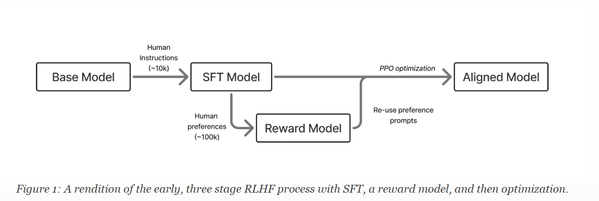

目录

- [RLHF 介绍](#rlhf-介绍)
  - [引言](#引言)
  - [RLHF 是做什么的？](#rlhf-是做什么的)
  - [Post-Training](#post-training)
- [定义与背景](#定义与背景)
  - [LM](#lm)
  - [ML](#ml)
  - [NLP](#nlp)
  - [RL](#rl)
  - [RLHF](#rlhf)
  - [扩展词汇表](#扩展词汇表)
- [Training](#training)
  - [问题定义](#问题定义)
    - [标准强化学习配置](#标准强化学习配置)
    - [微调于正则化](#微调于正则化)
    - [优化工具](#优化工具)
  - [标准训练](#标准训练)
- [参考](#参考)

# RLHF 介绍

## 引言

基于人类反馈的强化学习（RLHF）是一种将人类信息融入人工智能系统的技术。
RLHF 主要作为一种解决难以明确指定问题的方法而出现。

RLHF 的基本流程包括三个步骤：

* 首先，必须训练一个能够跟随用户问题的语言模型(LM)。
* 其次，必须收集人类偏好数据，用于训练人类偏好(Human Preference)的奖励模型(Reward Model, Reward Model)。
* 最后，可以选择使用强化学习(RL)优化器对语言模型进行优化，
  通过采样(Sampling)生成结果并根据奖励模型对其进行评分(Evaluate)。

早期 RLHF 方法的总结如图 1 所示：

在现代语言模型训练中，RLHF 是 Post-Training 的一个组成部分。
Post-Training 是一套更完整的技术和最佳实践，旨在使语言模型更适合下游任务。
Post-Training 可以总结为使用三种优化方法：

1. **指令微调(Instruction Finetuning, IFT)/监督微调(Supervised Finetuning, SFT)**，
   我们通过这种方法教授格式化和指令遵循能力。这主要涉及学习语言中的特征。
    - Instruction Finetuning
        - In-Context Learning
        - Indexing
        - Prompt-tuning
    - Supervised Finetuning
        - Feature-based
        - 
2. **偏好微调(Preference Finetuning, PreFT)**，我们将其与人类偏好对齐（同时获得更小的能力提升）。
   这主要涉及语言风格和难以量化的微妙人类偏好。
    - DPO(Direct Preference Optimization)：Preference-tuning
3. **强化微调（Reinforcement Finetuning, RFT）**。这是最新的一种 Post-Training 微调方法，
   可提升在可验证领域的性能。

## RLHF 是做什么的？

现代研究已将 RLHF 确立为一种通用方法，用于将细微的样式和相关行为特征整合到模型中。
与其他 Post-Training 技术（如指令微调）相比，
RLHF 在跨领域泛化方面表现远好——这有助于创建有效的通用模型。

直观上，这可以从优化技术的应用方式中看出。
指令微调是训练模型在文本前缀接近其已见过的示例时预测下一个特定标记。
它是在优化模型以更规律地在文本中输出特定特征。这是一种 **按标记(per-token)的更新**。

而 RLHF 是在响应级别上调整响应，而不是特别关注下一个标记。
此外，它是在告诉模型什么样的响应更好，而不是它应该学习的特定响应。
RLHF 还向模型展示它应该避免的响应类型，即负面反馈。
实现这一目标的训练通常称为 **对比损失函数(contrastive loss function)**。

虽然这种灵活性是 RLHF 的主要优势，但也带来了实施挑战。
这些挑战主要集中在对优化过程如何进行控制上。
正如本书将涵盖的内容，实施 RLHF 通常需要训练一个奖励模型，
而最佳实践尚未完全建立，且取决于应用领域。因此，优化过程本身容易导致过度优化，
因为我们的奖励信号最多只是一个代理目标，需要正则化。
考虑到这些局限性，有效的 RLHF 需要一个良好的起点，
因此 RLHF 不能单独解决所有问题，而需要在更广泛的 Post-Training 处理视角下进行考虑。

由于这种复杂性，实现 RLHF 的成本远高于简单的指令微调，并可能带来长度偏差(length bias)等意外挑战。
对于性能至关重要的项目，RLHF 被认为是实现强大微调模型的关键，但在计算成本、数据成本和时间上更为昂贵。

## Post-Training

将对 Post-Training 潜力的直观理解，
称为 Post-Training 过程的 **启发式解释(elicitation interpretation)**，
我们所做的只是提取和放大基模型中的有价值行为。

以一级方程式（F1）为例，大多数车队在年初就配备了新的底盘和发动机。
然后，他们全年都在研究空气动力学和系统改进（当然，这是一种轻微的过度简化），
从而显著提升车辆性能。最好的 F1 车队在一个赛季中的改进程度远超过底盘之间的改进。

Post-Training 的改进也是如此。最好的 Post-Training 改进团队在极短的时间内提取了大量性能。
这一系列技术包括大多数预训练结束后的所有技术，
例如：“训练中(mid-training)” 的退火/高质量预训练网络数据、指令微调、RLVR、偏好微调等。

然后，当你看到像 GPT-4.5 这样的模型时，你可以将其视为 OpenAI 构建更动态和令人兴奋的基础。
我们还知道，更大的基础模型可以吸收比它们更小的模型多样化的变化。
这意味着扩展(scaling)也使得 Post-Training 的优化过程能更快进行。
当然，要做到这一点，你需要有训练模型的基础设施。这就是为什么所有最大的公司仍在建造庞大的集群。
这一理论符合现实情况，即用户目前看到的大部分收益都来自 Post-Training 的优化，
因为这意味着互联网上预训练的模型中存在更多潜在的潜力，
而不仅仅是通过在早期训练类型（即仅指令微调）中反复传递某些狭窄样本来教给模型。

如果我们改变数据，对模型性能和行为的影响可能会更大，但这远非“表面问题(superficial)”。
如今的基座语言模型（未经后训练）可以通过强化学习训练解决一些数学问题，
学会输出完整的思维推理链，然后在一系列推理评估中（如 BigBenchHard、Zebra Logic、AIME 等）获得更高的分数。

表面一致性假设是错误的，原因与那些认为 RLHF 和后训练只是氛围的人仍然错误相同。
这是我们 2023 年必须克服的领域性教训（许多人工智能观察者仍然根深蒂固于这一点）。
后训练已经远远超越了这一点，我们开始认识到模型所依赖的行为风格——例如现在流行的长链思维。

# 定义与背景

## LM

> Language Modeling

大多数现代语言模型被训练以 **自回归(autoregressive)** 方式学习 **词元(token)序列（单词、子词或字符）** 的 **联合概率分布**。
自回归简单来说是指每个下一个预测依赖于序列中的先前实体。给定一个词元序列 `$x=(x_{1}, x_{2}, \cdots, x_{T})$`，
模型将整个序列的概率分解为条件分布的乘积：

`$$P_{\theta}(x)=\prod_{t=1}^{T}P_{\theta}(x_{t}|x_{1},\cdots,x_{t-1}).\tag{1}$$`

为了拟合一个能够准确预测这一点的模型，目标通常是最大化当前模型对训练数据的预测似然。
为此，我们可以最小化负对数似然（NLL）损失：

`$$\mathcal{L}_{\text{LM}}(\theta)=-\,\mathbb{E}_{x \sim \mathcal{D}}\left[\sum_{t=1}^{T}\log P_{\theta}\left(x_t \mid x_{<t}\right)\right].\tag{2}$$`

在实践中，人们使用 **交叉熵损失(cross-entropy)** 来评估每个下一个词的预测，
通过将序列中的真实词与模型预测的词进行比较来计算。

实现语言模型可以有多种形式。现代语言模型，包括 ChatGPT、Claude、Gemini 等，
通常使用 **仅解码器的 TransfoReward Modeler(decoder-only TransfoReward Modeler)**。
TransfoReward Modeler 的核心创新是大量利用 **自注意力机制(self-attention)**，
使模型能够直接关注上下文中的概念并学习复杂的映射。
LM 头是一个最终的线性投影层，它将模型内部的嵌入空间映射到分词器空间（即词汇表(vocabulary)）。
可以使用不同的注意力头来重用模型的内部结构，并微调它以输出不同形状的量。

## ML

**Kullback-Leibler(KL) divergence**（`$D_{\text{KL}}(P||Q)$`），也称为 KL 散度，
是衡量两个概率分布之间差异的度量。对于定义在相同概率空间 `$\mathcal{X}$` 上的离散概率分布 `$P$` 和 `$Q$`，
从 `$Q$` 到 `$P$` 的 KL 距离定义为：

`$$D_{KL}(P || Q) = \sum_{x \in \mathcal{X}} P(x) \log \left(\frac{P(x)}{Q(x)}\right)\tag{3}$$`

## NLP

* **Prompt**(`$x$`)：提示，给语言模型输入以生成响应(response)或补全(completion)的文本。
* **Completion**(`$y$`)：补全，语言模型在响应提示时生成的输出文本。通常补全用 `$y|x$` 表示。
* **Chosen Completion**(`$y_{c}$`)：选定的补全，在多个选项中选定的或偏好的补全，
  通常表示为 `$y_{\text{chosen}}$`。
* **Rejected Completion**(`$y_{r}$`)：拒绝的补全，在两两比较中的不受偏好的补全。
* **Preference Relation**(`$\succ$`)：偏好关系，表示一个补全比另一个更受偏好的符号，
  例如 `$y_{chosen} \succ y_{rejected}$`。
* **Policy**(`$\pi$`)：可能补全的一个概率分布，由 `$\theta$` 参数化：`$\pi_{\theta(y|x)}$`。

## RL

* **Reward**(`$r$`)：奖励，表示一个动作(Action)或状态(State)的期望程度的一个标量值，通常表示为 `$r$`。
* **Action**(`$a$`)：动作，智能体在环境中做出的决策(decision)或移动(move)，
  通常表示为 `$a \in A$`，其中 `$A$` 是可能动作的集合。
* **State**(`$s$`)：状态，环境的当前配置或情况，通常表示为 `$s \in S$`，其中 `$S$` 是状态空间。
* **Trajectory**(`$\tau$`)：轨迹，轨迹 `$\tau$` 是智能体经历的状态、
  动作和奖励的序列：`$\tau = (s_0, a_0, r_0, s_1, a_1, r_1, ..., s_T, a_T, r_T)$` 。
* **Trajectory Distribution**(`$(\tau|\pi)$`)：轨迹分布, 在策略 `$\pi$` 下，
  轨迹的概率为 `$P(\tau|\pi) = p(s_0)\prod_{t=0}^T \pi(a_t|s_t)p(s_{t+1}|s_t,a_t)$`，
  其中 `$p(s_{0})$` 是初始状态分布，`$p(s_{t+1}|s_{t}, a_{t})$` 是转移概率。
* **Policy**(`$\pi$`)：策略，在 RLHF 中也称为策略模型(policy model)：在 RL 中，
  策略是智能体(agent)遵循的策略或规则，用于决定在给定状态下采取哪个动作：`$\pi(a|s)$`。
* **Discount Factor**(`$\gamma$`)：折扣因子，一个标量 `$0 \le \gamma < 1$`，
  在回报中对未来奖励进行指数级降权，权衡即时性与长期收益，并保证无限时间跨度的总和收敛。
  有时不使用折扣，这相当于 `$\gamma=1$`。
* **Value Function**(`$V$`)：价值函数，一个从给定状态估计预期累积奖励的函数：
  `$V(s) = \mathbb{E}\big[\sum_{t=0}^{\infty} \gamma^t r_t | s_0 = s\big]$`。
* **Q-Function**(`$Q$`)：Q 函数，一个在给定状态下估计采取特定行动的预期累积奖励的函数：
  `$Q(s,a) =\mathbb{E}\big[\sum_{t=0}^{\infty} \gamma^t r_t | s_0 = s, a_0 =a\big]$`。
* **Advantage Function**(`$A$`)：优势函数，
  优势函数 `$A(s, a)$` 量化了在状态 `$s$` 中采取行动 `$a$` 相对于平均行动的相对收益。
  它定义为 `$A(s,a)=Q(s, a)-V(s)$`。优势函数（以及值函数）可以依赖于特定的策略 `$A^{\pi}(s, a)$`。
* **Policy-conditioned Values**(`$[]^{\pi(\cdot)}$`)：策略条件值，在 RL 推导和实现中，
  理论和实践的一个关键组成部分是在特定策略条件下收集数据或值。
  在这本书中，我们将交替使用更简单的值函数等符号（`$V,A,Q,G$`）及其特定的策略条件值（`$V^\pi,A^\pi,Q^\pi$`）。
  在预期值计算中，关键还在于从在特定策略条件下（`$d$`）的数据中采样，即（`$d_{\pi}$`）。
* **Expectation of Reward Optimization**：奖励优化期望：RL（强化学习）中的主要目标，即最大化期望累积奖励：

`$$\max_{\theta} \mathbb{E}_{s \sim \rho_\pi, a \sim \pi_\theta}\Bigg[\sum_{t=0}^{\infty} \gamma^t r_t\Bigg]\tag{4}$$`

其中 `$\rho_{\pi}$` 是策略 `$\pi$` 下的状态分布，`$\gamma$` 是折扣因子。

## RLHF

* ***Reference Model**(`$\pi_{\text{ref}}$`)：参考模型，这是在 RLHF 中使用的参数集，其输出用于正则化优化。

## 扩展词汇表

* **Synthetic Data**：合成数据，这是由另一个 AI 系统生成的任何 AI 模型训练数据。
  这可以是模型从开放式提示生成的文本，也可以是模型重写现有内容等。
* **Distillation**：蒸馏，蒸馏是在训练 AI 模型时采用的一套通用实践，
  即使用一个强模型的输出来训练另一个模型。这是一种已知能够使小型模型变得强大的合成数据类型。
  大多数模型通过许可证（针对开放权重模型）或服务条款（针对仅通过 API 访问的模型）明确了蒸馏的相关规则。
  如今，“蒸馏”一词已被机器学习文献中的特定技术定义所覆盖。
* **(Teacher-student) Knowledge Distillation**：(Teacher-student) 知识蒸馏，
  从特定教师模型到学生模型的知识蒸馏是上述蒸馏的一种特定类型，也是该术语的起源。
  它是一种特定的深度学习方法，其中神经网络损失被修改为从教师模型在多个潜在标记(tokens)/逻辑值(logits)上的对数概率中学习，
  而不是直接从选择的输出中学习。使用知识蒸馏训练的现代模型系列的例子包括 Gemma 2 或 Gemma 3。
  对于语言建模设置，下一个标记损失函数可以修改如下，其中学生模型 `$P_{\theta}$` 从教师分布 `$P(\phi)$` 中学习：

  `$$\mathcal{L}_{\text{KD}}(\theta) =
  -\,\mathbb{E}_{x \sim \mathcal{D}}\left[\sum_{t=1}^{T} P_{\phi}(x_t
  \mid x_{<t}) \log P_{\theta}(x_t \mid x_{<t})\right].
  \tag{5}$$`

* **In-context Learning (ICL)**: 情境学习，这里的情境指的是语言模型上下文窗口内的任何信息。
  通常，这是添加到提示中的信息。情境学习的最简单形式是在提示之前添加与形式相似的示例。
  高级版本可以学习为特定用例包含哪些信息。
* **Chain of Thought (CoT)**: 思维链，思维链是语言模型的一种特定行为，
  即引导模型以逐步分解问题的形式进行操作。这种方法的原始版本是通过提示 “让我们一步一步思考” 实现的。

# Training

## 问题定义

RLHF 的优化建立在标准的强化学习设置上。在强化学习中，智能体根据环境状态 `$s$`，
从策略 `$\pi$` 中采样动作 `$a$`，以最大化奖励 `$r$`，下面是标准的强化学习循环。

一般，环境通过转换(transition)或动态函数(dynamics function) `$p(s_{t+1}|s_{t}, a_{t})$` 进行演变。
因此，在有限回合中，强化学习智能体的目标是解决以下优化问题：

`$$J(\pi) =\mathbb{E}_{\tau \sim \pi} \left[ \sum_{t=0}^{\infty} \gamma^t r(s_t,a_t) \right],\tag{1}$$`

其中 `$\gamma$` 是一个从 `$0$` 到 `$1$` 的折扣因子，用于平衡近期和未来奖励的期望值。

### 标准强化学习配置

从标准的 RL 设置到 RLHF 存在多个核心变化：

1. 

### 微调于正则化

### 优化工具

下面是标准的强化学习循环：

## 标准训练

# 参考

* [Article: Reward Models](https://cameronrwolfe.substack.com/p/reward-models)
* [Book: RLHF](https://rlhfbook.com/)
* [Book: EasyRL](https://github.com/datawhalechina/easy-rl)
* [Book: Reinforcement Learning: An Introduction](http://incompleteideas.net/book/the-book-2nd.html)
* [GitHub: ShangtongZhang/reinforcement-learning-an-introduction](https://github.com/ShangtongZhang/reinforcement-learning-an-introduction)
