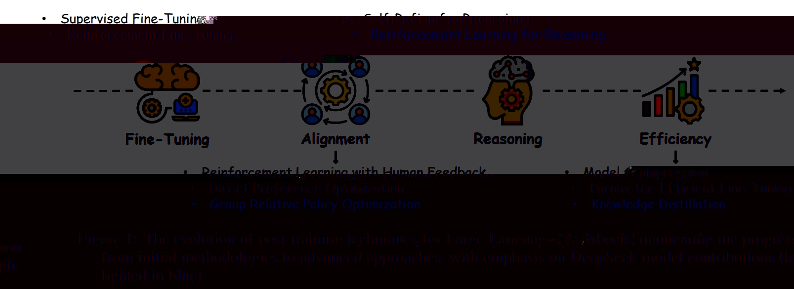
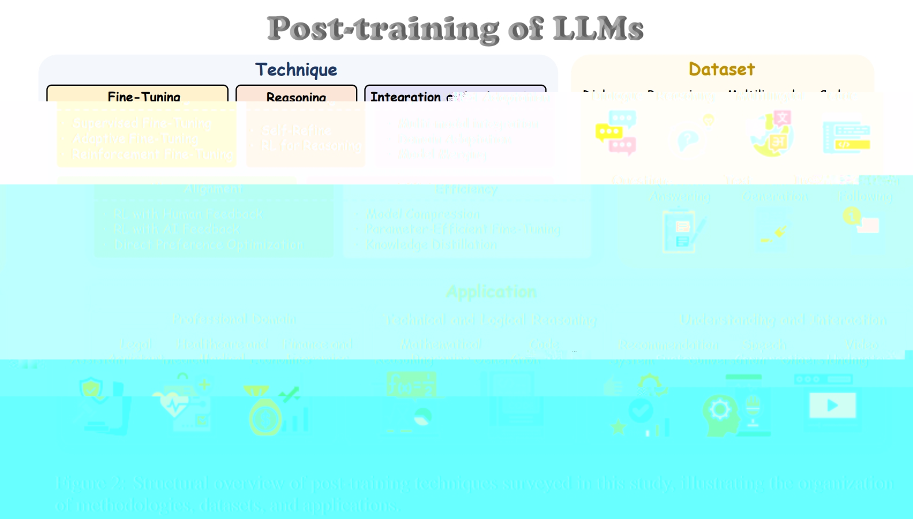

目录

- [LLM Pre-training 问题](#llm-pre-training-问题)
- [LLM Post-training 范式](#llm-post-training-范式)
- [预训练和后训练](#预训练和后训练)
    - [预训练](#预训练)
    - [后训练](#后训练)
        - [技术简介](#技术简介)
        - [技术结构](#技术结构)
- [Post-training 公式基础](#post-training-公式基础)
    - [策略优化原理](#策略优化原理)
    - [RLHF 原理](#rlhf-原理)
    - [DPO 原理](#dpo-原理)
    - [GRPO 原理](#grpo-原理)
- [Post-training 微调](#post-training-微调)
    - [有监督微调](#有监督微调)
    - [自适应微调](#自适应微调)
    - [强化学习微调](#强化学习微调)
- [Post-training 对齐](#post-training-对齐)
- [Post-training 推理](#post-training-推理)
- [Post-training 效率](#post-training-效率)
- [Post-training 集成和适配](#post-training-集成和适配)
- [参考](#参考)

# LLM Pre-training 问题

预训练架构在特定情境下常常暴露出局限性：

* 推理能力有限
* 伦理不确定性
* 领域特定性能不佳
* ...

# LLM Post-training 范式

LLM Post-training 在五个核心范式中的演变：

* **微调（Fine-tuning）**：提高特定任务准确性；
* **对齐（Alignment）**：确保伦理一致性和与人类偏好的对齐；
* **推理（Reasoning）**：尽管在奖励设计方面存在挑战，但仍推进多步推理；
* **效率（Efficiency）**：在复杂性不断增加的情况下优化资源利用；
* **集成与适应（Integration and Adaptation）**：扩展跨多种模态的能力，同时解决一致性问题。

# 预训练和后训练

LLMs 可以分为两个主要阶段：预训练(pre-training) 和后训练(post-training)。

## 预训练

预训练的概念源自计算机视觉(CV)任务中的迁移学习。其主要目标是使用大量数据集开发一个通用模型，
以便轻松微调以适应各种下游应用。预训练的一个重要优势是能够利用任何未标注的文本语料库，
从而提供丰富的训练数据来源。然而，早期的静态预训练方法，如神经网络语言模型(NNLM) 和 Word2vec，
难以适应不同的文本语义环境，促使了动态预训练技术的发展，如 BERT 和 XLNet。
BERT 通过利用 Transformer 架构并在大规模未标注数据集中使用自注意力机制，
有效解决了静态方法的局限性。这项研究建立了“预训练和微调”的学习范式，启发了众多后续研究，
引入了多种架构，包括 GPT-2 和 BART。

## 后训练

### 技术简介

后训练是指模型经过预训练后所采用的技术和方法，旨在细化和适应特定任务或用户需求。
随着具有 1750 亿个参数的 GPT-3 的发布，后训练领域经历了显著的兴趣和创新激增。
出现了多种方法来提高模型性能，包括微调(fine-tuning)，即使用标注数据集或特定任务数据调整模型参数；
对齐策略(alignment strategies)，即优化模型以更好地与用户偏好对齐；
知识适配技术(knowledge adaptation techniques)，即使模型能够纳入领域特定知识；
以及推理改进(reasoning improvements)，即增强模型的逻辑推理和决策能力。
这些技术统称为后训练语言模型(PoLMs)，催生了如 GPT-4、LLaMA-3、Gemini-2.0 和 Claude-3.5 等模型的开发，
标志着 LLM 能力的重大进展。然而，后训练模型通常难以不经重新训练或重大参数调整而适配新任务，
这使得 PTM 开发成为活跃的研究领域。

正如所强调的，预训练语言模型(PLMs) 主要旨在提供一般知识和能力，
而 PoLMs 则专注于将这些模型适应特定任务和需求。一个显著的例子是最新一代的 LLM，DeepSeek-R1，
它展示了 PoLMs 在增强推理能力、与用户偏好对齐以及提高跨领域适应性方面的演变。
此外，开源 LLMs（例如 LLaMA、Gemma 和 Nemotron）和领域特定的大规模数据集（例如 Prompt Source 和 Flan）的日益可用，
正在推动学术研究人员和行业从业者开发 PoLMs 的趋势。这一趋势突显了在 PoLMs 领域中定制适应性的重要性。

### 技术结构

* 微调技术(Fine-Tuning)
    - 监督微调(Supervised Fine-Tuning, SFT)
    - 自适应微调(Adaptive Fine-Tuning)
    - 强化微调(Reinforcement Fine-Tuning, RFT)
* 对齐问题(Alignment)
    - 人类反馈强化学习(Reinforcement Learning from Human Feedback, RLHF)
    - 人工智能反馈强化学习(Reinforcement Learning from AI Feedback, RLAIF)
    - 直接偏好优化(Direct Preference Optimization, DPO)
* 推理能力(Reasoning)
    - 自精炼方法(Self-Refinement Methods)
    - 推理强化学习(Reinforcement Learning for Reasoning)
* 提高效率的方法(Efficiency)
    - 模型压缩(Model Compression)
    - 参数高效微调(Parameter-Efficient Fine-Tuning, PEFT)
    - 知识蒸馏(Knowledge Distillation)
* 集成与适应技术(Integration and Adaptation)
    - 多模态方法(Multi-modal integration)
    - 领域适应(Domain Adaptation)
    - 模型融合(Model Merging)
* 后训练中使用的数据集
* 大型语言模型的应用

# Post-training 公式基础

## 策略优化原理

## RLHF 原理

## DPO 原理

## GRPO 原理

# Post-training 微调

微调构成了将预训练大型语言模型（LLMs）适应特定任务的核心，通过有针对性的参数调整来优化其能力。
这一过程利用标注数据集或任务特定数据集来优化性能，弥合通用预训练与领域特定需求之间的差距。

## 有监督微调

## 自适应微调

## 强化学习微调

# Post-training 对齐

# Post-training 推理

# Post-training 效率

# Post-training 集成和适配

# 参考

* [A SURVEY ON POST-TRAINING OF LARGE LANGUAGE MODELS](https://link.zhihu.com/?target=https%3A//arxiv.org/pdf/2503.06072v1)
* [六万字长文一次性说清 LLM 的后训练技术](https://zhuanlan.zhihu.com/p/49358536242)
* [NLP评估指标之ROUGE](https://zhuanlan.zhihu.com/p/504279252)