

目录

- [电力现货交易策略](#电力现货交易策略)
    - [集中式电力现货市场的典型设计](#集中式电力现货市场的典型设计)
        - [电力现货市场与一般现货市场的区别](#电力现货市场与一般现货市场的区别)
        - [电力现货交易给调度模式带来的转变](#电力现货交易给调度模式带来的转变)
        - [现货市场的出清机制](#现货市场的出清机制)
        - [电力现货市场的节点电价](#电力现货市场的节点电价)
            - [节点电价](#节点电价)
            - [节点电价形成原理](#节点电价形成原理)
        - [现货市场体系中的电费结算机制](#现货市场体系中的电费结算机制)
        - [现货市场体系中的两种风险对冲](#现货市场体系中的两种风险对冲)
        - [差价合约](#差价合约)
    - [集中式电力现货市场的基本架构](#集中式电力现货市场的基本架构)
        - [现货市场交易产品](#现货市场交易产品)
        - [现货市场各类出清的边界和使用数据](#现货市场各类出清的边界和使用数据)

## 电力现货交易策略

### 集中式电力现货市场的典型设计

#### 电力现货市场与一般现货市场的区别

> **一般现货市场**

* 一手交钱，一手交货，实物交割

> **电力现货市场**

* 电力系统的特点：电能无法低成本、大规模储存、因此发、输、配、用须同时完成，
    且必须保证发用实时平衡。因此，交易之后无法立刻交割。
* 电力市场的模式：
    - 日前市场：基本确定运行日的负荷需求、开机机组出力水平、电网运行边界条件等交割条件
    - 日内市场：对上述条件进行滚动微调
    - 实时市场 + 辅助服务市场：保证发用实时平衡

#### 电力现货交易给调度模式带来的转变

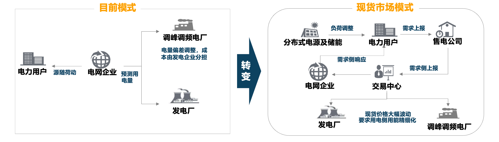

* 日前市场：12:00 前交易第二天的电力
* 日内市场：交易当天的电力，实际交割前 1~2 小时关闸
* 实时市场：申报以 5 分钟为频率的负荷曲线和价格，交割前 1 小时关闸，中标结果为需要执行的发电计划
* 辅助服务市场：出现发电电量不平衡时，向市场主体购买调频和容量备用服务

> 电网中的节点

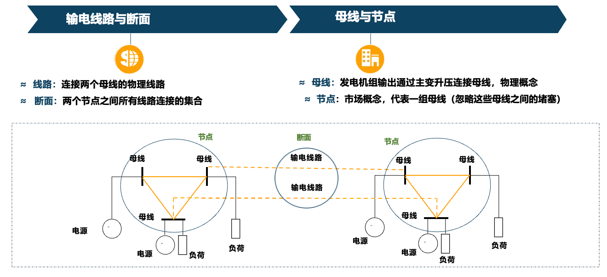

> 一般现货市场交易结算的地点要素

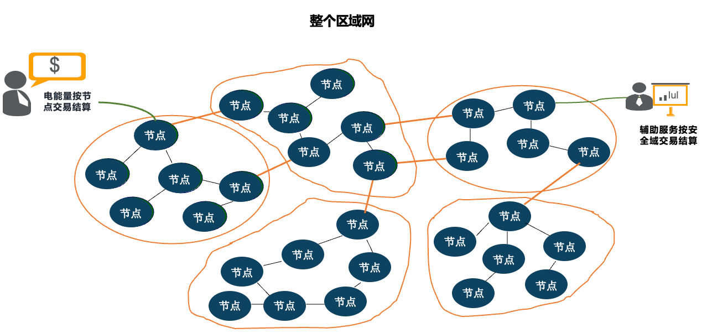

> 为什么按安全域设置备用需求？

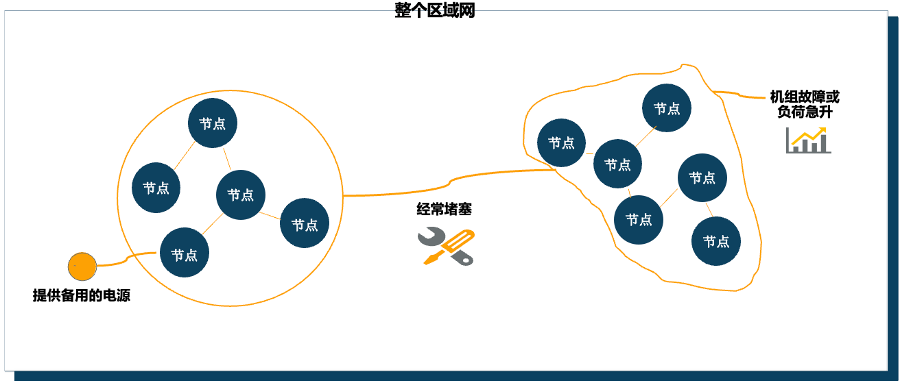

#### 现货市场的出清机制

发电侧单边报价或发用两侧报价：

* 基于申报信息以及电网运行边界条件，采用安全约束机组组合（SCUC）和安全约束经济调度（SCED）程序进行优化计算， 
  出清得到日前市场交易结果。简单而言，在保证电网安全的前提下，优先调用系统中报价最为便宜的机组，直至满足负荷需求。

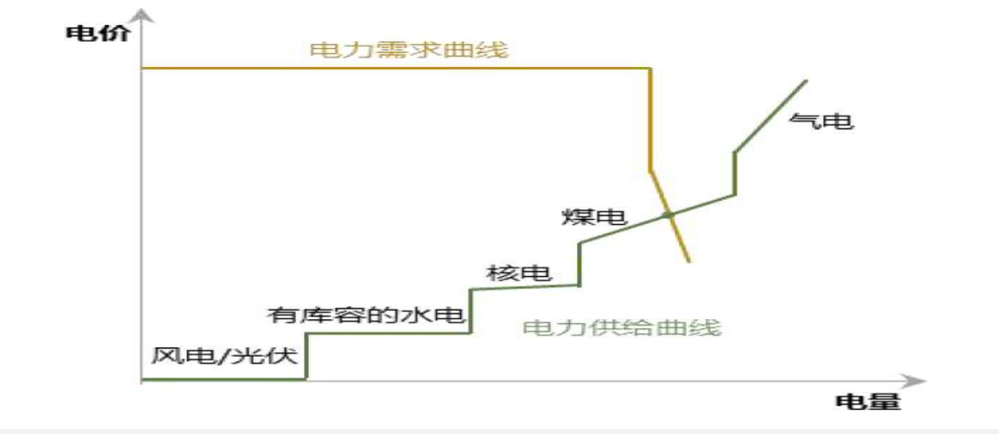

* 电力现货市场价格随着负荷需求、电网约束以及电源参与类型等因素变化而变化。
  并由于这些因素的不确定性，导致电力现货价格的大幅波动和跳跃。

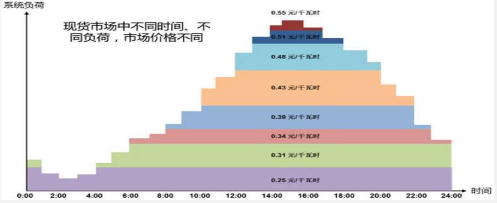

#### 电力现货市场的节点电价

##### 节点电价

> **节点电价**

* 在满足当前输电网络设备约束条件和各类其他资源工作特点的情况下，
  在节点增加单位负荷需求时的边际成本。

> **优势**

1. 有效反映电力商品时间、空间价值；
2. 在短期有效引导用电行为，在长期指引电网公司合理规划输电资源；
3. 节点电价机制是最为成熟的考虑安全约束的价格机制。

> 网损因子和网损惩罚因子

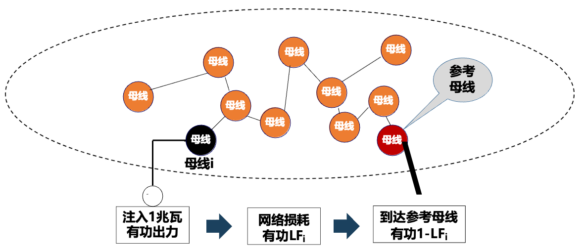

母线 `$i$` 的：

* 网损因子：`$LF_{i}$`
* 网损惩罚因子：`$PF_{i}=1 / (1 - LF_{i})$`

##### 节点电价形成原理

> 示例场景：

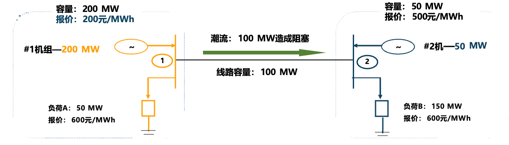

> 问题：

1. 如何确定 `#1机组`、`#2机组` 中标电价？
2. 如何确定 `负荷A`、`负荷B` 中标电价？

> 方法：

1. 统一按 `200元/MWh` 出清结算，对 `#2机组` 不公平；
2. 统一按 `500元/MWh` 出清结算，对 `负荷A` 不公平；
3. `节点1` 按 `200元/MWh` 出清结算，`节点2` 按 `500元/MWh` 出清结算。

> 公平：

* `节点1` 按 `200元/MWh` 出清结算，`节点2` 按 `500元/MWh` 出清结算，
  对购电、售电四方就都公平了？对谁仍然不公平？

> 阻塞盈余：

* `负荷B` 购电费 = `$500 \times 150 = 75000\text{元}$`；
* `负荷B` 的 150MW 中：
    - 有 100MW 是 `#1机组` 提供的，售价是 `200元/MWh`
    - 有 50MW 是 `#2机组` 提供的，售价是 `500元/MWh`
    - 出现了阻塞盈余 = `$(500 - 200) \times 100 = 30000\text{元}$`

#### 现货市场体系中的电费结算机制

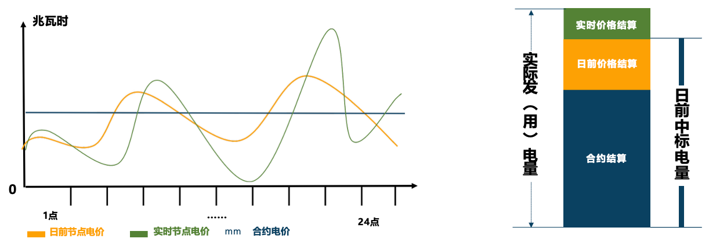

* 实时市场价格：可能受意外影响（如机组跳机、电网故障等），不确定性最高；
* 日前市场价格：主要受相对稳定的电力供需关系影响，在短期内有一定可预测性；
* 合约市场价格：受日前市场价格走势决定，用来平抑现货价格波动对电费的影响。

#### 现货市场体系中的两种风险对冲

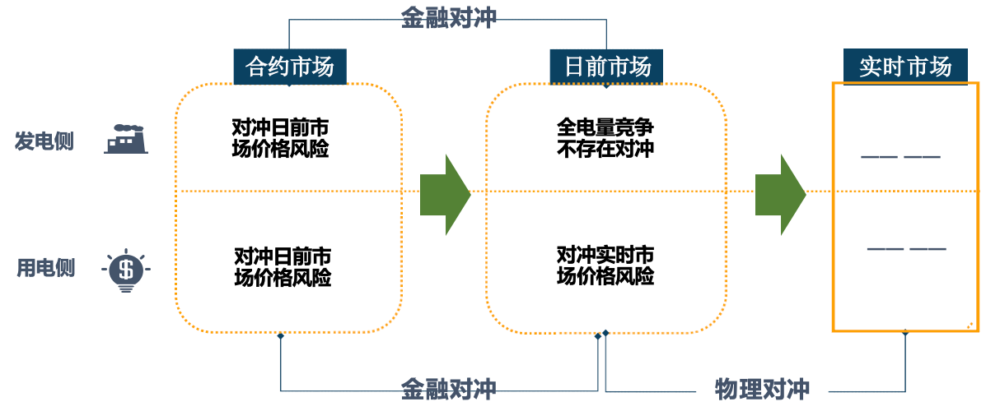

#### 差价合约

> 示例情况 1：

现货市场价格为 `0.4元/kWh`，A 的收益：`$100 \times 0.4 + 100 \times (0.5 - 0.4)$`，
交易双方补齐差价电费：`$100 \times (0.5 - 0.4)=10\text{元}$`；

> 示例情况 2：

现货市场价格为 `0.6元/kWh`，A 的收益：`$100 \times 0.6 + 100 \times (0.5 - 0.6)$`，
交易双方补齐差价电费：`$100 \times (0.5 - 0.6)=-10\text{元}$`；

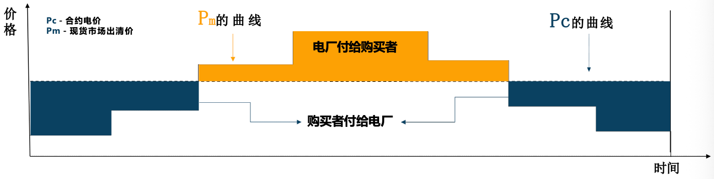

1. 差价合约是一种避免和控制风险的金融手段，其本质是对现货（日前）价格的对赌；
2. 电量将稳定地按照合约价格结算，合约电量以外增发（或少发）的电量将以现货（日前）市场节点价格结算；
3. 当某一时段的合约量，交割节点与现货完全一致时，将实现完全对冲，
   即电费完全不受现货（日前）价格波动的影响；

### 集中式电力现货市场的基本架构

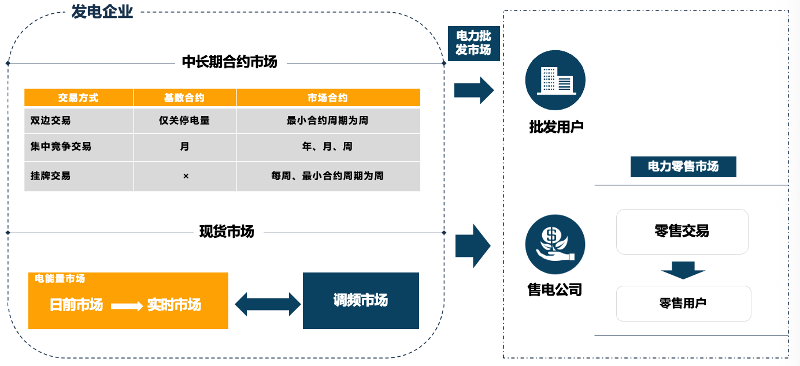

#### 现货市场交易产品

> 电能

* 合约市场、日前市场、实时市场

> 辅助服务

* 调频备用
    - 实时市场：对在线机组 5 分钟内有功功率（上/下）调节响应的备用需求
* 一级备用
    - 实时市场：对在线机组或负荷 10 分钟内有功功率上调响应的备用需求（旋转备用）
* 二级备用
    - 实时市场：对在线或离线机组或负荷 30 分钟内有功功率上调响应的备用需求（非旋转备用）

#### 现货市场各类出清的边界和使用数据

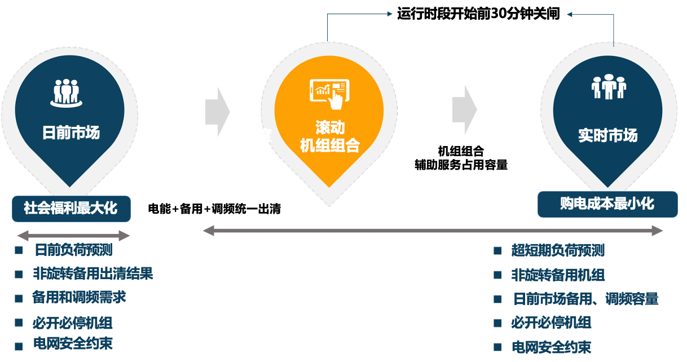
