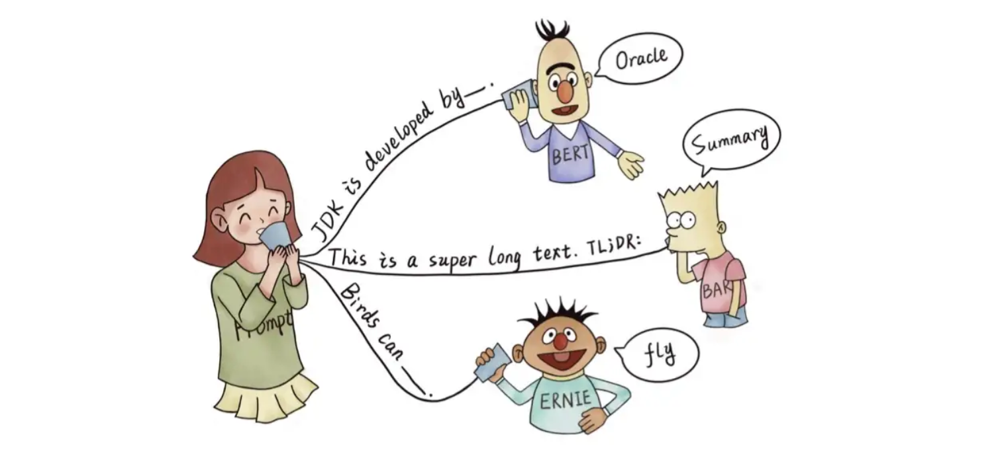
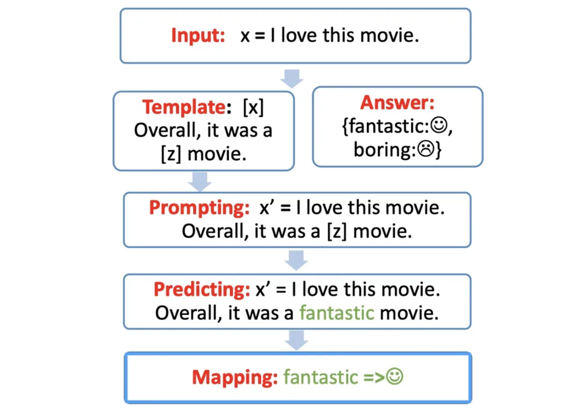
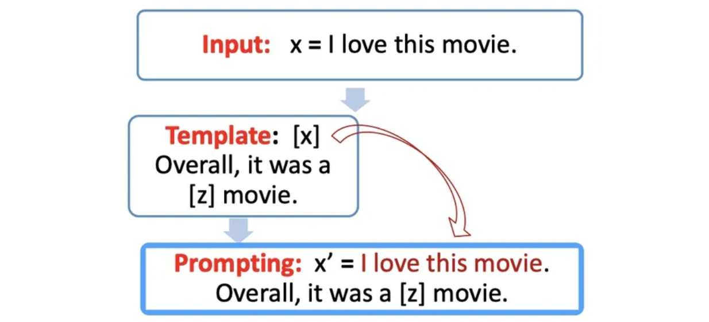
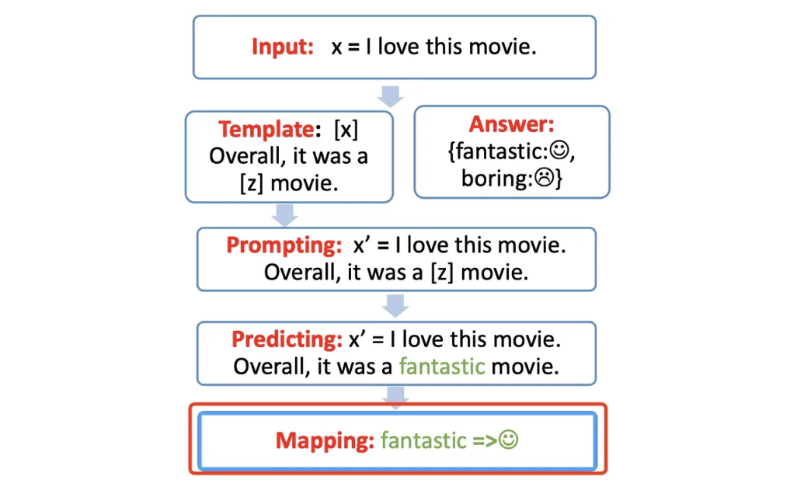
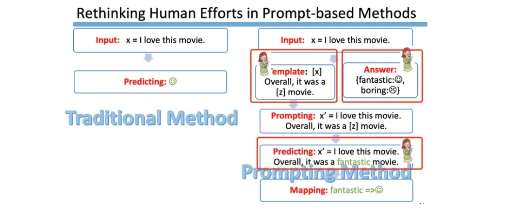
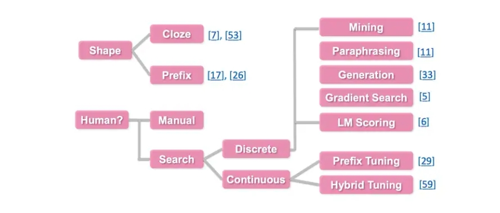

目录

- [预训练模型和 Prompt](#预训练模型和-prompt)
    - [预训练模型](#预训练模型)
    - [Promot](#promot)
    - [Prompt 工作流](#prompt-工作流)
        - [Prompt construction-\[Template\]](#prompt-construction-template)
        - [Answer construction-\[Verbalizer\]](#answer-construction-verbalizer)
        - [Answer prediction-\[Prediction\]](#answer-prediction-prediction)
        - [Answer-label mapping-\[Mapping\]](#answer-label-mapping-mapping)
        - [总结](#总结)
    - [Prompt-based 方法的工程选择问题](#prompt-based-方法的工程选择问题)
        - [Prompt Template Engineering](#prompt-template-engineering)
        - [Answer Engineering](#answer-engineering)
- [提示工程](#提示工程)
    - [提示工程简介](#提示工程简介)
    - [模型设置](#模型设置)
    - [基本概念](#基本概念)
    - [提示词要素](#提示词要素)
    - [设计提示的通用技巧](#设计提示的通用技巧)
    - [提示词示例](#提示词示例)
- [提示技术](#提示技术)
    - [零样本提示](#零样本提示)
    - [少样本提示](#少样本提示)
    - [链式思考(CoT)提示](#链式思考cot提示)
    - 
- [提示应用](#提示应用)
- [Prompt Hub](#prompt-hub)
- [模型](#模型)
- [风险和误用](#风险和误用)
- [LLM 研究](#llm-研究)
- [参考](#参考)

# 预训练模型和 Prompt

## 预训练模型

首先，需要了解什么是预训练模型，以及其带来的 Prerain + Fine-tuning 的范式。

在很长的一段时间内，NLP 的任务采用的都是 Pretrain + Fine-tuning(Model Tuning)的解决方案，
但是这种方案，需要对每个任务都重新 fine-tune 一个新的模型，且不能共用。
但是对于一个预训练的大语言模型来说，这就仿佛好像是对于每个任务都进行了定制化，十分不高效。
是否存在一种方式，可以将预训练模型作为电源，不同的任务当做电器，仅需要根据不同的电器（任务），
选择不同的适配器，对于模型来说，即插入不同的任务特定的参数就可以使得模型适配下游任务。
Prompt Learning 就是这个适配器，它能高效地进行预训练模型的使用。这种方式大大提升了预训练模型的使用率，如下图：

* 左边是传统的 Model Tuning 的范式：对于不同的任务，都需要将整个预训练模型进行精调，
  每个任务都有自己的一整套参数。
* 右边是 Prompt Tuning，对于不同的任务，仅需要插入不同的 Prompt 参数，
  每个任务都单独训练 Prompt 参数，不训练预训练语言模型，这样子可以大大缩短训练时间，也极大的提升了模型的使用率。

## Promot

所以什么是 Prompt？字面上来讲，Prompt 就是提示。比如有人忘记了某个事情，我们给予特定的提示，
他就可以想起来，例如我们说：`白日依山尽，`，大家自然而然地会想起来下一句诗：`黄河入海流`。
或者，搜索引擎可以根据我们的输入进行输出的提示：

在 NLP 中，Prompt 代表的是什么呢？

> Prompt 就是给预训练模型的一个线索/提示，帮助它可以更好地理解人类的问题。

例如，下图的 BERT、BART、ERNIE 均为预训练模型，对于人类提出的问题，以及线索，
预训练语言模型可以给出正确的答案。

* 根据提示，BERT 能回答 JDK 是 Oracle 研发的
* 根据 TL;DR: 的提示，BART 知道人类想要问的是文章的摘要
* 根据提示，ERNIE 知道人类想要问鸟类的能力：飞行

Prompt 更严谨的定义如下：

> Prompt is the technique of making better use of the knowledge from the pre-trained model by adding additional texts to the input.
>
> Prompt 是一种为了更好地使用预训练模型的知识，采用在输入段添加额外的文本的技术。
> 
> 目的：更好地挖掘预训练语言模型的能力
> 手段：在输入端添加文本，即重新定义任务（task reformulation）

## Prompt 工作流

Prompt 的工作流包含以下四部分：

1. Template
    - Prompt 模版（Template）的构造
2. Answer
    - Prompt 答案空间映射（Verbalizer）的构造
    - `predict text: label`
3. Prompt/Predicting
    - 文本代入 Prompt 模板，并且使用预训练语言模型进行预测
4. Mapping
    - 将预测的结果映射回 Label

### Prompt construction-[Template]

首先，需要构建一个模版，模板的作用是将输入和输出进行重新构造，
变成一个新的带有 mask slots 的文本，具体如下：

* 定义一个模板，包含了两处待填入的 slots：`[x]` 和 `[z]`
* 将 `[x]` 用输入文本代入

例如：

* 输入：`x = 我喜欢这个电影。`
* 模版：`[x]总而言之，它是一个[z]电影`
* 代入(prompting)：`我喜欢这个电影。总而言之，它是一个[z]电影`

### Answer construction-[Verbalizer]

对于构造的 Prompt，我们需要知道 **预测词** 和 **label** 之间的关系，
并且也不可能运行 `z` 是任意词，这边就需要一个映射函数(mapping function)将 **输出词** 与 **label** 进行映射。

例如上述例子，输出的 label 有两个，一个是 `fantastic 脸`，一个是 `borning 脸`。
我们可以限定，如果预测词是 `fantastic`，则对应 `fantastic 脸`，
如果是 `boring` 则对应 `borning 脸`。

### Answer prediction-[Prediction]

这一步就只需要选择合适的预训练模型，然后进行 mask slot `[z]` 的预测。
例如下图，得到了结果 `fantastic`，需要将其代入 `[z]` 中

### Answer-label mapping-[Mapping]

对于得到的 answer，需要用 `Verbalizer` 将其映射回原本的 `label`。
例如：`fantastic` 映射回 `label`。

### 总结

## Prompt-based 方法的工程选择问题

在知乎中有个提问：“现代的 deep learning 就是为了规避 feature engineering”，
可是 prompt 这边选择了 `template` 和 `answer` 不还是 feature engineering 吗？
从这个问题中可以发现，确实如果使用 BERT 的 fine-tuning 范式（下图左），
我们是不需要使用任何的人工特征构造，而使用 prompt-based 的方法的话，
需要人工参与的部分包含了以下部分：

* `template` 构造
* `answer` 构造
* 预训练模型选择
* prompt 的组合问题选择
* 以及训练策略的选择等

下面会先进行每个需要人工 engineering 的部分进行详细讲解，然后再分析为什么我们还需要 prompt 这种范式。

### Prompt Template Engineering

> Prompt 模板工程

如何构造合适的 Prompt 模板？对于同一个任务，不同的人可能构造不同的 Template。
且每个模板都具有合理性。

Template 的选择，对于 Prompt 任务起到了很重大的作用，就算一个 word 的区别，也可能导致十几个点的效果差别，
论文 [GPT Understands, Too](https://arxiv.org/abs/2103.10385) 给出了如下的结果：

对于不同的 template，可以从以下两种角度进行区分：

1. 根据 slot 的 `形状/位置` 区分
    - 完形填空(Cloze)的模式，即未知的 slot 在 template 的中间等不定的位置
    - 前缀模式(Prefix)，未知的 slot 在 template 的开头
2. 根据 `是否是由人指定的` 来区分
    - 人工指定 template
    - 自动搜索 template
        - 离散(discrete) template，即搜索的空间是离散的，为预训练语言模型的字典里的字符
        - 连续(continuous) template，即搜索的空间是连续的，
        因为所有新增的这些 prompt 的参数主要是为了让机器更好地服务于任务，
        所以其参数地取值空间不需要限定在特定地取值范围内，可以是连续地空间

具体地思维导图如下：

### Answer Engineering

> 答案工程

在给定一个任务或者 prompt 时，如何对 label 空间和 answer 空间进行映射？

# 提示工程

## 提示工程简介

提示工程（Prompt Engineering）是一门较新的学科，关注提示词开发和优化，
帮助用户将大语言模型（Large Language Model, LLM）用于各场景和研究领域。
掌握了提示工程相关技能将有助于用户更好地了解大型语言模型的能力和局限性。

* 研究人员可利用提示工程来提升大语言模型处理复杂任务场景的能力，如问答和算术推理能力。
* 开发人员可通过提示工程设计、研发强大的工程技术，实现和大语言模型或其他生态工具的高效接轨。

提示工程不仅仅是关于设计和研发提示词。它包含了与大语言模型交互和研发的各种技能和技术。
提示工程在实现和大语言模型交互、对接，以及理解大语言模型能力方面都起着重要作用。
用户可以通过提示工程来提高大语言模型的安全性，也可以赋能大语言模型，
比如借助专业领域知识和外部工具来增强大语言模型能力。

## 模型设置

测试环境：

* OpenAPI Playground
* 模型：`gpt-3.5-turbo`
* 模型配置：
    - `temperature = 1`
    - `top_p = 1`

使用提示词时，您会通过 API 或直接与大语言模型进行交互。你可以通过配置一些参数以获得不同的提示结果。
调整这些设置对于提高响应的可靠性非常重要，你可能需要进行一些实验才能找出适合您的用例的正确设置。
以下是使用不同 LLM 提供程序时会遇到的常见设置：

* Temperature：简单来说，temperature 的参数值越小，模型就会返回越确定的一个结果。
  如果调高该参数值，大语言模型可能会返回更随机的结果，也就是说这可能会带来更多样化或更具创造性的产出。
  我们目前也在增加其他可能 token 的权重。在实际应用方面，对于质量保障（QA）等任务，
  我们可以设置更低的 temperature 值，以促使模型基于事实返回更真实和简洁的结果。
  对于诗歌生成或其他创造性任务，你可以适当调高 temperature 参数值。
* Top_p：同样，使用 top_p（与 temperature 一起称为核采样的技术），可以用来控制模型返回结果的真实性。
  如果你需要准确和事实的答案，就把参数值调低。如果你想要更多样化的答案，就把参数值调高一些。
  一般建议是改变 Temperature 和 Top P 其中一个参数就行，不用两个都调整。
* Max Length：您可以通过调整 max length 来控制大模型生成的 token 数。
  指定 Max Length 有助于防止大模型生成冗长或不相关的响应并控制成本。
* Stop Sequences：stop sequence 是一个字符串，可以阻止模型生成 token，
  指定 stop sequences 是控制大模型响应长度和结构的另一种方法。
  例如，您可以通过添加 “11” 作为 stop sequence 来告诉模型生成不超过 10 个项的列表。
* Frequency Penalty：frequency penalty 是对下一个生成的 token 进行惩罚，
  这个惩罚和 token 在响应和提示中出现的次数成比例，frequency penalty 越高，
  某个词再次出现的可能性就越小，这个设置通过给 重复数量多的 Token 设置更高的惩罚来减少响应中单词的重复。
* Presence Penalty：presence penalty 也是对重复的 token 施加惩罚，但与 frequency penalty 不同的是，
  惩罚对于所有重复 token 都是相同的。出现两次的 token 和出现 10 次的 token 会受到相同的惩罚。
  此设置可防止模型在响应中过于频繁地生成重复的词。如果您希望模型生成多样化或创造性的文本，
  您可以设置更高的 presence penalty，如果您希望模型生成更专注的内容，您可以设置更低的 presence penalty。

与 `temperature` 和 `top_p` 一样，一般建议是改变 `frequency penalty` 和 `presence penalty` 其中一个参数就行，
不要同时调整两个。

## 基本概念

## 提示词要素

## 设计提示的通用技巧

## 提示词示例

# 提示技术

## 零样本提示

## 少样本提示

## 链式思考(CoT)提示

## 

# 提示应用

# Prompt Hub

# 模型

# 风险和误用

# LLM 研究

# 参考

* [Prompt Learning 超强入门教程](https://zhuanlan.zhihu.com/p/442486331)
* [提示工程指南](https://www.promptingguide.ai/zh)
* [大模型 prompt tuning 技术-上视屏](https://www.bilibili.com/video/BV1Sf4y1g7ra/?from=search&seid=12417442891380693418&spm_id_from=333.337.0.0&vd_source=3239a81863eecfba0d143c5a5ae6d110)
* [大模型 prompt tuning 技术-下视频](https://www.bilibili.com/video/BV1af4y1g7Jz/?spm_id_from=333.999.0.0&vd_source=3239a81863eecfba0d143c5a5ae6d110)
* [Pre-train, Prompt, and Predict: A Systematic Survey of Prompting Methods in Natural Language Processing](https://arxiv.org/pdf/2107.13586)
* [The Fourth Paradigm of Modern Natural Language Processing Techniques](https://blender.cs.illinois.edu/course/fall22/lecture9.pdf)
