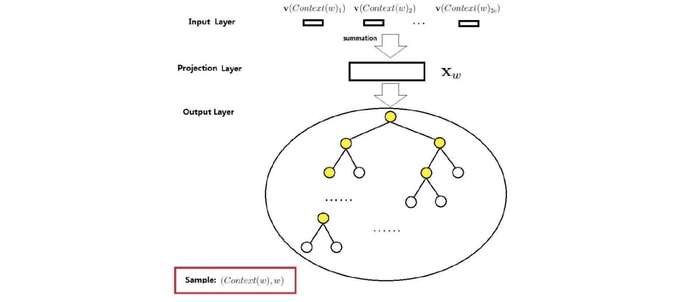
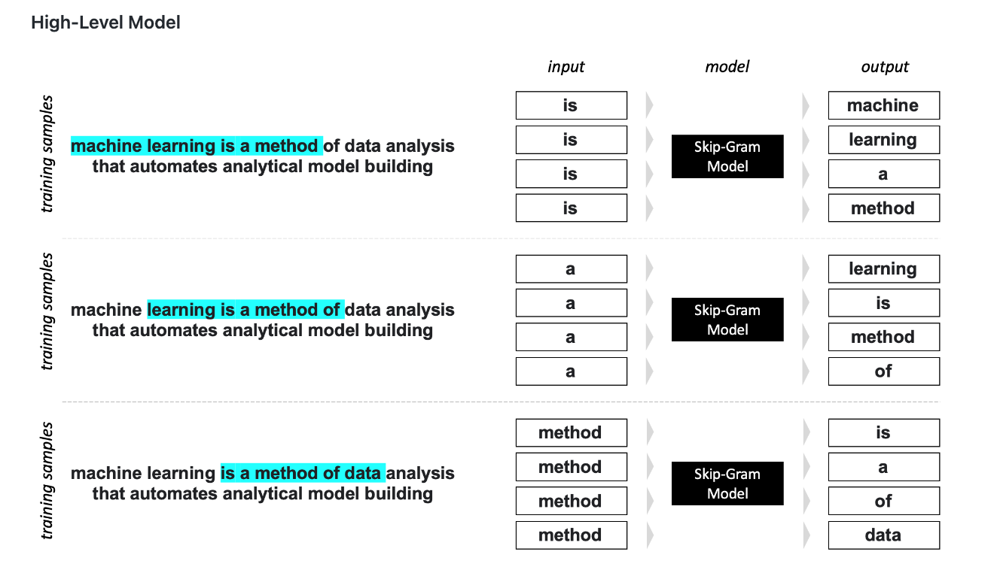

<style>
details {
    border: 1px solid #aaa;
    border-radius: 4px;
    padding: .5em .5em 0;
}
summary {
    font-weight: bold;
    margin: -.5em -.5em 0;
    padding: .5em;
}
details[open] {
    padding: .5em;
}
details[open] summary {
    border-bottom: 1px solid #aaa;
    margin-bottom: .5em;
}
img {
    pointer-events: none;
}
</style>

<details><summary>目录</summary><p>

- [语言模型基础](#语言模型基础)
  - [最小语义单位 Token 与 Embedding](#最小语义单位-token-与-embedding)
    - [Token](#token)
    - [Bag Of Words](#bag-of-words)
    - [Embedding](#embedding)
  - [语言模型](#语言模型)
    - [贪心搜索和集束搜索](#贪心搜索和集束搜索)
    - [简单语言模型-N-Gram](#简单语言模型-n-gram)
    - [复杂语言模型-RNN](#复杂语言模型-rnn)
    - [最强表示架构-Transformer](#最强表示架构-transformer)
    - [NLP 任务](#nlp-任务)
    - [生成语言模型-GPT](#生成语言模型-gpt)
    - [利器强化学习-RLHF](#利器强化学习-rlhf)
      - [衡量好坏](#衡量好坏)
- [词汇表征](#词汇表征)
  - [文本向量化简介](#文本向量化简介)
  - [文本向量化方法](#文本向量化方法)
    - [离散表示](#离散表示)
    - [分布式表示](#分布式表示)
  - [文本向量化流程](#文本向量化流程)
- [词袋模型-Bag of Words](#词袋模型-bag-of-words)
  - [词集模型: One-Hot 表征](#词集模型-one-hot-表征)
    - [One-Hot 算法简介](#one-hot-算法简介)
    - [One-Hot 的优缺点](#one-hot-的优缺点)
    - [One-Hot 算法示例](#one-hot-算法示例)
    - [One-Hot 算法实现](#one-hot-算法实现)
  - [词袋模型](#词袋模型)
    - [词袋模型算法](#词袋模型算法)
    - [词袋模型示例](#词袋模型示例)
    - [词袋模型优缺点](#词袋模型优缺点)
    - [词袋模型实现](#词袋模型实现)
  - [Bi-gram 和 N-gram](#bi-gram-和-n-gram)
    - [Bi-gram 和 N-gram 算法简介](#bi-gram-和-n-gram-算法简介)
    - [Bi-gram 和 N-gram 算法示例](#bi-gram-和-n-gram-算法示例)
    - [Bi-gram 和 N-gram 优缺点](#bi-gram-和-n-gram-优缺点)
    - [Bi-gram 和 N-gram 算法实现](#bi-gram-和-n-gram-算法实现)
  - [TF-IDF](#tf-idf)
    - [TF-IDF 算法简介](#tf-idf-算法简介)
    - [TF-IDF 算法示例](#tf-idf-算法示例)
    - [TF-IDF 算法优缺点](#tf-idf-算法优缺点)
    - [TF-IDF 算法实现](#tf-idf-算法实现)
  - [共现矩阵](#共现矩阵)
    - [共现矩阵算法简介](#共现矩阵算法简介)
    - [共现矩阵算法示例](#共现矩阵算法示例)
    - [共现矩阵算法实现](#共现矩阵算法实现)
  - [Count Vector](#count-vector)
    - [Count Vector 算法简介](#count-vector-算法简介)
    - [Count Vector 算法示例](#count-vector-算法示例)
    - [Count Vector 算法实现](#count-vector-算法实现)
- [词嵌入-Word Embedding](#词嵌入-word-embedding)
  - [神经网络语言模型](#神经网络语言模型)
    - [NNLM 模型简介](#nnlm-模型简介)
    - [NNLM 模型解释](#nnlm-模型解释)
  - [Word2Vec](#word2vec)
    - [Word2Vec 简介](#word2vec-简介)
    - [Word2Vec 核心思想](#word2vec-核心思想)
    - [Word2Vec 优点](#word2vec-优点)
    - [Word2Vec 语言模型](#word2vec-语言模型)
    - [Word2Vec 工具](#word2vec-工具)
      - [Word2Vec 版本](#word2vec-版本)
      - [Gensim Word2Vec 示例](#gensim-word2vec-示例)
      - [训练一个 Word2Vec 词向量模型](#训练一个-word2vec-词向量模型)
  - [CBOW](#cbow)
    - [CBOW 模型概述](#cbow-模型概述)
    - [CBOW 模型简介](#cbow-模型简介)
    - [CBOW 模型解释](#cbow-模型解释)
  - [Word Embedding 模型](#word-embedding-模型)
    - [霍夫曼树](#霍夫曼树)
    - [层级 Softmax](#层级-softmax)
    - [负例采样](#负例采样)
  - [Skip-gram](#skip-gram)
    - [Skip-gram 模型概述](#skip-gram-模型概述)
    - [Skip-gram 简介](#skip-gram-简介)
    - [Skip-gram 模型解释](#skip-gram-模型解释)
  - [GloVe](#glove)
    - [GloVe 词向量简介](#glove-词向量简介)
    - [GloVe vs Word2Vec](#glove-vs-word2vec)
  - [fasttext](#fasttext)
    - [fasttext 算法简介](#fasttext-算法简介)
    - [fasttext 算法实现](#fasttext-算法实现)
- [参考](#参考)
</p></details><p></p>

# 语言模型基础

## 最小语义单位 Token 与 Embedding

### Token

首先，解释一下如何将自然语言文本表示成计算机所能识别的数字。对于一段文本来说，
要做的首先就是把它变成一个个 **Token**。可以将 Token 理解为一小块，可以是一个字，
也可以是两个字的词，或三个字的词。也就是说，给定一个句子，有多种获取不同 Token 的方式，
可以分词，也可以分字。

英文现在都使用 **子词**，子词把不在 **词表** 里的词或不常见的词拆成比较常见的片段。比如单词 `annoyingly` 会被拆分成如下两个子词，`"annoying"` 表示比较常见的片段，
`"##"` 表示和前一个 Token 是直接拼接的，没有空格。中文现在基本使用 **字+词** 的方式。

```python
["annoying", "##ly"]
```

这里不直接解释为什么这么做，但可以想一下完全的字或词的效果，
拿英文举例更直观。如果只用 26 个英文字母（词表），虽然词表很小（加上各种符号可能也就 100 多个），
但粒度太细，每个 Token（即每个字母）几乎没法表示语义；如果用词，这个粒度又有点太大，
词表很难覆盖所有词。而子词可以同时兼顾词表大小和语义表示，是一种折中的做法。中文稍微简单一些，
就是字+词，字能独立表示意义，比如“是”、“有”、“爱”；词是由一个以上的字组成的语义单位，
一般来说，把词拆开可能会丢失语义，比如“长城”、“情比金坚”。
当然，中文如果非要拆成一个个字也不是不可以，具体要看任务类型和效果。

### Bag Of Words

> 词袋模型，Bag Of Words(BOW)

当句子能够表示成一个个 Token 时，就可以用数字来表示这个句子了，
最简单的方法就是将每个 Token 用一个数字来表示，但考虑这个数字的大小其实和 Token 本身没有关系，
这种单调的表达方式其实只是一种字面量的转换，并不能表示丰富的语言信息。

因为已经有了一个预先设计好的词表，那么是不是可以用 **词表中的每个 Token 是否在句子中出现** 来表示？
如果句子中包含某个 Token，对应位置为 1，否则为 0，
这样每句话都可以表示成长度（长度等于词表大小）相同的 1 和 0 组成的数组。
更进一步地，还可以将 “是否出现” 改成 “频率” 以凸显高频词。

事实上，在很长一段时间里，在 NLP 任务中自然语言都是用这种方法表示的，它有个名字，
叫做 **词袋模型(Bag Of Words, BOW)**。从名字来看，词袋模型就像一个大袋子，
能把所有的词都装进来。文本中的每个词都被看作独立的。忽略词之间的顺序和语法，
只关注词出现的次数。在词袋模型中，每个文本（句子）可以表示为一个向量，向量的每个维度对应一个词，
维度的值表示这个词在文本中出现的次数。这种表示方法如下表所示，
每一列表示一个 Token，每一行表示一个文本（句子），每个文本（句子）可以表示成一个长度（就是词表大小）固定的向量，
比如第一个句子可以表示为 `$[3, 1, 1, 0, 1, 1, 0, \cdots]$`。

|              | 爱 | 不 | 对 | 古琴 | 你 | 完 | 我 | ..... |
|--------------|----|----|----|----|----|----|----|------------|
| 对你爱爱爱不完 | 3 | 1 | 1 | 0 | 1 | 1 | 0 | |
| 我爱你        | 1 | 0 | 0 | 0 | 1 | 0 | 1 | |

这里的词表是按照拼音排序的，但这个顺序其实不重要（思考一下为什么）。
另外，注意这里只显示了 7 列，也就是词表中的 7 个 Token，但实际上，
词表中的 Token 一般都在 “万” 这个级别。所以，上表中的省略号实际上省略了上万个 Token。

### Embedding

> 词向量, Word Vector
> 
> 词嵌入, Word Embedding

词袋模型中对文本的表示法很好，不过有两个比较明显的问题：

1. 由于词表一般比较大，导致向量维度比较高，并且比较稀疏（大量的 0），计算起来不太方便；
2. 由于忽略了 Token 之间的顺序，导致部分语义丢失。比如“你爱我”和“我爱你”的向量表示一模一样，
   但其实意思不一样。
   
于是，**词向量(词嵌入)** 出现了，它是一种稠密表示方法。简单来说，
一个 Token 可以表示成一定数量的小数（一般可以是任意多个，
专业叫法是 **词向量维度**，根据所用的模型和设定的参数而定），
一般数字越多，模型越大，表示能力越强。不过即使再大的模型，这个维度也会比词表小很多。
如下面的代码示例所示，每一行的若干（词向量维度）的小数就表示对应位置的 Token，
词向量维度常见的值有 200、300、768、1536 等。

```python
爱 [0.61048, 0.46032, 0.7194, 0.85409, 0.67275, 0.31967, 0.89993, ...]
不 [0.19444, 0.14302, 0.71669, 0.03330, 0.34856, 0.6991, 0.49111, ...]
对 [0.24061, 0.21402, 0.53269, 0.97005, 0.51619, 0.07808, 0.9278,...]
古琴 [0.21798, 0,62035, 0.09939, 0.93283, 0.24022, 0.91339, 0.6569,...]
你 [0.392, 0.13321, 0.00597, 0.74754, 0.45524, 0.23674, 0.7825,...]
完 [0.26508, 0.1003, 0.40059, 0.09404, 0.20121, 0.32476, 0.48591,...]
我 [0.07928, 0.37101, 0.94462, 0,87359, 0.59773, 0.13289, 0.22909,...]
... ...
```

这时候可能会有疑问：“句子该怎么表示？”这个问题非常关键，其实在深度 NLP(deep NLP)早期，
往往是对句子的所有词向量直接取平均（或者求和），最终得到一个和每个词向量同样大小的向量：**句子向量**。

这项工作最早要追溯到 Yoshua Bengio 等人于 2003 年发表的论文 "A neural probabilistic language model"，
他们在训练语言模型的同时，顺便得到了词向量这个副产品。不过，最终开始在实际中大规模应用，
则要追溯到 2013 年谷歌的 Tomas Mikolov 发布的 **Word2Vec**。借助 Word2Vec，
可以很容易地在大量语料中训练得到一个词向量模型。也是从那时开始，深度 NLP 逐渐崭露头角成为主流。

早期的词向量都是静态的，一旦训练完就固定不变了。随着 NLP 技术的不断发展，
词向量技术逐渐演变成 **基于语言模型的动态表示**。也就是说，当上下文不一样时，
同一个词的向量表示将变得不同。而且，句子的表示也不再是先拿到词向量再构造句子向量，
而是在模型架构设计上做了考虑。当输入句子时，模型经过一定计算后，就可以直接获得句子向量；
而且语言模型不仅可以表示词和句子，还可以表示任意文本。
**类似这种将任意文本（或其他非文本符号）表示成稠密向量的方法，统称 Embedding 表示技术**。
Embedding 表示技术可以说是 NLP 领域（其实也包括图像、语音、推荐等领域）最基础的技术，
后面的深度学习模型都基于此。甚至可以稍微夸张点说，深度学习的发展就是 Embedding 表示技术的不断发展。

## 语言模型

语言模型（Language Model, LM）简单来说，就是利用自然语言构建的模型。
自然语言就是我们日常生活、学习和工作中常用的文字。语言模型就是利用自然语言文本构成的，
根据给定文本，输出对应文本的模型。

### 贪心搜索和集束搜索

语言模型具体是如何根据给定文本输出对应文本的呢？方法有很多种，比如我们写好一个模板：“XX 喜欢 YY”。
如果 XX 是 我，YY 是你，那就是 “我喜欢你”，反过来就是 “你喜欢我”。
我们这里重点要说的是 **概率语言模型**，它的核心是概率，准确来说是下一个 Token 的概率。
这种语言模型的过程就是通过已有的 Token 预测接下来的 Token。举个简单的例子，
比如你只告诉模型“我喜欢你”这句话，当你输入“我”的时候，它就已经知道你接下来要输入“喜欢”了。
为什么？因为它的“脑子”力就只有这 4 个字。

接下来升级一下。假设我们给了模型很多资料，多到现在网上所能找到的资料都给了它。
这时候你再输入 “我”，此时它大概不会说 “喜欢” 了。为什么呢？因为见到了更多不同的文本，
它的“脑子”里已经不只有 “我喜欢你” 这 4 个字了。不过，如果我们考虑的是最大概率，也就是说，
每次都只选择下一个最大概率的 Token，那么对于同样的给定输入，
我们依然会得到相同的对应输出（可能还是 “喜欢你”，也可能不是，具体要看给的语料）。
对于这样的结果，语言模型看起来比较 “呆”。我们把这种方法叫作 **贪心搜索(greedy search)**，
因为它只往后看一个词，只考虑下一步最大概率的词！

为了让生成的结果更加多样和丰富，语言模型都会在这个地方执行一些策略。比如让模型每一步多看几个可能的词，
而不是就看概率最大的那个词。这样到下一步时，上一步最大概率的 Token，加上这一步的 Token，
路径概率（两步概率的乘积）可能就不是最大的了。上面介绍的这种叫作 **集束搜索(beam search)**，简单来说，
就是一步多看几个词，看最终句子（比如生成到句号、感叹号或其他停止符号）的概率。
看得越多，越不容易生成固定的文本。

### 简单语言模型-N-Gram

上面介绍的两种不同搜索方法（贪心搜索和集束搜索）也叫 **解码策略**。
当时更多被研究的还是模型本身，我们经历了从简答模型到复杂模型，
再到巨大模型的变迁过程。

简单模型就是就是把一句话拆成一个个 Token，然后统计概率，
这类模型有个典型代表：**N-Gram 模型**，它也是最简单的语言模型。
这里的 `$N$` 表示每次用到的上下文 Token 数。N-Gram 模型中的 `$N$` 通常等于 2 或 3，
等于 2 的叫 Bi-Gram，等于 3 的叫 Tri-Gram。Bi-Gram 和 Tri-Gram 的区别是，
前者的下一个 Token 是根据上一个 Token 来的，而后者的下一个 Token 是根据前两个 Token 来的。
在 N-Gram 模型中，Token 的表示是离散的，实际上就是词表中的一个单词。这种表示方式比较简单，
再加上 `$N$` 不能太大，导致难以学到丰富的上下文指示。事实上，它并没有用到深度学习和神经网络，
只是一些统计出来的概率值。假设 “人工智能/让” 出现了 5 次，“人工智能/是” 出现了 3 次，
将它们出现的频率除以所有的 Gram 数就是概率。

训练 N-Gram 模型的过程其实是统计频率的过程。如果给定 “人工智能”，
N-Gram 模型就会找基于 “人工智能” 下个最大概率的词，
然后输出“人工智能让”。接下来就是给定“让”，继续往下走了。
当然，我们也可以用上面提到的不同解码策略（贪心搜索和集束搜索）往下走。

接下来，让每个 Token 成为一个 Embedding 向量。简单解释一下在这种情况下怎么预测下一个 Token。
其实还是计算概率，但这次和刚才的稍微有点不一样。**在刚才离散的情况下，
用统计出来的对应 Gram 数除以 Gram 总数就是出现概率。但是稠密向量要稍微换个方式，
也就是说，给你一个 `$d$` 维的向量（某个给定的 Token），你最后要输出一个长度为 `$N$` 的向量，
`$N$` 是词表大小，其中的每一个值都是一个概率值，表示下一个 Token 出现的概率，概率值加起来为 1。**
按照贪心搜索解码策略，下一个 Token 就是概率最大的那个。写成简答的计算表达式如下：

```python
# d 维，加起来和 1 没关系，大小是 1xd，表示给定的 Token
X = [0.001, 0.002, 0.0052, ..., 0.0341]
# N 个，加起来为 1，大小是 1xN，表示下一个 Token 就是每个 Token 出现的概率
Y = [0.1, 0.5, ..., 0.005, 0.3]
# W 是模型参数，也可以叫作模型
X · W = Y
```

上面的 `$W$` 就是模型参数，其实 `$X$` 也可以被看作模型参数（自动学习到的）。
因为我们知道了输入和输出的大小，所以中间其实可以经过任意的计算，
也就是说，`$W$` 可以包含很多运算。总之各种张量（三维以上数组）运算，
只要保证最后的输出形式不变就行。各种不同的计算方式就意味着各种不同的模型。

### 复杂语言模型-RNN

在深度学习早期，最著名的语言模型就是使用 **[循环神经网络（recurrent neural network, RNN）](https://wangzhefeng.com/note/2022/07/15/dl-rnn/)** 训练的，
RNN 是一种比 N-Gram 模型复杂得多的模型。RNN 与其他神经网络的不同之处在于，RNN 的节点之间存在循环连接，
这使得它能够记住之前的信息，并将它们应用于当前的输入。这种记忆能力使得 RNN 在处理时间序列数据时特别有用，
例如预测未来的时间序列数据、进行自然语言的处理等。通俗地讲，RNN 就像具有记忆能力的人，
它可以根据之前的经验和知识对当前的情况做出反应，并预测未来的发展趋势。

RNN 结构如下所示。在下图中，右边是左边的展开，`$A$` 就是参数，`$x$` 是输入，`$h$` 是输出。
注意，`$h$` 并不是输出的概率，而是隐向量。如果需要概率，可以再对 `$h$` 执行张量运算，
归一化到整个词表即可。


自然语言是一个 Token 接着一个 Token(Token by Token) 的，从而形成一个序列。
要解释参数是怎么学习的，就要稍微解释一下学习（训练）过程。

下图是语言模型学习（训练）时的输入输出。第一行就是输入 `$X$`，第二行就是输出 `$Y$`，
`SOS`(start of sentence) 表示句子开始，`EOS`(end of sentence) 表示句子结束。：


RNN 模型：

```python
import torch
import torch.nn as nn

# RNN 模型
rnn = nn.RNN(32, 64)
# 输入
input_tensor = torch.randn(4, 32)  
# 初始隐向量
h0 = torch.randn(1, 64)
# 输出
output, hn = rnn(input_tensor, h0)

print(output.shape)
print(hn.shape)
```

```
(torch.Size([4, 64]), torch.Size([1, 64]))
```

上面的 RNN 模型 `rnn` 中：

* 输入 `input_tensor` 是一个 `$4 \times 32$` 的向量，换句话说，输入是 4 个 Token，
  维度 `$d = 32$`
    - `in_token1: [t1, t2, ..., t32]`
    - `in_token2: [t1, t2, ..., t32]`
    - `in_token3: [t1, t2, ..., t32]`
    - `in_token4: [t1, t2, ..., t32]`
* `h0` 就是随机初始化的输出，也就是 4 个 Token 中的第一个 Token 的输出
    - `out_token1: [ot1, ot2, ..., ot64]`
* `output` 的 4 个 64 维的向量分别表示 4 个输出
    - `output1: [o1, o2, ..., o64]`   
    - `output2: [o1, o2, ..., o64]` 
    - `output3: [o1, o2, ..., o64]`
    - `output4: [o1, o2, ..., o64]`
* `hn` 就是最后一个 Token 的输出（它和 `output` 的最后一个 64 维向量是一样的），
  也可以看成整个句子的表示
    - `hn(output4): [o1, o2, ..., o64]`

注意，这里的 `output` 和 上图中的 `$Y$` 还没有关系。如果要输出词的概率，就需要先扩充到词表大小，
再进行归一化。 

```python
# 假设词表大小 N = 1000
wo = torch.randn(64, 1000)
# 得到 4x1000 的概率矩阵，每一行概率和为 1
probs = nn.Softmax(dim = 1)(output @ wo)

print(probs.shape)
print(probs.sum(dim = 1))
```

```
torch.Size([4, 1000])
tensor([1.0000, 1.0000, 1.0000, 1.0000]), grad_func=<SumBackward>
```

这里的 `probs` 的每一行就是词表大小的概率分布，概率和为 1，
意思是根据当前 Token 生成下 Token 的概率，下一个 Token 有可能是词表中的任意一个 Token。
但它们的概率和一定为 1。因为我们知道接下来每个位置的 Token 是什么（也就是上图中的输出 `$Y$`）。
这里得到最大概率的那个 Token，如果正好是这个 Token，则说明预测对了，参数就不用怎么调整；
反之，模型就会调整前面的参数（`rnn`、`input_tensor`、`h0` 和 `wo`）。
你可能会疑惑为什么 `input` 也是参数，其实前面我们偷懒了，本来的参数是一个 1000×32 的大矩阵，
但我们使用了 4 个 Token 对应位置的向量。这个 1000x32 的大矩阵其实就是词向量（每个词一行），
开始时全部随机初始化，然后通过训练调整参数。训练完成后，这些参数就不变了，
然后就可以用前面同样的步骤来预测了，也就是给定一个 Token，预测下一个 Token。
如果使用贪心搜索，则每次给定同样的 Token 时，生成的结果就一样。其余的就和前面讲的接上了。
随着深度学习的不断发展，出现了更多比 RNN 还复杂的网络结构，而且模型变得更大，参数更多，但逻辑和方法是一样的。

语言模型就介绍到这里。简单直观地说，构建（训练）语言模型的过程就是学习词、
句内在的“语言关系”；而推理（预测）就是在给定上下文后，
让构建好的模型根据不同的解码策略输出对应的文本。无论是训练还是预测，都以 Token 为粒度进行。

### 最强表示架构-Transformer

**[Transformer]() 是一个基于注意力机制的编码器-解码器(encoder-decoder)架构**，刚开始主要应用在 NLP 领域，
后来横跨到语音和图像领域，并最终统一几乎所有模态（文本、图像、语音）的架构。
Transformer 来自 Google 在 2017 年发表的一篇论文 “Attention Is All You Need”，
其最重要的核心就是提出来的 **自注意力(self-attention)机制**。
简单来说，就是在语言模型构建的过程中，把注意力放在那些重要的 Token 上。

Transformer 简单来说，就是先把输入映射到编码器(encoder)，这里可以把编码器想象成 RNN，
解码器(decoder)也可以想象成 RNN。这样，左边负责编码，右边则负责解码。这里不同的是，
左边因为我们是知道数据的，所以在建模时可以同时利用当前 Token 的历史 Token 和未来 Token；
但在解码时，因为是一个个 Token 输出来的，所以只能根据历史 Token 以及编码器的 Token 表示进行建模，
而不能利用未来 Token。

Transformer 的这种架构从更普遍的角度来看，其实是 **[Seq2Seq(sequence to sequence)架构]()**，
简单来说就是序列到序列的架构：输入是一个文本序列，输出是另一个文本序列。翻译就是一个很好的例子，比如：


编码器和解码器可以采用 RNN，编码器这一侧的每个 Token 都可以输出一个向量表示，
而这些所有 Token 的输出向量都可以在处理后作为整句话的表示。说到这里，**整句话又怎么表示呢？**
对于 RNN 这种结构，可以把最后一个 Token 的输出作为整个句子的表示。
当然，很符合直觉的是也可以取每个词向量的平均值。除了平均值，也可以求和、取最大值等。
现在重点来了，看解码的过程，其实解码器在生成每一个 Token 时都用到了编码器中每一个 Token 信息，
以及已经生成的那些 Token 的信息。前面这种关注编码器中每个 Token 的信息的机制就是 **注意力(attention)机制**。
直观的解释，就是当生成单词 “power” 时，“力量” 两个字会被赋予更多权重（注意力），其他情况也类似。

Transformer 的整体结构如下：


如上图所示，左边是编码器，一共有 `$N$` 个；右边是解码器，也有 `$N$` 个。
为简单起见，可以假设 `$N = 1$`，如此一来，上图左边就是一个编码器，右边则是一个解码器。
也可以把它们想象成一个 RNN，这样有助于从宏观上把握。Transformer 用到的东西其实和 RNN 并没有关系。
Transformer 主要用了两个模块：**多头注意力(multi-head attention)** 和 **前馈(feedforward)网络**。

对于**多头注意力**，不妨回顾一下 Seq2Seq 架构的注意力机制，
它是解码器中的 Token 和编码器中每一个 Token 的重要性权重。
多头注意力中用到了自注意力(self-attention)，自注意力和刚刚讲的注意力非常类似，
只不过自注意力是自己的每一个 Token 之间的重要性权重。简单来说，就是 “一句话到底哪里重要”。
自注意力机制可以说是 Transformer 的精髓，无论是 ChatGPT 还是其他非文本的大语言模型，都用到了它，
它可以说是真正地 “一统江湖”。**多头(multi-head)** 简单来说，就是把刚刚的这种自己注意自己重复多次，
每个头注意到的信息不一样，这样就可以捕获到更多信息。比如我们前面提到过的一句话：“人工智能让世界变得更美好”，
有的头 “人工智能” 注意到 “世界”，有的头 “人工智能” 注意到 “美好”...这样看起来更加符合直觉。

**前馈网络**主要引入非线性变换，帮助模型学习更加复杂的语言特征和模式。

另外，有个地方要特别注意，解码器的淡黄色模块内有一个 **遮盖多头注意力(masked multi-head attention)**，
它和多头注意力的区别就是遮盖(mask)了未来 Token。以上述翻译为例，
当给定 “Knowledge” 生成下一个 Token 时，模型当然不知道下一个 Token 就是 “is”。
在学习（训练）过程中，下一个 Token 是 “is”，这是训练数据里的，
模型输出什么要看 Token 最大概率是不是在 “is” 这个 Token 上，
如果不在，参数就得更新。

### NLP 任务

实际上，大多数 NLP 任务并不是 Seq2Seq 架构的，最常见的任务主要包括如下几种：
**句子分类**、**Token 分类（也叫序列标注）**、**相似匹配** 和 **文本生成**，前三种应用得最为广泛。
这时候，编码器和解码器就可以拆开用了。左边的编码器在把句子表示成一个向量时，
可以利用上下文信息，也就是说，可以把它看作双向的；右边的解码器不能看到未来 Token，
一般只利用上文信息，是单间的。虽然它们都可以用来完成刚才提到的几种任务，
但从效果上来说，编码器更适合非生成类任务，解码器则更适合生成类任务。在 NLP 领域，
一般也会把它们分别叫作 **自然语言理解（natural language understanding, NLU）任务**和 **自然语言生成（natural language generation, NLG）任务**。

首先介绍 **NLU 任务**。**句子分类** 是指给定一个句子，输出一个类别。因为句子可以表示为一个向量，
所以经过张量运算后，自然可以映射到每个类别的概率分布。这和前面提到过的语言模型的做法没有本质上的区别，
只不过语言模型的类别是整个词表大小，而分类的类别则要看具体的任务，有二分类、多分类、多标签分类等。
**Token 分类** 是指给定一个句子，给其中的每个 Token 输出一个类别。这和语言模型就更像了，
只不过把下一个 Token 换成了对应的类别，
比如命名实体抽取就是把句子中的实体（人名、地名、作品等你所关注的词，一般是名词）提取出来。
如果以地名（location, LOC）举例的话，对应的类别是这样的：B-LOC（begin of LOC）表示实体开始、
I-LOC（inside of LOC）表示实体中间。举个例子：“中国的首都是北京”。注意此时的 Token 是字，
每个 Token 对应的类别为 “B-LOC、I-LOC、O、O、O、O、B-LOC、I-LOC”，O表示 Other。
对于分类任务，类别一般也叫作标签。相似匹配一般指给定两个句子，输出它们是否相似，
其实可以将其看作特殊的分类任务。

接下来介绍 **NLG 任务**。除 **文本续写** 外，
其他常见的 NLG 任务还有 **文本摘要**、**机器翻译**、**文本改写**、**文本纠错**等。
这里 Seq2Seq 架构就比较常见了，体现了一种先理解再输出的思路。
而纯生成类任务，比如写诗、写歌词、写小说，则几乎是纯解码器架构。
此类任务稍微麻烦的是如何做自动评测，文本摘要、机器翻译、文本改写、
文本纠错等任务一般都会提供参考答案（reference），
可以评估模型输出和参考答案之间的重叠程度或相似程度，
但纯生成类任务就有点麻烦，这个好不好有时候其实很难衡量。
不过，针对有具体目标的任务（如任务型聊天机器人的回复生成），
还可以设计一些诸如“是否完成任务”、“是否达到目标”的评测力法。
但对于没有具体目标的任务（比如闲聊），评测起来就见仁见智了，
很多时候还得靠人工进行评测。

Transformer 基于 Seg2Seq 架构，可以同时处理 NLU 和 NLG 任务，
而且这种自注意力机制的特征提取能力（表示能力）很强。
其结果就是 NLP 取得了阶段性的突破，深度学习开始进入 **微调模型** 时代，
大概的做法就是，拿着一个开源的预训练模型，在自己的数据上微调一下，让它能够完成特定的任务。
这个开源的预训练模型往往就是一个语言模型，
在大量语料中，使用我们前面所讲的语言模型的训练方法训练而来。

* 偏 NLU 领域的第一个成果是谷歌公司的 BERT，
  相信不少人即便不是这个行业的也大概听过。BERT 就是使用了 Transformer 的编码器（没有使用解码器），
  有 12 个 Block（淡黄色模块，每一个 Block 也可以叫作一层）和 1 亿多个参数。
  BERT 不预测下一个 Token，而是随机地把 15% 的 Token 盖住（其中 80% 用 `[MASK]`替换，10% 保持不变，
  10% 随机替换为其他 Token），然后利用其他没盖住的 Token 来预测盖住位置的 Token。
  这其实和根据上文信息预测下一个 Token 是类似的，所不同的是它可以利用下文信息。
* 偏 NLG 领域的第一个成果是 OpenAI 的 GPT，GPT 就是使用了 Transtormer 的解码器（没有使用编码器），
  参数和 BERT 差不多。BERT 和 GPT 都发布于 2018 年，然后分别走上了不同的道路。

### 生成语言模型-GPT

GPT，就是 ChatGPT 中的那个 GPT，中文叫作生成式预训练 Transformer。
生成式的意思就是类似于语言模型那样，一个 Token 一个 Token 地生成文本，
也就是上面提到的解码器的原理。预训练刚刚也提过了，就是在大量语料中训练语言模型。
GPT 模型从 GPT-1 到 GPT-4，一共经历了 5 个版本，中间的 ChatGPT 是 3.5 版。
GPT-1、GPT-2 和 GPT-33 都是有论文发表的，接下来分别介绍它们的基本思想。
ChatGPT 没有论文发表，不过它的姐妹版本 InstructGPT 有论文发表，
GPT-4 也没有论文发表，只有技术报告，不过里面并没有技术细节。
因此，我们对 GPT-4 不做介绍，读者可以将其看作能力更强的 ChatGPT 升级版。

GPT-1 和 BERT 一样，用的是下游任务微调模式，也就是在不同下游任务数据上微调与训练模型。
下图是 GPT-1 基本结构和下游任务微调模式(摘自 GPT-1 论文 “Improving Language Understanding by Generative Pre-Train”)：


上图左边的 GPT-1 基本结构，在前面已经介绍过了，用的是 Transformer 的解码器，
不过这里因为没有编码器，所以不需要有和编码器交互的多头注意力模块。现在重点看看上图的右边，
这是 GPT-1 在各种下游任务上的处理流程。简单来说，就是针对不同的任务构造不同的输入序列，
然后丢给 GPT-1 获取 Token 或句子的 Embedding 表示，再通过 Linear+Softmax 输出结果。
Linear 是一种最基础的网络结构，也就是线性映射，这里用于维度转换，转为输出需要的大小。
Softmax 主要用来把输出映射到概率分布（概率和为 1）。这种拼接输人的方法在当时非常流行，
紧跟其后的 BERT 也使用类似的方式，并引领了一个时代，
直至 ChatGPT 的出现让我们进人大语言模型时代（不过，针对很多传统 NLP 任务 BERT 依然具备优势）。
统一的处理方法能够减小不同任务对模型的适配难度。因此不管什么任务，都想方设法将其变成一个序列就行，
相似匹配就是把两句话直接拼接起来，预测它们是否相似（输出标签为 1 或 0）。

GPT-1 的这篇论文还有几个点在当时看起来可能没什么感觉，现在回看却有点意思。

* 第一，预训练模型中的每一层（上图中的淡黄色模块）都包含用于解决目标任务的有用功能，
  多层（意味着模型更深）有更多能力；
* 第二，随着参数的增加，零样本获得更好的性能。简单总结就是，模型大了不仅能学到更多知识，
  有助于解决下游任务，还表现出了零样本能力。这里的零样本（zero-shot）是指直接给模型输入任务，
  让它输出任务结果。与此类似的还有少样本（few shot）和单样本（one-shot），
  即给模型提供一些（或一个）示例，然后给出任务，让它输出任务结果。

有了上面的结论，你是不是想看看更多层（更多参数）的表现如何？于是半年后，GPT-2 来了，
参数量从 GPT-1 的 1.1 亿增加到了 15 亿，增长了十几倍。更有意思的是，
GPT-I 的博客文章 "Improving language understanding withunsupervised leaming” 中有一个 “未来工作列表”，
排在第一位的就是扩大规模，还有两个分别是提升微调，以及更好地理解为什么生成式预训练能提升 NLU 能力。

GPT-1 发布于 2018 年 6 月，GPT-2 发布于 2019 年 2 月，GPT-2 是 GPT-1 的升级版，
主要在两个方血过行过一些研究：首先是扩大规模，然后是零样本。
如果说 GPT-1 是观察到了 “规模大、能力强的零样本” 这个现象，
那么 GPT-2 就是进一步研究这个现象。其结果自然是，模型越来越大，参数越来越多，能力越来越强。
GPT-2 进一步验证了 GPT-1 的想法，下一步要做的就是继续扩大规模。

不过且慢，在此之前，我们不妨看一下 GPT-2 中的 Token 生成策略，也就是生成下一个 Token 的方法。
前面介绍过比较优秀的集束搜索，不过它有两个比较明显的问题：第一是生成的内容容易重复，
第二是高质量的文本和高概率并不一定相关（有时甚至完全没有关系）。
简单来看，这两个问题其实可以归结为一个问题：生成的内容依然确定性太大。
人们更希望有“不一样”的内容，而不是完全可预测的内容，比如张爱玲说过，“孤独的人有他们自己的泥沼”，
这种独一无二的文字用高概率的词大概率是得不到的。

现在，我们介绍一种基于采样的方法，简单来说，就是根据当前上下文得到的概率分布采样下一个 Token。
这里可以用一个温度（temperature） 参数调𤨣输出的服率分布，参数值越大，
分布看起就越平滑，也就是说。高概率和低概率的差距变小了（对输出不那么确定）；
当然，这个参数值越小的话，高概率和低概率的差距就会更明显（对输出比较确定）；
如果这个参数值趋近于 0，那就和贪心搜索一样了。请看下面的代码示例：

```python
import numpy as np

np.random.seed(42)
logits = np.random.random((2, 4))
logits /= temperature
scores = np.exp(logits)
probs = scores / np.sum(scores, axis = 1, keepdims = True)
```

让温度参数分别取 0.1 和 0.9，结果如下：

```python
# temperature = 0.1
array([[0.003, 0.873, 0.098, 0.026], 
       [0.001, 0.001, 0.000, 0.998]])

# temperature = 0.9
array([[0.176, 0.335, 0.262, 0.226], 
       [0.196, 0.196, 0.176, 0.432]])
```

以第一行为例，当温度为 0.1 时，概率最大值为 0.873；当温度为 0.9 时，
概率最大值依然在同样位置（这是必然的），但值变次 0.335。
而且，你也可以很明显地看出来，当温度为 0.9 时，4 个数字看起来更加接近。

还有一个重复惩罚参数（repetition_penalty），它可以在一定程度上避免生成重复的 Token。
它和温度参数类似，只不过是将温度放到了“已生成的 Token”上。也就是说，如果有 Token 之前已经生成过了，
我们就会在生成下一个 Token 时对那些已生成的 Token 的分数进行平滑，让它们的概率不那么大。
所以，这个参数值越大，越有可能生成和之前不重复的 Token。

除了这些技巧，2018 年的一篇论文 “Hierarchical Neural Story Generation” 另外介绍了一种新的采样方案，
它很简单也很有效果，它就是 GPT-2 里使用到的 Top-K 采样。
简单来说，就是在选择下一个 Token 时，从 Top-K（根据概率从大到小的的 K）个 Token 里面选。
这种采样方案不错，不过还有个小间题，就是 Top-K 采样其实是一种硬截断。
根本不管第 K 个概率是高还是低。在极端情况下，如果某个词的概率是 0.99（剩下的所有词加起来才 0.01），
K 稍微大一点就必然会囊括进来一些概率很低的词。这会导致生成的内容不连贯。

于是，2019 年的一篇论文 “The Curious Case of Neural Text Degeneration” 提出了另一种采样方案——Top-P 采样，
GPT-2 里也有用到这种采样方案。这种买样方案是从累积概率超过 P 的词里进行选择。
这样，对于概率分布比较均匀的情况，可选的词就会多一些（可能几十个词的概率和才会超过 P）；
对于概率分布不均匀的情况，可选的词就会少一些（可能两三个词的概率和就超过了 P）。

Top-P 采样看起来更优雅一些，两者也可以结合使用。不过在大部分情况下，
当我们需要调参数的时候，调一个参数就好，包括前面的温度参数。
如果要调多个参数，请确保理解每个参数的作用。最后需要说明的是，
任何一种采样方案都不能 100% 保证每一次生成的效果都很好，
也没办法完全避免生成重复的句子，也没有任何一种采样方案在任何场景下都适用。
读者在使用时需要根据实际情况多尝试，选出效果最好的配置。不过，
建议读者从官方给的默认参数开始尝试。

GPT-3 发布于 2020 年 7 月，这在当时也是个大新闻，
因为它的参数已经达到其他任何模型在当时都望尘莫及的量级——1750 亿，
是 GPT-2 的 100 多倍，没有开源。GPT-3 既然有零样本能力，
那能不能不微调呢？碰到一个任务就微调，这多麻烦。 
对于人来说，只要几个例子（少样本）和一些简单的说明，就可以处理任务了。
怎么办？GPT-2 不是进一步确认了零样本能力吗？继续加大参数量，于是就有了 GPT-3。
也就是说，各种任务来吧，不调参数，顶多就要几个例子（预计下一步连例子也不要了），
GPT-3 就能帮你完成它们。其实现在回头看，这篇论文是具有里程碑意义的，
因为它从根本上触动了原有的范式，而且是革命性的触动。关于这一点，
感兴趣的读者可以进一步阅读笔者的一篇文章《GPT-3 和它的 In-Context Leaming》。
现在回忆，1750 亿的参数量在当时看太大了，而且也太贵了（几百万美元），
一般的单位和个人根本负担不起。关于这一点，不光小部分人没意识到，
可能是除了 OpenAI 团队之外的整个世界都没意识到。

请看下图，横坐标是样本数量，纵坐标是精准度。下图提供了如下信息。

* x-shot（x 表示 zero、one、few）在不同参数规模下差别巨大，大语言型有超能力
* 在大语言模型下，单样本效果明显大幅提升，增加提示词会进一步提升效果
* 少样本的边际收益在递减。大概在 8 样本以下时，提示词作用明显，从单样本到 8 样本，
  提示词的效果提升幅度也在递减。当超过 10 样本提示词基本就没有作用了

总而言之，大语言模型具有 In-Context（上下文）学习能力，
这种能力使得它不需要针对不同任务再进行适应性训练（微调），
大语言模型用的就是它自己本身的理解力。这本来应该很让人震惊（甚至有一点惊恐），
不过大家可能都先被它的价格和规模震惊到了。接下来，
我们再直观地感受一下利用这种 In-Context 学习能力完成任务的方式，如下图所示。

下图右边的微调方式需要先根据训练样本更新模型参数，之后再进行预测。
下图左边的三种方式都利用了大语言模型(large language model, LLM)的 In-Context 学习能力，
不需要更新模型，而且看起来也都不复杂，只需要按照格式把输入构建好，
然后传给模型进行预测就可以了。这也是本书写作的初衷之——人工智能已经平民化，
只要有手（可能以后不用手也行），通过使用 LLM 就可以做出人工智能应用了。不过这里有一点需要说明，为了简便，
下图中的样本都比较简单，但实际中的样本一般是完整的句子。

使用 In-Context 学习能力和微调完成任务（摘自 GPT-3 论文 “Language Models are Few-Shot Learners”）：


最后值得一提的是 GPT-3 论文中的展望，在 GPT-3 论文的“局限”小节中、
作者提出了 GPT-3 目前的一些问题，其中有两点需要特别指出，
因为们是下一代 InstructGPT（也是 ChatGPT 的姐妹版）以及更高级版本的方向。

* 自监督训练（也就是语言模型一般的训练方法）范式已到极限，新的训练方法迫在眉睫。
  未来的方向包括：从人类那里学习目标函数、强化学习微调或多模态
* 不确定少样本是在推理时学习到新的任务，还是识别出来了在训练时学到的任务。
  最终，甚至不清楚人类从零开始学习与从之前的样本中学习分别学到了什么。
  准确理解少样本的工作原理是未来的一个方向

上面的第一点在下面就会提到，这里主要说说第二点。当我们给出一些示例（少样本）时，
我们还无法精准确定是在推理时“学习”到新任务的处理方法（在这种情况下，没有示例就没有能力；
这里的“学习”要打引号，因为它不调整参数），还是在训练时就已经具备了这个能力，
示例只是让它“回想”起之前学的东西。这里有点绕，拿人来举例，可能不太恰当，但能大致说明问题。
假设当你读到一首诗时，自己也诗兴大发写了一句诗。你说这句诗是因为你读到这首诗时“领悟”到的，
还是你本来就有这个积累（记忆），现在只是因为读这首诗而被激发出来？
这可能涉及大脑、思维、意识等领域知识，而人类至今也没有弄清楚它们的原理，
所以我们现在还不知道答案。

### 利器强化学习-RLHF

RLHF（reinforcement learning from human fecdback，从人类反馈中强化学习），听起来有点平淡无奇。
确实，RLHF 的思想非常朴素、简单，但它有着不可忽视的效果。刚刚我们已经提到了，
GPT-3 论文指出未来要找到新的训练方法，其中就包括从人类那里学习目标函数、强化学习微调、多模态等。
吋至今日，从 InstructGPT 到 ChatGPT，再到 GPT-4，人类正一步一步地实现这些新的训练方法。
这里有一点需要提醒，这些方向并不是一开始就清晰地摆在那里的，
中间还有非常多的探索和阶段性成果（既有 OpenAI 自己的研究，也有其他从业人员的研究）。
千万不要看到结果觉得平淡无奇，这中间的艰难探索永远值得尊敬。另外有时候即便知道了方法，
要做出来，还要做出效果来，也是非常有难度的。而且书只能介绍少部分内容，虽然整体结构比较完整，
但总体还是比较简单。总的来说，要做出来很有难度，不过我们如果只是用的话，如前所述，有手就行。

好了，言归正传，RLHF 被人熟知应该主要源自 OpenAI 的 InstructGPT 论文 "Training language models to follow instructions with human feedback", 更大范围的熟知就是 ChatGPT 的发布。因为后者没有论文发表，也没有开源，
所以我们也只能 “拿 InstructGPT 的管窥一窥 ChatGPT 的豹”。
当然，如果按照 ChatGPT 官方页面上的说法，ChatGPT 是 InstructGPT 的姐妹版，
那么这个“管”可能还比较粗。如果用简单的语言来描述 InstructGPT，
其实就是用强化学习的算法微调一个根据人类反馈来加以改进的语言模型，
重要的是还调出了效果——规模为 130 亿的 InstructGPT 堪比规模为 1750 亿的 GPT-3。

现在来看看具体是如何做的，RLHF 在其中又起了什么作用，以及如何起作用。
InstructGPT 的整个流程分为三个步骤（摘自 InstructGPT 
论文 “Training language models to follow instructions with human feedback”）：


* 步骤一：SFT（supervised fne-tuning，有监督微调）。顾名思义，
  SFT 是在有监督（有标注）数据上微调训练得到的。这里的有监督数据其实就是输人提示词，
  输出相应的回复，只不过这里的回复是人工编写的。这个工作要求比一般标注要高，其实算是一种创作。
* 步骤二：RM（reward model，奖励模型）。具体来说，将一个提示词丢给前一步的 SFT，
  输出若干（4～9个）回复，由标注人员对这些回复进行排序。然后从 4～9 个回复中每次取两个，
  因为是有序的，所以可以用来训练 RM，让模型学习到好坏评价。这一步非常关键，
  它就是所谓的人类反馈（human feedback），用于引导下一步模型的更新方向。
* 步骤三：RL（reinforcement learing，强化学习），
  使用 PPO 进行训练。PPO（proximal policy optimization，近端策略优化）是一种强化学习优化方法，
  它背后的主要思想是避免每次太大的更新，提高训练的稳定性。具体过程如下：首先初始化一个语言模型，
  然后丢给它一个提示词，生成一个回复，用上一步的RM给这个回复打分，将这个打分回传给模型更新参数。
  这里的语言模型在强化学习视角下就是一个策略。这一步有个很重要的动作，
  就是在更新模型时考虑模型每一个 Token 的输出和 SFT 输出之间的差异性，要让它们尽量相似。
  这是为了缓解强化学习可能的过度优化。

就这样？对，就这样，RLHF 都表现在上面了，效果大家都知道了。虽然 ChatGPT 没有相关论文发表，
但我们基本相信它也是基于类似的思路实现的。当然，这里面细节非常多，即便知道了这个思路，
也不一定能复现出来。这在深度学习时代很正常，里面的各种小设计、小细节实在太多了。
当它们堆积到一定量时，造成的差别是很难一下子弥补的，如果别人不告诉你，
那你就只能自己慢慢做实验去逐步验证了。

下面我们强行解释一下 RLHF 是如何起作用的，以及为什么它现在能成为一个基本的范式。
其实，对于将强化学习用在 NLP领域一直以来都有研究，正好笔者也由于一些原因一直在关注文本生成，
以及强化学习在文本生成方面的研究。这里可能有两个难点：
一是训练的稳定性；二是奖励函数的设计。前者有PPO与SFT 的差异衡量，得到不小的改进；
而对于后者，如果要从客观角度考虑设计一个规则，就不那么容易了。笔者也曾设想过很多类似的方法，
比如加人一些语法规则限制，甚至加入类似最省力法则这样的规则。

InstructGPT 使用人类反馈直接作为“规则”，把这种“规则”给隐式化，作黑盒。
我们只管结果好坏，至于中间有什么规则，有多少种规则，怎么起用，统统不关心。
这是和深度学习类似的思路，相比而言，我们之前的想法可食有些过于想当然了，
毕竟语言学本身也有不少争议，认识并没有得到统一，比如语言能力是不是人与生俱来的能力？
InsfaGPT 的做法则更加简单、直接，而且有效。

#### 衡量好坏

剩下要解决的就是怎么衡量“好坏”，毕竟最终是要有个结果的，既然要结果，就要有标准。
读者不妨思考一下，如果换作你，你会如何设计一些指标来衡量两段输出内容的好坏。
这一步看似容易，其实特别难，因为指标的设计会影响到模型的学习方向，最终就会影响到效果。
因为这个输出的好坏衡量标准太多了，虽然看起来是对给出的几个结果进行排序（上文的步骤二），
但其实这个过程中间隐藏了大量人类的认知，模型训练过程其实就是和步骤二这个衡量过程对齐的过程；
所以，如果步骤二指标没设计好，步骤三就会白费力气。尤其是对于 InstructGPT 这样要完成大量不同任务的设计，
衡量就更加不容易。以一个文本摘要任务为例，我们可能最关注的是能否准确概括原文信息，
而一个生成任务可能更关注流畅性和前后逻辑一致性。InstructGPT 里面有 10 种任务，
分别针对每种任务设计指标，不仅麻烦，而且效果还不一定好，因为这些指标并不一定都是一个方向。
还有就是，万一又有了一个新任务，难道要再去设计一套指标，全部重新训练一遍模型吗？

让我们来看看 InstructGPT 是怎么设计衡量指标的，笔者觉得这是 InstructGPT 论文最宝贵的地方，
也是最值得我们思考和实践的地方。
感兴趣的读者可以进一步阅读笔者之前写的一篇专门介绍 ChatGPT 标注的文章《ChatGPT 标注指南：任务、数据与规范》。
首先，InstructGPT 用了三大通用指标——有帮助、真实性和无害性，有点类似于阿西莫夫的机器人三定律。
也就是说，不管是什么任务，都得着这三个方向靠拢。这个想法值得称赞。现在我们看到这个结果了，
自然感觉好像没什么，但如果事先不知道要去设计出来，大部分是很容易陷入被任务影响的境地。
其实，OpenAI 团队在 “In-Context” 学习能力上的坚持也是一样的。
当别人告诉你那个结果时，你可能觉得好像没有什么，甚至很多研究机构、研究人员都有过这种想法。
但在有效果之前，笃信一条罕有人走的路，且一直坚定不移地走下去，这是很不容易的。

有了刚刚的三大通用指标，接下来就是细化，使其具有可操作性。
比如，对于通用指标 “有帮助”，InstuctGPT 给了一些属于 “有帮助” 行为的示例，如下所示：

* 用清晰的语言写作
* 回答他们想问的问题，即使问错了，也要回答
* 对国际性敏感（比如 “football” 不应该指美式足球，“总统” 不一定指美国总统）
* 如果指令（instruction）太让人困惑，要求澄清并解释指令为什么让人困惑
* 不给出过长或冗长的答案，或重复问题中的信息
* 不在给定的内容之外假设无关的额外上下文，除非是关于世界的事实，或是任务的隐含部分。
  比如，如果要求 “礼貌地回复这封电子邮件：{邮件内容}”，则输出不应该假设 “我这次不能来，
  但下周末有空”。但如果要求 “给苏格拉底写一封电子邮件”，则可以放心地使用上面的假设。

笔者相信实际上这个列表可能很长，有很多例子会在实际标注过程中被依次添加进去，
直到能覆盖绝大多数情况为止，即对于大部分要标注的数据，
根据提供的细则很容易就判断出来是否“有帮助”。现在不妨停下来思考一下，
如果一始就奔着这些细则设计奖励规则——只是想想就觉得不太现实。
其他两个通用指标也有一些示例，这里不赘述，感兴趣的读者可以阅读上面提到的笔者之前写那篇文章，
以及这篇文章最后所列的参考资料（因为有些文档资料在这篇文章并没有提及）。

有了细则还没完，接下来要解决的是指标之间的冲突权衡问题。因为这是一个比较任务（比较哪个输出好），
当涉及多个指标时，一定会出现 A 指标的一个结果好于另一个结果，但 B 指标可能相反的情况。
指标越多，情况越复杂（好在只有三个指标）。对此，InstructGPT 也给出了指导原则：

* 对于大部分任务，无害性和真实性比有帮助更加重要。
* 然而，如果一个输出比另一个输出更有帮助，或者该输出只是稍微不那么真实或无害，
  又或者该任务似乎不属于“高风险领域”（如贷款申请、医疗、法律咨询等），
  则更有帮助的输出得分更高。
* 当选择同样有帮助但以不同方式不真实或有害时，
  问自己哪个输出更有可能对用户（现实世界中受任务影响最大的人）造成伤害。
  这个输出应该排名较低。如果在任务中不清楚这一点，则将这些输出标记为并列。

对于边界样例的总体指导原则是，**你更愿意从试图帮助你完成此任务的客户助理那里收到哪种输出？**
这是一种设身处地的原则，把自己假想为任务提出者，然后问自己期望得到哪种输出。

看看这些，你是不是也觉得这一步没那么容易了，它们虽然看起来没那么“技术性”，
想要很好地完成却需要优秀的设计能力、宏观把控能力和细节感知能力。
笔者更加相信这些细则是自底向上逐步构建起来的，而不是一开始就设想好的。
这一定是在实践中不断产生题惑，然后经过仔细分析权衡，逐步加人一条条规则，
最终逐步构建起来的一整套系统方案。笔者觉得这套系统方案可能是比效据还要珍贵的资产，
它所产生的壁垒是用时间不断实践堆积出来的。

InstructGPT 或 ChatGPT 相比GPT-3 有更强的零样本能力，
少样本很多时候已经用不着，但提示词还是需要的，由此催生了一个新的行当——提示工程。
不过，据 OpenAI 的 CEO 在一次采访中所言，再过几年提示工程也不需要了（可能在生成图片时还需要一些），
用户要做的就是直接通过自然语言和人工智能交互。我们无法判断他说的会不会真的实现，
但有一点可以肯定，人工智能的门槛必定会进一步降低，再过几年，
可能一名初中生都能通过已有的服务创造出不错的人工智能应用。

# 词汇表征

在谈词嵌入和词向量等词汇表征方法之前，我们先来看一下将 NLP 作为监督机器学习任务时该怎样进行描述。
假设以一句话为例：`"I want a glass of orange ____."`。我们要通过这句话的其他单词来预测划横线部分的单词。
这是一个典型的 NLP 问题，将其作为监督机器学习来看的话，模型的输入是上下文单词，输出是划横线的目标单词，
或者说是目标单词的概率，我们需要一个语言模型来构建关于输入和输出之间的映射关系。应用到深度学习上，
这个模型就是循环神经网络（RNN）。

在 NLP 里面，最细粒度的表示就是词语，词语可以组成句子，句子再构成段落、篇章和文档。
但是计算机并不认识这些词语，所以我们需要对以词汇为代表的自然语言进行数学上的表征。
简单来说，我们需要将词汇转化为计算机可识别的数值形式，这种转化和表征方式目前主要有两种，
一种是传统机器学习中的 One-Hot 编码方式，另一种则是基于神经网络的词嵌入（Embedding）技术。

## 文本向量化简介

文本向量化又称为 “词向量模型”、“向量空间模型”，即将文本表示成计算机可识别的实数向量，
根据粒度大小不同，可将文本特征表示分为字、词、句子、篇章、文档几个层次。

## 文本向量化方法

### 离散表示

文本向量化离散表示是一种基于规则和统计的向量化方式，
常用的方法包括 **词集模型(Set of Word)** 和 **词袋模型(Bag of Word)**，
都是基于词之间保持独立性、没有关联为前提，将所有文本中单词形成一个字典，
然后根据字典来统计单词出现频数，不同的是:

* 词集模型(Set of Word)：统计各词在句子中是否出现。只要单个文本中单词出现在字典中，
  就将其置为 1，不管出现多少次。比如：
    - One-Hot 编码
* 词袋模型(Bag Of Words, BOW)：统计各词在句子中出现的次数。只要单个文本中单词出现在字典中，
  就将其向量值加 1，出现多少次就加多少次。比如：
    - 基于统计的词袋模型
        - Bi-Gram
        - Tri-Gram
        - N-Gram
    - 基于频率的词袋模型
        - TF-IDF
        - Co-currence Matrix(共现矩阵)
        - Count Vector

文本向量化离散表示的基本的特点是忽略了文本信息中的语序信息和语境信息，仅将其反映为若干维度的独立概念，
这种情况有着因为模型本身原因而无法解决的问题，比如主语和宾语的顺序问题，
词集词袋模型天然无法理解诸如“我为你鼓掌”和“你为我鼓掌”两个语句之间的区别。

### 分布式表示

文本向量化离散表示虽然能够进行词语或者文本的向量表示，进而用模型进行情感分析或者是文本分类之类的任务。
但其不能表示词语间的相似程度或者词语间的类比关系。比如：`beautifule` 和 `pretty` 两个词语，
它们表达相近的意思，所以希望它们在整个文本的表示空间内挨得很近。

词汇分布式表示方法的主要思想是： **用周围的词表示该词**，分布式词向量表示主要是基于神经网络的词嵌入。
词汇分布式表示最早由 Hinton 在 1986 年提出，其基本思想是：通过训练将每个词映射成 K 维实数向量(K 一般为模型中的超参数)，
通过词之间的距离(如 余弦相似度、欧氏距离)来判断它们之间的语义相似度。一般认为，词向量、文本向量之间的夹角越小，
两个词相似度越高，词向量、文本向量之间夹角的关系用下面的余弦夹角进行表示。离散表示，如 One-Hot 表示无法表示余弦关系。

`$$\cos \theta = \frac{\overrightarrow{A} \cdot \overrightarrow{B}}{|\overrightarrow{A}| \cdot |\overrightarrow{B}|}$$`

Tomas Mikolov 2013 年在 ICLR 提出用于获取 Word Vector 的论文《Efficient estimation of word representations in vector space》，即 Word2Vec，
文中简单介绍了两种训练模型 CBOW、Skip-gram，以及两种加速方法 Hierarchical Softmax、Negative Sampling。
除了 Word2Vec 之外，还有其他的文本向量化的方法。比如：doc2vec、str2vec

## 文本向量化流程

1. 为词向量模型建立词汇表
    - NLP 相关任务中最常见的第一步是创建一个 **词表库**，并把每个词顺序编号
2. 文本向量化

# 词袋模型-Bag of Words

* 词集模型
    - One-Hot 编码
* 基于统计的词袋模型
    - 词袋模型
    - Bi-gram 和 N-gram
* 基于频率的词袋模型
    - TF-IDF
    - 共现矩阵
    - Count Vector

## 词集模型: One-Hot 表征

> One-Hot Representation

### One-Hot 算法简介

熟悉机器学习中分类变量的处理方法的同学对此一定很熟悉，无序的分类变量是不能直接硬编码为数字放入模型中的，
因为模型会自动认为其数值之间存在可比性，通常对于分类变量我们需要进行 One-Hot 编码。

那么如何应用 One-Hot 编码进行词汇表征呢？假设有一个包括 10000 个单词的词汇表，
现在需要用 One-Hot 编码来对每个单词进行编码。以上面那句 `"I want a glass of orange ____."` 为例，
假设 `I` 在词汇表中排在第 3876 个，那么 `I` 这个单词的 One-Hot 表示就是一个长度为 10000 的向量，
这个向量在第 3876 的位置上为 1 ，其余位置为 0，其余单词同理，每个单词都是茫茫 0 海中的一个 1。大致如下图所示:


可见 One-Hot 词汇表征方法最后形成的结果是一种稀疏编码结果，在深度学习应用于 NLP 任务之前，
这种表征方法在传统的 NLP 模型中已经取得了很好的效果。

### One-Hot 的优缺点

优点：

* 简单快捷

缺点:

* 容易造成维数灾难(维度爆炸)问题。随着词典规模的增大，句子构成的词袋模型的维度变得越来越大，
  矩阵也变得超稀疏，这种维度的爆增，会大大耗费计算资源
    - 10000 个单词的词汇表不算多，但对于百万级、千万级的词汇表简直无法忍受
* 不能很好地判断词汇与词汇之间的相似性，且还未考虑到词出现的频率，因而无法区别词的重要性。
  One-Hot 的基本假设是词之间的语义和语法关系是相互独立的，仅仅从两个向量是无法看出两个词汇之间的关系的，
  这种独立性不适合词汇语义的运算
    - 比如上述句子，如果已经学习到了 `"I want a glass of orange juice."`，
      但如果换成了 `"I want a glass of apple ____."`，模型仍然不会猜出目标词是 `juice`。
      因为基于 One-Hot 的表征方法使得算法并不知道 `apple` 和 `orange` 之间的相似性，
      这主要是因为任意两个向量之间的内积都为零，很难区分两个单词之间的差别和联系

### One-Hot 算法示例

1. 文本语料

```python
John likes to watch moives, Mary likes too.
John also likes to watch football games.
```

2. 基于上述两个文档中出现的单词，构建如下词典(dictionary)

```python
{
    "John": 1, 
    "likes": 2,
    "to": 3,
    "watch": 4,
    "moives": 5,
    "also": 6,
    "football": 7,
    "games": 8,
    "Mary": 9,
    "too": 10,
}
```

3. 文本 One-Hot

```python
# John likes to watch movies, Mary likes too.

John:     [1, 0, 0, 0, 0, 0, 0, 0, 0, 0]
likes:    [0, 1, 0, 0, 0, 0, 0, 0, 0, 0]
to:       [0, 0, 1, 0, 0, 0, 0, 0, 0, 0]
watch:    [0, 0, 0, 1, 0, 0, 0, 0, 0, 0]
movies:   [0, 0, 0, 0, 1, 0, 0, 0, 0, 0]
also:     [0, 0, 0, 0, 0, 0, 0, 0, 0, 0]
football: [0, 0, 0, 0, 0, 0, 0, 0, 0, 0]
games:    [0, 0, 0, 0, 0, 0, 0, 0, 0, 0]
Mary:     [0, 0, 0, 0, 0, 0, 0, 0, 1, 0]
too:      [0, 0, 0, 0, 0, 0, 0, 0, 0, 1]
```

```python
# John also likes to watch football games.

John:     [1, 0, 0, 0, 0, 0, 0, 0, 0, 0]
likes:    [0, 1, 0, 0, 0, 0, 0, 0, 0, 0]
to:       [0, 0, 1, 0, 0, 0, 0, 0, 0, 0]
watch:    [0, 0, 0, 1, 0, 0, 0, 0, 0, 0]
movies:   [0, 0, 0, 0, 0, 0, 0, 0, 0, 0]
also:     [0, 0, 0, 0, 0, 1, 0, 0, 0, 0]
football: [0, 1, 0, 0, 0, 0, 1, 0, 0, 0]
games:    [0, 1, 0, 0, 0, 0, 0, 1, 0, 0]
Mary:     [0, 0, 0, 0, 0, 0, 0, 0, 0, 0]
too:      [0, 0, 0, 0, 0, 0, 0, 0, 0, 0]
```

### One-Hot 算法实现

```python
import os
import numpy as np
import pandas as pd
import jieba

def doc2onthot_matrix(file_path):
    """
    文本向量化 One-Hot Encoding
    """
    # 读取待编码的文件
    with open(file_path, encoding = "utf-8") as f:
       docs = f.readlines()
    # 将文件每行分词, 分词后的词语放入 words 中
    words = []
    for i in range(len(docs)):
       docs[i] = jieba.lcut(docs[i].strip("\n"))
       words += docs[i]
    # 找出分词后不重复的词语, 作为词袋, 
    # 是后续 One-Hot 编码的维度, 放入 vocab 中
    vocab = sorted(set(words), key = words.index)
    # 建立一个 M 行 V 列的全 0 矩阵, M 是文档样本数, 
    # 这里是行数, V 为不重复词语数, 即编码维度
    M = len(docs)
    V = len(vocab)
    onehot = np.zeros((M, V))
    for i, doc in enumerate(docs):
       for word in doc:
            if word in vocab:
               pos = vocab.index(word)
               onehot[i][pos] = 1
    onehot = pd.DataFrame(onehot, columns = vocab)
    
    return onehot


def main():
    data_dir = ""
    corpus = os.path.join(data_dir, "corpus.txt")
    onehot = doc2onthot_matrix(corpus)
    print(onehot)

if __name__ == "__main__":
    pass
```

## 词袋模型

> 词袋，Bag of Words(BOW)

### 词袋模型算法

对于句子、篇章，常用的离散表示方法是词袋模型，词袋模型以 One-Hot 为基础，忽略词表中词的顺序和语法关系，
通过记录词表中的每一个词在该文本中出现的频次来表示该词在文本中的重要程度，解决了 One-Hot 未能考虑词频的问题。

词袋模型是最早的以词语为基本单元的文本向量化方法。词袋模型，也称为计数向量表示(Count Vectors).
文档的向量表示可以直接使用单词的向量进行求和得到

### 词袋模型示例

1. 文本语料

```python
John likes to watch movies, Mary likes too.
John also likes to watch football games.
```

2. 基于上述两个文档中出现的单词，构建如下词典(dictionary)

```python
{
    "John": 1, 
    "likes": 2,
    "to": 3,
    "watch": 4,
    "movies": 5,
    "also": 6,
    "football": 7,
    "games": 8,
    "Mary": 9,
    "too": 10,
}
```

3. 上面词典中包含 10 个单词，每个单词有唯一的索引，那么每个文本可以使用一个 10 维的向量来表示:

```python
John likes to watch movies, Mary likes too.  ->  [1, 2, 1, 1, 1, 0, 0, 0, 1, 1]
John also likes to watch football games.     ->  [1, 1, 1, 1, 0, 1, 1, 1, 0, 0]
```

| 文本 | John | likes | to | watch | movies | also | football | games | Mary | too | 
| ---------------------------------------------|-----|----|----|----|----|----|----|----|----|----|
| John likes to watch movies, Mary likes too.  | [1, | 2, | 1, | 1, | 1, | 0, | 0, | 0, | 1, | 1] |
| John also likes to watch football games.     | [1, | 1, | 1, | 1, | 0, | 1, | 1, | 1, | 0, | 0] |

横向来看，把每条文本表示成了一个向量；纵向来看，不同文档中单词的个数又可以构成某个单词的词向量，
如: `"John"` 纵向表示成 `[1, 1]`

### 词袋模型优缺点

优点：

* 方法简单，当语料充足时，处理简单的问题如文本分类，其效果比较好

缺点：

* 数据稀疏、维度大
* 无法保留词序信息
* 存在语义鸿沟的问题

### 词袋模型实现

```python
from sklearn import CountVectorizer

count_vect = CountVectorizer(analyzer = "word")

# 假定已经读进来 DataFrame, "text"列为文本列
count_vect.fit(trainDF["text"])

# 每行为一条文本, 此句代码基于所有语料库生成单词的词典
xtrain_count = count_vect.transform(train_x)
```

## Bi-gram 和 N-gram

### Bi-gram 和 N-gram 算法简介

与词袋模型原理类似，Bi-gram 将相邻两个词编上索引，N-gram 将相邻 N 个词编上索引。

### Bi-gram 和 N-gram 算法示例

1. 文本语料

```python
John likes to watch movies, Mary likes too.
John also likes to watch football games.
```

2. 基于上述两个文档中出现的单词，构建如下词典(dictionary)

```python
{
    "John likes": 1,
    "likes to": 2,
    "to watch": 3,
    "watch movies": 4,
    "Mary likes": 5,
    "likes too": 6,
    "John also": 7,
    "also likes": 8,
    "watch football": 9,
    "football games": 10,
}
```

3. 上面词典中包含 10 组单词，每组单词有唯一的索引，那么每个文本可以使用一个 10 维的向量来表示:

```python
John likes to watch movies. Mary likes too.  -> [1, 1, 1, 1, 1, 1, 0, 0, 0, 0]
John also likes to watch football games.     -> [0, 1, 1, 0, 0, 0, 1, 1, 1, 1]
```

| 文本 | John | likes | to | watch | movies | also | football | games | Mary | too | 
| ---------------------------------------------|-----|--- |----|----|----|----|----|----|----|----|
| John likes to watch movies, Mary likes too.  | [1, | 1, | 1, | 1, | 1, | 1, | 0, | 0, | 0, | 0] |
| John also likes to watch football games.     | [0, | 1, | 1, | 0, | 0, | 0, | 1, | 1, | 1, | 1] |

### Bi-gram 和 N-gram 优缺点

优点：

* 考虑了词的顺序

缺点：

* 词向量急剧膨胀

### Bi-gram 和 N-gram 算法实现

```python
# TODO
```

## TF-IDF

### TF-IDF 算法简介

词袋模型、Bi-gram 和 N-gram 模型都是基于计数得到的，而 TF-IDF 则是基于频率统计得到的，是对词袋模型进行修正。
TF-IDF(词频-逆文档频率，Term Frequency-Inverse Document Frequency) 是一种加权方法，
TF-IDF 在词袋模型的基础上对词出现的频次赋予 TF-IDF 权值，统计各词在文档中的 TF-IDF 值(词袋模型 + IDF 值)，
TF-IDF 的分数代表了词语在当前文档和整个语料库中的相对重要性。TF-IDF 分数由两部分组成：

TF(Term Frequency)：词语频率(词频)

`$$\text{TF}(t) = \frac{\text{词语在当前文档出现的次数}}{\text{当前文档中词语的总数}}$$`

* TF 判断的是该字/词语是否是当前文档的重要词语，但是如果只用词语出现频率来判断其是否重要可能会出现一个问题，
  就是有些通用词可能也会出现很多次，如：`a`、`the`、`at`、`in` 等，当然一般我们会对文本进行预处理时去掉这些所谓的停用词(stopwords)，
  但是仍然会有很多通用词无法避免地出现在很多文档中，而其实它们不是那么重要

IDF(Inverse Document Frequency)：逆文档频率

`$$\text{IDF}(t) = log_{e} \Bigg(\frac{\text{文档总数}}{\text{出现该词语的文档总数}}\Bigg)$$`
   
* IDF 用于判断是否在很多文档中都出现了此词语，即很多文档或所有文档中都出现的就是通用词。
  出现该词语的文档越多，IDF 越小，其作用是抑制通用词的重要性

将上述求出的 TF 和 IDF 相乘得到的分数 TF-IDF，就是词语在当前文档和整个语料库中的相对重要性。
TF-IDF 与一个词在当前文档中出现次数成正比，与该词在整个语料库中的出现次数成反比

`$$\text{TF-IDF} = \text{TF}(t) \times \text{IDF}(t)$$`

### TF-IDF 算法示例

* TODO

### TF-IDF 算法优缺点

优点:

* 简单快速，结果比较符合实际情况

缺点:

* 单纯以"词频"衡量一个词的重要性，不够全面，有时重要的词可能出现次数并不多
* 无法体现词的位置信息，出现位置靠前的词与出现位置靠后的词，都被视为重要性相同，这是不正确的

### TF-IDF 算法实现

```python
from sklearn import TfidfVectorizer

# word level tf-idf
tfidf_vect = TfidfVectorizer(
    analyzer = "word",
    token_pattern = r"\w{1,}",
    max_features = 5000
)
tfidf_vect.fit(trainDF["text"])
xtrain_tfidf = tfidf_vect.transform(train_x)

# n-gram level tf-idf
tfidf_vect_ngram = TfidfVectorizer(
    analyzer = "word",
    token_pattern = r"\w{1,}",
    ngram_ragne = (2, 3),
    max_features = 5000
)
tfidf_vect_ngram.fit(trainDF["text"])
xtrain_tfidf_vect_ngram = tfidf_vect_ngram.transform(train_x)
```

## 共现矩阵 

> 共现矩阵，Co-currence Matrix

### 共现矩阵算法简介

首先解释下共现，即共同出现，如一个词汇在一句话中共同出现或一篇文章中共同出现。这里给共同出现的距离一个规范——窗口，
如果窗口宽度是 2，那就是在当前词的前后各两个词的范围内共同出现。可以想象，其实是一个总长为 5 的窗口依次扫过所有文本，
同时出现在其中的词就说它们共现。另外，当前词与自身不存在共现，共现矩阵实际上是对角矩阵

实际应用中，用共现矩阵的一行(列)作为某个词的词向量，其向量维度还是会随着词汇字典大小呈线性增长，
而且存储共现矩阵可能需要消耗巨大的内存。共现矩阵一般配合 PCA 或者 SVD 将其进行降维，
比如：将 `$m \times n$` 的矩阵降维为 `$m \times r$`，其中 `$r \le n$`，即将词向量的长度进行缩减

### 共现矩阵算法示例

1. 文本语料

```python
John likes to watch movies.
John likes to play basketball.
```

2. 假设上面两句话设置窗口宽度为 1，则共现矩阵如下

| 共现矩阵      | John  | likes  | to  | watch  | moives  | play  |  basketball |
|--------------|-------|--------|-----|--------|---------|-------|-------------|
| John         | 0     | 2      | 0   | 0      | 0       | 0     | 0 |
| likes        | 2     | 0      | 2   | 0      | 0       | 0     | 0 |
| to           | 0     | 2      | 0   | 1      | 0       | 1     | 0 |
| watch        | 0     | 0      | 1   | 0      | 1       | 0     | 0 |
| moives       | 0     | 0      | 0   | 1      | 0       | 0     | 0 |
| play         | 0     | 0      | 1   | 0      | 0       | 0     | 1 |
| basketball   | 0     | 0      | 0   | 0      | 0       | 1     | 0 |

### 共现矩阵算法实现

```python
# TODO
```

## Count Vector

### Count Vector 算法简介

假设有语料 C，预料中包含 D 个文档：`$\{d_{1}, d_{2}, \cdots, d_{D}\}$`。
那么，语料 C 中的 N 个不重复词构成词汇字典。然后，
根据预料文档和词汇字典构建 Count Vector matrix(计数向量矩阵) `$M_{D \times N}$`，
计数向量矩阵 `$M$` 的第 `$i(i=1, 2, \cdots, D)$` 行包含了字典中每个词在文档 `$d_{i}$` 中的频率

### Count Vector 算法示例

语料(`$D = 2$`)：

* `$d_1$`：`He is a lazy boy. She is also lazy.`
* `$d_2$`：`Neeraj is a lazy person.`

字典(`$N = 6$`)：

* `["He", "She", "lazy", "boy", "Neeraj", "person"]`

计数向量矩阵:

| Count Vector  | He  |  She | lazy | boy  | Neeraj | person |
|---------------|-----|------|------|------|--------|--------|
| `$d_1$`       | 1   | 1    | 2    | 1    | 0      | 0      |
| `$d_2$`       | 0   | 0    | 1    | 0    | 1      | 1      |

### Count Vector 算法实现

# 词嵌入-Word Embedding

词嵌入(Word Embedding)的基本想法就是将词汇表中的每个单词表示为一个普通的向量，
这个向量不像 One-Hot 向量那样都是 0 或者 1，也没有 One-Hot 向量那样长，
大概就是很普通的向量，比如长这样：`$[-0.91, 2, 1.8, -0.82, 0.65, \ldots]$`。
这样的一种词汇表示方式就像是将词嵌入到了一种数学空间里面，所以叫做词嵌入。那么如何进行词嵌入呢？
或者说如何才能将词汇表征成很普通的向量形式？这需要通过神经网络进行训练，
训练得到的网络权重形成的向量就是最终需要的东西，这种向量也叫词向量（Word Vector），Word2Vec 就是其中的典型技术。

## 神经网络语言模型

> 神经网络语言模型，NNLM

### NNLM 模型简介

2003 年提出了神经网络语言模型(Neural Network Language Model，NNLM)，
其用前 `$n-1$` 个词预测第 `$n$` 个词的概率，并用神经网络搭建模型。

NNLM 模型的基本结构：


NNLM 模型目标函数：

`$$\begin{align}
L(\theta) 
&= P(\omega_{t} = i | context) \\
&= f(i, \omega_{t-1}, \omega_{t-2}, \cdots, \omega_{t- n + 1}) \\
&= g(i, C(\omega_{t-1}), C(\omega_{t-2}), \cdots, C(\omega_{t- n + 1})) \\
&= \sum_{t} log P(\omega_{t} = i|\omega_{t-1}, \omega_{t-2}, \cdots, \omega_{t- n + 1}) 
\end{align}$$`

NNLM 模型使用非对称的前向窗口，长度为 `$n-1$` ，滑动窗口遍历整个语料库求和，
使得目标概率最大化，其计算量正比于语料库的大小。同时，预测所有词的概率综合应为 1：

`$$\sum_{\omega \in \{vocabulary\}} P(\omega|\omega_{t-n+1}, \cdots, \omega_{t-1}) = 1$$`

### NNLM 模型解释

样本的一组输入是第 `$n$` 个词的前 `$n-1$` 个词的 One-Hot 表示，目标是预测第 `$n$` 个词，
输出层的大小是语料库中所有词的数量，然后 Sotfmax 回归，
使用反向传播不断修正神经网络的权重来最大化第 `$n$` 个词的概率。
当神经网络学得到的权重能够很好地预测第 `$n$` 个词的时候，输入层到映射层，
其中的权重 `$Matrix C$` 被称为投影矩阵，
输入层各个词的 Ont-Hot 表示法只在其对应的索引位置为 1，其他全为 0，
在与 `$Matrix C$` 矩阵相乘时相当于在对应列取出列向量投影到映射层。
此时的向量​就是原词​的分布式表示，其是稠密向量而非原来 One-Hot 的稀疏向量了。

`$$Matrix \quad C = (w_{1}, w_{2}, \cdots, w_{v}) = 
\begin{bmatrix}
(\omega_{1})_{1} & (\omega_{2})_{1} & \cdots & (\omega_{v})_{1} \\
(\omega_{1})_{2} & (\omega_{2})_{2} & \cdots & (\omega_{v})_{2} \\
\vdots           & \vdots           &        & \vdots           \\
(\omega_{1})_{D} & (\omega_{2})_{D} & \cdots & (\omega_{v})_{D} \\
\end{bmatrix}$$`

在后面的隐藏层将这 `$n-1$` 个稠密的词向量进行拼接，如果每个词向量的维度为 `$D$`，
则隐藏层的神经元个数为 `$(n-1)\times D$`，然后接一个所有待预测词数量的全连接层，
最后用 Softmax 进行预测。

可以看到，在隐藏层和分类层中间的计算量应该是很大的，Word2Vec 算法从这个角度出发对模型进行了简化。
Word2Vec 不是单一的算法，而是两种算法的结合：连续词袋模型(CBOW)和跳字模型(Skip-gram) 。

## Word2Vec

### Word2Vec 简介

Word2Vec 是谷歌于 2013 年提出的一种 NLP 工具，其特点就是将词汇进行向量化，这样就可以定量的分析和挖掘词汇之间的联系。
因而 Word2Vec 也是词嵌入表征的一种，只不过这种向量化表征需要经过神经网络训练得到，word2vec 作为现代 NLP 的核心思想和技术之一，
有着非常广泛的影响

从深度学习的角度看，假设将 NLP 的语言模型看作是一个监督学习问题：即给定上下文词 `$X$`，输出中间词 `$Y$`，
或者给定中间词 `$X$`，输出上下文词 `$Y$`。基于输入 `$X$` 和输出 `$Y$` 之间的映射便是语言模型。
这样的一个语言模型的目的便是检查 `$X$` 和 `$Y$` 放在一起是否符合自然语言法则，更通俗一点说就是 `$X$` 和 `$Y$` 搁一起是不是人话

Word2Vec 训练神经网络得到一个关于输入 `$X$` 和 输出 `$Y$` 之间的语言模型，关注重点并不是说要把这个模型训练的有多好，
而是要获取训练好的神经网络权重，这个权重就是要拿来对输入词汇 `$X$` 的向量化表示。一旦拿到了训练语料所有词汇的词向量，
接下来开展 NLP 研究工作就相对容易一些了。所以，基于监督学习的思想，word2vec 便是一种基于神经网络训练的自然语言模型

### Word2Vec 核心思想

`Word2Vec` 以及其他词向量模型，都基于同样的假设：

1. 衡量词语之间的相似性，在于相邻词汇是否相识，这是基于语言学的“距离象似性”原理
2. 词汇和它的上下文构成了一个象，当从语料库当中学习得到相识或者相近的象时，它们在语义上总是相识的

### Word2Vec 优点

高效，Mikolov 在论文中指出一个优化的单机版本一天可以训练上千亿个词

### Word2Vec 语言模型

Word2Vec 通常有两个版本的语言模型：

* 一种是给定上下文词，需要我们来预测中间目标词，这种模型叫做：连续词袋模型(Continuous Bag-of-Wods，CBOW)
* 另一种是给定一个词语，根据这个词预测它的上下文，这种模型叫做：跳元模型(Skip-gram)

CBOW 和 Skip-gram 模型的原理示意图：


关于 CBOW 和 skip-gram 模型的更多数学细节，比如 Huffman 树、损失函数的推导等问题，
从监督学习的角度来说，word2vec 本质上是一个基于神经网络的多分类问题，当输出词语非常多时，
我们则需要一些像分级 Softmax 和负采样之类的技巧来加速训练。但从自然语言处理的角度来说，
Word2Vec 关注的并不是神经网络模型本身，而是训练之后得到的词汇的向量化表征。
这种表征使得最后的词向量维度要远远小于词汇表大小，所以 Word2Vec 从本质上来说是一种降维操作。
我们把数以万计的词汇从高维空间中降维到低维空间中，大大方便了后续的 NLP 分析任务

### Word2Vec 工具

#### Word2Vec 版本

* Google `Word2Vec`
    - https://github.com/dav/word2vec
* Gensim `Word2Vec`
    - https://pypi.python.org/pypi/gensim
* C++ 11
    - https://github.com/jdeng/word2vec
* Java 
    - https://github.com/NLPchina/Word2VEC_java

#### Gensim Word2Vec 示例

任务：使用中文维基百科语料库作为训练库

数据预处理：大概等待 15min 左右，得到 280819 行文本，每行对应一个网页

```python
from gensim.corpora import WikiCorpus

space = " "
with open("wiki-zh-article.txt", "w", encoding = "utf8") as f:
    wiki = WikiCorpus(
        "zhwiki-latest-pages-articles.xml.bz2", 
        lemmatize = False, 
        dictionary = {}
    )
    for text in wiki.get_texts():
        f.write(space.join(text) + "\n")
print("Finished Saved.")
```

繁体字处理：

* 目的:            
    - 因为维基语料库里面包含了繁体字和简体字，为了不影响后续分词，所以统一转化为简体字        
* 工具            
    - [opencc](https://github.com/BYVoid/OpenCC)

    ```bash
    $ opencc -i corpus.txt -o wiki-corpus.txt -c t2s.json
    ```

分词：

* 常用的分词工具为：
    - jieba
    - ICTCLAS(中科院)
    - FudanNLP(复旦)
* `Word2Vec` 一般需要大规模语料库(GB 级别)，这些语料库需要进行一定的预处理，
  变为精准的分词，才能提升训练效果。常用大规模中文语料库:
    - [维基百科中文语料(5.7G xml)](https://dumps.wikimedia.org/zhwiki/latest/zhwiki-latest-pages-articles.xml.bz2)
    - [搜狗实验室的搜狗 SouGouT(5TB 网页原版)](https://www.sogou.com/labs/resource/t.php)

#### 训练一个 Word2Vec 词向量模型

通常而言，训练一个词向量是一件非常昂贵的事情，我们一般会使用一些别人训练好的词向量模型来直接使用，
很少情况下需要自己训练词向量，但这并不妨碍我们尝试来训练一个 Word2Vec 词向量模型进行试验

如何训练一个 Skip-gram 模型，总体流程是

1. 先下载要训练的文本语料
2. 然后根据语料构造词汇表
3. 再根据词汇表和 skip-gram 模型特点生成 skip-gram 训练样本
4. 训练样本准备好之后即可定义 skip-gram 模型网络结构，损失函数和优化计算过程
5. 最后保存训练好的词向量即可


## CBOW

### CBOW 模型概述


### CBOW 模型简介

CBOW 模型的应用场景是要根据上下文预测中间的词，所以输入便是上下文词，当然原始的单词是无法作为输入的，
这里的输入仍然是每个词汇的 One-Hot 向量，输出为给定词汇表中每个词作为目标词的概率

CBOW 在 NNLM 基础上有以下几点创新：

1. 取消了隐藏层，减少了计算量
2. 采用上下文划窗而不是前文划窗，即用上下文的词来预测当前词
3. 投影层不再使用各向量拼接的方式，而是简单的求和平均

CBOW 目标函数为：

`$$J = \sum_{\omega \in corpus} P(\omega | context(\omega))$$`

可以看到，上面提到的取消隐藏层，投影层求和平均都可以一定程度上减少计算量，但输出层的数量在那里，
比如语料库有 500W 个词，那么隐藏层就要对 500W 个神经元进行全连接计算，这依然需要庞大的计算量。
Word2Vec 算法又在这里进行了训练优化

### CBOW 模型解释

CBOW 模型基本结构：


可见 CBOW 模型结构是一种普通的神经网络结构。主要包括输入层、中间隐藏层、最后的输出层


下面以输入、输出样本 `$(context(w), w)$` 为例对 CBOW 模型的三个网络层进行简单说明，
其中假设 `$context(w)$` 由 `$w$` 前后各 `$c$` 个词构成。数学细节如下:



* 输入层: 包含 `$context(w)$` 中 2c 个词的词向量 
  
  `$$v(context(w)_{1}), v(context(w)_{2}), \cdots, v(context(w)_{2c}) \in R^{m}$$`
  
  这里，`$m$` 的含义同上表示词向量的长度

* 投影层：将输入层的 `$2c$` 个向量做求和累加，即

  `$$x_{w}=\sum_{i=1}^{2c}v(context(w)_{i}) \in R^{m}$$`

* 输出层：输出层对应一颗二叉树，它是以语料中出现过的词当叶子节点，
  以各词在语料中出现的次数当权值构造出来的 Huffman 树。在这棵 Huffman 树中，
  叶子节点共 `$N(=|D|)$` 个，分别对应词典 `$D$` 中的词，非叶子节点 `$N-1$` 个(图中标成黄色的那些节点)。

普通的基于神经网络的语言模型输出层一般就是利用 Softmax 函数进行归一化计算，这种直接 Softmax 的做法主要问题在于计算速度，
尤其是我们采用了一个较大的词汇表的时候，对大的词汇表做求和运算，Softmax 的分母运算会非常慢，直接影响到了模型性能

除了分级 Softmax 输出之外，还有一种叫做负采样的训练技巧

## Word Embedding 模型

### 霍夫曼树

霍夫曼树是一棵特殊的二叉树，了解霍夫曼树之前先给出几个定义：

* 路径长度：在二叉树路径上的分支数目，其等于路径上结点数减 1
* 结点的权：给树的每个结点赋予一个非负的值
* 结点的带权路径长度：根结点到该结点之间的路径长度与该节点权的乘积
* 树的带权路径长度：所有叶子节点的带权路径长度之和

霍夫曼树的定义为：在权为 `$\omega_{1}, \omega_{2}, \cdots, \omega_{n}$` ​的​ `$n$` 个叶子结点所构成的所有二叉树中，
带权路径长度最小的二叉树称为最优二叉树或霍夫曼树

可以看出，结点的权越小，其离树的根结点越远

### 层级 Softmax

Word2Vec 算法利用霍夫曼树，将平铺型 Softmax 压缩成层级 Softmax，不再使用全连接。
具体做法是根据文本的词频统计，将词频赋给结点的权

在霍夫曼树中，叶子结点是待预测的所有词，在每个子结点处，用 Sigmoid 激活后得到往左走的概率 `$p$`，
往右走的概率为 `$1-p$`。最终训练的目标是最大化叶子结点处预测词的概率。

层级 Softmax 的实现有点复杂，暂时先搞清楚大致原理

### 负例采样

> 负例采样，Negative Sampling

负例采样的想法比较简单，假如有 `$m$` 个待预测的词，每次预测的一个正样本词，其他的 `$m-1$` 个词均为负样本。
一方面正负样本数差别太大；另一方面，负样本中可能有很多不常用，或者词预测时概率基本为 0 的样本，
我们不想在计算它们的概率上面消耗资源

比如现在待预测的词有 100W 个，正常情况下，我们分类的全连接层需要 100W 个神经元，我们可以根据词语的出现频率进行负例采样，
一个正样本加上采样出的比如说 999 个负样本，组成 1000 个新的分类全连接层

采样尽量保持了跟原来一样的分布，具体做法是将 `$[0, 1]$` 区间均分为 108 份，然后根据词出现在语料库中的次数赋予每个词不同的份额

`$$len(\omega) = \frac{counter(\omega)}{\sum_{\mu \in D} counter(\mu)}$$`

然后在 `$[0, 1]$` 区间掷筛子，落在哪个区间就采样哪个样本。实际上，
最终效果证明上式中取 `$counter(\omega)$` 的 `$\frac{3}{4}$` 次方效果最好，
所以在应用汇总也是这么做的

## Skip-gram

### Skip-gram 模型概述




### Skip-gram 简介

Skip-gram 模型的应用场景是要根据中间词预测上下文词，所以输入 `$x$` 是任意单词，
输出 `$y$` 为给定词汇表中每个词作为上下文词的概率

### Skip-gram 模型解释

Skip-gram 模型基本结构：


<!--  -->

从上面的结构图可见，Skip-gram 模型与 CBOW 模型翻转，也是也是一种普通的神经网络结构，
同样也包括输入层、中间隐藏层和最后的输出层。继续以输入输出样本 `$(context(w), w)$` 为例
对 Skip-gram 模型的三个网络层进行简单说明，其中假设 `$context(w)$` 由 `$w$` 前后各 `$c$` 个词构成。数学细节如下:

* 输入层：只含当前样本的中心词 `$w$` 的词向量 `$v(w) \in R^{m}$` 
* 投影层：这是个恒等投影，把 `$v(w)$` 投影到 `$v(w)$`，因此，这个投影层其实是多余的。
  这里之所以保留投影层主要是方便和 CBOW 模型的网络结构做对比
* 输出层：和 CBOW 模型一样，输出层也是一棵 Huffman 树

Skip-gram 模型的训练方法也是基于损失函数的梯度计算，目标函数:
 
`$$L = \sum_{w \in C} log \prod_{u \in context(w)} \prod_{j=2}^{l^{u}}\{[\sigma(v(w)^{T}\theta_{j-1}^{u})]^{1-d_{j}^{u}} \cdot [1-\sigma(v(w)^{T}\theta_{j-1}^{u})]^{d_{j}^{u}} \} \\
= \sum_{w \in C} \sum_{u \in context(w)} \sum_{j=2}^{l^{u}} {(1-d_{j}^{u}) \cdot log[\sigma(v(w)^{T}\theta_{j-1}^{u})] + d_{j}^{u} \cdot log[1 - \sigma(v(w)^{T}\theta_{u}^{j-1})]}$$`

## GloVe

> 全局词向量表示，Global Vectors for Word Representation, GloVe

除了 Word2Vec 之外，常用的通过训练神经网络的方法得到词向量的方法还包括 
GloVe 词向量、fasttext 词向量等等

### GloVe 词向量简介
   
GloVe 词向量直译为全局的词向量表示，跟 Word2Vec 词向量一样本质上是基于词共现矩阵来进行处理的。
GloVe 词向量模型基本步骤如下:

1. 基于词共现矩阵收集词共现信息
    - 假设 `$X_{ij}$` 表示词汇 `$i$` 出现在词汇 `$j$` 上下文的概率，首先对语料库进行扫描，
    对于每个词汇，我们定义一个 `window_size`，即每个单词向两边能够联系到的距离，在一句话中如果一个词距离中心词越远，
    我们给与这个词的权重越低
2. 对于每一组词，都有

    `$$\omega_{i}^{T}\omega_{j} + b_{i} + b_{j} = log(X_{ij})$$`
    
    - 其中， `$\omega_{i}$` 表示中心词向量，
      `$\omega_{j}$` 表示上下文词向量，
      `$b_{i}$` 和 `$b_{j}$` 均表示上下文词的常数偏倚
3. 定义 GloVe 模型损失函数

    `$$J = \sum_{i=1}^{V}\sum_{j=1}^{V}f(X_{ij})(\omega_{i}^{T}\omega_{j} + b_{i} + b_{j} - log X_{ij})^{2}$$`

    - 其中，加权函数 `$f$` 可以帮助我们避免只学习到一个常见词的词向量模型， `$f$` 函数的选择原则在于既不给常见词(this/of/and)以过分的权重，
      也不回给一些不常见词(durion)太小的权重，参考形式如下:

    `$$\begin{split}
    f(X_{ij})= \left \{
    \begin{array}{rcl}
    (\frac{X_{ij}}{x_{max}})^{\alpha}, & & {如果 X_{ij} < x_{max}} \\
    1,                                 & & {否则}                  \\
    \end{array}
    \right.
    \end{split}$$`

4. 计算余弦相似度
    - 为了衡量两个单词在语义上的相近性，我们采用余弦相似度来进行度量。余弦相似度的计算公式如下:

    `$$CosineSimilarity(u, v)=\frac{uv}{||u||_{2} ||v||_{2}}=cos(\theta)$$`

    - 基于余弦相似度的词汇语义相似性度量:

    

5. 语义类比
    - 有了词汇之间的相似性度量之后，便可以基于此做进一步分析，
      比如要解决 `a is to b as c is to _` 这样的语义填空题，
      可以利用词汇之间的余弦相似性计算空格处到底填什么单词.

### GloVe vs Word2Vec


## fasttext

### fasttext 算法简介

fasttext 的模型与 CBOW 类似，实际上，fasttext 的确是由 CBOW 演变而来的。
CBOW 预测上下文的中间词，fasttext 预测文本标签。与 Word2Vec 算法的衍生物相同，
稠密词向量也是训练神经网路的过程中得到的


1. fasttext 的输入是一段词的序列，即一篇文章或一句话，输出是这段词序列属于某个类别的概率，所以，fasttext 是用来做文本分类任务的
2. fasttext 中采用层级 Softmax 做分类，这与 CBOW 相同。fasttext 算法中还考虑了词的顺序问题，即采用 N-gram，与之前介绍的离散表示法相同，如:
    - 今天天气非常不错，Bi-gram 的表示就是:今天、天天、天气、气非、非常、常不、不错

fasttext 做文本分类对文本的存储方式有要求:

```
__label__1, It is a nice day.
__label__2, I am fine, thank you.
__label__3, I like play football.
```

其中:

* `__label__`:为实际类别的前缀，也可以自己定义

### fasttext 算法实现

GitHub：

* https://github.com/facebookresearch/fastText

示例:

```python
import fasttext

classifier = fasttext.supervised(
    input_file, 
    output, 
    label_prefix = "__label__"
)
result = classifier.test(test_file)
print(result.precision, result.recall)
```

其中:

* `input_file`：是已经按照上面的格式要求做好的训练集 txt
* `output`：后缀为 `.model`，是保存的二进制文件
* `label_prefix`：可以自定类别前缀

# 参考

* [NLP中的文本表示方法](https://zhuanlan.zhihu.com/p/42310942)
* [Efficient Estimation of Word Representations in Vector Space](https://arxiv.org/pdf/1301.3781.pdf) 
* [Bag of Tricks for Efficient Text Classification](https://arxiv.org/pdf/1607.01759.pdf) 
* [BERT: Pre-training of Deep Bidirectional Transformers for Language Understanding](https://arxiv.org/pdf/1810.04805.pdf) 
* [A Neural Probabilistic Language Model](https://www.jmlr.org/papers/volume3/bengio03a/bengio03a.pdf) 
* [Attention Is All You Need](https://arxiv.org/pdf/1706.03762.pdf) 
* [词向量最强面经](https://mp.weixin.qq.com/s/llMhdDosePtzqujtlqCy1w)
* [白话文讲解Word2Vec](https://mp.weixin.qq.com/s/JtqepPGCFUiHIrgZnrcJ4g)
* [秒懂词向量Word2vec的本质](https://zhuanlan.zhihu.com/p/26306795)
* [sklearn.feature_extraction](https://scikit-learn.org/stable/modules/classes.html#module-sklearn.feature_extraction)
* [自然语言处理之word2vec](https://mp.weixin.qq.com/s?__biz=MzI4ODY2NjYzMQ==&mid=2247484776&idx=1&sn=484bfa9299696f6e233227e05d0fb78c&chksm=ec3ba000db4c2916b2f79d98ea8fd5ea3326e638458af2c8d65a182bdebeda11e311649d954d&scene=21#wechat_redirect) 
* [Word2Vec 中的数学原理详解](https://www.cnblogs.com/peghoty/p/3857839.html)
* [深度学习word2vec学习笔记](http://www.docin.com/p-2066429827.html)
* [Word Embedding, RNN/LSTM介绍](https://zhuanlan.zhihu.com/p/361802292)
