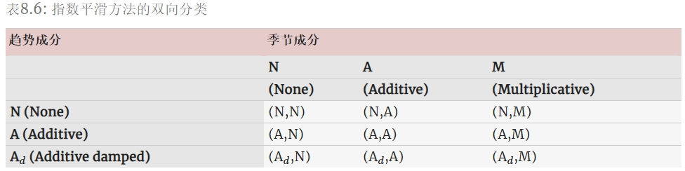

目录

- [指数平滑方法](#指数平滑方法)
    - [简单的指数平滑](#简单的指数平滑)
        - [朴素法和平均值](#朴素法和平均值)
        - [指数平滑](#指数平滑)
            - [指数平滑参数](#指数平滑参数)
            - [加权平均形式](#加权平均形式)
            - [分量形式](#分量形式)
            - [指数平滑的平坦预测](#指数平滑的平坦预测)
        - [平滑参数和初始值的优化](#平滑参数和初始值的优化)
    - [趋势性方法](#趋势性方法)
        - [Holt 线性趋势法](#holt-线性趋势法)
        - [阻尼趋势法](#阻尼趋势法)
    - [季节性方法](#季节性方法)
        - [Holt-Winters 加法模型](#holt-winters-加法模型)
        - [Holt-Winters 乘法模型](#holt-winters-乘法模型)
        - [Holt-Winters 的阻尼法](#holt-winters-的阻尼法)
    - [指数平滑法的分类](#指数平滑法的分类)
- [新息指数平滑状态空间模型](#新息指数平滑状态空间模型)
    - [ETS(A,N,N): 具有加法误差的简单指数平滑](#etsann-具有加法误差的简单指数平滑)
    - [ETS(M,N,N): 具有可乘误差的简单指数平滑](#etsmnn-具有可乘误差的简单指数平滑)
    - [ETS(A,A,N): 具有加法误差的 Holt 线性方法](#etsaan-具有加法误差的-holt-线性方法)
    - [ETS(M,A,N): 具有可乘误差的 Holt 线性方法](#etsman-具有可乘误差的-holt-线性方法)
    - [其他 ETS 模型](#其他-ets-模型)
- [模型估计和选择](#模型估计和选择)
    - [估计 ETS 模型](#估计-ets-模型)
    - [模型选择](#模型选择)
- [使用 ETS 模型预测](#使用-ets-模型预测)
    - [预测点](#预测点)
    - [预测区间](#预测区间)

指数平滑是在 20 世纪 50 年代后期提出的(Brown, 1959; Holt, 1957; Winters, 1960)，
其激发了一些十分成功的预测方法。
使用指数平滑方法生成的预测是过去观测值的加权平均值，
并且随着过去观测值离预测值距离的增大，权重呈指数型衰减。换句话说，观察值越近，相应的权重越高。
该框架能够快速生成可靠的预测结果，并且适用于广泛的时间序列，这是一个巨大的优势并且对于工业应用来说非常重要。

这里分两部分介绍：

* 第一部分介绍了最重要的指数平滑方法的机制，
  以及该方法在预测具有不同特征的时间序列中的应用，
  这有助于我们对这些方法如何运作有一种直观的认识。
  在这种情况下，选择和使用预测方法可能会有点特殊。
  该方法的选择通常基于识别时间序列的关键因素（趋势和季节），
  以及它们应用平滑方法的方式（例如，以加性，阻尼或乘性方式）。
* 第二部分介绍构成指数平滑方法基础的统计模型。
  这些模型与第一部分讨论的方法能够生成相同的点预测，
  同时也能生成预测区间。此外，这个统计框架能在竞争模型之间进行真正的模型选择。

# 指数平滑方法

## 简单的指数平滑

> 单指数平滑

最简单的指数平滑方法自然被称为简单指数平滑(SES)。
这种方法适用于预测没有明显趋势或季节因素的数据。

### 朴素法和平均值

如果数据中没有显示任何明确的趋势或季节性因素，
应该考虑对这样的数据使用朴素预测和平均法进行预测：

* 使用 朴素法，
  对未来的所有预测都等于该序列的最后一个观测值：

    `$$\hat{y}_{T+h|T}=y_{T}, h=1,2,\cdots$$`

    因此，朴素法假设最近的观测值是唯一重要的观测值，并且之前所有的观测值都不提供未来的信息。
    这可以看作是一个加权平均值，其中所有的权重都被赋给了最后一次观测值。

* 使用 平均值，
  所有未来预测值都等于观测数据的简单平均值：

    `$$\hat{y}_{T+h|T}=\frac{1}{T}\sum_{t=1}^{T}y_{t}, h=1,2,\cdots$$`

    因此，平均法假设所有观测值具有同等重要性，并在预测时给予相同的权重。

### 指数平滑

我们经常需要的是在朴素法、平均法这两个极端方法之间的方法。
例如，可能明智的做法是将更大的权重赋到最近的观测值而不是过去的观测值。
这正是简单指数平滑背后的原理。预测值使用加权平均值进行计算，
其中权重随观测时间的久远程度呈指数型下降——最早的观察值被赋予最小的权值：

`$$\hat{y}_{T+1|T}=\alpha y_{T}+\alpha(1-\alpha)y_{T-1}+\alpha(1-\alpha)^{2}y_{T-2}+\cdots \tag{1}$$`

其中：

* `$0 \leq \alpha \leq 1$` 是平滑参数
* 向前一步 `$T+1$` 时刻的预测值是时间序列 `$y_{1}，\cdots，y_{T}$` 中所有观测值的加权平均值
* 权重下降的速度由参数 `$\alpha$` 控制

#### 指数平滑参数

下表展示了在使用简单指数平滑进行预测时，四个不同的 `$\alpha$` 值所对应的观察值的权重。

对于任何合理的样本量，即使 `$\alpha$` 数值很小，权重的总和也应该近似为 1。
对于 0 到 1 之间的任何 `$\alpha$` 值，随着时间向前推移，观察值的权重呈指数型下降，
因此我们称之为“指数平滑”。

* 如果 `$\alpha$` 很小（即接近 0），那么更远的过去的观测值会被赋予更多的权重。
* 如果 `$\alpha$` 很大（即接近 1），则赋予更多的权重给最近的观测值。
* 对于 `$\alpha=1$`，`$\hat{y}_{T+1|T}=y_{T}$` 的极端情况，指数平滑的预测值等于朴素预测值。

下面给出了两种等价形式的简单指数平滑，其中每一种都能推出预测方程式(1)。

#### 加权平均形式

`$T + 1$` 时刻的预测值等于最近的观测值 `$y_{T}$` 和之前的预测值 `$\hat{y}_{T|T-1}$` 之间的加权平均值：

`$$\hat{y}_{T+1|T} = \alpha y_{T} + (1-\alpha)\hat{y}_{T|T-1}$$`

其中 `$0 \leq \alpha \leq 1$` 是平滑参数。

同样地，可以将拟合值写为：

`$$\hat{y}_{t+1|t} = \alpha y_{t} + (1-\alpha)\hat{y}_{t|t-1}$$`

其中 `$t=1,\cdots, T$`。

这个过程必须从某个时刻开始，因此我们将时刻 `$1$` 的第一个拟合值表示为 `$\ell_0$`（我们必须进行估计）。
然后：

`$$\hat{y}_{1} = \ell_0$$`
`$$\hat{y}_{2|1} = \alpha y_{1} + (1-\alpha)\ell_0$$`
`$$\hat{y}_{3|2} = \alpha y_{2} + (1-\alpha)\hat{y}_{2|1}$$`
`$$\hat{y}_{4|3} = \alpha y_{3} + (1-\alpha)\hat{y}_{3|2}$$`
`$$\cdots$$`
`$$\hat{y}_{T|T-1} = \alpha y_{T-1} +(1-\alpha)\hat{y}_{T-1|T-2}$$`
`$$\hat{y}_{T+1|T} = \alpha y_{T} +(1-\alpha)\hat{y}_{T|T-1}$$`

将每个方程带入下一个的方程，可以得到：

`$$\begin{align}
\hat{y}_{3|2} 
&= \alpha y_{2} + (1-\alpha)[\alpha y_{1} + (1-\alpha)\ell_0] \\
&= \alpha y_{2} + \alpha(1-\alpha)y_{1} +(1-\alpha)^{2}\ell_0
\end{align}$$`
`$$\begin{align}
\hat{y}_{4|3}
&= \alpha y_{3} + (1-\alpha)[\alpha y_{2} + \alpha(1-\alpha)y_{1} + (1-\alpha)^{2} \ell_0] \\
&= \alpha y_{3} + \alpha(1-\alpha)y_{2} + \alpha(1-\alpha)^{2}y_{1} + (1-\alpha)^{3} \ell_0
\end{align}$$`
`$$\cdots$$`
`$$\hat{y}_{T+1|T} = \sum_{j=0}^{T-1}\alpha(1-\alpha)^{j}y_{T-j} + (1-\alpha)^{T}\ell_0 \tag{2}$$`

对于较大取值的 `$T$`，方程的最后一项变得很小。因此，加权平均形式可以得到相同的预测方程式。

#### 分量形式

另一种表示形式是分量形式。对于简单的指数平滑，
水平 `$\ell_t$` 是唯一的分量（后面考虑的其他方法也可能包括趋势 `$b_{t}$` 和季节性分量 `$s_{t}$`）。
指数平滑法的分量形式表示包括一个预测方程和该方法中包含的每个分量部分的平滑方程。

简单指数平滑的分量形式由下式给出：

预测方程：

`$$\hat{y}_{t+h|t} = \ell_{t}$$`

平滑方程：

`$$\ell_{t} = \alpha y_{t} + (1 - \alpha) \ell_{t-1}$$`

其中 `$\ell_{t}$` 是时间序列 `$t$` 的级别（或平滑值）。

给定 `$h=1$` 可以得到拟合值，给定 `$t=T$` 给出训练数据之外的真实预测值。
该预测方程表明，`$t+1$` 时刻的预测值是 `$t$` 时刻的估计值。
该水平的平滑方程（通常称为水平方程）给出了该时间序列在每段时间 `$t$` 的估计水平。
如果将分量形式的平滑方程中的 `$\ell_{t}$` 和 `$\ell_{t-1}$` 分别替换为 `$\hat{y}_{t+1|t}$` 和 `$\hat{y}_{t|t-1}$`，
我们将得到加权平均形式的简单指数平滑方程：

`$$\hat{y}_{t+1|t}=\alpha y_{t} + (1-\alpha)\hat{y}_{t|t-1}$$`

简单指数平滑的分量形式并不是特别有用，但它会是我们开始添加其他分量时最简单的形式。

#### 指数平滑的平坦预测

简单的指数平滑具有一个“平坦”的预测函数：

`$$\hat{y}_{T+h|T} = \hat{y}_{T+1|T} = \ell_{T}, h=2, 3, \cdots$$`

也就是说，所有预测值都相同，等于最后一个级别分量。请记住，
只有时间序列没有趋势或季节性分量时，这些预测才适用。

### 平滑参数和初始值的优化

每个指数平滑方法在应用时都需要选择平滑参数和初始值。特别是对于简单的指数平滑，
我们需要选择 `$\alpha$` 和 `$\ell_{0}$` 的值。只要我们知道这些值，
所有的预测值都可以从数据中计算出来。对于后文提到的方法，
通常有多个平滑参数和多个初始分量要选择。

在某些情况下，平滑参数可以进行主观选择—预测者根据以前的经验设定平滑参数的值。
然而，一种更可靠和客观的获得未知参数值的方法是从观测数据中估计它们。

在时间序列回归模型中，可以通过最小化残差平方和（通常称为 SSE 或“误差平方和”）来估计回归模型的系数。
类似地，任何指数平滑方法的未知参数和初始值也可以通过最小化 SSE 来进行估计。
对于 `$t=1,\cdots, T$`，设定残差为 `$e_{t}=y_{t}−\hat{y}_{t|t−1}$`。
因此，我们通过最小化下式来估计未知参数的值和初始值：

`$$SSE = \sum_{t=1}^{T}(y_{t}-\hat{y}_{t|t-1})^{2}=\sum_{t=1}^{T}e_{t}^{2}$$`

与回归情况（通过公式来返回最小化 SSE 的回归系数值）不同，
指数平滑法涉及到一个非线性的最小化问题，因此我们需要适用优化工具来解决。

## 趋势性方法

### Holt 线性趋势法

Holt 将简单指数平滑法扩展到可以预测具有趋势的数据。
该方法包含一个预测方程和两个平滑方程（一个用于水平，一个用于趋势）:

预测方程：

`$$\hat{y}_{t+h|t} = \ell_{t} + h b_{t}$$`

水平方程：

`$$\ell_{t}=\alpha y_{t} + (1-\alpha)(\ell_{t-1} + b_{t-1})$$`

趋势方程：

`$$b_{t} = \beta^{*}(\ell_{t} - \ell_{t-1}) + (1-\beta^{*})b_{t-1}$$`

其中：

* `$\ell_{t}$` 表示在 `$t$` 时刻该时间序列的水平估计值
* `$b_{t}$` 表示该时间序列在 `$t$` 时刻的趋势（斜率）的估计
* `$\alpha$`(`$0 \leq \alpha \leq 1$`) 是水平的平滑参数
* `$\beta^{*}$`(`$0 \leq \beta^{*} \leq 1$`) 是趋势的平滑参数

与简单的指数平滑一样，这里的水平方程表明 `$\ell_{t}$` 是观测值 `$y_{t}$` 和 `$t$` 时刻的向前一步训练预测值的加权平均值，
这里由 `$\ell_{t-1} + b_{t-1}$` 给出。趋势方程表明 `$b_{t}$` 是基于 `$\ell_{t} - \ell_{t-1}$` 和前一个趋势的估计值 `$b_{t-1}$` 在 `$t$` 时刻的估计值的加权平均值。

这里的预测函数不再平坦，而是有趋势的。
向前 `$h$` 步预测值等于上一次估计的水平值加上前一个估计的趋势值的 `$h$` 倍。
因此，预测值是一个关于 `$h$` 的线性函数。

### 阻尼趋势法

Holt 线性趋势法产生的预测值可以显示出来的趋势（增加或减少）。
经验表明，这些方法通常会产生过度预测，尤其是对于更长远的预测而言。
受此启发，Gardner 和 McKenzie 引入了一个参数，可以在未来某些时刻 “平缓” 趋势。
包含平缓趋势的方法已被证明是十分成功的，并且可以说是当许多时间序列需要自动预测时最受欢迎的方法。

除了平滑参数 `$\alpha$` 和 `$\beta^{*}$`（在 Holt 方法中，取值介于 0 和 1 之间），
该方法还包含一个阻尼参数 `$0 < \phi < 1$`：

预测方程：

`$$\hat{y}_{t+h|t} = \ell_{t} + (\phi+\phi^2 + \dots + \phi^{h})b_{t}$$`

水平方程：

`$$\ell_{t} = \alpha y_{t} + (1 - \alpha)(\ell_{t-1} + \phi b_{t-1})$$`

趋势方程：

`$$b_{t} = \beta^*(\ell_{t} - \ell_{t-1}) + (1 -\beta^*)\phi b_{t-1}$$`

如果 `$\phi = 1$`，则该方法与 Holtd 线性趋势法相同。对于 0 和 1 之间的取值，`$\phi$` 平缓了趋势，
使其在将来某个时间接近一个常数。事实上，对于任意 `$0<\phi<1$`，随着 `$h \rightarrow \infty$`，
预测值收敛到 `$\ell_{T} + \phi b_{T}/(1-\phi)$`。这意味着短期预测值有一定的趋势，而长期预测值则保持不变。

实际上，`$\phi$` 很少小于 `$0.8$`，因为阻尼对于较小的值具有非常强的影响。
`$\phi$` 的值接近 `$1$` 意味着包含阻尼系数的模型无法与不包含阻尼系数的模型区分开来。
由于这些原因，我们通常限定 `$\phi$` 的最小值为 `$0.8$`，最大值为 `$0.98$`。

## 季节性方法

Holt(1957) 和 Winters(1960) 将 Holt 方法进行拓展用来捕获季节因素。
Holt-Winters 季节性方法包括预测方程和三个平滑方程——一个用于水平 `$\ell_t$`，
一个用于趋势 `$b_{t}$`，另一个用于季节性分量 `$s_{t}$`，
相应的平滑参数分别为 `$\alpha$`，`$\beta$` 和 `$\gamma$`。
我们用 `$m$` 来表示季节频率，即一年中包含的季节数。例如，季度数据的 `$m=4$`，
月度数据的 `$m=12$`。

这种方法有两种不同的季节性组成部分。

* 当季节变化在该时间序列中大致保持不变时，通常选择加法模型；
    - 在加法模型中，季节性分量在观测序列的尺度上以绝对值表示，在水平方程中，
      时间序列通过减去季节分量进行季节性调整，并且每年的季节性分量加起来大约为零。
* 当季节变化与时间序列的水平成比例变化时，通常选择乘法模型。
    - 在乘法模型中，季节性分量用相对数（百分比）表示，时间序列通过除以季节性分量来进行季节性调整，
      并且每年的季节性分量加起来约为 `$m$`。

### Holt-Winters 加法模型

加法模型分量形式是：

`$$\begin{align*}
  \hat{y}_{t+h|t} &= \ell_{t} + hb_{t} + s_{t+h-m(k+1)} \\
  \ell_{t} &= \alpha(y_{t} - s_{t-m}) + (1 - \alpha)(\ell_{t-1} + b_{t-1})\\
  b_{t} &= \beta^*(\ell_{t} - \ell_{t-1}) + (1 - \beta^*)b_{t-1}\\
  s_{t} &= \gamma (y_{t}-\ell_{t-1}-b_{t-1}) + (1-\gamma)s_{t-m},
\end{align*}$$`

其中：

* `$k$` 是 `$(h-1)/m$` 的整数部分，这保证了用于预测的季节性指数的估计值来自样本的最后一年
* 水平方程 `$\ell_{t}$` 表示在 `$t$` 时刻，
  季节性调整的观察值 `$y_{t} - s_{t-m}$` 与非季节性预测值 `$l_{t-1}+b_{t-1}$` 之间的加权平均值
* 季节性方程 `$s_{t}$` 表示当前季节性指数：`$y_{t}-l_{t-1}-b_{t-1}$` 和去年同一季节（即 `$m$` 个时间段前）的季节性指数之间的加权平均值

季节性分量的方程通常表示为：

`$$s_{t} = \gamma^* (y_{t}-\ell_{t})+ (1-\gamma^*)s_{t-m}$$`

如果用平滑方程中的 `$\ell_{t}$` 代替上述分量形式中的水平，可以得到：

`$$s_{t} = \gamma^*(1-\alpha) (y_{t}-\ell_{t-1}-b_{t-1})+ [1-\gamma^*(1-\alpha)]s_{t-m},$$`

这与我们规定的季节性分量的平滑方程相同，其中 `$\gamma = \gamma^{*}(1-\alpha)$`。
通常的参数限制是 `$0 \leq \gamma^{*} \leq 1$`，可以将其转换为 `$0 \leq \gamma \leq 1-\alpha$`。

### Holt-Winters 乘法模型

乘法模型得分量形式是：

`$$\begin{align*}
  \hat{y}_{t+h|t} &= (\ell_{t} + hb_{t})s_{t+h-m(k+1)} \\
  \ell_{t} &= \alpha \frac{y_{t}}{s_{t-m}} + (1 - \alpha)(\ell_{t-1} + b_{t-1})\\
  b_{t} &= \beta^*(\ell_{t}-\ell_{t-1}) + (1 - \beta^*)b_{t-1}                \\
  s_{t} &= \gamma \frac{y_{t}}{(\ell_{t-1} + b_{t-1})} + (1 - \gamma)s_{t-m}.
\end{align*}$$`

### Holt-Winters 的阻尼法

加法和乘法 Holt-Winters 方法都可以进一步使用阻尼法。
带有阻尼趋势和乘法季节性的 Holt-Winters 方法通常可以为季节数据提供准确的和稳健的预测值：

`$$\begin{align*}
  \hat{y}_{t+h|t} &= \left[\ell_{t} + (\phi+\phi^2 + \dots + \phi^{h})b_{t}\right]s_{t+h-m(k+1)} \\
  \ell_{t} &= \alpha(y_{t} / s_{t-m}) + (1 - \alpha)(\ell_{t-1} + \phi b_{t-1})\\
  b_{t} &= \beta^*(\ell_{t} - \ell_{t-1}) + (1 - \beta^*)\phi b_{t-1}             \\
  s_{t} &= \gamma \frac{y_{t}}{(\ell_{t-1} + \phi b_{t-1})} + (1 - \gamma)s_{t-m}.
\end{align*}$$`

## 指数平滑法的分类

指数平滑法并不局限于前面的提出的这些方法。通过考虑趋势和季节分量的不同组合变化，
可以得到 9 种指数平滑方法。如果每种方法都由一对字母组合 `$(T，S)$` 标记，
分别表示“趋势”和“季节”成分。例如，`$(A，M)$` 是具有加性趋势和乘性季节性的方法；
`$(A_{d}，N)$` 是具有衰减趋势且没有季节性的方法等等。

其中一些方法我们已经知道它们有其他名称：

下表给出了上述 9 种指数平滑方法的递归公式。
每个单元格中包括用于生成 `$h$` 步向前预测的预测公式以及应用该方法的平滑方式：

# 新息指数平滑状态空间模型

这一节将研究基于目前考虑的指数平滑法的统计模型。上表中呈现的指数平滑方法是生成点预测的算法。
本节中的统计模型可以生成相同的点预测，但也可以生成预测区间。统计模型是一个随机的数据生成过程，
可以生成整个预测分布。我们还将描述如何使用时间序列回归模型中介绍的模型选择标准来客观地选择模型。

每个模型由一个描述观测数据的度量方程和一些描述未被观察到的成分或状态（水平、趋势、季节）随时间变化的状态方程组成。
因此，这些模型被称为“状态空间模型”。

对于每种方法，都存在两种模型：一种具有加性误差，另一种具有乘性误差。
如果它们使用相同的平滑参数值，那么由这些模型产生的点预测是相同的。
但是，它们会产生不同的预测区间。

为了区分具有加性误差的模型和具有乘性误差的模型（还要区分模型使用了哪种方法），
在上述表 8.6 的分类中添加了第三个字母。将每个状态空间模型标记为 ETS `$(\cdot, \cdot, \cdot)$`，
分别代表（误差，趋势，季节性），这种标记也可以看作是指数平滑。
使用与表 8.6 中相同的符号，每个成分的可能取值为：
误差 `$= \{A, M\}$`，趋势 `$= \{N, A, A_{d}\}$`，季节性 `$= \{N, A, M\}$`。

## ETS(A,N,N): 具有加法误差的简单指数平滑

简单指数平滑的组成形式：

预测方程：

`$$\hat{y}_{t+1|t}=\ell_{t}$$`

平滑方程：

`$$\ell_{t}=\alpha y_{t} + (1-\alpha)\ell_{t-1}$$`

## ETS(M,N,N): 具有可乘误差的简单指数平滑

## ETS(A,A,N): 具有加法误差的 Holt 线性方法

## ETS(M,A,N): 具有可乘误差的 Holt 线性方法

## 其他 ETS 模型

# 模型估计和选择

## 估计 ETS 模型

## 模型选择

# 使用 ETS 模型预测

## 预测点

通过对 `$t=T+1, \cdots, T+h$` 进行迭代，并设定 `$t>T$` 时所有的 `$\epsilon_{t} = 0$`，
可以从模型中获得点预测。

例如，对于模型 `$ETS(M, A, N)$`，`$y_{T+1}=(\ell_{T} + b_{T})(1+\epsilon_{T+1})$`。
因此 `$\hat{y}_{T+1|T}=\ell_{T} + b_{T}$`。类似地，

`$$\begin{align*}
y_{T+2} &= (\ell_{T+1} + b_{T+1})(1 + \varepsilon_{T+2})\\
        &= \left[
              (\ell_T + b_T) (1+ \alpha\varepsilon_{T+1}) +
              b_T + \beta (\ell_T + b_T)\varepsilon_{T+1}
            \right]
   (1 + \varepsilon_{T+2}).
\end{align*}$$`

因此，`$\hat{y}_{T+2|T} = \ell_{T} + 2b_{T}$`，等等。
这些预测与 Holt 线性方法以及 `$ETS(A,A,N)$` 模型的预测结果相同。
因此，从该方法得到的点预测与以该方法为基础的两个模型的点预测是相同的（假定使用相同的参数值）。 
以这种方式构建的ETS点预测等于预测分布的平均值，具有乘法季节性的模型除外

## 预测区间

统计模型的一大优点是，也可以生成预测区间，这是单独使用点预测方法无法实现的。
使用加法和乘法方法的模型之间的预测区间会有所不同。

对于大多数 ETS 模型，预测区间可以写成：

`$$\hat{y}_{T+h|T} \pm c\sigma_{h}$$`

其中：

* `$c$` 取决于覆盖概率，`$c$` 的值见下表
* `$\sigma_{h}^{2}$` 是预测方差。对于 ETS 模型，`$\sigma_{h}^{2}$` 的公式可能很复杂

| 百分比 | 乘数 |
|-------|-----|
| 50 | 0.67 |
| 55 | 0.76 |
| 60 | 0.84 |
| 65 | 0.93 |
| 70 | 1.04 |
| 75 | 1.15 |
| 80 | 1.28 |
| 85 | 1.44 |
| 90 | 1.64 |
| 95 | 1.96 |
| 96 | 2.05 |
| 97 | 2.17 |
| 98 | 2.33 |
| 99 | 2.58 |

在下表中，给出了加法 ETS 模型的公式：

对于少数 ETS 模型，没有已知的预测区间公式。

